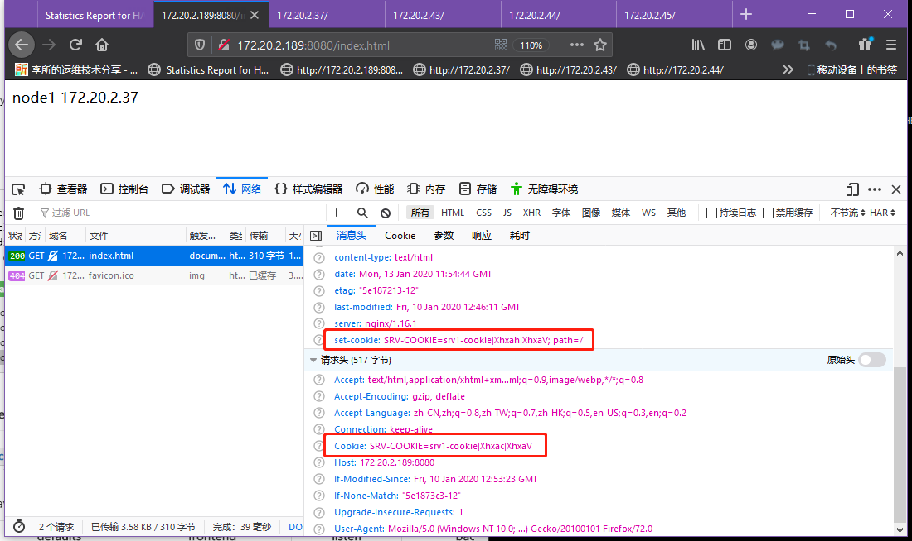
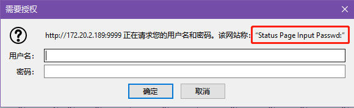
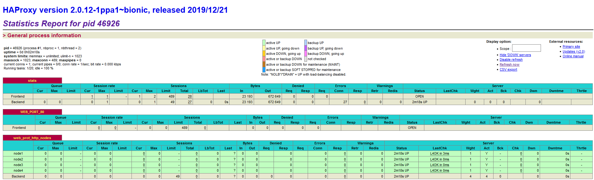
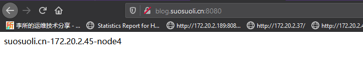
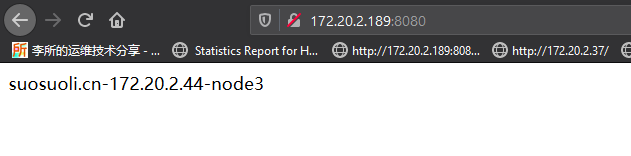
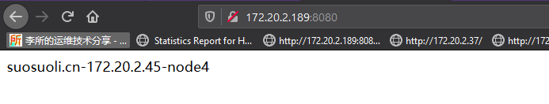
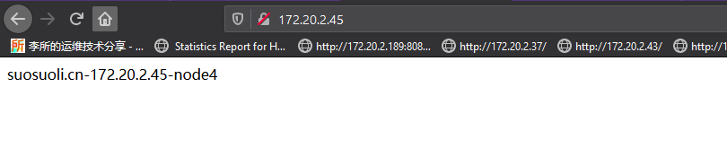
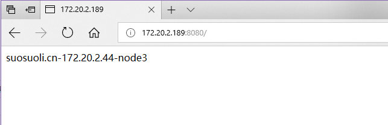

# HAProxy 高级功能与配置

配置和验证的环境看这篇文章:[HAProxy 各种调度算法介绍](https://blog.csdn.net/YouOops/article/details/103950538)

# 一.基于 cookie 的会话保持

使用`cookie`关键字来配置后端服务器基于 cookie 的会话持久连接。

[配置格式](https://cbonte.github.io/haproxy-dconv/2.0/configuration.html#4.2-cookie)

```bash
cookie <name> [ rewrite | insert | prefix ] [ indirect ] [ nocache ]
              [ postonly ] [ preserve ] [ httponly ] [ secure ]
              [ domain <domain> ]* [ maxidle <idle> ] [ maxlife <life> ]
              [ dynamic ]

# name :需要被监控或者修改或者插入到客户端的cookie的名称。该cookie被通过响应头
#       设置"Set-Cookie"发送给客户端。并且被客户端在所有请求头中发送到服务器。

# insert :给参数指明如果客户端还没有允许访问本网站的cookie时由HAProxy在请求头插入
#          配置文件指明的cookie

# indirect :不会向客户端发送服务器已经处理过请求的cookie信息，间接

# nocache :当client和hapoxy之间有缓存时，不缓存cookie
```

配置示例

```bash

listen stats
        mode http
        bind 172.20.2.189:9999
        stats enable
        log global
        stats uri    /haproxy_status
        stats auth   haadmin:stevenux

frontend  WEB_PORT_80
    bind 172.20.2.189:8080
    mode http
    use_backend  web_prot_http_nodes

backend web_prot_http_nodes
    mode   http
    balance roundrobin
    option forwardfor
    cookie SRV-COOKIE insert indirect nocache maxidle 30m maxlife 8h
    server node1 172.20.2.37:80 send-proxy cookie srv1-cookie weight 1 check inter 3000 fall 3 rise 5
    server node2 172.20.2.43:80 cookie srv2-cookie weight 1 check inter 3000 fall 3 rise 5
    server node3 172.20.2.44:80 cookie srv3-cookie weight 1 check inter 3000 fall 3 rise 5
    server node4 172.20.2.45:80 cookie srv4-cookie weight 1 check inter 3000 fall 3 rise 5
```

访问测试--client-node1

```bash
[root@client-node1 ~]# curl --cookie "SRV-COOKIE=srv1-cookie" http://172.20.2.189:8080
node1 172.20.2.37
[root@client-node1 ~]# curl --cookie "SRV-COOKIE=srv4-cookie" 172.20.2.189:8080
node4 172.20.2.45
[root@client-node1 ~]# curl --cookie "SRV-COOKIE=srv3-cookie" 172.20.2.189:8080
node3 172.20.2.44
[root@client-node1 ~]# curl --cookie "SRV-COOKIE=srv2-cookie" 172.20.2.189:8080
```

访问测试--物理机 172.20.1.1


# 二.HAProxy 状态页配置和使用

HAProxy 提供了 WEB 信息界面，用来查看和管理后端服务器的状态信息。在配置
文件中使用`stats`关键字指明各个控制状态页的参数。

## 2.1 状态页配置选项

stats 关键字配置参数有下面的功能

```bash
stats enable          # 基于默认的参数启用stats page
# 默认参数使用如下：
  - stats uri   : /haproxy?stats
  - stats realm : "HAProxy Statistics"
  - stats auth  : no authentication
  - stats scope : no restriction

stats hide-version    # 隐藏HAProxy版本
stats refresh <delay> # 设定WEB页面自动刷新时间间隔
stats uri <prefix>    # 自定义stats page uri，默认值：/haproxy?stats
stats realm <realm>   # 账户认证时的提示信息，示例：stats realm : HAProxy\ Statistics
stats auth <user>:<passwd>         # 认证时的账号和密码，可使用多次，默认：no authentication
stats admin { if | unless } <cond> # 启用stats page中的管理功能
```

## 2.2 启用状态页配置

配置示例

```bash
listen stats
        mode http
        log global
        bind 172.20.2.189:9999
        stats enable
        stats refresh 5s
        stats realm Status\ Page\ Input\ Passwd:
        stats uri    /haproxy_status
        stats auth   haadmin1:stevenux
        stats auth   haadmin2:s3cr3tpass
```

访问测试

如上图验证的界面，提示信息为`stats realm`定义



## 2.3 状态页参数说明

非表格中的状态信息说明

```bash
pid = 46948 (process #1, nbproc = 1, nbthread = 2)
# pid 为当前进程pid号
# process 为当前进程编号
# nbproc 进程数
# nbthread 为线程数

uptime = 0d 0h02m26s
# HAProxy 启动以来经过的时间

system limits: memmax = unlimited; ulimit-n = 1023
maxsock = 1023; maxconn = 489; maxpipes = 0
# memmax 内存使用限制为无限制
# ulimit-n 最大打开文件数为1023
# maxsock 最大的socket连接数
# maxconn 单个进程最大的并发连接数
# maxpipes 最大的管道打开数

current conns = 1; current pipes = 0/0; conn rate = 1/sec; bit rate = 0.000 kbps
# current conns 当前进程的连接数
# current pipes 当前进程打开的管道数
# conn rate 连接速率
# bit rate 比特速率
Running tasks: 1/20; idle = 100 %

# 后端服务器显示颜色对应的状态
active UP：# 在线服务器
backup UP：# 标记为backup的服务器
active UP, going down：# 监测未通过正在进入down过程
backup UP, going down：# 备份服务器正在进入down过程
active DOWN, going up：# down的服务器正在进入up过程
backup DOWN, going up：# 备份服务器正在进入up过程
active or backup DOWN：# 在线的服务器或者是backup的服务器已经转换成了down状态
not checked：# 标记为不监测的服务器
active or backup DOWN for maintenance (MAINT) # active或者backup服务器人为下线的
active or backup SOFT STOPPED for maintenance # active或者backup被人为软下线(人为将weight改成0)
```

表格中的信息主要说明各后端服务器的详细状态
|ession rate(每秒的连接会话信息)| Errors(错误统计信息)|
|:---|:---|
cur:每秒的当前会话数量|Req:错误请求量
max:每秒新的最大会话数量|conn:错误链接量
limit:每秒新的会话限制量|Resp:错误响应量

| sessions(会话信息) | Warnings(警告统计信息) |
| :----------------- | :--------------------- |
| cur:当前会话量     | Retr:重新尝试次数      |
| max:最大会话量     | Redis:再次发送次数     |
| limit: 限制会话量  | -                      |
| Total:总共会话量   | -                      |

| Server(real server 信息)             |
| :----------------------------------- |
| LBTot:选中一台服务器所用的总时间     |
| Status:后端机的状态，包括 UP 和 DOWN |
| Last：和服务器的持续连接时间         |
| LastChk:持续检查后端服务器的时间     |
| Wght:权重                            |

| Bytes(流量统计)                      |
| :----------------------------------- |
| Act:活动链接数量                     |
| In:网络的字节输入总量                |
| Bck:备份的服务器数量                 |
| Out:网络的字节输出总量               |
| Chk:心跳检测时间                     |
| Dwn:后端服务器连接后都是 DOWN 的数量 |

| Denied(拒绝统计信息)      |
| :------------------------ |
| Dwntme:总的 downtime 时间 |
| Req:拒绝请求量            |
| Thrtle:server 状态        |
| Resp:拒绝回复量           |

## 2.4 修改报文配置

在 http 模式下，基于实际需求修改客户端的请求报文与响应报文，通过 reqadd
和 reqdel 在请求报文添加删除字段，通过 rspadd 与 rspidel 在响应报文中添
加与删除字段。

在请求报文尾部添加指定首部

```bash
reqadd <string> [{if | unless} <cond>]
```

从请求报文中删除匹配正则表达式的首部

```bash
reqdel <search> [{if | unless} <cond>]
reqidel <search> [{if | unless} <cond>]
```

在响应报文尾部添加指定首部

```bash
rspadd <string> [{if | unless} <cond>]
```

示例

```bash
rspadd X-Via:\ HAPorxy
```

从响应报文中删除匹配正则表达式的首部

```bash
  rspdel  <search> [{if | unless} <cond>]
  rspidel <search> [{if | unless} <cond>]
```

示例：

```bash
  rspidel  server.*        # 从响应报文删除server信息
  rspidel X-Powered-By:.*  # 从响应报文删除X-Powered-By信息
```

## 2.5 web 服务器状态监测

HAProxy 可以基于不同的监测方式，对后端 real server 进行状态监测

```bash
option httpchk
option httpchk <uri>
option httpchk <method> <uri>
option httpchk <method> <uri> <version>
```

### 2.5.1 三种状态监测方式

三种

: 基于四层的传输端口做状态监测
: 基于指定 URI 做状态监测
: 基于指定 URI 的 request 请求头部内容做状态监测

### 2.5.2 配置示例

```bash
listen  web_host
  bind 192.168.7.101:80
  mode http
  balance  roundrobin
  log global
  option httplog
  #option httpchk GET /app/monitor/check.html HTTP/1.0
  option httpchk HEAD  /app/monitor/check.html HTTP/1.0\r\nHost:\ 192.168.7.102
  cookie  SERVER-COOKIE  insert  indirect nocache
  server web1 192.168.7.103:80  cookie web1 check inter 3000 fall 3 rise 5
  server web2 192.168.7.104:80  cookie web2 check inter 3000 fall 3 rise 5
```

# 三.HAProxy 日志配置和使用

HAProxy 可以配置将日志记录到指定的主机或者日志文件中，需要配合 Rsyslog
服务使用。

## 3.1 日志配置

HAProxy 端的配置

```bash
root@ubuntu-suosuoli-node1:~# vim /etc/haproxy/haproxy.cfg

global
        #log /dev/log   local0
        #log /dev/log   local1 notice
        log 127.0.0.1 local6 info
        ......
listen stats
        mode http
        log global
        bind 172.20.2.189:9999
        stats enable
        stats refresh 5s
        stats uri    /haproxy_status
        stats realm  Status\ Page\ Input\ Passwd:
        stats auth   haadmin1:stevenux
        stats auth   haadmin2:s3cr3tpass

frontend  WEB_PORT_80
    bind 172.20.2.189:8080
    mode http
    use_backend  web_prot_http_nodes

backend web_prot_http_nodes
    mode   http
    log global
    balance roundrobin
    option forwardfor
    cookie SRV-COOKIE insert indirect nocache maxidle 30m maxlife 8h
    server node1 172.20.2.37:80 send-proxy cookie srv1-cookie weight 1 check inter 3000 fall 3 rise 5
    server node2 172.20.2.43:80 cookie srv2-cookie weight 1 check inter 3000 fall 3 rise 5
    server node3 172.20.2.44:80 cookie srv3-cookie weight 1 check inter 3000 fall 3 rise 5
    server node4 172.20.2.45:80 cookie srv4-cookie weight 1 check inter 3000 fall 3 rise 5

root@ubuntu-suosuoli-node1:~# systemctl restart rsyslog.service
```

## 3.2 Rsyslog 配置

Rsyslog 端配置，此处 Rsyslog 和 HAProxy 在同一台机器

```bash
root@ubuntu-suosuoli-node1:~# vim /etc/rsyslog.conf
# provides UDP syslog reception
module(load="imudp")
input(type="imudp" port="514")
local6.*  /var/log/haproxy.log
......
root@ubuntu-suosuoli-node1:~# systemctl restart rsyslog.service
```

## 3.3 验证日志

在物理主机 171.20.1.1 访问状态页面，测试日志

```bash
root@ubuntu-suosuoli-node1:~# tail -f /var/log/haproxy.log
2020-01-13T21:39:26+08:00 localhost haproxy[47072]: 172.20.1.1:57926 [13/Jan/2020:21:39:26.088] stats stats/<STATS> 0/0/0/0/1 200 24731 - - LR-- 1/1/0/0/0 0/0 "GET /haproxy_status HTTP/1.1"
Jan 13 21:39:26 localhost haproxy[47072]: 172.20.1.1:57926 [13/Jan/2020:21:39:26.088] stats stats/<STATS> 0/0/0/0/1 200 24731 - - LR-- 1/1/0/0/0 0/0 "GET /haproxy_status HTTP/1.1"
2020-01-13T21:39:26+08:00 localhost haproxy[47072]: 172.20.1.1:57926 [13/Jan/2020:21:39:26.243] stats stats/<STATS> 0/0/0/1/1 200 24731 - - LR-- 1/1/0/0/0 0/0 "GET /haproxy_status HTTP/1.1"
Jan 13 21:39:26 localhost haproxy[47072]: 172.20.1.1:57926 [13/Jan/2020:21:39:26.243] stats stats/<STATS> 0/0/0/1/1 200 24731 - - LR-- 1/1/0/0/0 0/0 "GET /haproxy_status HTTP/1.1"
2020-01-13T21:39:26+08:00 localhost haproxy[47072]: 172.20.1.1:57926 [13/Jan/2020:21:39:26.408] stats stats/<STATS> 0/0/0/0/2 200 24731 - - LR-- 1/1/0/0/0 0/0 "GET /haproxy_status HTTP/1.1"
Jan 13 21:39:26 localhost haproxy[47072]: 172.20.1.1:57926 [13/Jan/2020:21:39:26.408] stats stats/<STATS> 0/0/0/0/2 200 24731 - - LR-- 1/1/0/0/0 0/0 "GET /haproxy_status HTTP/1.1"
...
```

## 3.4 自定义日志

HAProxy 允许用户自定义日志，以将特定信息记录在日志。

### 3.4.1 配置参数说明

```bash
capture cookie <name> len <length>          # 捕获请求和响应报文中的 cookie并记录日志
capture request header <name> len <length>  # 捕获请求报文中指定的首部内容和长度并记录日志
capture response header <name> len <length> # 捕获响应报文中指定的内容和长度首部并记录日志

## 如如如如如如如
capture request header Host len  256
capture request header User-Agent len 512
capture request header Referer len 15
```

### 3.4.2 配置示例

在状态页面配置日志格式

```bash
root@ubuntu-suosuoli-node1:~# vim /etc/haproxy/haproxy.cfg
global
        #log /dev/log   local0
        #log /dev/log   local1 notice
        log 127.0.0.1 local6 info
        .......
listen stats
        mode http
        log global
        bind 172.20.2.189:9999
        option httplog
        cookie SRV-COOKIE insert indirect nocache maxidle 30m maxlife 8h
        capture request header X-Forwarded-For len 15
        capture request header User-Agent len 256
        stats enable
        stats refresh 5s
        stats uri    /haproxy_status
        stats realm  Status\ Page\ Input\ Passwd:
        stats auth   haadmin1:stevenux
        stats auth   haadmin2:s3cr3tpass
......
```

### 3.4.3 验证日志格式

物理机 172.20.1.1 访问状态页面，验证

```bash
root@ubuntu-suosuoli-node1:~# tail -f /var/log/haproxy.log
......
Jan 13 21:51:43 localhost haproxy[47212]: 172.20.1.1:58236 [13/Jan/2020:21:51:43.406] stats stats/<STATS> 0/0/0/0/2 200 25009 - - LRNN 2/1/0/0/0 0/0 {|Mozilla/5.0 (Windows NT 10.0; Win64; x64; rv:72.0) Gecko/20100101 Firefox/72.0} "GET /haproxy_status HTTP/1.1"
2020-01-13T21:51:44+08:00 localhost haproxy[47212]: 172.20.1.1:58236 [13/Jan/2020:21:51:44.781] stats stats/<STATS> 0/0/0/1/2 200 25012 - - LRNN 2/1/0/0/0 0/0 {|Mozilla/5.0 (Windows NT 10.0; Win64; x64; rv:72.0) Gecko/20100101 Firefox/72.0} "GET /haproxy_status HTTP/1.1"
Jan 13 21:51:44 localhost haproxy[47212]: 172.20.1.1:58236 [13/Jan/2020:21:51:44.781] stats stats/<STATS> 0/0/0/1/2 200 25012 - - LRNN 2/1/0/0/0 0/0 {|Mozilla/5.0 (Windows NT 10.0; Win64; x64; rv:72.0) Gecko/20100101 Firefox/72.0} "GET /haproxy_status HTTP/1.1"
2020-01-13T21:51:44+08:00 localhost haproxy[47212]: 172.20.1.1:58236 [13/Jan/2020:21:51:44.813] stats stats/<NOSRV> 0/-1/-1/-1/0 503 221 - - SCIN 2/1/0/0/0 0/0 {|Mozilla/5.0 (Windows NT 10.0; Win64; x64; rv:72.0) Gecko/20100101 Firefox/72.0} "GET /favicon.ico HTTP/1.1"
Jan 13 21:51:44 localhost haproxy[47212]: 172.20.1.1:58236 [13/Jan/2020:21:51:44.813] stats stats/<NOSRV> 0/-1/-1/-1/0 503 221 - - SCIN 2/1/0/0/0 0/0 {|Mozilla/5.0 (Windows NT 10.0; Win64; x64; rv:72.0) Gecko/20100101 Firefox/72.0} "GET /favicon.ico HTTP/1.1"
......
```

# 四.HAProxy 的 ACL 使用

HAProxy 支持 ACL：访问控制列表(Access Control Lists)是一种基于包过滤的
访问控制技术，它可以根据设定的条件对经过服务器传输的数据包进行过滤(条件匹配)，
即对接收到的报文进行匹配和过滤，基于请求报文头部中的源地址、源端口、目标地址、
目标端口、请求方法、URL、文件后缀等信息内容进行匹配并执行进一步操作，比如允许
其通过或丢弃。

实际上 ACL 的支持是由于 HAProxy 可以从客户端的请求头、服务器中的响应头、客户端
和服务器信息或者其它环境变量中提取数据，获取数据的这个动作被称为`获取一个样本`，
获取到这些样本后就可以拿其和预定义的模式进行匹配，并根据匹配结果进行相应的动作。
这些动作的组合就成了 HAProxy 的访问控制。这些动作可以是：拒绝某个请求、选择某个
后端服务器或者添加一个头部字段。

[ACL 官方文档](http://cbonte.github.io/haproxy-dconv/2.0/configuration.html#7)

## 4.1 ACL 配置选项

| 关键字 | 选项        |               |          |            |              |
| :----- | :---------- | :------------ | :------- | :--------- | :----------- |
| acl    | \<aclname\> | \<criterion\> | [flags]  | [operator] | [\<value\>]  |
| acl    | 名称        | 匹配规范      | 匹配模式 | 具体操作符 | 操作对象类型 |

### 4.1.1 ACL-name

ACL 名称，可以使用大字母 A-Z 小写字母 a-z 数字 0-9 冒号：点.中横线和下划线，
并且严格区分大小写，如 Image_site 和 image_site 完全是两个 acl。

```bash
acl   image_service hdr_dom(host)   -i   img.suosuoli.cn
```

### 4.1.2 ACL-criterion

ACL 的匹配规范

```bash
hdr([<name> [，<occ>]])：完全匹配字符串,header 的指定信息
hdr_beg([<name> [，<occ>]])：前缀匹配，header 中指定匹配内容的 begin
hdr_end([<name> [，<occ>]])：后缀匹配，header 中指定匹配内容 end
hdr_dom([<name> [，<occ>]])：域匹配，header 中的 domain name
hdr_dir([<name> [，<occ>]])：路径匹配，header 的 uri 路径
hdr_len([<name> [，<occ>]])：长度匹配，header 的长度匹配
hdr_reg([<name> [，<occ>]])：正则表达式匹配，自定义表达式(regex)模糊匹配
hdr_sub([<name> [，<occ>]])：子串匹配，header 中的 uri 模糊匹配
```

```bash
dst       #目标IP
dst_port  #目标PORT

src       # 源IP
src_port  # 源PORT
```

示例

```bash
hdr(<string>) 用于测试请求头部首部指定内容
hdr_dom(host)  请求的host名称，如 www.magedu.com
hdr_beg(host)  请求的host开头，如 www.   img.   video.   download.   ftp.
hdr_end(host)  请求的host结尾，如 .com   .net   .cn
path_beg   请求的URL开头，如/static、/images、/img、/css
path_end   请求的URL中资源的结尾，如 .gif  .png  .css  .js  .jpg  .jpeg
```

有些功能是类似的，比如以下几个都是匹配用户请求报文中 host 的开头是不是 www：

```bash
acl short_form hdr_beg(host) www.
acl alternate1 hdr_beg(host) -m beg www.
acl alternate2  hdr_dom(host) -m beg www.
acl alternate3  hdr(host)     -m beg www.
```

### 4.1.3 ACL-flags

ACL 匹配模式
: `-i` 不区分大小写
: `-m` 使用指定的 pattern 匹配方法
: `-n` 不做 DNS 解析
: `-u` 禁止 acl 重名，否则多个同名 ACL 匹配或关系

### 4.1.4 ACL-operator

ACL 操作符

整数比较：eq、ge、gt、le、lt
字符比较：

```bash
exact match (-m str) :字符串必须完全匹配模式
substring match (-m sub) :在提取的字符串中查找模式，如果其中任何一个被发现，ACL 将匹配
prefix match (-m beg) :在提取的字符串首部中查找模式，如果其中任何一个被发现，ACL 将匹配
suffix match (-m end) :将模式与提取字符串的尾部进行比较，如果其中任何一个匹配，则 ACL 进行匹配
subdir match (-m dir) :查看提取出来的用斜线分隔（“/”）的字符串，如果其中任何一个匹配，则 ACL 进行匹配
domain match (-m dom) :查找提取的用点（“.”）分隔字符串，如果其中任何一个匹配，则 ACL 进行匹配
```

### 4.1.5 ACL-value

value 的类型
The ACL engine can match these types against patterns of the following types :

```bash
- Boolean # 布尔类型的值
- integer or integer range # 整数或整数范围，比如用于匹配端口范围
- IP address / network # IP 地址或 IP 范围, 192.168.0.1 ,192.168.0.1/24
- string--> www.suosuoli.cn
  exact –精确比较
  substring—子串
  suffix-后缀比较
  prefix-前缀比较
  subdir-路径， /wp-includes/js/jquery/jquery.js
  domain-域名，www.suosuoli.cn
- regular expression # 正则表达式
- hex block # 16 进制
```

## 4.2 ACL 调用

调用 ACL 时可以使用基本的逻辑与,或，非等关系来匹配多个样本

- 与：隐式（默认）使用
- 或：使用"or" 或 "||"表示
- 否定：使用"!" 表示

示例：

```bash
# if后面的即为定义的ACL名称，可以是一个或多个
if valid_src valid_port        # 与关系,A 和 B 都要满足为 true
if invalid_src || invalid_port # 或，A 或者 B 满足一个为 true
if ! invalid_src               # 非，取反，A 和 B 哪个也不满足为 true
```

## 4.3 ACL 示例

### 4.3.1 域名匹配

可以匹配用户访问的域名来将其请求调度到某后端服务器。

```bash
frontend  WEB_PORT_80
    bind 172.20.2.189:8080
    mode http
    use_backend  web_prot_http_nodes

    acl acl1 hdr_dom(host) blog.suosuoli.cn  # 定义ACL
    use_backend  suosuoli_host if acl1  # 如果ACL(acl1)匹配，(即样本hdr_dom(host) 和                                              # blog.suosuoli.cn匹配)则挑选suosuoli_host后端服务器处理请求
    default_backend default_host

backend default_host
        mode http
        server host1 172.20.2.44:80 check inter 2000 fall 3 rise 5

backend suosuoli_host  # suosuoli_host后端服务器组
        mode http
        server host1 172.20.2.45:80 check inter 2000 fall 3 rise 5
```




### 4.3.2 基于源 IP 或子网调度

```bash
frontend  WEB_PORT_80
    bind 172.20.2.189:8080
    mode http
   # use_backend  web_prot_http_nodes

    #acl acl1 hdr_dom(host) blog.suosuoli.cn
    acl ip_range_acl src 172.20.1.0/24 172.20.2.44  # 如果客户端源地址来自172.20.1.0/24网段或
                                                    # 者172.20.2.44就将请求转发给suosuoli_host服务器组
    use_backend  suosuoli_host if ip_range_acl
    # block  if  ip_range_acl     # 拒绝该请求
    default_backend default_host

backend default_host
        mode http
        server host1 172.20.2.44:80 check inter 2000 fall 3 rise 5

backend suosuoli_host
        mode http
        server host1 172.20.2.45:80 check inter 2000 fall 3 rise 5
```

172.20.1.1 访问测试


172.20.2.44 访问测试

```bash
[root@node3 ~]# curl 172.20.2.189:8080
suosuoli.cn-172.20.2.45-node4
[root@node3 ~]# curl 172.20.2.189:8080
suosuoli.cn-172.20.2.45-node4
[root@node3 ~]# curl 172.20.2.189:8080
suosuoli.cn-172.20.2.45-node4
```

172.20.2.195 访问测试

```bash
[root@server-node1 ~]# curl 172.20.2.189:8080
suosuoli.cn-172.20.2.44-node3
[root@server-node1 ~]# curl 172.20.2.189:8080
suosuoli.cn-172.20.2.44-node3
```

### 4.3.3 匹配浏览器类型

匹配客户端浏览器，将不同类型的浏览器调动至不同的服务器组

```bash
frontend  WEB_PORT_80
    bind 172.20.2.189:8080
    mode http
   # use_backend  web_prot_http_nodes

    #acl acl1 hdr_dom(host) blog.suosuoli.cn
    #acl ip_range_acl src 172.20.1.0/24 172.20.2.44

    # 匹配FireFox浏览器，将其请求调度给172.20.2.45
    acl user-agent-acl hdr(User-Agent) -m sub -i "Mozilla/5.0 (Windows NT 10.0; Win64; x64; rv:72.0) Gecko/20100101 Firefox/72.0"
    redirect prefix http://172.20.2.45 if user-agent-acl
    #use_backend  suosuoli_host if ip_range_acl
    default_backend default_host

backend default_host
        mode http
        server host1 172.20.2.44:80 check inter 2000 fall 3 rise 5

backend suosuoli_host
        mode http
        server host1 172.20.2.45:80 check inter 2000 fall 3 rise 5
```

可以看到 FireFox 浏览器的请求被调度到 172.20.2.45


Edge 浏览器的请求被调度到 172.20.2.44


同样，curl 浏览器被调度到 172.20.2.44

```bash
[root@server-node1 ~]# curl 172.20.2.189:8080
suosuoli.cn-172.20.2.44-node3
[root@server-node1 ~]# curl 172.20.2.189:8080
suosuoli.cn-172.20.2.44-node3
```

### 4.3.4 基于文件后缀名实现动静分离

```bash
frontend  WEB_PORT_80
    bind 172.20.2.189:8080
    mode http
    acl php_handle path_end -i .php
    use_backend server_php if php_handle

    acl image_handle path_end -i .jpg .webp .jpeg .gif .png
    use_backend server_image if image_handle
    #use_backend  suosuoli_host if ip_range_acl
    default_backend default_host

backend server_php
        mode http
        server host1 172.20.2.44:80 check inter 2000 fall 3 rise 5

backend server_image
        mode http
        server host1 172.20.2.45:80 check inter 2000 fall 3 rise 5
```

访问测试

```bash
curl http://172.20.2.189:8080/php/test.php
curl http://172.20.2.189:8080/images/test.png
```

### 4.3.5 匹配访问路径实现动静分离

```bash
frontend  WEB_PORT_80
    bind 172.20.2.189:8080
    mode http
    acl static_handle path_beg -i /static /images /javascript
    use_backend server_static if static_handle

    #acl image_handle path_end -i .jpg .webp .jpeg .gif .png
    #use_backend server_image if image_handle
    default_backend default_host

backend server_php
        mode http
        server host1 172.20.2.44:80 check inter 2000 fall 3 rise 5

backend server_static
        mode http
        server host1 172.20.2.45:80 check inter 2000 fall 3 rise 5
```

访问测试

```bash
curl http://172.20.2.189:8080/static/001.png
```

### 4.3.6 基于 ACL 的 HTTP 访问控制

```bash
frontend  WEB_PORT_80
    bind 172.20.2.189:8080
    mode http
    acl php_handle path_end -i .php
    use_backend server_php if php_handle

    acl image_handle path_end -i .jpg .webp .jpeg .gif .png
    use_backend server_image if image_handle
    #use_backend  suosuoli_host if ip_range_acl

    acl deny_vicious_guy src 172.20.1.1
    http-request deny if deny_vicious_guy
    http-request allow
    default_backend default_host

backend server_php
        mode http
        server host1 172.20.2.44:80 check inter 2000 fall 3 rise 5

backend server_image
        mode http
        server host1 172.20.2.45:80 check inter 2000 fall 3 rise 5
```

## 4.4 预定义的 ACL 使用

HAProxy 提供一下预定义的 ACL

| ACL name        | Equivalent to                | Usage                            |
| :-------------- | :--------------------------- | :------------------------------- |
| FALSE           | always\*false                | never match                      |
| HTTP            | req_proto_http               | match if protocol is valid HTTP  |
| HTTP_1.0        | req_ver 1.0                  | match HTTP version 1.0           |
| HTTP_1.1        | req_ver 1.1                  | match HTTP version 1.1           |
| HTTP_CONTENT    | hdr_val(content-length) gt 0 | match an existing content-length |
| HTTP\*URL_SLASH | url_beg /                    | match URL beginning with "/"     |
| HTTP_URL_STAR   | url \*                       | match URL equal to "\*"          |
| LOCALHOST       | src 127.0.0.1/8              | match connection from local host |
| METH_CONNECT    | method CONNECT               | match HTTP CONNECT method        |
| METH_DELETE     | method DELETE                | match HTTP DELETE method         |
| METH_GET        | method GET HEAD              | match HTTP GET or HEAD method    |
| METH_HEAD       | method HEAD                  | match HTTP HEAD method           |
| METH_OPTIONS    | method OPTIONS               | match HTTP OPTIONS method        |
| METH_POST       | method POST                  | match HTTP POST method           |
| METH_PUT        | method PUT                   | match HTTP PUT method            |
| METH_TRACE      | method TRACE                 | match HTTP TRACE method          |
| RDP_COOKIE      | req_rdp_cookie_cnt gt 0      | match presence of an RDP cookie  |
| REQ_CONTENT     | req_len gt 0                 | match data in the request buffer |
| TRUE            | always_true                  | always match                     |
| WAIT_END        | wait_end                     | wait for end of content analysis |

使用预定于的 ACL

```bash
listen  web_host
  bind 192.168.7.101:80
  mode http
  balance  roundrobin
  log global
  option httplog

  acl static_path  path_beg  -i  /static /images /javascript

  # 如果使用HTTP/1.1协议，并且访问静态资源，就调度到static_path_host服务器组
  use_backend static_path_host if  HTTP_1.1 TRUE static_path
  default_backend default_web

backend php_server_host
  mode http
  server web1 192.168.7.103 check inter 2000 fall 3 rise 5

backend static_path_host
  mode http
  server web1 192.168.7.104 check inter 2000 fall 3 rise 5

backend default_web
  mode http
  server web1 192.168.7.102:80 check inter 2000 fall 3 rise 5
```

# 五.自定义 HAProxy 错误界面

对错误界面进行重定向，以便显示比较有亲和力的页面，安慰客户。

## 5.1 基于错误页面文件实现

```bash
defaults
#option  forwardfor
#no option http-use-htx
#...... #以下三行
errorfile 500  /usr/local/haproxy/html/500.html
errorfile 502  /usr/local/haproxy/html/502.html
errorfile 503  /usr/local/haproxy/html/503.html
```

## 5.2 基于 HTTP 重定向实现

```bash
defaults
#option http-keep-alive
#option  forwardfor
#no option http-use-htx
#...... 以下一行
errorloc 503  http://192.168.7.102/error_page/503.html
```

# 六.HAProxy 四层负载

HAProxy 的四层负载转发可针对有特殊访问的应用场景，如下面的应用：

```bash
Memcached
Redis
MySQL
RabbitMQ
```

## 6.1 四层负载示例

```bash
listen redis-port
    bind 192.168.7.102:6379
    mode tcp
    balance leastconn
    server server1 192.168.7.104:6379 check
    server server1 192.168.7.103:6379 check backup
```

## 6.2 使用 ACL 进行四层访问控制

```bash
listen  web_host
  bind 192.168.7.101:80
  mode http
  balance  roundrobin
  log global
  option httplog

  acl static_path  path_beg  -i  /static /images /javascript
  use_backend static_path_host if  HTTP_1.1 TRUE static_path

  acl invalid_src src 192.168.1.0/24 192.168.7.102
  tcp-request connection reject if invalid_src

  default_backend default_web

backend php_server_host
  mode http
  server web1 192.168.7.103 check inter 2000 fall 3 rise 5

backend static_path_host
  mode http
  server web1 192.168.7.104 check inter 2000 fall 3 rise 5

backend default_web
  mode http
  server web1 192.168.7.102:80 check inter 2000 fall 3 rise 5
```

## 6.3 HAProxy 的压缩功能配置

对响应给客户端的报文进行压缩，以节省网络带宽，但是会占用部分 CPU 性能

### 6.3.1 配置项说明

```bash
compression algo # 启用http协议中的压缩机制，常用算法有gzip deflate
    identity    # 调试使用的压缩方式
    gzip        # 常用的压缩方式，与各浏览器兼容较好
    deflate     # 有些浏览器不支持
    raw-deflate # 新出的压缩方式
compression type # 要压缩的文件类型
```

### 6.3.2 配置示例

```bash
listen  web_host
  bind 192.168.7.101:80
  mode http
  balance  roundrobin
  log global
  option httplog
  #capture request header X-Forwarded-For len 15
  #capture request header User-Agent len 512
  compression algo gzip deflate
  compression type compression type text/plain text/html text/css text/xml text/javascript application/javascript
  cookie  SERVER-COOKIE  insert  indirect nocache
  server web1 192.168.7.103:80  cookie web1 check inter 3000 fall 3 rise 5
  server web2 192.168.7.104:80  cookie web2 check inter 3000 fall 3 rise 5
```

# 七. HAProxy 实现 HTTPS

配置 HAProxy 支持 https 协议：

支持 ssl 会话；

```bash
bind \*:443 ssl crt /PATH/TO/SOME_PEM_FILE
crt 证书文件为 PEM 格式，且同时包含证书和所有私钥
        cat demo.crt demo.key > demo.pem
```

把 80 端口的请求重向定 443

```bash
bind \*:80
redirect scheme https if !{ ssl_fc }
```

向后端传递用户请求的协议和端口（frontend 或 backend）

```bash
http_request set-header X-Forwarded-Port %[dst_port]
http_request add-header X-Forwared-Proto https if { ssl_fc }
```

## 7.1 证书

```bash
# mkdir /usr/local/haproxy/certs
# cd /usr/local/haproxy/certs
# openssl  genrsa -out haproxy.key 2048
# openssl  req -new -x509 -key haproxy.key  -out haproxy.crt -subj "/CN=www.suosuoli.cn"
# cat haproxy.key  haproxy.crt  > haproxy.pem
# openssl  x509 -in  haproxy.pem -noout -text # 查看证书
```

## 7.2 HTTPS 配置

```bash
#web server http
frontend  web_server-http
  bind 192.168.7.101:80
  redirect scheme https if !{ ssl_fc }
  mode  http
  use_backend web_host

#web server https
frontend  web_server-https
  bind 192.168.7.101:443 ssl crt  /usr/local/haproxy/certs/haproxy.pem
  mode  http
  use_backend web_host


backend default_host
    mode http
    server web1 192.168.7.102:80 check inter 2000 fall 3 rise 5

backend web_host
    mode http
    http-request set-header X-Forwarded-Port %[dst_port]
    http-request add-header X-Forwarded-Proto https if { ssl_fc }
    server web1 192.168.7.103:80 check inter 2000 fall 3 rise 5
    server web2 192.168.7.104:80 check inter 2000 fall 3 rise 5
```

## 7.3 验证

`略略略略略......................................................`
