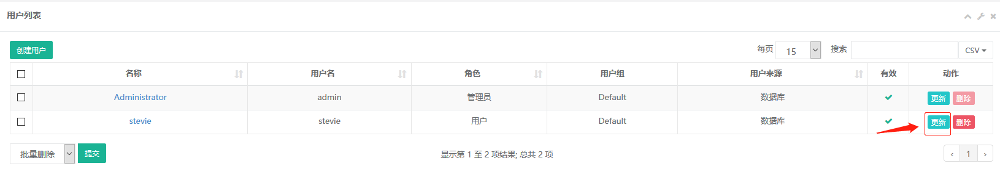
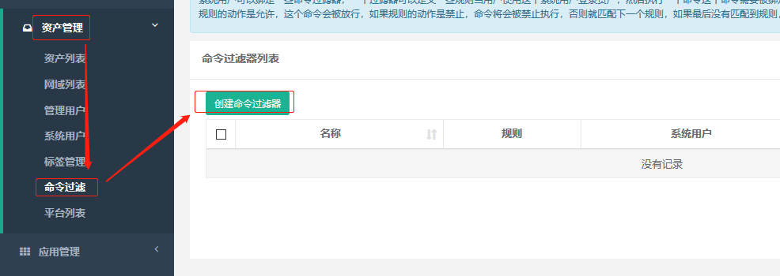
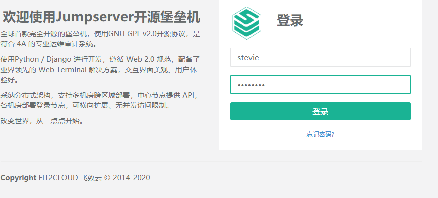

# 一. Jumpserver 简介

Jumpserver 是一款使用 Python, Django 开发的开源跳板机系统, 为互联
网企业提供了认证，授权，审计，自动化运维等功能。

[Jumpserver 官网](http://www.jumpserver.org/)

# 二. 部署 Jumpserver

环境：

| 主机名             | IP             |
| :----------------- | :------------- |
| jumpserver         | 192.168.100.42 |
| redis-mysql-server | 192.168.100.44 |
| web-server-node1   | 192.168.100.46 |
| web-server-node2   | 192.168.100.48 |

部署 jumpserver 要求：

```bash
配置最低要求：

硬件配置: 2个CPU核心, 4G 内存, 50G 硬盘(最低)
操作系统: Linux 发行版 x86_64 架构
Python         = 3.6.x
Mysql Server   >= 5.6
Mariadb Server >= 5.5.56
Redis
```

使用 docker 部署 jumpserver 和 mysql 及 redis，其中，mysql 和 redis
部署与同一个 docker，jumpserver 部署于另一台 docker 主机。

## 2.1 部署 MySQL

使用 docker 部署 mysql。如果将 mysql 部署到独立主机，则要求:

```bash
外置数据库要求
mysql 版本需要大于等于 5.6
mariadb 版本需要大于等于 5.5.6
数据库编码要求 uft8
```

部署:

1. 从镜像启动 mysql 容器，并获取配置文件

```bash
# 获取mysql
root@redis-mysql-server:~# docker pull mysql:5.7
5.7: Pulling from library/mysql
68ced04f60ab: Pull complete
f9748e016a5c: Pull complete
da54b038fed1: Pull complete
6895ec5eb2c0: Pull complete
111ba0647b87: Pull complete
c1dce60f2f1a: Pull complete
702ec598d0af: Pull complete
63cca87a5d4d: Pull complete
ec05b7b1c5c7: Pull complete
834b1d9f49b0: Pull complete
8ded6a30c87c: Pull complete
Digest: sha256:f4a5f5be3d94b4f4d3aef00fbc276ce7c08e62f2e1f28867d930deb73a314c58
Status: Downloaded newer image for mysql:5.7

# 从mysql镜像启动，并将配置文件拷贝出来
root@redis-mysql-server:~# docker run -it --rm mysql:5.7 /bin/bash
root@248f22e4e3df:/# find / -name my.cnf
/etc/alternatives/my.cnf
/etc/mysql/my.cnf
/var/lib/dpkg/alternatives/my.cnf
root@248f22e4e3df:/# cat  /etc/issue
root@248f22e4e3df:/# apt update
root@248f22e4e3df:/# apt install vim
```

2. 将配置文件放到容器外的主机目录

```bash
# 使用 -v /etc/mysql/mysql.conf.d/mysqld.cnf:/etc/mysql/mysql.conf.d/mysqld.cnf 挂载到容器
root@redis-mysql-server:~#  mkdir /etc/mysql/mysql.conf.d
root@redis-mysql-server:~#vim /etc/mysql/mysql.conf.d/mysqld.cnf
root@redis-mysql-server:~# cat /etc/mysql/mysql.conf.d/mysqld.cnf
[mysqld]
pid-file = /var/run/mysqld/mysqld.pid
socket   = /var/run/mysqld/mysqld.sock
datadir  = /var/lib/mysql
#log-error = /var/log/mysql/error.log
symbolic-links=0
character-set-server=utf8

# 使用 -v /etc/mysql/conf.d/mysql.cnf:/etc/mysql/conf.d/mysql.cnf 挂载到容器
root@redis-mysql-server:~#mkdir /etc/mysql/conf.d
root@redis-mysql-server:~#vim /etc/mysql/conf.d/mysql.cnf
root@redis-mysql-server:~# cat /etc/mysql/conf.d/mysql.cnf
[mysql]
default-character-set=utf8
```

3. 数据保存在宿主机，实现数据与容器分离，当容器运行异常时也可以在启动
   一个新的容器直接使用宿主机的数据，从而保证业务的正产运行。

```bash
# 使用 -v /data/mysql:/var/lib/mysql 挂载到容器
root@redis-mysql-server:~#  mkdir /data/mysql  -p
root@redis-mysql-server:~# ll /data/mysql/
total 8
drwxr-xr-x 2 root root 4096 Mar  7 14:19 ./
drwxr-xr-x 3 root root 4096 Mar  7 14:19 ../
```

4. 从镜像启动容器，并测试数据库连接性

```bash
root@redis-mysql-server:~# docker run -it -d -p 3306:3306 --name jumpserver-mysql -v /etc/mysql/mysql.conf.d/mysqld.cnf:/etc/mysql/mysql.conf.d/mysqld.cnf -v /etc/mysql/conf.d/mysql.cnf:/etc/mysql/conf.d/mysql.cnf -v /data/mysql:/var/lib/mysql -e MYSQL_ROOT_PASSWORD="stevenux" mysql:5.7
9d0caf1e24f27a008848b7f4ad31a36e2a5593d6cd9e2aaacaaae02276892fcd

root@redis-mysql-server:~# docker ps
CONTAINER ID        IMAGE               COMMAND                  CREATED             STATUS              PORTS                               NAMES
9d0caf1e24f2        mysql:5.7           "docker-entrypoint.s…"   4 seconds ago       Up 3 seconds        0.0.0.0:3306->3306/tcp, 33060/tcp   jumpserver-mysql

# 测试连接
root@redis-mysql-server:~# apt install mysql-clien
root@redis-mysql-server:~# mysql -uroot -p -h127.0.0.1
Enter password:
...
mysql> show databases;
+--------------------+
| Database           |
+--------------------+
| information_schema |
| mysql              |
| performance_schema |
| sys                |
+--------------------+
4 rows in set (0.00 sec)

# 查看数据库编码
mysql> SHOW VARIABLES LIKE "%character%";SHOW VARIABLES LIKE "%collation%";
+--------------------------+----------------------------+
| Variable_name            | Value                      |
+--------------------------+----------------------------+
| character_set_client     | utf8                       |
| character_set_connection | utf8                       |
| character_set_database   | utf8                       |
| character_set_filesystem | binary                     |
| character_set_results    | utf8                       |
| character_set_server     | utf8                       |
| character_set_system     | utf8                       |
| character_sets_dir       | /usr/share/mysql/charsets/ |
+--------------------------+----------------------------+
8 rows in set (0.00 sec)

+----------------------+-----------------+
| Variable_name        | Value           |
+----------------------+-----------------+
| collation_connection | utf8_general_ci |
| collation_database   | utf8_general_ci |
| collation_server     | utf8_general_ci |
+----------------------+-----------------+
3 rows in set (0.01 sec)

mysql>
```

5. 创建 jumpserver 使用的数据库和授权其访问数据库的用户权限
   注意：jumpserver 要求数据库的密码为字符串，不能为纯数字

```bash
root@redis-mysql-server:~# mysql -uroot -p -h192.168.100.144
Enter password:
...
mysql> CREATE DATABASE jumpserver_data DEFAULT CHARSET 'utf8';
Query OK, 1 row affected (0.00 sec)

mysql> GRANT ALL ON jumpserver_data.* TO 'stevenux'@'%' IDENTIFIED BY 'stevenux';
Query OK, 0 rows affected, 1 warning (0.00 sec)

mysql> FLUSH PRIVILEGES;
Query OK, 0 rows affected (0.00 sec)

mysql>
```

1. 测试使用 `stevenux` 账户访问 `jumpser_data` 数据库

```bash
root@redis-mysql-server:~# mysql -ustevenux -p -h192.168.100.144
Enter password:
...
mysql> SHOW DATABASES;
+--------------------+
| Database           |
+--------------------+
| information_schema |
| jumpserver_data    |
+--------------------+
2 rows in set (0.00 sec)
```

## 2.2 部署 Redis

使用 docker 部署 redis

1. 获取 redis 镜像

```bash
root@redis-mysql-server:~# docker pull redis:5.0.7
5.0.7: Pulling from library/redis
68ced04f60ab: Already exists
7ecc253967df: Pull complete
765957bf98d4: Pull complete
52f16772e1ca: Pull complete
2e43ba99c3f3: Pull complete
d95576c71392: Pull complete
Digest: sha256:938ee5bfba605cc85f9f52ff95024e9a24cf5511ba6f1cbc68ec9d91a0432125
Status: Downloaded newer image for redis:5.0.7
docker.io/library/redis:5.0.7
```

2. 从镜像启动 redis 容器

```bash
root@redis-mysql-server:~# docker images
REPOSITORY          TAG                 IMAGE ID            CREATED             SIZE
mysql               5.7                 84164b03fa2e        2 days ago          456MB
redis               5.0.7               7eed8df88d3b        9 days ago          98.2MB

root@redis-mysql-server:~# docker run -it -d -p 6379:6379 --name jumpserver-redis redis:5.0.7
fae6b8ea6f2f7b89fc384b6ebd081aead22684b39ab9233aef89fb56b8f0304b
root@redis-mysql-server:~# docker ps
CONTAINER ID        IMAGE               COMMAND                  CREATED             STATUS              PORTS                               NAMES
fae6b8ea6f2f        redis:5.0.7         "docker-entrypoint.s…"   7 seconds ago       Up 5 seconds        0.0.0.0:6379->6379/tcp              jumpserver-redis

```

3. 测试 redis 连接性

```bash
# 先把redis容器停止，再安装redis客户端
root@redis-mysql-server:~# apt install redis
root@redis-mysql-server:~# redis-cli -h 192.168.100.144
192.168.100.144:6379> ingo
(error) ERR unknown command `ingo`, with args beginning with:
192.168.100.144:6379> info
# Server
redis_version:5.0.7
redis_git_sha1:00000000
redis_git_dirty:0
redis_build_id:825c96d6c798641
redis_mode:standalone
os:Linux 4.15.0-55-generic x86_64
arch_bits:64
multiplexing_api:epoll
atomicvar_api:atomic-builtin
gcc_version:8.3.0
...
```

## 2.3 部署 Jumpserver

JumpServer 封装了一个 All in one Docker，可以快速启动。该镜像集成
了所需要的组件，支持使用外置 Database 和 Redis。
[部署官方文档](https://jumpserver.readthedocs.io/zh/master/dockerinstall.html)

1. 获取 jumpserver 镜像

```bash
root@jumpserver:~# docker pull jumpserver/jms_all:latest
latest: Pulling from jumpserver/jms_all
ab5ef0e58194: Pull complete
8620a33e832d: Pull complete
d82216631d35: Pull complete
03d8b70026d3: Pull complete
44f8ec83dd1d: Pull complete
00c7eb5ea0be: Pull complete
Digest: sha256:bc90e5482960a690b66ae59ac5a5076b5dc7dbfafb3d07808662e72cf9a845a5
Status: Downloaded newer image for jumpserver/jms_all:latest
docker.io/jumpserver/jms_all:latest

root@jumpserver:~# docker images
REPOSITORY           TAG                 IMAGE ID            CREATED             SIZE
jumpserver/jms_all   latest              4bd14c9ff89b        10 days ago         1.39GB
```

2. 生成加密秘钥，生成随机加密秘钥和初始化 token。

[来自官方](https://jumpserver.readthedocs.io/zh/master/dockerinstall.html)

```bash
root@jumpserver:~# if [ "$SECRET_KEY" = "" ]; then SECRET_KEY=`cat /dev/urandom | tr -dc A-Za-z0-9 | head -c 50`; echo "SECRET_KEY=$SECRET_KEY" >> ~/.bashrc; echo $SECRET_KEY; else echo $SECRET_KEY; fi

ajhbW6orq7PNaK7ZncNX4nsKzGu1jfo4nIBBqqHgEmfzCzB5IW  # 秘钥

root@jumpserver:~# if [ "$BOOTSTRAP_TOKEN" = "" ]; then BOOTSTRAP_TOKEN=`cat /dev/urandom | tr -dc A-Za-z0-9 | head -c 16`; echo "BOOTSTRAP_TOKEN=$BOOTSTRAP_TOKEN" >> ~/.bashrc; echo $BOOTSTRAP_TOKEN; else echo $BOOTSTRAP_TOKEN; fi

X9G9rDygm8NBIXWt  # token
```

3. 从 jumpserver/jms_all 镜像启动容器

启动命令：

```bash
~$ docker run -it -d --name jumpserver_all \
-v /opt/jumpserver:/opt/jumpserver/data/media \
-p 80:80 \
-p 2222:2222 \
-e SECRET_KEY=ajhbW6orq7PNaK7ZncNX4nsKzGu1jfo4nIBBqqHgEmfzCzB5IW \
-e BOOTSTRAP_TOKEN=X9G9rDygm8NBIXWt \
-e DB_HOST=192.168.100.144 \
-e DB_PORT=3306 \
-e DB_USER='stevenux' \
-e DB_PASSWORD="stevenux" \
-e DB_NAME=jumpserver_data \
-e REDIS_HOST=192.168.100.144 \
-e REDIS_PORT=6379 \
-e REDIS_PASSWORD= \
jumpserver/jms_all:latest
```

启动 jumpserver：

```bash
root@jumpserver:~# docker run -it -d --name jumpserver_all \
> -v /opt/jumpserver:/opt/jumpserver/data/media \
> -p 80:80 \
> -p 2222:2222 \
> -e SECRET_KEY=ajhbW6orq7PNaK7ZncNX4nsKzGu1jfo4nIBBqqHgEmfzCzB5IW \
> -e BOOTSTRAP_TOKEN=X9G9rDygm8NBIXWt \
> -e DB_HOST=192.168.100.144 \
> -e DB_PORT=3306 \
> -e DB_USER='stevenux' \
> -e DB_PASSWORD="stevenux" \
> -e DB_NAME=jumpserver_data \
> -e REDIS_HOST=192.168.100.144 \
> -e REDIS_PORT=6379 \
> -e REDIS_PASSWORD= \
> jumpserver/jms_all:latest
85ee75762188c297a2d2b818f3511dd6e90e420f46e9c5157c73203a35546141
root@jumpserver:~# docker ps
CONTAINER ID        IMAGE                       COMMAND             CREATED             STATUS              PORTS                                        NAMES
85ee75762188        jumpserver/jms_all:latest   "entrypoint.sh"     6 seconds ago       Up 4 seconds        0.0.0.0:80->80/tcp, 0.0.0.0:2222->2222/tcp   jumpserver_all
```

查看数据库是否生成表：

```bash
root@redis-mysql-server:~# mysql -ustevenux -p -h192.168.100.144
Enter password:
...
mysql> USE jumpserver_data;
Reading table information for completion of table and column names
You can turn off this feature to get a quicker startup with -A

Database changed
mysql> SHOW TABLES;
+----------------------------------------------+
| Tables_in_jumpserver_data                    |
+----------------------------------------------+
| applications_databaseapp                     |
| applications_remoteapp                       |
| assets_adminuser                             |
| assets_asset                                 |
| assets_asset_labels                          |
| assets_asset_nodes                           |
| assets_assetgroup                            |
| assets_authbook                              |
| assets_cluster
...
| users_usergroup                              |
+----------------------------------------------+
85 rows in set (0.00 sec)
```

# 三. Jumpserver 基础使用

## 3.1 登录 web 管理界面

默认账户:admin
密码:admin

登录界面


仪表盘 Dashboard


## 3.2 系统设置

### 3.2.1 基本设置

点击页面上边的 "基本设置" 按钮, 进入基本设置页面, 编辑当前站点 URL、
用户向导 URL、Email 主题前缀等信息, 点击"提交"按钮, 基本设置完成。


### 3.2.2 邮件设置

点击页面上边的 "邮件设置" 按钮, 进入邮件设置页面：邮件设置用来发送
邮件给新建用户重置密码信息。如果新键的 jumpserver 用户的邮件为：
`stevobs@163.com`那么，创建该用户后，系统会用`1049103823@qq.com`
将重置邮件的 URL 发送给`stevobs@163.com`。


## 3.3 用户和组管理

### 3.3.1 创建用户

`用户管理 --> 用户列表 --> 创建用户`

点击页面左侧"用户列表"菜单下的"用户列表", 进入用户列表页面。


点击页面左上角"创建用户"按钮, 进入创建用户页面, 填写账户, 角色安全, 个人
等信息。其中, 用户名即 JumpServer 登录账号。用户是用于资产授权, 当某个资
产对一个用户授权后, 这个用户就使用这个资产了。角色用于区分一个用户是管理员
还是普通用户。


成功提交用户信息后, JumpServer 会发送一条设置"用户密码"的邮件到上面填写
的用户邮箱。点击邮件中的设置密码链接, 设置好密码后, 就可以使用该用户名和
密码登录 JumpServer 了。

### 3.3.2 设置用户密码

进到用户信息页面


发送密码重置邮件，系统会给`stevobs@163.com`发送密码重置邮件


创建的用户会收到通知，自己重置密码


重置密码


**如过用户忘记密码，可以在用户列表中找到该用户，并更新信息**

点更新


就可以该密码了


### 3.3.3 测试用户登录

打开另一个浏览器测试 stevie 用户是否可以登录到 jumpserver


该用户还没有任何资产，需要在资产权限管理中为其分配资产。

### 3.3.3 创建组

用户组, 顾名思义, 给用户分组。用户组信息很有用, 在分配资产权限的时候,
针对的某个用户组下的所有用户, 可以为一个用户分配多个用户组。
点击页面左侧"用户管理"菜单下的"用户组", 进入用户组列表页面。


点击页面左上角"创建用户组"按钮, 进入创建用户组页面：
名称即用户组名称, 建议填写简单明了有用的信息。创建用户组的时候可以把已
存在的用户加入到该分组中, 一个用户可以存在多个分组中。


## 3.4 资产管理

### 3.4.1 创建管理用户

管理用户是资产（被控服务器）上的 root，或拥有 `NOPASSWD: ALL sudo` 权限的
用户， JumpServer 使用该用户来推送系统用户、获取资产硬件信息等（如后端服务
器的 root 账户或者具有 root 权限的其他用户）。Windows 需要填写 administrators
组里面的用户。

`管理用户 --> 创建管理用户`


### 3.4.2 创建系统用户

系统用户是 JumpServer 跳转登录资产时使用的用户，可以理解为登录资产用户，如 web,
sa, dba(ssh web@some-host), 而不是使用某个用户的用户名跳转登录服务器
(ssh xiaoming@some-host); 简单来说是 用户使用自己的用户名登录 JumpServer,
JumpServer 再使用系统用户登录资产。 系统用户创建时，如果选择了自动推送 JumpServer
会使用 ansible 自动推送系统用户到资产中，如果资产不支持 ansible, 请手动填写账号密码
（域用户格式: user@domain.com）。


### 3.4.3 创建资产

#### 3.4.3.1 资产管理树

资产树节点不能重名, 右击节点可以添加、删除和重命名节点, 以及进行资产相关的操作


#### 3.4.3.2 创建资产

在资产列表页面, 先在左侧选择资产要加入的节点, 然后在右侧选择创建资产


填写资产信息


添加资产后


## 3.4 授权管理

把资产授权给用户后, 用户才能在 "我的资产" 里面看到资产, 配置正确后用户才能
正常连接资产

### 3.4.1 查看资产授权列表


### 3.4.2 创建授权规则

`节点`: 对应的是资产, 代表该节点下的所有资产。

`用户组`: 对应的是用户, 代表该用户组下所有的用户。

`系统用户`: 及所选的用户组下的用户能通过该系统用户使用所选节点下的资产。

节点, 用户组, 系统用户是一对一的关系, 所以当拥有 Linux、Windows 不同类型资产时,
应该分别给 Linux 资产和 Windows 资产创建授权规则。资产或节点可以授权给个人或用
户组, 一个授权建议只指定一个系统用户 (多系统用户会按照优先级进行排序, 高优先自动
登陆, 同时存在多个并级系统用户时，用户需要自己选择系统用户)


### 3.4.3 stevie 普通用户查看和管理资产信息

Jumpserver 的普通用户 stevie 的资产权限，是有 admin 用户添加资产后
分配给 stevie 用户的资产管理权限。

#### 查看资产信息


#### 管理资产

点击 `Web终端`


点击要管理的资产


连上了


## 3.5 网域列表

网域功能是为了解决部分环境（如：混合云）无法直接连接而新增的功能，原理是通过网
关服务器进行跳转登录


# 五. 资产分组

## 5.1 向资产组添加资产

将新增的 web-server-node2 加到 web-server 组


## 5.2 在 stevie 账户查看

web-server 组新增的资产，stevie 可以看到，是因为在创建
资产授权规则时，指定的组有 web-server


## 5.3 web 终端连接测试


# 六. 会话管理

## 6.1 在线会话

点击页面左侧"会话管理"菜单下的"在线会话"按钮, 进入在线会话列表页面,
默认展示最近 7 天的记录。


```bash
用户：在线的用户名。

资产：登录的资产名称。

系统用户：用户使用那哪个系统用户登录的资产。

远端地址：登录用户的 IP 地址。

终端地址：登录所以使用的终端的 IP 地址, 列如 koko。

命令: 用户执行了多少条命令。

开始日期: 登录的时间。

时长：在线时长。
```

管理员可以手动中断当前在线的会话。 已中断的会话会记录到"历史会话"里面。

## 6.2 历史会话

历史会话同在线会话包含的信息一样, 都有用户、资产和 IP 地址等信息。


JumpServer 提供历史会话的录像观看。点击左侧的"回放"按钮, 即可观看录像。


# 七. 命令过滤

基于安全考虑，禁止某些用户执行指定的命令，如 rm、reboot、poweroff 等命令。
系统用户可以绑定一些命令过滤器，一个过滤器可以定义一些规则 当用户使用这个
系统用户登录资产，然后执行一个命令 这个命令需要被绑定过滤器的所有规则匹配，
高优先级先被匹配, 当一个规则匹配到了，如果规则的动作是 允许, 这个命令会被
放行, 如果规则的动作是 禁止，命令将会被禁止执行, 否则就匹配下一个规则，如果
最后没有匹配到规则，则允许执行

## 7.1 创建命令过滤器



名称和备注


## 7.2 填写过滤器规则


## 7.3 更新系统用户信息

将需要受限制的用户信息的`命令过滤器`项中填入新建的命令过滤器


## 7.4 测试命令是否被限制




