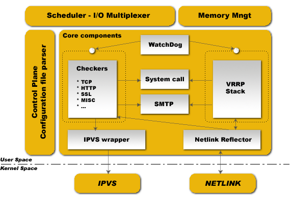

# Keepalived

# 一.VRRP 协议介绍

## 1.1 VRRP Intro

**一个问题**
在计算机网络中，交换机的一个功能是充当 LAN 网络上的主机到 WAN 的网关。
在规模比较大的 LAN 中，可能需要两个或多个交换机来充当网关，其中的主机
使用动态路由协议(如 RIP 或 OSPF)来确定作为下一跳以到达特定的目的 IP
地址的网关交换机。然而，有许多因素如管理上或处理开销上的原因，使得我们
不希望使用动态路由协议。一种选择是使用静态路由。但是，如果静态路由所
指定的第一跳网关出故障，那么 LAN 中配置该条静态路由的主机将无法与 WAN
中的主机通讯。

**VRRP 可以解决这个问题**
VRRP(Virtual Router Redundancy Protocol)虚拟主机冗余协议，定义于 RFC 5798
(VRRP Version 3 for IPv4 and IPv6)。其将两个或者多个物理路由器合并到一个称
为`虚拟路由器(VR:Virtual Router)`的逻辑组中。然后这些合并的物理路由(此时叫
Virtual Router)为 LAN 中的主机提供一个逻辑上的网关。

一个虚拟路由器包含多个物理路由器并被配置为其它主机的网关。其它主机只能看到
虚拟路由器，而无法觉察到组成该虚拟路由的物理路由器。不管物理路由坏了多少个，
只要该虚拟路由器中至少还有一个物理路由器正常工作，从其它主机发出的数据包或
者发往这些主机的数据包依然会被虚拟路由器转发。这样就实现了网络的高可用。也
就是说虚拟路由器冗余协议(VRRP)消除了静态默认路由环境中固有的单点故障。VRRP
指定一个选举协议，动态地将虚拟路由器的职责分配给局域网上的一个网络设备。

### 1.1.2 VRRP 协议简介

在 VRRP 协议关联的虚拟路由器中，虚拟路由器由`主路由器`和多个`备份路由器`组成
。主路由器是负责在主机和远程网络之间转发数据包的路由器。它还负责通知备份路由
器它的存在性，即通过固定时间间隔的多播特定数据包给其备份路由器。如果主路由器
出现故障，则其中一个备份路由器将接管主路由器角色。

控制与虚拟路由器相关联的 IP 地址的物理路由器称为 master 路由器，并转发发送
给这些 IP 地址的数据包。当 master 不可用时，一个备份物理路由器会代替 master。

虚拟路由器使用一个特殊的保留 MAC 地址，称为`VRRP virtual MAC`。这个 MAC 地
址由虚拟路由器的主路由器在任何与网关 IP 地址相关的 ARP 响应中返回，不管哪个
设备充当主路由器。通过跨路由器使用这个共享的 MAC 地址，如果路由器发生故障，
由备份接管主机，主机就可以保持与远程网络的连接。

VRRP 指定了一个选举协议来提供前面描述的虚拟路由器功能。所有协议消息传递都是
使用 IP 多播数据报实现。每个 VRRP 虚拟路由器都有一个众所周知的 MAC 地址分配
给它。虚拟路由器 MAC 地址被用作所有由主路由器发送的周期性 VRRP 消息的源，以
使扩展局域网中的桥接学习成为可能。与虚拟路由器关联的虚拟路由器 MAC 地址是
IEEE 802 MAC 地址，格式如下:

| 00  | 00  | 5E  | 00  | 01  |
| --- | --- | --- | --- | --- |


00-00-5E-00-01-{VRID}: (00-01)表示分配给 VRRP 协议的地址块。{VRID}是
VRRP 虚拟路由器标识符。表示提供网络上最多 255 个 VRRP 虚拟路由器。

虚拟路由器由它的`虚拟路由器标识符(VRID)`和`一组 IP 地址`定义。VRRP 路由器可
以将虚拟路由器与其在接口上的真实地址相关联，也可以配置附加的虚拟路由器映射和
它愿意备份的虚拟路由器的优先级。VRID 和地址之间的映射必须在 LAN 上的所有
VRRP 路由器之间进行协调。VRID 一般由管理员定义，每个虚拟路由器的 VRID 必须
唯一。


当一个路由器充当虚拟路由器的 master 角色时，它负责以下工作:

1. 响应包含与虚拟路由器相关联的 IP 地址的 ARP 和邻居请求包。ARP 应答或邻居
   响应数据包含有虚拟路由器的虚拟 MAC 地址，以便 LAN 上的主机将虚拟 MAC 地
   址与其配置的第一跳 IP 地址相关联。注意，VRRPv3 支持 IPv4 和 IPv6，这里
   的 IP 地址可以是 IPv4 或 IPv6 地址。
2. 其转发数据包的目的链路层 MAC 地址等于虚拟路由器的 MAC 地址。
3. 定期广播 advertisement 数据包(在指定的 advertisement 数据包广播间隔内)，
   通知备份路由器它仍然充当主路由器角色。

在虚拟路由器中的其它路由器被认为是备用路由器。物理路由器是一个局域网上多个不同的
虚拟路由器的成员，每个虚拟路由器必须有一个唯一的标识符(VRID)。

当一个路由器充当虚拟路由器的备份路由器角色时，它必须能够执行以下任务:

1. 从 master 接收 advertisement 报文，检查报文中包含的信息是否与自身配置一致;
   忽略和丢弃不匹配的 advertisement 包。
2. 如果在给定的时间内(master 停机时间)没有接收到基于指定间隔发送的 advertisement
   数据包，则该备份路由需要承担 master 的角色，master 停机时间大概是 advertisement
   数据包发送间隔的三倍。
3. 如果从另一个路由器接收到的 advertisement 数据包标识的优先级低于该备份路由器的
   优先级，并且处于抢占模式，则该备份路由器也将承担 master 角色。

### 1.1.3 VRRP 数据包

VRRP 数据包结构:


VRRP 数据包被封装在 IP 包中发送。它们被发送到分配给 VRRP 的 IPv4 多播地址。
多播地址为 D 类地址，每个 D 类地址都标识一个多播组，D 类地址范围：
`224.0.0.0-239.255.255.255`

VRRP 数据包的各个字段：

| 字段                   | 说明                                                                                                                                                                                                                                                                                                                                                                                                                                             |
| :--------------------- | :----------------------------------------------------------------------------------------------------------------------------------------------------------------------------------------------------------------------------------------------------------------------------------------------------------------------------------------------------------------------------------------------------------------------------------------------- |
| Version                | version 字段指定此包的 VRRP 协议版本                                                                                                                                                                                                                                                                                                                                                                                                             |
| Type                   | type 字段指定此 VRRP 包的类型。此协议版本中定义的唯一包类型是:1 ADVERTISEMENT                                                                                                                                                                                                                                                                                                                                                                    |
| Virtual Rtr ID(VRID)   | 虚拟路由器标识符(VRID)字段标识此包报告状态的目标虚拟路由器。                                                                                                                                                                                                                                                                                                                                                                                     |
| Priority               | priority 字段指定发送 VRRP 包的路由器的优先级。值越大，优先级越高。这个字段是 8 位无符号整型。拥有与虚拟路由器相关联的 IP 地址的 VRRP 路由器的优先级值必须是 255(十进制)。支持虚拟路由器的 VRRP 路由器必须使用 1-254(十进制)之间的优先级值。支持虚拟路由器的 VRRP 路由器的默认优先级值是 100(十进制)。优先级值 0 具有特殊的意义，它指示当前 master 已经停止参与 VRRP 选举。这是用来触发备份路由器快速转换到 master，而不必等待当前 master 超时。 |
| IP Address Count       | 此 VRRP 通告中包含的 IP 地址数量                                                                                                                                                                                                                                                                                                                                                                                                                 |
| Authentication Type    | authentication 类型字段标识所使用的身份验证方法。身份验证类型在每个接口上都是惟一的。authentication 类型字段是一个 8 位无符号整数。必须丢弃身份验证类型未知或与本地配置的身份验证方法不匹配的包。目前定义的认证方法有: 0 -无认证;1 -简单的文本密码认证;2 - IP 认证报头认证                                                                                                                                                                       |
| Advertisement Interval | 广播通告间隔表示各个 advertisement 数据包之间的时间间隔(以秒为单位)，默认为 1 秒。此字段用于对配置错误的路由器进行故障排除                                                                                                                                                                                                                                                                                                                       |
| Checksum               | checksum 字段用于检测 VRRP 消息中的数据损坏。为了计算校验和，校验和字段被设置为 0。                                                                                                                                                                                                                                                                                                                                                              |
| IP Address(es)         | 一个或多个与虚拟路由器相关联的 IP 地址。包含的地址数在"Count IP Addrs"字段中指定。这些字段用于对配置错误的路由器进行故障排除                                                                                                                                                                                                                                                                                                                     |
| Authentication Data    | 身份验证字符串目前仅用于简单的文本身份验证                                                                                                                                                                                                                                                                                                                                                                                                       |

## 1.2 VRRP 的 master 选择和抢占模式

如果当前的 master 路由器变得不可用，则具有(除了当前 master)最高优先级的备份路由器
将接管 master 角色。优先级是 1 到 255 之间的值，默认为 100。值 255 保留给拥有虚拟
路由器 IP 地址的路由器。新 master 接管了原来 master 的所有职责。

默认情况下，当一个优先级高于 master 的路由器可用时，这个路由器将接管主服务器。这种
工作模式称为`抢占模式(preempt mode)`，可以设置为 on 或 off。即使在抢占模式关闭的
情况下，拥有 IP 地址的路由器在可用时也总是成为主机。抢占模式应该对虚拟路由器中的所
有路由器都是一样的。

如果两个路由器被配置为具有相同的优先级，并且当它们同时转换到 master 路由器时发生冲
突，则具有最大的 IP 地址的路由器具有更高的优先级。由于时间的不同，冲突可能不会频繁
发生，可以简单的认为第一个响应的路由器将成为 master。

即使拥有 IP 地址的路由器当前不可用，LAN 上的主机仍可以继续将数据包发送到它们最初与
第一个跃点 IP 地址相关联的虚拟 MAC 地址。当最初的路由器再次可用时，如果它是一个优先
路由器(即它拥有虚拟路由器 IP 地址)，那么它将恢复 master 路由器器的角色。

以上对于 master 的选取都工作在 IPv4 下。

# 二.Keepalived 介绍

## 2.1 Keepalived 介绍

Keepalived 是 VRRP 协议的软件实现，最开始设计目的为了实现 ipvs 服务的高可用。
实质上 Keepalived 是使用 C 语言开发的路由软件。其实现的负载均衡框架依赖于
IPVS 内核模块提供 4 层负载均衡。Keepalived 实现了一组`checker`以根据服务器
的健康性来动态的管理处于负载均衡状态的服务器池。另一方面，在 Keepalived 中，
HA 高可用是 VRRP 协议实现的。VRRP 是路由器故障转移的基础。另外，Keepalived
还针对 VRRP 协议的优先状态机实现了一组`hook`以便提供底层的和高速的协议交互。

Keepalived 功能：

- 可以基于 VRRP 协议完成地址流动
- 为 VIP 地址所在的节点生成 ipvs 规则(在配置文件中预先定义)
- 为 IPVS 集群的各 RS 做健康状态检测
- 基于脚本调用接口通过执行脚本完成脚本中定义的功能，进而影响集群事务，并以此
  来支持 nginx、haproxy 等其它高可用和负载均衡服务

## 2.2 Keepalived 组件



Keepalived 服务：
为了确保鲁棒性和稳定性，Keepalived 守护程序分为 3 个不同的进程。其全局设计
基于负责派生子进程并监控的简约父进程，父进程派生两个子进程，一个负责 VRRP
框架，另一个负责健康检查。每个子进程都有自己的调度 I/O 多路复用器，由于 VRRP
调度比运行状况检查程序更关键，因此这种做法可以优化 VRRP 调度时的抖动。另一方
面，这种拆分设计可最大限度地减少对三方库的使用情况的运行状况检查，并最大程度
地降低其在主循环和空闲主循环之间的操作，从而避免自身引起的故障。父进程监控框
架称为`看门狗(watchdog)`，其设计是：每个子进程打开一个接收连接的
`unix域套接字`，然后在守护程序引导时，父进程连接到那些 `unix域套接字`，并向
子进程发送定期(5s)的 "hello" 数据包。如果父进程无法将 hello 数据包发送到
连接的 Unix 域套接字，则只需重启子进程即可。这种看门狗设计具有 2 个好处，
首先，通过 I/O 复用器调度程序完成从父进程发送到远程连接的子进程的 hello 数
据包，从而可以检测子进程调度框架中的死循环。第二个好处是可以通过使用 sysV 信号
检测不可用(dead)的子进程。

Keepalived 运行时，在进程列表中会看到类似的情况：

```ruby
PID
111 Keepalived    <-- Parent process monitoring children
112 \_ Keepalived <-- VRRP child
113 \_ Keepalived <-- Healthchecking child
```

### 2.2.1 Control Plane

Keepalive 的实际应用中通过文件 `keepalived.conf` 完成 Keepalived 配置。
解析该配置文件使用了类似于编译器的设计实现了一个解析器。 解析器使用关键字树
层次结构来将每个`配置关键字`与`细节处理程序`进行映射。 中央多级递归函数读取
配置文件并遍历关键字树。 在解析期间，配置文件被转换为内部存储器表示。

### 2.2.2 Scheduler - I/O Multiplexer

所有事件都被安排在同一进程中。 Keepalived 是一个单一的进程。 Keepalived 是
一种网络路由软件，其非常接近 I/O 。 Keepalived 的 I/O 多路复用器使用的设计是一
种中央选择机制，负责调度所有内部任务。 没有使用 POSIX 线程库。 该框架提供了
针对网络目的而优化的线程抽象。

### 2.2.3 Memory Management

该框架为某些通用内存管理功能(例如分配，重新分配，释放等)提供访问权限。该框架
可以在两种模式下使用：normal_mode 和 debug_mode。 使用 debug_mode 时，它提
供了一种强大的方法来消除和跟踪内存泄漏。此底层环境通过跟踪分配内存和释放内存
来提供缓冲区运行不足保护。所有使用的缓冲区的长度都是固定的，以防止最终出现缓
冲区溢出。

### 2.2.4 Core components

该框架定义了所有代码中都使用的一些通用库和全局库。这些库有：html 解析，
链接列表，计时器，向量，字符串格式化，缓冲区转储，网络实用程序，守护程
序管理，pid 处理，TCP layer4 抽象。 该框架的目标是将代码分解为最大数量，
以限制尽可能多的代码重复以增强模块化。

### 2.2.5 WatchDog

该框架提供了子进程监控(VRRP 和运行状况检查)。每个子进程都与其自己的 watchdog
通过 unix 域套接字连接。 父进程将"hello"消息发送到此子进程的 unix 域套接字。
Hello 消息在父端使用 I/O 复用器发送，并在子端使用 I/O 复用器接受/处理。 如果
父级检测到管道损坏，则使用 sysV 信号测试子进程是否仍然存在，然后重新启动它。

### 2.2.6 Checkers

健康性检查是 Keepalived 的主要功能之一。 Checkers 负责 realserver 的运行
状况检查。Checker 负责测试 realserver 是否处于活动状态，该测试以二进制决定
结束：结果是从 LVS 拓扑中删除或添加 realserver。内部 Checker 的设计是以实时
网络软件为标准的，它使用完全多线程的 FSM 设计(Finite State Machine 有限状态机)
。Checkers 框架根据第 4 层至第 5 或 7 层测试结果提供 LVS 拓扑操作。它在由
父进程监视的独立进程中运行。

### 2.2.7 VRRP Stack

VRRP 栈是 Keepalived 另一个最重要的功能。 VRRP(虚拟路由器冗余协议：RFC5798)
专注于 Director 主机的故障转移，它为路由器备份技术提供了底层设计。它实现了
完整的 IETF RFC2338 标准，并为 LVS 和防火墙设计提供了一些规定和扩展。 它
实现了 vrrp_sync_group 扩展，可确保协议接管后的持久路由路径。 它使用 MD5-96
位密码提供来实现 IPSEC-AH，以确保协议通告数据交换的安全。有关 VRRP 的更多信息，
可以阅读 RFC。重要事项：VRRP 代码可以在没有 LVS 支持的情况下使用，它是为独立
使用而设计的。它可以在受父进程监视的独立进程中运行。

### 2.2.8 System call

该框架提供了启动额外系统脚本的能力。它主要用于 MISC 检查器中。在 VRRP 框架中，
它提供了在协议状态转换期间启动额外脚本的功能。系统调用在一个 fork 后的进程中完
成，以不影响全局调度计时器。

### Netlink Reflector

与 IPVS wrapper 相同。 Keepalived 使用其自己的网络接口表现层。IP 地址和接口
标志通过内核 Netlink 通道进行设置和监视。 Netlink 消息子系统用于设置 VRRP
的 VIP。 另一方面，Netlink 内核消息传递广播功能用于将与接口有关的任何事件反
映到用户空间的 Keepalived 内部数据表示中。因此，任何其他用户空间(其他程序)
的网络链接操作都会通过网络链接内核广播(RTMGRP_LINK 和 RTMGRP_IPV4_IFADDR)
反映到 Keepalived 数据表示中。

### IPVS wrapper

该框架用于将 IPVS 规则发送到内核中的 IPVS 代码。它提供了 Keepalived 内部数据
表示和 IPVS rule_user 表示之间的转换。它使用 IPVS libipvs 来保持与 IPVS 代码
的通用集成。

## 2.3 Keepalived 术语

| 术语                 | 说明                                 | 备注                                                                          |
| :------------------- | :----------------------------------- | :---------------------------------------------------------------------------- |
| Virtual Router       | 虚拟路由器                           | 包含个物理路由的虚拟路由器                                                    |
| VRID(0-255)          | 虚拟路由器标识                       | 唯一标识虚拟路由器                                                            |
| master               | 主设备                               | 虚拟路由器中的 master                                                         |
| backup               | 备用设备                             | 虚拟路由器中的 backup                                                         |
| priority             | 优先级                               | 分配给虚拟路由器中的各物理路由器的数字                                        |
| VIP                  | Virtual IP                           | 虚拟 IP 地址                                                                  | - |
| VMAC                 | Virutal MAC (00-00-5e-00-01-VRID)    | 虚拟 MAC 地址                                                                 |
| advertisement packet | 通告数据包                           | 通知备份服务器 master 的存在性                                                |
| 工作方式             | 抢占式，非抢占式                     | -                                                                             |
| 认证方式             | 无认证 或者 简单字符认证：预共享密钥 | -                                                                             |
| 工作模式             | 主备或者主主模式                     | 主/备：单虚拟路由器 主/主：主/备(虚拟路由器 1)，备/主(虚拟路由器 2)，互为主备 |

# 三.Keepalived 安装与简单配置

## 3.1 Keepalived 安装

# yum install keepalived (CentOS)

# apt-get install keepalived (Ubuntu)

程序环境：

- 主配置文件：`/etc/keepalived/keepalived.conf`
- 主程序文件：`/usr/sbin/keepalived`

Unit File：

- `/usr/lib/systemd/system/keepalived.service` (CentOS)
- `/lib/systemd/system/keepalived.service` (Ubuntu)

Unit File 的环境配置文件：

- /etc/sysconfig/keepalived

## 3.2 Keepalived 简单配置

### 3.2.1 Keepalived 配置组成和语法

#### 3.2.1.1 配置文件组件

```ruby
TOP HIERACHY # 顶层配置
GLOBAL CONFIGURATION # 全局配置
    Global definitions # 全局定义

VRRP CONFIGURATION  # VRRP协议相关配置
    VRRP instance(s) # VRRP虚拟路由器

LVS CONFIGURATION # LVS配置
    Virtual server group(s) # 服务器组
    Virtual server(s) # ipvs集群的vs和rs
```

#### 3.2.1.2 配置语法

**配置虚拟路由器**

```ruby
vrrp_instance <STRING> {
 ...
}
```

配置参数说明：

| 参数                   | 含义                                                          |
| :--------------------- | :------------------------------------------------------------ |
| state MASTER\|BACKUP   | 当前节点在此虚拟路由器上的初始状态，状态为 MASTER 或者 BACKUP |
| interface IFACE_NAME   | 绑定为当前虚拟路由器使用的物理接口例如：ens32,eth0,bond0,br0  |
| virtual_router_id VRID | 当前虚拟路由器惟一标识，范围是 0-255                          |
| priority 100           | 当前物理节点在此虚拟路由器中的优先级；范围 1-254              |
| advert_int 1           | vrrp 通告的时间间隔，默认 1s                                  |

**认证机制配置**

```ruby
authentication {
auth_type AH|PASS
auth_pass <PASSWORD>  # 仅前8位有效
}
```

**VIP 配置**

```ruby
virtual_ipaddress {
<IPADDR>/<MASK> brd <IPADDR> dev <STRING> scope <SCOPE> label <LABEL>
192.168.200.17/24 dev eth1
192.168.200.18/24 dev eth2 label eth2:1
}
```

**配置监控网络接口**

```ruby
track_interface { #配置监控网络接口，一旦出现故障，则转为FAULT状态实现地址转移
eth0
eth1
...
}
```

# 四.Keepalived 生产配置

## 4.1 组播配置示例

### 4.1.1 MASTER 配置

### 4.1.2 BACKUP 配置

### 4.1.3 VIP 单播配置

## 4.2 抢占和非抢占

### 4.2.1 配置为非抢占

### 4.2.2 配置抢占延迟

## 4.3 双主模式配置

## 4.4 Keepalived 开启通知

### 4.4.1 开启通知配置

### 4.4.2 编写通知脚本

## 4.5 Keepalived 与 IPVS

# 五.Keepalived 案例

## 5.1 实现 LVS-DR 模式

## 5.2 实现 HAProxy 高可用

## 5.3 实现 Nginx 高可用

## 实现 keepalived(20+vip)+nginx 双主高可用

## 实现 keepalived(60+vip)+haproxy 三服务器高可用

## 实现 keepalived(100+vip)+LVS 高可用、real server 状态监测及规则管理
