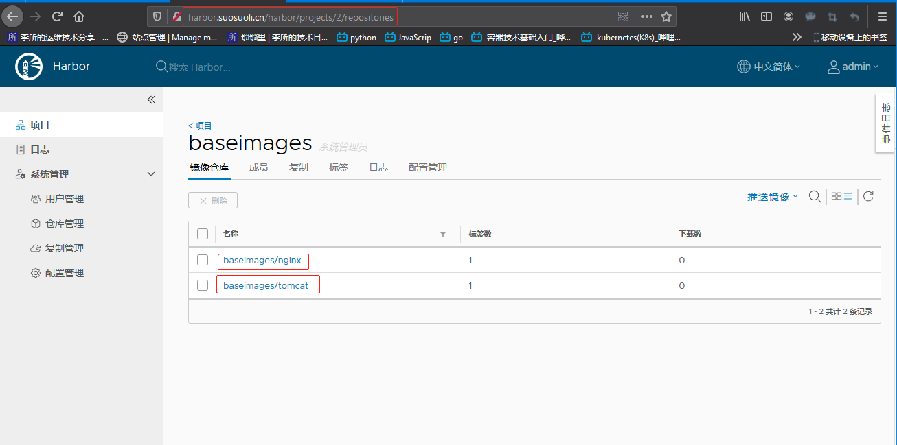
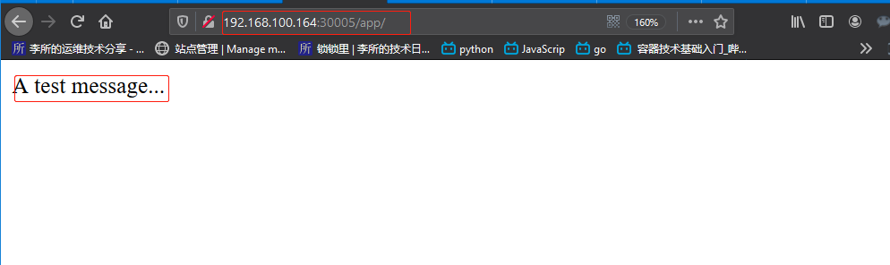

**集群环境：**

| IP              | 主机名                                | 角色                                   |
| :-------------- | :------------------------------------ | :------------------------------------- |
| 192.168.100.142 | kube-master1,kube-master1.suosuoli.cn | K8s 集群主节点 1                       |
| 192.168.100.144 | kube-master2,kube-master2.suosuoli.cn | K8s 集群主节点 2                       |
| 192.168.100.146 | kube-master3,kube-master3.suosuoli.cn | K8s 集群主节点 3                       |
| 192.168.100.160 | node1,node1.suosuoli.cn               | K8s 集群工作节点 1                     |
| 192.168.100.162 | node2,node2.suosuoli.cn               | K8s 集群工作节点 2                     |
| 192.168.100.164 | node3,node3.suosuoli.cn               | K8s 集群工作节点 3                     |
| 192.168.100.150 | ha1,ha1.suosuoli.cn                   | K8s 主节点访问入口 1(高可用及负载均衡) |
| 192.168.100.152 | ha2,ha2.suosuoli.cn                   | K8s 主节点访问入口 1(高可用及负载均衡) |
| 192.168.100.154 | harbor,harbor.suosuoli.cn             | 容器镜像仓库                           |
| 192.168.100.200 | 无                                    | VIP                                    |

# 一. 运行 nginx 和 tomcat 准备

## 1.1 拉取 nginx 和 tomcat 镜像

```bash
root@kube-master1:~# docker pull nginx:1.16.1
root@kube-master1:~# docker pull tomcat:8.5-jdk11-adoptopenjdk-hotspot

```

## 1.2 上传到本地 harbor 仓库

### 1.2.1 新建 baseimages 项目

在 karbor 新建一个项目来存放镜像：


别忘了需要添加不安全的主机列表给 docker:

```bash
~# vim /lib/systemd/system/docker.service
...
# for containers run by docker
ExecStart=/usr/bin/dockerd -H fd:// --containerd=/run/containerd/containerd.sock --insecure-registry harbor.suosuoli.cn
...
~# systemctl daemon-reload
~# systemctl restart docker
```

#### 1.2.2 打标签并上传镜像到 harbor

将从 docker hub 官方 pull 下来的 nginx 和 tomcat 镜像打标签，并上传到 harbor：

打标签：

```bash
root@kube-master1:~# docker tag tomcat:8.5-jdk11-adoptopenjdk-hotspot harbor.suosuoli.cn/baseimages/tomcat:8.5-jdk11-adoptopenjdk-hotspot
root@kube-master1:~# docker tag nginx:1.16.1 harbor.suosuoli.cn/baseimages/nginx:1.16.1
```

上传到 `harbor.suosuoli.cn`:

```bash
root@kube-master1:~# docker login harbor.suosuoli.cn
Username: admin
Password:
WARNING! Your password will be stored unencrypted in /root/.docker/config.json.
Configure a credential helper to remove this warning. See
https://docs.docker.com/engine/reference/commandline/login/#credentials-store

Login Succeeded
root@kube-master1:~# docker push tomcat
tomcat                                 tomcat:8.5-jdk11-adoptopenjdk-hotspot
root@kube-master1:~# docker push harbor.suosuoli.cn/baseimages/tomcat:8.5-jdk11-adoptopenjdk-hotspot
The push refers to repository [harbor.suosuoli.cn/baseimages/tomcat]
aec076861234: Pushed
b5fcbb958d72: Pushed
3fc7e3fa7a96: Pushed
5f919249e8cf: Pushed
85fa6e80789c: Pushed
16542a8fc3be: Pushed
6597da2e2e52: Pushed
977183d4e999: Pushed
c8be1b8f4d60: Pushed
8.5-jdk11-adoptopenjdk-hotspot: digest: sha256:e05a00d18af68ace3e1d63a82318e166cb4adbf84fcd204636bf6460b5a760a1 size: 2204

root@kube-master1:~# docker push harbor.suosuoli.cn/baseimages/nginx:1.16.1
The push refers to repository [harbor.suosuoli.cn/baseimages/nginx]
bc21985928b6: Pushed
e370c53ec242: Pushed
f2cb0ecef392: Pushed
1.16.1: digest: sha256:2500df07b831096e9207522576c20132b3f645865185d519f3f911602b585c4b size: 948
```

## 1.3 测试下载 harbor 镜像

查看 harbor 仓库：



测试下载，在 kube-master2 测试，也要改 docker 的 service 文件，添加非安全仓库：

```bash
root@kube-master2:~# docker pull harbor.suosuoli.cn/baseimages/nginx:1.16.1
1.16.1: Pulling from baseimages/nginx
68ced04f60ab: Pull complete
e6edbc456071: Pull complete
9f915b082e59: Pull complete
Digest: sha256:2500df07b831096e9207522576c20132b3f645865185d519f3f911602b585c4b
Status: Downloaded newer image for harbor.suosuoli.cn/baseimages/nginx:1.16.1
harbor.suosuoli.cn/baseimages/nginx:1.16.1
root@kube-master2:~# docker images | grep nginx
harbor.suosuoli.cn/baseimages/nginx                                           1.16.1              8c5ec390a315        4 weeks ago         127MB
```

# 二. 在集群运行 nginx 和 tomcat

准备好 kubeadm 使用的 yaml 配置文件，使用 yaml 文件部署
nginx 和 tomcat。

## 2.1 nginx 部署

编辑部署配置文件：

```bash
root@kube-master1:~# mkdir /opt/kubeadm-deploy
root@kube-master1:~# cd /opt/kubeadm-deploy/
root@kube-master1:/opt/kubeadm-deploy# vim nginx.yaml
root@kube-master1:/opt/kubeadm-deploy# cat nginx.yaml
```

```yaml
apiVersion: apps/v1
kind: Deployment
metadata:
  namespace: default
  name: nginx-deployment
  labels:
    app: nginx
spec:
  replicas: 1
  selector:
    matchLabels:
      app: nginx
  template:
    metadata:
      labels:
        app: nginx
    spec:
      containers:
        - name: nginx
          image: nginx:1.16.1
          ports:
            - containerPort: 80

---
kind: Service
apiVersion: v1
metadata:
  labels:
    app: suosuoli-nginx-service-label
  name: suosuoli-nginx-service
  namespace: default
spec:
  type: NodePort
  ports:
    - name: http
      port: 80
      protocol: TCP
      targetPort: 80
      nodePort: 30004
  selector:
    app: nginx
```

部署：

```bash
~# kubectl apply -f nginx.yaml
```

## 2.2 tomcat 部署

编辑部署文件：

```bash
root@kube-master1:/opt/kubeadm-deploy# vim tomcat.yaml
root@kube-master1:/opt/kubeadm-deploy# cat tomcat.yaml
```

```yaml
apiVersion: apps/v1
kind: Deployment
metadata:
  namespace: default
  name: tomcat-deployment
  labels:
    app: tomcat
spec:
  replicas: 1
  selector:
    matchLabels:
      app: tomcat
  template:
    metadata:
      labels:
        app: tomcat
    spec:
      containers:
        - name: tomcat
          image: tomcat:8.5-jdk11-adoptopenjdk-hotspot
          ports:
            - containerPort: 8080

---
kind: Service
apiVersion: v1
metadata:
  labels:
    app: suosuoli-tomcat-service-label
  name: suosuoli-tomcat-service
  namespace: default
spec:
  type: NodePort
  ports:
    - name: http
      port: 80
      protocol: TCP
      targetPort: 8080
      nodePort: 30005
  selector:
    app: tomcat
```

部署：

```bash
~# kubectl apply -f tomcat.yaml
```

## 2.3 dashboard 查看


# 三. 测试访问

## 3.1 nginx

查看 nginx 被分配到哪个主机：

```bash
root@kube-master1:~# kubectl get pod -o wide | grep nginx
nginx-deployment-5d66cc795f-g7bmr     1/1     Running   0          56m   10.20.4.7    node2   <none>           <none>

root@kube-master1:~# kubectl describe pod nginx-deployment-5d66cc795f-g7bmr -n default | grep -w Node:
Node:         node2/192.168.100.162
```

访问`http://192.168.100.162:80`测试：


## 3.2 tomcat

查看 tomcat 被分配到哪个主机：

```bash
root@kube-master1:~# kubectl get pod -o wide | grep tomcat
tomcat-deployment-5948d795c9-qtqlr    1/1     Running   0          59m   10.20.5.13   node3   <none>           <none>

root@kube-master1:~# kubectl describe pod tomcat-deployment-5948d795c9-qtqlr -n default | grep -w Node:
Node:         node3/192.168.100.164
```

访问`http://192.168.100.164:30005`测试：

没有默认 app：


进入 tomcat 容器，写个测试页面：

```bash
root@kube-master1:~# kubectl exec -it tomcat-deployment-5948d795c9-qtqlr -n default -- /bin/bash

root@tomcat-deployment-5948d795c9-qtqlr:/usr/local/tomcat# ls
bin  BUILDING.txt  conf  CONTRIBUTING.md  include  lib  LICENSE  logs  native-jni-lib  NOTICE  README.md  RELEASE-NOTES  RUNNING.txt  temp  webapps  webapps.dist  work
root@tomcat-deployment-5948d795c9-qtqlr:/usr/local/tomcat# cd webapps
root@tomcat-deployment-5948d795c9-qtqlr:/usr/local/tomcat/webapps# ll
total 12
drwxr-xr-x 2 root root 4096 Mar 26 18:56 ./
drwxr-xr-x 1 root root 4096 Mar 26 18:56 ../
root@tomcat-deployment-5948d795c9-qtqlr:/usr/local/tomcat/webapps# mkdir app
root@tomcat-deployment-5948d795c9-qtqlr:/usr/local/tomcat/webapps# echo "A test message..." > app/index.html
```

访问`http://192.168.100.164:30005/app`测试：



# 四. nginx 配置动静分离

## 4.1 配置 nginx

### 4.1.1 查看 nginx 和 tomcat 情况

```bash
root@kube-master1:~# kubectl get pod -A | grep "nginx\|tomcat"
default                nginx-deployment-5d66cc795f-g7bmr            1/1     Running   0          67m
default                tomcat-deployment-5948d795c9-qtqlr           1/1     Running   0          67m
root@kube-master1:~# kubectl get service -A | grep "nginx\|tomcat"
default                suosuoli-nginx-service      NodePort    172.20.15.35   <none>        80:30004/TCP             76m
default                suosuoli-tomcat-service     NodePort    172.20.7.237   <none>        80:30005/TCP             75m
```

### 4.1.2 进入 nginx 容器配置

生产中是不会进入容器更改的，这样做只是为了实验需要：

```bash
# 进入nginx容器
root@kube-master1:~# kubectl exec -it nginx-deployment-5d66cc795f-g7bmr -n default -- /bin/bash
root@nginx-deployment-5d66cc795f-g7bmr:/# cat /etc/issue
Debian GNU/Linux 10 \n \l

# 安装工具
root@nginx-deployment-5d66cc795f-g7bmr:/# apt update
root@nginx-deployment-5d66cc795f-g7bmr:/# apt install procps vim iputils-ping net-tools curl

root@nginx-deployment-5d66cc795f-g7bmr:/# vim /etc/hosts
...
172.20.7.237   suosuoli-tomcat-service
...

# ping 一下tomcat的service名称是否通
root@nginx-deployment-5d66cc795f-g7bmr:/# ping suosuoli-tomcat-service
PING suosuoli-tomcat-service (172.20.7.237) 56(84) bytes of data.
...
root@nginx-deployment-5d66cc795f-g7bmr:/# ping suosuoli-tomcat-service.default.svc.suosuoli.local
PING suosuoli-tomcat-service.default.svc.suosuoli.local (172.20.7.237) 56(84) bytes of data.
...

# telnet访问一下
root@nginx-deployment-5d66cc795f-g7bmr:/# telnet suosuoli-tomcat-service 80
Trying 172.20.7.237...
Connected to suosuoli-tomcat-service.
Escape character is '^]'.
Connection closed by foreign host.

root@nginx-deployment-5d66cc795f-g7bmr:/# telnet suosuoli-tomcat-service.default.svc.suosuoli.local 80
Trying 172.20.7.237...
Connected to suosuoli-tomcat-service.default.svc.suosuoli.local.
Escape character is '^]'.
Connection closed by foreign host.

# 获取index内容试试
root@nginx-deployment-5d66cc795f-g7bmr:/# curl suosuoli-tomcat-service/app/index.html
A test message...

# 编辑nginx配置文件
root@nginx-deployment-5d66cc795f-g7bmr:/# vim /etc/nginx/conf.d/default.conf
...
location = /app {
      proxy_pass http://suosuoli-tomcat-service;
    }
...

# 重新加载配置文件
root@nginx-deployment-5d66cc795f-g7bmr:/# nginx -t
nginx: the configuration file /etc/nginx/nginx.conf syntax is ok
nginx: configuration file /etc/nginx/nginx.conf test is successful

root@nginx-deployment-5d66cc795f-g7bmr:/# nginx -s reload
2020/03/29 11:16:24 [notice] 3322#3322: signal process started
```

## 4.2 访问测试

访问 nginx 首页：


访问请求 tomcat：


# 五. 通过 HAProxy 实现高可用和反向代理

于 haproxy 和 keepalived 实现高可用的反向代理，并访问到运行在 kubernetes
集群中业务 Pod。

## 5.1 HAProxy 和 Keepalived 配置

### 5.1.1 HAProxy

ha1:

```bash
root@ha1:~# vim /etc/haproxy/haproxy.cfg
root@ha1:~# cat /etc/haproxy/haproxy.cfg
...
listen stats
 	mode http
 	bind 0.0.0.0:9999
 	stats enable
 	log global
 	stats uri     /haproxy-status
 	stats auth    haadmin:stevenux

listen k8s-adm-6443
  mode tcp
  balance roundrobin
  bind 192.168.100.200:6443
  server 192.168.100.142 192.168.100.142:6443 check inter 3s fall 3 rise 5
  server 192.168.100.144 192.168.100.144:6443 check inter 3s fall 3 rise 5
  server 192.168.100.146 192.168.100.146:6443 check inter 3s fall 3 rise 5

listen k8s-suosuoli-80
  mode tcp
  balance roundrobin
  bind 192.168.100.201:80
  server 192.168.100.162 192.168.100.162:30004 check inter 3s fall 3 rise 5
  server 192.168.100.164 192.168.100.164:30004 check inter 3s fall 3 rise 5
  server 192.168.100.166 192.168.100.166:30004 check inter 3s fall 3 rise 5

root@ha1:~# systemctl restart haproxy
```

ha2:

```bash
root@ha2:~# vim /etc/haproxy/haproxy.cfg
root@ha2:~# cat /etc/haproxy/haproxy.cfg
...
listen stats
 	mode http
 	bind 0.0.0.0:9999
 	stats enable
 	log global
 	stats uri     /haproxy-status
 	stats auth    haadmin:stevenux

listen k8s-adm-6443
  mode tcp
  balance roundrobin
  bind 192.168.100.200:6443
  server 192.168.100.142 192.168.100.142:6443 check inter 3s fall 3 rise 5
  server 192.168.100.144 192.168.100.144:6443 check inter 3s fall 3 rise 5
  server 192.168.100.146 192.168.100.146:6443 check inter 3s fall 3 rise 5

listen k8s-suosuoli-80
  mode tcp
  balance roundrobin
  bind 192.168.100.201:80
  server 192.168.100.162 192.168.100.162:30004 check inter 3s fall 3 rise 5
  server 192.168.100.164 192.168.100.164:30004 check inter 3s fall 3 rise 5
  server 192.168.100.166 192.168.100.166:30004 check inter 3s fall 3 rise 5

root@ha2:~# systemctl restart haproxy
```

### 5.1.2 Keepalived

ha1:

```bash
root@ha1:~# cat /etc/keepalived/keepalived.conf
global_defs {
    notification_email {
    root@localhost
    }
notification_email_from keepalived@localhost
smtp_server 127.0.0.1
smtp_connect_timeout 30
router_id ha1.example.com
vrrp_skip_check_adv_addr
vrrp_strict
vrrp_garp_interval 0
vrrp_gna_interval 0

vrrp_mcast_group4 224.0.0.18
vrrp_iptables
}

vrrp_instance VI_1 {
state MASTER
interface eth0
virtual_router_id 80
priority 100
advert_int 1
authentication {
auth_type PASS
auth_pass stevenux
}
virtual_ipaddress {
    192.168.100.200 dev eth0 label eth0:0
    192.168.100.201 dev eth0 label eth0:1 # 新增的VIP
} }
```

ha2:

```bash
root@ha2:~# cat /etc/keepalived/keepalived.conf
global_defs {
    notification_email {
    root@localhost
    }
notification_email_from keepalived@localhost
smtp_server 127.0.0.1
smtp_connect_timeout 30
router_id ha1.example.com
vrrp_skip_check_adv_addr
vrrp_strict
vrrp_garp_interval 0
vrrp_gna_interval 0

vrrp_mcast_group4 224.0.0.18
vrrp_iptables
}

vrrp_instance VI_1 {
state BACKUP
interface eth0
virtual_router_id 80
priority 80
advert_int 1
authentication {
auth_type PASS
auth_pass stevenux
}
virtual_ipaddress {
    192.168.100.200 dev eth0 label eth0:0
    192.168.100.201 dev eth0 label eth0:1
} }
```

## 5.2 访问 VIP 试试

访问 nginx 主页：


访问 tomcat 页面：


# 六. kubeadm 命令

[kubeadm 命令参考](https://kubernetes.io/zh/docs/reference/setup-tools/kubeadm/kubeadm/)

## 6.1 kubeadm init phase

kubeadm init phase preflight
kubeadm init phase kubelet-start
kubeadm init phase certs
kubeadm init phase kubeconfig
kubeadm init phase control-plane
kubeadm init phase etcd
kubeadm init phase upload-config
kubeadm init phase upload-certs
kubeadm init phase mark-control-plane
kubeadm init phase bootstrap-token
kubeadm init phase addon

## 6.2 kubeadm join phase

kubeadm join phase
kubeadm join phase preflight
kubeadm join phase control-plane-prepare
kubeadm join phase kubelet-start
kubeadm join phase control-plane-join

## 6.1 kubeadm token

kubeadm token create
kubeadm token delete
kubeadm token generate
kubeadm token list

## 6.2 kubeadm config

kubeadm config upload from-file
kubeadm config view
kubeadm config print init-defaults
kubeadm config print join-defaults
kubeadm config migrate
kubeadm config images list
kubeadm config images pull

## 6.3 kubeadm reset

该命令尽力还原由 kubeadm init 或 kubeadm join 所做的更改
kubeadm reset [flags]
选项:

```bash
--cert-dir string     默认值："/etc/kubernetes/pki"
# 存储证书的目录路径。如果已指定，则需要清空此目录。
--cri-socket string
# 要连接的 CRI 套接字的路径。如果为空，则 kubeadm 将尝试自动检测此值；仅当安装了多个CRI 或具有非标准 CRI 插槽时，才使用此选项。
-f, --force
# 在不提示确认的情况下重置节点。
-h, --help
# reset 操作的帮助命令
--ignore-preflight-errors stringSlice
# 错误将显示为警告的检查列表；例如：'IsPrivilegedUser,Swap'。取值为 'all' 时将忽略检查中的所有错误。
--kubeconfig string     默认值："/etc/kubernetes/admin.conf"
# 与集群通信时使用的 kubeconfig 文件。如果未设置该标志，则可以在一组标准位置中搜索现有的 kubeconfig 文件。
--skip-phases stringSlice
# 要跳过的阶段列表
```

## 6.4 kubeadm reset phase

kubeadm reset phase
kubeadm reset phase preflight
kubeadm reset phase update-cluster-status
kubeadm reset phase remove-etcd-member
kubeadm reset phase cleanup-node
