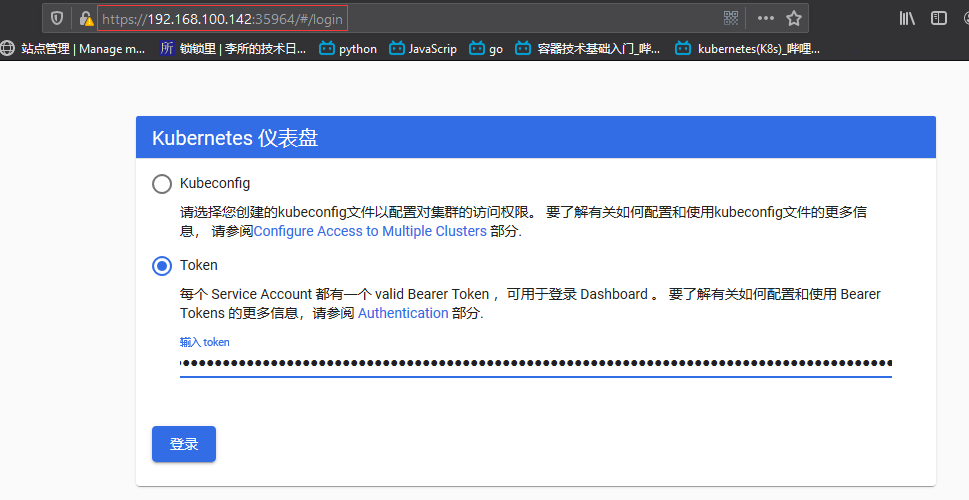

使用 kubeasz 部署 Kubernetes 集群，[kubeasz 项目地址](https://github.com/JaccyLi/kubeasz/blob/master/docs/setup/00-planning_and_overall_intro.md)

服务器列表：

| IP              | 主机名                                | 角色                                   |
| :-------------- | :------------------------------------ | :------------------------------------- |
| 192.168.100.142 | kube-master1,kube-master1.suosuoli.cn | K8s 集群主节点 1                       |
| 192.168.100.144 | kube-master2,kube-master2.suosuoli.cn | K8s 集群主节点 2                       |
| 192.168.100.146 | kube-master3,kube-master3.suosuoli.cn | K8s 集群主节点 3                       |
| 192.168.100.160 | node1,node1.suosuoli.cn               | K8s 集群工作节点 1                     |
| 192.168.100.162 | node2,node2.suosuoli.cn               | K8s 集群工作节点 2                     |
| 192.168.100.164 | node3,node3.suosuoli.cn               | K8s 集群工作节点 3                     |
| 192.168.100.164 | etcd-node1,etcd-node1.suosuoli.cn     | 集群状态存储 etcd                      |
| 192.168.100.150 | ha1,ha1.suosuoli.cn                   | K8s 主节点访问入口 1(高可用及负载均衡) |
| 192.168.100.152 | ha2,ha2.suosuoli.cn                   | K8s 主节点访问入口 1(高可用及负载均衡) |
| 192.168.100.154 | harbor,harbor.suosuoli.cn             | 容器镜像仓库                           |
| 192.168.100.200 | 无                                    | VIP                                    |

# 一. 各主机环境准备

```bash
~# apt update
~# apt install python2.7
~# ln -sv /usr/bin/python2.7 /usr/bin/python
```

# 二. 管理端安装 Ansible

## 2.1 安装

```bash
root@kube-master1:~# apt install ansible
```

## 2.2 Ansible 服务器基于 Key 与被控主机通讯

```bash
root@kube-master1:~# cat batch-copyid.sh
#!/bin/bash
#
# simple script to batch diliver pubkey to some hosts.
#
IP_LIST="
192.168.100.142
192.168.100.144
192.168.100.146
192.168.100.160
192.168.100.162
192.168.100.164
192.168.100.166
"

for host in ${IP_LIST}; do
    sshpass -p stevenux ssh-copy-id ${host} -o StrictHostKeyChecking=no
    if [ $? -eq 0 ]; then
        echo "copy pubkey to ${host} done."
    else
        echo "copy pubkey to ${host} failed."
    fi
done
```

# 三. 下载部署 Kubernetes 集群所需的文件

下载部署 Kubernetes 集群所需的二进制文件及 ansible playbook 和 roles，参考
[集群部署前的准备](https://github.com/JaccyLi/kubeasz/blob/master/docs/setup/00-planning_and_overall_intro.md)

```bash
root@kube-master1:/etc/ansible# curl -C- -fLO --retry 3 https://github.com/easzlab/kubeasz/releases/download/2.2.0/easzup
  % Total    % Received % Xferd  Average Speed   Time    Time     Time  Current
                                 Dload  Upload   Total   Spent    Left  Speed
100   597  100   597    0     0    447      0  0:00:01  0:00:01 --:--:--   447
100 12965  100 12965    0     0   4553      0  0:00:02  0:00:02 --:--:-- 30942
root@kube-master1:/etc/ansible# ls
ansible.cfg  easzup  hosts

root@kube-master1:/etc/ansible# chmode +x easzup

# 开始下载
root@kube-master1:/etc/ansible# ./easzup -D
[INFO] Action begin : download_all
[INFO] downloading docker binaries 19.03.5
  % Total    % Received % Xferd  Average Speed   Time    Time     Time  Current
                                 Dload  Upload   Total   Spent    Left  Speed
100 60.3M  100 60.3M    0     0  1160k      0  0:00:53  0:00:53 --:--:-- 1111k
[INFO] generate docker service file
[INFO] generate docker config file
[INFO] prepare register mirror for CN
[INFO] enable and start docker
Synchronizing state of docker.service with SysV service script with /lib/systemd/systemd-sysv-install.
Executing: /lib/systemd/systemd-sysv-install enable docker
Failed to enable unit: Unit file /etc/systemd/system/docker.service is masked.
Failed to restart docker.service: Unit docker.service is masked.  # 出错，提示docker.service masked
[ERROR] Action failed : download_all   # 下载失败

# 尝试unmask，但是service文件被删除了？
root@kube-master1:/etc/ansible# systemctl unmask docker.service
Removed /etc/systemd/system/docker.service.

# 打开easzup脚本，将其生成docker.service文件的内容拷贝，自己写docker.service文件
root@kube-master1:/etc/ansible# vim easzup
...
 echo "[INFO] generate docker service file"
  cat > /etc/systemd/system/docker.service << EOF
[Unit]
Description=Docker Application Container Engine
Documentation=http://docs.docker.io
[Service]
Environment="PATH=/opt/kube/bin:/bin:/sbin:/usr/bin:/usr/sbin"
ExecStart=/opt/kube/bin/dockerd
ExecStartPost=/sbin/iptables -I FORWARD -s 0.0.0.0/0 -j ACCEPT
ExecReload=/bin/kill -s HUP \$MAINPID
Restart=on-failure
RestartSec=5
LimitNOFILE=infinity
LimitNPROC=infinity
LimitCORE=infinity
Delegate=yes
KillMode=process
[Install]
WantedBy=multi-user.target
EOF
...

# 编写docker.service启动文件
root@kube-master1:/etc/ansible# vim /etc/systemd/system/docker.service
[Unit]
Description=Docker Application Container Engine
Documentation=http://docs.docker.io
[Service]
Environment="PATH=/opt/kube/bin:/bin:/sbin:/usr/bin:/usr/sbin"
ExecStart=/opt/kube/bin/dockerd
ExecStartPost=/sbin/iptables -I FORWARD -s 0.0.0.0/0 -j ACCEPT
ExecReload=/bin/kill -s HUP \$MAINPID
Restart=on-failure
RestartSec=5
LimitNOFILE=infinity
LimitNPROC=infinity
LimitCORE=infinity
Delegate=yes
KillMode=process
[Install]
WantedBy=multi-user.target
```

接着下载：

```bash
root@kube-master1:/etc/ansible# ./easzup -D
[INFO] Action begin : download_all
/bin/docker
[WARN] docker is installed.
[INFO] downloading kubeasz 2.2.0
[INFO] run a temporary container
Unable to find image 'easzlab/kubeasz:2.2.0' locally
2.2.0: Pulling from easzlab/kubeasz
9123ac7c32f7: Pull complete
837e3bfc1a1b: Pull complete
Digest: sha256:a1fc4a75fde5aee811ff230e88ffa80d8bfb66e9c1abc907092abdbff073735e
Status: Downloaded newer image for easzlab/kubeasz:2.2.0
9ae404660a8e66a59ee4029d748aff96666121e847aa3667109630560e749bf8
[INFO] cp kubeasz code from the temporary container
[INFO] stop&remove temporary container
temp_easz
[INFO] downloading kubernetes v1.17.2 binaries
v1.17.2: Pulling from easzlab/kubeasz-k8s-bin
9123ac7c32f7: Already exists
fa197cdd54ac: Pull complete
Digest: sha256:d9fdc65a79a2208f48d5bf9a7e51cf4a4719c978742ef59b507bc8aaca2564f5
Status: Downloaded newer image for easzlab/kubeasz-k8s-bin:v1.17.2
docker.io/easzlab/kubeasz-k8s-bin:v1.17.2
[INFO] run a temporary container
16c0d1675f705417e662fd78871c2721061026869e5c90102c9d47c07bb63476
[INFO] cp k8s binaries
[INFO] stop&remove temporary container
temp_k8s_bin
[INFO] downloading extral binaries kubeasz-ext-bin:0.4.0
0.4.0: Pulling from easzlab/kubeasz-ext-bin
9123ac7c32f7: Already exists
96aeb45eaf70: Pull complete
Digest: sha256:cb7c51e9005a48113086002ae53b805528f4ac31e7f4c4634e22c98a8230a5bb
Status: Downloaded newer image for easzlab/kubeasz-ext-bin:0.4.0
docker.io/easzlab/kubeasz-ext-bin:0.4.0
[INFO] run a temporary container
062d302b19c21b80f02bc7d849f365c02eda002a1cd9a8e262512954f0dce019
[INFO] cp extral binaries
[INFO] stop&remove temporary container
temp_ext_bin
[INFO] downloading system packages kubeasz-sys-pkg:0.3.3
0.3.3: Pulling from easzlab/kubeasz-sys-pkg
e7c96db7181b: Pull complete
291d9a0e6c41: Pull complete
5f5b83293598: Pull complete
376121b0ab94: Pull complete
1c7cd77764e9: Pull complete
d8d58def0f00: Pull complete
Digest: sha256:342471d786ba6d9bb95c15c573fd7d24a6fd30de51049c2c0b543d09d28b5d9f
Status: Downloaded newer image for easzlab/kubeasz-sys-pkg:0.3.3
docker.io/easzlab/kubeasz-sys-pkg:0.3.3
[INFO] run a temporary container
13f40674a29b44357a551499224436eea1bae386b68138957ed93dd96bfc0f92
[INFO] cp system packages
[INFO] stop&remove temporary container
temp_sys_pkg
[INFO] downloading offline images
v3.4.4: Pulling from calico/cni
c87736221ed0: Pull complete
5c9ca5efd0e4: Pull complete
208ecfdac035: Pull complete
4112fed29204: Pull complete
Digest: sha256:bede24ded913fb9f273c8392cafc19ac37d905017e13255608133ceeabed72a1
Status: Downloaded newer image for calico/cni:v3.4.4
docker.io/calico/cni:v3.4.4
v3.4.4: Pulling from calico/kube-controllers
c87736221ed0: Already exists
e90e29149864: Pull complete
5d1329dbb1d1: Pull complete
Digest: sha256:b2370a898db0ceafaa4f0b8ddd912102632b856cc010bb350701828a8df27775
Status: Downloaded newer image for calico/kube-controllers:v3.4.4
docker.io/calico/kube-controllers:v3.4.4
v3.4.4: Pulling from calico/node
c87736221ed0: Already exists
07330e865cef: Pull complete
d4d8bb3c8ac5: Pull complete
870dc1a5d2d5: Pull complete
af40827f5487: Pull complete
76fa1069853f: Pull complete
Digest: sha256:1582527b4923ffe8297d12957670bc64bb4f324517f57e4fece3f6289d0eb6a1
Status: Downloaded newer image for calico/node:v3.4.4
docker.io/calico/node:v3.4.4
1.6.6: Pulling from coredns/coredns
c6568d217a00: Already exists
967f21e47164: Pull complete
Digest: sha256:41bee6992c2ed0f4628fcef75751048927bcd6b1cee89c79f6acb63ca5474d5a
Status: Downloaded newer image for coredns/coredns:1.6.6
docker.io/coredns/coredns:1.6.6
v2.0.0-rc3: Pulling from kubernetesui/dashboard
d8fcb18be2fe: Pull complete
Digest: sha256:c5d991d02937ac0f49cb62074ee0bd1240839e5814d6d7b51019f08bffd871a6
Status: Downloaded newer image for kubernetesui/dashboard:v2.0.0-rc3
docker.io/kubernetesui/dashboard:v2.0.0-rc3
v0.11.0-amd64: Pulling from easzlab/flannel
cd784148e348: Pull complete
04ac94e9255c: Pull complete
e10b013543eb: Pull complete
005e31e443b1: Pull complete
74f794f05817: Pull complete
Digest: sha256:bd76b84c74ad70368a2341c2402841b75950df881388e43fc2aca000c546653a
Status: Downloaded newer image for easzlab/flannel:v0.11.0-amd64
docker.io/easzlab/flannel:v0.11.0-amd64
v1.0.3: Pulling from kubernetesui/metrics-scraper
75d12d4b9104: Pull complete
fcd66fda0b81: Pull complete
53ff3f804bbd: Pull complete
Digest: sha256:40f1d5785ea66609b1454b87ee92673671a11e64ba3bf1991644b45a818082ff
Status: Downloaded newer image for kubernetesui/metrics-scraper:v1.0.3
docker.io/kubernetesui/metrics-scraper:v1.0.3
v0.3.6: Pulling from mirrorgooglecontainers/metrics-server-amd64
e8d8785a314f: Pull complete
b2f4b24bed0d: Pull complete
Digest: sha256:c9c4e95068b51d6b33a9dccc61875df07dc650abbf4ac1a19d58b4628f89288b
Status: Downloaded newer image for mirrorgooglecontainers/metrics-server-amd64:v0.3.6
docker.io/mirrorgooglecontainers/metrics-server-amd64:v0.3.6
3.1: Pulling from mirrorgooglecontainers/pause-amd64
Digest: sha256:59eec8837a4d942cc19a52b8c09ea75121acc38114a2c68b98983ce9356b8610
Status: Downloaded newer image for mirrorgooglecontainers/pause-amd64:3.1
docker.io/mirrorgooglecontainers/pause-amd64:3.1
v1.7.20: Pulling from library/traefik
42e7d26ec378: Pull complete
8a753f02eeff: Pull complete
ab927d94d255: Pull complete
Digest: sha256:5ec34caf19d114f8f0ed76f9bc3dad6ba8cf6d13a1575c4294b59b77709def39
Status: Downloaded newer image for traefik:v1.7.20
docker.io/library/traefik:v1.7.20
2.2.0: Pulling from easzlab/kubeasz
Digest: sha256:a1fc4a75fde5aee811ff230e88ffa80d8bfb66e9c1abc907092abdbff073735e
Status: Image is up to date for easzlab/kubeasz:2.2.0
docker.io/easzlab/kubeasz:2.2.0
[INFO] Action successed : download_all  # 所有镜像都下载完成
```

下载成功后的目录和文件：

```bash
root@kube-master1:/etc/ansible# ll
total 132
drwxrwxr-x  11 root root  4096 Feb  1 10:55 ./
drwxr-xr-x 107 root root  4096 Apr  4 22:39 ../
-rw-rw-r--   1 root root   395 Feb  1 10:35 01.prepare.yml
-rw-rw-r--   1 root root    58 Feb  1 10:35 02.etcd.yml
-rw-rw-r--   1 root root   149 Feb  1 10:35 03.containerd.yml
-rw-rw-r--   1 root root   137 Feb  1 10:35 03.docker.yml
-rw-rw-r--   1 root root   470 Feb  1 10:35 04.kube-master.yml
-rw-rw-r--   1 root root   140 Feb  1 10:35 05.kube-node.yml
-rw-rw-r--   1 root root   408 Feb  1 10:35 06.network.yml
-rw-rw-r--   1 root root    77 Feb  1 10:35 07.cluster-addon.yml
-rw-rw-r--   1 root root  3686 Feb  1 10:35 11.harbor.yml
-rw-rw-r--   1 root root   431 Feb  1 10:35 22.upgrade.yml
-rw-rw-r--   1 root root  1975 Feb  1 10:35 23.backup.yml
-rw-rw-r--   1 root root   113 Feb  1 10:35 24.restore.yml
-rw-rw-r--   1 root root  1752 Feb  1 10:35 90.setup.yml
-rw-rw-r--   1 root root  1127 Feb  1 10:35 91.start.yml
-rw-rw-r--   1 root root  1120 Feb  1 10:35 92.stop.yml
-rw-rw-r--   1 root root   337 Feb  1 10:35 99.clean.yml
-rw-rw-r--   1 root root 10283 Feb  1 10:35 ansible.cfg
drwxrwxr-x   3 root root  4096 Apr  4 22:43 bin/
drwxrwxr-x   2 root root  4096 Feb  1 10:55 dockerfiles/
drwxrwxr-x   8 root root  4096 Feb  1 10:55 docs/
drwxrwxr-x   3 root root  4096 Apr  4 22:49 down/
drwxrwxr-x   2 root root  4096 Feb  1 10:55 example/
-rw-rw-r--   1 root root   414 Feb  1 10:35 .gitignore
drwxrwxr-x  14 root root  4096 Feb  1 10:55 manifests/
drwxrwxr-x   2 root root  4096 Feb  1 10:55 pics/
-rw-rw-r--   1 root root  5607 Feb  1 10:35 README.md
drwxrwxr-x  23 root root  4096 Feb  1 10:55 roles/
drwxrwxr-x   2 root root  4096 Feb  1 10:55 tools/

root@kube-master1:/etc/ansible# ll down/
total 792416
drwxrwxr-x  3 root root      4096 Apr  4 22:49 ./
drwxrwxr-x 11 root root      4096 Feb  1 10:55 ../
-rw-------  1 root root 203646464 Apr  4 22:46 calico_v3.4.4.tar
-rw-------  1 root root  40974848 Apr  4 22:46 coredns_1.6.6.tar
-rw-------  1 root root 126891520 Apr  4 22:47 dashboard_v2.0.0-rc3.tar
-rw-r--r--  1 root root  63252595 Apr  4 22:32 docker-19.03.5.tgz
-rw-rw-r--  1 root root      1737 Feb  1 10:35 download.sh
-rw-------  1 root root  55390720 Apr  4 22:47 flannel_v0.11.0-amd64.tar
-rw-------  1 root root 152580096 Apr  4 22:49 kubeasz_2.2.0.tar
-rw-------  1 root root  40129536 Apr  4 22:48 metrics-scraper_v1.0.3.tar
-rw-------  1 root root  41199616 Apr  4 22:48 metrics-server_v0.3.6.tar
drwxr-xr-x  2 root root      4096 Oct 19 22:56 packages/
-rw-------  1 root root    754176 Apr  4 22:49 pause_3.1.tar
-rw-------  1 root root  86573568 Apr  4 22:49 traefik_v1.7.20.tar
```

# 四. 部署

## 4.1 编写 hosts 文件

使用`/etc/ansible/example/hosts.multi-node`作为参考主机清单文件:

```bash
root@kube-master1:/etc/ansible# cp example/hosts.multi-node ./hosts
root@kube-master1:/etc/ansible# cat hosts
[etcd]
192.168.100.166 NODE_NAME=etcd1

# master node(s)
[kube-master]
192.168.100.142
192.168.100.144
192.168.100.146

# work node(s)
[kube-node]
192.168.100.160
192.168.100.162
192.168.100.164

[harbor]
[ex-lb]
[chrony]
[all:vars]
CONTAINER_RUNTIME="docker"
CLUSTER_NETWORK="flannel"
PROXY_MODE="ipvs"
SERVICE_CIDR="172.20.0.0/16"
CLUSTER_CIDR="10.20.0.0/16"
NODE_PORT_RANGE="20000-40000"
CLUSTER_DNS_DOMAIN="cluster.local."
bin_dir="/usr/bin"
ca_dir="/etc/kubernetes/ssl"
base_dir="/etc/ansible"
```

## 4.2 测试所有被控机是否可达

```bash
root@kube-master1:/etc/ansible# ansible all -m ping
192.168.100.166 | SUCCESS => {
    "changed": false,
    "ping": "pong"
}
192.168.100.160 | SUCCESS => {
    "changed": false,
    "ping": "pong"
}
192.168.100.162 | SUCCESS => {
    "changed": false,
    "ping": "pong"
}
192.168.100.164 | SUCCESS => {
    "changed": false,
    "ping": "pong"
}
192.168.100.144 | SUCCESS => {
    "changed": false,
    "ping": "pong"
}
192.168.100.146 | SUCCESS => {
    "changed": false,
    "ping": "pong"
}
192.168.100.142 | SUCCESS => {
    "changed": false,
    "ping": "pong"
}
```

## 4.3 分步部署

在部署时，注意每步都验证是否安装成功。

### 4.3.1 部署前准备

roles/deploy:

```bash
roles/deploy/
├── defaults
│   └── main.yml		# 配置文件：证书有效期，kubeconfig 相关配置
├── files
│   └── read-group-rbac.yaml	# 只读用户的 rbac 权限配置
├── tasks
│   └── main.yml		# 主任务脚本
└── templates
    ├── admin-csr.json.j2	# kubectl客户端使用的admin证书请求模板
    ├── ca-config.json.j2	# ca 配置文件模板
    ├── ca-csr.json.j2		# ca 证书签名请求模板
    ├── kube-proxy-csr.json.j2  # kube-proxy使用的证书请求模板
    └── read-csr.json.j2        # kubectl客户端使用的只读证书请求模板
```

```bash
root@kube-master1:/etc/ansible# ansible-playbook 01.prepare.yml
...
```

### 4.3.2 部署 etcd 集群

roles/etcd/:

```bash
root@kube-master1:/etc/ansible# tree roles/etcd/
roles/etcd/
├── clean-etcd.yml
├── defaults
│   └── main.yml
├── tasks
│   └── main.yml
└── templates
    ├── etcd-csr.json.j2   # 可修改证书相应信息后部署
    └── etcd.service.j2
```

```bash
root@kube-master1:/etc/ansible# ansible-playbook 02.etcd.yml
...
```

在任意 etcd 节点验证 etcd 运行信息：

```bash
root@etcd-node1:~# systemctl status etcd
root@etcd-node1:~# journalctl -u etcd

# 或者使用下面的命令查看节点健康状态
root@etcd-node1:~# apt install etcd-client
root@etcd-node1:~# for ip in ${NODE_IPS}; do ETCDCTL_API=3 etcdctl --endpoints=https://${ip}:2379 --cacert=/etc/kubernetes/ssl/ca.pem --cert=/etc/etcd/ssl/etcd.pem --key=/etc/etcd/ssl/etcd-key.pem   endpoint health; done
https://192.168.100.166:2379 is healthy: successfully committed proposal: took = 1.032861ms
```

### 4.3.3 部署 Docker

roles/docker/:

```bash
root@kube-master1:/etc/ansible# tree roles/docker/
roles/docker/
├── defaults
│   └── main.yml		# 变量配置文件
├── files
│   ├── docker			# bash 自动补全
│   └── docker-tag		# 查询镜像tag的小工具
├── tasks
│   └── main.yml		# 主执行文件
└── templates
    ├── daemon.json.j2		# docker daemon 配置文件
    └── docker.service.j2	# service 服务模板
```

```bash
root@kube-master1:/etc/ansible# ansible-playbook 03.docker.yml
...
```

部署成功后验证信息：

```bash
~# systemctl status docker 	# 服务状态
~# journalctl -u docker 		# 运行日志
~# docker version
~# docker info
```

### 4.3.4 部署 Master 节点

部署 master 节点主要包含三个组件 apiserver scheduler controller-manager，其中：

- apiserver 提供集群管理的 REST API 接口，包括认证授权、数据校验以及集群状态变更等
  - 只有 API Server 才直接操作 etcd
  - 其他模块通过 API Server 查询或修改数据
  - 提供其他模块之间的数据交互和通信的枢纽
- scheduler 负责分配调度 Pod 到集群内的 node 节点
  - 监听 kube-apiserver，查询还未分配 Node 的 Pod
  - 根据调度策略为这些 Pod 分配节点
- controller-manager 由一系列的控制器组成，它通过 apiserver 监控整个集群的状态，
  并确保集群处于预期的工作状态

roles/kube-master/:

```bash
root@kube-master1:/etc/ansible# tree roles/kube-master/
roles/kube-master/
├── defaults
│   └── main.yml
├── tasks
│   └── main.yml
└── templates
    ├── aggregator-proxy-csr.json.j2
    ├── basic-auth.csv.j2
    ├── basic-auth-rbac.yaml.j2
    ├── kube-apiserver.service.j2
    ├── kube-controller-manager.service.j2
    ├── kubernetes-csr.json.j2
    └── kube-scheduler.service.j2
```

部署：

```bash
root@kube-master1:/etc/ansible# ansible-playbook 04.kube-master.yml
...
```

部署完成后查看 master 节点信息：

```bash
root@kube-master1:/etc/ansible# kubectl get nodes -o wide
NAME              STATUS                     ROLES    AGE     VERSION   INTERNAL-IP       EXTERNAL-IP   OS-IMAGE             KERNEL-VERSION      CONTAINER-RUNTIME
192.168.100.142   Ready,SchedulingDisabled   master   4m17s   v1.17.2   192.168.100.142   <none>        Ubuntu 18.04.3 LTS   4.15.0-55-generic   docker://19.3.5
192.168.100.144   Ready,SchedulingDisabled   master   4m18s   v1.17.2   192.168.100.144   <none>        Ubuntu 18.04.3 LTS   4.15.0-55-generic   docker://19.3.5
192.168.100.146   Ready,SchedulingDisabled   master   4m17s   v1.17.2   192.168.100.146   <none>        Ubuntu 18.04.3 LTS   4.15.0-55-generic   docker://19.3.5
```

### 4.3.5 部署 node 节点

roles/kube-node/:

```bash
root@kube-master1:/etc/ansible# tree roles/kube-node/
roles/kube-node/
├── defaults
│   └── main.yml
├── tasks
│   ├── create-kubelet-kubeconfig.yml
│   ├── main.yml
│   ├── node_lb.yml
│   └── offline.yml
└── templates
    ├── cni-default.conf.j2
    ├── haproxy.cfg.j2
    ├── haproxy.service.j2
    ├── kubelet-config.yaml.j2
    ├── kubelet-csr.json.j2
    ├── kubelet.service.j2
    └── kube-proxy.service.j2
```

部署：

```bash
root@kube-master1:/etc/ansible# ansible-playbook 05.kube-node.yml
...
```

查看全部节点信息：

```bash
root@kube-master1:/etc/ansible# kubectl get nodes -o wide
NAME              STATUS                     ROLES    AGE     VERSION   INTERNAL-IP       EXTERNAL-IP   OS-IMAGE             KERNEL-VERSION      CONTAINER-RUNTIME
192.168.100.142   Ready,SchedulingDisabled   master   6m32s   v1.17.2   192.168.100.142   <none>        Ubuntu 18.04.3 LTS   4.15.0-55-generic   docker://19.3.5
192.168.100.144   Ready,SchedulingDisabled   master   6m33s   v1.17.2   192.168.100.144   <none>        Ubuntu 18.04.3 LTS   4.15.0-55-generic   docker://19.3.5
192.168.100.146   Ready,SchedulingDisabled   master   6m32s   v1.17.2   192.168.100.146   <none>        Ubuntu 18.04.3 LTS   4.15.0-55-generic   docker://19.3.5
192.168.100.160   Ready                      node     31s     v1.17.2   192.168.100.160   <none>        Ubuntu 18.04.3 LTS   4.15.0-55-generic   docker://19.3.5
192.168.100.162   Ready                      node     31s     v1.17.2   192.168.100.162   <none>        Ubuntu 18.04.3 LTS   4.15.0-55-generic   docker://19.3.5
192.168.100.164   Ready                      node     31s     v1.17.2   192.168.100.164   <none>        Ubuntu 18.04.3 LTS   4.15.0-55-generic   docker://19.3.5
```

### 4.3.6 部署网络 flannel

roles/flannel/:

```bash
root@kube-master1:/etc/ansible# tree roles/flannel/
roles/flannel/
├── defaults
│   └── main.yml
├── tasks
│   └── main.yml
└── templates
    └── kube-flannel.yaml.j2

# 确保变量CLUSTER_NETWORK值为flannel
root@kube-master1:/etc/ansible# grep "CLUSTER_NETWORK" hosts
CLUSTER_NETWORK="flannel"
```

部署：

```bash
root@kube-master1:/etc/ansible# ansible-playbook 06.network.yml
...
```

部署完成后查看 flannel 是否都运行：

```bash
root@kube-master1:/etc/ansible# kubectl get pods -A -o wide
NAMESPACE     NAME                          READY   STATUS    RESTARTS   AGE   IP                NODE              NOMINATED NODE   READINESS GATES
kube-system   kube-flannel-ds-amd64-8k8jz   1/1     Running   0          29s   192.168.100.160   192.168.100.160   <none>           <none>
kube-system   kube-flannel-ds-amd64-f76vp   1/1     Running   0          29s   192.168.100.164   192.168.100.164   <none>           <none>
kube-system   kube-flannel-ds-amd64-hpgn8   1/1     Running   0          29s   192.168.100.142   192.168.100.142   <none>           <none>
kube-system   kube-flannel-ds-amd64-j2k8x   1/1     Running   0          29s   192.168.100.144   192.168.100.144   <none>           <none>
kube-system   kube-flannel-ds-amd64-spqg8   1/1     Running   0          29s   192.168.100.162   192.168.100.162   <none>           <none>
kube-system   kube-flannel-ds-amd64-strfx   1/1     Running   0          29s   192.168.100.146   192.168.100.146   <none>           <none>
```

### 4.3.7 安装集群插件

集群插件安装角色定义了: cube-dns、metric server、dashboard 及 ingress 的安装。

roles/cluster-addon/:

```bash
root@kube-master1:/etc/ansible# tree roles/cluster-addon/
roles/cluster-addon/
├── defaults
│   └── main.yml
├── tasks
│   ├── ingress.yml
│   └── main.yml
└── templates
    ├── coredns.yaml.j2
    ├── kubedns.yaml.j2
    └── metallb
        ├── bgp.yaml.j2
        ├── layer2.yaml.j2
        └── metallb.yaml.j2
```

部署：

```bash
root@kube-master1:/etc/ansible# ansible-playbook 07.cluster-addon.yml
...
```

部署完成后查看相关的 service：

```bash
root@kube-master1:/etc/ansible# kubectl get svc -A
NAMESPACE     NAME                        TYPE        CLUSTER-IP      EXTERNAL-IP   PORT(S)                       AGE
default       kubernetes                  ClusterIP   172.20.0.1      <none>        443/TCP                       159m
kube-system   dashboard-metrics-scraper   ClusterIP   172.20.36.20    <none>        8000/TCP                      108m
kube-system   kube-dns                    ClusterIP   172.20.0.2      <none>        53/UDP,53/TCP,9153/TCP        108m
kube-system   kubernetes-dashboard        NodePort    172.20.230.96   <none>        443:35964/TCP                 108m
kube-system   metrics-server              ClusterIP   172.20.146.16   <none>        443/TCP                       108m
kube-system   traefik-ingress-service     NodePort    172.20.69.230   <none>        80:23456/TCP,8080:23823/TCP   108m
```

## 4.4 创建 Pod 资源测试网络

测试 Pod 资源配置清单：

```yaml
root@kube-master1:/etc/ansible# cat /opt/k8s-data/pod-ex.yaml
apiVersion: v1
kind: Pod
metadata:
  name: nginx-pod
  labels:
    app: nginx
spec:
  containers:
  - name: nginx-pod
    image: nginx:1.16.1
```

创建该 Pod 资源：

```bash
root@kube-master1:/etc/ansible# kubectl apply -f /opt/k8s-data/pod-ex.yaml
pod/nginx-pod created
root@kube-master1:/etc/ansible# kubectl get -f /opt/k8s-data/pod-ex.yaml -w
NAME        READY   STATUS    RESTARTS   AGE
nginx-pod   1/1     Running   0          8s
```

验证网络连通性：

```bash
root@kube-master1:/etc/ansible# kubectl exec -it nginx-pod bash
root@nginx-pod:/# apt update
...
root@nginx-pod:/# apt install iputils-ping
...

root@nginx-pod:/# ping 172.20.0.1
PING 172.20.0.1 (172.20.0.1) 56(84) bytes of data.
64 bytes from 172.20.0.1: icmp_seq=1 ttl=64 time=0.041 ms
64 bytes from 172.20.0.1: icmp_seq=2 ttl=64 time=0.044 ms
^C
--- 172.20.0.1 ping statistics ---
2 packets transmitted, 2 received, 0% packet loss, time 21ms
rtt min/avg/max/mdev = 0.041/0.042/0.044/0.006 ms

root@nginx-pod:/# ping 192.168.100.142
PING 192.168.100.142 (192.168.100.142) 56(84) bytes of data.
64 bytes from 192.168.100.142: icmp_seq=1 ttl=63 time=0.296 ms
64 bytes from 192.168.100.142: icmp_seq=2 ttl=63 time=0.543 ms
^C
--- 192.168.100.142 ping statistics ---
2 packets transmitted, 2 received, 0% packet loss, time 8ms
rtt min/avg/max/mdev = 0.296/0.419/0.543/0.125 ms

root@nginx-pod:/# ping www.baidu.com
PING www.a.shifen.com (104.193.88.123) 56(84) bytes of data.
64 bytes from 104.193.88.123: icmp_seq=4 ttl=127 time=211 ms
64 bytes from 104.193.88.123: icmp_seq=5 ttl=127 time=199 ms
^C
--- www.a.shifen.com ping statistics ---
6 packets transmitted, 2 received, 66.6667% packet loss, time 301ms
rtt min/avg/max/mdev = 199.135/205.145/211.156/6.027 ms

root@nginx-pod:/# traceroute www.baidu.com
traceroute to www.baidu.com (104.193.88.123), 30 hops max, 60 byte packets
 1  10.20.4.1 (10.20.4.1)  0.036 ms  0.008 ms  0.007 ms
 2  192.168.100.2 (192.168.100.2)  0.083 ms  0.163 ms  0.191 ms  # 虚拟机的网关
 3  * * *
 4  * * *
 5  * * *
 6  *^C
```

## 4.5 测试 Dashboard

拿到登录 token：

```bash
root@kube-master1:/etc/ansible# kubectl get secret -A | grep dashboard-token
kube-system       kubernetes-dashboard-token-qcb5j                 kubernetes.io/service-account-token   3      105m
root@kube-master1:/etc/ansible# kubectl describe secret kubernetes-dashboard-token-qcb5j -n kube-system
Name:         kubernetes-dashboard-token-qcb5j
Namespace:    kube-system
Labels:       <none>
Annotations:  kubernetes.io/service-account.name: kubernetes-dashboard
              kubernetes.io/service-account.uid: 00ba4b90-b914-4e5f-87dd-a808542acc83

Type:  kubernetes.io/service-account-token

Data
====
ca.crt:     1346 bytes
namespace:  11 bytes
token:      eyJhbGciOiJSUzI1NiIsImtpZCI6IkRWWU45SmJEWTJZRmFZWHlEdFhhOGhKRzRWYkFEZ2M3LTU1TmZHQVlSRW8ifQ.eyJpc3MiOiJrdWJlcm5ldGVzL3NlcnZpY2VhY2NvdW50Iiwia3ViZXJuZXRlcy5pby9zZXJ2aWNlYWNjb3VudC9uYW1lc3BhY2UiOiJrdWJlLXN5c3RlbSIsImt1YmVybmV0ZXMuaW8vc2VydmljZWFjY291bnQvc2VjcmV0Lm5hbWUiOiJrdWJlcm5ldGVzLWRhc2hib2FyZC10b2tlbi1xY2I1aiIsImt1YmVybmV0ZXMuaW8vc2VydmljZWFjY291bnQvc2VydmljZS1hY2NvdW50Lm5hbWUiOiJrdWJlcm5ldGVzLWRhc2hib2FyZCIsImt1YmVybmV0ZXMuaW8vc2VydmljZWFjY291bnQvc2VydmljZS1hY2NvdW50LnVpZCI6IjAwYmE0YjkwLWI5MTQtNGU1Zi04N2RkLWE4MDg1NDJhY2M4MyIsInN1YiI6InN5c3RlbTpzZXJ2aWNlYWNjb3VudDprdWJlLXN5c3RlbTprdWJlcm5ldGVzLWRhc2hib2FyZCJ9.AR41PMi6jk_tzPX0Z88hdI6eEvldqa0wOnzJFciMa-hwnG3214dyROGwXoKtLvmshk8hjE2W11W9VBPQihF2kWqAalSQLF4WsX5LTL0X_FPO6EbYmPxUysFU9nWWRiw1UZD9WkBPl_JfLoz5LUVvrJm2fJJ80zIcrVEQ75c_Zxsgfl1k8BDMCFqcNDUiMCiJCuu-02aqdvMvXf7EYciOzqp36_wZTi9RNLEW7fZrnRu6LCIfn6XFn43nLnJuCupUZhqcSMVS0t8Qj5AY-XJRpyDamSseaF4gRwm7CixUq03Fdk8_5Esz16w2VNlZ0GINyGJTYmg8WOtQGMX9eoWHaA
```

登录：


