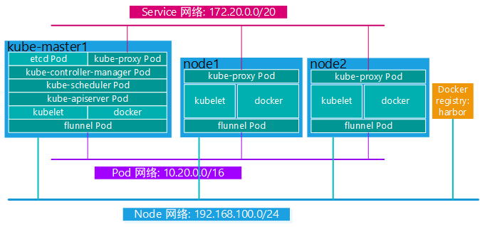

**部署环境：**

| IP              | 主机名                                | 角色                                   |
| :-------------- | :------------------------------------ | :------------------------------------- |
| 192.168.100.142 | kube-master1,kube-master1.suosuoli.cn | K8s 集群主节点 1                       |
| 192.168.100.144 | kube-master2,kube-master2.suosuoli.cn | K8s 集群主节点 2                       |
| 192.168.100.146 | kube-master3,kube-master3.suosuoli.cn | K8s 集群主节点 3                       |
| 192.168.100.160 | node1,node1.suosuoli.cn               | K8s 集群工作节点 1                     |
| 192.168.100.162 | node2,node2.suosuoli.cn               | K8s 集群工作节点 2                     |
| 192.168.100.164 | node3,node3.suosuoli.cn               | K8s 集群工作节点 3                     |
| 192.168.100.150 | ha1,ha1.suosuoli.cn                   | K8s 主节点访问入口 1(高可用及负载均衡) |
| 192.168.100.152 | ha2,ha2.suosuoli.cn                   | K8s 主节点访问入口 1(高可用及负载均衡) |
| 192.168.100.154 | harbor,harbor.suosuoli.cn             | 容器镜像仓库                           |
| 192.168.100.200 | 无                                    | VIP                                    |

**部署方式：**
Kubernetes 集群的部署方式有多种，使用批量部署工具如(ansible/saltstack)等
自动化大部分部署任务或者直接手动部署二进制预编译的软件包。还有一种方式是使用
kubeadm 结合 apt-get/yum 安装必要软件安装，以守护进程的方式启动在宿主机上，
本次就使用 kubeadm 来部署 Kubernetes 集群。

[kubeadm 部署参考文档](https://kubernetes.io/zh/docs/setup/independent/create-cluster-kubeadm/)

使用 k8s 官方提供的部署工具 kubeadm 自动安装，需要在 master 和 node 节点上
安装 docker 等组件，然后初始化，把管理端的控制服务和 node 上的服务都以 pod
的方式运行。[kubeadm 介绍](https://kubernetes.io/zh/docs/reference/setup-tools/kubeadm/kubeadm/)

[V1.10 版本 kubeadm 介绍](https://github.com/kubernetes/kubeadm/blob/master/docs/design/design_v1.10.md)

**部署目标：**
下图给出本次要部署的目标集群的基本环境。该集群有 3 个主节点和 3 个从节点，
使用 K8s 官方的部署工具**kubeadm**部署一个主节点，再将其他主节点和工作
节点加入集群。图中省略 kube-master2/3 和 node3:



# 一. 系统环境及部署前准备

## 1.1 系统版本及 Kubernetes 组件版本

## 1.2 主机名解析

在个主机设置集群的 IP 和主机名解析：

```bash
~# vim /etc/hosts

192.168.100.142 cube-master1 cube-master1.suosuoli.cn
192.168.100.144 cube-master2 cube-master2.suosuoli.cn
192.168.100.146 cube-master3 cube-master3.suosuoli.cn

192.168.100.160 node1 node1.suosuoli.cn
192.168.100.162 node2 node2.suosuoli.cn
192.168.100.164 node3 node3.suosuoli.cn

192.168.100.150 ha1 ha1.suosuoli.cn
192.168.100.152 ha2 ha2.suosuoli.cn
192.168.100.154 harbor harbor.suosuoli.cn
```

## 1.3 主机时间同步

在集群的 Master 和各 node 同步时间，也可写入计划任务：

```bash
~# ntpdate ntp.aliyun.com
```

或者

```bash
~# crontab -e
...
*/12 * * * * root /bin/bash ntpdate ntp.aliyun.com
```

## 1.4 关闭防火墙和 SELinux

Centos 系列关闭 SELinux：

```bash
~# setenforce 0
~# sed -i 's#^\(SELINUX=\).*#\1disabled#' /etc/sysconfig/selinux
```

Ubuntu：

```bash
~# systemctl stop firewalld
```

## 1.5 禁用 Swap 设备(可选)

```bash
~# swapoff -a
```

# 二. 部署 Kubernetes 集群

## 2.1 大致的部署步骤

[kubeadm 部署参考](https://kubernetes.io/docs/reference/setup-tools/kubeadm/kubeadm/)

1. 部署 HAProxy 和 Keepalived 作为 Kubernetes 管理端的访问入口，及实现访问入口高可用。
2. 在 Master 及各 Node 安装 Docker、kubelet、kubectl 和 kubeadm，以守护进程方式启动 Docker 及 kubelet。
3. 在其中一台 Master 上使用`kubeadm init`进程集群初始化。
4. 在其他的 Master 上使用`kubeadm join`命令加入集群。
5. 在各 Node 上使用`kubeadm join`命令加入初始化完成的集群。
6. 在集群上部署网络组件，如 flannel 或者 calico 等来提供 service 网络和 pod 网络。

## 2.2 在各 master 节点安装 kubeadm-kubelet-kubectl

### 2.2.1 在阿里云配置 K8s 镜像源

[配置镜像源方式参考](https://developer.aliyun.com/mirror/kubernetes?spm=a2c6h.13651102.0.0.3e221b11xSJQCw)

```bash
~# apt update && apt-get install -y apt-transport-https
~# curl https://mirrors.aliyun.com/kubernetes/apt/doc/apt-key.gpg | apt-key add -
~# cat <<EOF >/etc/apt/sources.list.d/kubernetes.list
deb https://mirrors.aliyun.com/kubernetes/apt/ kubernetes-xenial main
EOF
~# apt update
```

### 2.2.2 安装 kubeadm-kubelet-kubectl

```bash
~# apt-cache madison kubeadm  # 先查看一下有哪些可选版本
~# apt install kubeadm=1.17.2-00 kubelet=1.17.2-00 kubectl=1.17.2-00
```

## 2.3 在各 node 节点安装 kubelet-kubectl

同样，配置 kubernetes 镜像源

```bash
~# apt update && apt-get install -y apt-transport-https
~# curl https://mirrors.aliyun.com/kubernetes/apt/doc/apt-key.gpg | apt-key add -
~# cat <<EOF >/etc/apt/sources.list.d/kubernetes.list
deb https://mirrors.aliyun.com/kubernetes/apt/ kubernetes-xenial main
EOF
~# apt update
```

安装：

```bash
~# apt install kubelet=1.17.2-00 kubectl=1.17.2-00
```

## 2.4 Master 节点初始化集群

在三台 master 中任意一台进行集群初始化，而且集群初始化只需要初始化一次，中途
初始化失败，则使用`kubeadm reset`命令清除数据，然后再初始化。

### 2.4.1 kubeadm 命令用法

```bash
kubeadm init    启动一个 Kubernetes 主节点
kubeadm join    启动一个 Kubernetes 工作节点并且将其加入到集群
kubeadm upgrade 更新一个 Kubernetes 集群到新版本
kubeadm config  管理kubeadm集群的配置，该配置保留在集群的ConfigMap
                # kubeadm config print init-defaults
kubeadm token   使用 kubeadm join 来管理令牌
kubeadm reset   还原之前使用 kubeadm init 或者 kubeadm join 对节点产生的改变
kubeadm version 打印出 kubeadm 版本
kubeadm alpha   预览一组可用的新功能以便从社区搜集反馈

使得kubeadm可以自动补全：
~# apt install bash-completion
~# kubeadm completion bash > /etc/profile.d/kube-completion.sh
~# source /etc/profile.d/kube-completion.sh
```

`kubeadm init [flags]`:

```bash
[flags]:
--apiserver-advertise-address string
# API 服务器所公布的其正在监听的 IP 地址。如果未设置，则使用默认网络接口。
--apiserver-bind-port int32     默认值：6443
#API 服务器绑定的端口。
--apiserver-cert-extra-sans stringSlice
#用于 API Server 服务证书的可选附加主题备用名称（SAN）。可以是 IP 地址和 DNS 名称。
--cert-dir string     默认值："/etc/kubernetes/pki"
# 保存和存储证书的路径。
--certificate-key string
# 用于加密 kubeadm-certs Secret 中的控制平面证书的密钥。
--config string
# kubeadm 配置文件的路径。
--control-plane-endpoint string
# 为控制平面指定一个稳定的 IP 地址或 DNS 名称。
--cri-socket string
# 要连接的 CRI 套接字的路径。如果为空，则 kubeadm 将尝试自动检测此值；仅当安装了多个 CRI 或具有非标准 CRI 插槽时，才使用此选项。
--dry-run
# 不要应用任何更改；只是输出将要执行的操作。
-k, --experimental-kustomize string
# 用于存储 kustomize 为静态 pod 清单所提供的补丁的路径。
--feature-gates string
# 一组用来描述各种功能特性的键值（key=value）对。选项是：
IPv6DualStack=true|false (ALPHA - default=false)
-h, --help
# init 操作的帮助命令
--ignore-preflight-errors stringSlice
# 错误将显示为警告的检查列表；例如：'IsPrivilegedUser,Swap'。取值为 'all' 时将忽略检查中的所有错误。
--image-repository string     默认值："k8s.gcr.io"
# 选择用于拉取控制平面镜像的容器仓库
--kubernetes-version string     默认值："stable-1"
# 为控制平面选择一个特定的 Kubernetes 版本。
--node-name string
# 指定节点的名称。
--pod-network-cidr string
# 指明 pod 网络可以使用的 IP 地址段。如果设置了这个参数，控制平面将会为每一个节点自动分配 CIDRs。
--service-cidr string     默认值："10.96.0.0/12"
# 为服务的虚拟 IP 地址另外指定 IP 地址段
--service-dns-domain string     默认值："cluster.local"
# 为服务另外指定域名，例如："myorg.internal"。
--skip-certificate-key-print
# 不要打印用于加密控制平面证书的密钥。
--skip-phases stringSlice
# 要跳过的阶段列表
--skip-token-print
# 跳过打印 'kubeadm init' 生成的默认引导令牌。
--token string
# 这个令牌用于建立控制平面节点与工作节点间的双向通信。格式为 [a-z0-9]{6}\.[a-z0-9]{16} - 示例：abcdef.0123456789abcdef
--token-ttl duration     默认值：24h0m0s
# 令牌被自动删除之前的持续时间（例如 1 s，2 m，3 h）。如果设置为 '0'，则令牌将永不过期
--upload-certs
# 将控制平面证书上传到 kubeadm-certs Secret。
```

**初始化一个 Kubernetes 集群必须的选项：**

```bash
~# kubeadm init\
--apiserver-advertise-address=192.168.100.142\
--apiserver-bind-port=6443\
--ignore-preflight-errors='swap'\
--image-repository=registry.cn-hangzhou.aliyuncs.com/google_containers\
--kubernetes-version=v1.17.2\
--pod-network-cidr=10.20.0.0/16\
--service-cidr=172.20.0.0/20\
--service-dns-domain=suosuoli.local
```

### 2.4.2 确认 kubeadm 版本

```bash
root@kube-master1:~# kubeadm version
kubeadm version: &version.Info{Major:"1", Minor:"17", GitVersion:"v1.17.2", GitCommit:"59603c6e503c87169aea6106f57b9f242f64df89", GitTreeState:"clean", BuildDate:"2020-01-18T23:27:49Z", GoVersion:"go1.13.5", Compiler:"gc", Platform:"linux/amd64"}
```

### 2.4.3 准备镜像

查看安装指定版本 Kubernetes 需要的镜像有哪些:

```bash
root@kube-master1:~# kubeadm config images list --kubernetes-version v1.17.2
...
k8s.gcr.io/kube-apiserver:v1.17.2
k8s.gcr.io/kube-controller-manager:v1.17.2
k8s.gcr.io/kube-scheduler:v1.17.2
k8s.gcr.io/kube-proxy:v1.17.2
k8s.gcr.io/pause:3.1
k8s.gcr.io/etcd:3.4.3-0
k8s.gcr.io/coredns:1.6.5
```

### 2.4.4 在 Master 节点下载所需镜像

为避免在初始化过程中由于到 docker 镜像仓库拉取镜像失败，所以事先将所需的镜像
拉取到本地，之后再进行集群初始化。推荐提前在 master 节点下载镜像以减少安装等
待时间，但是镜像默认使用 Google 的镜像仓库，所以国内无法直接下载，但是可以通
过阿里云的镜像仓库把镜像先提前下载下来，可以避免后期因镜像下载异常而导致 k8s
部署异常。

```bash
root@kube-master1:~# vim pull-k8s-images.sh
root@kube-master1:~# cat pull-k8s-images.sh
#!/bin/bash

docker pull egistry.cn-hangzhou.aliyuncs.com/google_containers/kube-apiserver:v1.17.2
docker pull egistry.cn-hangzhou.aliyuncs.com/google_containers/kube-controller-manager:v1.17.2
docker pull egistry.cn-hangzhou.aliyuncs.com/google_containers/kube-scheduler:v1.17.2
docker pull egistry.cn-hangzhou.aliyuncs.com/google_containers/kube-proxy:v1.17.2
docker pull egistry.cn-hangzhou.aliyuncs.com/google_containers/pause:3.1
docker pull egistry.cn-hangzhou.aliyuncs.com/google_containers/etcd:3.4.3-0
docker pull egistry.cn-hangzhou.aliyuncs.com/google_containers/coredns:1.6.5

~# bash pull-k8s-images.sh
```

### 2.4.5 在某 Master 初始化集群

可以在使用 HAProxy 和 Keepalived 的基础上，通过 VIP 访问 Kubernetes
的各 Master 进程集群管理，此时需要额外指定一个控制平面 IP:`--control-plane-endpoint=IP`
该 IP 就是 Keepalived 维护的 VIP。而 Kubernetes 集群的三台 Master
均为 HAProxy 的后端服务器。

#### 2.4.5.1 单节点初始化

单节点初始化不需要指定控制平面 IP。

```bash
~# kubeadm init\
--apiserver-advertise-address=192.168.100.142\
--apiserver-bind-port=6443\
--ignore-preflight-errors='swap'\
--image-repository=registry.cn-hangzhou.aliyuncs.com/google_containers\
--kubernetes-version=v1.17.2\
--pod-network-cidr=10.20.0.0/16\
--service-cidr=172.20.0.0/20\
--service-dns-domain=suosuoli.local
```

#### 2.4.5.2 基于高可用方式初始化集群

HAProxy 和 Keepalived 配置：

```bash

```

**集群初始化：**

```bash
~# kubeadm init\
--apiserver-advertise-address=192.168.100.142\
--apiserver-bind-port=6443\
--control-plane-endpoint=192.168.100.200\  # VIP
--ignore-preflight-errors='swap'\
--image-repository=registry.cn-hangzhou.aliyuncs.com/google_containers\
--kubernetes-version=v1.17.2\
--pod-network-cidr=10.20.0.0/16\
--service-cidr=172.20.0.0/20\
--service-dns-domain=suosuoli.local

# 初始化成功后，提示如下：
Your Kubernetes control-plane has initialized successfully!

To start using your cluster, you need to run the following as a regular user:

# 开始管理和使用集群需要进行下面三步：
  mkdir -p $HOME/.kube
  sudo cp -i /etc/kubernetes/admin.conf $HOME/.kube/config
  sudo chown $(id -u):$(id -g) $HOME/.kube/config

# 部署一个网络组件到集群，以便集群进行通讯
You should now deploy a pod network to the cluster.
Run "kubectl apply -f [podnetwork].yaml" with one of the options listed at:
  https://kubernetes.io/docs/concepts/cluster-administration/addons/

You can now join any number of control-plane nodes by copying certificate authorities
and service account keys on each node and then running the following as root:

# 让Master加入该集群
  kubeadm join 192.168.100.200:6443 --token 9zsmf4.397srcnwos2k2p88 \
    --discovery-token-ca-cert-hash sha256:8206a3db3c75b5c2e6a198d138d4ff07c0a2050f0cba0cf03bbddefeb4495205 \
    --control-plane  --certificate-key 3d8375bd5eedcef6269f956f5120d3f600e097939a64b65477ffed2f56198080


Then you can join any number of worker nodes by running the following on each as root:

# 让node节点加入该集群
kubeadm join 192.168.100.200:6443 --token 9zsmf4.397srcnwos2k2p88 \
    --discovery-token-ca-cert-hash sha256:8206a3db3c75b5c2e6a198d138d4ff07c0a2050f0cba0cf03bbddefeb4495205
```

#### 2.4.5.3 基于 yaml 配置文件来初始化集群

使用默认的 kubeadm 配置文件编辑，修改部分选项后即可基于该配置文件部署：

编辑 kubeadm 配置文件：

```bash
root@kube-master1:~# kubeadm config print init-defaults > kubeadm-init.yaml
root@kube-master1:~# vim kubeadm-init.yaml
root@kube-master1:~# cat kubeadm-init.yaml
apiVersion: kubeadm.k8s.io/v1beta2
bootstrapTokens:
- groups:
  - system:bootstrappers:kubeadm:default-node-token
  token: abcdef.0123456789abcdef
  ttl: 24h0m0s
  usages:
  - signing
  - authentication
kind: InitConfiguration
localAPIEndpoint:
  advertiseAddress: 192.168.100.142  # 本机IP
  bindPort: 6443
nodeRegistration:
  criSocket: /var/run/dockershim.sock
  name: kube-master1.suosuoli.cn
  taints:
  - effect: NoSchedule
    key: node-role.kubernetes.io/master
---
apiServer:
  timeoutForControlPlane: 4m0s
apiVersion: kubeadm.k8s.io/v1beta2
certificatesDir: /etc/kubernetes/pki
clusterName: kubernetes
controlPlaneEndpoint: 192.168.100.200:6443  # 控制平面IP，也就是VIP
controllerManager: {}
dns:
  type: CoreDNS
etcd:
  local:
    dataDir: /var/lib/etcd
imageRepository: registry.cn-hangzhou.aliyuncs.com/google_containers # 阿里云镜像
kind: ClusterConfiguration
kubernetesVersion: v1.17.0
networking:
  dnsDomain: cluster.local
  podSubnet: 10.20.0.0/16  # pod网络网段
  serviceSubnet: 172.20.0.0/20 # service网络网段
scheduler: {}
```

部署：

```bash
~# kubeadm init --config kubeadm-init.yaml
```

### 2.4.6 部署 flannel 组件

[flannel 组件部署配置文件](https://github.com/coreos/flannel/blob/master/Documentation/kube-flannel.yml)

```bash
~# wget https://github.com/coreos/flannel/blob/master/Documentation/kube-flannel.yml
~# kubectl apply -f kube-flannel.yml
```

验证 master 节点状态：

```bash
~# kubectl get node
root@kube-master1:~# kubectl get node
NAME           STATUS   ROLES    AGE     VERSION
kube-master1   Ready    master   7h6m    v1.17.2
```

# 三. 添加集群节点

## 3.1 添加 Master 到集群

### 3.1.1 在 master1 生成证书用于添加新的 master 节点

```bash
~# kubeadm init phase upload-certs --upload-certs
```

### 3.1.2 添加新 master

在另外一台已经安装了 docker、kubeadm 和 kubelet 的 master 节点上执行以下操作:

```bash
root@kube-master2:~# kubeadm join 192.168.100.200:6443 --token 9zsmf4.397srcnwos2k2p88 \
--discovery-token-ca-cert-hash sha256:8206a3db3c75b5c2e6a198d138d4ff07c0a2050f0cba0cf03bbddefeb4495205 \
 --control-plane  --certificate-key 3d8375bd5eedcef6269f956f5120d3f600e097939a64b65477ffed2f56198080
```

添加成功提示：

```bash
...
This node has joined the cluster and a new control plane instance was created:

* Certificate signing request was sent to apiserver and approval was received.
* The Kubelet was informed of the new secure connection details.
* Control plane (master) label and taint were applied to the new node.
* The Kubernetes control plane instances scaled up.
* A new etcd member was added to the local/stacked etcd cluster.

To start administering your cluster from this node, you need to run the following as a regular user:

# 在当前主机执行以下三步：
	mkdir -p $HOME/.kube
	sudo cp -i /etc/kubernetes/admin.conf $HOME/.kube/config
	sudo chown $(id -u):$(id -g) $HOME/.kube/config

Run 'kubectl get nodes' to see this node join the cluster.
```

在第三台主机执行相同操作，后查看集群状态：

```bash
root@kube-master1:~# kubectl get node
NAME           STATUS   ROLES    AGE     VERSION
cube-master3   Ready    master   6h43m   v1.17.2
kube-master1   Ready    master   7h12m   v1.17.2
kube-master2   Ready    master   6h50m   v1.17.2
```

验证集群状态：

```bash
root@kube-master1:~# kubectl get cs
NAME                 STATUS    MESSAGE             ERROR
controller-manager   Healthy   ok
scheduler            Healthy   ok
etcd-0               Healthy   {"health":"true"}
```

## 3.2 添加 node 工作节点到集群

各需要加入到 k8s master 集群中的 node 节点都要安装 docker、kubeadm、kubelet ，
因此都要重新执行安装 docker kubeadm kubelet 的步骤，即配置 apt 仓库、配置
docker 加速器、安装命令、启动 kubelet 服务。

### 3.2.1 加入集群

```bash
root@node1:/usr/local/src# kubeadm join 192.168.100.200:6443 --token 9zsmf4.397srcnwos2k2p88 \
--discovery-token-ca-cert-hash sha256:8206a3db3c75b5c2e6a198d138d4ff07c0a2050f0cba0cf03bbddefeb4495205
```

注：Node 节点会自动加入到 master 节点，下载镜像并启动 flannel，直到最终在
master 看到 node 处于 Ready 状态

### 3.2.2 检查 node 节点状态

```bash
root@kube-master1:~# kubectl get node
NAME           STATUS   ROLES    AGE     VERSION
cube-master3   Ready    master   6h49m   v1.17.2
kube-master1   Ready    master   7h17m   v1.17.2
kube-master2   Ready    master   6h56m   v1.17.2
node1          Ready    <none>   6h7m    v1.17.2
node2          Ready    <none>   6h5m    v1.17.2
node3          Ready    <none>   6h1m    v1.17.2
```

# 四. 创建容器并测试

## 4.1 创建 alpine pod

```bash
~# kubectl run for-net-test-again --image=alpine:3 --replicas=3 sleep 360000

root@kube-master1:~# kubectl get pod -n default
NAME                                  READY   STATUS    RESTARTS   AGE
for-net-test-again-689b78c666-7vt98   1/1     Running   1          166m
for-net-test-again-689b78c666-8g5vs   1/1     Running   0          166m
for-net-test-again-689b78c666-z7pn4   1/1     Running   0          166m

root@kube-master1:~# kubectl get pod -o wide
NAME                                  READY   STATUS    RESTARTS   AGE    IP           NODE    NOMINATED NODE   READINESS GATES
for-net-test-again-689b78c666-7vt98   1/1     Running   1          166m   10.20.3.13   node1   <none>           <none>
for-net-test-again-689b78c666-8g5vs   1/1     Running   0          166m   10.20.4.4    node2   <none>           <none>
for-net-test-again-689b78c666-z7pn4   1/1     Running   0          166m   10.20.5.7    node3   <none>           <none>
```

## 4.2 测试网络连通情况

```bash
root@kube-master1:~# kubectl exec for-net-test-again-689b78c666-7vt98 -i -t -- sh

/ # ping 10.20.3.13  # ping自己
PING 10.20.3.13 (10.20.3.13): 56 data bytes
64 bytes from 10.20.3.13: seq=0 ttl=64 time=0.315 ms
^C
--- 10.20.3.13 ping statistics ---
1 packets transmitted, 1 packets received, 0% packet loss
round-trip min/avg/max = 0.315/0.315/0.315 ms

/ # ping 10.20.4.4  # ping另一个pod
PING 10.20.4.4 (10.20.4.4): 56 data bytes
64 bytes from 10.20.4.4: seq=0 ttl=62 time=1.376 ms
64 bytes from 10.20.4.4: seq=1 ttl=62 time=0.546 ms
^C
--- 10.20.4.4 ping statistics ---
2 packets transmitted, 2 packets received, 0% packet loss
round-trip min/avg/max = 0.546/0.961/1.376 ms

/ # ping 10.20.5.7  # ping另另一个pod
PING 10.20.5.7 (10.20.5.7): 56 data bytes
64 bytes from 10.20.5.7: seq=0 ttl=62 time=0.927 ms
64 bytes from 10.20.5.7: seq=1 ttl=62 time=0.462 ms
^C
--- 10.20.5.7 ping statistics ---
2 packets transmitted, 2 packets received, 0% packet loss
round-trip min/avg/max = 0.462/0.694/0.927 ms

/ # ping www.baidu.com # ping百度
PING www.baidu.com (61.135.169.121): 56 data bytes
64 bytes from 61.135.169.121: seq=0 ttl=127 time=12.220 ms
64 bytes from 61.135.169.121: seq=1 ttl=127 time=7.681 ms
^C
--- www.baidu.com ping statistics ---
2 packets transmitted, 2 packets received, 0% packet loss
round-trip min/avg/max = 7.681/9.950/12.220 ms

/ # ping www.suosuoli.cn  # ping我的网站
PING www.suosuoli.cn (49.235.246.92): 56 data bytes
64 bytes from 49.235.246.92: seq=0 ttl=127 time=30.981 ms
64 bytes from 49.235.246.92: seq=1 ttl=127 time=33.570 ms
^C
--- www.suosuoli.cn ping statistics ---
2 packets transmitted, 2 packets received, 0% packet loss
round-trip min/avg/max = 30.981/32.275/33.570 ms
/ #
```

# 五. 部署 Dashboard

## 5.1
