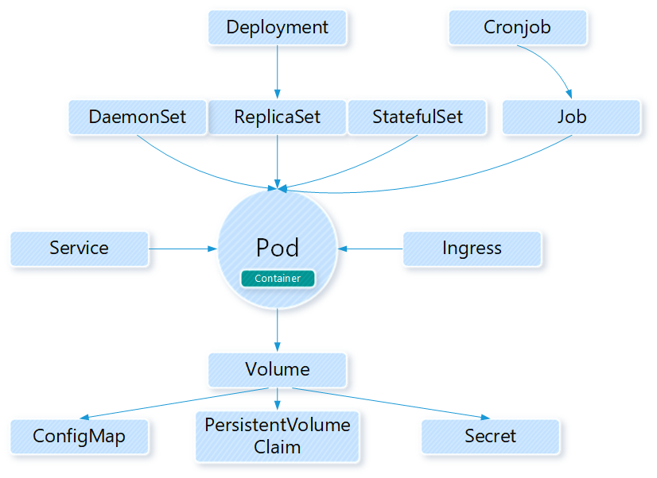
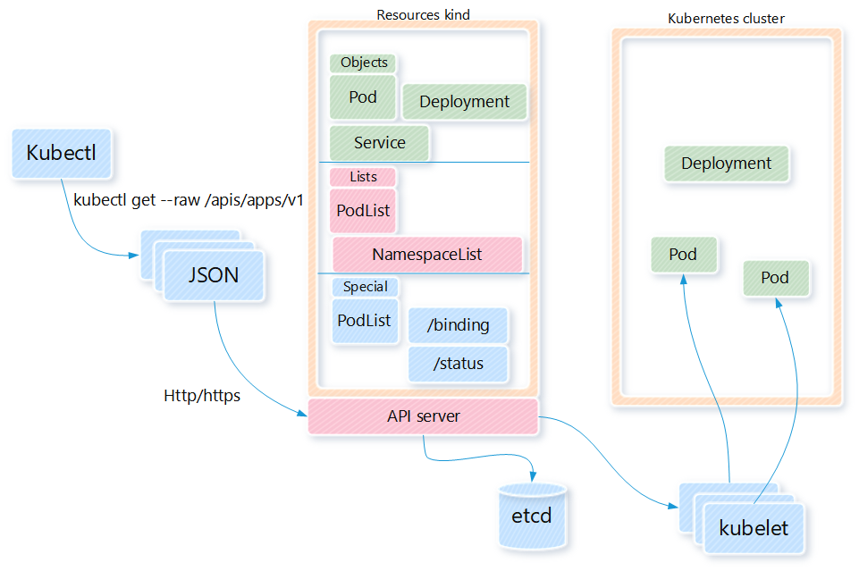

Kubernetes 集群系统的 API Server 基于 HTTP/HTTPS 接收并相应客户端的操作请求，其提供了
基于资源(resourced-based)的 RESTful 风格的编程接口，将集群的各种组件都抽象为标准的 REST
资源，并支持通过标准的 HTTP 方法以 json 格式为数据序列化方法进行资源管理操作。

# 一. 资源对象及 API 群组

Kubernetes 系统将一切事物都抽象为 API 资源，其遵循 REST 架构风格组织并管理这些资源对象，
使用标准的 HTTP 方法(POST,PUT,PATCH,DELETE 和 GET)对资源进行增、删、改和查。需要区分
的是，在 Kubernetes 系统的语境中，资源代表了对象的集合，例如：Pod 资源可用于描述所有 Pod
类型的对象。对象实质是资源类型生成的实例。

## 1.1 Kubernetes 的资源对象

从资源的主要功能上可以把 Kubernetes 的资源对象分为：Workloads(工作负载)、
Service,LoadBalancing and Networking(服务发现和负载均衡)、存储和配置(Storage&Configuration)、
Cluster Admin(集群管理)、Policies&Scheduling(策略和调度)和 Metadata(元数据)。
设计这些资源的核心目的就是：如何更好的运行和管理 Pod 资源，为容器化应用提供更灵活、
更完善的操作与管理组件。



### 1.1.1 Workloads 类资源

- ReplicationController
  第一代的无状态 Pod 应用控制器，用于保证容器总是运行并且可访问
- ReplicaSet
  替代上一代控制器，支持基于集合的 Selector，而 ReplicationController 的 selector 只支持
  等值选择
- Deployment
  用于管理无状态的持久化应用(如 HTTP 服务器)，是构建在 ReplicaSet 上的更高级的控制器，使用
  该控制器实质是调用了 ReplicaSet 控制器
- StatefulSet
  用于管理有状态的持久化应用，如 database 服务，StatefulSet 会为每个 pod 创建一个独有的
  持久性标识符，并确保 pod 之间的顺序性
- DaemonSet
  常用于运行集群守护进程(glusterd,ceph)，日志收集进程(flunentd，logstash)和监控进程(Prometheus)
- Job
  用于创建运行完成后即可终止的应用

### 1.1.2 Service&Loadbalancing&Networking

- Service
  https://kubernetes.io/zh/docs/concepts/services-networking/service/

- EndPoint
  https://kubernetes.io/docs/concepts/services-networking/endpoint-slices/

### 1.1.3 Configuration&Storage

- Volume 资源
  Volume 资源用来挂载外部存储卷，支持众多的存储设备或存储系统
- ConfigMap 资源
  ConfigMap 资源能以环境变量或者存储卷的方式接入到 pod 资源的容器中，并且可以被多个同类型
  的 pod 共享引用
- Secret 资源
  Secret 资源用来存储私钥、密码等敏感数据

### 1.1.4 集群级别的资源

- Namespace
  绝大多数对象都隶属于某个名称空间，默认时隶属于 default 名称空间
- Node
  Kubernetes 集群的工作节点，其标识符在当前集群中必须是唯一的
- Role
  名称空间级别的规则组成的权限的集合，可被 RoleBinding 引用
- ClusterRole
  集群级别的规则组成的权限集合，可被 RoleBinding 和 ClusterRoleBinding 引用
- RoleBinding
  将 Role 中的许可权限绑定在一个或一组用户之上
- ClusterRoleBinding
  将 ClusterRole 中定义的许可权限绑定在一个或一组用户之上

### 1.1.5 其他资源对象

- HorizontalPodAutoscaler：HPA，其可用于自动伸缩工作负载类型的资源对象的规模
- Pod 模板资源：可用于为 pod 资源的创建预备模板
- LimitRange 资源：可以为名称空间的资源设置其 CPU 和内存等系统资源的限制

## 1.2 资源及其在 API 中的组织形式

Kubernetes 利用标准的 RESTful 术语来描述其 API 概念。

- 资源类型：是指在 URL 中使用的名称，如 Pod、Namespace 和 Service 等，其 URL 格式为
  "GROUP/VERSION/RESOURCE"，如实际使用的：/apps/v1/deployment
- 所有资源类型都有一个对应的 JSON 表示格式：kind(种类)，在 K8s 中用户创建对象必须以 JSON
  格式提交对象的配置信息。
- 隶属于同一资源类型的对象组成的列表称为 collection(集合)，如 PodList
- 某种类型的单个实例称为"resource"(资源)或"object"(对象)，如运行的名为 stevie's pod 的 Pod 对象

kind 代表了资源对象所属的类型，如 Namespace、Deployment、Service 等类型，这些类型又可以
分为三个类别：

- Object 类：对象表示 K8s 系统上的持久化实体，Namespace、Deployment、Service 和 Pod 都属于该类别
- List 列表类：列表是指同一类型资源的集合，如 PodList、NodeList 等。
- Simple 简单类：常用于子啊对象上执行某种特殊操作，或者管理非持久的实体，如/binding 或/status 等

在 Kubernetes 系统中，所有的对象型资源都有一个独有的名称表示以实现其冥等的创建及获取操作。有的
资源隶属于集群范畴，如 Namespace 和 PersistentVolume，而多数资源类型则受限于名称空间，如 Pod、
Deployment 和 Service 等。名称空间级别的资源的 URL 路径中含有其所属空间的名称，这些资源对象在
名称空间被删除时会被一并删除，这些资源的访问也受控于其所属的名称空间级别的授权。

Kubernetes 将 API 分割为多个逻辑组合，称为**API 群组**，不同的群组支持单独启用或禁用，并可以再次
分解。群组化管理的 API 使得其可以更轻松的进行扩展。当前 K8s 集群系统上的 API server 上的相关信息可以
使用`kubectl api-versions`获取。配置资源清单时会使用 API 群组：

```bash
# API群组
root@kube-master1:~# kubectl api-versions
admissionregistration.k8s.io/v1
admissionregistration.k8s.io/v1beta1
apiextensions.k8s.io/v1
apiextensions.k8s.io/v1beta1
apiregistration.k8s.io/v1
apiregistration.k8s.io/v1beta1
apps/v1
authentication.k8s.io/v1
authentication.k8s.io/v1beta1
authorization.k8s.io/v1
authorization.k8s.io/v1beta1
autoscaling/v1
autoscaling/v2beta1
autoscaling/v2beta2
batch/v1
batch/v1beta1
certificates.k8s.io/v1beta1
coordination.k8s.io/v1
coordination.k8s.io/v1beta1
discovery.k8s.io/v1beta1
events.k8s.io/v1beta1
extensions/v1beta1
networking.k8s.io/v1
networking.k8s.io/v1beta1
node.k8s.io/v1beta1
policy/v1beta1
rbac.authorization.k8s.io/v1
rbac.authorization.k8s.io/v1beta1
scheduling.k8s.io/v1
scheduling.k8s.io/v1beta1
storage.k8s.io/v1
storage.k8s.io/v1beta1
v1
```

Kubernetes 的 API 以层级结构组织在一起，常用的 API 群组可以归为以下两类：

- **核心群组(core group)：**REST 路径为`/api/v1`，在资源的配置信息`apiVersion`字段中
  引用时可以不用指定路径，如:"apiVersion: v1"

- **命名的群组(named group)：**

- 获取名为 apps 的 API 群组信息：

```bash
root@kube-master1:~# kubectl get --raw /apis/apps | jq
{
  "kind": "APIGroup",
  "apiVersion": "v1",
  "name": "apps",
  "versions": [
    {
      "groupVersion": "apps/v1",
      "version": "v1"
    }
  ],
  "preferredVersion": {
    "groupVersion": "apps/v1",
    "version": "v1"
  }
}
```

- 获取所有的 Deployment 对象的列表：

```bash
root@kube-master1:~# kubectl get --raw /apis/apps/v1/deployments | jq .
{
  "kind": "DeploymentList",  # Deployment列表
  "apiVersion": "apps/v1",
  "metadata": {
    "selfLink": "/apis/apps/v1/deployments",
    "resourceVersion": "369960"
  },
  "items": [
      ...
  ]
```

## 1.3 访问 Kubernetes REST API

可以使用 curl 作为 http 客户端直接通过 API server 在集群上操作资源对象模拟请求和响应
过程，只不过 kubeadm 部署的 k8s 集群默认只支持 HTTPS 协议访问接口，但是用户可以使用
`kubectl proxy`命令来在本地主机上为 API server 启动一个代理网关，由其支持使用 HTTP 进行
通信。

- 启动一个代理

```bash
root@kube-master1:/opt/k8s-data/yaml/proj1# kubectl proxy --port=8081
Starting to serve on 127.0.0.1:8081

```

- 访问

```bash
root@kube-master1:~# curl 127.0.0.1:8081/api/
{
  "kind": "APIVersions",
  "versions": [
    "v1"
  ],
  "serverAddressByClientCIDRs": [
    {
      "clientCIDR": "0.0.0.0/0",
      "serverAddress": "192.168.100.144:6443"
    }
  ]

```

- 使用 jq 命令(CLI 下的 json 处理命令)处理结果：

```bash
root@kube-master1:~# curl 127.0.0.1:8081/api/ 2> /dev/null | jq .kind
"APIVersions"

root@kube-master1:~# curl 127.0.0.1:8081/api/ 2> /dev/null | jq .serverAddressByClientCIDRs
[
  {
    "clientCIDR": "0.0.0.0/0",
    "serverAddress": "192.168.100.146:6443"
  }
]

```

- 查看某个 Namespace 资源情况

```bash
root@kube-master1:~# curl 127.0.0.1:8081/api/v1/namespaces/nginx-deployment 2> /dev/null | jq
{
  "kind": "Namespace",
  "apiVersion": "v1",
  "metadata": {
    "name": "nginx-deployment",
    "selfLink": "/api/v1/namespaces/nginx-deployment",
    "uid": "414765e2-a691-488e-bb62-94c1d98468b7",
    "resourceVersion": "284299",
    "creationTimestamp": "2020-03-31T05:18:51Z",
    "annotations": {
      "kubectl.kubernetes.io/last-applied-configuration": "{\"apiVersion\":\"v1\",\"kind\":\"Namespace\",\"metadata\":{\"annotations\":{},\"name\":\"nginx-deployment\"}}\n"
    }
  },
  "spec": {
    "finalizers": [
      "kubernetes"
    ]
  },
  "status": {
    "phase": "Active"
  }
}
# kind字段
root@kube-master1:~# curl 127.0.0.1:8081/api/v1/namespaces/nginx-deployment 2> /dev/null | jq .kind
"Namespace"
# apiVersion字段
root@kube-master1:~# curl 127.0.0.1:8081/api/v1/namespaces/nginx-deployment 2> /dev/null | jq .apiVersion
"v1"
# metadata字段
root@kube-master1:~# curl 127.0.0.1:8081/api/v1/namespaces/nginx-deployment 2> /dev/null | jq .metadata
{
  "name": "nginx-deployment",
  "selfLink": "/api/v1/namespaces/nginx-deployment",
  "uid": "414765e2-a691-488e-bb62-94c1d98468b7",
  "resourceVersion": "284299",
  "creationTimestamp": "2020-03-31T05:18:51Z",
  "annotations": {
    "kubectl.kubernetes.io/last-applied-configuration": "{\"apiVersion\":\"v1\",\"kind\":\"Namespace\",\"metadata\":{\"annotations\":{},\"name\":\"nginx-deployment\"}}\n"
  }
}
# spec字段
root@kube-master1:~# curl 127.0.0.1:8081/api/v1/namespaces/nginx-deployment 2> /dev/null | jq .spec
{
  "finalizers": [
    "kubernetes"
  ]
}
# status字段
root@kube-master1:~# curl 127.0.0.1:8081/api/v1/namespaces/nginx-deployment 2> /dev/null | jq .status
{
  "phase": "Active"
}
```

如上面的属于 Namespace 类型的名为 nginx-deployment 的资源信息，其表现为一个 JSON 序列化的数据
，Kubernetes 大多数资源对象的配置格式都为 JSON 格式，具有 kind、apiVersion、metadata、spec 和
status 五个一级字段。

# 二. 对象类资源格式

Kubernetes API 只接受及响应 JSON 格式的数据对象。同时，为了使用方便，它允许用户提供 YAML 格式的
POST 对象，由 API server 事先自行将其转换为 JSON 格式后提交。API server 接受和返回的所有 JSON
对象都遵循同一个模式，它们都具有 kind 和 apiVersion 字段，表示了对象所属的资源类型和 API 群组及版本。

大部分的对象或类别类型的资源还需要有三个嵌套的字段：metadata、spec 和 status 字段。其中，metadata
为资源提供元数据，如名称、隶属的名称空间和标签等；spec 字段则用于定义用户期望的状态，不同的资源类型
，其状态的意义也各有不同，如 Pod 资源最为核心的功能在于运行容器；status 字段则记录着活动对象的当前
状态信息，它由 KUbernetes 系统自行维护，对用户来说为只读字段。

## 2.1 资源配置清单

用户可以使用`kubectl get TYPE/NAME -o yaml/json`命令来获取任何一个对象的
yaml 或者 json 格式的配置清单，如获取名称空间类型 kube-system 的配置清单：

```bash
root@kube-master2:~# kubectl get namespace kube-system -o yaml
```

```yaml
apiVersion: v1
kind: Namespace
metadata:
  creationTimestamp: "2020-03-28T09:14:26Z"
  name: kube-system
  resourceVersion: "4"
  selfLink: /api/v1/namespaces/kube-system
  uid: 662acc6a-9850-4cc2-b8b5-0fcc4c4bf32d
spec:
  finalizers:
    - kubernetes
status:
  phase: Active
```

除了部分极少数的资源，K8s 系统上的绝大多数资源都是由其使用者所创建的。创建时先要使用 yaml 或者 json
格式定义资源相关的配置数据，即用户期望的目标状态，而后在有 K8s 的底层组件确保活动对象的运行时
状态与用户提供的配置清单中定义的状态无限接近。在配置资源清单时一般使用 yaml 格式，其中 status
字段有 K8s 自动维护，用户无需配置。如下为创建一个 Namespace 资源时的配置清单示例：

```bash
root@kube-master1:/opt/k8s-data/yaml# cat namespaces/proj1.yaml
```

```yaml
apiVersion: v1
kind: Namespace
metadata:
  name: proj1
```

将该资源创建到集群使用命令`kubectl apply -f /path/to/proj1.yaml`:

```bash
root@kube-master1:/opt/k8s-data/yaml# kubectl apply -f namespaces/proj1.yaml
namespace/proj1 created
```

查看创建后的 proj1 资源：

```bash
root@kube-master1:/opt/k8s-data/yaml# kubectl get namespace proj1 -o yaml
```

```yaml
apiVersion: v1
kind: Namespace
metadata:
  annotations:
    kubectl.kubernetes.io/last-applied-configuration: |
      {"apiVersion":"v1","kind":"Namespace","metadata":{"annotations":{},"name":"proj1"}}
  creationTimestamp: "2020-04-01T08:10:57Z"
  name: proj1
  resourceVersion: "382045"
  selfLink: /api/v1/namespaces/proj1
  uid: 783940f0-1cb2-49f7-b062-0feb5ece50d7
spec:
  finalizers:
    - kubernetes
status:
  phase: Active
```

从命令结果可以看到，proj1 是 Namespace 类型的资源，系统自动为该资源添加了 spec 和 status 字段。
需要注意的是，有的资源如 Deployment，spec 字段必须在资源清单中指定。该输出也遵循 Kubernetes
API 标准的资源组织格式，由 apiVersion、kind、metadata、spec 和 status 五个核心字段组成。

值得指出的是：几乎所有的资源，apiVersion、kind 和 metadata 字段的功能基本相同。但是 spec
字段则可以大不相同，spec 用于规定资源的期望状态，而资源的嵌套属性是由巨大差别的。status
字段则记录活动对象的当前状态，其要与 spec 中定义的状态相同，或者处于正转换为与其相同的过程。

## 2.2 metadata 嵌套字段

metadata 字段用于描述对象的属性信息，其内嵌多个用于定义资源的元数据，如 name 和 labels 等。
这些字段可以分为必选字段和可选字段，必选字段：

- namespace: 指定当前对象隶属的名称空间，默认值为 default
- name: 设定当前对象的名称，在其所属的名称空间的同一类型中必须唯一
- uid: 当前对象的唯一表示符，用于区别"已删除"和"重新创建"的同一个名称的对象

可选字段通常是指有 Kubernetes 系统自行维护和设置，或者存在默认，或允许使用空值的字段。有：

- labels: 设定用于标识当前对象的标签，键值数据，常用作挑选条件
- annotation: 非标识型键值数据，用来作为挑选条件，用于 labels 的补充
- resourceVersion: 当前对象的内部版本标识，用来让客户端确定对象的变动与否
- generation: 标识当前对象目标状态的代别
- creationTimestamp: 当前对象创建日期的时间戳
- deletionTimestamp: 当前对象删除日期的时间戳

用户创建对象时，资源清单一定要定义必须的字段，可选字段可以按需定义。对于用户未明确定义的
嵌套字段，则需要由一系列的**finalizer 组件**字段予以填充。

## 2.3 spec 和 status 字段

定义资源配置清单时，spec 是必须的字段。用于描述对象的目标状态，也就是用户期望对象所表现
出来的特征。status 字段记录对象的当前状态(实际运行的状态)，有 Kubernetes 系统负责更新，
用户不能手动定义。Master 节点的 controller manager 通过相应的控制器组件动态管理并确保
对象的实际转态匹配用户所期望的状态。

举个栗子：Deployment 是一种描述集群中运行应用的资源对象，因此，创建 Deployment 类型对象
时，需要为目标 Deployment 对象设定 spec，指定期望需要运行的 Pod 副本数量、使用的标签
选择器以及 Pod 模板等。在创建时，Kubernetes 相关组件读取待创建的 Deployment 对象的 spec
以及系统上相应的活动对象的当前状态，必要时对活动的对象更新以确保 status 字段吻合 spec 字段
中期望的状态。

spec 字段中嵌套的字段对于不同的对象类型来说各不相同，具体字段含义及所接受的数据类型需要
参照 Kubernets API 手册中的说明进行获取。

[v1.18 Kubernetes API 参考](https://kubernetes.io/docs/reference/generated/kubernetes-api/v1.18/#deployment-v1-apps)

## 2.4 资源配置清单格式文档

定义资源配置清单时，apiVersion、kind 和 metadata 都大同小异，但是 spec 字段对不同的
资源来说却是差别迥异。因此，用户在编写资源清单时要参考 Kubernetes API 的参考文档来了
解各种可用属性字段。在 K8s 系统中内建了清单各个属性字段含义及所接受的数据类型等相关
文档，用户可以使用`kubectl explain`命令来随时获取使用帮助，该命令根据给出的对象类型
或者相应的嵌套字段来显示该字段所接受的下一级字段相关文档。例如，查看 Pod 资源的一级字段
文档帮助，可以这样：

```bash
root@kube-master1:/opt/k8s-data/yaml# kubectl explain pods
# 或者
root@kube-master1:/opt/k8s-data/yaml# kubectl explain pods.
KIND:     Pod
VERSION:  v1

DESCRIPTION:
     Pod is a collection of containers that can run on a host. This resource is
     created by clients and scheduled onto hosts.

FIELDS:  # pods可以接受的二级字段
   apiVersion   <string>
   ...
   kind <string>
   ...
   metadata     <Object>
   ...
   spec <Object>
   ...
   status       <Object>
   ...
```

哪些资源可以使用 explain 来获取文档帮助?可以使用`kubectl api-resources`查看

```bash
root@kube-master1:/opt/k8s-data/yaml# kubectl api-resources | awk '{print $1}'
NAME
bindings
componentstatuses
configmaps
endpoints
events
limitranges
namespaces
nodes
persistentvolumeclaims
persistentvolumes
pods
podtemplates
replicationcontrollers
resourcequotas
secrets
serviceaccounts
services
mutatingwebhookconfigurations
validatingwebhookconfigurations
customresourcedefinitions
apiservices
controllerrevisions
daemonsets
deployments
replicasets
statefulsets
tokenreviews
localsubjectaccessreviews
selfsubjectaccessreviews
selfsubjectrulesreviews
subjectaccessreviews
horizontalpodautoscalers
cronjobs
jobs
certificatesigningrequests
leases
endpointslices
events
ingresses
ingresses
networkpolicies
runtimeclasses
poddisruptionbudgets
podsecuritypolicies
clusterrolebindings
clusterroles
rolebindings
roles
priorityclasses
csidrivers
csinodes
storageclasses
volumeattachments
```

需要了解某一级字段表示的对象之下的二级对象字段，则只需要使用一个英文的句点指定其一级字段
的对象名称，三级和四级对象一次类推。

```bash
# pods.spec字段下可接受下面的字段
root@kube-master1:/opt/k8s-data/yaml# kubectl explain pods.spec | grep -E "^ {,3}[a-z]"
   activeDeadlineSeconds        <integer>
   affinity     <Object>
   automountServiceAccountToken <boolean>
   containers   <[]Object> -required-
   dnsConfig    <Object>
   dnsPolicy    <string>
   enableServiceLinks   <boolean>
   ephemeralContainers  <[]Object>
   hostAliases  <[]Object>
   hostIPC      <boolean>
   hostNetwork  <boolean>
   hostPID      <boolean>
   hostname     <string>
   imagePullSecrets     <[]Object>
   initContainers       <[]Object>
   nodeName     <string>
   nodeSelector <map[string]string>
   overhead     <map[string]string>
   preemptionPolicy     <string>
   priority     <integer>
   priorityClassName    <string>
   readinessGates       <[]Object>
   restartPolicy        <string>
   runtimeClassName     <string>
   schedulerName        <string>
   securityContext      <Object>
   serviceAccount       <string>
   serviceAccountName   <string>
   shareProcessNamespace        <boolean>
   subdomain    <string>
   terminationGracePeriodSeconds        <integer>
   tolerations  <[]Object>
   topologySpreadConstraints    <[]Object>
   volumes      <[]Object>
```

依次查看编写资源清单所需的字段及其所需的数据类型，就可以编写资源清单啦：

```bash
root@kube-master1:/opt/k8s-data/yaml# kubectl explain pods.spec.containers.ports.containerPort
KIND:     Pod
VERSION:  v1

FIELD:    containerPort <integer>

DESCRIPTION:
     Number of port to expose on the pod's IP address. This must be a valid port
     number, 0 < x < 65536.
```

对象的 spec 字段的文档通常包含 RESOURCE、DESCRIPTION 和 FIELDS 三节：

```bash
root@kube-master1:/opt/k8s-data/yaml# kubectl explain pods.spec. | head -n20
KIND:     Pod
VERSION:  v1

RESOURCE: spec <Object>  ###########

DESCRIPTION:             ###########
     Specification of the desired behavior of the pod. More info:
     https://git.k8s.io/community/contributors/devel/sig-architecture/api-conventions.md#spec-and-status

     PodSpec is a description of a pod.

FIELDS:                  ###########
   activeDeadlineSeconds        <integer>
     Optional duration in seconds the pod may be active on the node relative to
     StartTime before the system will actively try to mark it failed and kill
     associated containers. Value must be a positive integer.

   affinity     <Object>
     If specified, the pod's scheduling constraints
     ......
```

其中 FIELDS 节中给出了可以嵌套使用的下一级字段、数据类型及功能描述。如：

```bash
root@kube-master1:/opt/k8s-data/yaml# kubectl explain pods.spec. | grep -A 20 "^ \+containers"
   containers   <[]Object> -required-
     List of containers belonging to the pod. Containers cannot currently be
     added or removed. There must be at least one container in a Pod. Cannot be
     updated.
```

FIELDS 节中的 containers 字段数据类型为一个列表对象([]Object)，而且是一个必选字段。
任何值为对象的字段都会嵌套一个到多个下一阶段字段。

另外，用户也可以根据当前系统已有的活动资源来生成资源清单模板，更快速的使用资源。
使用`kubectl get TYPE NAME -o yaml --export > /path/to/export-resourcelist.yaml`
命令来导出 yaml 格式的资源清单：

```bash
root@kube-master1:/opt/k8s-data/yaml# kubectl get deployment -n nginx-deployment
NAME              READY   UP-TO-DATE   AVAILABLE   AGE
nginx-depoyment   1/1     1            1           32h
root@kube-master1:/opt/k8s-data/yaml# kubectl get deployment nginx-deployment -o yaml --export > /opt/nginx-demo.yaml
```

## 2.5 资源对象的管理方式

Kubernetes 的 API server 遵循声明式编程范式(declarative programming)而设计，侧重于
构建程序逻辑而无需用户描述实现其的步骤和流程，用户只需要设定期望的状态，系统就会自行
确定需要执行的操作以确保达到用户期望的状态。例如，期望 Deployment 控制器管理三个 Pod
资源对象时，而系统观察到的当前数量却是两个，于是系统就会自行创建一个新的 Pod 来满足此
预期。Kubernetes 的自愈、直治等功能都依赖于其声明式机制。

另外，Kubernetes 的 API server 也支持陈述式范式(imperative programming)，直接通过
命令及其选项完成对象的管理操作，如`kubectl run/expose/delete/get`等命令都属于此类
命令。例如，使用`kubectl run`创建一个有着 3 个 pod 副本的 Deployment 对象，或者通过
`kubectl delete`命令删除一个名为 nginx-service 的 Service 对象。

Kubernetes 系统通过控制器监控着系统对象，由其负责让系统当前的状态无限接近用户所期望
的状态。总结一下，kubectl 命令可分为三类命令：陈述式命令(imperative command)、陈述
式对象配置(imperative object configuration)和陈述式对象配置(declarative object
configration)。陈述式命令就是`kubectl run/expose/delete/get`等命令。

陈述式对象管理包括`kubectl create/delete/get/replace`等，陈述式管理配置与陈述式
命令的区别是，其需要用户提供资源清单，通过资源清单来读取需要管理的目标资源对象。
陈述式对象管理的管理操作直接作用于活动对象，会导致用户丢失活动对象的当前状态。

申明式对象配置并不直接指明要进行的对象管理操作，而是提供配置清单文件给 Kubernetes 系统，
并委托系统跟踪活动对象的状态变动。资源对象的创建、删除及修改操作全部通过唯一的命令
`kubectl apply` 来完成，并且每次操作时，提供给命令的配置信息都将保存于对象的注释信息
(kubectl.kubernetes.io/last-applied-configuration)中，并且通过对比检查活动对象
的当前状态、注解中的配置信息和资源清单中的配置三方的变更来实现仅修改变动字段的
高级补丁机制。



# 三. kubectl 命令管理资源

## 3.1 资源管理操作

## 3.2 kubectl 的基本用法

# 四. 管理名称空间

名称空间(Namespace)是 Kubernetes 集群级别的资源，用于将集群分隔为多个隔离的逻辑分区
以配置给不同的用户、租户、环境或者项目使用。例如，可以为 development、Quality Assurance
和 production 应用环境分别创建各自的名称空间。

Kubernetes 的绝大多数资源都隶属于名称空间级别(还有全局和集群级别的资源)，名称空间限定
了资源对象名称的作用域。但是 Node、Namespace 和 PersistentVolume 等资源不属于任何名称空间，
因此这些资源对象的名称必须全局唯一。

## 4.1 查看名称及其资源对象

Kubernetes 集群默认提供了几个名称空间用于特定目的，例如，kube-system 主要用于运行系统
级资源，default 则为未指定名称空间的资源操作提供一个默认值，使用命令`kubectl get namespaces`
可以查看当前系统的 Namespace 类型资源：

```bash
root@kube-master1:/opt/k8s-data/yaml# kubectl get namespaces
NAME                   STATUS   AGE
default                Active   4d6h
kube-node-lease        Active   4d6h
kube-public            Active   4d6h
kube-system            Active   4d6h
kubernetes-dashboard   Active   4d1h
nginx-deployment       Active   34h
proj1                  Active   7h23m
```

查看特定的名称空间详细信息`kubectl describe namespace default`:

```bash
root@kube-master1:/opt/k8s-data/yaml# kubectl describe namespace default
Name:         default
Labels:       <none>
Annotations:  <none>
Status:       Active

No resource quota.

No LimitRange resource.
root@kube-master1:/opt/k8s-data/yaml# kubectl describe namespace kube-system
Name:         kube-system
Labels:       <none>
Annotations:  <none>
Status:       Active

No resource quota.

No LimitRange resource.
```

查看某资源时要指明其所属的名称空间，使用`-n`或`--namespace`选项指定名称空间：
如，查看 nginx-deployment 名称空间下的 pod 资源：

```bash
root@kube-master1:/opt/k8s-data/yaml# kubectl get pod -n nginx-deployment
NAME                               READY   STATUS    RESTARTS   AGE
nginx-depoyment-7bf8d64bc7-sj8zg   1/1     Running   0          34h
rc-nginx-dvbcg                     1/1     Running   0          33h
rs-nginx-z9x8t                     1/1     Running   0          31h
```

## 4.2 管理 Namespace 资源

Namespace 是 Kubernetes API 的标准资源类型之一，其配置主要有 kind、apiVolume、metadata 和
spec 等一级字段组成。使用`kubectl create/apply -f /path/to/namespace-obj.yaml`命令就可以
创建名称空间资源：

```bash
root@kube-master1:/opt/k8s-data/yaml# kubectl apply -f namespaces/proj1.yaml
namespace/proj1 created

root@kube-master1:/opt/k8s-data/yaml# kubectl get namespace proj1
NAME    STATUS   AGE
proj1   Active   2m
```

使用陈述式命令`kubectl create`可以直接创建名称空间，只需指定名称空间名称：

```bash
~# kubectl create namespace dev-group
```

```bash
root@kube-master1:/opt/k8s-data/yaml# kubectl create namespace dev-group
namespace/dev-group created
root@kube-master1:/opt/k8s-data/yaml# kubectl get namespace dev-grouop
Error from server (NotFound): namespaces "dev-grouop" not found
root@kube-master1:/opt/k8s-data/yaml# kubectl get namespace dev-group
NAME        STATUS   AGE
dev-group   Active   12s
```

**注意**：实际生产中不建议混合陈述式和声明式命令配置，直接使用声明式就可以。
使用 kubectl 管理资源时，如果提供了名称空间选项，就表示此管理操作仅针对指定
名称空间进行，而删除 Namespace 资源则会级联删除其包含的所有其他资源对象。

结合名称空间使用的删除命令

| 命令格式                           | 功能                                   |
| :--------------------------------- | :------------------------------------- |
| kubectl delete TYPE RESOURCE -n NS | 删除指定名称空间内的指定资源           |
| kubectl delete TYPE --all -n NS    | 删除指定名称空间内的指定类型的所有资源 |
| kubectl delete all -n NS           | 删除指定名称空间内的所有资源           |
| kubectl delete all --all           | 删除所有名称空间中的所有资源           |

# 五. Pod 资源的基础管理操作

Pod 是 Kubernetes API 中核心资源类型，其可以定义在 JSON 或者 YAML 格式的资源清单中，
由资源管理命令进行陈述式或者声明式管理。创建时用户通过`kubectl apply/create`命令将
创建请求提交到 API server 并将其保存至集群状态存储系统 etcd 中，而后由调度器将创建请求
调度到最佳的目标 node，并被运行于该 node 的 cubelet 借助于容器引擎创建并启动 pod。
这种由用户直接通过 API 创建的 Pod 对象也称为自主式 Pod。

## 5.1 陈述式对象配置管理方式

### 5.1.1 创建 Pod 资源

```bash
root@kube-master1:/opt/k8s-data/yaml# vim pod-example.yaml
root@kube-master1:/opt/k8s-data/yaml# cat pod-example.yaml
```

```yaml
apiVersion: v1
kind: Pod
metadata:
  name: pod-example
spec:
  containers:
    - name: mynginx
      image: nginx:1.16.1
```

```bash
root@kube-master1:/opt/k8s-data/yaml# kubectl create -f pod-example.yaml
pod/pod-example created
```

### 5.1.2 查看 Pod 状态

```bash
# 查看信息
root@kube-master1:/opt/k8s-data/yaml# kubectl get -f pod-example.yaml
NAME          READY   STATUS    RESTARTS   AGE
pod-example   1/1     Running   0          6s

# 查看扩展信息
root@kube-master1:/opt/k8s-data/yaml# kubectl get -f pod-example.yaml -o wide
NAME          READY   STATUS    RESTARTS   AGE    IP           NODE    NOMINATED NODE   READINESS GATES
pod-example   1/1     Running   0          102s   10.20.3.21   node1   <none>           <none>

# 查看详细信息
root@kube-master1:/opt/k8s-data/yaml# kubectl describe -f pod-example.yaml

  IP:  10.20.3.21
Containers:
  mynginx:
    Container ID:   docker://39aff4230b54b1576bb5a5684f94a6fb2b8b75bc1d27433802dfcfb11e949121
    Image:          nginx:1.16.1
......
```

### 5.1.3 更新 Pod 资源

```bash
root@kube-master1:/opt/k8s-data/yaml# kubectl get pods pod-example -o yaml > pod-example-update.yaml
# 编辑导出的配置清单
root@kube-master1:/opt/k8s-data/yaml# vim pod-example-update.yaml
# 更新
root@kube-master1:/opt/k8s-data/yaml# kubectl replace -f pod-example-update.yaml
```

### 5.1.4 删除 Pod 资源

```bash
root@kube-master1:/opt/k8s-data/yaml# kubectl delete -f pod-example.yaml
pod "pod-example" deleted
root@kube-master1:/opt/k8s-data/yaml# kubectl get -f pod-example.yaml
Error from server (NotFound): pods "pod-example" not found
```

## 5.2 声明式对象管理方式

在陈述式对象配置管理方式中，同时指定的资源必须进行同一种操作，而且`kubectl replace`
命令是通过完全替换现有的活动对象来进行资源的更新，对于生产环境并非理想的做法。而声明
式对象配置操作在管理资源对象时将配置信息保存于目标对象的注解中，并通过比较活动对象的
当前配置、前一次管理操作时保存于注解中的配置及当前命令提供的配置生成更新补丁，从而
完成活动对象的补丁式更新操作。常用的命令有`kubectl apply`和`kubectl patch`等。
例如，创建 Pod 资源对象，使用：

```bash
root@kube-master1:/opt/k8s-data/yaml# kubectl apply -f pod-example.yaml
pod/pod-example created
```

而更新对象的操作，可以直接在原有的资源清单上修改后再执行`kubectl apply`。

```bash
root@kube-master1:/opt/k8s-data/yaml# vim pod-example.yaml
root@kube-master1:/opt/k8s-data/yaml# cat pod-example.yaml
apiVersion: v1
kind: Pod
metadata:
  name: pod-example
spec:
  containers:
  - name: mynginx
    image: nginx:1.18.1  # 改一下nginx版本

root@kube-master1:/opt/k8s-data/yaml# kubectl apply -f pod-example.yaml
pod/pod-example configured  # 重新配置完成
```

删除资源对像推荐使用陈述式管理命令`kubectl delete`，因为使用 apply 命令需要结合
`--prune`选项，即`kubectl apply -f /path/to/yaml-file/ --prune -l labels`，该
命令会删除文件夹下不存在相应定义(不属于基于标签过滤出的符合条件的对象)的资源对象。
