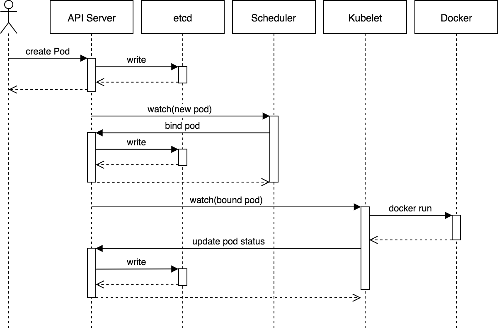

Pod 是 Kubernetes 系统的基础单元，是资源对象中可由用户创建或者部署的最小组件，也是
在 Kubernetes 系统上运行容器化应用的资源对象。其他的大多数资源对象都是用于支撑和
扩展 Pod 对象的功能的，例如，用于管控 Pod 运行的 StatefulSet 和 Deployment 等控制
器对象，用于暴露 Pod 应用的 Service 和 Ingress 对象，为 Pod 提供持久存储的
PersistentVolume 存储资源对象等。

Pod 中可以运行多个容器，这些容器共享 Network、UTS 和 IPC 名称空间，具有相同的域名、
主机名和网络接口，并可以通过 IPC 直接通讯。为一个 Pod 对象中的各个容器提供网络名称
空间等共享机制的是底层的基础容器 **pause**。也就是说在 Pod 中运行的多个容器之间共享
Network、UTS 和 IPC 名称空间，但是分别拥有各自的 MNT、USR 和 PID 名称空间。

尽管 Pod 可以类比为 VM 或者物理机，可以允许多个容器，但是一个 Pod 内通常仅运行一
个应用，除非多个容器之间有密切关系。在实际生产中也是将多个应用分别构建到多个 Pod，
另外，Pod 也是 K8s 进行系统规模伸缩和调度的基础单元，分别运行于多个 Pod 的多个应用
可以独立按需要进行规模变动，增强系统架构灵活性。

不过，分布式应用场景必须要求 Pod 中同时运行多个容器。分布式系统设计常常包含以下几种
模型：

1. Sidecar pattern(边车模型)：Pod 中运行一个主容器和一个辅助容器。如，将主容器中的日志
   使用 agent 收集至日志服务器，可以将 agent 运行为辅助应用容器，及 sidecar。又如，主
   容器为 database server，辅助容器为 redis 作为数据库本地缓存。
2. Ambassador pattern(大使模型)：Pod 中运行一个主容器，辅助容器为代理容器。将主容器中
   的访问请求转发到远程服务器，如访问一主多从的 redis 集群时，若 redis 集群发生变动，
   则只需更改 Ambassador 容器，无需更改主容器应用。
3. Adapter pattern(适配器模型)：此种模型主要用于将主容器的内容进行标准输出，如日志或
   指标数据的输出，便于调用者同意接收数据的接口。

# 一. 管理 Pod 对象的容器

Pod 对象中至少要运行一个容器，因此 containers 字段是定义 Pod 时的一级字段 spec 下的必须
字段。另外，还要使用 name 字段定义容器名称，image 字段定义镜像等。

## 1.1 镜像及其获取策略

首先获取 pod 资源的配置资源的所有可配置字段，其中 status 字段不用管：

```bash
root@kube-master1:~# kubectl explain pod. | grep -E "^ {3}[a-z]"  # pod资源有5个一级字段，status为k8s自己维护
   apiVersion	<string>  # 接受字符串类型的值，没有子字段
   kind	<string>          # 接受字符串类型的值，没有子字段
   metadata	<Object>      # 接受对象类型，有子字段
   spec	<Object>          # 接受对象类型，有子字段
   status	<Object>      # 接受对象类型，有子字段

# metadata字段的子字段
root@kube-master1:~# kubectl explain pod.metadata | grep -E "^ {3}[a-z]"
   annotations	<map[string]string>
   clusterName	<string>
   creationTimestamp	<string>
   deletionGracePeriodSeconds	<integer>
   deletionTimestamp	<string>
   finalizers	<[]string>
   generateName	<string>
   generation	<integer>
   labels	<map[string]string>
   managedFields	<[]Object>
   name	<string>
   namespace	<string>
   ownerReferences	<[]Object>
   resourceVersion	<string>
   selfLink	<string>
   uid	<string>

# spec字段的子字段
root@kube-master1:~# kubectl explain pod.spec | grep -E "^ {3}[a-z]"
   activeDeadlineSeconds	<integer>
   affinity	<Object>
   automountServiceAccountToken	<boolean>
   containers	<[]Object> -required-    # 必须字段
   dnsConfig	<Object>
   dnsPolicy	<string>
   enableServiceLinks	<boolean>
   ephemeralContainers	<[]Object>
   hostAliases	<[]Object>
   hostIPC	<boolean>
   hostNetwork	<boolean>
   hostPID	<boolean>
   hostname	<string>
   imagePullSecrets	<[]Object>
   initContainers	<[]Object>
   nodeName	<string>
   nodeSelector	<map[string]string>
   overhead	<map[string]string>
   preemptionPolicy	<string>
   priority	<integer>
   priorityClassName	<string>
   readinessGates	<[]Object>
   restartPolicy	<string>
   runtimeClassName	<string>
   schedulerName	<string>
   securityContext	<Object>
   serviceAccount	<string>
   serviceAccountName	<string>
   shareProcessNamespace	<boolean>
   subdomain	<string>
   terminationGracePeriodSeconds	<integer>
   tolerations	<[]Object>
   topologySpreadConstraints	<[]Object>
   volumes	<[]Object>

# spec.containers字段下的子字段
root@kube-master1:~# kubectl explain pod.spec.containers | grep -E "^ {3}[a-z]"
   args	<[]string>
   command	<[]string>
   env	<[]Object>
   envFrom	<[]Object>
   image	<string>
   imagePullPolicy	<string>
   lifecycle	<Object>
   livenessProbe	<Object>
   name	<string> -required-  # 必须字段
   ports	<[]Object>
   readinessProbe	<Object>
   resources	<Object>
   securityContext	<Object>
   startupProbe	<Object>
   stdin	<boolean>
   stdinOnce	<boolean>
   terminationMessagePath	<string>
   terminationMessagePolicy	<string>
   tty	<boolean>
   volumeDevices	<[]Object>
   volumeMounts	<[]Object>
   workingDir	<string>

# 镜像获取策略
root@kube-master1:~# kubectl explain pod.spec.containers.imagePullPolicy
KIND:     Pod
VERSION:  v1

FIELD:    imagePullPolicy <string>

DESCRIPTION:
     Image pull policy. One of Always, Never, IfNotPresent. Defaults to Always
     if :latest tag is specified, or IfNotPresent otherwise. Cannot be updated.
     More info:
     https://kubernetes.io/docs/concepts/containers/images#updating-images
```

| kubectl explain 输出的字段取值表示 | 取值类型                                            |
| :--------------------------------- | :-------------------------------------------------- |
| \<string>                          | 字符串类型                                          |
| \<[]string>                        | 字符串列表                                          |
| \<Obeject>                         | 对象，子字段(在 yaml 文件用缩进表示)                |
| <[]Object>                         | 子字段列表(在 yaml 文件中用"-"及其同级缩进的块表示) |
| \<map[string]string>               | 键值对                                              |
| \<boolean>                         | 布尔值(true/false)                                  |
| \<integer>                         | 整型                                                |

使用上面的`kubectl explain`命令就可以得到某资源的所有配置字段和其接受的数据类型，
pod 中容器的`imagePullPolicy`字段用于指明镜像获取策略，其接受如下几个值：

- Always: 当镜像标签为`lastest`或镜像不存在时总是从指定的仓库中 pull 镜像。
- IfNotPresent: 仅仅当本地镜像缺失时才从目标仓库 pull 镜像。
- Never: 禁止从仓库下载镜像，仅从本地下载。

下面的资源清单指明，使用 nginx 最新的镜像创建 pod，镜像获取策略为 Always。

```yaml
apiVersion: v1
kind: Pod
metadata:
  name: pod-nginx
spec:
  containers:
    - name: nginx
      image: nginx:latest
      imagePullPolicy: Always
```

需要注意的是，对于 lastest 标签的镜像，默认的拉取策略就是 Always。不是 latest 标签的
镜像则是 IfNotPresent 策略。使用私有的仓库时，拉取镜像需要 Registry 服务器认证完成才
可以。认证过程需要在运行容器的节点上使用`docker login`命令进行，或者将认证信息定义为
专有的 Secret 资源，并配置 Pod 通过"imagePullSecretes"字段调用此信息完成认证。

```bash
root@kube-master1:~# kubectl explain pod.spec.imagePullSecrets | grep -E "^ {,3}[a-z]"
   name	<string>
root@kube-master1:~# kubectl explain pod.spec.imagePullSecrets
KIND:     Pod
VERSION:  v1

RESOURCE: imagePullSecrets <[]Object>

DESCRIPTION:
     ImagePullSecrets is an optional list of references to secrets in the same
     namespace to use for pulling any of the images used by this PodSpec. If
     specified, these secrets will be passed to individual puller
     implementations for them to use. For example, in the case of docker, only
     DockerConfig type secrets are honored. More info:
     https://kubernetes.io/docs/concepts/containers/images#specifying-imagepullsecrets-on-a-pod

     LocalObjectReference contains enough information to let you locate the
     referenced object inside the same namespace.

FIELDS:
   name	<string>
     Name of the referent. More info:
     https://kubernetes.io/docs/concepts/overview/working-with-objects/names/#names
```

## 1.2 暴露端口

```bash
root@kube-master1:/opt/k8s-data/yaml# kubectl explain Pod.spec.containers.ports | grep -E "^ {3}[a-z]"
   containerPort	<integer> -required-  # 必选字段，指定Pod对象上的IP地址上暴露的容器端口
   hostIP	<string>
   hostPort	<integer>
   name	<string>
   protocol	<string>
```

| 字段                     | 说明                                                                                                                                                           |
| :----------------------- | :------------------------------------------------------------------------------------------------------------------------------------------------------------- |
| containerPort \<integer> | 必选字段，指定 Pod 对象上的 IP 地址上暴露的容器端口，端口有效范围为 0-65535，应结合容器应用来指定端口。                                                        |
| hostIP <string>          | 主机端口要绑定的主机 IP，默认为 0.0.0.0 即主机上所有可用的 IP。考虑到 Pod 对象是由调度器调度运行的，工作节点的 IP 地址难以明确指定，因此该字段通常使用默认值。 |
| hostPort <integer>       | 主机端口，它将接受到的请求通过 NAT 机制转发至由 containerPort 字段指定的容器端口。                                                                             |
| name <string>            | 当前端口的名称，在当前 Pod 内必须唯一，该端口名可以被 Service 调用。                                                                                           |
| protocol <string>        | 端口相关的协议，取值为 TCP 或 UDP，默认为 TCP。                                                                                                                |

```yaml
root@kube-master1:/opt/k8s-data/yaml# cat pod-example.yaml
apiVersion: v1
kind: Pod
metadata:
  name: pod-example
spec:
  containers:
  - name: mynginx
    image: nginx:1.18.1
    ports:
    - name: http
      containerPort: 80
      protocol: TCP
```

主要注意的是，Pod 资源的 hostPort 与 Service 之一的 NodePort 暴露端口的方式不一样，NodePort
是通过所有节点暴露容器服务，而 hostPort 则是经由 Pod 对象所在的节点 IP 地址来进行的。

```bash
root@kube-master1:/opt/k8s-data/yaml# kubectl explain Service.spec.ports | grep -E "^ {3}[a-z]"
   name	<string>
   nodePort	<integer>  # Service中的端口暴露字段
   port	<integer> -required-
   protocol	<string>
   targetPort	<string>
```

## 1.3 自定义运行的容器化应用

Docker 镜像启动容器时运行的应用程序在对应的 Dockerfile 中由 ENTRYPOINT 指令定义，
而传递给容器程序的参数则通过 CMD 命令指定。ENTRYPOINT 指令不存在时，CMD 可用于同
时指定容器启动要默认运行的程序及其参数。例如，在工作节点使用`docker inspect`命令
可以得到镜像中定义的 CMD 和 ENTRYPOINT 值：

```bash
root@node1:~# docker inspect nginx:1.16.1 -f {{.Config.Cmd}}
[nginx -g daemon off;]
root@node1:~# docker inspect nginx:1.16.1 -f {{.Config.Entrypoint}}
[]
```

同样，在 K8s 的 Pod 资源的嵌套字段中，command 字段可以用来指定不同于镜像默认的运行
程序，并且可以同时使用 args 字段进行参数传递。这样指定后会覆盖镜像默认的定义，只指
定 args，则作为默认的程序的运行参数，只指定 command，则使用指定程序和无参数运行。

```bash
root@kube-master1:/opt/k8s-data/yaml# kubectl explain Pod.spec.containers.command
KIND:     Pod
VERSION:  v1
FIELD:    command <[]string>
DESCRIPTION:
     Entrypoint array. Not executed within a shell. The docker image's
     ENTRYPOINT is used if this is not provided. Variable references $(VAR_NAME)
     are expanded using the container's environment. If a variable cannot be
     resolved, the reference in the input string will be unchanged. The
     $(VAR_NAME) syntax can be escaped with a double $$, ie: $$(VAR_NAME).
     Escaped references will never be expanded, regardless of whether the
     variable exists or not. Cannot be updated. More info:
     https://kubernetes.io/docs/tasks/inject-data-application/define-command-argument-container/#running-a-command-in-a-shell

root@kube-master1:/opt/k8s-data/yaml# kubectl explain Pod.spec.containers.args
KIND:     Pod
VERSION:  v1
FIELD:    args <[]string>
DESCRIPTION:
     Arguments to the entrypoint. The docker image's CMD is used if this is not
     provided. Variable references $(VAR_NAME) are expanded using the
     container's environment. If a variable cannot be resolved, the reference in
     the input string will be unchanged. The $(VAR_NAME) syntax can be escaped
     with a double $$, ie: $$(VAR_NAME). Escaped references will never be
     expanded, regardless of whether the variable exists or not. Cannot be
     updated. More info:
     https://kubernetes.io/docs/tasks/inject-data-application/define-command-argument-container/#running-a-command-in-a-shell
```

例如，下面的资源清单将镜像 nginx:1.16.1 的默认应用程序改为`/bin/bash`，传递的应用
参数为`-c while true ; do sleep 5; done`:

```bash
root@kube-master1:/opt/k8s-data/yaml# cat pod-example.yaml
apiVersion: v1
kind: Pod
metadata:
  name: pod-example-cus-cmd
spec:
  containers:
  - name: mynginx
    image: nginx:1.16.1
    command: ["/bin/bash"]
    args: ["-c", "while true; do sleep 5 30; done"]
```

## 1.4 环境变量

向 Pod 中的容器环境变量传递数据的方式有两种：env 和 envFrom，其中 envFrom 结合
ConfiMap 和 Secret 资源使用:

```bash
root@kube-master1:/opt/k8s-data/yaml# kubectl explain Pod.spec.containers.env | egrep "^ {3}[a-z]"
   name	<string> -required-
   value	<string>
   valueFrom	<Object>

root@kube-master1:/opt/k8s-data/yaml# kubectl explain Pod.spec.containers.envFrom | egrep "^ {3}[a-z]"
   configMapRef	<Object>
   prefix	<string>
   secretRef	<Object>
```

如下面的资源配置清单，向 filebeat 容器传递了两个环境变量。REDIS_HOST
定义了 filebeat 收集的日志信息要发往的 redis 主机，LOG_LEVEL 定义了 filebeat
的日志级别：

```yaml
root@kube-master1:/opt/k8s-data/yaml# cat pod-example.yaml
apiVersion: v1
kind: Pod
metadata:
  name: pod-example-with-env
spec:
  containers:
  - name: filebeat
    image: filebeat:5.6.5-alpine
    env:
    - name: REDIS_HOST
      value: db.suosuoli.io:6379
    - name: LOG_LEVEL
      value: info
```

这些环境变量可以直接注入容器的 shell 环境中，使用 printenv 或者 env 命令
就可以在容器中看到。

## 1.5 共享节点的网络名称空间

只需配置 Pod.spec.hostNetwork 字段值为 true 就可以让 Pod 共享节点网络名称空间:

```bash
root@kube-master1:/opt/k8s-data/yaml# kubectl explain Pod.spec.hostNetwork
KIND:     Pod
VERSION:  v1

FIELD:    hostNetwork <boolean>

DESCRIPTION:
     Host networking requested for this pod. Use the host's network namespace.
     If this option is set, the ports that will be used must be specified.
     Default to false.
```

另外可以使用 Pod.spec.hostPID 和 Pod.spec.hostIPC 字段来共享工作节点的 PID
和 IPC 名称空间：

```bash
root@kube-master1:/opt/k8s-data/yaml# kubectl explain Pod.spec.hostPID
KIND:     Pod
VERSION:  v1

FIELD:    hostPID <boolean>

DESCRIPTION:
     Use the host\'s pid namespace. Optional: Default to false.
root@kube-master1:/opt/k8s-data/yaml# kubectl explain Pod.spec.hostIPC
KIND:     Pod
VERSION:  v1

FIELD:    hostIPC <boolean>

DESCRIPTION:
     Use the host's ipc namespace. Optional: Default to false.
```

例如，下面的 nginx 容器将共享工作节点的网络空间：

```yaml
root@kube-master1:/opt/k8s-data/yaml/test# cat pod-example-hostnetwork.yaml
apiVersion: v1
kind: Pod
metadata:
  name: pod-example-hostnet
spec:
  containers:
  - name: nginx-hostnet
    image: nginx:1.16.1
  hostNetwork: true
```

创建该 pod 验证：

```bash
root@kube-master1:/opt/k8s-data/yaml/test# kubectl apply -f pod-example-hostnetwork.yaml
pod/pod-example-hostnet created

# 当前nginx运行于node3，其所处网络与node3同网段192.168.100.0/24
root@kube-master1:/opt/k8s-data/yaml/test# kubectl get  -f pod-example-hostnetwork.yaml -o wide
NAME                  READY   STATUS    RESTARTS   AGE   IP                NODE    NOMINATED NODE   READINESS GATES
pod-example-hostnet   1/1     Running   0          10s   192.168.100.164   node3   <none>           <none>

# 直接访问
root@kube-master1:/opt/k8s-data/yaml/test# curl 192.168.100.164
<!DOCTYPE html>
<html>
<head>
<title>Welcome to nginx!</title>
...
```

进入容器查看网络接口信息：

```bash
root@kube-master1:/opt/k8s-data/yaml/test# kubectl exec -it pod-example-hostnet -- /bin/bash

root@node3:/# cat /etc/issue
Debian GNU/Linux 10 \n \l

root@node3:/# ifconfig eth0
eth0: flags=4163<UP,BROADCAST,RUNNING,MULTICAST>  mtu 1500
        inet 192.168.100.164  netmask 255.255.255.0  broadcast 192.168.100.255
        inet6 fe80::20c:29ff:fe52:e69c  prefixlen 64  scopeid 0x20<link>
        ether 00:0c:29:52:e6:9c  txqueuelen 1000  (Ethernet)
        RX packets 1639005  bytes 1025143283 (977.6 MiB)
        RX errors 0  dropped 0  overruns 0  frame 0
        TX packets 1067115  bytes 83320398 (79.4 MiB)
        TX errors 0  dropped 0 overruns 0  carrier 0  collisions 0
root@node3:/# pwd
/
```

到 node3 查看网络接口属性：

```bash
root@node3:~# cat /etc/issue
Ubuntu 18.04.3 LTS \n \l
root@node3:~# ip addr show eth0 | grep inet
    inet 192.168.100.164/24 brd 192.168.100.255 scope global eth0
    inet6 fe80::20c:29ff:fe52:e69c/64 scope link
```

## 1.6 设置 Pod 对象的安全上下文

Pod 对象的安全上下文用于设定 Pod 或者容器的权限和访问控制功能，包括等：

- 基于 UID 和 GID 控制访问文件时所使用的权限
- 以特权(root)或非特权运行应用
- 基于 SELinux 的安全标签

Pod 对象的安全上下文定义在`Pod.spec.securityContext`字段：

```bash
root@kube-master1:~# kubectl explain Pod.spec.securityContext | egrep "^ {3}[a-z]"
   fsGroup	<integer>
   runAsGroup	<integer>
   runAsNonRoot	<boolean>
   runAsUser	<integer>
   seLinuxOptions	<Object>
   supplementalGroups	<[]integer>
   sysctls	<[]Object>
   windowsOptions	<Object>
```

容器的安全上下文定义在`Pod.spec.containers.securityContext`字段：

```bash
root@kube-master1:~# kubectl explain Pod.spec.containers[].securityContext | egrep "^ {3}[a-z]"
   allowPrivilegeEscalation	<boolean>
   capabilities	<Object>
   privileged	<boolean>
   procMount	<string>
   readOnlyRootFilesystem	<boolean>
   runAsGroup	<integer>
   runAsNonRoot	<boolean>
   runAsUser	<integer>
   seLinuxOptions	<Object>
   windowsOptions	<Object>
```

例如，下面的配置清单定义了 nginx 的安全上下文，其以 uid 为 1000 的非特权
用户运行容器，并禁止权限提升：

```yaml
root@kube-master1:/opt/k8s-data/yaml/test# cat pod-example-securitycontext.yaml
apiVersion: v1
kind: Pod
metadata:
  name: pod-example-securitycontext
  namespace: test
spec:
  containers:
  - name: nginx-seccon
    image: nginx:1.16.1
    command: ["/bin/sh", "-c", "sleep 86400"]
    securityContext:
      runAsNonRoot: true
      runAsUser: 1000
      allowPrivilegeEscalation: false
```

创建该 pod 验证 uid：

```bash
root@kube-master1:/opt/k8s-data/yaml/test# kubectl apply -f pod-example-securitycontext.yaml
root@kube-master1:/opt/k8s-data/yaml/test# kubectl get -f pod-example-securitycontext.yaml -o wide
NAME                          READY   STATUS    RESTARTS   AGE     IP           NODE    NOMINATED NODE   READINESS GATES
pod-example-securitycontext   1/1     Running   0          2m26s   10.20.4.10   node2   <none>           <none>

root@kube-master1:/opt/k8s-data/yaml/test# kubectl exec -n test  pod-example-securitycontext -- id
uid=1000 gid=0(root) groups=0(root)
```

# 二. 标签与标签选择器

在实际生产中，随着同类资源对象的数量越来越多，分类管理也变得越来越必要。
Kubernetes 标签的核心功能之一就是用来管理资源。对于附加有标签的资源对象
可以使用标签选取器(Label Selector)挑选出符合过滤条件的资源以完成所需要
的操作，如关联、查看和删除等操作。

## 2.1 标签概述

在 Kubernetes 系统中，标签可以附加于任何资源对象之上。标签就是键值类型的
数据，它可以在资源创建时直接指定，也可以随时按需附加于活动资源上，而后
可有标签选择器进行匹配度检查完成资源挑选。一个对象可以有多个标签，而同
一个标签也可以被添加至多个资源至少。

在实际生产中，可以为资源附加多个不同维度的标签以实现灵活的资源分组管理。
例如：版本标签、环境标签、分层架构标签和应用标签。用于交叉表示同一个
资源所属的不同版本、环境及架构等。

- 版本标签："release":"stable","release":"canary","release":"beta"
- 环境标签："environment":"dev","environment":"qa","environment":"production"
- 应用标签："app":"ui","app":"mobile","app":"pc","app":"sc"
- 架构层级标签："tier":"frontend","tier":"backend","tier":"cache"
- 分区标签："partition":"CustomerA","partition":"CustomerB"
- 品控标签："trackperiod":"daily","trackperiod":"weekly"

如下图，使用标签来组织微服务架构中的应用：


<center>图片来源：《Kubernetes in action》</center>

标签中键名长度不超过 63 字符，键值同样。生产中，建议键值能做到见名知意。

## 2.2 管理资源标签

```bash
root@kube-master1:/opt/k8s-data/yaml/test# kubectl explain Pod.metadata.labels
KIND:     Pod
VERSION:  v1

FIELD:    labels <map[string]string>

DESCRIPTION:
     Map of string keys and values that can be used to organize and categorize
     (scope and select) objects. May match selectors of replication controllers
     and services. More info: http://kubernetes.io/docs/user-guide/labels
```

创建资源时，可以直接在 metadata 字段中嵌套使用"labels"字段来定义要附加
的标签。如下面的 Pod 资源清单使用了三个标签：

```yaml
root@kube-master1:/opt/k8s-data/yaml/test# cat pod-example-labels.yaml
apiVersion: v1
kind: Pod
metadata:
  name: pod-example-labels
  namespace: test
  labels:
    env: dev
    tier: proxy
    release: stable
spec:
  containers:
  - name: nginx-seccon
    image: nginx:1.16.1
```

```bash
root@kube-master1:/opt/k8s-data/yaml/test# kubectl apply -f pod-example-labels.yaml
pod/pod-example-labels created

root@kube-master1:/opt/k8s-data/yaml/test# kubectl get -f pod-example-labels.yaml -o wide
NAME                 READY   STATUS    RESTARTS   AGE   IP           NODE    NOMINATED NODE   READINESS GATES
pod-example-labels   1/1     Running   0          7s    10.20.3.25   node1   <none>           <none>
```

显示该 Pod 的对象标签信息使用`kubectl get pods --show-labels`：

```bash
root@kube-master1:/opt/k8s-data/yaml/test# kubectl get pods --show-labels -n test
NAME                          READY   STATUS    RESTARTS   AGE     LABELS
pod-example-labels            1/1     Running   0          2m27s   env=dev,release=stable,tier=proxy
pod-example-securitycontext   1/1     Running   0          49m     <none>
```

在标签过多是使用命令`kubectl get pods -L KEY1,KEY2,...`获取有着特定键的
标签信息：

```bash
root@kube-master1:/opt/k8s-data/yaml/test# kubectl get pods -L env,tier -n test
NAME                          READY   STATUS    RESTARTS   AGE     ENV   TIER  # 只显示env和tier标签
pod-example-labels            1/1     Running   0          5m21s   dev   proxy
pod-example-securitycontext   1/1     Running   0          52m
```

另外，`kubectl label`命令可以直接管理活动对象的标签，可以按需添加和修改。如
下面表示，给 pod-example-securitycontext 资源添加一个标签 env=dev:

```bash
root@kube-master1:/opt/k8s-data/yaml/test# kubectl label pod pod-example-securitycontext -n test env=dev
pod/pod-example-securitycontext labeled

root@kube-master1:/opt/k8s-data/yaml/test# kubectl get pods -L env -n test
NAME                          READY   STATUS    RESTARTS   AGE   ENV
pod-example-labels            1/1     Running   0          10m   dev
pod-example-securitycontext   1/1     Running   0          57m   dev
```

修改已有的标签需要使用`--overwrite`选项：

```bash
root@kube-master1:/opt/k8s-data/yaml/test# kubectl label pod pod-example-securitycontext -n test env=production --overwrite
pod/pod-example-securitycontext labeled

root@kube-master1:/opt/k8s-data/yaml/test# kubectl get pods -L env -n test
NAME                          READY   STATUS    RESTARTS   AGE   ENV
pod-example-labels            1/1     Running   0          13m   dev
pod-example-securitycontext   1/1     Running   0          60m   production
```

若需要在某标签下的资源进行某些操作，如查看或者删除资源，则需要先使用
“标签选择器”挑选出满足条件的资源对象。

## 2.3 标签选择器

在使用`kubectl get pods`命令时，使用`-l`选项来使用标签选择器：

```bash
root@kube-master1:/opt/k8s-data/yaml/test# kubectl get pods --help | grep -w "\-l"
  -l, --selector='': Selector (label query) to filter on, supports '=', '==', and '!='.(e.g. -l key1=value1,key2=value2)
  kubectl get [(-o|--output=)json|yaml|wide|custom-columns=...|custom-columns-file=...|go-template=...|go-template-file=...|jsonpath=...|jsonpath-file=...] (TYPE[.VERSION][.GROUP] [NAME | -l label] | TYPE[.VERSION][.GROUP]/NAME ...) [flags] [options]
```

Kubernetes API 支持基于等值关系(equality-based)和集合关系(set-based)选择器。例如：
"env=production"或"env!=qa"为等值关系，"tire in (frontend, backend)"则是基于集合
关系选择。使用标签选择器遵循以下逻辑：

- 同时指定的多个选择器之间为逻辑与关系
- 使用空值的标签选择器会选择所有的资源对象

**基于等值选择器：**

1. 在 test 名称空间中选择 env 的值为 dev 的资源：

```bash
root@kube-master1:/opt/k8s-data/yaml/test# kubectl get pods -l "env=dev" -L env -n test
NAME                 READY   STATUS    RESTARTS   AGE   ENV
pod-example-labels   1/1     Running   0          22m   dev
```

2. 在 test 名称空间中选择 env 的值为 production 的资源：

```bash
root@kube-master1:/opt/k8s-data/yaml/test# kubectl get pods -l "env=production" -L env -n test
NAME                          READY   STATUS    RESTARTS   AGE   ENV
pod-example-securitycontext   1/1     Running   0          69m   production
```

3. 在 test 名称空间中选择 env 的值不等于 qa 的资源：

```bash
root@kube-master1:/opt/k8s-data/yaml/test# kubectl get pods -l "env!=qa" -L env -n test
NAME                          READY   STATUS    RESTARTS   AGE   ENV
pod-example-labels            1/1     Running   0          23m   dev
pod-example-securitycontext   1/1     Running   0          70m   production
```

4. 在 test 名称空间中选择 env 的值不为 qa 且标签 tier 的值为 proxy 的资源：

```bash
root@kube-master1:/opt/k8s-data/yaml/test# kubectl get pods -l "env!=qa, tier=proxy" -n test --show-labels
NAME                 READY   STATUS    RESTARTS   AGE   LABELS
pod-example-labels   1/1     Running   0          47m   env=dev,release=stable,tier=proxy

```

**基于集合关系选择器：**
基于集合关系标签选择器支持 in、notin 和 exists 三种操作。使用格式：

| -l " "                | 说明                                             |
| :-------------------- | :----------------------------------------------- |
| KEY in (V1,V2,...)    | 指定的键名的值存在于给定的字典中即表示满足条件   |
| KEY notin (V1,V2,...) | 指定的键名的值不存在于给定的字典中即表示满足条件 |
| KEY                   | 所有存在此键名标签的资源                         |
| !KEY                  | 所有不存在此键名标签的资源                       |

1. 显示标签键名 env 值为 production 或 dev 的所有对象(test 名称空间中)

```bash
root@kube-master1:/opt/k8s-data/yaml/test# kubectl get pods -l "env in (production, dev)" --show-labels=true -L env -n test
NAME                          READY   STATUS    RESTARTS   AGE   ENV          LABELS
pod-example-labels            1/1     Running   0          26m   dev          env=dev,release=stable,tier=proxy
pod-example-securitycontext   1/1     Running   0          72m   production   env=production
```

2. 显示标签键名 env 值为 production 或 dev 的所有对象(test 名称空间中)且 tier 键值为 proxy
   的对象：

```bash
root@kube-master1:/opt/k8s-data/yaml/test# kubectl get pods -l 'env in (production, dev), tier=proxy' -n test
NAME                 READY   STATUS    RESTARTS   AGE
pod-example-labels   1/1     Running   0          58m
```

3. 显示标签键名 env 值为 production 或 dev 的所有对象(test 名称空间中)且没有 tier 键的资源：

```bash
root@kube-master1:/opt/k8s-data/yaml/test# kubectl get pods -l 'env in (production, dev), !tier' -n test
NAME                          READY   STATUS    RESTARTS   AGE
pod-example-securitycontext   1/1     Running   0          108m
```

注意: 在 CLI 环境中使用"!"号，使用单引号避免触发 bash 的命令历史机制。

### 其它资源与 Pod 资源的关联

Kubernetes 的诸多资源对象必须以标签选择器的方式关联到 Pod 资源对象，例如：Service、
Deployment 和 ReplicaSet 类型的资源。一般在这些资源的配置清单中的 spec 字段中使用
嵌套的"selector"字段，通过"matchLabels"(ReplicationController)或"matchExpression"
(Deployment)来指定标签选择器。

```bash
root@kube-master1:~# kubectl explain Deployment.spec.selector.matchLabels
KIND:     Deployment
VERSION:  apps/v1

FIELD:    matchLabels <map[string]string>

DESCRIPTION:
     matchLabels is a map of {key,value} pairs. A single {key,value} in the
     matchLabels map is equivalent to an element of matchExpressions, whose key
     field is "key", the operator is "In", and the values array contains only
     "value". The requirements are ANDed.

root@kube-master1:~# kubectl explain Deployment.spec.selector.matchExpressions | egrep "^ {3}[a-z]"
   key	<string> -required-
   operator	<string> -required-
   values	<[]string>
```

- matchLabels: 直接通过键值对来指定标签选择器
- matchExpressions: 基于表达式，型如：
  "- {key: \<string>, operator:<In|NotIn|Exists|DoesNotExist>, values:[string, string, ...]}"
  使用 Exists 或 DoesNotExist 为 operator 时，values 必须为空。

下图为示例，同时定义了两种标签选择器：

```bash
root@kube-master1:/opt/k8s-data/yaml/proj1# cat deployment.yaml
apiVersion: apps/v1
metadata:
  name: nginx-depoyment
  namespace: nginx-deployment
  labels:
    name: nginx
kind: Deployment
spec:
  ...
  selector:
    matchLabels:
    - name: nginx
    matchExpressions:
      - {key: name, operator: In, values: ["nginx"]}
      - {key: environment, operator: Exists, values:}
```

## 2.4 Pod 节点选择器 nodeSelector

Pod 节点选择器时标签及标签选择器的一种应用，可以让 Pod 对象基于集群中工作
节点的标签来挑选其运行的目标节点。也就是节点的亲和性调度。在使用节点选择器
的场景中，往往是因为，部分节点拥有被 Pod 对象依赖的特殊硬件如 GPU 和 SSD 等。

Pod 对象的 spec.nodeSelector 可以用于定义节点标签选择器，用户事先为特定
的节点设定好标签，而后配置 Pod 对象通过节点标签选择器匹配。以完成节点亲和性
调度。为 Node 资源添加标签的方法同 Pod，使用`kubectl label nodes NODE_NAME label1=v1`
命令即可：为 node1 加标签 disktype=ssd，指明 node 有 ssd 硬盘

```bash
root@kube-master1:~# kubectl label nodes node1 disktype=ssd
node/node1 labeled

root@kube-master1:~# kubectl get nodes node1 --show-labels
NAME    STATUS   ROLES    AGE     VERSION   LABELS
node1   Ready    <none>   5d22h   v1.17.4   ...,disktype=ssd,...
```

查看具有 disktype 键名的 Node 资源：

```bash
root@kube-master1:~# kubectl get nodes -l 'disktype' -L disktype
NAME    STATUS   ROLES    AGE     VERSION   DISKTYPE
node1   Ready    <none>   5d22h   v1.17.4   ssd
```

该字段解释：

```bash
root@kube-master1:/opt/k8s-data/yaml/test# kubectl explain Pod.spec.nodeSelector
KIND:     Pod
VERSION:  v1

FIELD:    nodeSelector <map[string]string>

DESCRIPTION:
     NodeSelector is a selector which must be true for the pod to fit on a node.
     Selector which must match a node's labels for the pod to be scheduled on
     that node. More info:
     https://kubernetes.io/docs/concepts/configuration/assign-pod-node/
```

例如：下面的 pod 资源创建后 pod 会运行在 node1

```yaml
root@kube-master1:/opt/k8s-data/yaml/test# cat pod-example-nodeselector.yaml
apiVersion: v1
kind: Pod
metadata:
  name: pod-example-nodeselector
  labels:
    env: testing
spec:
  containers:
  - name: nginx
    image: nginx:1.16.1
  nodeSelector:
    disktype: ssd
```

创建该 pod 资源：

```bah
root@kube-master1:/opt/k8s-data/yaml/test# kubectl apply -f pod-example-nodeselector.yaml
pod/pod-example-nodeselector created
```

查看 pod 运行在哪：

```bash
root@kube-master1:/opt/k8s-data/yaml/test# kubectl get -f pod-example-nodeselector.yaml -o wide
NAME                       READY   STATUS    RESTARTS   AGE   IP           NODE    NOMINATED NODE   READINESS GATES
pod-example-nodeselector   1/1     Running   0          10s   10.20.3.26   node1   <none>           <none>
```

另外，可以使用另外一个字段`Pod.spec.nodeName`直接指定 pod 运行到某个 node:

```bash
root@kube-master1:/opt/k8s-data/yaml/test# kubectl explain Pod.spec.nodeName
KIND:     Pod
VERSION:  v1

FIELD:    nodeName <string>

DESCRIPTION:
     NodeName is a request to schedule this pod onto a specific node. If it is
     non-empty, the scheduler simply schedules this pod onto that node, assuming
     that it fits resource requirements.
```

其实每个 node 在加入 Kubernetes 集群后默认有很多的标签，可以直接使用。

## 2.5 资源注解

除了标签(label)之外，Pod 与其他资源还能使用资源注解(annotation)。与标签类似，
注解也是键值类型数据，不过它不能用于标签及挑选对象，仅仅用于为资源提供"元数据"
信息。资源注解可由用户手动添加，也可以由工具程序自动附加并使用。为资源添加
注解可以让其他用户快速了解资源相关信息。

### 2.5.1 查看资源注解

可以使用`kubectl get -o yaml`和`kubectl describe`命令获取注解信息：

```bash
root@kube-master1:~# kubectl get pods pod-example-labels -n test -o yaml
apiVersion: v1
kind: Pod
metadata:
  annotations:
    kubectl.kubernetes.io/last-applied-configuration: |
      {"apiVersion":"v1","kind":"Pod","metadata":{"annotations":{},"labels":{"env":"dev","release":"stable","tier":"proxy"},"name":"pod-example-labels","namespace":"test"},"spec":{"containers":[{"image":"nginx:1.16.1","name":"nginx-seccon"}]}}
...
spec:
status:
...

root@kube-master1:~# kubectl describe pods  pod-example-labels -n test
Name:         pod-example-labels
Namespace:    test
Priority:     0
Node:         node1/192.168.100.160
Start Time:   Fri, 03 Apr 2020 14:33:22 +0800
Labels:       env=dev
              release=stable
              tier=proxy
Annotations:  kubectl.kubernetes.io/last-applied-configuration:
                {"apiVersion":"v1","kind":"Pod","metadata":{"annotations":{},"labels":{"env":"dev","release":"stable","tier":"proxy"},"name":"pod-example-...
Status:       Running
IP:           10.20.3.25
...
```

### 2.5.2 管理资源注解

添加注解：

```bash
root@kube-master1:~# kubectl annotate pods pod-example-labels -n test kubectl.kubernetes.io/createdBy="admin suosuoli"
pod/pod-example-labels annotated
```

查看注解：

```bash
root@kube-master1:~# kubectl describe pods pod-example-labels -n test | grep createdBy
Annotations:  kubectl.kubernetes.io/createdBy: admin suosuoli
```

在资源清单中添加注解，例如：

```bash
apiVersion: v1
kind: Pod
metadata:
  name: pod-example-with-env
  annotations:
    kubectl.kubernetes.io/createdBy: "admin suosuoli"
spec:
  containers:
...
```

# 三. Pod 生命周期

## 3.1 Pod phase

Pod 的 status 定义在 PodStatus 对象中，其中有一个 phase 字段。Pod 的运行阶段（phase）是
Pod 在其生命周期中的简单宏观概述。该阶段并不是对容器或 Pod 的综合汇总，也不是为了做为综合
状态机。Pod 相位的数量和含义是严格指定的。

下面是 phase 可能的值:

| Value             | Description                                                                                                                                  |
| :---------------- | :------------------------------------------------------------------------------------------------------------------------------------------- |
| 第一阶段          |                                                                                                                                              |
| 挂起（Pending）   | Pod 已被 Kubernetes 系统接受，API server 创建了 Pod 资源对象并已经将状态存入 etcd 中，但是它尚未被调度完成，或者仍处于从仓库下载镜像的过中。 |
| 运行中（Running） | 该 Pod 已经被调度到了某一个节点上，Pod 中所有的容器都已被 kubelet 创建。至少有一个容器正在运行，或者正处于启动或重启状态。                   |
| 成功（Succeeded） | Pod 中的所有容器都被成功终止，并且不会再重启。                                                                                               |
| 失败（Failed）    | Pod 中的所有容器都已终止了，并且至少有一个容器是因为失败终止。也就是说，容器以非 0 状态退出或者被系统终止。                                  |
| 未知（Unknown）   | 因为某些原因 API server 无法取得 Pod 的状态，通常是因为与 Pod 所在主机 kubelet 通信失败导致。                                                |
| 第二阶段          |
| Unschedulable     | Pod 不能被调度，kube-scheduler 没有匹配到合适的 node                                                                                         |
| PodScheduled      | Pod 正在调度中，kube-scheduler 刚开始调度，还未分配到指定 node，在匹配到合适的 node 后会更新 etcd 状态信息，将 pod 分配到 node               |
| Initialized       | Pod 中所有容器都初始化完成                                                                                                                   |
| ImagePullBackOff  | Pod 所在节点下载镜像失败(镜像仓库未公开，镜像名写错...)                                                                                      |
| Running           | Pod 内部的容器已经被创建并且启动                                                                                                             |
| Ready             | 表示 Pod 中的容器已经可以提供服务                                                                                                            |

### 生命周期钩子函数(lifecycle hook)

容器生命周期钩子可以让用户在容器的特定生命周期时刻运行用户指定的程序代码，Kubernetes 为
容器提供了两种生命周期钩子：

- postStart: 在容器创建完成之后立即运行的钩子处理程序(handler)，不过 Kubernetes 不会
  确保其在容器的 ENTRYPOINT 之前执行
- preStop: 在容器终止操作之前立即运行的钩子处理程序，它以同步的方式调用，在该操作
  完成之前会阻塞删除容器的操作

```bash
root@kube-master1:/opt/k8s-data/yaml/test# kubectl explain Pod.spec.containers.lifecycle. | egrep "^ {3}[a-z]"
   postStart	<Object>
   preStop	<Object>
root@kube-master1:/opt/k8s-data/yaml/test# kubectl explain Pod.spec.containers.lifecycle.postStart | egrep "^ {3}[a-z]"
   exec	<Object>
   httpGet	<Object>
   tcpSocket	<Object>
root@kube-master1:/opt/k8s-data/yaml/test# kubectl explain Pod.spec.containers.lifecycle.preStop | egrep "^ {3}[a-z]"
   exec	<Object>
   httpGet	<Object>
   tcpSocket	<Object>
```

如，创建一个运行 nginx 容器的 pod 资源，在启动前运行一个命令的配置清单：

```yaml
root@kube-master1:/opt/k8s-data/yaml/test# cat pod-example-poststart.yaml
apiVersion: v1
kind: Pod
metadata:
  name: pod-poststart
spec:
  containers:
  - name: nginx-post
    image: nginx:1.16.1
    lifecycle:
      postStart:
        exec:
          command: ["/bin/sh", "-c", "echo 'lifecycle hooks handler' > /opt/index.html"]
```

创建:

```bash
root@kube-master1:/opt/k8s-data/yaml/test# kubectl apply -f pod-example-poststart.yaml
pod/pod-poststart created
```

验证：

```bash
root@kube-master1:/opt/k8s-data/yaml/test# kubectl get -f pod-example-poststart.yaml -o wide
NAME            READY   STATUS    RESTARTS   AGE   IP           NODE    NOMINATED NODE   READINESS GATES
pod-poststart   1/1     Running   0          8s    10.20.5.16   node3   <none>           <none>
root@kube-master1:/opt/k8s-data/yaml/test# kubectl exec -it pod-poststart -- /bin/sh
# cat /opt/index.html  # 命令成功执行了
lifecycle hooks handler
#
```

## 3.2 Pod 的创建过程

Pod 资源的典型创建过程：

1. 用户通过 kubelet 或者其它 API 客户端提交 Pod Spec(资源清单)给 API server
2. API server 尝试将 Pod 对象的相关信息存入 etcd 中，写入操作完成，API server 就会
   返回确认信息给客户端
3. API server 开始对 etcd 中的状态变化做出行动
4. 所有的 Kubernetes 组件均会使用"watch"机制来跟踪检查 API server 上的相关变动
5. kube-scheduler(调度器)通过其"watcher"发现 API server 创建了新的 Pod 对象但尚未
   绑定到任何工作节点
6. kube-scheduler 为 Pod 对象挑选一个工作节点并将结果信息更新到 API server
7. 调度结果信息由 API server 更新至 etcd 存储系统，而且 API server 也开始放映此
   Pod 的调度结果
8. Pod 被调度到的目标工作节点上的 kubelet 尝试在当前节点上调用 Docker 启动容器，
   并将容器的结果状态回送至 API server
9. API server 将 Pod 状态信息存入 etcd 系统
10. 在 etcd 确认写入操作成功完成后，API server 将确认信息发送至相关 kubelet



## 3.3 Pod 容器探测(container prob)

容器探测是 Pod 对象生命周期中的一项重要的日常任务，是 kubelet 对容器周期性周期性
执行的健康状态诊断。要执行诊断，kubelet 会调用由容器实现的 Handler。有三种类型
的 handler 程序：

| handler         | 功能                                                                                                      |
| :-------------- | :-------------------------------------------------------------------------------------------------------- |
| ExecAction      | 在容器内执行指定命令。如果命令退出时返回码为 0 则认为诊断成功。                                           |
| TCPSocketAction | 通过与容器中指定端口进行 TCP 连接检查。如果端口打开，则诊断被认为是成功的。                               |
| HTTPGetAction   | 对指定的容器 IP 地址和端口及路径执行 HTTP GET 请求。如果响应的状态码为 2xx 或 3xx，则诊断被认为是成功的。 |

每次探测都将获得以下三种结果之一：

成功：容器通过了诊断。
失败：容器未通过诊断。
未知：诊断失败，因此不会采取任何行动

### 3.3.1 容器检测类型

Kubelet 可以选择性的在运行的容器上执行的三种探针做出反应：

| 探针 Prob      | kubelet 行为                                                                                                                                                                                                                                                                   |
| :------------- | :----------------------------------------------------------------------------------------------------------------------------------------------------------------------------------------------------------------------------------------------------------------------------- |
| livenessProbe  | 指示容器是否正在运行。如果存活探测失败，则 kubelet 会杀死容器，并且容器将根据其重启策略 restartPolicy 的影响(Pod 是否重启)。未定义容器存活检测，则默认状态为 Success。livenessProbe 探测失败，则会重启 Pod，过程中 service 还会将请求调度到该 pod 的服务中，会有部分访问未处理 |
| readinessProbe | 指示容器是否准备好服务请求。如果就绪探测失败，端点控制器将从与 Pod 匹配的所有 Service 的端点中删除该 Pod 的 IP 地址。初始延迟之前的就绪状态默认为 Failure。如果容器不提供就绪探针，则默认状态为 Success。该 pod 中的服务将不会被再次上线。                                     |
| startupProbe   | 指示容器中的应用是否已经启动。如果提供了启动探测(startup probe)，则禁用所有其他探测，直到它成功为止。如果启动探测失败，kubelet 将杀死容器，容器服从其重启策略进行重启。如果容器没有提供启动探测，则默认状态为成功。                                                            |

容器的重启策略：

- Always: 一旦 pod 对象终止就将其重启
- OnFailure: 仅在 pod 对象出现错误时才重启
- Never: 从不重启

Pod 的终止过程：

1. 用户发出删除 Pod 对象的命令
2. API 服务器中的 Pod 对象会随着时间的推移而更新，在宽限期内(默认 30s)，Pod 被视为"dead"
3. 将 Pod 标记为"Terminating"状态
4. kubelet 在监控到 Pod 对象转为"Terminating"状态的同时启动 Pod 关闭过程
5. 端点控制器监控到 Pod 对象的关闭行为时将其从所有匹配到该端点的 Service 资源的端点列表中移除
6. 如果当前 Pod 对象定义了 preStop 钩子 handler，则在其标记为"Terminating"后即会以同步的方式
   启动执行；如果宽限期结束后 preStop 仍未执行结束，则第二步会重新执行，并额外获取一个时长
   为 2 秒的小宽限期
7. Pod 对象中的容器进程收到 TERM 信号
8. 宽限期结束后，若存在任何一个仍在运行的进程，那么 Pod 对象即会收到 SIGKILL 信号
9. kubelet 请求 API server 将此 Pod 资源的宽限期设置为 0 从而完成删除操作

默认情况所有删除操作宽限期时间均为 30s，但是可以使用`kubectl delete`命令的
`--grace-period=<seconds>`选项来自定义时长，使用 0 值配合`--force`选项直接
强制删除指定资源。

### 3.3.2 探针的使用配置

探针所包含的字段文档：

```bash
root@kube-master2:~# kubectl explain Pod.spec.containers.livenessProbe. | egrep "^ {3}[a-z]"
   exec	<Object>
   failureThreshold	<integer>
   httpGet	<Object>
   initialDelaySeconds	<integer>
   periodSeconds	<integer>
   successThreshold	<integer>
   tcpSocket	<Object>
   timeoutSeconds	<integer>
root@kube-master2:~# kubectl explain Pod.spec.containers.readinessProbe. | egrep "^ {3}[a-z]"
   exec	<Object>
   failureThreshold	<integer>
   httpGet	<Object>
   initialDelaySeconds	<integer>
   periodSeconds	<integer>
   successThreshold	<integer>
   tcpSocket	<Object>
   timeoutSeconds	<integer>
root@kube-master2:~# kubectl explain Pod.spec.containers.startupProbe. | egrep "^ {3}[a-z]"
   exec	<Object>
   failureThreshold	<integer>
   httpGet	<Object>
   initialDelaySeconds	<integer>
   periodSeconds	<integer>
   successThreshold	<integer>
   tcpSocket	<Object>
   timeoutSeconds	<integer>
```

可以看到以上三种探测机制都支持使用 exec 探针、HTTP 探针和 TCP 探针，使用探针
检测 Pod 的存活性或者就绪性是属于容器级别的功能配置，在 Pod.spec 字段下的容器
列表中定义相关的探针就可以使用容器探测功能。

### 3.3.3 使用 exec 探针

exec 类型的探针通过在目标容器中执行用户定义的命令来判断容器的健康状态，若命令
状态返回值为 0 表示"成功"通过检测，其它值均为"失败"。
`Pod.spec.containers.livenessProbe.exec.command`该字段用来定义要执行的命令：

```yaml
root@kube-master1:/opt/k8s-data/yaml/test# cat pod-example-live-exec.yaml
apiVersion: v1
kind: Pod
metadata:
  name: pod-example-live-exec
spec:
  containers:
  - name: live-exec
    image: busybox
    args: ["/bin/sh", "-c", "touch /tmp/ifhealth; sleep 90; rm -rf /tmp/ifhealth; sleep 900"]
    livenessProbe:
      exec:
        command: ["test", "-e", "/tmp/ifhealth"]
```

上面资源清单定义了一个 Pod，并在其中基于 busybox 镜像启动容器，ENTRYPOINT 的命令为
`/bin/sh -c touch /tmp/ifhealth; sleep 90; rm -rf /tmp/ifhealth; sleep 900`
该容器在启动时创建`/tmp/ifhealth`文件，并在 90s 后删除。存活性探针运行了命令
`test -e /tmp/ifhealth` 检测`/tmp/ifhealth`文件的存在性，若文件存在则返回状态
码 0，表示成功通过测试。下面创建该 Pod：

```bash
root@kube-master1:/opt/k8s-data/yaml/test# kubectl apply -f pod-example-live-exec.yaml
pod/pod-example-live-exec created
```

查看该 Pod 写详细信息：

```bash
root@kube-master1:~# kubectl get pods pod-example-live-exec -o wide
NAME                    READY   STATUS    RESTARTS   AGE   IP           NODE    NOMINATED NODE   READINESS GATES
pod-example-live-exec   1/1     Running   4          13m   10.20.4.11   node2   <none>           <none>


root@kube-master1:/opt/k8s-data/yaml/test# kubectl describe -f pod-example-live-exec.yaml
Name:         pod-example-live-exec
Namespace:    default
Priority:     0
Node:         node2/192.168.100.162
Start Time:   Sat, 04 Apr 2020 14:32:57 +0800
...

Host Port:     <none>
    Args:
      /bin/sh
      -c
      touch /tmp/ifhealth; sleep 90; rm -rf /tmp/ifhealth; sleep 900
    State:          Running       # 当前状态为running
      Started:      Sat, 04 Apr 2020 14:36:19 +0800
    Last State:     Terminated    # 前一次的状态为"Terminated"，原因是退出码为137，表示容器进程被外部信号终止。
      Reason:       Error
      Exit Code:    137
      Started:      Sat, 04 Apr 2020 14:33:12 +0800
      Finished:     Sat, 04 Apr 2020 14:35:42 +0800
    Ready:          True
    Restart Count:  4
    Liveness:       exec [test -e /tmp/ifhealth] delay=0s timeout=1s period=10s #success=1 #failure=3   # 存活性检查信息
    Environment:    <none>
...

Events:
  Type     Reason     Age                   From               Message
  ----     ------     ----                  ----               -------
  Normal   Scheduled  <unknown>             default-scheduler  Successfully assigned default/pod-example-live-exec to node2
  Warning  Unhealthy  113s (x3 over 2m13s)  kubelet, node2     Liveness probe failed:   # 检查失败
  Normal   Killing    113s                  kubelet, node2     Container live-exec failed liveness probe, will be restarted  # 重启该容器
```

### 3.3.4 使用 HTTP 探针

基于 HTTP 的探测(HTTPGetAction)是向目标容器发起一个 HTTP 请求，根据其响应结果判定，
响应码为 2xx 或 3xx 时表示检测通过。使用`Pod.spec.containers.livenessProbe.httpGet`
字段定义该探针。

```bash
root@kube-master1:~# kubectl explain Pod.spec.containers.livenessProbe.httpGet | egrep "^ {3}[a-z]"
   host <string>             # 请求的主机地址，默认为Pod IP;也可以在httpHeaders中使用"Host: "定义
   httpHeaders  <[]Object>   # 自定义的请求报文首部
   path <string>             # 请求的HTTP资源路径，即URL path
   port <string> -required-  # 请求的端口，必须
   scheme       <string>     # 建立连接使用的协议，HTTP或者HTTPS，默认HTTP
```

```yaml
root@kube-master1:/opt/k8s-data/yaml/test# vim pod-example-live-http.yaml
root@kube-master1:/opt/k8s-data/yaml/test# cat pod-example-live-http.yaml
apiVersion: v1
kind: Pod
metadata:
  name: pod-example-live-http
  labels:
    test: liveness
spec:
  containers:
  - name: live-http
    image: nginx:1.16.1-alpine
    ports:
    - name: http
      containerPort: 80
    lifecycle:
      postStart:
        exec:
          command: ["/bin/sh", "-c", "echo healthy > /usr/share/nginx/html/ifhealth"]
    livenessProbe:
      httpGet:
        path: /ifhealth
        port: http
        scheme: HTTP
```

```bash
root@kube-master1:/opt/k8s-data/yaml/test# kubectl apply -f pod-example-live-http.yaml
pod/pod-example-live-http created
```

```bash
root@kube-master1:/opt/k8s-data/yaml/test# kubectl get -f pod-example-live-http.yaml -o wide
NAME                    READY   STATUS    RESTARTS   AGE     IP           NODE    NOMINATED NODE   READINESS GATES
pod-example-live-http   1/1     Running   0          3m36s   10.20.4.12   node2   <none>           <none>

# 状态正常
root@kube-master1:/opt/k8s-data/yaml/test# kubectl describe -f pod-example-live-http.yaml
Name:         pod-example-live-http
..
Node:         node2/192.168.100.162
...
Labels:       test=liveness
...
Status:       Running
IP:           10.20.4.12
Containers:
  live-http:
    Port:           80/TCP
    Host Port:      0/TCP
    State:          Running
      Started:      Sat, 04 Apr 2020 15:08:26 +0800
    Ready:          True
    Restart Count:  0
    Liveness:       http-get http://:http/ifhealth delay=0s timeout=1s period=10s #success=1 #failure=3
    # 存活性检测正常
...
Events:
  Type    Reason     Age        From               Message
  ----    ------     ----       ----               -------
  Normal  Scheduled  <unknown>  default-scheduler  Successfully assigned default/pod-example-live-http to node2
  Normal  Pulling    3m54s      kubelet, node2     Pulling image "nginx:1.16.1-alpine"
  Normal  Pulled     3m13s      kubelet, node2     Successfully pulled image "nginx:1.16.1-alpine"
  Normal  Created    3m13s      kubelet, node2     Created container live-http
  Normal  Started    3m13s      kubelet, node2     Started container live-http
```

进入容器将`/usr/share/nginx/html/ifhealth`文件删除，再查看容器状态：

```bash
root@kube-master1:~# kubectl exec -it pod-example-live-http -- /bin/sh
/ # rm /usr/share/nginx/html/ifhealth
/ # exit
```

下面可以看到，检测失败后，容器被杀掉后重新创建：

```bash
root@kube-master1:~# kubectl describe pod pod-example-live-http
Name:         pod-example-live-http
......
Events:
  Type     Reason     Age                  From               Message
  ----     ------     ----                 ----               -------
  Normal   Created    28s (x2 over 7m22s)  kubelet, node2     Created container live-http
  Normal   Started    28s (x2 over 7m22s)  kubelet, node2     Started container live-http
  Warning  Unhealthy  28s (x3 over 48s)    kubelet, node2     Liveness probe failed: HTTP probe failed with statuscode: 404  # 返回状态为404,未找到检测文件
  Normal   Killing    28s                  kubelet, node2     Container live-http failed liveness probe, will be restarted
  Normal   Pulled     28s                  kubelet, node2     Container image "nginx:1.16.1-alpine" already present on machine
```

HTTP 类型的探测操作需要准备专用的 URL，提供的探测资源应该是轻量级的。

### 3.3.5 使用 TCP 探针

基于 TCP 的存活性探测(TCPSocketAction)用于向容器的特定端口发起 TCP 请求
并尝试建立连接进行结果判定，建立连接成功即为检测通过。其比基于 HTTP 的检测
更加高效和节约资源，但是精度较低，建立连接并不意味着 web 一定可以提供服务。
使用`Pod.spec.containers.livenessProbe.tcpSocket`字段配置：

```bash
root@kube-master1:~# kubectl explain Pod.spec.containers.livenessProbe.tcpSocket | egrep "^ {3}[a-z]"
   host <string>             # 请求连接的目标IP，默认为Pod IP
   port <string> -required-  # 请求连接的目标端口
```

例如，下面的

```yaml
root@kube-master1:/opt/k8s-data/yaml/test# vim pod-example-live-tcp.yaml
root@kube-master1:/opt/k8s-data/yaml/test# cat pod-example-live-tcp.yaml
apiVersion: v1
kind: Pod
metadata:
  name: pod-example-live-tcp
  labels:
    test: liveness
spec:
  containers:
  - name: live-tcp
    image: nginx:1.16.1-alpine
    ports:
    - name: http
      containerPort: 80
    livenessProbe:
      tcpSocket:
        port: http
```

```bash
root@kube-master1:/opt/k8s-data/yaml/test# kubectl apply -f pod-example-live-tcp.yaml
pod/pod-example-live-tcp created

root@kube-master1:/opt/k8s-data/yaml/test# kubectl get -f pod-example-live-tcp.yaml -o wide
NAME                   READY   STATUS    RESTARTS   AGE   IP           NODE    NOMINATED NODE   READINESS GATES
pod-example-live-tcp   1/1     Running   0          52s   10.20.5.17   node3   <none>           <none>

root@kube-master1:/opt/k8s-data/yaml/test# kubectl describe pod pod-example-live-tcp
...
 State:          Running
      Started:      Sat, 04 Apr 2020 15:33:18 +0800
    Ready:          True
    Restart Count:  0
    Liveness:       tcp-socket :http delay=0s timeout=1s period=10s #success=1 #failure=3
    Environment:    <none>
...
Events:
  Type    Reason     Age        From               Message
  ----    ------     ----       ----               -------
  Normal  Scheduled  <unknown>  default-scheduler  Successfully assigned default/pod-example-live-tcp to node3
  Normal  Pulling    116s       kubelet, node3     Pulling image "nginx:1.16.1-alpine"
  Normal  Pulled     89s        kubelet, node3     Successfully pulled image "nginx:1.16.1-alpine"
  Normal  Created    89s        kubelet, node3     Created container live-tcp
  Normal  Started    89s        kubelet, node3     Started container live-tcp
```

进入容器，将 nginx 停掉：

```bash
root@kube-master1:~# kubectl exec -it pod-example-live-tcp -- /bin/sh
/ # vi /etc/nginx/conf.d/default.conf
...
listen 80; --> listen 8080;
...
/ # nginx -s reload
2020/04/04 07:40:43 [notice] 16#16: signal process started
/ #

```

```bash
root@kube-master1:/opt/k8s-data/yaml/test# kubectl describe pod pod-example-live-tcp
...
Events:
  Type     Reason     Age                   From               Message
  ----     ------     ----                  ----               -------
  Normal   Scheduled  <unknown>             default-scheduler  Successfully assigned default/pod-example-live-tcp to node3
  Normal   Pulling    8m4s                  kubelet, node3     Pulling image "nginx:1.16.1-alpine"
  Normal   Pulled     7m37s                 kubelet, node3     Successfully pulled image "nginx:1.16.1-alpine"
  Warning  BackOff    117s (x2 over 118s)   kubelet, node3     Back-off restarting failed container
  Normal   Created    103s (x3 over 7m37s)  kubelet, node3     Created container live-tcp
  Normal   Started    103s (x3 over 7m37s)  kubelet, node3     Started container live-tcp
  Normal   Pulled     103s (x2 over 4m7s)   kubelet, node3     Container image "nginx:1.16.1-alpine" already present on machine
  # 探测失败
  Warning  Unhealthy  8s                    kubelet, node3     Liveness probe failed: dial tcp 10.20.5.17:80: connect: connection refused
  # 重启
  Normal   Killing    119s                  kubelet, node3     Container live-tcp failed liveness probe, will be restarted
  Normal   Created    118s (x4 over 9m48s)  kubelet, node3     Created container live-tcp
  Normal   Started    118s (x4 over 9m48s)  kubelet, node3     Started container live-tcp
  # 重建pod完成
  Normal   Pulled     118s (x3 over 6m18s)  kubelet, node3     Container image "nginx:1.16.1-alpine" already present on machine

```

### 3.3.6 存活性探测的行为属性

使用`kubectl describe`查看 pod 的详细信息时，有一栏`Liveness:`展示了探测方式的额外
配置属性(delay,timeout,period,success,failure)：

```bash
root@kube-master1:~# kubectl describe pod pod-example-live-http
...
Containers:
  ...
  Liveness:       http-get http://:http/ifhealth delay=0s timeout=1s period=10s #success=1 #failure=3
...
```

这些属性为`Pod.spec.containers.livenessProbe`字段的子字段值的体现，不指定时使用默认值：

```bash
root@kube-master1:~# kubectl explain Pod.spec.containers.livenessProbe. | egrep "^ {3}[a-z]"
   exec <Object>
   failureThreshold     <integer>  # 处于成功状态时，连续探测失败至少多少次才被认为不通过检测，显示为#failure属性，默认为3，最小为1
   httpGet      <Object>
   initialDelaySeconds  <integer>  # 存活性探测延时时长，即容器启动多久后再开始第一次探测，显示为delay属性；默认为0秒
   periodSeconds        <integer>  # 存活性探测的频度，显示为period属性，默认为10s，最小值1s；频率过高会给Pod对象增加不必要开销，频率过低对错误的反应不及时
   successThreshold     <integer>  # 处于失败状态时，连续探测成功至少多少次才被认为通过检测，显示为#success属性，默认为1，最小为1
   tcpSocket    <Object>
   timeoutSeconds       <integer>  # 存活性探测的超时时长，显示为timeout属性，默认为1s，最小1s
```

修改 exec 探针配置清单，创建额外的探测条件：

```yaml
root@kube-master1:/opt/k8s-data/yaml/test# vim pod-example-live-exec.yaml
root@kube-master1:/opt/k8s-data/yaml/test# cat pod-example-live-exec.yaml
apiVersion: v1
kind: Pod
metadata:
  name: pod-example-live-exec
spec:
  containers:
  - name: live-exec
    image: busybox
    args: ["/bin/sh", "-c", "touch /tmp/ifhealth; sleep 90; rm -rf /tmp/ifhealth; sleep 900"]
    livenessProbe:
      exec:
        command: ["test", "-e", "/tmp/ifhealth"]
      initialDelaySeconds: 5
      timeoutSeconds: 3
      periodSeconds: 5
      successThreshold: 1
      failureThreshold: 4
```

创建 Pod：

```bash
root@kube-master1:/opt/k8s-data/yaml/test# kubectl apply -f pod-example-live-exec.yaml
pod/pod-example-live-exec created
```

查看 Pod 信息：

```bash
root@kube-master1:/opt/k8s-data/yaml/test# kubectl describe  pod pod-example-live-exec
...
containers:
  Restart Count:  0
    Liveness:       exec [test -e /tmp/ifhealth] delay=5s timeout=3s period=5s #success=1 #failure=4
    Environment:    <none>
    ...
```

### 3.4 Pod 就绪性探测

Pod 容器对启动了后，容器通常需要一段时间才能完成其初始化过程，如加载配置或数据。
若此时接入客户端的请求，则会因为响应时间影响客户体验。与存活探测机制类似，就绪
探测是用来判断容器就绪与否的操作。即用来探测容器是否已经初始化完成并可以提供
服务，探测操作返回"success"状态时，即容器已经"就绪"。

就绪性探测也支持 Exec、HTTP GET 和 TCP Socket 三种探针，且各自的定义机制也不同。
与存活性探测机制不同的是，探测失败时，就绪性探测不会杀死或重启容器以保证其健康
性，而是通知其尚未就绪，并触发依赖于其就绪状态的操作(例如，从 Service 对象中移除
此 Pod)以保证不会有客户端请求接入到该 Pod。

定义就绪性探测使用字段`Pod.spec.containers.readinessProbe`:

```bash
root@kube-master1:~# kubectl explain Pod.spec.containers.readinessProbe. | egrep "^ {3}[a-z]"
   exec <Object>
   failureThreshold     <integer>
   httpGet      <Object>
   initialDelaySeconds  <integer>
   periodSeconds        <integer>
   successThreshold     <integer>
   tcpSocket    <Object>
   timeoutSeconds       <integer>
```

如，下面的资源清单定义了一个 Pod，会在 Pod 对象创建完成 5 秒钟后使用
`test -e /tmp/ifready`命令来探测容器的就绪性，命令执行成功即为就绪，
探测周期为 5s：

```yaml
root@kube-master1:/opt/k8s-data/yaml/test# vim pod-example-readiness-exec.yaml
root@kube-master1:~# cat /opt/k8s-data/yaml/test/pod-example-readiness-exec.yaml
apiVersion: v1
kind: Pod
metadata:
  name: pod-example-readiness-exec
spec:
  containers:
  - name: readiness-exec
    image: busybox
    args: ["/bin/sh", "-c", "while true; do rm -f /tmp/ifready; sleep 30; touch /tmp/ifready; sleep 300; done"]
    livenessProbe:
      exec:
        command: ["test", "-e", "/tmp/ifready"]
      initialDelaySeconds: 5
      periodSeconds: 5
      timeoutSeconds: 3
      successThreshold: 1
      failureThreshold: 4
```

```bash
root@kube-master1:/opt/k8s-data/yaml/test# kubectl apply -f pod-example-readiness-exec.yaml
pod/pod-example-readiness-exec created
```

```bash
# 使用 -w 选项追踪资源变动情况
root@kube-master1:/opt/k8s-data/yaml/test# kubectl get -f pod-example-readiness-exec.yaml -w
NAME                         READY   STATUS              RESTARTS   AGE
pod-example-readiness-exec   0/1     ContainerCreating   0          4s
pod-example-readiness-exec   0/1     Running             0          6s
pod-example-readiness-exec   1/1     Running             0          37s

# 查看就绪性检查属性
root@kube-master1:~# kubectl describe pods  pod-example-readiness-exec
...
containers:
  Restart Count:  0
  Readiness:      exec [test -e /tmp/ifready] delay=5s timeout=3s period=5s #success=1 #failure=4
  Environment:    <none>
...
```

需要注意的是，未定义就绪性探测的 Pod 对象在 Pod 进入"Running"状态后立即
就绪，在容器需要初始化的场景中，在应用真正就绪前必然无法正常响应客户端请求，
因此，在实际生产环境中，必须为关键性的 Pod 资源中的容器定义就绪性探测机制。

# 四. 资源需求及资源限制

在 Kubernetes 系统，可由容器或 Pod 请求或消费的"计算资源"是指 CPU 和内存(RAM)，
这也是目前仅有的受支持的两种类型。相比较来说，CPU 属于可压缩(compressible)型资
源，即资源额度可按需收缩，而内存(当前)则是不可压缩型资源，对其执行收缩操作可能
会导致某种程度的问题。


目前来说，资源隔离尚且属于容器级别，CPU 和内存资源的配置需要在 Pod 中的容器上
进行，每种资源均可由"requests"属性定义其请求的确保可用值，即容器运行可能用不到
这些额度的资源，但用到时必须要确保有如此多的资源可用，而"limits"属性则用于限制
资源可用的最大值，即硬限制，如上图所示。不过，为了表述方便，人们通常仍然把资源
配置称作 Pod 资源的请求和限制，只不过它是指 Pod 内所有容器上某种类型资源的请求
和限制的总和。

在 Kubernetes 系统上，1 个单位的 CPU 相当于虚拟机上的 1 颗虛拟 CPU (vCPU)或
物理机上的一个超线程(Hyperthread,或称为一个逻辑 CPU)，其支持分数计量方式，一
个核心(1 core)相当于 1000 个微核心(millicores)。因此 500m 相当于 0.5 个核心，
。内存的计量方式与日常使用方式相同，默认单位是字节，也可以使用 E、P、T、G、
M 和 K 作为单位，或 Ei、Pi、Ti、Gi、Mi 和 Ki 形式的单位后缀。

## 4.1 资源需求

下面的示例中，自主式 Pod 要求为 nobody 容器确保 128Mi 的内存及 0.2 个 CPU 核
心(200m)资源可用，它运行镜像启动一个进程(-m 1)进行内存性能压力测试，满载测试时
它也会尽可能多地占用 CPU 资源，另外再启动一个专用的 CPU 压力测试进程(-c 1)。
stress-ng 是一个多功能系统压力测试具，master/worker 模型，Master 为主进程，负
责生成和控制子进程，worker 是负责执行各类特定测试的子进程，例如测试 CPU 的子进程，
以及测试 RAM 的子进程等:

```yaml
root@kube-master1:/opt/k8s-data/yaml/test# vim pod-example-resources.yaml
root@kube-master1:/opt/k8s-data/yaml/test# cat pod-example-resources.yaml
apiVersion: v1
kind: Pod
metadata:
  name: pod-stress
spec:
  containers:
  - name: nobody
    image: ikubernetes/stress-ng:latest
    command: ["/usr/bin/stress-ng", "-m 1", "-c 1", "--metrics-brief"]
    resources:
      requests:
        memory: "128Mi"
        cpu: "200m"
```

上面的配置清单中，其请求使用的 CPU 资源大小为 200m，这意味着一个 CPU 核心足以
确保其以期望的最快方式运行。另外，配置清单中期望使用的内存大小为 128Mi,不过其
运行时未必真的会用到这么多。考虑到内存为非压缩型资源，其超出指定的大小在运行时
存在被 OOM killer 杀死的可能性，于是请求值也应该就是其理想中使用的内存空间上限。

接下来创建并运行此 Pod 对其资源限制效果进行检查。需要特别说明的是，当前使用的
系统环境中，每个节点的可用 CPU 核心数均为 2,物理内存空间为 32GB:

```bash
root@kube-master1:/opt/k8s-data/yaml/test# kubectl create -f pod-example-resources.yaml
pod/pod-stress created

root@kube-master1:/opt/k8s-data/yaml/test# kubectl get -f pod-example-resources.yaml -w
NAME         READY   STATUS              RESTARTS   AGE
pod-stress   0/1     ContainerCreating   0          3s
pod-stress   1/1     Running             0          14s

root@kube-master1:/opt/k8s-data/yaml/test# kubectl get -f pod-example-resources.yaml -o wide
NAME         READY   STATUS    RESTARTS   AGE    IP           NODE    NOMINATED NODE   READINESS GATES
pod-stress   1/1     Running   0          107s   10.20.5.19   node3   <none>           <none>
```

而后在 Pod 资源的容器内运行 top 命令观察其 CPU 及内存资源的占用状态，如下所示，
其中{stress-ng-vm}是执行内存压测的子进程，它默认使用 256m 的内存空间，{stress-ng-
cpu}是执行 CPU 压测的专用子进程:

```bash
root@kube-master1:~# kubectl exec pod-stress -- top
Mem: 1898696K used, 118596K free, 13912K shrd, 96824K buff, 792012K cached
CPU:  98% usr   1% sys   0% nic   0% idle   0% io   0% irq   0% sirq
Load average: 1.27 0.38 0.15 3/641 13
  PID  PPID USER     STAT   VSZ %VSZ CPU %CPU COMMAND
    8     7 root     R     262m  13%   1  49% {stress-ng-vm} /usr/bin/stress-ng
    6     1 root     R     6900   0%   0  48% {stress-ng-cpu} /usr/bin/stress-ng
    1     0 root     S     6256   0%   1   0% /usr/bin/stress-ng -m 1 -c 1 --met
    7     1 root     S     6256   0%   1   0% {stress-ng-vm} /usr/bin/stress-ng
    9     0 root     R     1516   0%   1   0% top
```

top 命令的输出结果显示，测试进程的 CPU 占用率分别为 49%/48%，{stress-ng-vm}的
内存占用量为 262m(VSZ)，此两项资源占用量都远超其请求的用量，原因是 stress-ng 会
在可用的范围内尽量多地占用相关的资源。两个测试线程分布于两个 CPU 核心以满载的方式
运行，系统共有 2 个核心，因此其使用率为 98% (接近 2/2)。另外，节点上的内存资源充
裕，虽然容器的内存用量远超 128M，但它依然可运行。一旦资源紧张时，节点仅保证容器有
五分之一个 CPU 核心可用，对于有着 2 个核心的节点来说，它的占用率为 10%，于是每个
进程为 5%，多占用的资源会被压缩。内存为非可压缩型资源，所以此 Pod 在内存资源紧张
时可能会因 OOM 被杀死(killed)。

对于压缩型的资源 CPU 来说，未定义其请求用量以确保其最小的可用资源时，它可能会被其
他的 Pod 资源压缩至极低的水平，甚至会达到 Pod 不能够被调度运行的境地。而对于非压
缩型资源来说，内存资源在任何原因导致的紧缺情形下都有可能导致相关的进程被杀死。因此，
在 Kobenetes 系统上运行关键型业务相关的 Pod 时必须使用 requcsts 属性为容器定义资
源的确保可用量。

集群中的每个节点都拥有定量的 CPU 和内存资源，调度 Pod 时，仅那些被请求资源的余量
可容纳当前被调度的 Pod 的请求量的节点才可作为目标节点。也就是说，Kubernetes 的
调度器会根据容器的 requets 属性中定义的资源需求量来判定仅哪些节点可接收运行相关
的 Pod 资源，而对于一个节点的资源来说，每运行一个 Pod 对象，其 requests 中定义
的请求量都要被预留，直到被所有 Pod 对象瓜分完毕为止。

## 4.2 资源限制

容器的资源需求仅能达到为其保证可用的最少资源量的目的，它并不会限制容器的可用资源
上限，因此对因应用程序自身存在 Bug 等多种原因而导致的系统资源被长时间占用的情况
则无计可施，这就需要通过 limits 属性为容器定义资源的最大可用量。资源分配时，可
压缩型资源 CPU 的控制阀可自由调节，容器进程无法获得超出其 CPU 配额的可用时间。不
过，如果进程申请分配超出其 limits 属性定义的硬限制的内存资源时，它将被 OOM killer
杀死，不过，随后可能会被其控制进程所重启，例如，容器进程的 Pod 对象会被杀死并重
启(重启策略为 Always 或 OnFailure 时)，或者是容器进程的子进程被其父进程所重启。
下面的配置清单文件(pod-example-memleak.yaml)中定义了如何使用 saadali/simmemleak
镜像运行一个 Pod 对象，它模拟内存泄漏操作不断地申请使用内存资源，直到超出 limits
属性中 memory 字段设定的值而导致"OOMKilled"为止:

```yaml
root@kube-master1:/opt/k8s-data/yaml/test# cat pod-example-memleak.yaml
apiVersion: v1
kind: Pod
metadata:
  name: pod-memleak
  labels:
    app: memleak
spec:
  containers:
  - name: simmemleak
    image: saadali/simmemleak:latest
    resources:
      requests:
        memory: "64Mi"
        cpu: "500m"
      limits:
        memory: "64Mi"
        cpu: "500m"
```

将该 Pod 创建到集群中：

```bash
root@kube-master1:/opt/k8s-data/yaml/test# kubectl apply -f pod-example-memleak.yaml
pod/pod-memleak created
```

Pod 资源的默认重启策略为 Alway，于是在 menleak 因内存资源达到硬限制而被终止后会
立即重启，因此用户很难观察到其因 OOM 而被杀死的相关信息。不过，多次重复地因为内
存资源耗尽而重启会触发 Kubernetes 系统的重启延迟机制，即每次重启的时间间隔会不断
地拉长。于是，用户看到的 Pod 资源的相关状态通常为"CrashloopBackOff":

```bash
root@kube-master1:/opt/k8s-data/yaml/test# kubectl get -f pod-example-memleak.yaml -w
NAME          READY   STATUS              RESTARTS   AGE
pod-memleak   0/1     ContainerCreating   0          5s
pod-memleak   0/1     OOMKilled           0          7s
pod-memleak   0/1     OOMKilled           1          11s
pod-memleak   0/1     CrashLoopBackOff    1          12s
pod-memleak   0/1     OOMKilled           2          39s
pod-memleak   0/1     CrashLoopBackOff    2          54s
pod-memleak   0/1     OOMKilled           3          71s
pod-memleak   0/1     CrashLoopBackOff    3          84s
pod-memleak   0/1     OOMKilled           4          2m10s
pod-memleak   0/1     CrashLoopBackOff    4          2m22s
```

Pod 资源首次的重启将在 crash 后立即完成，若随后再次 crash,那么其重启操作会延
迟 10 秒进行，随后的延迟时长会逐渐增加，依次为 20 秒、40 秒、80 秒、160 秒和
300 秒，随后的延迟将固定在 5 分钟的时长之上而不再增加，直到其不再 crash 或者
delete 为止。describe 命令可以显示其状态相关的详细信息，其部分内容如下所示:

```bash
root@kube-master1:~# kubectl describe pods pod-memlea
...
Containers:
  simmemleak:
    State:          Terminated
      Reason:       OOMKilled
      Exit Code:    137
      Started:      Sat, 04 Apr 2020 21:03:48 +0800
      Finished:     Sat, 04 Apr 2020 21:03:48 +0800
    Last State:     Terminated
      Reason:       OOMKilled
      Exit Code:    137
      Started:      Sat, 04 Apr 2020 21:02:14 +0800
      Finished:     Sat, 04 Apr 2020 21:02:14 +0800
    Ready:          False
    Restart Count:  5
    Limits:
      cpu:     500m
      memory:  64Mi
    Requests:
      cpu:        500m
      memory:     64Mi
      ...
```

如上述命令结果所显示的，OOMKilled 表示容器因内存耗尽而被终止，因此，为 limits
属性中的 memory 设置一个合理值至关重要。与 requests 不同的是，limits 并不会影
响 Pod 的调度结果，也就是说，一个节点上的所有 Pod 对象的 limits 数量之和可以大
于节点所拥有的资源量，即支持资源的过载使用(overcommitted)。不过，这么一来一旦
资源耗尽， 尤其是内存资源耗尽，则必然会有容器因 OOMKilled 而终止。

另外需要说明的是，Kubernetes 仅会确保 Pod 能够获得它们请求(requests) 的 CPU
时间额度，它们能否获得额外(throttle)的 CPU 时间，则取决于其他正在运行的作业对
CPU 资源的占用情况。例如，对于总数为 100 的 CPU 资源来说，容器 A 请求使用 20
客容器 B 请求使用 500m 在不超出它们各自的最大限额的前提下，余下的 300m 在双方
都需要时会以 2:5 ( 200m:500m)的方式进行配置。
