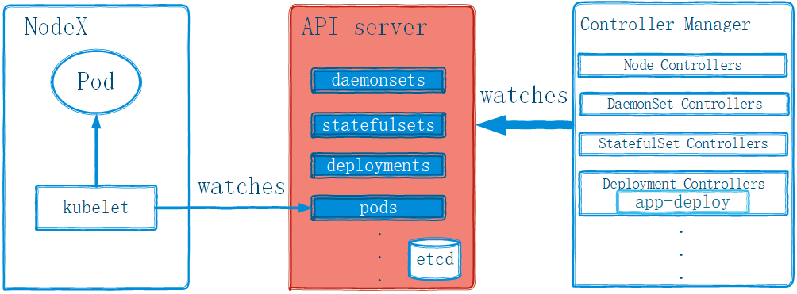

# 一. Pod 控制器

K8s 中的 Pod 对象由调度器调度至目标 node 节点后即由相应节点上的 kubelet 代理负责监控其容器的存活性，当容器主进程崩溃后，kubelet 能够自动重启相应的容器。不过，kubelet 对容器中的非主进程崩溃错误却无从感知，这依赖于用户为 Pod 资源对象自定义的存活性探测(liveness probe)机制，以便 kubelet 能够探知到此类故障。然而，在 Pod 对象遭到意外删除，或者工作节点自身发生故障时，又该如何处理呢?

kubelet 是 Kubernetes 集群节点代理程序，它在每个工作节点上都运行着一个实例。 因而，集群中的某工作节点发生故障时，其 kubelet 也必将不再可用，于是，节点上的 Pod 资源的健康状态将无从得到保证，也无法再由 kubelet 重启。此种场景中的 Pod 存活性一般要由工作节点之外的 Pod 控制器来保证。

Pod 控制器由 master 节点的 kube-contoller-manager 组件提供，常见的此类控制器有Replication Cotoller、ReplicaSet、Deployment、DaemonSet、StatefulSet、Job 和CronJob 等，它们分别以不同的方式管理 Pod 资源对象。实践中，对 Pod 对象的管理通常都是由某种控制器的特定对象来实现的，包括其创建、删除及重新调度等操作。

## 1.1 Pod 控制器介绍

我们可以把 API Server 类比成一个存储对象的数据库系统，它向客户端提供 API，并负责存储由用户创建的各种资源对象，至于各对象的当前状态如何才能符合用户期望的状态，则需要交由称为控制器的组件来负责完成。Kubemetes 提供了众多的控制器来 理各种类型的资源，如 Node Lifecycle Cntroller、Namespace Controller、
Service Controller 和 Deployment Controller 等。这些控制器均见名知义。创建完成后，每个控制器对象都可以通过内部的 reconciliation loop 不间断地监控着由其负责的所有资源并确保其处于或不断地逼近用户定义的目标状态。

尽管能够由 kubelet 为其提供自愈能力，但在节点宕机时，自主式 Pod 对象的重建式自愈机制则需要由 Pod 控制器对象负责提供，并且由它来负责实现生命周期中的各类自动管理行为，如创建及删除等。

Master 的各组件中，API Server 仅负责将资源存储于 etcd 中，并将其变动通知给各相关的客户端程序，如 kubelet、kube-scheduler、kube-proxy 和kube-controller-manager 等，kube-scheduler 监控到处于未绑定状态的 Pod 对象出现时遂启动调度器为其挑选适配的工作节点，然而，Kubernetes 的核心功能之一还在于要确保各资源对象的当前状态(status)匹配用户期望的状态(spec)。使当前状态不断地向期望状态"和解"(reconciliation)来完成容器应用管理，而这些则是kube-controller-manager 的任务。kube controller-manager 是一个独立的单体守
护进程，然而它包含了众多功能不同的控制器类型分别用于各类控制任务，如图:



<center>kube-controller-manager及其控制器</center>
```ruby
Kubernetes可用的控制器有:
attachdetach、bootstrapsigner、 clusterrole-aggregation、cronjob、
csrapproving、csrcleaner、csrsigning、daemonset、deployment、disruption、endpoint、
garbagecollctor、horizontalpodautoscaling、job、namespace、node 、
persistentvolume-binder、persistentvolume-expander、podgc 、pvc-protection、replicaset、
replication-controller、resourcequota、route、service、serviceaccount 、serviceaccount-token、
statefulset、tokencleaner 和 ttl 等数十种。
```

根据资源清单创建为具体的控制器对象之后，每个控制器均通过 API Server 提供的接口持续监控相关资源对象的当前状态，并在因故障、更新或其他原因导致系统状态发生变化时，尝试让资源的当前状态向期望状态迁移和通近。简单来说，每个控制器对象都运行一个(reconcilation loop)负责状态和解，并将目标资源对象的当前状态写入到其 status 字段中。

List-Watch 是 Kubenetes 实现的核心机制之一，在资源对象的状态发生变动时，由 API Server 负责写人 eted 并通过水平触发(level-triggered)机制主动通知给相关的客户端程序以确保其不会错过任何一个事件。控制器通过 API Server 的 watch 接口实时监控目标资源对象的变动并执行和解操作，但并不会与其他控制器进行任何交互，甚至控制器之间根本就意识不到对方的存在。

工作负载(workload)一类的控制器资源类型包括 ReplicationController、ReplicaSet、Deployment、
DaemonSet、StatefulSet、Job 和 CronJob 等。

## 1.2 Pod 对象与控制器

Pod 控制器资源通过持续性地监控集群中运行着的 Pod 资源对象来确保受其管控的资源严格符合用户期望的状态，例如资源副本的数量要精确符合期望等。通常，一个 Pod 控制器资源至少应该包含三个基本的组成部分。

- 标签选择器:匹配并关联 Pod 资源对象，并据此完成受其管控的 Pod 资源计数。
- 期望的副本数:期望在集群中精确运行着的 Pod 资源的对象数量。
- Pod 模板:用于新建 Pod 资源对象的 Pod 模板资源。

```ruby
DaemonSet 用于确保集群中的每个工作节点或符合条件的每个节点上都运行着一个
Pod 副本，而不是某个精确的数量值，因此不具有上面组成部分中的第二项。
```

## 1.3 Pod 模板资源

PodTemplate 是 Kubernetes API 的常用资源类型，常用于为控制器指定自动创建 Pod 资源对象时所需的配置信息。因为要内嵌于控制器中使用，所以 Pod 模板的配置信息中不需要apiVersion 和 kind 字段，但除此之外的其他内容与定义自主式 Pod 对象所支持的字段几乎完全相同，这包括 metadata 和 spec 及其内嵌的其他各个字段。Pod 控制器类资源的spec 字段通常都要内嵌 replicas、selector 和 template 字段，其中 template 即为Pod 模板的定义。

下面是一个定义在 ReplicaSet 资源中的模板资源示例:

```yaml
apiVersion: apps/v1
kind: ReplicaSet
metadata:
  name: rs-example
spec:
  replicas: 2
  selector:
    matchLabels:
      app: rs-demo
  template:
    metadata:
      labels:
        app: rs-demo
    spec:
      containers:
        - name: myapp
          image: ikubernetes/myapp:v1
          ports:
            - name: http
              containerPort: 80
```

如上示例中，spec.template 字段在定义时仅给出了 metadata 和 spec 两个字段，它的使用方法与自主式 Pod 资源完全相同。

# 二. ReplicaSet 控制器


## 2.1 ReplicaSet 控制器介绍

## 2.2 创建 ReplicaSet

## 2.3 ReplicaSet 控制的 Pod

## 2.4 更新 ReplicaSet

## 2.5 删除 ReplicaSet 资源

# 三. Deployment 控制器

## 3.1 创建 Deployment 资源

## 3.2 更新策略

## 3.3 升级 Deployment

## 3.4 canany deployment

## 3.5 发布应用

## 3.6 扩容和缩容

# 四. DaemonSet 控制器

## 4.1 创建 DaemonSet 资源对象

## 4.2 更新 DaemonSet 对象

# 五. Job 控制器

## 5.1 创建 Job 对象

## 5.2 并行式 Job

## 5.3 Job 扩容

## 5.4 删除 Job

# 六. CronJob 控制器

## 6.1 创建 CronJob 对象

## 6.2 CronJob 的控制机制

# 七. ReplicationController 介绍

# 八. Pod 中断预算
