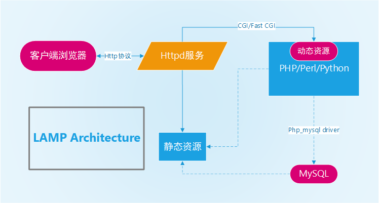
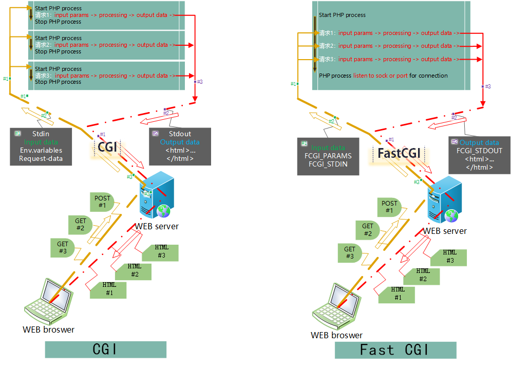
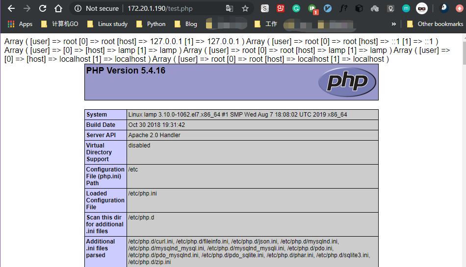

<center><font face="黑体" color="grey" size="5">LAMP简介</font></center>

# 一.概述

<center></center>
<center><font face="黑体" color="grey" size="3">LAMP所代表的四个平台</font></center>

- LAMP 为四个开源软件的首字母缩写的组合，一般被用来实现搭建动态网页服务。
  `Linux` ---为目前世界上最受欢迎的开源操作系统
  `Apache` --也叫 httpd，目前是市场占有率很高的 web 服务器之一
  `Mysql` ----最受欢迎的开源数据库之一，也常使用`Mariadb`或者`memcached`
  `PHP` -------和 HTML 语言强相关的脚本语言，也常使用 Perl,Python 等语言

- 在 LAMP 中，四者全是开源的技术和软件，虽然这些开放源代码的程序本身并不是专门
  设计成同其它几个程序一起工作的，但由于使用它们来实现网站架构时，非常的廉价。
  由于开源和成本优势这个组合开始流行起来(大多数 Linux 发行版本捆绑了这些软件)。
  当结合 L,A,M,P 一起使用的时候，它们表现的像一个具有活力的"解决方案包"
  (Solution Packages)。其他的方案包有苹果的 WebObjects(最初是应用服务器)，
  Oracle 的 Java/J2EE 和微软的.NET 架构。

- Michael Kunze 在一篇为德国计算机杂志《c't》（1998，第 12 期，230 页）而写的
  文章中使用了缩略语“LAMP”。这篇文章意在展示一系列的自由软件成为了商业包的替换
  产品。由于 IT 世界众所周知的对缩写的爱好，Kunze 提出“LAMP”这一容易被市场接受
  的术语来普及自由软件的使用。

- O'Reilly[^1]和 MySQL AB 在英语人群中普及了这个术语。MySQL AB 自己的市场推广
  在某种程度上基于 LAMP 包的推广，其他的项目和厂商则推行这个术语的一些变体，包括：
  `LAPP`（以 PostgreSQL 替代 MySQL）
  `LAMP`（最后两个字母意味着 Middleware 和 PostgreSQL）
  `LNMP` 或 LEMP（以 Nginx 替代 Apache）
  `WAMP`（以 MicrosoftWindows 替代 Linux）
  `MAMP`（以 Macintosh 替代 Linux）
  `LAMJ`（以 JSP/servlet 替代 PHP）
  `BAMP`（以 BSD 替代 Linux）
  `WIMP`（指 MicrosoftWindows, MicrosoftIIS，MySQL,PHP）
  `AMP`（单指 Apache,MySQL 和 PHP）
  `XAMP`（以 XML 替代 Linux）
  一些人借用 LAMP 来描述一类可定制组成的系统，而不是制造一系列新词，并用它来表示
  这些系统和统一打包的页面开发环境的不同（例如 ASP，.NET 和 J2EE）。

# 二.LAMP 架构简介

## 2.1 LAMP 架构说明

- LAMP 的架构简图如下
  
  <center><font face="黑体" color="grey" size="3">LAMP架构图</font></center>
    1. 当客户端请求的是静态资源时，web 服务器会直接把静态资源返回客户端
    2. 当客户端请求的是动态资源时，httpd 的 php 模块会进行相应的动态资源
       运算，如果此过程还需要数据库的数据作为运算参数时，php 会 连接 mysql
       取得数据然后进行运算，运算的结果转为静态资源由 web 服务器返回到客户端

## 2.2 LAMP 涉及的概念

### 2.2.1 静态资源和动态资源

- 当一个浏览器向某个服务器请求某个 web 页面时，服务器端接收到请求后悔返回
  页面资源，而浏览器会加载服务器返回的多个(包含多种文件资源)资源文件；其中某
  些文件(png/jpg/mp4，css，html 等文件)在服务器是什么格式和内容，传到客户端
  就是什么格式和对应内容，这些资源就叫**静态资源**；有的文件则是一些能够生成 html
  的脚本文件(PHP/Perl/Python)，这些脚本会在服务器接收到客户端请求时被运行，
  而服务器返回这些脚本运行的输出结果(输出结果包括 html 文档和响应头部信息)给
  客户端(浏览器)，像这些脚本文件就是**动态资源**。

### 2.2.2 CGI

> [CGI-wiki](https://en.wikipedia.org/wiki/Common_Gateway_Interface)

- CGI(Common Gateway Interface):中文叫`公共网关接口`，广义上指的是 web 服务器
  (例如 httpd 服务器)和外部软件之间的接口规范。这些外部软件一般是用于动态生成网页的
  脚本集合。也叫称为 CGI scripts。这些脚本如何执行及执行的规范是针对服务器的，一般
  CGI scripts 会在 http 服务器收到 http 请求时由服务器执行，并生成相对应的 html
  文档返回给客户端。这些脚本写成的软件一般会被放在 web 服务器对外提供服务事务根文件夹
  下的名为`cgi-bin`的目录下，如`/var/www/htdocs/cgi-bin`。多种脚本文件都可以作为
  cgi 程序，如：Perl 语言的`.pl`程序，PHP 语言的`.php`程序，Python 语言的`.py`程序。

- 下面的例子进行了一次 CGI 程序接收随客户端请求发送来的参数并处理和生成 HTML
  文档的过程`add.html`为客户端请求的 HTML 文档，`add.cgi`为 pythhon 写的 CGI
  脚本程序。

> add.html: `http://suosuoli.cn/htdocs/add.html`

```html
<!DOCTYPE html>
<html>
  <body>
    <form action="add.cgi" method="POST">
      <fieldset>
        <legend>Enter two numbers to add</legend>
        <label>First Number: <input type="number" name="num1"/></label><br />
        <label>Second Number: <input type="number" name="num2"/></label><br />
      </fieldset>
      <button>Add</button>
    </form>
  </body>
</html>
```

> add.cgi: `/htdocs/cgi-bin/add.cgi`

- 该 python 程序从 html 得到输入(在 linux 中，称标准输入)，并将两个数相加，附带在 html 中
  的两个数是随着客户端的请求被存入服务器相应的变量中的，`add.cgi`程序从变量中读取内容
  (两个数字)， 并进行相应的处理，并生成响应的 html 文档和响应首部首部传给服务器后由服务
  器返回给客户端。

```py
#!/usr/bin/env python3

import cgi
import cgitb
cgitb.enable()

input_data = cgi.FieldStorage()

print('Content-Type: text/html') # 下面的空行表示接着响应体，也就是处理后生成的html文档
print()                         # 输出空行
print('<h1>Addition Results</h1>')
try:
    num1 = int(input_data["num1"].value)
    num2 = int(input_data["num2"].value)
except:
    print('<output>Sorry, the script cannot turn your inputs into numbers (integers).</output>')
    raise SystemExit(1)
print('<output>{0} + {1} = {2}</output>'.format(num1, num2, num1 + num2))
```

- 在 linux 中，执行上面的程序意味着需要创建新的进程，在该进程处理完这个请求后便被销毁。
  这样每来一个请求，就会创建一个进程，这意味着客户端加载一个页面时需要的时间比不用 CGI
  着中方式时更久(不使用动态处理生成 html，web 服务器直接把静态的 html 发送给客户端)。
- 实际上，如果访问量不大，比如并发访问量只有十多个，这种情况下一般的系统完全能在人能
  接受的时间内(比如 3 秒内)把 html 页面发送到浏览器。但是在现在的互联网环境中，访问量
  是巨大的，比如在 10 秒内有 5000 个请求发送到服务器，全部是请求动态资源，服务器都要调
  用 cgi 程序处理，那么就要求系统前前后后创建 5000 个进程，这时创建进程和销毁进程所花费
  的时间甚至比实际处理和生成 html 文档的时间更久，系统的开销没有用在处理真正的客户端
  请求，此时 CGI 的方式就成为了整个系统的瓶颈。
- 所以后面又出现了 **CGI 的改良方案 FastCGI**。

### 2.2.3 Fast CGI

> Fast CGI
> 

  <center><font face="黑体" color="grey" size="3">CGI(左)和Fast CGI(右)对比</font></center>
  
如上图所示，CGI和Fast CGI的核心区别在于处理请求的进程在处理完请求后是否结束生命期，
每个CGI进程只处理一个请求，处理完后就退出，其资源也被回收；而Fast CGI的进程则不会，
在处理完前一个进程后，该进程会继续监听本地sokcet文件或者通过9000端口监听远程服务器
发来的请求，一旦有请求，其会快速的和服务器进行交互并进行处理，由于没有再次创建进程
的过程，其速度比CGI的速度更快。目前生产几乎都用Fast CGI的方式完成LAMP架构的搭建。
其长时间运行等待请求的进程为linux下的独立服务进程，更改配置文件需要重启该服务。一
般该服务叫`php-fpm`，是Fast CGI的具体实现。

# 三.PHP 介绍

## 3.1 PHP 简介

> [PHP-wiki](https://en.wikipedia.org/wiki/PHP)

- PHP 是一种广泛使用的开源脚本语言，其设计初衷是为了用于开发和维护网页界面，最初被
  其编写者 Radmus Lerdorf 称为"Personal Home Page/Forms Interpreter" 或 PHP/FI，
  当时该工具可以用来创建简单的动态网页程序及加速错误报告。1995 年 Lerdorf 初次宣布了
  第一个正式版本 PHP/FI 称为"Personal Home Page Tools (PHP Tools) version 1.0"。
  该版本已经具有现在的 PHP 的部分功能。目前 php 由 PHP group 管理，其全名不再是
  "Personal Home Page"，而是短语"PHP:Hypertext Preprocessor"的首字母简写。
- PHP 代码可以在命令行(CLI)执行，也可以被嵌入到 HTML 代码中执行，或者和很多其他的
  web 服务器或框架配合使用。PHP 还常用来开发独立的 GUI 界面。PHP 代码通常被其解释器
  解析成类似 JAVA 字节码的中间代码，再被 CPU 执行，一般其解释器可以是 CGI 程序，
  服务器的某个模块，或者 Zend 引擎[^2]。

- PHP 是完全开源的语言，与其相关的程序和工具可以免费下载和使用

## 3.2 PHP 工作过程

- PHP 代码执行一般都分为两个步骤，首先由 Zend 引擎解析为其能够识别的 Opcode，类似于
  Java 的 ByteCode 字节码，或者.NET 环境的 MSL 代码。而后再由 Zend 引擎执行该代码，
  最终产生输出。比较详细的过程分为四步：

1. Scanning 词法分析,将 PHP 代码转换为语言片段(Tokens)
2. Parsing 语义分析,将 Tokens 转换成具有含义的表达式
3. Compilation 将表达式解析为 Zend 引擎能识别的 Opcode
4. Execution 由 Zend 引擎顺序执行 Opcode，每次一条，从而产生输出

## 3.3 PHP 有关的配置

- linux 下 php 的主配置文件:`/etc/php.ini`
  其它的配置文件也可以方法:`/etc/php.d/*.ini`
- 涉及到模块的修改或者 Fast CGI 的配置都需要重启服务
  `Modules`:重启 httpd
  `Fast CGI`:重启 php-fpm

- `/etc/php.ini`配置文件格式

```ini
[foo]  ## 配置块名称
directive = value
directive2 = value2
......
[bar]
directive3 = value3
```

- 注释符说明
  以`#`开头，纯粹的注释信息
  以`;`开头，用于注释可启用的 directive

- php.ini 配置参考文档
  [php.ini 的核心配置选项文档](http://php.net/manual/zh/ini.core.php)
  [php.ini 配置选项列表](http://php.net/manual/zh/ini.list.php)

- php 常见设置

```py
max_execution_time= 30 最长执行时间30s
memory_limit=128M 生产不够，可调大
display_errors=off  调试使用，不要打开，否则可能暴露重要信息
display_startup_errors=off  建议关闭
post_max_size=8M   最大上传数据大小，生产可能调大，比下面项大
upload_max_filesize =2M  最大上传文件，生产可能要调大
max_file_uploads = 20 同时上传最多文件数
date.timezone =Asia/Shanghai  指定时区
short_open_tag=on 开启短标签
```

# 四.实现 LAMP 架构


<center><font face="黑体" color="grey" size="3">LAMP架构图</font></center>

## 4.1 实现 LAMP 的关键点有三个

1. PHP 连接 MySQL 数据库，和数据库交互
2. httpd 和 PHP 的工作模式(CGI or FastCGI)的适配
3. httpd 和 PHP 的交互，让 PHP 为 httpd 处理动态资源，也就是说 httpd 接收用户的
   web 请求；静态资源则直接响应；动态资源如 php 脚本，对此类资源的请求将交由 php
   来处理

## 4.2 实现 LAMP 需要安装的包

- centos8 下 模块(CGI) 方式实现 LAMP 需要安装的包
  `httpd`
  `mariadb-server`
  `php-mysqlnd`
  `php`
- centos8 下 FastCGI 方式实现 LAMP 需要安装的包
  `httpd`
  `mariadb-server`
  `php-mysqlnd`
  `php-fpm`
- centos7 下 模块(CGI) 方式实现 LAMP 需要安装的包
  `httpd`
  `mariadb-server`
  `php-mysql`
  `php`
- centos7 下 FastCGI 方式实现 LAMP 需要安装的包
  `httpd`
  `mariadb-server`
  `php-mysql`
  `php-fpm`
- centos6 下 模块(CGI) 方式实现 LAMP 需要安装的包
  `httpd`
  `mysql-server`
  `php-mysql`
  `php`
- centos6 默认不支持 PHP 和 httpd 工作在 FastCGI 方式

## 4.3 PHP 和 MySQL 的连接

### 4.3.1 使用 mysql 对 php 的扩展模块

- 使用 mysql 扩展模块 mysql.so 连接数据，此方式已经在 php 7 版后淘汰
- php 使用 mysql 扩展连接数据库的测试代码如下：

```php
<?php
$conn = mysql_connect('mysqlserver','username','password');
if ($conn)
    echo "OK";
else
    echo "Failure";
    #echo mysql_error();
    mysql_close();
?>
```

### 4.3.2 使用 mysqli 扩展连接数据库

- 使用 mysqli 扩展模块 mysqli.so 连接数据，此方式 php 只能连接 MySQL 数据库
- php 使用 mysqli 扩展连接数据库的测试代码如下：

```php
<?php
$mysqli=new mysqli("mysqlserver", "username", "password");
if(mysqli_connect_errno()){
    echo "Failure";
    $mysqli=null;
    exit;
}
echo "OK";
$mysqli->close();
?>
```

### 4.3.3 使用 PDO(PHP Data Object)扩展连接数据库

- 使用 PDO 扩展模块 pdo_mysql.so 连接数据库，此方式可以支持连接 MySQL，Oracle 等
  多种数据库，是更加推荐的方式

- php 使用 pdo 扩展连接数据库的测试代码如下：

```php

```

- 另一个测试代码

```php
<?php
try {
$user='root';
$pass='magedu';
$dbh = new PDO('mysql:host=mysqlhost;dbname=mysql', $user, $pass);
foreach($dbh->query('SELECT user,host from user') as $row) {
print_r($row);
}
$dbh = null;
} catch (PDOException $e) {
print "Error!: " . $e->getMessage() . "<br/>";
die();
}
?>
```

## 4.4 实现 LAMP

- 在 centos7 上实现 LAMP，并测试

```bash
[root@lamp ~]# yum -y install httpd php php-mysqlnd mariadb-server

# 查看目前httpd的mpm工作模式
[root@lamp ~]# grep -n "prefork.so" /etc/httpd/conf.modules.d/*
/etc/httpd/conf.modules.d/00-mpm.conf:6:LoadModule mpm_prefork_module modules/mod_mpm_prefork.so

# 查看关于php模块的配置，已经添加了处理php程序的配置
[root@lamp ~]# grep -nC 2  "httpd-php" /etc/httpd/conf.d/php.conf
3-#
4-<FilesMatch \.php$>
5:    SetHandler application/x-httpd-php
6-</FilesMatch>

# 启动httpd和mariadb
[root@lamp ~]# systemctl start httpd mariadb

# centos7 上默认按mariadb5.5.64，且默认无密码
[root@lamp ~]# mysql
Welcome to the MariaDB monitor.  Commands end with ; or \g.
Your MariaDB connection id is 2
Server version: 5.5.64-MariaDB MariaDB Server

Copyright (c) 2000, 2018, Oracle, MariaDB Corporation Ab and others.

Type 'help;' or '\h' for help. Type '\c' to clear the current input statement.

MariaDB [(none)]> show databases;
+--------------------+
| Database           |
+--------------------+
| information_schema |
| mysql              |
| performance_schema |
| test               |
+--------------------+
4 rows in set (0.00 sec)

# 编写一个测试连接数据库的php脚本
[root@lamp ~]# vim /var/www/html/test.php
<?php
try {
$user='root';
$pass='';
$dbh = new PDO('mysql:host=localhost;dbname=mysql', $user, $pass);
foreach($dbh->query('SELECT user,host from user') as $row) {
print_r($row);
}
$dbh = null;
} catch (PDOException $e) {
print "Error!: " . $e->getMessage() . "<br/>";
die();
}
phpinfo();
?>

```

访问`http://ip/test.php`，出现下面的信息，说明成功的搭建 LAMP


- **注意：基于 CGI 模块(Module)实现 LAMP 时，http 的 mpm 工作模式只能选 prefork**

```ruby
cat /etc/httpd/conf.modules.d/01-cgi.conf
# This configuration file loads a CGI module appropriate to the MPM
# which has been configured in 00-mpm.conf.  mod_cgid should be used
# with a threaded MPM; mod_cgi with the prefork MPM.

<IfModule mpm_worker_module>    # work模式使用mod_cgid.so模块
   LoadModule cgid_module modules/mod_cgid.so
</IfModule>
<IfModule mpm_event_module>     # event模式使用mod_cgid.so模块
   LoadModule cgid_module modules/mod_cgid.so
</IfModule>
<IfModule mpm_prefork_module>      # CGI对应的模块只能使用prefork模式
   LoadModule cgi_module modules/mod_cgi.so
</IfModule>
```

## 脚注

[^1]: O'Reilly Media,Inc.是世界上在 UNIX、X、Internet 和其他开放系统图书领域具有领导地位的出版公司，同时是联机出版的先锋。从最畅销的《The Whole Internet User's Guide and Catalog》（被纽约公共图书馆评为二十世纪最重要的 50 本书之一）到 GNN（最早的 Internet 门户和商业网站），再到 WebSite（第一个桌面 PC 的 Web 服务器软件），O'Reilly Meida,Inc.一直处于 Internet 发展的最前沿。
[^2]: 标准的 PHP 解释器为 Zend Engine，是在 PHP 许可证下发布的自由软件。它最早是由以色列理工学院(Technion)的学生 Andi Gutmans 和 Zeev Suraski 所开发，Zend 也正是此二人名字的合称。后来两人联合创立了 Zend Technologies 公司。Zend Engine 1.0 于 1999 年随 PHP 4 发布，由 C 语言开发且经过高度优化，并能够做为 PHP 的后端模块使用。Zend Engine 为 PHP 提供了内存和资源管理的功能以及其它的一些标准服务，其高性能、可靠性和可扩展性在促进 PHP 成为一种流行的语言方面发挥了重要作用 Zend Engine 的出现将 PHP 代码的处理过程分成了两个阶段：首先是分析 PHP 代码并将其转换为称作 Zend opcode 的二进制格式 opcode(类似 Java 的字节码)，并将其存储于内存中；第二阶段是使用 Zend Engine 去执行这些转换后的 Opcode
