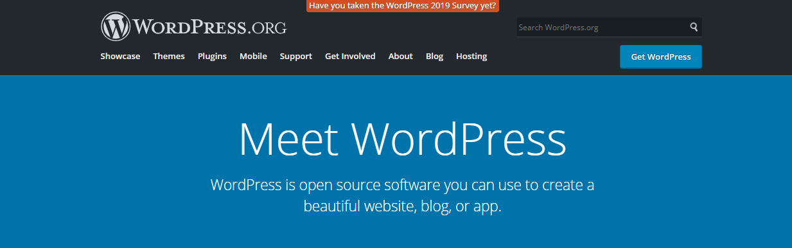
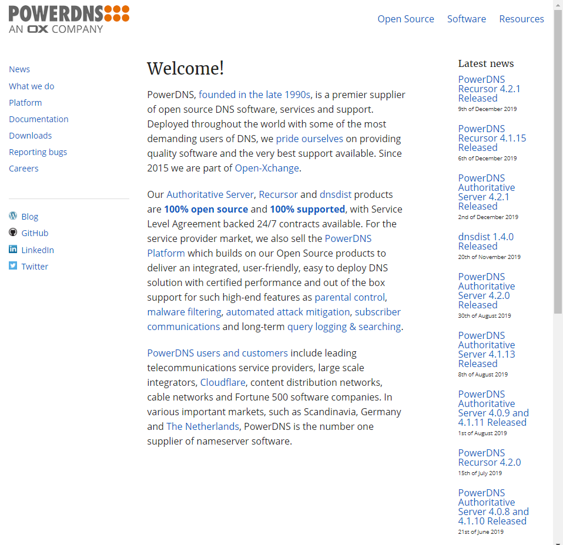
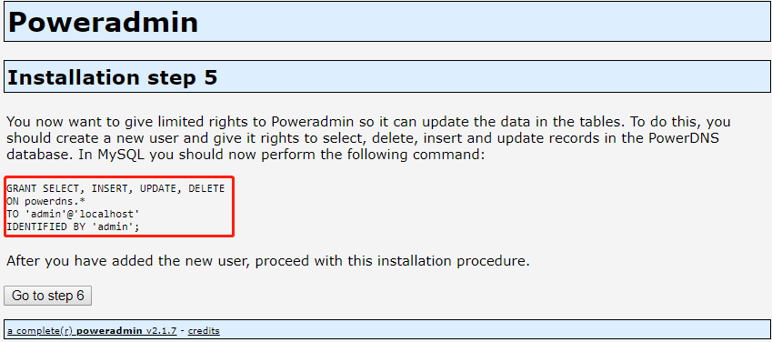

<center><font face="黑体" color="#87cefa" size="5">LAMP_常见php应用部署</font></center>

- **常见 php 应用**

1. `phpMyadmin`
   phpMyadmin 是一个基于 php 语言开发的用于管理 MySQL 数据库的 WEB GUI 程序，其工作依赖
   于 httpd 等的网页服务软件，使用其可以方便快捷的对 mysql 数据库进行管理。

   > [phpMyadmin 官网](https://www.phpmyadmin.net) 

2. `wordpress`
   wordpress 是基于 php 开发的博客平台，广受各领域的博客作者欢迎；可以说是目前最受欢迎的
   博客平台。搭建 wordpress 需要支持 php 和 mysql 的服务器。随着 wordpress 不断发展，其
   不仅可以用来搭建个人博客，很多商业公司也开始使用 wordpress 搭建商业网站，而且可以将
   wordpress 单纯的用作 CMS(Content management system)也是可以的。

   > [wordpress 官网](https://wordpress.org) 

3. `Discuz!论坛`
   Discuz!论坛的全称为`Crossday Discuz! Board`，是国内公司(北京康盛新创科技有限责任公司,
   Comsenz Inc.)开发的一套社区论坛软件，基于 php 语言。自 2001 年 6 月推出至今，其已经有
   18 年的应用经历，使用其搭建的网站超 2000 万。2010 年 8 月 Comsenz 被腾讯收购。

   > [Discuz!官网](https://www.discuz.net/forum.php) 

4. `PowerDNS`
   PowerDNS 是一个基于 php 开发的跨平台的 DNS 服务组件，在 linux 下使用 mysql 来存储 DNS
   解析信息。使用 PowerDNS 来部属 DNS 服务器可以快速的完成各种配置操作，而不用敲一行命令。
   这种便捷性和 phpMyadmin 类似。

   > [PowerDNS 官网](https://www.powerdns.com/) 

   > [PowerDNS 文档](https://doc.powerdns.com/)

   > [Poweradmin 官网](http://www.poweradmin.org/)

# 一.部署 phpMyadmin

- 在 centos7 部署安装 phpMyadmin

大致安装过程

```ruby
1. 配置清华大学的remi镜像源，安装phhp7.2及相关的依赖包
   php72-php:php7.2版本
   php72-php-mbstring:该包含有使得php可以处理多字节字符串(multi-byte string handling)的动态库
   php72-php-mysqlnd:使得php可以和数据库交互的动态库
2. 安装httpd,mariadb-serverm并启动
3. 下载解压
4. 移动到httpd提供服务的根目录
5. 设置mysql的root密码
6. 访问`http://ip/phpMyadmin/`进行安装配置
```

具体过程

```bash
[root@localhost ~]# yum install https://mirrors.tuna.tsinghua.edu.cn/remi/enterprise/remi-release-7.rpm

[root@localhost ~]# yum install php72-php php72-php-mbstring php72-php-mysqlnd mariadb-server
[root@localhost ~]# systemctl start httpd mariadb
[root@localhost ~]# cd /var/www/html
[root@localhost html]# wget https://files.phpmyadmin.net/phpMyAdmin/4.9.2/phpMyAdmin-4.9.2-all-languages.zip
[root@localhost html]# yum install zip unzip -y
[root@localhost html]# unzip phpMyAdmin-4.9.2-all-languages.zip
[root@localhost html]# cd phpMyAdmin-4.9.2-all-languages/
[root@localhost phpMyAdmin-4.9.2-all-languages]# cp config.sample.inc.php  config.inc.php

# 如果mysql 服务器和phpmyadmin不在同一台主机，还需要修改以下设置
[root@localhost html]# vim config.inc.php
$cfg['Servers'][$i]['host'] = 'mysqlserverIP';

# 改个名
[root@localhost html]# mv phpMyAdmin-4.9.2-all-languages /var/www/html/phpMyadmin

# 设置mysql的root密码，phpMyadmin不允许空密码登录
[root@localhost ~]# mysql_secure_installation
```

> 访问`http://ip/phpMyadmin/`开始安装

# 二.部署 wordpress

- centos8 部署安装 wordpress

大致安装过程

```ruby
1. 安装httpd,mariadb-server,和php相关程序
2. 创建wordpress专用的数据库
3. 在mysql创建wordpress账户
4. 授权wordpress用户相应权限
5. 下载wordpress压缩包
6. 解压缩到httpd提供服务的根文件夹
7. 给httpd系统账户访问wordpress文件夹赋予相应权限
8. 浏览器访问`http://ip/wordpress/`安装
```

具体过程

```bash
[root@centos8 ~]#dnf -y install httpd mariadb-server php php-mysqlnd
[root@centos8 ~]#systemctl start httpd mariadb

[root@centos8 ~]#mysql
MariaDB [(none)]> CREATE DATABASE wordpress;
MariaDB [(none)]> GRANT ALL ON wordpress.* TO wordpress@'localhost' IDENTIFIED BY 'magedu';

[root@centos8 ~]#unzip  wordpress-5.2.3-zh_CN.zip -d /var/www/html/
[root@centos8 ~]##chown -R apache.apache wordpress/
```

> 访问`http://ip/wordpress`开始安装

# 三.部署 Discuz!论坛

- Centos8 使用 RPM 包部署 Discuz!
- Discuz 的源码和安装包都被部署在码云 gitee

  > [Discuz 下载地址](https://gitee.com/3dming/DiscuzL/attach_files)

  > [Discuz 官方论坛](https://www.discuz.net/forum.php)

- 大致的部署步骤

```ruby
1. 安装服务软件和数据库及其它的依赖组件httpd,php,php-xml,php-mysqlnd,php-json,mariadb-server
   php-json:该包提供php对json的扩展，使得php可以处理json数据交换格式
   php-xml:该包提供相应的动态共享库使得php可以通过DOM树处理XML文档
   php-mysqlnd:该包同样有相关的动态共享库使得mysql和php可以交互
2. 创建Discuz数据库和专用账户
3. 下载Discuz压缩包，解压到httpd服务的根目录
4. 浏览器访问http://ip/discuz-folder/install安装
```


```bash
[root@localhost ~]# dnf -y install httpd php php-xml php-mysqlnd php-json mariadb-server
[root@localhost ~]# systemctl start httpd
[root@localhost ~]# systemctl start mariadb
[root@localhost ~]# ss -ntl
State              Recv-Q              Send-Q                            Local Address:Port                            Peer Address:Port
LISTEN             0                   128                                     0.0.0.0:22                                   0.0.0.0:*
LISTEN             0                   128                                        [::]:22                                      [::]:*
LISTEN             0                   80                                            *:3306                                       *:*
LISTEN             0                   128                                           *:80                                         *:*
[root@localhost html]# cd /var/www/html
[root@localhost html]# wget https://gitee.com/3dming/DiscuzL/attach_files/305647/download
[root@localhost html]# unzip Discuz_X3.4_SC_UTF8【20191201】.zip
[root@localhost html]# ls
Discuz_X3.4_SC_UTF8【20191201】.zip  qqqun.png  readme  readme.html  upload  utility
[root@localhost html]# mv Discuz_X3.4_SC_UTF8【20191201】.zip ~/
[root@localhost html]# mv upload forum
[root@localhost html]# ls
forum  index.html  qqqun.png  readme  readme.html  utility
[root@localhost html]# tree -L 2
.
├── forum
│?? ├── admin.php
│?? ├── api
│?? ├── archiver
............
├── qqqun.png
├── readme
............
├── readme.html
└── utility
............

[root@localhost html]# chown -R apache:apache /var/www/html/forum
MariaDB [(none)]> CREATE DATABASE ultrax;
MariaDB [(none)]> SHOW DATABASES;
+--------------------+
| Database           |
+--------------------+
| information_schema |
| mysql              |
| performance_schema |
| ultrax             |
+--------------------+
MariaDB [(none)]> GRANT ALL ON ultrax.* TO ultrax@'localhost' IDENTIFIED BY 'stevenux';
Query OK, 0 rows affected (0.001 sec)
MariaDB [(none)]> FLUSH PRIVILEGES;
Query OK, 0 rows affected (0.000 sec)
MariaDB [(none)]> SELECT host,user,password FROM mysql.user WHERE user='ultrax';
+-----------+--------+-------------------------------------------+
| host      | user   | password                                  |
+-----------+--------+-------------------------------------------+
| localhost | ultrax | *3DCA33F8157E10F1701CA69286608B186AE2F904 |
+-----------+--------+-------------------------------------------+
1 row in set (0.001 sec)
```

- 开始安装
  访问`http://172.20.1.84/forum/`  
  或访问`http://172.20.1.84/forum/install/`

# 四.部署 PowerDNS

- 使用 centos8 基于 RPM 包安装部署 PowerDNS(目前 20191212 最新版，不支持 powerdns，缺少相关 php 包)

大致部署过程

```ruby
1.安装pdns，pdns-backend-mysql，mariadb-server
2.创建数据库:powerdns
3.创建一个powerDNS用来连接数据库的用户:powerdns，密码:stevenux
4.参考官方文档编写生成初始数据库的sql语句:power_schema.sql
5.修改配置文件/etc/pdns/pdns.conf，添加用于连接数据库的账户(powerdns:stevenux)
6.访问http://ip/poweradmin/install
7.进入安装流程
```

具体过程

```bash
# 安装软件包
[root@localhost yum.repos.d]# yum install -y pdns pdns-backend-mysql  mariadb-server
# 创建powerdns数据库和用户
[root@localhost yum.repos.d]# mysql -uroot -p
MariaDB [(none)]> CREATE DATABASE powerdns;
Query OK, 1 row affected (0.000 sec)

MariaDB [(none)]> SHOW DATABASES;
+--------------------+
| Database           |
+--------------------+
| information_schema |
| mysql              |
| performance_schema |
| powerdns           |
| ultrax             |
+--------------------+
5 rows in set (0.007 sec)

MariaDB [(none)]> GRANT ALL ON powerdns.* TO 'powerdns'@'localhost' IDENTIFIED BY 'stevenux';
Query OK, 0 rows affected (0.001 sec)

# 生成default schema的sql语句参考 https://doc.powerdns.com/md/authoritative/backend-generic-mysql/
[root@localhost ~]# vim power_schema.sql
CREATE TABLE domains (
  id                    INT AUTO_INCREMENT,
  name                  VARCHAR(255) NOT NULL,
  master                VARCHAR(128) DEFAULT NULL,
  last_check            INT DEFAULT NULL,
  type                  VARCHAR(6) NOT NULL,
  notified_serial       INT DEFAULT NULL,
  account               VARCHAR(40) DEFAULT NULL,
  PRIMARY KEY (id)
) Engine=InnoDB;

CREATE UNIQUE INDEX name_index ON domains(name);


CREATE TABLE records (
  id                    BIGINT AUTO_INCREMENT,
  domain_id             INT DEFAULT NULL,
  name                  VARCHAR(255) DEFAULT NULL,
  type                  VARCHAR(10) DEFAULT NULL,
  content               VARCHAR(64000) DEFAULT NULL,
  ttl                   INT DEFAULT NULL,
  prio                  INT DEFAULT NULL,
  change_date           INT DEFAULT NULL,
  disabled              TINYINT(1) DEFAULT 0,
  ordername             VARCHAR(255) BINARY DEFAULT NULL,
  auth                  TINYINT(1) DEFAULT 1,
  PRIMARY KEY (id)
) Engine=InnoDB;

CREATE INDEX nametype_index ON records(name,type);
CREATE INDEX domain_id ON records(domain_id);
CREATE INDEX recordorder ON records (domain_id, ordername);


CREATE TABLE supermasters (
  ip                    VARCHAR(64) NOT NULL,
  nameserver            VARCHAR(255) NOT NULL,
  account               VARCHAR(40) NOT NULL,
  PRIMARY KEY (ip, nameserver)
) Engine=InnoDB;


CREATE TABLE comments (
  id                    INT AUTO_INCREMENT,
  domain_id             INT NOT NULL,
  name                  VARCHAR(255) NOT NULL,
  type                  VARCHAR(10) NOT NULL,
  modified_at           INT NOT NULL,
  account               VARCHAR(40) NOT NULL,
  comment               VARCHAR(64000) NOT NULL,
  PRIMARY KEY (id)
) Engine=InnoDB;

CREATE INDEX comments_domain_id_idx ON comments (domain_id);
CREATE INDEX comments_name_type_idx ON comments (name, type);
CREATE INDEX comments_order_idx ON comments (domain_id, modified_at);


CREATE TABLE domainmetadata (
  id                    INT AUTO_INCREMENT,
  domain_id             INT NOT NULL,
  kind                  VARCHAR(32),
  content               TEXT,
  PRIMARY KEY (id)
) Engine=InnoDB;

CREATE INDEX domainmetadata_idx ON domainmetadata (domain_id, kind);


CREATE TABLE cryptokeys (
  id                    INT AUTO_INCREMENT,
  domain_id             INT NOT NULL,
  flags                 INT NOT NULL,
  active                BOOL,
  content               TEXT,
  PRIMARY KEY(id)
) Engine=InnoDB;

CREATE INDEX domainidindex ON cryptokeys(domain_id);


CREATE TABLE tsigkeys (
  id                    INT AUTO_INCREMENT,
  name                  VARCHAR(255),
  algorithm             VARCHAR(50),
  secret                VARCHAR(255),
  PRIMARY KEY (id)
) Engine=InnoDB;

CREATE UNIQUE INDEX namealgoindex ON tsigkeys(name, algorithm);

# 生成平powerdns所需的数据表:https://doc.powerdns.com/md/authoritative/backend-generic-mysql/
MariaDB [(none)]> use powerdns;
Database changed
MariaDB [powerdns]> source ~/power_schema.sql
Query OK, 0 rows affected (0.010 sec)

Query OK, 0 rows affected (0.012 sec)
Records: 0  Duplicates: 0  Warnings: 0
......

# 修改配置，添加数据库账户
[root@localhost ~]# vim /etc/pdns/pdns.conf
# launch        Which backends to launch and order to query them in
#
#launch=bind
launch=gmysql
gmysql-host=localhost
gmysql-port=3306
gmysql-dbname=powerdns
gmysql-user=powerdns
gmysql-password=stevenux

# 修改后如下
[root@localhost ~]# grep -Ev "^#|^$" /etc/pdns/pdns.conf
launch=gmysql
gmysql-host=localhost
gmysql-port=3306
gmysql-dbname=powerdns
gmysql-user=powerdns
gmysql-password=stevenux
setgid=pdns
setuid=pdns

[root@localhost ~]# ss -ntl
State                          Recv-Q                           Send-Q                                                      Local Address:Port                                                     Peer Address:Port
LISTEN                         0                                128                                                               0.0.0.0:22                                                            0.0.0.0:*
LISTEN                         0                                128                                                                  [::]:22                                                               [::]:*
LISTEN                         0                                80                                                                      *:3306                                                                *:*
LISTEN                         0                                128                                                                     *:80                                                                  *:*
[root@localhost ~]# systemctl enable --now pdns
Created symlink /etc/systemd/system/multi-user.target.wants/pdns.service → /usr/lib/systemd/system/pdns.service.
[root@localhost ~]# ss -ntlpu |grep pdns_server
udp   UNCONN  0       0                     0.0.0.0:53            0.0.0.0:*      users:(("pdns_server",pid=2651,fd=9))
udp   UNCONN  0       0                        [::]:53               [::]:*      users:(("pdns_server",pid=2651,fd=10))
tcp   LISTEN  0       128                   0.0.0.0:53            0.0.0.0:*      users:(("pdns_server",pid=2651,fd=11))
tcp   LISTEN  0       128                      [::]:53               [::]:*      users:(("pdns_server",pid=2651,fd=12))

[root@localhost html]# mv ~/poweradmin-2.1.7.tgz .
[root@localhost html]# ls
forum  index.html  poweradmin-2.1.7.tgz
[root@localhost html]# tar -xf poweradmin-2.1.7.tgz
[root@localhost html]# ls
forum  index.html  poweradmin-2.1.7  poweradmin-2.1.7.tgz
[root@localhost html]# mv poweradmin-2.1.7 poweradmin
[root@localhost html]# ls
forum  index.html  poweradmin  poweradmin-2.1.7.tgz
```

> 访问`http://ip/poweradmin/install`开始安装

1. 选择语言
   

2. 提示安装的前提
   

3. 填写刚创建的 mysql 用户名和密码，红框是要求设置管理员密码，
   该密码对应的用户名为**admin**，用于控制登录 web 界面，后面步骤
   完成后使用 admin 和红框中的密码来登录 web 界面。
   

4. 为 Poweradmin 创建一个受限用户存于配置文件中，该账户用于在
   更改数据库时和数据库交互。
   Username：受限用户名
   Password：上述用户的密码
   Hostmaster：当创建 SOA 记录指定默认主机管理员
   Primary nameserver：主域名服务器
   Secondary namesever:辅域名服务器
   

5. 为第 4 步写入配置文件中的用户创建一个对应的 mysql 用户，使用
   红框内的 sql 语句
   
   创建如下：

   ```bash
    MariaDB [(none)]> GRANT SELECT, INSERT, UPDATE, DELETE
        -> ON powerdns.*
        -> TO 'admin'@'localhost'
        -> IDENTIFIED BY 'admin';
    Query OK, 0 rows affected (0.001 sec)

    MariaDB [(none)]> FLUSH PRIVILEGES;
    Query OK, 0 rows affected (0.000 sec)
   ```

6. 要求创建一个名为`config.inc.php`的配置文件，内容使用红框内的
   将配置文件放于`/var/www/html/poweradmin/inc/`
   

   ```bash
   [root@localhost html]# vim /var/www/html/poweradmin/inc/config.inc.php
   <?php

   $db_host		= 'localhost';
   $db_user		= 'admin';
   $db_pass		= 'admin';
   $db_name		= 'powerdns';
   $db_type		= 'mysql';
   $db_layer		= 'PDO';

   $session_key		= 'BbX}SQU&wa[d33=K!xSkir=8cozkY^EmcYH[oi}{DLGsS*';

   $iface_lang		= 'en_EN';

   $dns_hostmaster		= 'powerdnsserver';
   $dns_ns1		= '172.20.1.84';
   $dns_ns2		= '172.20.1.84';
   ```

7. 安装完后的说明
   

8. 根据第 7 步说明，删除`/var/www/html/poweradmin/install/`文件夹
   `[root@localhost html]# rm -rf poweradmin/install/`

9. 访问`http://ip/poweradmin/`登录

   > 出错，提示`Error: You have to install PHP mcrypt extension!`

   > 

   `yum install php-mcrypt`

10. 访问`http://ip/poweradmin/`登录
    

# Trouble shooting

1. 如果出现`You are not install PDO library...`类似的错误，那是没有安装
   包`php-mysqlnd`的缘故。
   `yum install php-mysqlnd -y`安装后重启 httpd 和 mariadb 即可

2. 提示`Error: You have to install PHP mcrypt extension!`这个错误时，
   如果在 centos7 上，则需要安装`yum install -y php-mcrypt php-mhash`
   确保配置文件如下：
   ```ruby
   vim /etc/httpd/conf.modules.d/10-php.conf
   ......
   <IfModule prefork.c>
     LoadModule php5_module modules/libphp5.so
     LoadModule php5_module modules/mcrypt.so
   </IfModule>
   ......
   ```
   如果在 centos8 上，由于目前 epel 源没有 mcrypt 模块，需要编译安装。
