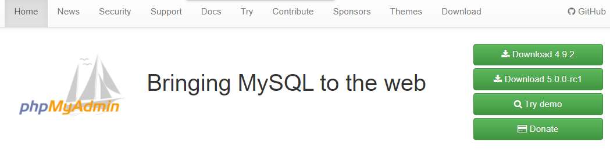
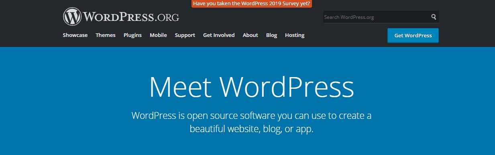
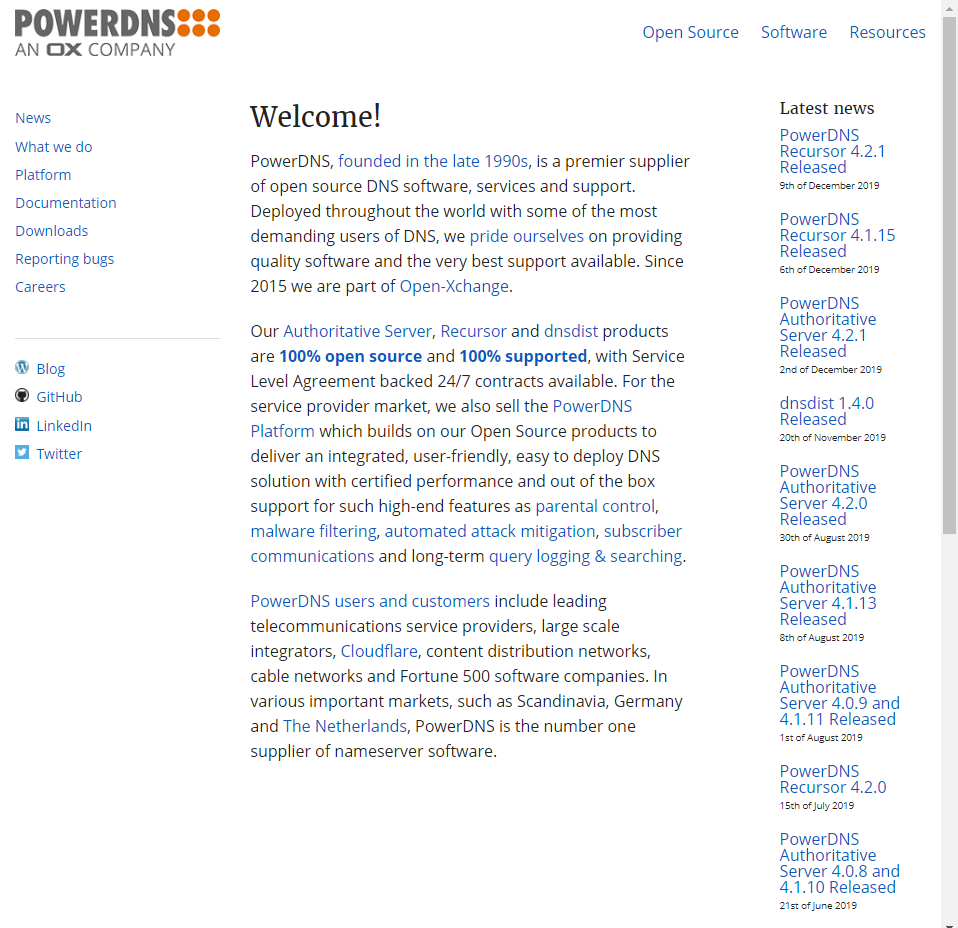
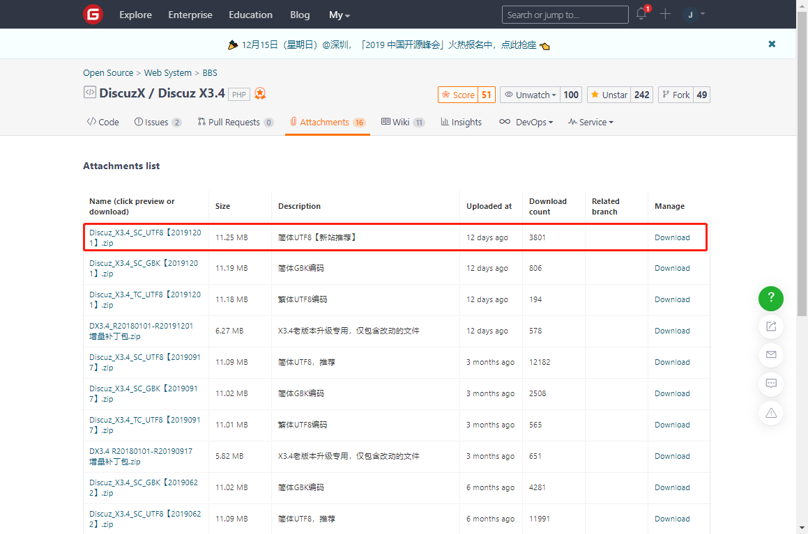

<center><font face="黑体" color="#87cefa" size="5">LAMP_常见php应用部署</font></center>

- **常见 php 应用**

1. `phpMyadmin`
   phpMyadmin 是一个基于 php 语言开发的用于管理 MySQL 数据库的 WEB GUI 程序，其工作依赖
   于 httpd 等的网页服务软件，使用其可以方便快捷的对 mysql 数据库进行管理。

   > [phpMyadmin 官网](https://www.phpmyadmin.net) 

2. `wordpress`
   wordpress 是基于 php 开发的博客平台，广受各领域的博客作者欢迎；可以说是目前最受欢迎的
   博客平台。搭建 wordpress 需要支持 php 和 mysql 的服务器。随着 wordpress 不断发展，其
   不仅可以用来搭建个人博客，很多商业公司也开始使用 wordpress 搭建商业网站，而且可以将
   wordpress 单纯的用作 CMS(Content management system)也是可以的。

   > [wordpress 官网](https://wordpress.org) 

3. `Discuz!论坛`
   Discuz!论坛的全称为`Crossday Discuz! Board`，是国内公司(北京康盛新创科技有限责任公司,
   Comsenz Inc.)开发的一套社区论坛软件，基于 php 语言。自 2001 年 6 月推出至今，其已经有
   18 年的应用经历，使用其搭建的网站超 2000 万。2010 年 8 月 Comsenz 被腾讯收购。

   > [Discuz!官网](https://www.discuz.net/forum.php) 

4. `PowerDNS`
   PowerDNS 是一个基于 php 开发的跨平台的 DNS 服务组件，在 linux 下使用 mysql 来存储 DNS
   解析信息。使用 PowerDNS 来部属 DNS 服务器可以快速的完成各种配置操作，而不用敲一行命令。
   这种便捷性和 phpMyadmin 类似。
   > [PowerDNS 官网](https://www.powerdns.com/) 

# 一.部署 phpMyadmin

- 在 centos7 部署安装 phpMyadmin

大致安装过程

```ruby
1. 配置清华大学的remi镜像源，安装phhp7.2及相关的依赖包
   php72-php:php7.2版本
   php72-php-mbstring:该包含有使得php可以处理多字节字符串(multi-byte string handling)的动态库
   php72-php-mysqlnd:使得php可以和数据库交互的动态库
2. 安装httpd,mariadb-serverm并启动
3. 下载解压
4. 移动到httpd提供服务的根目录
5. 设置mysql的root密码
6. 访问`http://ip/phpMyadmin/`进行安装配置
```

具体过程

```bash
[root@localhost ~]# yum install https://mirrors.tuna.tsinghua.edu.cn/remi/enterprise/remi-release-7.rpm

[root@localhost ~]# yum install php72-php php72-php-mbstring php72-php-mysqlnd mariadb-server
[root@localhost ~]# systemctl start httpd mariadb
[root@localhost ~]# cd /var/www/html
[root@localhost html]# wget https://files.phpmyadmin.net/phpMyAdmin/4.9.2/phpMyAdmin-4.9.2-all-languages.zip
[root@localhost html]# yum install zip unzip -y
[root@localhost html]# unzip phpMyAdmin-4.9.2-all-languages.zip
[root@localhost html]# cd phpMyAdmin-4.9.2-all-languages/
[root@localhost phpMyAdmin-4.9.2-all-languages]# cp config.sample.inc.php  config.inc.php

# 如果mysql 服务器和phpmyadmin不在同一台主机，还需要修改以下设置
[root@localhost html]# vim config.inc.php
$cfg['Servers'][$i]['host'] = 'mysqlserverIP';

# 改个名
[root@localhost html]# mv phpMyAdmin-4.9.2-all-languages /var/www/html/phpMyadmin

# 设置mysql的root密码，phpMyadmin不允许空密码登录
[root@localhost ~]# mysql_secure_installation
```

> 访问`http://ip/phpMyadmin/`开始安装

# 二.部署 wordpress

- centos8 部署安装 wordpress

大致安装过程

```ruby
1. 安装httpd,mariadb-server,和php相关程序
2. 创建wordpress专用的数据库
3. 在mysql创建wordpress账户
4. 授权wordpress用户相应权限
5. 下载wordpress压缩包
6. 解压缩到httpd提供服务的根文件夹
7. 给httpd系统账户访问wordpress文件夹赋予相应权限
8. 浏览器访问`http://ip/wordpress/`安装
```

# 三.部署 Discuz!论坛

- Centos8 使用 RPM 包部署 Discuz!
- Discuz 的源码和安装包都被部署在码云 gitee

  > [Discuz 下载地址](https://gitee.com/3dming/DiscuzL/attach_files)

  > [Discuz 官方论坛](https://www.discuz.net/forum.php)

- 大致的部署步骤

```ruby
1. 安装服务软件和数据库及其它的依赖组件httpd,php,php-xml,php-mysqlnd,php-json,mariadb-server
   php-json:该包提供php对json的扩展，使得php可以处理json数据交换格式
   php-xml:该包提供相应的动态共享库使得php可以通过DOM树处理XML文档
   php-mysqlnd:该包同样有相关的动态共享库使得mysql和php可以交互
2. 创建Discuz数据库和专用账户
3. 下载Discuz压缩包，解压到httpd服务的根目录
4. 浏览器访问http://ip/discuz-folder/install安装
```



```bash
[root@localhost ~]# dnf -y install httpd php php-xml php-mysqlnd php-json mariadb-server
[root@localhost ~]# systemctl start httpd
[root@localhost ~]# systemctl start mariadb
[root@localhost ~]# ss -ntl
State              Recv-Q              Send-Q                            Local Address:Port                            Peer Address:Port
LISTEN             0                   128                                     0.0.0.0:22                                   0.0.0.0:*
LISTEN             0                   128                                        [::]:22                                      [::]:*
LISTEN             0                   80                                            *:3306                                       *:*
LISTEN             0                   128                                           *:80                                         *:*
[root@localhost html]# cd /var/www/html
[root@localhost html]# wget https://gitee.com/3dming/DiscuzL/attach_files/305647/download
[root@localhost html]# unzip Discuz_X3.4_SC_UTF8【20191201】.zip
[root@localhost html]# ls
Discuz_X3.4_SC_UTF8【20191201】.zip  qqqun.png  readme  readme.html  upload  utility
[root@localhost html]# mv Discuz_X3.4_SC_UTF8【20191201】.zip ~/
[root@localhost html]# mv upload forum
[root@localhost html]# ls
forum  index.html  qqqun.png  readme  readme.html  utility
[root@localhost html]# tree -L 2
.
├── forum
│?? ├── admin.php
│?? ├── api
│?? ├── archiver
............
├── qqqun.png
├── readme
............
├── readme.html
└── utility
............

[root@localhost html]# chown -R apache:apache /var/www/html/forum
MariaDB [(none)]> CREATE DATABASE ultrax;
MariaDB [(none)]> SHOW DATABASES;
+--------------------+
| Database           |
+--------------------+
| information_schema |
| mysql              |
| performance_schema |
| ultrax             |
+--------------------+
MariaDB [(none)]> GRANT ALL ON ultrax.* TO ultrax@'localhost' IDENTIFIED BY 'stevenux';
Query OK, 0 rows affected (0.001 sec)
MariaDB [(none)]> FLUSH PRIVILEGES;
Query OK, 0 rows affected (0.000 sec)
MariaDB [(none)]> SELECT host,user,password FROM mysql.user WHERE user='ultrax';
+-----------+--------+-------------------------------------------+
| host      | user   | password                                  |
+-----------+--------+-------------------------------------------+
| localhost | ultrax | *3DCA33F8157E10F1701CA69286608B186AE2F904 |
+-----------+--------+-------------------------------------------+
1 row in set (0.001 sec)
```

- 开始安装
  访问`http://172.20.1.84/forum/`  
  或访问`http://172.20.1.84/forum/install/`

# 四.部署 PowerDNS
