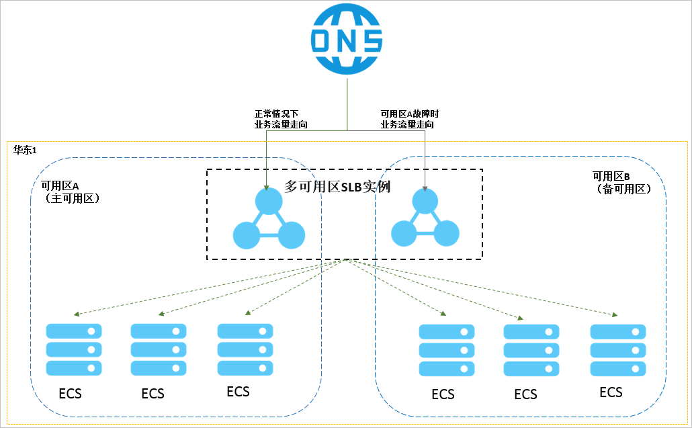
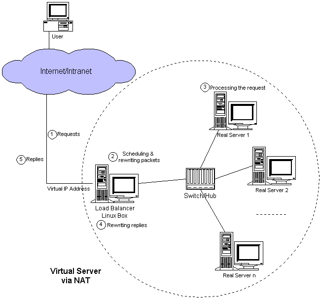

<center><font size=5>LVS</font></center>

# 一.集群和分布式概念

## 1.1 集群

在计算机领域，集群早在 1960 年就出现，随着互联网和计算机相关技术的发展，现在
集群这一技术已经在各大互联网公司普及。

### 1.1.1 集群概念

计算机集群指一组通过计算机网络连接的计算机，它们一起工作，在许多方面，它们可以
被视为一个单一的系统。与网格计算机不同，计算机集群的每个节点都被设置为执行相同
的任务，由特定的软件控制和调度。

#### 1.1.1.1 集群的两个关键特性

集群是一组服务器实体，它们共同提供比单个服务实体更具可伸缩性和可用性的服务平台。
在接受服务的客户端看来，集群类似于单个服务实体，但实际上，集群是由一组服务器组
成的一个集群。与单个服务器相比，集群提供了以下两个关键特性:
**Scalability**:可伸缩性，也就是集群的性能不局限于单个服务器，新的服务器可以
动态地添加到集群中，从而提高集群的性能。
**High availability**: 高可用性，也即是集群使得客户能够通过多台服务器冗余避免
突然失去服务。在集群中，相同的服务可以由多个服务器提供。如果一个服务器不可用，
另一个服务器将接管不可用的服务器。集群提供的将错误从一个服务器恢复到另一个服务器
的功能增强了应用程序的可用性。

#### 1.1.1.2 集群的两个能力

为了获得可伸缩性和高可用性，集群必须具备以下两个能力:

**Load Balancing**:负载均衡，负载均衡可以将任务均匀地分配到集群环境中的计算和
网络资源，使得集群持续健康的对外提供服务。
**Error recovery**:错误恢复能力，集群中的某节点(某个服务器)由于某种原因执行某
任务的过程中出现错误，执行失败，而另一个服务器自动执行相同的任务，并完成服务。
这样就恢复了错误，使得集群可以持续提供服务。

#### 1.1.1.3 实现集群的两个关键技术

实现集群服务需要两种关键技术:

**Cluster address**:集群地址，客服端通过访问集群的地址来获取集群内部各服务器
提供的服务，集群对外是只有一个地址的。负责维护整个集群地址的服务器称为负载均衡
器，在客户端访问集群时，其负责将集群的地址转换为集群内部某个计算机的地址，具体
转换到哪个服务器的地址根据调度算法定。
**Internal communication**: 为了协同工作，实现负载均衡和错误恢复，集群实体间
必须频繁通信，如服务器上的负载均衡器心跳测试信息、服务器之间的任务执行上下文
信息通信等。
使用相同的集群地址，客户机可以访问集群提供的计算服务，集群地址隐藏了每个服务
实体的内部地址，以便客户机所需的计算服务可以分布在各个服务实体之间。内部通信
是集群正常工作的基础，它使集群具有均衡的负载和错误恢复能力。

### 1.1.2 集群分类

集群一般分为三种类型：
: LB：Load Balancing，负载均衡集群
: HA：High Availiablity，高可用集群，避免单点故障 SPOF(single Point Of failure)
: HPC：High-performance computing 高性能集群
[全球 TOP500 计算机](www.top500.org)

对于高可用集群可以用以下参数度量其可用性:
: MTBF:Mean Time Between Failure 平均无故障时间
: MTTR:Mean Time To Restoration(repair)平均恢复前时间
: A=MTBF/(MTBF+MTTR)

> [见此文--MySQL 高可用](http://suosuoli.cn/?p=547#31_MySQL__951)

### 1.1.3 集群设计原则

在设计和实现集群时要考虑的因素有很多，关键的有以下四点
: 可扩展性—集群的横向扩展能力
: 可用性—无故障时间(SLA)
: 性能—访问响应时间
: 容量—单位时间内的最大并发吞吐量(例如避免 C10K 并发问题)

#### 1.1.3.1 实现集群时基础设施考虑

实现集群时，在基础设施上需要考虑硬件、网络、安全、机房等因素

: 提升硬件资源性能—从入口防火墙到后端 web server 均使用更高性能的硬件资源
: 多域名—DNS 轮询 A 记录解析
: 多入口—将 A 记录解析到多个公网 IP 入口
: 多机房—同城+异地容灾
: CDN(Content Delivery Network)—基于 GSLB(Global Server Load Balance)
实现全局负载均衡，如：DNS

#### 1.1.3.2 实现集群时业务层面考虑

实现集群时，在基业务层面需要考虑
: 分层：安全层、负载层、静态层、动态层、(缓存层、存储层)持久化与非持久化
: 分割：基于功能分割大业务为小服务
: 分布式：对于特殊场景的业务，使用分布式计算

## 1.2 分布式

### 1.2.1 分布式系统概念

分布式系统指在许多不同的服务器中部署不同的服务模块，并通过远程调用协作完成特定
任务以提供服务。

一般分布式系统都会部署分布式应用程序和服务，对应用程序和服务进行分层和分段，然后
以分布式方式部署应用程序和服务模块到各个节点。它不仅可以提高并发访问能力，而且可
以减少数据库连接和资源消耗，还可以使不同的应用程序重用公共服务，使业务易于扩展。

### 1.2.1 分类

分布式存储:

- Ceph
- GlusterFS
- FastDFS
- MogileFS

分布式计算

- hadoop
- Spark

分布式常见应用

- 分布式应用-服务按照功能拆分，使用微服务
- 分布式静态资源--静态资源放在不同的存储集群上
- 分布式数据和存储--使用 key-value 缓存系统
- 分布式计算--对特殊业务使用分布式计算，比如 Hadoop 集群

## 1.3 集群与分布式区别

分布式系统处理任务是平行的，集群处理任务是串联的。
例如：包含 100 个子任务的客户请求分别到达 10 台分布式服务系统和 10 台集群服务
系统。假设单个任务单台服务器需要 1 分钟完成。那么分布式服务器系统的每台服务器
会花费 1 分钟完成一个任务，接着完成下一个任务，不考虑任务之间的依赖关系。这样
10 分钟后，就完成了 100 个任务；而在集群系统中，总是有 10 个任务被同时分配到
10 台服务器上处理，接着处理后面 10 个任务，这样在 10 分钟后，也完成了 100 个
任务。注意：在分布式中一般不会同时处理 10 个任务后又同时处理下面的 10 个任务。

**集群**：同一个业务系统，部署在多台服务器上。集群中，每一台服务器实现的功能
没有差别，数据和代码都是一样的
**分布式**：一个业务被拆成多个子业务，或者本身就是不同的业务，部署在多台服务
器上。分布式中，每一台服务器实现的功能是有差别的，数据和代码也是不一样的，分
布式每台服务器功能加起来，才是完整的业务。

一句话：**分布式是通过缩短单个任务的执行时间来提高效率，集群是通过增加单位**
**时间内执行的任务数量来提高效率。**

例如：对于大型网站，访问用户很多，实现一个群集，在前面部署一个负载均衡服务器，
后面几台服务器完成同一业务。如果有用户进行相应业务访问时，负载均衡器根据后端
哪台服务器的负载情况，决定由给哪一台去完成响应，并且一台服务器垮了，其它的服
务器可以顶上来。分布式的每一个节点，都完成不 的业务，如果一个节点垮了，那这个
业务可能就会失败。

## 1.4 负载均衡集群

下面几种硬件可以实现负载均衡集群
: F5 Big-IP
: Citrix Netscaler
: A10 A10

下面几种软件可以实现负载均衡集群
: `lvs`：Linux Virtual Server，阿里四层 SLB (Server Load Balance)使用
: `nginx`：支持七层调度，阿里七层 SLB 使用 Tengine
: `haproxy`：支持七层调度
: `ats`：Apache Traffic Server，yahoo 捐助给 apache
: `perlbal`：Perl 编写
: `pound`

这里的七层和四层指的是网络协议栈的层，比如：nginx 能够调度 http 协议
请求，二 http 为应用层在网络协议栈 ISO 模型的第七层；而 LVS 只能调度
TCP 等请求，TCP 在 ISO 模型的第四层传输层。

负载均衡的会话保持
: session sticky：同一用户调度固定服务器
Source IP：LVS sh 算法（对某一特定服务而言）
Cookie
: session replication：每台服务器拥有全部 session
session multicast cluster
: session server：专门的 session 服务器
Memcached，Redis

## 1.5 HA--高可用集群

高可用的实现方案已报有两种

1. 使用 Virtual Redundant Routing Protocol (VRRP)协议来实现高可用
   实现 vrrp 协议的软件如 keepalived，其配合 LVS 是典型的高可用集群的常用实现

2. 使用 ais 协议，ais 是比较重量级的高可用实现，使用该规范的软件有
   : heartbeat
   : cman+rgmanager(RHCS)
   : coresync_pacemaker

# 二.Linux Virtual Server 介绍

## 2.1 LVS 简介

LVS 是由张文松在 1998 年 5 月启动的自由和开源项目，遵循 GNU 通用公共许
可证(GPL)第 2 版的要求。该项目的任务是使用集群技术为 Linux 构建一个高性
能、高可用的服务器，它提供了良好的可伸缩性、可靠性和可服务性。

LVS 项目的主要工作是开发高级 IP 负载平衡软件(IPVS)、应用程序级负载平衡
软件(KTCPVS)和集群管理组件。

```c
IPVS:在Linux内核中实现的一种高级IP负载平衡软件。IP Virtual Server代码合
已经被合并到版本2.4.x和更新的Linux内核主线。
KTCPVS:在Linux内核中实现应用程序级负载平衡，截至2011年2月仍在开发中。
```

LVS 可用于构建高度可伸缩和高度可用的网络服务，如 web、电子邮件、媒体和
VoIP 服务，并将可伸缩的网络服务集成到大型可靠的电子商务或电子政府应用程
序中。基于 LVS 的解决方案已经部署在世界各地的许多实际应用程序中，
包括维基百科 Wikipedia。维基百科简化版的架构如下：
.svg>)

## 2.2 LVS 工作原理

LVS 组件依赖于 Linux Netfilter 框架，其源代码可以在 Linux 内核源代码的
`net/netfilter/ipvs`子目录中找到。LVS 能够处理 UDP、TCP 等 4 层协议，
通过检查第 7 层数据包，也可以处理 FTP 被动连接。

用于配置 LVS 的用户空间实用程序称为 ipvsadm，它需要超级用户特权才能运行。

> [LVS 官网](http://www.linuxvirtualserver.org/)

LVS 相关术语
`VS`: Virtual Server，负责调度的服务器
`RS`: Real Server，负责真正提供服务

VS 根据请求报文的目标 IP 和目标协议及端口将其调度转发至某 RS，根据调度算法
来挑选 RS。LVS 是内核级功能，工作在 INPUT 链的位置，将发往 INPUT 的流量
进行"处理"。

查看内核对 LVS 的支持

```bash
[root@steve ~]$grep -i -C 10 ipvs /boot/config-3.10.0-1062.4.1.el7.x86_64
CONFIG_NETFILTER_XT_MATCH_CPU=m
CONFIG_NETFILTER_XT_MATCH_DCCP=m
CONFIG_NETFILTER_XT_MATCH_DEVGROUP=m
CONFIG_NETFILTER_XT_MATCH_DSCP=m
CONFIG_NETFILTER_XT_MATCH_ECN=m
CONFIG_NETFILTER_XT_MATCH_ESP=m
CONFIG_NETFILTER_XT_MATCH_HASHLIMIT=m
CONFIG_NETFILTER_XT_MATCH_HELPER=m
CONFIG_NETFILTER_XT_MATCH_HL=m
CONFIG_NETFILTER_XT_MATCH_IPRANGE=m
CONFIG_NETFILTER_XT_MATCH_IPVS=m
CONFIG_NETFILTER_XT_MATCH_LENGTH=m
CONFIG_NETFILTER_XT_MATCH_LIMIT=m
CONFIG_NETFILTER_XT_MATCH_MAC=m
CONFIG_NETFILTER_XT_MATCH_MARK=m
CONFIG_NETFILTER_XT_MATCH_MULTIPORT=m
CONFIG_NETFILTER_XT_MATCH_NFACCT=m
CONFIG_NETFILTER_XT_MATCH_OSF=m
CONFIG_NETFILTER_XT_MATCH_OWNER=m
CONFIG_NETFILTER_XT_MATCH_POLICY=m
CONFIG_NETFILTER_XT_MATCH_PHYSDEV=m
--
CONFIG_IP_SET_HASH_NETNET=m
CONFIG_IP_SET_HASH_NETPORT=m
CONFIG_IP_SET_HASH_NETIFACE=m
CONFIG_IP_SET_LIST_SET=m
CONFIG_IP_VS=m
CONFIG_IP_VS_IPV6=y
# CONFIG_IP_VS_DEBUG is not set
CONFIG_IP_VS_TAB_BITS=12

#
# IPVS transport protocol load balancing support
#
CONFIG_IP_VS_PROTO_TCP=y
CONFIG_IP_VS_PROTO_UDP=y
CONFIG_IP_VS_PROTO_AH_ESP=y
CONFIG_IP_VS_PROTO_ESP=y
CONFIG_IP_VS_PROTO_AH=y
CONFIG_IP_VS_PROTO_SCTP=y

#
# IPVS scheduler
#
CONFIG_IP_VS_RR=m
CONFIG_IP_VS_WRR=m
CONFIG_IP_VS_LC=m
CONFIG_IP_VS_WLC=m
CONFIG_IP_VS_LBLC=m
CONFIG_IP_VS_LBLCR=m
CONFIG_IP_VS_DH=m
CONFIG_IP_VS_SH=m
CONFIG_IP_VS_SED=m
CONFIG_IP_VS_NQ=m

#
# IPVS SH scheduler
#
CONFIG_IP_VS_SH_TAB_BITS=8

#
# IPVS application helper
#
CONFIG_IP_VS_FTP=m
CONFIG_IP_VS_NFCT=y
CONFIG_IP_VS_PE_SIP=m

#
# IP: Netfilter Configuration
#
CONFIG_NF_DEFRAG_IPV4=m
CONFIG_NF_CONNTRACK_IPV4=m
```

## 2.3 LVS 典型集群体系架构


<center><font size=3>LVS-DR模型</font></center>

## 2.4 LVS 功能及组织架构

### 2.4.1 LVS 胜任高访问负载的业务

如果业务应用访问量很高，可以通过配置监听规则将流量分发到不同的云服务器 ECS
(Elastic Compute Service 弹性计算服务)实例上。此外，可以使用会话保持功能
将同一客户端的请求转发到同一台后端 ECS。

### 2.4.2 LVS 弹性横向扩展场景

可以根据业务发展的需要，随时添加和移除 ECS 实例来扩展应用系统的服务能力，
适用于各种 Web 服务器和 App 服务器。

### 2.4.3 LVS 自动调度，消除单点故障 SPOF

可以在负载均衡实例下添加多台 ECS 实例。当其中一部分 ECS 实例发生故障后，
负载均衡会自动屏蔽故障的 ECS 实例，将请求分发给正常运行的 ECS 实例，保
证应用系统仍能正常工作

### 2.4.4 LVS 同城容灾场景

为了提供更加稳定可靠的负载均衡服务，阿里云的负载均衡实现在各地域部署了
多可用区以实现同地域容灾。当主可用区出现机房故障或不可用时，负载均衡仍
然有能力在非常短的时间内（如：大约 30s 中断）切换到另外一个备可用区恢复
服务能力；当主可用区恢复时，负载均衡同样会自动切换到主可用区提供服务。

使用负载均衡时，可以将负载均衡实例部署在支持多可用区的地域以实现同城容灾。
此外，还需要结合自身的应用需要，综合考虑后端服务器的部署。如果每个可用区
均至少添加了一台 ECS 实例，那么此种部署模式下的负载均衡服务的效率是最高的。

如下图所示，在负载均衡实例下绑定不同可用区的 ECS 实例。正常情况下，用户访
问流量将同时转至发主、备可用区内的 ECS 实例；当可用区 A 发生故障时，用户
访问流量将只转发至备可用区内的 ECS 实例。此种部署既可以避免因为单个可用区
的故障而导致对外服务的不可用，也可以通过不同产品间可用区的选择来降低延迟。



如果在负载均衡实例的主可用区(可用区 A)下绑定多台 ECS 实例，而在备可用区
(可用区 B)没有任何 ECS 实例。当主可用区发生故障时会造成业务中断，因为备
可用区没有 ECS 实例来接收请求。这样的部署方式很明显是以牺牲高可用性为代
价来获取低延时。

### 2.4.5 LVS 跨地域容灾

可以在不同地域下部署负载均衡实例，并分别挂载相应地域内不同可用区的 ECS。
上层利用云解析做智能 DNS，将域名解析到不同地域的负载均衡实例服务地址下，
可实现全局负载均衡。当某个地域出现不可用时，暂停对应解析即可实现所有
用户访问不受影响。


## 3.5 LVS 应用场景

### 3.5.1 音视频大流量场景

对象存储(Object Storage Service,简称 OSS),是阿里云对外提供的海量、安全和
高可靠的云存储服务


音视频海量流量自动分发
: 音视频应用中由于用户与主播之间需要实时大量的互动，因此，用户的流量非常大，
而直播业务的波峰波谷效应明显，这对整个系统的弹性、稳定性和可用性带来了巨大
的挑战

提高横向扩展能力
: 添加或删减负载均衡后端的服务器实时生效，可根据业务流量大小实时增减

抵御海量流量
: 业务发展快，访问流量巨大，负载均衡可对多台云服务器进行流量分发服务

提升应用可用性
: 负载均衡提供后端服务器的健康检查，实时屏蔽异常服务器，提升系统可用性

### 3.5.2 网页游戏动静分离场景


动静请求分离，快速稳定交付
: 游戏业务有很多图片等静态资源需要加载，通过 CDN 实现全球用户访问静态资源的
加速；当用户在游 中有互动时，产生的访问流量非常大，此时为了保证互动实时性，
需要使用负载均衡进行流量分发

动态请求流量分发
: 动态请求量大，采用多台云服务器计算处理，并利用负载均衡服务随时进行流量分发

静态请求快速加载
: 静态内容选择对象存储，接入 CDN 服务，进一步优化内容分发链路，让内容即刻加载

### 3.5.3 多层次容灾架构场景


跨地域跨可用区的容灾方案
: 用户业务遍布各地域，使用云解析 DNS 将不同地域用户智能解析访问到相应的
业务系统内，使用负载均衡进行海量的访问流量分发，还可构建地域级、可用区级
的多层容灾架构

智能解析
: 智能判断提供最佳的访问解析地址，使访问用户获得最快捷、最流畅的体验

流量分发
: 业务发展快，访问流量巨大，负载均衡可对多台云服务器进行流量分发服务

多层次容灾
: 云解析提供跨地域的高可用，负载均衡可实现可用区级的高可用

### 3.5.4 海量访问流量分发场景


## 2.6 LVS 相关术语

`VS`：Virtual Server，Director Server(DS), Dispatcher(调度器)，Load Balancer
`RS`：Real Server(lvs), upstream server(nginx), backend server(haproxy)
`CIP`：Client IP
`VIP`：Virtual serve IP VS 外网的 IP
`DIP`：Director IP VS 内网的 IP
`RIP`：Real server IP
访问流程：CIP <--> VIP == DIP <--> RIP

# 三.LVS 工作模式

## 3.1 LVS 集群的工作模式

LVS 有四种工作模式

: lvs-nat：修改请求报文的目标 IP,多目标 IP 的 DNAT
: lvs-dr：操纵封装新的 MAC 地址
: lvs-tun：在原请求 IP 报文之外新加一个 IP 首部
: lvs-fullnat：修改请求报文的源和目标 IP

### 3.1.1 LVS 的 NAT 工作模式



vs-nat：本质是多目标 IP 的 DNAT，通过将请求报文中的目标地址和目标端口修改为
某挑出的 RS 的 RIP 和 PORT 实现转发，特点：
（1）RIP 和 DIP 应在同一个 IP 网络，且应使用私网地址；RS 的网关要指向 DIP
（2）请求报文和响应报文都必须经由 Director 转发，Director 易于成为系统瓶颈
（3）支持端口映射，可修改请求报文的目标 PORT
（4）VS 必须是 Linux 系统，RS 可以是任意 OS 系统


### 3.1.2 LVS 的 DR 模式


LVS-DR：Direct Routing，直接路由，LVS 默认模式,应用最广泛,通过为请求报文
重新封装一个 MAC 首部进行转发，源 MAC 是 DIP 所在的接口的 MAC，目标 MAC 是某挑选
出的 RS 的 RIP 所在接口的 MAC 地址；源 IP/PORT，以及目标 IP/PORT 均保持不变


DR 模式的特点：

1. Director 和各 RS 都配置有 VIP
2. 确保前端路由器将目标 IP 为 VIP 的请求报文发往 Director
   需要在前端网关做静态绑定 VIP 和 Director 的 MAC 地址
   在 RS 上使用 arptables 工具
   ```bash
   arptables -A IN -d $VIP -j DROP
   arptables -A OUT -s $VIP -j mangle --mangle-ip-s $RIP
   ```
   在 RS 上修改内核参数以限制 arp 通告及应答级别[^1]
   ```bash
   /proc/sys/net/ipv4/conf/all/arp_ignore
   /proc/sys/net/ipv4/conf/all/arp_announce
   ```
3. RS 的 RIP 可以使用私网地址，也可以是公网地址；RIP 与 DIP 在同一 IP
   网络；RIP 的网关不能指向 DIP，以确保响应报文不会经由 Director
4. RS 和 Director 要在同一个物理网络
5. 请求报文要经由 Director，但响应报文不经由 Director，而由 RS 直接发往 Client
6. 不支持端口映射（端口不能修败）
7. RS 可使用大多数 OS 系统

### 3.1.3 LVS 的 TUN 模式

转发方式：不修改请求报文的 IP 首部（源 IP 为 CIP，目标 IP 为 VIP），而
在原 IP 报文之外再封装一个 IP 首部（源 IP 是 DIP，目标 IP 是 RIP），将
报文发往挑选出的目标 RS；RS 直接响应给客户端(源 IP 是 VIP，目标 IP 是 CIP)


TUN 模式特点：

1. DIP, VIP, RIP 可以是公网地址
2. RS 的网关一般不能指向 DIP
3. 请求报文要经由 Director，但响应不经由 Director
4. 不支持端口映射
5. RS 的 OS 须支持隧道功能

### 3.1.4 LVS 的 FULLNAT 模式


通过同时修改请求报文的源 IP 地址和目标 IP 地址进行转发
: CIP --> DIP
: VIP --> RIP

fullnat 模式特点：

1. VIP 是公网地址，RIP 和 DIP 是私网地址，且通常不在同一 IP 网络；因此，
   RIP 的网关一般不会指向 DIP
2. RS 收到的请求报文源地址是 DIP，因此，只需响应给 DIP；但 Director 还
   要将其发往 Client
3. 请求和响应报文都经由 Director
4. 支持端口映射

注意：此类型 kernel 默认不支持

### 3.1.5 LVS 的工作模式总结和比较

| 服务器参数\LVS 模式 | VS/NAT        | VS/TUN     | VS/DR          |
| ------------------- | ------------- | ---------- | -------------- |
| Server              | any           | Tunneling  | Non-arp device |
| server network      | private       | LAN/WAN    | LAN            |
| server number       | low (10~20)   | High (100) | High (100)     |
| server gateway      | load balancer | own router | Own router     |

lvs-nat 与 lvs-fullnat：
: 请求和响应报文都经由 Director
: lvs-nat：RIP 的网关要指向 DIP
: lvs-fullnat：RIP 和 DIP 未必在同一 IP 网络，但要能通信

lvs-dr 与 lvs-tun：
: 请求报文要经由 Director，但响应报文由 RS 直接发往 Client
: lvs-dr：通过封装新的 MAC 首部实现，通过 MAC 网络转发
: lvs-tun：通过在原 IP 报文外封装新 IP 头实现转发，支持远距离通信

## 3.2 LVS 调度算法

LVS 调度算法可以根据其调度是是否考虑各 RS 当前的负载状态分为**静态调度方法**
和**动态调度方法**。由`ipvs scheduler`调度。内核 4.15 版本以前总共有十种调度
算法，各调度算法和源码的对应关系如下：

| 调度算法                                         | 源码文件        |
| ------------------------------------------------ | --------------- |
| Round-robin                                      | (ip_vs_rr.c)    |
| Weighted round-robin                             | (ip_vs_wrr.c)   |
| Least-connection                                 | (ip_vs_lc.c)    |
| Weighted least-connection                        | (ip_vs_wlc.c)   |
| Locality-based least-connection                  | (ip_vs_lblc.c)  |
| Locality-based least-connection with replication | (ip_vs_lblcr.c) |
| Destination hashing                              | (ip_vs_dh.c)    |
| Source hashing                                   | (ip_vs_sh.c)    |
| Shortest expected delay                          | (ip_vs_sed.c)   |
| Never queue                                      | (ip_vs_nq.c)    |

- ipvs 源码

```sh
root@ubuntu1904:/data#ll linux-5.4.6/net/netfilter/ipvs/
total 588
-rw-rw-r-- 1 root root  13438 Dec 21 18:05 ip_vs_app.c
-rw-rw-r-- 1 root root  37075 Dec 21 18:05 ip_vs_conn.c
-rw-rw-r-- 1 root root  67225 Dec 21 18:05 ip_vs_core.c
-rw-rw-r-- 1 root root 107931 Dec 21 18:05 ip_vs_ctl.c
-rw-rw-r-- 1 root root   6328 Dec 21 18:05 ip_vs_dh.c
-rw-rw-r-- 1 root root   5535 Dec 21 18:05 ip_vs_est.c
-rw-rw-r-- 1 root root   1876 Dec 21 18:05 ip_vs_fo.c
-rw-rw-r-- 1 root root  15949 Dec 21 18:05 ip_vs_ftp.c
-rw-rw-r-- 1 root root  15908 Dec 21 18:05 ip_vs_lblc.c
-rw-rw-r-- 1 root root  20389 Dec 21 18:05 ip_vs_lblcr.c
-rw-rw-r-- 1 root root   2232 Dec 21 18:05 ip_vs_lc.c
-rw-rw-r-- 1 root root  13657 Dec 21 18:05 ip_vs_mh.c
-rw-rw-r-- 1 root root   9010 Dec 21 18:05 ip_vs_nfct.c
-rw-rw-r-- 1 root root   3359 Dec 21 18:05 ip_vs_nq.c
-rw-rw-r-- 1 root root   2132 Dec 21 18:05 ip_vs_ovf.c
-rw-rw-r-- 1 root root   2501 Dec 21 18:05 ip_vs_pe.c
-rw-rw-r-- 1 root root   4877 Dec 21 18:05 ip_vs_pe_sip.c
-rw-rw-r-- 1 root root   3832 Dec 21 18:05 ip_vs_proto_ah_esp.c
-rw-rw-r-- 1 root root   8570 Dec 21 18:05 ip_vs_proto.c
-rw-rw-r-- 1 root root  18326 Dec 21 18:05 ip_vs_proto_sctp.c
-rw-rw-r-- 1 root root  20142 Dec 21 18:05 ip_vs_proto_tcp.c
-rw-rw-r-- 1 root root  12350 Dec 21 18:05 ip_vs_proto_udp.c
-rw-rw-r-- 1 root root   3310 Dec 21 18:05 ip_vs_rr.c
-rw-rw-r-- 1 root root   5727 Dec 21 18:05 ip_vs_sched.c
-rw-rw-r-- 1 root root   3758 Dec 21 18:05 ip_vs_sed.c
-rw-rw-r-- 1 root root   9445 Dec 21 18:05 ip_vs_sh.c
-rw-rw-r-- 1 root root  55183 Dec 21 18:05 ip_vs_sync.c
-rw-rw-r-- 1 root root   3044 Dec 21 18:05 ip_vs_wlc.c
-rw-rw-r-- 1 root root   6950 Dec 21 18:05 ip_vs_wrr.c
-rw-rw-r-- 1 root root  43486 Dec 21 18:05 ip_vs_xmit.c
-rw-rw-r-- 1 root root  13157 Dec 21 18:05 Kconfig
-rw-rw-r-- 1 root root   1428 Dec 21 18:05 Makefile
```

> [10 种算法的官方说明](http://www.linuxvirtualserver.org/docs/scheduling.html)

### 3.2.1 静态调度算法

#### 3.2.1.1 Round-Robin Scheduling

循环调度算法：该调度算法是 LVS 最简单的调度策略，其将每个传入的请求发送到
其列表的下一个服务器。例如：在三个服务器的集群中(A、B 和 C 服务器)，请求 1
将被 调度到服务器 A，请求 2 将被调度到服务器 B，请求 3 将被 C 服务器处理，
请求 4 又被调度到服务器 A。从而让集群中的服务器循环的提供服务，该调度策略
平等对待所有服务器，其不考虑到来的连接或请求数量和服务器的响应时间(或是负
载情况)，其性能高于传统的 DNS 轮询。

#### 3.2.1.2 Weighted Round-Robin Scheduling

加权轮询调度算法：该调度策略旨在处理不同的性能的服务器在接收请求和处理请求
时的权重呵呵优先顺序。在调度期间，每个服务器的性能有差异，各自会被分配不同
的权重值，一个表示处理能力的整数值。权重较大的服务器比权重小的服务器优先
处理新连接，权重较大的服务器也比权重较小的服务器获得更多的连接，权重相同
的服务器获得相同的连接数。例如：RS 服务器分别为 A、B 和 C，它们分别有权重
4、3 和 2，那么一个比较理想的调度序列会是 AABABCABC，可以看到在三次轮询过
程中，不同权重的 RS 被分配了不同的连接数，但是整个过程中各自总的处理连接比
例接近 4:3:2(A 处理了 4 次，B 处理了 3 次，C 处理了 2 次)。

在加权轮询调度的实现中，在管理员修改 VS 的服务器调度策略后，会根据具体的配
置权重来生成调度序列。基于该序列以轮询调度方式将不同的网络连接定向到后端不
同的 RS 服务器。

当后端 RS 服务器的处理性能不一时，此算法是比单纯的轮询调度算法优异的。但是，
如果有不间断的高负载的请求到来时，可能造成各服务器的动态负载严重不均衡。
也就是说，可能会有很大部分的高负载请求都被调度到相同的 RS 上。此时，该 RS
的复制将会很高。

而实际上，轮询是加权轮询策略的特例，即是加权轮询的权重值都为 1 的情况。

#### 3.2.1.3 Destination Hashing Scheduling

目标地址哈希调度：该调度策略是根据目标 IP 地址来查找静态分配的哈希表，将网
络连接分配给相应的服务器。第一次轮询调度至 RS，后续将发往同一个目标地址的
请求始终转发至第一次挑中的 RS。该调度策略的典型使用场景是正向代理缓存场景
中的负载均衡，如：宽带运营商

#### 3.2.1.4 Source Hashing Scheduling

源地址哈希调度算法：该调度策略查找由源 IP 地址静态分配的哈希表，将网络连接
分配给服务器。其将来自于同一个 IP 地址的请求始终发往第一次挑中的 RS，从而实
现会话绑定。

### 3.2.2 动态调度算法

#### 3.2.2.1 Least-Connection Scheduling

最少连接调度算法：该调度策略将网络连接调度给建立连接数量最少的 RS 服务器。
该调度算法会动态的记录各服务器的活动连接数。如果后端的一群 RS 服务器的处理
性能相近，那么最少连接调度策略有助于在请求的负载有大幅变化时平滑分配负载。
VS 将把请求定向到有最少的活动连接的 RS。
乍一看，该调度策略应该可以在服务器的处理性能各不相同的情况下表现良好，因为
处理性能高的服务器会接到更多的请求并处理。然而由于 TCP 协议的`TIME_WAIT`
状态导致了其表现并不好。TCP 定义的`TIME_WAIT`状态为 2 分钟，在这两分钟内
某个繁忙的站点可能已经收到了好几千个请求。例如：RS-A 的处理性能是 RS-B 的
两倍，RS-A 可能已经按照正常的速度完成了这些请求并将它们保持在了`TIME_WAIT`
状态(也就是在 2 分钟内完成了分配的请求)，而 RS-B 正挣扎着完成分配到自己的
好几千的请求，在这种情况下就没法均衡负载了。

#### 3.2.2.1 Weighted Least-Connection Scheduling

加权的最少连接调度算法：该调度策略允许为每个 RS 服务器分配一个性能权重值。
具有较高权重值的服务器在任何时候都将接收到较大百分比的活动连接。VS 管理员
可以给每个 RS 服务器分配一个权重值，网络连接会被调度到每个 RS 服务器并且
每个服务器的当前活动连接数的百分比与其权重成比例。

加权的最少连接调度算法相比最少连接算法需要额外的除法来区分不同比例。为了
在服务器处理能力接近相同的情况下最小化调度工作的开销，才有了非加权和加权
的最少连接算法。

#### 3.2.2.1 Locality-Based Least-Connection Scheduling

基于位置的最少连接调度算法：该调度策略专用于目的 IP 的负载均衡。一般被用于
缓存集群。该算法通常会将到某个 IP 地址的数据包定向到负责处理其的服务器，前
提是该服务器是活动的并且负载不高。如果该服务过载(活动连接数大于其权重)并且
有一个服务器目前只有一半的负载，那就会将加权的最少连接服务器(一般负载的服
务器)分配给该 IP。

#### 3.2.2.1 Locality-Based Least-Connection with Replication Scheduling

基于位置的带复制的最少连接调度算法：该调度策略也用于目的 IP 的负载均衡。一般
用于缓存集群。在以下方面其和 LBLC 调度策略不同：调度服务器 LVS 会维护某个目
的 IP 到可能为其提供服务的服务器节点的映射。发往目标 IP 的请求将被调度到该目
标 IP 对应的服务器节点集中拥有最少连接的节点。如果该服务器集的节点均过载，那
么 LVS 会在整个集群中挑选一个最少连接的节点加入到这个服务器集(可能为该目标
IP 服务的节点集合)。

#### 3.2.2.1 Shortest Expected Delay Scheduling

最短期望时延调度算法：该算法将网络连接调度分配给预期最小时延的服务器。发送到
集群中的第 i 个节点最小时延可表示为：(Ci + 1)/Ui。Ci 是第 i 个服务器的连接数，
Ui 是第 i 个服务器的权重。

#### 3.2.2.1 Never Queue Scheduling

不排队算法： 该调度策略在有空闲的服务器时将请求调度到该空闲服务器。如果没有空
闲服务器，请求将被调度到最少期望时延的节点(SED)。

### 3.2.3 内核版本 4.15 版本后新增调度算法：FO 和 OVF

FO(Weighted Fail Over)调度算法，在此 FO 算法中，会遍历虚拟服务所关联的真实服务
器链表，找到还未过载(未设置 IP_VS_DEST_F_OVERLOAD 标志)的且权重最高的真实服务器，
进行调度
OVF(Overflow-connection)调度算法，基于真实服务器的活动连接数量和权重值实现。
将新连接调度到权重值最高的真实服务器，直到其活动连接数量超过权重值位置，之后调
度到下一个权重值最高的真实服务器,在此 OVF 算法中，遍历虚拟服务相关联的真实服务器
链表，找到权重值最高的可用真实服务器。一个可用的真实服务器需要同时满足以下条件：

- 未过载（未设置 IP_VS_DEST_F_OVERLOAD 标志）
- 真实服务器当前的活动连接数量小于其权重值
- 其权重值不为零

# 3.3 LVS 调度规则管理

## 3.3.1 管理规则的程序包

管理调度规则和调度策略选择的用户空间工具为`ipvsadm`，相关的工具如下

: Unit File: /usr/lib/systemd/system/ipvsadm.service
: 主程序: /usr/sbin/ipvsadm
: 规则保存工具: /usr/sbin/ipvsadm-save
: 规则重载工具: /usr/sbin/ipvsadm-restore
: 配置文件: /etc/sysconfig/ipvsadm-config

## 3.3.2 ipvsadm 命令使用

ipvsadm 核心功能

- 集群服务管理：增、删、改
- 集群服务的 RS 管理：增、删、改
- 查看规则

ipvsadm 工具用法

```bash
# 管理集群服务
ipvsadm -A|E -t|u|f service-address [-s scheduler] [-p [timeout]] [-M netmask]
[--pe persistence_engine] [-b sched-flags]
ipvsadm -D -t|u|f service-address # 删除
ipvsadm –C # 清空
ipvsadm –R # 重载
ipvsadm -S [-n]  # 保存
# 管理集群中的RS
ipvsadm -a|e -t|u|f service-address -r server-address [options]
ipvsadm -d -t|u|f service-address -r server-address
ipvsadm -L|l [options]
ipvsadm -Z [-t|u|f service-address]
```

管理集群服务：增、改、删

1. 增、修改
   `ipvsadm -A|E -t|u|f service-address [-s scheduler] [-p [timeout]]`
2. 删除
   `ipvsadm -D -t|u|f service-address`
   service-address：

- -t|u|f：
  - -t: TCP 协议的端口，VIP:TCP_PORT
  - -u: UDP 协议的端口，VIP:UDP_PORT
  - -f：firewall MARK，标记，一个数字
  - [-s scheduler]：指定集群的调度算法，默认为 WLC

管理集群上的 RS：增、改、删

1. 增、改：
   `ipvsadm -a|e -t|u|f service-address -r server-address [-g|i|m] [-w weight]`
2. 删除
   `ipvsadm -d -t|u|f service-address -r server-address`

server-address：

- rip[:port] 如省略 port，不作端口映射
- 选项：
  - lvs 类型：
    -g: gateway, dr 类型，默认
    -i: ipip, tun 类型
    -m: masquerade, nat 类型  
     -w weight：权重

清空定义的所有内容
`ipvsadm -C`
清空计数器
`ipvsadm -Z [-t|u|f service-address]`
查看
`ipvsadm -L|l [options]`

- --numeric, -n：以数字形式输出地址和端口号
- --exact：扩展信息，精确值
- --connection，-c：当前 IPVS 连接输出
- --stats：统计信息
- --rate ：输出速率信息

ipvs 规则
`/proc/net/ip_vs`

ipvs 连接
`/proc/net/ip_vs_conn`

保存规则：建议保存至/etc/sysconfig/ipvsadm

```bash
ipvsadm-save > /PATH/TO/IPVSADM_FILE
ipvsadm -S > /PATH/TO/IPVSADM_FILE
systemctl stop ipvsadm.service
```

重新载入

```bash
ipvsadm-restore < /PATH/FROM/IPVSADM_FILE
systemctl restart ipvsadm.service
```

## 3.4 防火墙标记概念

WM：FireWall Mark
MARK target 用于给特定的报文打标记
其中：value 可为 0xffff 格式，表示十六进制数字
借助于防火墙标记来分类报文，而后基于标记定义集群服务；可将多个不同的应用使用同
一个集群服务进行调度
实现方法：

1. 在 Director 主机打标记：
   `iptables -t mangle -A PREROUTING -d $vip -p $proto -m multiport --dports $port1,$port2,… -j MARK --set-mark NUMBER`
2. 在 Director 主机基于标记定义集群服务：
   `ipvsadm -A -f NUMBER [options]`

例如：

```bash
[root@lvs ~]#ipvsadm -A -f 10
[root@lvs ~]#ipvsadm -a -f 10  -r  192.168.39.17 -g
[root@lvs ~]#ipvsadm -a -f 10  -r  192.168.39.7 -g
[root@lvs ~]#ipvsadm -Ln
IP Virtual Server version 1.2.1 (size=4096)
Prot LocalAddress:Port Scheduler Flags
  -> RemoteAddress:Port           Forward Weight ActiveConn InActConn
FWM  10 wlc
  -> 192.168.39.7:0               Route   1      0          0        
  -> 192.168.39.17:0              Route   1      0          0
```

## 3.5 LVS 持久连接

session 绑定：对共享同一组 RS 的多个集群服务，需要统一进行绑定，lvs 的 SH
算法无法实现持久连接( lvs persistence )
模板：实现无论使用任何调度算法，在一段时间内(默认 360s )，能够实现将来自同
一个地址的请求始终发往同一个 RS
`ipvsadm -A|E -t|u|f service-address [-s scheduler] [-p [timeout]]`

持久连接实现方式：
: 每端口持久（PPC）：每个端口定义为一个集群服务，每集群服务单独调度
: 每防火墙标记持久（PFWMC）：基于防火墙标记定义集群服务；可实现将多个端口
上的应用统一调度，即所谓的 port Affinity
: 每客户端持久（PCC）：基于 0 端口（表示所有服务）定义集群服务，即将客户
端对所有应用的请求都调度至后端主机，必须定义为持久模式

例如

```bash
[root@lvs ~]#ipvsadm -E -f 10 -p
[root@lvs ~]#ipvsadm -Ln
IP Virtual Server version 1.2.1 (size=4096)
Prot LocalAddress:Port Scheduler Flags
  -> RemoteAddress:Port           Forward Weight ActiveConn InActConn
FWM  10 wlc persistent 360
  -> 192.168.39.7:0               Route   1      0          15        
  -> 192.168.39.17:0              Route   1      0          7        
[root@lvs ~]#ipvsadm -E -f 10 -p 3600
[root@lvs ~]#ipvsadm -Ln
IP Virtual Server version 1.2.1 (size=4096)
Prot LocalAddress:Port Scheduler Flags
  -> RemoteAddress:Port           Forward Weight ActiveConn InActConn
FWM  10 wlc persistent 3600
  -> 192.168.39.7:0               Route   1      0          79        
  -> 192.168.39.17:0              Route   1      0          7
```

# 四.LVS 案例

## 4.1 LVS----NAT 模式

实验准备
: centos7.7 系统，VMware 15 pro
: DIRECTOR 即 LVS 使用双网卡，eth0 为桥接网卡，ip：172.20.2.43/16
eth1 为仅主机模式，ip：192.168.10.200/24
: WEB 服务器即对外提供服务的 RS 服务器使用仅主机模式
: WEB 服务器的网关指向 LVS 仅主机地址：192.168.10.200

各主机 IP
| 主机 | IP |
| ------ | ---------------------- |
| Client | eth0:172.20.2.37/16 |
| LVS | eth0:172.20.2.43/16 |
| | eth1:192.168.10.200/24 |
| RS-A | eth0:192.168.10.201/24 |
| RS-B | eth0:192.168.10.202/24 |

大致结构如下，本次实验略去中间的路由器和防火墙，客户端和 LVS 在同一网段


操作过程

```bash
# 1. 在LVS上
~$ vim /etc/sysctl.conf
net.ipv4.ip_forward = 1
...
~$ sysctl -p
# 增加集群调度规则
~$ ipvsadm -A -t 172.20.2.43:80 -s rr
# 增加被调度的RS，-m表示使用NAT模式
~$ ipvsadm -a -t 172.20.2.43:80 -r 192.168.10.201 -m
~$ ipvsadm -a -t 172.20.2.43:80 -r 192.168.10.202 -m

# 2.在RS-A和RS-B上
~$ yum install httpd -y
~$ echo "This is RS-A." > /var/www/html/index.html
~$ systemctl start httpd

# 3.在客户端访问测试
~$ while : ; do curl -connect-timeout 3 172.20.2.43 ; sleep 1 ; done
```

## 4.2 LVS----DR 模式

实验准备
: 修改各 RS 内核参数，限制 arp 响应和通告级别
: DIRECTOR 服务器使用双网卡，均为桥接，一个为 VIP，一个为 DIP
: WEB 服务器使用和 DIP 相同的网段和 DIRECTOR 连接
: 在每个 WEB 服务器配置 VIP
: 每个 WEB 服务器可以访问外网

限制响应级别：arp_ignore

- 0：默认值，表示可使用本地任意接口上配置的任意地址进行响应
- 1：仅在请求的目标 IP 配置在本地主机的接收到请求报文的接口上时，才给予响应

限制通告级别：arp_announce

- 0：默认值，把本机所有接口的所有信息向每个接口的网络进行通告
- 1：尽量避免将接口信息向非直接连接网络进行通告
- 2：必须避免将接口信息向非本网络进行通告

各主机 IP

| 主机   | IP                     |
| ------ | ---------------------- |
| Client | eth0:172.20.2.37/16    |
| Router | eth0:172.20.2.43/16    |
|        | eth1:192.168.10.200/24 |
| LVS    | eth0:192.168.10.100/24 |
|        | lo:1 192.168.10.101/32 |
| RS-A   | eth0:192.168.10.201/24 |
|        | lo:1 192.168.10.101/32 |
| RS-B   | eth0:192.168.10.202/24 |
|        | lo:1 192.168.10.101/32 |

大致结构如下，客户端和 LVS 在不同网段


配置过程

```bash
# 1. 修改RS-A和RS-B内核参数
# RS-A
~$ echo 1 > /proc/sys/net/ipv4/all/arp_ignore
~$ echo 1 > /proc/sys/net/ipv4/lo/arp_ignore
~$ echo 2 > /proc/sys/net/ipv4/all/arp_announce
~$ echo 2 > /proc/sys/net/ipv4/lo/arp_announce

# RS-B
~$ echo 1 > /proc/sys/net/ipv4/all/arp_ignore
~$ echo 1 > /proc/sys/net/ipv4/lo/arp_ignore
~$ echo 2 > /proc/sys/net/ipv4/all/arp_announce
~$ echo 2 > /proc/sys/net/ipv4/lo/arp_announce

# 2. 将client:172.20.2.37的网关指向路由器eth0口
~$ route add -net 0 gw 172.10.2.43

# 3. 将RS-A:192.168.10.201和RS-B:192.168.10.202的网关指向路由器eth1口
# RS-A
~$ route add -net 0 gw 192.168.10.200
# RS-B
~$ route add -net 0 gw 192.168.10.200

# 4. 在LVS和RS的本地环回网卡添加VIP
# LVS
~$ ifconfig lo:1 192.168.10.101/32
# RS-A 和 RS-B
~$ ifconfig lo:1 192.168.10.101/32

# 5. 在LVS: 192.168.10.100上添加调度规则和被调度主机
~$ ipvsadm -A -t 192.168.10.101:80 -r wlc
~$ ipvsadm -a -t 192.168.10.101:80 -r 192.168.10.201 -g
~$ ipvsadm -a -t 192.168.10.101:80 -r 192.168.10.202 -g

# 6. 在客户端172.20.2.37测试
~$ while : ; do curl --connect-timeout 3 192.168.10.101 ; sleep 2 ;done
```

## 4.3 LVS----DR 多网段模式

- RS 配置脚本

```bash
#!/bin/bash
vip=10.0.0.100
mask='255.255.255.255'
dev=lo:1
case $1 in
start)
     echo 1 > /proc/sys/net/ipv4/conf/all/arp_ignore
     echo 1 > /proc/sys/net/ipv4/conf/lo/arp_ignore
     echo 2 > /proc/sys/net/ipv4/conf/all/arp_announce
     echo 2 > /proc/sys/net/ipv4/conf/lo/arp_announce
     ifconfig $dev $vip netmask $You can't use 'macro parameter character #' in
math modemask #broadcast $vip up
     #route add -host $vip dev $dev
     ;;
stop)
     ifconfig $dev down
     echo 0 > /proc/sys/net/ipv4/conf/all/arp_ignore
     echo 0 > /proc/sys/net/ipv4/conf/lo/arp_ignore
     echo 0 > /proc/sys/net/ipv4/conf/all/arp_announce
     echo 0 > /proc/sys/net/ipv4/conf/lo/arp_announce
     ;;
*)
     echo "Usage: $(basename $0) start|stop"
     exit 1
     ;;
esac
```

- VS 配置脚本

```bash
#!/bin/bash
vip='10.0.0.100'
iface='lo:1'
mask='255.255.255.255'
port='80'
rs1='192.168.8.101'
rs2='192.168.8.102'
scheduler='wrr'
type='-g'
case $1 in
start)
    ifconfig $iface $vip netmask $mask #broadcast $vip up
    iptables -F
    ipvsadm -A -t ${vip}:${port} -s $scheduler
    ipvsadm -a -t ${vip}:${port} -r ${rs1} $type -w 1
    ipvsadm -a -t ${vip}:${port} -r ${rs2} $type -w 1
    ;;
stop)
    ipvsadm -C
    ifconfig $iface down
    ;;
*)
    echo "Usage $(basename $0) start|stop“
    exit 1
esac
```

# 五.LVS 借助三方软件实现高可用

如果 LVS 服务器宕机时，整个集群的服务将终止
: 当整个集群的调度由一台 LVS 主机负负责时，Director 不可用时，整个集群的服务
将会终止，这是常见的 SPOF 单点故障，所以在生产中不会只用一台 LVS，而是使用其它
技术实现 LVS 调度器的高可用，比如：keepalived heartbeat 或者 corosync

当某 RS 宕机时，Director 还会往其调度请求
: 如果只使用 LVS 进行调度，当某 RS 宕机时，Director 还会往其调度请求。这回造成部分请
求未被处理，还会使得 LVS 付出额外无用的开销。
: 解决方案：通过某些方法使得 Director 可以对各个 RS 进行健康状态监测，失败时自动禁用，
恢复后自动添加到集群。

常用的高可用解决方案
: keepalived
: heartbeat/corosync
: ldirectord

检测 RS 的方式
: 网络层检测，icmp
: 传输层检测，端口探测
: 应用层检测，请求某关键资源

RS 全部宕机或者是维护时：可以使用 LVS 调度器来响应客户，告知大致情况，此时的服务称为：
sorry server(道歉服务)

## 5.1 ldirectord 软件

ldirectord：监控和控制 LVS 守护进程，可管理 LVS 规则
包名：ldirectord-3.9.6-0rc1.1.2.x86_64.rpm
[下载地址](http://download.opensuse.org/repositories/network:/ha-clustering:/Stable/CentOS_CentOS-7/x86_64/)

安装

```bash
[root@LVS data]#wget http://download.opensuse.org/repositories/network:/ha-clustering:/Stable/CentOS_CentOS-7/x86_64/ldirectord-3.9.6-0rc1.1.2.x86_64.rpm
[root@LVS data]#yum localindtall ldirectord-3.9.6-0rc1.1.2.x86_64.rpm -y
[root@LVS data]# rpm -ql ldirectord
/etc/ha.d
/etc/ha.d/resource.d
/etc/ha.d/resource.d/ldirectord
/etc/logrotate.d/ldirectord
/usr/lib/ocf/resource.d/heartbeat/ldirectord
/usr/lib/systemd/system/ldirectord.service
/usr/sbin/ldirectord
/usr/share/doc/ldirectord-3.9.6
/usr/share/doc/ldirectord-3.9.6/COPYING
/usr/share/doc/ldirectord-3.9.6/ldirectord.cf
/usr/share/man/man8/ldirectord.8.gz
```

## 5.2 ldirectord 配置示例

配置 ldirectord 支持 ipvs 的 DR 模型

```bash
[root@LVS data]# cat /etc/ha.d/ldirectord.cf
checktimeout=3
checkinterval=1
autoreload=yes
logfile="/var/log/ldirectord.log"
quiescent=no                    # 当RS down时 yes将修改权重为0,此配置有bug ，no为从调度列表中删除RS
virtual=192.168.10.101:80
    real=192.168.10.201 gate 1  # gate 表示DR模式，1 表示weight
    real=192.168.10.202 gate 2
    fallback=127.0.0.1:80 gate
    service=http
    scheduler=wrr
    # persistent=600
    # netmask=255.255.255.255
    protocol=tcp
    checktype=negotiate
    checkport=80
[root@LVS data]# systemctl status ldirectord
● ldirectord.service - Monitor and administer real servers in a LVS cluster of load balanced virtual servers
   Loaded: loaded (/usr/lib/systemd/system/ldirectord.service; disabled; vendor preset: disabled)
   Active: inactive (dead)
[root@LVS data]# systemctl start ldirectord
[root@LVS data]# ipvsadm -Ln
IP Virtual Server version 1.2.1 (size=4096)
Prot LocalAddress:Port Scheduler Flags
  -> RemoteAddress:Port           Forward Weight ActiveConn InActConn
TCP  192.168.10.101:80 wrr
  -> 192.168.10.201:80            Route   1      0          11
  -> 192.168.10.202:80            Route   2      0          9
```

配置 ldirectord 支持 ipvs 的 DR 模型并且具有 Firewall Mark

```bash
[root@LVS data]# /etc/ha.d/ldirectord.cf
checktimeout=3
checkinterval=1
autoreload=yes
logfile="/var/log/ldirectord.log"     # 日志文件
quiescent=no            # 当RS down时 yes将修改权重为0,此配置有bug ，no为从调度列表中删除RS
virtual=5               # 指定VS的FWM 或 IP:PORT
    real=192.168.10.201:80 gate 2    # DR模型，权重为 2
    real=192.168.10.202:80 gate 1
    fallback=127.0.0.1:80 gate   # sorry server
    service=http
    scheduler=wrr
    # protocol=tcp     # 如果FWM模式，此行必须注释掉
    checktype=negotiate
    checkport=80
    request="index.html"
    receive=“Test Ldirectord"
```
