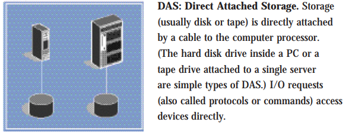
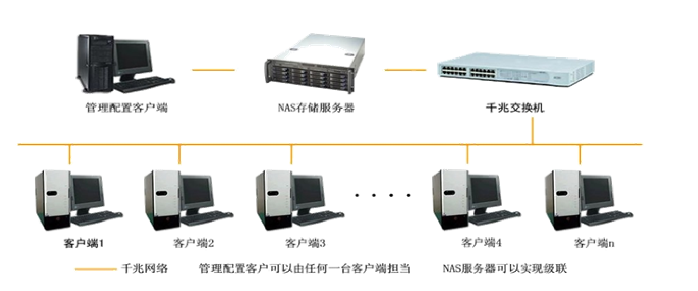
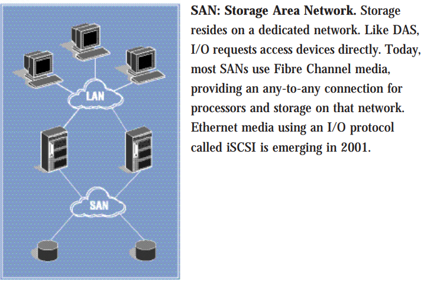
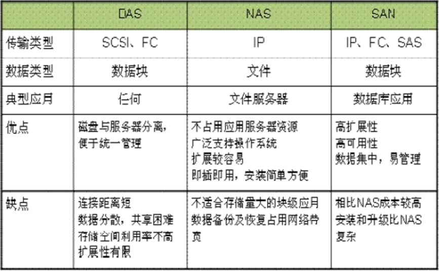
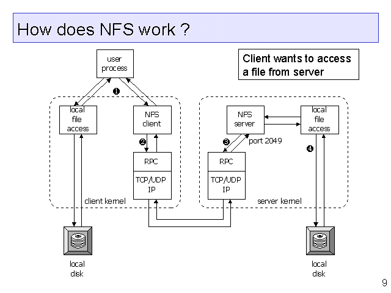

<center><font face="黑体" color="grey" size="6">Linux 网络文件共享介绍</font></center>

# 一.常见的存储类型

目前常见的存储类型有 DAS,NAS,SAN 等，最主要的区别是硬盘存储媒介是如何
于处理器连接的，以及处理器使用何种方式来访问磁盘，以及访问磁盘使用
的协议(网络协议、I/O 协议)。

三种存储类型如下
: 直连式存储：Direct-Attached Storage，简称 DAS
: 网络附加存储：Network-Attached Storage，简称 NAS
: 存储区域网络：Storage Area Network，简称 SAN

## 1.1 DAS 类型的存储

- DAS 存储是最常见的一种存储方式，尤其是在中小企业应用中。PC 中的硬盘或只
  有一个外部 SCSI 接口的 JBOD 都属于 DAS 架构。DAS 是指存储设备直接连接到
  服务器总线上，存储设备只与一台独立的主机连接，其他主机不能使用这个存储
  设备。DAS 存储设备与服务器主机之间的连接通道通常采用 SCSI 连接，DAS 存储
  设备主要是磁盘阵列(RAID: Redundant Arrays of Independent Disks)、磁盘簇
  (JBOD:Just a Bunch Of Disks)等。

  

## 1.2 NAS 类型的存储

- NAS 存储就是存储设备通过标准的网络拓扑结构(比如以太网)添加到一群计算
  机上。与 DAS 以及 SAN 不同，NAS 是文件级的存储方法。采用 NAS 较多的
  功能是用来进行文件共享。
- NAS 存储也通常被称为附加存储，顾名思义，就是存储设备通过标准的网络拓
  扑结构(例如以太网)添加到一群计算机上。NAS 是文件级的存储方法，它的重
  点在于帮助工作组和部门级机构解决迅速增加存储容量的需求。如今更多的人
  们采用 NAS 较多的功能是用来文档共享、图片共享、电影共享等等，而且随着
  云计算的发展，一些 NAS 厂商也推出了云存储功能，大大方便了企业和人们等
  个人用户的使用。
- NAS 产品是真正即插即用的产品。NAS 设备一般支持多计算机平台，用户通过
  网络支持协议可进入相同的文档，因而 NAS 设备无需改造即可用于混合
  Unix/Windows NT 局域网内，同时 NAS 的应用非常灵活。但 NAS 有一个关
  键性问题，即备份过程中的带宽消耗。与将备份数据流从 LAN 中转移出去的
  存储区域网（SAN）不同，NAS 仍使用网络进行备份和恢复。NAS 的一个缺点
  是它将存储事务由并行 SCSI 连接转移到了网络上。这就是说 LAN 除了必须
  处理正常的最终用户传输流外，还必须处理包括备份操作的存储磁盘请求。

  

## 1.3 SAN 类型的存储

- 存储区域网络，这个是通过光纤通道或以太网交换机连接存储阵列和服务器主机，
  最后成为一个专用的存储网络。SAN 经过十多年历史的发展，已经相当成熟，成
  为业界的事实标准（但各个厂商的光纤交换技术不完全相同，其服务器和 SAN
  存储有兼容性的要求）。

  

- SAN 提供了一种与现有 LAN 连接的简易方法，并且通过同一物理通道支持广
  泛使用的 SCSI 和 IP 协议。SAN 不受现今主流的、基于 SCSI 存储结构的
  布局限制。特别重要的是，随着存储容量的爆炸性增长，SAN 允许企业独立地增
  加它们的存储容量。SAN 的结构允许任何服务器连接到任何存储阵列，这样不管
  数据置放在那里，服务器都可直接存取所需的数据。因为采用了光纤接口，SAN
  还具有更高的带宽。
- 如今的 SAN 解决方案通常会采取以下两种形式：光纤信道以及 iSCSI 或者基于
  IP 的 SAN，也就是 FC SAN 和 IP SAN。光纤信道是 SAN 解决方案中大家最熟
  悉的类型，但是，最近一段时间以来，基于 iSCSI 的 SAN 解决方案开始大量出
  现在市场上，与光纤通道技术相比较而言，这种技术具有良好的性能，而且价格低
  廉。

SAN 的优势：
: 随着存储容量的增长，SAN 允许企业独立地增加他们的存储容量。SAN 允许任
何服务器连接到任何存储阵列（好处是：不管数据放在哪里，服务器都可以直接
存取所需的数据）
: 由于使用光纤接口，SAN 具有更高的带宽。除了 FC 连接，SAN 连接还有
ISCSI（SCSI over IP）以及 SAS（Serial Attached SCSI）接口。
: 光纤接口可以提供 10 公里那么长那么远的连接长度，非常容易实现物理分离的存储

## 1.4 三种存储类型的比较

- 技术上

| 处理器----存储 连接类型 | 有无网络 | 媒介                               | I/O 协议 | 带宽                       | 是否容量共享         | 是否数据共享                         |
| ----------------------- | -------- | ---------------------------------- | -------- | -------------------------- | -------------------- | ------------------------------------ |
| DAS                     | NO       | 使用并行 SCSI，光纤通道            | SCSI     | 40MBps-160MBps，取决于媒介 | 手动配置，默认不共享 | NO                                   |
| SNA                     | YES      | 最常用光纤网络，后来也可基于以太网 | SCSI     | 100MBps or 200MBps         | YES                  | 数据共享需要特定软件配合，如 SANergy |
| NAS                     | YES      | 以太网                             | NFS,CIFS | 10Mbps--1Gbps              | YES                  | YES                                  |

- 优缺点和使用场景

三种存储架构的应用场景
: DAS 虽然比较古老了，但是还是很适用于那些数据量不大，对磁盘访问速度要求
较高的中小企业
: NAS 多适用于文件服务器，用来存储非结构化数据，虽然受限于以太网的速度，
但是部署灵活，成本低
: SAN 则适用于大型应用或数据库系统，缺点是成本高、较为复杂


- 应用和磁盘的交互
  

# 二.文件传输协议 FTP

## 2.1 FTP 工作原理

File Transfer Protocol(FTP):文件传输协议，是用于在计算机网络上的客户机和服务器
之间传输文件的标准应用层协议。FTP 是基于客户端/服务器模型(C/S)，并且使用不同的连
接来工作，将控制和数据传输分开，控制通道使用 TCP/21 端口，数据通道端口视情况而定。

FTP 用户可以使用明文登录协议进行身份验证，通常是用户名和密码的形式，但如果服务器配
置允许，则可以匿名连接(此时连接的用户名为 ftp 或者 anonymous)。对于保护用户名和密
码并对内容进行加密的安全传输，FTP 通常使用 SSL/TLS (FTPS)或 SSH 文件传输协议
(SFTP)进行保护。

第一个 FTP 客户端应用程序是在操作系统具有图形用户界面之前开发的命令行程序，并且到
目前仍然随大多数 Windows、Unix 和 Linux 操作系统一起提供。此后，许多 FTP 客户端
和自动化实用程序被开发用于桌面、服务器和移动设备。

FTP 工作时使用两种模式：从服务器角度来说

: **主动模式(PORT style)**: 服务器主动连接客户端
控制通道：客户端：随机 port ---> 服务器：21/tcp
数据通道：客户端：随机 port <---服务器：20/tcp
: **被动模式(PASV style)**: 客户端主动连接服务器
控制通道：客户端：随机 port ---> 服务器：21/tcp
数据通道：客户端：随机 port ---> 服务器：随机 port /tcp

例如：服务器被动模式数据端口
`227 Entering Passive Mode (172,16,0,1,224,59)`客服端主动连接服务器
可以在客户端看到该消息，服务器数据端口计算：224\*256+59

FTP 服务状态码
: 1XX：信息 125：数据连接打开
: 2XX：成功类状态 200：命令 OK 230：登录成功
: 3XX：补充类 331：用户名 OK
: 4XX：客户端错误 425：不能打开数据连接
: 5XX：服务器错误 530：不能登录

用户认证：
: 匿名用户：ftp,anonymous,对应 Linux 用户 ftp
: 系统用户：Linux 用户,用户/etc/passwd,密码/etc/shadow
: 虚拟用户：特定服务的专用用户，独立的用户/密码文件

## 2.2 常见的 FTP 软件

常见的 FTP 服务端软件

: Wu-ftpd,Proftpd,Pureftpd
: Filezilla Server,Serv-U,Wing FTP Server,IIS
: vsftpd：Very Secure FTP Daemon，CentOS 默认 FTP 服务器高速，稳定，下载速度是
WU-FTP 的两倍，据 ftp.redhat.com 提供的数据:FTP 单机最多可支持 15000 个并发连接。

常见的 FTP 客户端软件
: ftp
`ftp -A ftpserver port -A 主动模式 –p 被动模式`
: lftp
`lftp –u username ftpserver`
`lftp username@ftpserver`
: lftpget
`lftpget ftp://ftpserver/pub/file`
: gftp：GUI centos5 最新版 2.0.19 (11/30/2008)
: wget
: curl
: filezilla，FTP Rush，CuteFtp，FlashFXP，LeapFtp

## 2.2.1 vsftpd 软件

vsftpd 由 vsftpd 包提供，不由 xinetd 管理
用户认证配置文件：`/etc/pam.d/vsftpd`

- 服务启动文件

`/usr/lib/systemd/system/vsftpd.service`
`/etc/rc.d/init.d/vsftpd`

- 配置文件

`/etc/vsftpd/vsftpd.conf`
帮助：man 5 vsftpd.conf

- 配置文件格式
  `option=value` 等号两端不能有空格

- 用户和其共享目录
  匿名用户（映射为系统用户 ftp ）共享文件位置：/var/ftp
  系统用户共享文件位置：用户家目录
  虚拟用户共享文件位置：为其映射的系统用户的家目录

### 2.2.2 vsftpd 服务常见配置

#### 2.2.2.1 命令端口配置

```ruby
listen_port=21
```

#### 2.2.2.2 主动模式端口

```ruby
connect_from_port_20=YES  主动模式端口为20
 ftp_data_port=20 （默认）   指定主动模式的端口
```

#### 2.2.2.3 被动模式端口范围

linux 客户端默认使用被动模式
windows 客户端默认使用主动模式

```ruby
pasv_min_port=6000     0为随机分配
pasv_max_port=6010
```

#### 2.2.2.4 使用当地时间

```ruby
use_localtime=YES 默认为NO，GMT时区
```

#### 2.2.2.5 使用匿名用户登录

```ruby
anonymous_enable=YES   支持匿名用户
no_anon_password=YES   匿名用户略过口令检查 , 默认NO
```

#### 2.2.2.6 允许匿名上传文件

```ruby
anon_upload_enable=YES     匿名上传，注意:文件系统权限
anon_mkdir_write_enable=YES  匿名建目录
anon_world_readable_only     只能下载全部读的文件, 默认YES
anon_umask=0333        指定匿名上传文件的umask，默认077
anon_other_write_enable=YES   可删除和修改上传的文件, ，默认NO
```

#### 2.2.2.7 指定匿名用户的上传文件的默认的所有者和权限

```ruby
chown_uploads=YES      默认NO
chown_username=wang
chown_upload_mode=0644
```

#### 2.2.2.8 Linux 系统用户

```ruby
local_enable=YES 是否允许 linux 用户登录
write_enable=YES 允许 linux 用户上传文件
local_umask=022 指定系统用户上传文件的默认权限
```

#### 2.2.2.9 将系统用户映射为指定的 guest 用户

```ruby
guest_enable=YES 所有系统用户都映射成 guest 用户
guest_username=ftp 配合上面选项才生效，指定 guest 用户
local_root=/ftproot guest 用户登录所在目录
```

#### 2.2.2.10 限定系统用户在指定目录

- 禁锢所有系统在家目录中

```ruby
chroot_local_user=YES 禁锢系统用户，默认NO，即不禁锢
```

- 禁锢或不禁锢特定的系统用户在家目录中，与上面设置功能相反

```ruby
chroot_list_enable=YES
chroot_list_file=/etc/vsftpd/chroot_list
```

当 chroot_local_user=YES 时，则 chroot_list 中用户不禁锢
当 chroot_local_user=NO 时，则 chroot_list 中用户禁锢

#### 2.2.2.11 启用日志

```ruby
wu-ftp日志：默认启用
xferlog_enable=YES   启用记录上传下载日志，此为默认值
xferlog_std_format=YES  使用wu-ftp日志格式，此为默认值
xferlog_file=/var/log/xferlog 可自动生成， 此为默认值

vsftpd日志：默认不启用
dual_log_enable=YES  使用vsftpd日志格式，默认不启用
vsftpd_log_file=/var/log/vsftpd.log 可自动生成， 此为默认值
```

#### 2.2.2.12 启用提示信息

- 登录提示信息

```ruby
ftpd_banner="welcome to mage ftp server"
banner_file=/etc/vsftpd/ftpbanner.txt
```

- 目录访问提示信息

```ruby
dirmessage_enable=YES 此为默认值
message_file=.message 信息存放在指定目录下.message ，此为默认值
```

#### 2.2.2.13 PAM 模块实现用户访问控制

```ruby
pam_service_name=vsftpd pam配置文件:/etc/pam.d/vsftpd
/etc/vsftpd/ftpusers  默认文件中用户拒绝登录
```

#### 2.2.2.14 是否启用控制用户登录的列表文件

```ruby
userlist_enable=YES      此为默认值
userlist_deny=YES(默认值)  黑名单,不提示口令，NO为白名单
userlist_file=/etc/vsftpd/users_list  此为默认值
```

#### 2.2.2.15 vsftpd 服务指定用户身份运行

`nopriv_user=nobody` 此为默认值

#### 2.2.2.16 连接数限制

```ruby
max_clients=0 最大并发连接数
max_per_ip=0 每个 IP 同时发起的最大连接数
```

#### 2.2.2.17 传输速率，字节/秒

```ruby
anon_max_rate=0    匿名用户的最大传输速率
local_max_rate=0    本地用户的最大传输速率
```

#### 2.2.2.18 连接时间：秒为单位

```ruby
connect_timeout=60   主动模式数据连接超时时长
accept_timeout=60     被动模式数据连接超时时长
data_connection_timeout=300  数据连接无数据输超时时长
idle_session_timeout=60  无命令操作超时时长
```

#### 2.2.2.19 优先以文本方式传输

```ruby
ascii_upload_enable=YES
ascii_download_enable=YES
```

#### 2.2.2.20 实现基于 SSL 的 FTPS

1. 查看是否支持 SSL

```bash
[root@centos8 ~]#ldd `which vsftpd`|grep libssl
libssl.so.1.1 => /lib64/libssl.so.1.1 (0x00007f8878e2c000)
```

2. 创建自签名证书

```bash
# CentOS 7 上可以实现
cd /etc/pki/tls/certs/
make vsftpd.pem
openssl  x509 -in vsftpd.pem -noout –text
# 或者分别生成一个证书和私钥文件
mkdir /etc/vsftpd/ssl
cd /etc/vsftpd/ssl
openssl req -x509 -nodes -keyout vsftpd.key -out vsftpd.crt -days 365 -newkey rsa:2048
```

3. 配置 vsftpd 服务支持 SSL

```bash
[root@centos7 ~]#vim  /etc/vsftpd/vsftpd.conf
ssl_enable=YES          #启用SSL
allow_anon_ssl=NO       #匿名不支持SSL
force_local_logins_ssl=YES  #本地用户登录加密
force_local_data_ssl=YES    #本地用户数据传输加密
rsa_cert_file=/etc/pki/tls/certs/vsftpd.pem
#rsa_private_key_file  /path/file   #此项如果没有指定，私钥也在证书文件中
#ssl_tlsv1=YES
#ssl_sslv2=NO
#ssl_sslv3=NO
#require_ssl_reuse=NO
#ssl_ciphers=HIGH

[root@centos7 ~]#systemctl restart vsftpd
[root@centos7 ~]#ftp 192.168.100.7
Connected to 192.168.100.7 (192.168.100.7).
220-welcome to magedu
220
Name (192.168.100.8:root): wang
530 Non-anonymous sessions must use encryption.
Login failed.
421 Service not available, remote server has closed connection

# 用filezilla等工具测试
```

### 2.2.3 vsftpd 虚拟用户概念

vsftpd 的虚拟用户：

- 所有虚拟用户会统一映射为一个指定的系统帐号：访问共享位置，即为此系统帐号的家目录
- 各虚拟用户可被赋予不同的访问权限，通过匿名用户的权限控制参数进行指定

虚拟用户帐号的存储方式：

- 存储于文件：编辑文本文件，此文件需要被编码为 hash 格式。奇数行为用户名，偶数行为密码
  使用命令`db_load -T -t hash -f vusers.txt vusers.db`生成 vsftpd 可识别的`.db`格式
- 存储于关系型数据库中的表中：实时查询数据库完成用户认证
  vsftpd 支持 mysql 库：pam 要依赖于 pam-mysql
  `/lib64/security/pam_mysql.so`
  `/usr/share/doc/pam_mysql-0.7/README`

### 2.2.4 基于文件验证的虚拟用户

#### 2.2.4.1 创建用户数据文件

```bash
vim /etc/vsftpd/vusers.txt
wang
wangpass
mage
magepass
cd /etc/vsftpd/
db_load -T -t hash -f vusers.txt vusers.db
chmod 600 vusers.db
```

#### 2.2.4.2 创建用户访问 FTP 共享文件目录

```bash
useradd -d /data/ftproot -s /sbin/nologin -r vuser
mkdir -pv /data/ftproot/upload
setfacl -m u:vuser:rwx /data/ftproot/upload
#chmod a=rx /data/ftproot/ 如果自动创建家目录，需修改权限
```

#### 2.2.4.3 创建 pam 配置文件

```bash
vim /etc/pam.d/vsftpd.db
auth required pam_userdb.so db=/etc/vsftpd/vusers
account required pam_userdb.so db=/etc/vsftpd/vusers
```

#### 2.2.4.4 指定 pam 配置文件

```bash
vim /etc/vsftpd/vsftpd.conf
guest_enable=YES
guest_username=vuser
pam_service_name=vsftpd.db
```

#### 2.2.4.4 每个虚拟用户建立独立的配置文件

```bash
# 指定各个用户配置文件存放的路径
vim /etc/vsftpd/vsftpd.conf
user_config_dir=/etc/vsftpd/vusers.d/

# 创建各个用户配置文件存放的路径
mkdir /etc/vsftpd/vusers.d/
cd /etc/vsftpd/vusers.d/

# 创建各用户自已的配置文件,允许wang用户可读写，其它用户只读
vim wang  
anon_upload_enable=YES
anon_mkdir_write_enable=YES
anon_other_write_enable=YES

# 创建各用户自已的配置文件
vim mage  

# 登录目录改变至指定的目录
local_root=/data/ftproot2
```

### 2.2.5 基于 mysql 验证的虚拟用户

#### 2.2.5.1 环境准备

本实验在两台 CentOS 主机上实现， CentOS 7 一台做为 FTP 服务器，一台做数据库服务器

#### 2.2.5.2 在数据库服务器上安装 mysql 数据库

```bash
yum –y install mariadb-server
systemctl enable --now  mariadb.service
```

#### 2.2.5.3 在数据库服务上配置数据库支持 vsftpd 服务

```bash
# 建立存储虚拟用户数据库和表
mysql> CREATE DATABASE vsftpd;
mysql> USE vsftpd;
mysql> CREATE TABLE users (
id INT AUTO_INCREMENT NOT NULL PRIMARY KEY,
name CHAR(50) BINARY NOT NULL,
password CHAR(48) BINARY NOT NULL
);
# 添加虚拟用户，为了安全应该使用PASSWORD函数加密其密码后存储
mysql> INSERT INTO users(name,password) values('wang',password('magedu'));
mysql> INSERT INTO users(name,password) values('mage',password('magedu'));
# 创建连接的数据库用户
mysql> GRANT SELECT ON vsftpd.* TO vsftpd@'172.16.0.%'  IDENTIFIED BY 'magedu';
mysql> FLUSH PRIVILEGES;
```

#### 2.2.5.4 在 FTP 服务器上安装 vsftpd 和 pam_mysql 包

```bash
yum install vsftpd -y
yum install pam_mysql -y
```

- 对于 centos 6：pam_mysql 由 EPEL 的源中提供
- 对于 centos7 和 8：无对应 rpm 包，需手动编译安装
- pam-mysql 源码进行编译

```bash
# 安装相关包
yum install vsftpd gcc gcc-c++ make mariadb-devel  pam-devel

# 下载pam-mysql源码进行编译
wget http://prdownloads.sourceforge.net/pam-mysql/pam_mysql-0.7RC1.tar.gz
# https://github.com/NigelCunningham/pam-MySQL/archive/v0.8.1.tar.gz

tar xvf pam_mysql-0.7RC1.tar.gz
cd pam_mysql-0.7RC1/
./configure --with-pam-mods-dir=/lib64/security
# 如果上面命令不指定  --with-pam-mods-dir=/lib64/security  会报以下错误
# checking if the second argument of pam_conv.conv() takes const pointer... no
# configure: error: Your system doesn\'t appear to be configured to use PAM.
# Perhaps you need to specify the correct location where the PAM modules reside.

make && make install
[root@vsftpd ~]#ll /lib64/security/pam_mysql*
-rwxr-xr-x 1 root root    882 Dec 17 14:34 /lib64/security/pam_mysql.la
-rwxr-xr-x 1 root root 141712 Dec 17 14:34 /lib64/security/pam_mysql.so
```

#### 2.2.5.5 在 FTP 服务器上建立 pam 认证所需文件

```bash
vi /etc/pam.d/vsftpd.mysql

# 添加如下两行
auth required pam_mysql.so user=vsftpd passwd=magedu host=mysqlserver db=vsftpd table=users usercolumn=name passwdcolumn=password crypt=2
account required pam_mysql.so user=vsftpd passwd=magedu host=mysqlserver db=vsftpd table=users usercolumn=name passwdcolumn=password crypt=2
```

参考 README 可知

- crypt 加密方式：
  0 表示不加密
  1 表示 crypt(3)加密
  2 表示使用 mysql password()函数加密
  3 表示 md5 加密
  4 表示 sha1 加密
- 配置字段说明
  auth 表示认证
  account 验证账号密码正常使用
  required 表示认证要通过
  pam_mysql.so 模块是默认的相对路径，是相对/lib64/security/路径而言，也可以写绝对路径；后
  面为给此模块传递的参数
  user=vsftpd 为登录 mysql 的用户
  passwd=magedu 登录 mysql 的的密码
  host=mysqlserver mysql 服务器的主机名或 ip 地址
  db=vsftpd 指定连接 msyql 的数据库名称
  table=users 指定连接数据库中的表名
  usercolumn=name 当做用户名的字段
  passwdcolumn=password 当做用户名字段的密码
  crypt=2 密码的加密方式为 mysql password()函数加密

#### 2.2.5.6 建立相应用户和修改 vsftpd 配置文件

```bash
# 建立虚拟用户映射的系统用户及对应的目录
useradd -s /sbin/nologin -d /data/ftproot -r vuser
# centos7 需除去ftp根目录的写权限
chmod 555 /data/ftproot                
mkdir -pv /data/ftproot/{upload,pub}
setfacl –m u:vuser:rwx /data/ftproot/upload
# 确保/etc/vsftpd.conf中已经启用了以下选项
anonymous_enable=YES
# 添加下面两项
guest_enable=YES
guest_username=vuser
# 修改下面一项，原系统用户无法登录
pam_service_name=vsftpd.mysql

# 启动vsftpd服务
systemctl enable --now vsftpd
```

#### 2.2.5.7 在 FTP 服务器上配置虚拟用户具有不同的访问权限

vsftpd 可以在配置文件目录中为每个用户提供单独的配置文件以定义其 ftp 服务访问权限，
每个虚拟用户的配置文件名同虚拟用户的用户名。配置文件目录可以是任意未使用目录，
只需要在 vsftpd.conf 指定其路径及名称即可

```bash
# 配置vsftpd为虚拟用户使用配置文件目录
vim /etc/vsftpd/vsftpd.conf
# 添加如下选项
user_config_dir=/etc/vsftpd/vusers.d/
# 创建所需要目录，并为虚拟用户提供配置文件
mkdir /etc/vsftpd/vusers.d/
cd /etc/vsftpd/vusers.d/
touch wang mage
# 配置虚拟用户的访问权限
# 虚拟用户对vsftpd服务的访问权限是通过匿名用户的相关指令进行的。如要让用户wang具有上传文件的权
限，可修改/etc/vsftpd/vusers.d/wang文件，在里面添加如下选项并设置为YES即可,只读则设为NO
# 注意：需确保对应的映射用户对于文件系统有写权限
anon_upload_enable={YES|NO}
anon_mkdir_write_enable={YES|NO}
anon_other_write_enable={YES|NO}
# 登录目录改变至指定的目录
local_root=/data/ftproot2
```

# 三.文件共享服务

## 3.1 NFS 分布式文件系统协议

Network File System(NFS):网络文件系统，是一个分布式文件系统协议，最初由
`Sun Microsystems`(SUN)在 1984 年开发，其允许用户在客服端通过计算机网络
访问服务器的文件，就如同在客户端本地访问一样。和其他协议一样，NFS 基于
`Open Network Computing Remote Procedure Call(ONC RPC)`远程过程调用
系统。NFS 是一个开放的标准，定义于一个 RFC 中，允许任何人实现该协议。

## 3.2 NFS 工作原理

RPC 采用 C/S 模式，客户机请求程序调用进程发送一个有进程参数的调用信息到服务
进程，然后等待应答信息。在服务器端，进程保持睡眠状态直到调用信息到达为止。
当一个调用信息到达，服务器获得进程参数，计算结果，发送答复信息，然后等待
下一个调用信息，最后，客户端调用进程接收答复信息，获得进程结果，然后调用
执行继续进行。



NFS 优势：节省本地存储空间，将常用的数据,如：/home 目录，存放在 NFS 服务
器上且可以通过网络访问，本地终端将可减少自身存储空间的使用

## 3.3 NFS 软件

软件包：`nfs-utils`
相关软件包：`rpcbind`（必须），`tcp_wrappers`
Kernel 支持：`nfs.ko`
端口：2049(nfsd), 其它端口由 portmap(111)分配

- 说明：CentOS 6 开始 portmap 进程由 rpcbind 代替

NFS 服务主要进程：
: rpc.nfsd 最主要的 NFS 进程，管理客户端是否可登录
: rpc.mountd 挂载和卸载 NFS 文件系统，包括权限管理
: rpc.lockd 非必要，管理文件锁，避免同时写出错
: rpc.statd 非必要，检查文件一致性，可修复文件

日志位置：`/var/lib/nfs/`
NFS 配置文件：
`/etc/exports`
`/etc/exports.d/\*.exports`

## 3.4 NFS 配置

```ruby
/dir     主机1(opt1,opt2)     主机2(opt1,opt2)...
```

格式

- #号开始为注释
- 主机格式
  ```bash
  单个主机：ipv4，ipv6，FQDN
  IP networks：两种掩码格式均支持
  172.18.0.0/255.255.0.0
  172.18.0.0/16
  wildcards：主机名通配，例如*.magedu.com，IP不可以
  netgroups：NIS域的主机组，@group_name
  anonymous：表示使用*通配所有客户端
  ```
- 每个条目指定目录导出到的哪些主机，及相关的权限和选项

```bash
默认选项：(ro,sync,root_squash,no_all_squash)
ro,rw         只读和读写
async         异步，数据变化后不立即写磁盘，性能高
sync         （1.0.0后为默认）同步，数据在请求时立即写入共享存储磁盘
root_squash  （默认）远程root映射为nfsnobody,UID为65534，CentOS8 为nobody,早期版本是4294967294 (nfsnobody)
no_root_squash 远程root映射成root用户
all_squash     所有远程用户(包括root)都变成nfsnobody,CentOS8 为nobody
no_all_squash （默认）保留共享文件的UID和GID
anonuid和anongid 指明匿名用户映射为特定用户UID和组GID，而非nfsnobody,可配合all_squash使用
```

- 配置示例

```ruby
vim /etc/exports
/myshare server.example.com
/myshare *.example.com
/myshare  server?.example.com
/myshare  server[0-20].example.com
/myshare 172.25.11.10
/myshare 172.25.0.0/16
/myshare 2000:472:18:b51:c32:a21
/myshare 2000:472:18:b51::/64
/myshare *.example.com 172.25.0.0/16
/myshare desktop.example.com(ro)
/myshare desktop.example.com(ro) server[0-20].example.com(rw)
/myshare diskless.example.com(rw,no_root_squash)
```

## 3.5 NFS 相关工具

### 3.5.1 rpcinfo

rpcinfo 工具可以查看 RPC 相关信息，查看注册在指定主机的 RPC 程序
`rpcinfo -p hostname`
查看 RPC 注册程序
`rpcinfo -s hostname`
例子

```bash
[root@centos8 ~]#rpcinfo -p
   program vers proto   port  service
    100000    4   tcp    111  portmapper
    100000    3   tcp    111  portmapper
    100000    2   tcp    111  portmapper
    100000    4   udp    111  portmapper
    100000    3   udp    111  portmapper
    100000    2   udp    111  portmapper
    100024    1   udp  36310  status
    100024    1   tcp  45265  status
[root@centos8 ~]#rpcinfo -s
   program version(s) netid(s)                         service     owner
    100000  2,3,4     local,udp,tcp,udp6,tcp6          portmapper  superuser
    100024  1         tcp6,udp6,tcp,udp                status      29
```

### 3.5.2 exports

exportfs:可用于在 NFS 服务器管理 NFS 导出的文件系统
常用选项：

- –v 查看本机所有 NFS 共享
- –r 重读配置文件，并共享目录
- –a 输出本机所有共享
- –au 停止本机所有共享

### 3.5.3 showmount

showmount 用来查询远程服务器上的 NFS 服务信息。
`showmount -e hostname`

### 3.5.4 mount.nfs

`mount.nfs`工具用于在客户端挂载网络文件系统
挂载 NFS 时，选项参数说明

- fg（默认）前台挂载
- bg 后台挂载
- hard（默认）持续请求
- soft 非持续请求
- intr 和 hard 配合，请求可中断
- rsize 和 wsize 一次读和写数据最大字节数，rsize=32768
- netdev 无网络不挂载

提示：基于安全考虑，建议使用 nosuid,nodev,noexec 挂载选项\_

范例：临时挂载 NFS 共享
`mount -o rw,nosuid,fg,hard,intr 172.16.0.1:/testdir /mnt/nfs/`
范例：开机挂载

```bash
vim  /etc/fstab  
172.16.0.1:/public   /mnt/nfs   nfs   defaults,_netdev  0  0
```

## 3.6 自动挂载文件系统

可使用 autofs 服务按需要挂载外围设备，NFS 共享等，并在空闲 5 分钟后后自动卸载

### 3.6.1 相关文件

软件包： `autofs`
服务文件：`/usr/lib/systemd/system/autofs.service`
配置文件：`/etc/auto.master`

### 3.6.2 配置文件格式

参看帮助：man 5 autofs
所有导出到网络中的 NFS 启用特殊匹配 -host 至“browse”
范例：/net 目录可以自动挂载 NFS 共享

```bash
cat  /etc/auto.master
/net    -hosts
cd  /net/192.168.8.100/
```

自动挂载资源有两种格式：
: 相对路径法：将 mount point 路径分成 dirname 和 basename 分别配置，
可能会影响现有的目录结构
: 绝对路径法：直接匹配全部绝对路径名称，不会影响本地目录结构

相对路径法：

1. /etc/auto.master 格式

```ruby
挂载点的dirname     指定目录的配置文件路径
```

2. 指定目录的配置文件格式

```ruby
挂载点的basename      挂载选项     选项设备
```

相对路径例子

```bash
[root@centos8 ~]#vim /etc/auto.master
/misc   /etc/auto.misc
[root@centos8 ~]#vim /etc/auto.misc
cd      -fstype=iso9660,ro,nosuid,nodev   :/dev/cdrom
```

相对路径法支持通配符

```ruby
vim /etc/auto.master
/misc   /etc/auto.misc
vim /etc/auto.misc
#表示/misc下面的子目录和nfs共享/export目录的子目录同名
*  server:/export/&
```

绝对路径法

1.  /etc/auto.master 格式

```ruby
/-            指定配置文件路径
```

2. 指定配置文件格式

```ruby
绝对路径        挂载选项     选项设备
```

绝对路径例子

```bash
vim /etc/auto.master:
/-                  /etc/auto.direct
vim /etc/auto.direct:
/foo            -fstype=nfs server1:/export/foo
/user/local/    -fstype=nfs,vers=3  server1:/usr/local
/mnt/cdrom      -fstype=iso9660     :/dev/cdrom
```

## 3.7 案例

### 3.7.1 目标

将 NFS 的共享目录，通过 autofs 发布出来，做为远程主机用户的家目录

### 3.7.2 环境准备

三台主机
: 一台主机 nfs server,IP:192.168.8.100
: 另两台当 nfs client,IP:192.168.8.101 和 192.168.8.102

### 3.7.3 步骤

```bash
# NFS服务器创建用户和相应的家目录，将用户wang的家目录共享
useradd -d /data/wang  wang
Vim /etc/exports.d/test.exports
/data/wang  *(rw,anonuid=1000,anongid=1000,all_sqush)
# 在第一台NFS客户端主机192.168.8.101上实现相对路径法的autofs
vim /etc/auto.master
/home   /etc/homeauto
vim /etc/homeauto
*  -fstype=nfs,vers=3 192.168.8.100:/data/wang/&
# 注意：home目录下其它用户家目录无法访问
# 在第二台NFS客户端主机192.168.8.102上实现绝对路径法的autofs
vim /etc/auto.master
/-  /etc/homeauto
vim e/etc/homeauto
/home/wang  -fstype=nfs,vers=3 nfsserver:/data/wang
```

# 四.SAMBA 服务

Samba 是基于`SMB`网络协议实现的自由软件，最初由`Andrew Tridgell`。Samba 为各种
Microsoft Windows 客户端提供文件和打印服务，可以作为域控制器(DC)或域成员与
Microsoft Windows 服务域集成。从版本 4 开始，它支持活动目录(Active Directory)
和 Microsoft Windows NT 域。

另外，Samba 也是巴西的一种最受欢迎的音乐和舞蹈形式。每年狂欢节的主角都是 Samba 舞。

## 4.1 SAMBA 服务介绍

SMB：Server Message Block 服务器消息块，IBM 发布，最早是 DOS 网络文件共享协议
CIFS：common internet file system，微软于 1996 年将 SMB 改名并加入很多特性的协议
SAMBA：1991 年 Andrew Tridgell,实现 windows 和 UNIX 相通

CIFS/SMB 和网络文件系统(NFS) 是目前在 network-attached(NAS)存储系统使用最为广泛的协议。

> [SAMBA 官网](http://www.samba.org/)

SAMBA 的功能：

- 共享文件和打印，实现在线编辑
- 实现登录 SAMBA 用户的身份认证
- 可以进行 NetBIOS 名称解析
- 外围设备共享

Windows 计算机网络管理模式：

- 工作组 WORKGROUP：计算机对等关系，帐号信息各自管理
- 域 DOMAIN：C/S 结构，帐号信息集中管理，DC,AD

## 4.2 SAMBA 软件介绍

相关包：

- samba 提供 smb 服务
- samba-client 客户端软件
- samba-common 通用软件
- cifs-utils smb 客户端工具
- samba-winbind 和 AD 相关

相关服务进程：

- smbd 提供 smb（cifs）服务 TCP:139,445
- nmbd NetBIOS 名称解析 UDP:137,138

主配置文件：`/etc/samba/smb.conf`
帮助参看：man smb.conf
语法检查： `testparm [-v][/etc/samba/smb.conf]`
客户端工具：smbclient，mount.cifs

- 安装和启动服务

```bash
yum/dnf install samba
systemctl start smb
systemctl start nmb
```

## 4.3 SAMBA 客户端工具

访问 SAMBA 服务器时使用 UNC 命名规范
UNC 路径: `Universal Naming Convention` 通用命名规范，格式如下

```ruby
\\sambaserver\sharename
```

### 4.3.1 使用 smbclient 访问 SAMBA 服务器

```bash
smbclient -L instructor.example.com
smbclient -L instructor.example.com -U  smb用户%password
# 可以使用-U选项来指定用户%密码，或通过设置和导出USER和PASSWD环境变量来指定
smbclient  //instructor.example.com/shared -U wang
>cd directory
>get file1
>put file2
```

### 4.3.2 挂载 CIFS 文件系统

范例：手动挂载

```ruby
mount -o user=wang,password=magedu //server//shared   /mnt/smb
```

范例：开机自动挂载

```bash
cat /etc/fstab
# 可以用文件代替用户名和密码的输入
//server/homes /mnt cifs credentials或cred=/etc/smb.txt 0 0

cat /etc/smb.txt
username=wang           #或 user=wang
password=password       #或 pass=password
chmod 600 /etc/smb.txt
```

## 4.4 管理 SAMBA 用户

### 4.4.1 samba 用户

相关包：samba-common-tools
相关工具：smbpasswd pdbedit
用户数据库：/var/lib/samba/private/passdb.tdb
说明：samba 用户须是 Linux 用户，建议使用/sbin/nologin

### 4.4.2 管理用户命令

添加 samba 用户：

```bash
smbpasswd -a  <user>
pdbedit -a -u <user>
```

修改用户密码：

```bash
smbpasswd  <user>
```

删除用户和密码：

```bash
smbpasswd –x <user>
pdbedit  –x –u <user>
```

查看 samba 用户列表：

```bash
pdbedit –L –v
```

例

```bash
[root@centos8 ~]#pdbedit  -L
No builtin backend found, trying to load plugin
smb1:1002:
smb2:1003:
smb3:1004:
[root@centos8 ~]#pdbedit  -L -v
No builtin backend found, trying to load plugin
---------------
Unix username:        smb1
NT username:          
Account Flags:        [U          ]
User SID:             S-1-5-21-1476810783-3936299954-1329646792-1000
Primary Group SID:    S-1-5-21-1476810783-3936299954-1329646792-513
Full Name:            
Home Directory:       \\linux39\smb1
HomeDir Drive:        
Logon Script:        
Profile Path:         \\linux39\smb1\profile
Domain:               CENTOS8
Account desc:        
Workstations:        
Munged dial:          
Logon time:           0
Logoff time:          Wed, 06 Feb 2036 23:06:39 CST
Kickoff time:         Wed, 06 Feb 2036 23:06:39 CST
Password last set:    Thu, 19 Dec 2019 10:02:31 CST
Password can change:  Thu, 19 Dec 2019 10:02:31 CST
Password must change: never
Last bad password   : 0
Bad password count  : 0
Logon hours         : FFFFFFFFFFFFFFFFFFFFFFFFFFFFFFFFFFFFFFFFFF
---------------
Unix username:        smb2
NT username:          
Account Flags:        [U          ]
User SID:             S-1-5-21-1476810783-3936299954-1329646792-1001
Primary Group SID:    S-1-5-21-1476810783-3936299954-1329646792-513
Full Name:            
Home Directory:       \\linux39\smb2
HomeDir Drive:        
Logon Script:        
Profile Path:         \\linux39\smb2\profile
Domain:               CENTOS8
Account desc:        
Workstations:        
Munged dial:          
Logon time:           0
Logoff time:          Wed, 06 Feb 2036 23:06:39 CST
Kickoff time:         Wed, 06 Feb 2036 23:06:39 CST
Password last set:    Thu, 19 Dec 2019 09:57:36 CST
Password can change:  Thu, 19 Dec 2019 09:57:36 CST
Password must change: never
Last bad password   : 0
Bad password count  : 0
Logon hours         : FFFFFFFFFFFFFFFFFFFFFFFFFFFFFFFFFFFFFFFFFF
---------------
```

查看服务器状态--smbstatus

```bash
[root@centos8 ~]#smbstatus
Samba version 4.9.1
PID     Username     Group        Machine                                 Protocol Version  Encryption           Signing
45299   smb1         smb1         192.168.39.6 (ipv4:192.168.39.6:55898)    NT1               -                    -
Service      pid     Machine       Connected at                     Encryption    Signing
smb1         45299   192.168.39.6  Thu Dec 19 10:30:24 AM 2019 CST  -              -
No locked files
```

## 4.5 SAMBA 服务器配置

amba 配置文件 /etc/smb.conf 格式 ，使用.ini 文件的格式

全局设置：

- [global] 服务器通用或全局设置的部分

特定共享设置：

- [homes] 用户的家目录共享
- [printers] 定义打印机资源和服务
- [sharename] 自定义的共享目录配置
- 其中：#和;开头的语句为注释，大小写不敏感

samba 配置中的宏定义：

- %m 客户端主机的 NetBIOS 名
- %M 客户端主机的 FQDN
- %H 当前用户家目录路径
- %U 当前用户的用户名
- %g 当前用户所属组
- %h samba 服务器的主机名
- %L samba 服务器的 NetBIOS 名
- %I 客户端主机的 IP
- %T 当前日期和时间
- %S 可登录的用户名

### 4.5.1 SAMBA 服务器全局配置

`workgroup` 指定工作组名称
`server string` 主机注释信息
`netbios name` 指定 NetBIOS 名，注意：netbios name 需要启动 nmb 服务
范例：

```bash
[global]
    workgroup = workgroup
    netbios name = linux39
```

`interfaces` 指定服务侦听接口和 IP
`hosts allow` 可用逗号，空格，或 tab 分隔，默认允许所有主机访问，也可在每个共享独立
配置，如:在[global]设置，将应用并覆盖所有共享设置，可以是以下格式：

```bash
IPv4 network/prefix: 172.16.0.0/24  IPv4 前缀: 172.16.0.
IPv4 network/netmask: 172.16.0.0/255.255.255.0
主机名: desktop.example.com
以example.com后缀的主机名: .example.com
```

例

```bash
hosts allow = 172.16.   .example.com
```

`hosts deny` 拒绝指定主机访问，格式和 hosts allow 相同
`config file=/etc/samba/conf.d/%U` 用户独立的配置文件
`Log file=/var/log/samba/log.%I` 不同客户机采用不同日志
`log level = 2` 日志级别，默认为 0，不记录日志
例

```bash
[global]
    Log file=/var/log/samba/log.%I
    log level = 2
```

`max log size=50` 日志文件达到 50K，将轮循 rotate,单位 KB
Security 三种认证方式：

- user：samba 用户（采有 linux 用户，samba 的独立口令）
- share：匿名(CentOS7 不再支持)，已不建议使用
- server：已不建议使用

`passdb backend = tdbsam` 密码数据库格式

4.5.2 配置特定目录共享

每个共享目录应该有独立的[ ]部分
[共享名称] 远程网络看到的共享名称
`comment` 注释信息
`path` 所共享的目录路径
`public` 能否被 guest 访问的共享，默认 no，和 guest ok 类似
`browsable` 是否允许所有用户浏览此共享,默认为 yes,no 为隐藏
`writable=yes` 可以被所有用户读写，默认为 no
`read only=no` 和 writable=yes 等价，如与以上设置冲突，放在后面的设置生效，默认只读
`write list` 用户，@组名，+组名,用，分隔，如 writable=no，列表中用户或组可读写，不在列表中用户
`valid users` 特定用户才能访问该共享，如为空，将允许所有用户，用户名之间用空格分隔

范例：基于特定用户和组的共享

```bash
vim /etc/samba/smb.conf
[share]
path = /app/dir
valid users=wang,@admins
writeable = no
browseable = no
```

## 4.6 案例

### 4.6.1 利用 SAMBA 实现指定目录共享

```bash
# 在samba服务器上安装samba包
yum -y install samba
# 创建samba用户和组
groupadd -r admins
useradd -s /sbin/nologin -G admins wang
smbpasswd -a wang
useradd -s /sbin/nologin mage
smbpasswd -a mage
# 创建samba共享目录,并设置SElinux
mkdir /testdir/smbshare
chgrp admins /testdir/smbshare
chmod 2775 /testdir/smbshare
# samba服务器配置
vim  /etc/samba/smb.conf
...省略...
[share]
path = /testdir/smbshare
write list = @admins
systemctl enable --now  smb nmb
# samba客户端访问
yum -y install cifs-utils
# 用wang用户挂载smb共享并访问
mkdir /mnt/wang
mount -o username=wang //smbserver/share /mnt/wang
echo "Hello wang" >/mnt/wang/wangfile.txt
# 用mage用户挂载smb共享并访问
mkdir /mnt/mage
mount -o username=mage //smbserver/share /mnt/mage
touch /mnt/mage/magefile.txt
```

### 4.6.2 实现不同 samba 用户访问相同的 samba 共享，实现不同的配置

```bash
# 创建三个samba用户,并指定密码为magedu
useradd -s /sbin/nologin -r smb1
useradd -s /sbin/nologin -r smb2
useradd -s /sbin/nologin -r smb3
smbpasswd –a smb1
smbpasswd –a smb2
smbpasswd –a smb3
# 修改samba配置文件
Vim /etc/samba/smb.conf
# 在workgroup下加一行
config file= /etc/samba/conf.d/%U  说明：%U表示用户名
[share]
Path=/data/dir
Read only= NO
Guest ok = yes
write list=@wheel
# 针对smb1和smb2用户创建单独的配置文件
Vim /etc/samba/conf.d/smb1
[share]
Path=/data/dir1
Read only= NO  等价于writable = yes
Create mask=0644    
# 说明：默认为744
Vim /etc/samba/conf.d/smb2
[share]
path=/data/dir2
systemctl restart  smb nmb
# 用户smb1，smb2,smb3访问share共享目录，看到目录是不同目录
smbclient //sambaserver/share -U smb1%magedu
smbclient //sambaserver/share -U smb2%magedu
smbclient //sambaserver/share -U smb3%magedu
```

# 五.数据同步 rsync


在生产环境，有时会需要两台主机的特定目录实现实时同步。比如，将 NFS 共享目录的
数据文件，自动实时同步到备份的服务器特定目录中，这时就会用到 rsync
rsync 是一款轻量级的备份和远程拷贝软件，其通过比较文件的修改时间和大小，在计算机
和外部硬盘驱动器之间以及在联网的计算机之间有效地传输和同步文件。它通常出现在类
unix 操作系统上。Rsync 是用 C 编写的单线程应用程序。rsync 使用的算法是一种增量编码，
适用于用于最小化网络使用。Zlib 可以用于额外的数据压缩，也可以使用 SSH 或 stunnel
进行安全加密。

## 5.1 数据实时同步技术

一般企业在使用 rsync 时会配合 inotify 使用，使用 inotify 监听文件修改情况，一旦文件某些
属性改变，就通知 rsync 进行备份

- inotify + rsync 方式实现数据同步
- sersync ：金山公司周洋在 inotify 软件基础上进行开发的，功能更加强大

工作原理：
: 要利用监控服务（inotify），监控同步数据服务器目录中信息的变化
: 发现目录中数据产生变化，就利用 rsync 服务推送到备份服务器上

inotify：
: 异步的文件系统事件监控机制，利用事件驱动机制，而无须通过诸如 cron 等的轮询机制来获取事件，
: linux 内核从 2.6.13 起支持 inotify，通过 inotify 可以监控文件系统中添加、删除，修改、移动等各种事件

```bash
[root@centos8 ~]#grep -i inotify /boot/config-4.18.0-80.el8.x86_64
CONFIG_INOTIFY_USER=y
```

## 5.2 notify

### 5.2.1 notify 需要内核支持

Linux 支持 inotify 的内核最小版本为 2.6.13，参看 man 7 inotify

```bash
ls -l /proc/sys/fs/inotify   #列出下面的文件，说明服务器内核支持inotify
-rw-r--r-- 1 root root 0 Dec  7 10:10 max_queued_events
-rw-r--r-- 1 root root 0 Dec  7 10:10 max_user_instances
-rw-r--r-- 1 root root 0 Dec  6 05:54 max_user_watches
```

inotify 内核参数说明：

```bash
max_queued_events：inotify事件队列最大长度，如值太小会出现 Event Queue Overflow  误，默认值：16384 max_user_instances：每个用户创建inotify实例最大值，默认值：128 max_user_watches：可以监视的文件数量（单进程），默认值：8192
```

```
[root@centos8 ~]#vim /etc/sysctl.conf
fs.inotify.max_queued_events=66666
fs.inotify.max_user_watches=100000    
[root@centos8 ~]#sysctl  -p
fs.inotify.max_queued_events = 66666
fs.inotify.max_user_watches = 100000
[root@centos8 ~]#cat /proc/sys/fs/inotify/*
66666
128
100000
```

### 5.2.2 inotify-tools 工具

inotify-tools 参考文档：https://github.com/rvoicilas/inotify-tools/wiki
安装 inotify-tools：基于 epel 源
`yum install inotify-tools`

inotify-tools 包主要工具：

- inotifywait： 在被监控的文件或目录上等待特定文件系统事件（open ，close，delete 等）
  发生，常用于实时同步的目录监控
- inotifywatch：收集被监控的文件系统使用的统计数据，指文件系统事件发生的次数统计

inotifywait 命令常见选项

- -m, --monitor 始终保持事件监听
- -d, --daemon 以守护进程方式执行，和-m 相似，配合-o 使用
- -r, --recursive 递归监控目录数据信息变化
- -q, --quiet 输出少量事件信息
- --exclude 指定排除文件或目录，使用扩展的正则表达式匹配的模式实现
- --excludei 和 exclude 相似，不区分大小写
- -o, --outfile 打印事件到文件中，相当于标准正确输出，注意：使用绝对路径
- -s, --syslogOutput 发送错误到 syslog 相当于标准错误输出
- --timefmt 指定时间输出格式
- --format 指定的输出格式；即实际监控输出内容
- -e 指定监听指定的事件，如果省略，表示所有事件都进行监听

inotifywait 的--timefmt 时间格式
参考 man 3 strftime

- %Y 年份信息，包含世纪信息
- %y 年份信息，不包括世纪信息
- %m 显示月份，范围 01-12
- %d 每月的第几天，范围是 01-31
- %H 小时信息，使用 24 小时制，范围 00-23
- %M 分钟，范围 00-59

如
`--timefmt "%Y-%m-%d %H:%M"`

inotifywait 的 --format 格式定义

- %T 输出时间格式中定义的时间格式信息，通过 --timefmt option 语法格式指定时间信息
- %w 事件出现时，监控文件或目录的名称信息
- %f 事件出现时，将显示监控目录下触发事件的文件或目录信息，否则为空
- %e 显示发生的事件信息，不同的事件默认用逗号分隔
- %Xe 显示发生的事件信息，不同的事件指定用 X 进行分隔

例

```bash
--format "%T %w%f event: %;e"
--format '%T  %w  %f'
```

inotifywait -e 选项指定的事件类型

- create 文件或目录创建
- delete 文件或目录被删除
- modify 文件或目录内容被写入
- attrib 文件或目录属性改变
- close_write 文件或目录关闭，在写入模式打开之后关闭的
- close_nowrite 文件或目录关闭，在只读模式打开之后关闭的
- close 文件或目录关闭，不管读或是写模式
- open 文件或目录被打开
- moved_to 文件或目录被移动到监控的目录中
- moved_from 文件或目录从监控的目录中被移动
- move 文件或目录不管移动到或是移出监控目录都触发事件
- access 文件或目录内容被读取
- delete_self 文件或目录被删除，目录本身被删除
- unmount 取消挂载

`inotifywait -e create,delete,moved_to,close_write, attrib`

例:使用 inotifywait

```bash
#监控一次性事件
inotifywait /data
#持续前台监控
inotifywait -mrq /data
#持续后台监控，并记录日志
inotifywait -o /root/inotify.log -drq /data --timefmt "%Y-%m-%d %H:%M" --format
"%T %w%f event: %e"
#持续前台监控特定事件
inotifywait -mrq /data --timefmt "%F %H:%M" --format "%T %w%f  event: %;e" -e
create,delete,moved_to,close_write,attrib
```

## 5.3 rsync

rsync 常用于做为 linux 系统下的数据镜像备份工具，实现实现远程同步，支持本地复制，
或者与其他 SSH、rsync 主机同步数据，支持增量备份，配合任务计划，rsync 能实现定时或
间隔同步，配合 inotify 或 sersync，可以实现触发式的实时数据同步。

> [官方网站](http://rsync.samba.org/)

> 软件包：rsync，rsync-daemon（CentOS 8）
> 服务文件：/usr/lib/systemd/system/rsyncd.service
> 配置文件：/etc/rsyncd.conf
> 端口：873/tcp

### 5.3.1 rsync 命令

```bash
#Local:  
rsync [OPTION...] SRC... [DEST]

#Access via remote shell:
Pull:
rsync [OPTION...] [USER@]HOST:SRC... [DEST]
Push:
rsync [OPTION...] SRC... [USER@]HOST:DEST

#Access via rsync daemon:
Pull:
rsync [OPTION...] [USER@]HOST::SRC... [DEST]
rsync [OPTION...] rsync://[USER@]HOST[:PORT]/SRC... [DEST]
Push:
rsync [OPTION...] SRC... [USER@]HOST::DEST
rsync [OPTION...] SRC... rsync://[USER@]HOST[:PORT]/DEST
```

rsync 有三种工作方式：

1. 本地文件系统上实现同步。命令行语法格式为上述"Local"段的格式。
2. 本地主机使用远程 shell 和远程主机通信。命令行语法格式为上述"Access via
   remote shell"段的格式。
3. 本地主机通过网络套接字连接远程主机上的 rsync daemon。命令行语法格式为上述
   "Access viarsync daemon"段的格式。

前两者的本质是通过本地或远程 shell，而第 3 种方式则是让远程主机上运行 rsyncd
服务，使其监听在一个端口上，等待客户端的连接

rsync 常见选项

```bash
-v：显示rsync过程中详细信息。可以使用"-vvvv"获取更详细信息。
-P：显示文件传输的进度信息。(实际上"-P"="--partial --progress"，其中的"--progress"才是显
示进度信息的)。
-n --dry-run  ：仅测试传输，而不实际传输。常和"-vvvv"配合使用来查看rsync是如何工作的。
-a --archive  ：归档模式，表示递归传输并保持文件属性。等同于"-rtopgDl"。
-r --recursive：递归到目录中去。
-t --times：保持mtime属性。强烈建议任何时候都加上"-t"，否则目标文件mtime会设置为系统时间，
导致下次更新
          ：检查出mtime不同从而导致增量传输无效。
-o --owner：保持owner属性(属主)。
-g --group：保持group属性(属组)。
-p --perms：保持perms属性(权限，不包括特殊权限)。
-D        ：是"--device --specials"选项的组合，即也拷贝设备文件和特殊文件。
-l --links：如果文件是软链接文件，则拷贝软链接本身而非软链接所指向的对象
-z        ：传输时进行压缩提高效率
-R --relative：使用相对路径。意味着将命令行中指定的全路径而非路径最尾部的文件名发送给服务端，
包括它们的属性。用法见下文示例。
--size-only ：默认算法是检查文件大小和mtime不同的文件，使用此选项将只检查文件大小。
-u --update ：仅在源mtime比目标已存在文件的mtime新时才拷贝。注意，该选项是接收端判断的，不会
影响删除行为。
-d --dirs   ：以不递归的方式拷贝目录本身。默认递归时，如果源为"dir1/file1"，则不会拷贝dir1
目录，使用该选项将拷贝dir1但不拷贝file1。
--max-size  ：限制rsync传输的最大文件大小。可以使用单位后缀，还可以是一个小数值(例如："--
max-size=1.5m")
--min-size  ：限制rsync传输的最小文件大小。这可以用于禁止传输小文件或那些垃圾文件。
--exclude   ：指定排除规则来排除不需要传输的文件。
--delete    ：以SRC为主，对DEST进行同步。多则删之，少则补之。注意"--delete"是在接收端执行
的，所以它是在
            ：exclude/include规则生效之后才执行的。
-b --backup ：对目标上已存在的文件做一个备份，备份的文件名后默认使用"~"做后缀。
--backup-dir：指定备份文件的保存路径。不指定时默认和待备份文件保存在同一目录下。
-e          ：指定所要使用的远程shell程序，默认为ssh。
--port      ：连接daemon时使用的端口号，默认为873端口。
--password-file：daemon模式时的密码文件，可以从中读取密码实现非交互式。注意，这不是远程
shell认证的密码，而是rsync模块认证的密码。
-W --whole-file：rsync将不再使用增量传输，而是全量传输。在网络带宽高于磁盘带宽时，该选项比增
量传输更高效。
--existing  ：要求只更新目标端已存在的文件，目标端还不存在的文件不传输。注意，使用相对路径时如
果上层目录不存在也不会传输。
--ignore-existing：要求只更新目标端不存在的文件。和"--existing"结合使用有特殊功能，见下文
示例。
--remove-source-files：要求删除源端已经成功传输的文件
```

### 5.3.2 以独立服务方式运行 rsync

范例：以独立服务方式运行 rsync，该服务在备份服务器上运行

```bash
#创建rsync服务器的配置文件
vi /etc/rsyncd.conf
uid = root
gid = root
use chroot = no
max connections = 0
ignore errors
exclude = lost+found/
log file = /var/log/rsyncd.log
pid file = /var/run/rsyncd.pid
lock file = /var/run/rsyncd.lock
reverse lookup = no
hosts allow = 192.168.8.0/24
[backup]  
path = /backup/  
comment = backup
read only = no
auth users = rsyncuser
secrets file = /etc/rsync.pass
# 服务器端准备目录
mkdir /backup
# 服务器端生成验证文件
echo "rsyncuser:magedu" > /etc/rsync.pass
chmod 600 /etc/rsync.pass
# 服务器端启动rsync服务
rsync --daemon              #可加入/etc/rc.d/rc.local实现开机启动
systemctl  start  rsyncd    #CentOS 7 以上版本
# 客户端配置密码文件
echo "magedu"  > /etc/rsync.pass
chmod 600 /etc/rsync.pass   #此为必要项
# 客户端测试同步数据
rsync -avz --delete  --password-file=/etc/rsync.pass /data/   \
rsyncuser@rsync服务器IP::backup
```

## 5.4 同步脚本示例

- 该同步脚本在需要备份的主机上(客户端)运行

```bash
#!/bin/bash
SRC='/data/htdocs/pics'
DEST='rsyncuser@rsync-setver-IP::backup'
inotifywait  -mrq --timefmt '%Y-%m-%d %H:%M' --format '%T %w %f' -e create,delete,moved_to,close_write,attrib ${SRC} |while read DATE TIME DIR
FILE;do
    FILEPATH=${DIR}${FILE}
    rsync -az --delete  --password-file=/etc/rsync.pass $SRC $DEST && echo "At ${TIME} on ${DATE}, file $FILEPATH was backuped up via rsync" >> /var/log/changelist.log
done
```

# 六.案例

实现基于分布式的 LAMP 架构，并将 NFS 实时同步到备份服务器

[见此文章----实现 LAMP\_数据库主从\_NFS 备份\_日志存储](http://suosuoli.cn)
