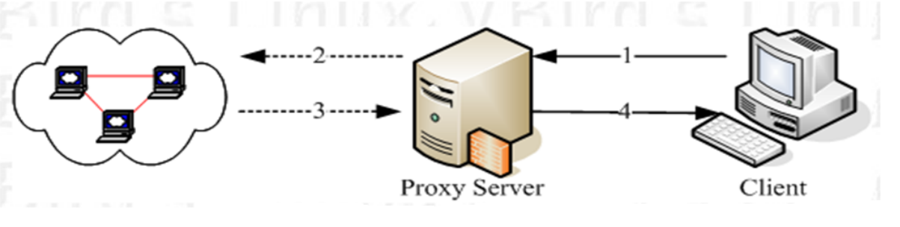

<center><font face="黑体" color="grey" size="6">Linux 防火墙介绍</font></center>

壹、贰、叁、肆、伍、陆、柒、捌、玖、拾、壹、贰、叁、肆、伍、陆、柒、捌、玖、拾、

# 1. 一. 防火墙概念

## 1.1. 安全技术概念

计算机领域的安全技术多种多样，广义上来说，一般有:入侵检测系统(Intrusion
Detection System)、入侵检测与防御系统(Intrusion Detection and Prevention
System)和防火墙技术(Firewall)。

### 1.1.1. 入侵检测系统

- 入侵检测与管理系统(Intrusion Detection Systems): 入侵检测系统(IDS)一般
  是一种硬件设备或软件应用程序，用于监控网络或系统中的恶意活动或违规行为。任何
  入侵活动或违规通常都会报告给管理员，或者使用安全信息和事件管理(SIEM)系统集中收集。
- IDS 特点是不阻断任何网络访问，只是量化、定位来自内外网络的威胁情况，主要
  以提供报告和事后监督为主，提供有针对性的指导措施和安全决策依据。一般采用旁路部署
  方式，即其部署不影响系统的运行和数据流量来往。
- IDS 可以用于单台计算机或大型网络。最常见的分类是:网络入侵检测系统(network
  intrusion detection systems (NIDS))和基于主机的入侵检测系统( host-based
  intrusion detection systems (HIDS))。例如: 用来监控操作系统的系统文件的 IDS
  就属于 HIDS；用来监测和分析网络流量的 IDS 就属于 NIDS。

### 1.1.2. 入侵防御系统

- 入侵预防系统(Intrusion Prevention System(IPS))，也称为入侵检测和预防系统(IDPS)，
  是监控网络或系统中可能出现的恶意活动的网络安全设备。入侵防御系统的主要功能是识别
  恶意活动，记录有关该活动的信息，报告并试图阻止或停止它。入侵防御系统被认为是入侵
  检测系统的扩展，因为它们同时监视网络流量和(或)系统活动的恶意活动。主要的区别在于，
  与入侵检测系统不同，入侵预防系统是在线放置的，能够主动防止或阻止被检测到的入侵。
  IPS 可以采取以下行动:发送警报、丢弃检测到的恶意数据包、重置连接或阻止来自违规
  IP 地址的流量。IPS 还可以纠正循环冗余校验(CRC)错误，整理数据包流，缓解 TCP 排序
  问题，清理不需要的传输层和网络层选项。
- 其特点是以透明模式工作，分析数据包的内容如：溢 攻击、拒绝服务攻击、木马、蠕虫、
  系统漏洞等进行准确的分析判断，在判定为攻击行为后立即予以阻断，主动而有效的保护网络
  的安全，一般采用在线部署方式。

### 1.1.3. 防火墙

#### 1.1.3.1. 防火墙概念

- 在计算机领域，防火墙(FireWall)就是基于预先定义的安全规则来监视和控制来往的
  网络流量的网络安全系统。防火墙的核心是隔离，其将受信任的内部网络和不受信任的
  外部网络隔离开。内部网络一般是公司的内部局域网，外部网络一般是 Internet。

- 一般防火墙工作在网络或主机边缘，对进出网络或主机的数据包基于一定的规则检查，
  并在匹配某规则时由规则定义的行为进行处理的一组功能的组件，基本上的实现都是默认
  情况下关闭所有的通过型访问，只开放允许访问的策略。

#### 1.1.3.2. 防火墙分类

按照防火墙的保护范围，防火墙通常被分为：
: 网络防火墙: 网络防火墙在两个或更多的网络间监控和过滤流量，运行在网络设备上。
网络防火墙保护的是防火墙某一侧的网络(一般是局域网络)。
: 主机防火墙: 主机防火墙运行在一般的电脑主机，并控制进出这些电脑的网络流量，
主机防火墙保护的范围是当前主机。

从实现方式上看，防火墙被分为：
: 硬件防火墙: 在专用硬件级别实现部分功能的防火墙；另一个部分功能基于软件实现，
如：华为，天融信 Checkpoint，NetScreen 等
: 软件防火墙: 运行于通用硬件平台上的防火墙应用软件，ISA --> Forefront TMG

从工作交互的网络协议层及划分：
: 网络层防火墙: 只可以和 OSI 模型下四层的协议交互
: 应用层防火墙: 运行应用层防火墙的设备可以叫代理服务器或代理网关，可以与 OSI
的七层协议交互。

- 在实际应用中，网络层防火墙具有包过滤功能，可以称其为包过滤防火墙，如下图
  
  防火墙在网络层对数据包进行选择，选择的依据是系统内设置的过滤逻辑，被称为访问
  控制列表（ACL），通过检查数据流中每个数据的源地址，目的地址，所用端口号和协议
  状态等因素，或他们的组合来确定是否允许该数据包通过
  **优点**：对用户来说透明，处理速度快且易于维护
  **缺点**：无法检查应用层数据，如病毒等
- 应用层防火墙可以检测并识别应用层协议，如下图:
  
  应用层防火墙/代理服务型防火墙，也称为代理服务器（Proxy Server)将所有跨越防火墙
  的网络通信链路分为两段内外网用户的访问都是通过代理服务器上的“链接”来实现
  **优点**：在应用层对数据进行检查，比较安全
  **缺点**：增加防火墙的负载
  **提示**：现实生产环境中所使用的防火墙一般都是二者结合体，即先检查网络数据，
  通过之后再送到应用层去检查

# 2. 二. Linux 防火墙基础

## 2.1. Linux 防火墙核心 Netfilter

> [Netfilter 官网文档](https://netfilter.org/documentation/)

> [Netfilter--WIKI](https://en.wikipedia.org/wiki/Netfilter)

- Netfilter 是 Linux 集成在内核的一个框架，它允许以自定义处理程序的形式实现
  各种与网络相关的操作(允许、丢弃或者修改数据包)。Netfilter 提供了包过滤(
  packet filtering)、网络地址转换(network address translation(NAT))和端口
  转换(port translation)等各种功能和操作，这些功能提供了在网络中重定向数据包
  和禁止数据包到达网络中的敏感位置所需的功能。
- Netfilter 代表了 Linux 内核中的一组`hooks`，其允许特定的内核模块向内核的
  网络堆栈注册回调函数。这些回调函数通常以过滤和修改规则的形式应用于流量，对
  于每个在网络堆栈中通过相应钩子的数据包都要调用这些回调函数[^1]。

Netfilter 比较重要的模块
: ip_tables
: ip6_tables
: arp_tables
: ebtables

- Netfilter 的组成


### 2.1.1. Netfilter 中的 hook 函数

- Netfilter 在内核中选取五个位置放了五个 hook("勾子") function(INPUT、OUTPUT、
  FORWARD、PREROUTING、POSTROUTING)，而这五个 hook function 向用户开放，
  用户可以通过一个命令工具(iptables)向其写入规则，规则由信息过滤表(table)组成，
  信息过滤表包含控制 IP 包处理的规则集(ruleset)，规则被分组放在(chain)上。
  

### 2.1.2. Netfilter 中的数据包流动

- 下图为比较详细的穿过 Netfilter 的网络数据包流图示


- PREROUTING: Packets will enter this chain before a routing decision is made.
- INPUT: Packet is going to be locally delivered. It does not have anything to
  do with processes having an opened socket; local delivery is controlled by
  the "local-delivery" routing table: ip route show table local.
- FORWARD: All packets that have been routed and were not for local delivery will
  traverse this chain.
- OUTPUT: Packets sent from the machine itself will be visiting this chain.
- POSTROUTING: Routing decision has been made. Packets enter this chain just
  before handing them off to the hardware.

三种数据包流动方向
: 流入本机:PREROUTING --> INPUT-->用户空间进程
: 流出本机:用户空间进程 -->OUTPUT--> POSTROUTING
: 转发:PREROUTING --> FORWARD --> POSTROUTING

### 2.1.3. Netfilter 小结

- 表(filter,nat,mangle,raw,security)定义规则(rules)，规则被组织在`chain`(链)中，预先
  定义的`chain`有五个(PREROUTING,INPUT,FORWARD,OUTPUT,POSTROUTING)，
  管理员可以使用工具如 iptables 来新增自定义的链。

## 2.2. Linux 防火墙工具

### 2.2.1. iptables

- iptables 是由软件包 iptables 提供的命令行工具

```bash
[root@centos7 ~]# rpm -qi iptables
Name        : iptables
Version     : 1.4.21
Release     : 33.el7
Architecture: x86_64
Install Date: Sun 15 Dec 2019 07:16:07 PM CST
Group       : System Environment/Base
Size        : 1555528
License     : GPLv2
Signature   : RSA/SHA256, Fri 23 Aug 2019 05:26:19 AM CST, Key ID 24c6a8a7f4a80eb5
Source RPM  : iptables-1.4.21-33.el7.src.rpm
Build Date  : Thu 08 Aug 2019 07:42:19 PM CST
Build Host  : x86-02.bsys.centos.org
Relocations : (not relocatable)
Packager    : CentOS BuildSystem <http://bugs.centos.org>
Vendor      : CentOS
URL         : http://www.netfilter.org/
Summary     : Tools for managing Linux kernel packet filtering capabilities
Description :
The iptables utility controls the network packet filtering code in the
Linux kernel. If you need to set up firewalls and/or IP masquerading,
you should install this package.
```

- iptables 是个工作在用户空间的工具软件，其允许系统管理员配置由 linux 内核防火墙
  (由多个 Netfilter 内核模块实现)提供的`表`，表中存有多个`链`和`规则`。也可以使用
  iptables 编写规则，写好的规则被送往 netfilter 内核模块，告诉内核如何去处理信息包。

- iptables 被用来处理 IPv4 协议，除了 iptables，还有处理其他协议的不同工具，每个工具
  对应内核中的一个模块，不同的内核模块和软件被用来处理不同的网络协议:

| 用户空间工具                                        | 内核模块   | 处理的协议               |
| --------------------------------------------------- | ---------- | ------------------------ |
| iptables                                            | ip_tables  | IPv4                     |
| ip6tables                                           | ip6_tables | IPv6                     |
| arptables                                           | arp_tables | ARP 地址解析协议         |
| ebtables                                            | ebtables   | Ethernet frames 以太网帧 |
| 以上四个模块是 Netfilter hook system 比较重要的模块 |

```bash
[root@centos7 ~]# ip6tables --version
ip6tables v1.4.21
[root@centos7 ~]# arptables --version
arptables v0.0.4
[root@centos7 ~]# ebtables --version
ebtables v2.0.10-4 (December 2011)
```

- **需要注意的是**：工具和内核模块可能同名，注意区分

### 2.2.2. firewalld

从 CentOS 7 版开始引入了新的前端管理工具

软件包：
: firewalld
: firewalld-config

管理工具：

: firewall-cmd 命令行工具
: firewall-config 图形工作

### 2.2.3. nftables

- 此软件是 CentOS 8 新特性，Nftables 最初在法国巴黎的 Netfilter Workshop 2008
  上发表，然后由长期的 netfilter 核心团队成员和项目负责人 Patrick McHardy 于 2009
  年 3 月发布。它在 2013 年末合并到 Linux 内核中，自 2014 年以来已在内核 3.13 中可用。
  它重用了 netfilter 框架的许多部分，例如连接跟踪和 NAT 功能。它还保留了命名法和基本
  iptables 设计的几个部分，例如表，链和规则。就像 iptables 一样，表充当链的容器，并且
  链包含单独的规则，这些规则可以执行操作，例如丢弃数据包，移至下一个规则或跳至新链。
- 从用户的角度来看，nftables 添加了一个名为 nft 的新工具，该工具替代了 iptables，
  arptables 和 ebtables 中的所有其他工具。从体系结构的角度来看，它还替换了内核中处理数据
  包过滤规则集运行时评估的那些部分。

# 3. 三. iptables 工具

## 3.1. iptables 组成

- 在 iptables 之前的 linux 防火墙管理工具为`ipchains`，同为一个作者开发[Rusty_Russell](https://en.wikipedia.org/wiki/Rusty_Russell)；
  在 centos8 中又引入了新的管理工具来代替 iptables，叫 nftables，三者和 linux 内核的关系
  及发行日期如下表：

| 用户空间工具                                                                           | 合并进 linux 时内核版本 | 发行日期                    | 作者                            |
| -------------------------------------------------------------------------------------- | ----------------------- | --------------------------- | ------------------------------- |
| ipfwadm                                                                                | Linux kernel 2.0.x      | 没查到，based on BSD's ipfw | FreeBSD volunteer staff members |
| ipchains                                                                               | Linux kernel 2.2 series | pre-1998                    | Rusty Russell                   |
| iptables                                                                               | Linux kernel 3.13       | 1998                        | Rusty Russell                   |
| nftables                                                                               | Linux kernel 3.13       | March 2009                  | The Netfilter Project           |
| 数据来源[^2]                                                                           |
| 实际上在 ipchains 出现之前也有相关的防火墙管理工具，ipchains 之前使用的工具为`ipfwadm` |

- iptables 也用来专指内核中的模块名，x_tables 就表示在内核中包含被四个模块(ip_tables,
  ip6_tables,arp_tables,ebtables)引用的共享代码和提供给其他扩展程序的 API 的模块。
  后来 Xtables 被用来代表整个 linux 的防火墙架构。在 centos 下可以看出 iptables 工具
  实际上是`xtables-multi`的软连接。

  ```bash
  [root@centos7 ~]# iptables --version
  iptables v1.4.21
  [root@centos7 ~]# ll `which iptables`
  lrwxrwxrwx. 1 root root 13 Dec 15 19:16 /usr/sbin/iptables -> xtables-multi

  [root@centos8 ~]# iptables --version
  iptables v1.8.2 (nf_tables)
  [root@centos8 ~]# ll `which iptables`
  lrwxrwxrwx. 1 root root 17 May 11 2019 /usr/sbin/iptables -> xtables-nft-multi
  ```

- iptables 由**五个表**和**五个链**以及一些**规则**组成，每个表的实现在内核中对应一个模块

| 表       | 内核模块               | 功能                                                                                                                                                         |
| -------- | ---------------------- | :----------------------------------------------------------------------------------------------------------------------------------------------------------- |
| raw      | iptable_raw module     | 关闭启用的连接跟踪机制(更消耗内存和时间)，加快封包穿越防火墙速度                                                                                             |
| mangle   | iptable_mangle module  | 修改数据标记位规则表，该操作使得后面的如 nat 和包过滤等动作可行                                                                                              |
| nat      | iptable_nat module     | network address translation 实现网络地址转换规则，用来评估是否以及如何修改数据包的原地址和目标地址，一般在无法直接访问某网络时用到，用来转发数据包到目的网络 |
| filter   | iptable_filter module  | 过滤规则表，根据预定义的规则过滤符合条件的数据包，即让该数据包继续到达其预定的目的地还是拒绝其请求                                                           |
| security | security_filter module | 用于强制访问控制（MAC）网络规则                                                                                                                              |

在数据包经过 Netfilter 的过程中，某些表会被首先执行，并对数据包做相应处理，使得接下
来的表能够正常处理和过滤包。因此表的调用和执行是由前后优先级关系的，一般的优先级
如下：
`security --> raw --> mangle --> nat --> filter`
security 最先，filter 最后执行。

五个内置的链 **chain**：
: INPUT
: OUTPUT
: FORWARD
: PREROUTING
: POSTROUTING

表和链的对引关系


数据包过滤匹配流程
: 黄色处理框--security 表
: 橙色处理框--raw 表
: 青色处理框--mangle 表
: 紫色处理框--nat 表
: 绿色处理框--filter 表


数据包大致传输过程

1. 当一个网络数据包进入网卡时，数据包首先进入 PREROUTING 链，内核根据数据包目的 IP 判断是否需
   要转送出去
2. 如果数据包就是进入本机的，数据包就会沿着图向下移动，到达 INPUT 链。数据包到达 INPUT 链
   后，任何进程都会收到它。本机上运行的程序可以发送数据包，这些数据包经过 OUTPUT 链，然后
   到达 POSTROUTING 链输出
3. 如果数据包是要转发出去的，且内核允许转发，数据包就会向右移动，经过 FORWARD 链，然后到
   达 POSTROUTING 链输出

## 3.2. iptables 规则

- 规则 rule：
  根据规则的匹配条件尝试匹配报文，对匹配成功的报文根据规则定义的处理动作作出处理，
  规则在链接上的次序即为其检查时的生效次序

- 匹配条件：默认为`与`条件，即同时满足
  `基本匹配`：IP，端口，TCP 的 Flags（SYN,ACK 等）
  `扩展匹配`：通过复杂高级功能匹配，需要指定特定的模块

- 规则要添加在链上，才生效；添加在自定义上不会自动生效
- 链 chain 有内置链和自定义链：
  `内置链`：每个内置链对应于一个钩子函数
  `自定义链`：用于对内置链进行扩展或补充，可实现更灵活的规则组织管理机制；只有
  Hook 钩子调用自定义链时，才生效

iptables 规则添加时需要考量的点

: 要实现哪种功能：判断添加在哪张表上
: 报文流经的路径：判断添加在哪个链上
: 报文的流向：判断源和目的
: 匹配规则：根据业务需要

## 3.3. iptables 用法说明

- 用法

```bash
iptables [-t table] {-A|-C|-D} chain rule-specification
ip6tables [-t table] {-A|-C|-D} chain rule-specification
iptables [-t table] -I chain [rulenum] rule-specification
iptables [-t table] -R chain rulenum rule-specification
iptables [-t table] -D chain rulenum
iptables [-t table] -S [chain [rulenum]]
iptables [-t table] {-F|-L|-Z} [chain [rulenum]] [options...]
iptables [-t table] -N chain
iptables [-t table] -X [chain]
iptables [-t table] -P chain target
iptables [-t table] -E old-chain-name new-chain-name
  rule-specification = [matches...] [target]
    match = -m matchname [per-match-options]
    target = -j targetname [per-target-options]
```

- Filter 表中的 INPUT 用法例子如下：
  

- iptables 命令使用
  `iptables [-t table] SUBCOMMAND chain [-m matchname [per-match-options]] -j targetname [per-target-options]`

1. 使用`-t table`指定表

表包括
: raw
: mangle
: nat
: filer
: security

2. 包括的子命令

- 管理类子命令
  -N：new, 自定义一条新的规则链
  -E：重命名自定义链；引用计数不为 0 的自定义链不能够被重命名，也不能被删除
  -X：delete，删除自定义的空的规则链
  -P：Policy，设置默认策略；对 filter 表中的链而言，其默认策略有：
  `ACCEPT`：接受
  `DROP`：丢弃
- 查看类子命令
  -L：list, 列出指定鏈上的所有规则，本选项须置后
  -n：numberic，以数字格式显示地址和端口号
  -v：verbose，详细信息
  -vv 更详细
  -x：exactly，显示计数器结果的精确值,而非单位转换后的易读值
  --line-numbers：显示规则的序号
  -S selected,以 iptables-save 命令格式显示链上规则
  常用组合
  `iptables -vnL`
  `iptables -vvnL --line-numbers`
- 规则管理类子命令
  -A：append，追加
  -I：insert, 插入，要指明插入至的规则编号，默认为第一条
  -D：delete，删除
  `(1) 可以指明规则序号`
  `(2) 可以指明规则本身`
  -R：replace，替换指定链上的指定规则编号
  -F：flush，清空指定的规则链
  -Z：zero，置零；iptables 的每条规则都有两个计数器
  `(1) 匹配到的报文的个数`
  `(2) 匹配到的所有报文的大小之和`

3. 预置的链 chain
   PREROUTING,INPUT,FORWARD,OUTPUT,POSTROUTING

4. 匹配条件

- 基本的匹配条件：通用的匹配参数`PARAMETERS`
- 扩展的匹配条件：需要加载额外的模块`MATCH EXTENTIONS`

5. 处理动作
   `-j targetname [pre-target-options]`
   简单：`ACCEPT`，`DROP`
   扩展：`REJECT`:`--reject-with:icmp-port-unreachable` 默认动作
   `RETURN`：返回调用链
   `REDIRECT`：端口重定向
   `LOG`：记录日志，dmesg
   `MARK`：做防火墙标记
   `DNAT`：目标地址转换
   `SNAT`：源地址转换
   `MASQUERADE`：地址伪装
   使用自定义链来处理

## 3.4. iptables 基本匹配条件

- 基本匹配条件：无需加载模块，由 iptables/netfilter 自行提供

```ruby
[!] -s, --source  address[/mask][,...]：匹配源IP地址或范围
[!] -d, --destination address[/mask][,...]：目标IP地址或范围
[!] -p, --protocol protocol：指定协议，可使用数字如0(all)
protocol:( tcp, udp, icmp, icmpv6, udplite,esp, ah, sctp, mh or "all")参看：/etc/protocols
[!] -i, --in-interface name：报文流入的接口；只能应用于数据报文流入环节，只应用于INPUT、FORWARD、PREROUTING链
[!] -o, --out-interface name：报文流出的接口；只能应用于数据报文流出的环节，只应用于 FORWARD、OUTPUT、POSTROUTING链
```

## 3.5. iptables 扩展匹配条件

- 扩展匹配条件：需要加载扩展模块(/usr/lib64/xtables/\*.so)，方可生效
- 扩展模块的查看帮助 ：man iptables-extensions
- 扩展匹配条件：
  `隐式扩展`
  `显式扩展`

### 3.5.1. 隐式扩展

- iptables 在使用-p 选项指明了特定的协议时，无需再用-m 选项指明扩展模块的
  扩展机制，不需要手动加载扩展模块
- tcp 协议的扩展选项
  [!] --source-port, --sport port[:port]：匹配报文源端口,可为端口范围
  [!] --destination-port,--dport port[:port]：匹配报文目标端口,可为范围
  [!] --tcp-flags mask comp
  `mask` 需检查的标志位列表，用,分隔
  例如 SYN,ACK,FIN,RST
  `comp` 在 mask 列表中必须为 1 的标志位列表，无指定则必须为 0，
  用逗号分隔 tcp 协议的扩展选项
  [!] --syn：用于匹配第一次握手, 相当于：--tcp-flags SYN,ACK,FIN,RST SYN
- 例如

```ruby
--tcp-flags  SYN,ACK,FIN,RST  SYN  表示要检查的标志位为SYN,ACK,FIN,RST四个，其中SYN必
须为1，余下的必须为0
--tcp-flags  SYN,ACK,FIN,RST  SYN,ACK
--tcp-flags ALL ALL  
--tcp_flags ALL NONE
```

- udp 协议的扩展选项
  [!] --source-port, --sport port[:port]：匹配报文的源端口或端口范围
  [!] --destination-port,--dport port[:port]：匹配报文的目标端口或端口范围
- icmp 协议的扩展选项
  [!] --icmp-type {type[/code]|typename}
  type/code
  0/0 echo-reply icmp 扩展匹配为应答的包
  8/0 echo-request icmp 扩展匹配为请求的包

### 3.5.2. 显式扩展及相关模块

- 显示扩展即必须使用-m 选项指明要调用的扩展模块名称，需要手动加载扩展模块
  `[-m matchname [per-match-options]]`

扩展模块帮助
: CentOS 6: man iptables
: CentOS 7,8: man iptables-extensions

#### 3.5.2.1 multiport 扩展

- 以离散方式定义多端口匹配,最多指定 15 个端口
  指定多个源端口
  `[!] --source-ports,--sports port[,port|,port:port]...`
  指定多个目标端口
  `[!] --destination-ports,--dports port[,port|,port:port]...`
  多个源或目标端
  `[!] --ports port[,port|,port:port]...`

- 例如
  `iptables -A INPUT -s 172.16.0.0/16 -d 172.16.100.10 -p tcp -m multiport --dports 20:22,80 -j ACCEPT`

#### 3.5.2.2 iprange 扩展

- 指明连续的（但一般不是整个网络）ip 地址范围
  源 IP 地址范围
  `[!] --src-range from[-to]`
  目标 IP 地址范围
  `[!] --dst-range from[-to]`

- 例如
  `iptables -A INPUT -d 172.16.1.100 -p tcp --dport 80 -m iprange --src-range 172.16.1.5-172.16.1.10 -j DROP`

#### 3.5.2.2 mac 扩展

- mac 模块可以指明源 MAC 地址,，适用于：PREROUTING, FORWARD，INPUT chains
  `[!] --mac-source XX:XX:XX:XX:XX:XX`
- 例如

```bash
iptables -A INPUT -s 172.16.0.100 -m mac  --mac-source  00:50:56:12:34:56 -j ACCEPT
iptables -A INPUT -s 172.16.0.100  -j REJECT
```

#### 3.5.2.2 string 扩展

- string 扩展用于对报文中的应用层数据做字符串模式匹配检测

```bash
--algo {bm|kmp} 字符串匹配检测算法
    bm：Boyer-Moore
    kmp：Knuth-Pratt-Morris
--from offset       开始偏移
--to offset         结束偏移
[!] --string pattern    要检测的字符串模式
[!] --hex-string pattern要检测字符串模式，16进制格式
```

- 例如

`iptables -A OUTPUT -p tcp --sport 80 -m string --algo bm --from 42 --string "google" -j REJECT`

#### 3.5.2.2 time 扩展

- 根据将报文到达的时间与指定的时间范围进行匹配

```bash
--datestart YYYY[-MM[-DD[Thh[:mm[:ss]]]]]  日期
--datestop YYYY[-MM[-DD[Thh[:mm[:ss]]]]]
--timestart hh:mm[:ss]        时间
--timestop hh:mm[:ss]
[!] --monthdays day[,day...]   每个月的几号
[!] --weekdays day[,day...]   星期几，1 – 7 分别表示星期一到星期日
--kerneltz：内核时区，不建议使用，CentOS 7系统默认为 UTC
注意： centos6 不支持kerneltz ，--localtz指定本地时区(默认)
```

- 例如

```bash
iptables -A INPUT -s 172.16.0.0/16 -d 172.16.100.10 -p tcp --dport 80 -m time --timestart 14:30 --timestop 18:30 --weekdays Sat,Sun --kerneltz -j DROP
```

**注意：CentOS 8 此模块有问题**

#### 3.5.2.2 connlimit 扩展

- 根据每客户端 IP 做并发连接数数量匹配可防止 Dos(Denial of Service，拒绝服务)攻击

```bash
--connlimit-upto #      ：连接的数量小于等于#时匹配
--connlimit-above #     ：连接的数量大于#时匹配
```

- 例如
  `iptables -A INPUT -d 172.16.100.10 -p tcp --dport 22 -m connlimit --connlimit above 2 -j REJECT`

#### 3.5.2.2 limit 扩展

- 基于收发报文的速率做匹 令牌桶过滤器

```bash
iptables -I INPUT -d 172.16.100.10 -p icmp --icmp-type 8 -m limit --limit 10/minute --limit-burst 5 -j ACCEPT
iptables -I INPUT 2 -p icmp -j REJECT
```

示例：

```bash
[root@fffffffff ~]# iptables -A INPUT -p icmp -m limit --limit-burst 10 --limit 20/minute -j ACCEPT
[root@fffffffff ~]# iptables -A INPUT -p icmp  -j REJECT
[root@fffffffff ~]# iptables -vnL
Chain INPUT (policy ACCEPT 54 packets, 4526 bytes)
 pkts bytes target     prot opt in     out     source               destination
   16  1344 ACCEPT     icmp --  *      *       0.0.0.0/0            0.0.0.0/0            limit: avg 20/min burst 10
    5   420 REJECT     icmp --  *      *       0.0.0.0/0            0.0.0.0/0            reject-with icmp-port-unreachable

[root@ppppppppp ~]# ping 172.20.1.207
PING 172.20.1.207 (172.20.1.207) 56(84) bytes of data.
64 bytes from 172.20.1.207: icmp_seq=1 ttl=64 time=1.35 ms
64 bytes from 172.20.1.207: icmp_seq=2 ttl=64 time=0.358 ms
64 bytes from 172.20.1.207: icmp_seq=3 ttl=64 time=1.80 ms
64 bytes from 172.20.1.207: icmp_seq=4 ttl=64 time=0.479 ms
64 bytes from 172.20.1.207: icmp_seq=5 ttl=64 time=0.196 ms
64 bytes from 172.20.1.207: icmp_seq=6 ttl=64 time=0.218 ms
64 bytes from 172.20.1.207: icmp_seq=7 ttl=64 time=0.274 ms
64 bytes from 172.20.1.207: icmp_seq=8 ttl=64 time=0.482 ms
64 bytes from 172.20.1.207: icmp_seq=9 ttl=64 time=0.311 ms
64 bytes from 172.20.1.207: icmp_seq=10 ttl=64 time=0.332 ms
64 bytes from 172.20.1.207: icmp_seq=11 ttl=64 time=0.323 ms
64 bytes from 172.20.1.207: icmp_seq=12 ttl=64 time=0.196 ms
64 bytes from 172.20.1.207: icmp_seq=13 ttl=64 time=1.16 ms
64 bytes from 172.20.1.207: icmp_seq=14 ttl=64 time=0.301 ms
From 172.20.1.207 icmp_seq=15 Destination Port Unreachable
64 bytes from 172.20.1.207: icmp_seq=16 ttl=64 time=0.451 ms
From 172.20.1.207 icmp_seq=17 Destination Port Unreachable
From 172.20.1.207 icmp_seq=18 Destination Port Unreachable
64 bytes from 172.20.1.207: icmp_seq=19 ttl=64 time=0.345 ms
From 172.20.1.207 icmp_seq=20 Destination Port Unreachable
From 172.20.1.207 icmp_seq=21 Destination Port Unreachable
^C
--- 172.20.1.207 ping statistics ---
21 packets transmitted, 16 received, +5 errors, 23% packet loss, time 20033ms
rtt min/avg/max/mdev = 0.196/0.536/1.801/0.457 ms
```

#### 3.5.2.2 state 扩展

- state 扩展模块，可以根据"连接追踪机制"去检查连接的状态，较耗资源，
  会消耗内存，使用 conntrack 机制：追踪本机上的请求和响应之间的关系

状态类型

: `NEW`：新发出请求；连接追踪信息库中不存在此连接的相关信息条目，因此，将其
识别为第一次发出的请求
: `ESTABLISHED`：NEW 状态之后，连接追踪信息库中为其建立的条目失效之前期间内
所进行的通信状态
: `RELATED`：新发起的但与已有连接相关联的连接，如：ftp 协议中的数据连接与命令
连接之间的关系
: `INVALID`：无效的连接，如 flag 标记不正确
: `UNTRACKED`：未进行追踪的连接，如 raw 表中关闭追踪

- 已经追踪到的并记录下来的连接信息库
  `/proc/net/nf_conntrack`

  ```bash
  [root@localhost ~]# cat   /proc/net/nf_conntrack
  ipv4     2 udp      17 17 src=172.20.4.115 dst=172.20.255.255 sport=138 dport=138 [UNREPLIED] src=172.20.255.255 dst=172.20.4.115 sport=138 dport=138 mark=0 zone=0 use=2
  ipv4     2 udp      17 29 src=172.20.1.11 dst=172.20.255.255 sport=137 dport=137 [UNREPLIED] src=172.20.255.255 dst=172.20.1.11 sport=137 dport=137 mark=0 zone=0 use=2
  ipv4     2 udp      17 28 src=172.20.0.25 dst=172.20.255.255 sport=138 dport=138 [UNREPLIED] src=172.20.255.255 dst=172.20.0.25 sport=138 dport=138 mark=0 zone=0 use=2
  ipv4     2 udp      17 20 src=172.20.4.121 dst=172.20.255.255 sport=138 dport=138 [UNREPLIED] src=172.20.255.255 dst=172.20.4.121 sport=138 dport=138 mark=0 zone=0 use=2
  ipv4     2 tcp      6 431999 ESTABLISHED src=172.20.1.207 dst=172.20.1.33 sport=22 dport=42838 src=172.20.1.33 dst=172.20.1.207 sport=42838 dport=22 [ASSURED] mark=0 zone=0 use=2
  ipv4     2 udp      17 7 src=172.20.30.30 dst=172.20.255.255 sport=137 dport=137 [UNREPLIED] src=172.20.255.255 dst=172.20.30.30 sport=137 dport=137 mark=0 zone=0 use=2
  ipv4     2 udp      17 29 src=172.20.12.12 dst=172.20.255.255 sport=137 dport=137 [UNREPLIED] src=172.20.255.255 dst=172.20.12.12 sport=137 dport=137 mark=0 zone=0 use=2
  ipv4     2 udp      17 8 src=172.20.30.30 dst=172.20.255.255 sport=57621 dport=57621 [UNREPLIED] src=172.20.255.255 dst=172.20.30.30 sport=57621 dport=57621 mark=0 zone=0 use=2
  ```

- 调整连接追踪功能所能够容纳的最大连接数量
  `/proc/sys/net/netfilter/nf_conntrack_max`

  ```bash
  [root@localhost ~]# cat   /proc/sys/net/netfilter/nf_conntrack_max
  65536
  ```

- 查看连接跟踪有多少条目
  `/proc/sys/net/netfilter/nf_conntrack_count`

  ```bash
  [root@localhost ~]# cat   /proc/sys/net/netfilter/nf_conntrack_count
  6
  ```

- 不同的协议的连接追踪时长
  `/proc/sys/net/netfilter/nf_conntrack_generic_timeout`

  ```bash
  [root@localhost ~]# cat   /proc/sys/net/netfilter/nf_conntrack_generic_timeout
  600
  ```

- 以上文件存在的前提是加载了`nf_conntrack_ipv4`模块
- iptables 的链接跟踪表最大容量为`/proc/sys/net/nf_conntrack_max`
- 当服务器连接多于最大连接数时会出现
  `kernel: ip_conntrack: table full, dropping packet` 错误
- 各种状态的超时后，相应的链接会从表中删除

连接过多的解决方案

1. 加大 nf_conntrack_max 值

```bash
vi /etc/sysctl.conf
net.nf_conntrack_max = 393216
net.netfilter.nf_conntrack_max = 393216
```

2. 降低 nf_conntrack timeout 时间

```bash
[root@localhost ~]# cat /proc/sys/net/netfilter/nf_conntrack_tcp_timeout_syn_sent
120
[root@localhost ~]# cat /proc/sys/net/netfilter/nf_conntrack_tcp_timeout_syn_recv
60
[root@localhost ~]# cat /proc/sys/net/netfilter/nf_conntrack_tcp_timeout_established
432000
[root@localhost ~]# cat /proc/sys/net/netfilter/nf_conntrack_tcp_timeout_fin_wait
120
[root@localhost ~]# cat /proc/sys/net/netfilter/nf_conntrack_tcp_timeout_close
nf_conntrack_tcp_timeout_close       nf_conntrack_tcp_timeout_close_wait
[root@localhost ~]# cat /proc/sys/net/netfilter/nf_conntrack_tcp_timeout_close_wait
60
[root@localhost ~]# cat /proc/sys/net/netfilter/nf_conntrack_tcp_timeout_close
10

[root@localhost ~]# vim /etc/sysctl.conf
net.netfilter.nf_conntrack_tcp_timeout_established = 300
net.netfilter.nf_conntrack_tcp_timeout_time_wait = 120
net.netfilter.nf_conntrack_tcp_timeout_close_wait = 60
net.netfilter.nf_conntrack_tcp_timeout_fin_wait = 120
[root@localhost ~]# iptables -t nat -L -n
```

- state 模块使用格式

`[!] --state state`

- 例子

```bash
iptables -A INPUT -d 172.16.1.10 -p tcp -m multiport --dports 22,80 -m state --state NEW,ESTABLISHED -j ACCEPT
iptables -A OUTPUT -s 172.16.1.10 -p tcp -m multiport --sports 22,80 -m state --state ESTABLISHED -j ACCEPT
```

- **示例** :开放被动模式的 ftp 服务
  1. 装载 ftp 连接追踪的专用模块：
     跟踪模块路径：/lib/modules/kernelversion/kernel/net/netfilter1
  ```bash
  vim /etc/sysconfig/iptables-config
  IPTABLES_MODULES=“nf_conntrack_ftp"
  modproble  nf_conntrack_ftp
  ```
  2. 放行请求报文：
     命令连接：NEW, ESTABLISHED
     数据连接：RELATED, ESTABLISHED
  ```bash
  iptables –I INPUT -d LocalIP -p tcp -m state --state ESTABLISHED,RELATED -j ACCEPT
  iptables -A INPUT -d LocalIP -p tcp --dport 21 -m state --state NEW -j ACCEPT
  ```
  3.  放行响应报文
  ```bash
  iptables -I OUTPUT -s LocalIP -p tcp -m state --state ESTABLISHED -j ACCEPT
  ```
  具体操作：
  ```bash
  yum install vsftpd
  systemctl start vsftpd
  modprobe nf_conntrack_ftp
  iptables -F
  iptables -A INPUT   -m state --state ESTABLISHED,RELATED -j ACCEPT
  iptables -A INPUT -p tcp --dport 21 -m state --state NEW -j ACCEPT
  iptables -A OUTPUT  -m state --state ESTABLISHED -j ACCEPT
  iptables -P INPUT DROP
  iptables -P OUTPUT DROP
  iptables -vnL
  ```

## 3.6. Target

- targe 包括以下类型

```ruby
ACCEPT， DROP， REJECT， RETURN，LOG， SNAT， DNAT， REDIRECT， MASQUERADE，...
LOG：非中断target,本身不拒绝和允许,放在拒绝和允许规则前，并将日志记录在/var/log/messages系
统日志中
--log-level level    级别： debug，info，notice, warning, error, crit, alert,emerg
--log-prefix prefix 日志前缀，用于区别不同的日志，最多29个字符
```

- 例

`iptables -I INPUT -s 10.0.1.0/24 -p tcp -m multiport --dports 80,21,22,23 -m state --state NEW -j LOG --log-prefix "new connections: "`

- 示例

```bash
[root@centos8 ~]#iptables -R INPUT 2 -p tcp --dport 21 -m state --state NEW -j
LOG --log-prefix "ftp new link: "
[root@centos8 ~]#tail -f /var/log/messages
Dec 21 10:02:31 centos8 kernel: ftp new link: IN=eth0 OUT=
MAC=00:0c:29:f9:8d:90:00:0c:29:10:8a:b1:08:00 SRC=192.168.39.6 DST=192.168.39.8
LEN=60 TOS=0x00 PREC=0x00 TTL=64 ID=15556 DF PROTO=TCP SPT=53706 DPT=21
WINDOW=14600 RES=0x00 SYN URGP=0
```

## 3.7. 规则优化最佳做法

1. 安全放行所有入站和出站的状态为 ESTABLISHED 状态连接,建议放在第一条
2. 谨慎放行入站的新请求
3. 有特殊目的限制访问功能，要在放行规则之前加以拒绝
4. 同类规则（访问同一应用），匹配范围小的放在前面，用于特殊处理
5. 不同类的规则（访问不同应用），匹配范围大的放在前面
6. 应该将那些可由一条规则能够描述的多个规则合并为一条
7. 设置默认策略，建议白名单（只放行特定连接）
   iptables -P，不建议
   规则的最后定义规则做为默认策略，推荐使用，放在最后一条

## 3.8. iptables 规则保存

- 使用 iptables 命令定义的规则，手动删除之前，其生效期限为 kernel 存活期限

- 持久保存规则：
  - CentOS 7,8
    `iptables-save > /PATH/TO/SOME_RULES_FILE`
  - CentOS 6
  ```bash
  # 将规则覆盖保存至/etc/sysconfig/iptables文件中
  service  iptables  save
  ```
- 加载规则

  - CentOS 7 重新载入预存规则文件中规则：  
     `iptables-restore < /PATH/FROM/SOME_RULES_FILE`
    -n, --noflush：不清除原有规则
    -t, --test：仅分析生成规则集，但不提交
  - CentOS 6
    ```bash
    # 会自动从/etc/sysconfig/iptables 重新载入规则
    service  iptables  restart
    ```

- 开机自动重载规则
  - 用脚本保存各 iptables 命令；让此脚本开机后自动运行
    /etc/rc.d/rc.local 文件中添加脚本路径 /PATH/TO/SOME_SCRIPT_FILE
  - 用规则文件保存各规则，开机时自动载入此规则文件中的规则
    在/etc/rc.d/rc.local 文件添加
    `iptables-restore < /PATH/FROM/IPTABLES_RULES_FILE`
  - 定义 Unit File, CentOS 7，8 可以安装 iptables-services 实现 iptables.service
    ```bash
    yum install iptables-services
    iptables-save > /etc/sysconfig/iptables
    systemctl enable iptables.service
    ```

## 3.9. Netfilter 防火墙

### 3.9.1 Netfilter 防火墙

- iptables/netfilter 利用 filter 表的 FORWARD 链,可以充当网络防火墙：

- 注意
  - 1.请求-响应报文均会经由 FORWARD 链，要注意规则的方向性
  - 2.如果要启用 conntrack 机制，建议将双方向的状态为 ESTABLISHED 的报文直接放行

### 3.9.2 NAT 表

- NAT: 网络地址转换(network address translation)，支持 PREROUTING，INPUT，
  OUTPUT，POSTROUTING 四个链

- 请求报文：修改源/目标 IP，由定义决定如何修改
- 响应报文：修改源/目标 IP，根据跟踪机制自动实现

NAT 的实现分为下面类型：
: SNAT：source NAT ，支持 POSTROUTING, INPUT，让本地网络中的主机通过某一
特定地址访问外部网络，实现地址伪装。请求报文：修改源 IP
: DNAT：destination NAT 支持 PREROUTING , OUTPUT，把本地网络中的主机上的
某服务开放给外部网络访问(发布服务和端口映射)，但隐藏真实 IP。请求报文：修改
目标 IP
: PNAT: port nat，端口和 IP 都进行修改

### 3.9.3 SNAT 实现

- SNAT：基于 nat 表的 target，适用于固定的公网 IP
- SNAT 选项：
  --to-source [ipaddr[-ipaddr]][:port[-port]]
  --random
  `iptables -t nat -A POSTROUTING -s LocalNET ! -d LocalNet -j SNAT --to-source ExtIP`
- 例:10.0.1.0/24 网段的主机访问外部网络时，IP 数据包源地址被替换为
  172.18.1.6-172.18.1.6 中的某一个地址
  `iptables -t nat -A POSTROUTING -s 10.0.1.0/24 ! –d 10.0.1.0/24 -j SNAT --to-source 172.18.1.6-172.18.1.9`

- 另一个 target 为`MASQUERADE`，适用于动态的公网 IP，如拨号网络
- MASQUERADE 选项：
  --to-ports port[-port]
  --random
  `iptables -t nat -A POSTROUTING -s LocalNET ! -d LocalNet -j MASQUERADE`
- 例
  `iptables -t nat -A POSTROUTING -s 10.0.1.0/24 ! –d 10.0.1.0/24 -j MASQUERADE`

### 3.9.3 DNAT 实现

- DNAT：nat 表的 target，适用于端口映射
- DNAT 选项
  --to-destination [ipaddr[-ipaddr]][:port[-port]]
  `iptables -t nat -A PREROUTING -d ExtIP -p tcp|udp --dport PORT -j DNAT --to- destination InterSeverIP[:PORT]`

- 例如

```bash
iptables -t nat -A PREROUTING -s 0/0 -d 172.18.100.6 -p tcp --dport 22 -j DNAT --to-destination 10.0.1.22
iptables -t nat -A PREROUTING -s 0/0 -d 172.18.100.6 -p tcp --dport 80 -j DNAT --to-destination 10.0.1.22:8080
```

### 3.9.4 转发 REDIRECT

- REDIRECT，是 NAT 表的 target，通过改变目标 IP 和端口，将接受的包转发至同一个主机
  的不同端口，可用于 PREROUTING OUTPUT 链
- REDIRECT 选项：
  --to-ports port[-port]
- 例

`iptables -t nat -A PREROUTING -d 172.16.100.10 -p tcp --dport 80 -j REDIRECT --to-ports 8080`

## 3.10. 示例

- 下面为 Netfilter 配合 iptables 实现基本的防火墙的实际应用

```bash
# Generated by iptables-save v1.4.7 on Wed May 18 09:22:34 2016
*filter
:INPUT ACCEPT [85890:4530430]
:FORWARD ACCEPT [76814:55698470]
:OUTPUT ACCEPT [166620:238017546]
-A FORWARD -s 172.16.0.100/32 -j ACCEPT
-A FORWARD -s 172.16.0.200/32 -j ACCEPT
-A FORWARD -s 172.16.0.67/32 -j ACCEPT
#WANG   ADD NEXT LINE IN  20170627
#-A FORWARD -s 172.16.0.0/16 -j ACCEPT
#WANG   ADD NEXT LINE IN 20170704
#-A FORWARD -s 172.18.0.0/16 -j ACCEPT
#-A FORWARD -s 172.18.0.0/16 -j REJECT
#-A FORWARD -s 172.16.0.68/32 -j ACCEPT
#-A FORWARD -s 172.16.0.69/32 -j ACCEPT
#-A FORWARD -s 172.16.0.6/32 -j ACCEPT
-A FORWARD -s 172.17.200.200/32 -j ACCEPT
-A FORWARD -s 172.17.136.136/32 -j ACCEPT
-A FORWARD -s 172.17.0.100/32 -j ACCEPT
-A FORWARD -s 172.18.100.1/32 -j ACCEPT
-A FORWARD -s 172.18.0.100/32 -j ACCEPT
-A FORWARD -s 172.18.200.2/32 -j ACCEPT
-A FORWARD -s 172.18.200.3/32 -j ACCEPT
-A FORWARD -s 172.18.211.211/32 -j ACCEPT
-A FORWARD -s 172.18.212.212/32 -j ACCEPT
-A FORWARD -m iprange --src-range 172.16.0.100-172.16.0.110 -j ACCEPT
-A FORWARD -m iprange --src-range 172.17.0.100-172.17.0.110 -j ACCEPT
-A FORWARD -m iprange --src-range 172.18.0.100-172.18.0.110 -j ACCEPT
-A FORWARD -m iprange --src-range 172.17.100.6-172.17.100.16 -j ACCEPT
-A FORWARD -m iprange --src-range 172.18.100.61-172.18.100.70 -j ACCEPT
-A FORWARD -s 172.16.0.0/16 -m string --string "verycd.com" --algo kmp --to
65535 -j REJECT --reject-with icmp-port-unreachable
-A FORWARD -s 172.16.0.0/16 -m string --string "tudou.com" --algo kmp --to 65535
-j REJECT --reject-with icmp-port-unreachable
-A FORWARD -s 172.16.0.0/16 -m string --string "youku.com" --algo kmp --to 65535
-j REJECT --reject-with icmp-port-unreachable
-A FORWARD -s 172.16.0.0/16 -m string --string "iqiyi.com" --algo kmp --to 65535
-j REJECT --reject-with icmp-port-unreachable
-A FORWARD -s 172.16.0.0/16 -m string --string "pptv.com" --algo kmp --to 65535
-j REJECT --reject-with icmp-port-unreachable
-A FORWARD -s 172.16.0.0/16 -m string --string "letv.com" --algo kmp --to 65535
-j REJECT --reject-with icmp-port-unreachable
-A FORWARD -s 172.16.0.0/16 -m string --string "xunlei.com" --algo kmp --to
65535 -j REJECT --reject-with icmp-port-unreachable
-A FORWARD -s 172.18.0.0/16 -m string --string "verycd.com" --algo kmp --to
65535 -j REJECT --reject-with icmp-port-unreachable
-A FORWARD -s 172.18.0.0/16 -m string --string "tudou.com" --algo kmp --to 65535
-j REJECT --reject-with icmp-port-unreachable
-A FORWARD -s 172.18.0.0/16 -m string --string "youku.com" --algo kmp --to 65535
-j REJECT --reject-with icmp-port-unreachable
-A FORWARD -s 172.18.0.0/16 -m string --string "iqiyi.com" --algo kmp --to 65535
-j REJECT --reject-with icmp-port-unreachable
-A FORWARD -s 172.18.0.0/16 -m string --string "pptv.com" --algo kmp --to 65535
-j REJECT --reject-with icmp-port-unreachable
-A FORWARD -s 172.18.0.0/16 -m string --string "letv.com" --algo kmp --to 65535
-j REJECT --reject-with icmp-port-unreachable
-A FORWARD -s 172.18.0.0/16 -m string --string "xunlei.com" --algo kmp --to
65535 -j REJECT --reject-with icmp-port-unreachable
#-A FORWARD -s 172.18.0.0/16 -j REJECT
#-A FORWARD -s 172.16.0.0/16 -j REJECT
#-A FORWARD  -i ppp0 -m string --string ".exe" --algo bm --to 65535 -j REJECT --
reject-with icmp-port-unreachable
-A FORWARD -s 172.18.0.0/16 -m time --timestart 08:50:00 --timestop 18:00:00 --
weekdays Mon,Wed,Fri  --datestop 2038-01-19T11:14:07 -j REJECT --reject-with
icmp-port-unreachable
-A FORWARD -s 172.17.0.0/16 -m time --timestart 08:50:00 --timestop 18:00:00 --
weekdays Mon,Wed,Fri  --datestop 2038-01-19T11:14:07 -j REJECT --reject-with
icmp-port-unreachable
-A FORWARD -s 172.16.0.0/16 -m time --timestart 08:50:00 --timestop 12:30:00 --
weekdays Tue,Thu,Sat  --datestop 2038-01-19T11:14:07 -j REJECT --reject-with
icmp-port-unreachable
-A FORWARD -s 172.16.0.0/16 -m time --timestart 13:50:00 --timestop 18:00:00 --
weekdays Tue,Thu,Sat  --datestop 2038-01-19T11:14:07 -j REJECT --reject-with
icmp-port-unreachable
#wang next 2 lines changed in  20170619
#-A FORWARD -s 172.17.0.0/16 -m time --timestart 08:50:00 --timestop 12:30:00 --
weekdays Mon,Wed,Fri  --datestop 2038-01-19T11:14:07 -j REJECT --reject-with
icmp-port-unreachable
#-A FORWARD -s 172.17.0.0/16 -m time --timestart 13:30:00 --timestop 18:10:00 --
weekdays Mon,Wed,Fri  --datestop 2038-01-19T11:14:07 -j REJECT --reject-with
icmp-port-unreachable
#-A FORWARD -s 172.18.0.0/16 -m time --timestart 08:50:00 --timestop 18:10:00 --
weekdays Mon,Wed,Fri  --datestop 2038-01-19T11:14:07 -j REJECT --reject-with
icmp-port-unreachable
#-A FORWARD -s 172.18.0.0/16 -m time --timestart 08:50:00 --timestop 18:10:00 --
weekdays Tue,Thu --datestop 2038-01-19T11:14:07 -j REJECT --reject-with icmp-
port-unreachable
COMMIT
# Completed on Wed May 18 09:22:34 2016
# Generated by iptables-save v1.4.7 on Wed May 18 09:22:34 2016
*nat
:PREROUTING ACCEPT [1429833:65427211]
:POSTROUTING ACCEPT [850518:35452195]
:OUTPUT ACCEPT [120198:9146655]
-A POSTROUTING -s 172.16.0.100/32 -j MASQUERADE
-A POSTROUTING -s 172.18.0.100/32 -j MASQUERADE
#-A POSTROUTING -s 172.16.0.200/32 -j MASQUERADE
#wang  add next 1 line in 20170619
#wang  add next 1 line in 20170704
-A POSTROUTING -s 172.16.0.69/32 -j MASQUERADE
-A POSTROUTING -s 172.17.200.200/32 -j MASQUERADE
-A POSTROUTING -s 172.17.136.136/32 -j MASQUERADE
-A POSTROUTING -s 172.17.0.100/32 -j MASQUERADE
#-A POSTROUTING -s 172.18.0.0/16 -j MASQUERADE
#-A POSTROUTING -s 172.16.0.6/32 -j MASQUERADE
-A POSTROUTING -m iprange --src-range 172.16.0.100-172.16.0.110 -j MASQUERADE
-A POSTROUTING -m iprange --src-range 172.17.0.100-172.17.0.110 -j MASQUERADE
-A POSTROUTING -m iprange --src-range 172.18.0.100-172.18.0.110 -j MASQUERADE
-A POSTROUTING -s 172.16.0.0/16 -p tcp -m multiport --dports 80,443,53,22,6666 -
j MASQUERADE
-A POSTROUTING -s 172.16.0.0/16 -p udp -m multiport --dports 22 -j MASQUERADE
-A POSTROUTING -s 172.17.0.0/16 -p tcp -m multiport --dports 80,443,53,22,6666 -
j MASQUERADE
-A POSTROUTING -s 172.17.0.0/16 -p udp -m multiport --dports 22 -j MASQUERADE
-A POSTROUTING -s 172.18.0.0/16 -p tcp -m multiport --dports
80,443,53,22,6666,1206,5938,1949 -j MASQUERADE
-A POSTROUTING -s 172.18.0.0/16 -p udp -m multiport --dports 22,1206,5938,1949 -
j MASQUERADE
COMMIT
# Completed on Wed May 18 09:22:34 2016
```

# 4. 四.firewalld 服务

## 4.1. firewalld 简介

- firewalld 是用于 Linux 操作系统的防火墙管理工具。它通过名为 nftables 的用户空间工具
  为 Linux 内核的 netfilter 框架充当前端管理工具，其作为 nft 命令行程序的替代，从而提供
  防火墙特性。firewalld 的名称遵循了 Unix 中为系统守护进程命名的惯例，它附加了字母“d”。

firewalld

: firewalld 是 CentOS 7.0 新推出的管理 netfilter 的工具
: firewalld 是配置和监控防火墙规则的系统守护进程。可以实 iptables,ip6tables,
: arptables,ebtables 的功能
: firewalld 服务由 firewalld 包提供
: firewalld 支持划分区域 zone,每个 zone 可以设置独立的防火墙规则

数据包归入`zone`的顺序

1. 先根据数据包中源地址，将其纳为某个 zone
2. 纳为网络接口所属 zone
3. 纳入默认 zone，默认为 public zone,管理员可以改为其它 zone
   网卡默认属于 public zone,lo 网络接口属于 trusted zone

- firewalld zone 分类

| zone 名称 | 默认配置                                                                                                                                 |
| --------- | :--------------------------------------------------------------------------------------------------------------------------------------- |
| trusted   | 允许所有流量                                                                                                                             |
| home      | 拒绝除和传出流量相关的，以及 ssh,mdsn,ipp-client,samba-client,dhcpv6-client 预定义服务之外其它所有传入流量                               |
| internal  | 和 home 相同                                                                                                                             |
| work      | 拒绝除和传出流量相关的，以及 ssh,ipp-client,dhcpv6-client 预定义服务之外的其 所有传入流量                                                |
| public    | 拒绝除和传出流量相关的，以及 ssh,dhcpv6-client 预定义服务之外的其它所有传入流量，新加的网卡默认属于 public zone                          |
| externa   | 拒绝除和传出流量相关的，以及 ssh 预定义服务之外的其它所有传入流量，属于 external zone 的传出 ipv4 流量的源地址将被伪装为传出网卡的地址。 |
| dmz       | 拒绝除和传出流量相关的，以及 ssh 预定义服务之外的其它所有传入流量                                                                        |
| block     | 拒绝除和传出流量相关的所有传入流量                                                                                                       |
| drop      | 拒绝除和传出流量相关的所有传入流量（甚至不以 ICMP 错误进行回应）                                                                         |

- 预定义的服务

| 服务名称      | 配置                                                                         |
| ------------- | :--------------------------------------------------------------------------- |
| ssh           | Local SSH server. Traffic to 22/tcp                                          |
| dhcpv6-client | Local DHCPv6 client. Traffic to 546/udp on the fe80::/64 IPv6 network        |
| ipp-client    | Local IPP printing. Traffic to 631/udp.                                      |
| samba-client  | Local Windows file and print sharing client. Traffic to 137/udp and 138/udp. |
| mdns          | Multicast DNS (mDNS) local-link name resolution. Traffic to 5353/udp to the  |

224.0.0.251 (IPv4) or ff02::fb (IPv6) multicast addresses.

- firewalld 预定义服务配置
  `firewall-cmd --get-services` 查看预定义服务列表
  `/usr/lib/firewalld/services/\*.xml` 预定义服务的配置

- firewalld 三种配置方法
  `firewall-config`（firewall-config 包）图形工具
  `firewall-cmd` （firewalld 包）命令行工具
  `/etc/firewalld` 配置文件，一般不建议

## 4.2. firewall-cmd 命令

- 用法
  `firewall-cmd [OPTIONS...]`

- 选项

```bash
--get-zones  列出所有可用区域
--get-default-zone 查询默认区域
--set-default-zone= 设置默认区域
--get-active-zones 列出当前正使用的区域
--add-source=[--zone=] 添加源地址的流量到指定区域，如果无--zone= 选项，使用默认区域
--remove-source= [--zone=] 从指定区域删除源地址的流量，如无--zone= 选项，使用默认区域
--add-interface=[--zone=] 添加来自于指定接口的流量到特定区域，如果无--zone= 选项，使用默认区域
--change-interface=[--zone=] 改变指定接口至新的区域，如果无--zone= 选项，使用默认区域
--add-service= [--zone=] 允许服务的流量通过，如果无--zone= 选项，使用默认区域
--add-port=<PORT/PROTOCOL>[--zone=] 允许指定端口和协议的流量，如果无--zone= 选项，使用默认区域
--remove-service= [--zone=] 从区域中删除指定服务，禁止该服务流量，如果无--zone= 选项，使用认区域
--remove-port=<PORT/PROTOCOL>[--zone=] 从区域中删除指定端口和协议，禁止该端口的流量，如果无--zone= 选项，使用默认区域
--reload 删除当前运行时配置，应用加载永久配置
--list-services  查看开放的服务
--list-ports   查看开放的端口
--list-all [--zone=]  列出指定区域的所有配置信息，包括接口，源地址，端口，服务等，如果无--zone=选项，使用默认区域
```

- 例如

```bash
# 查看默认zone
firewall-cmd --get-default-zone
# 默认zone设为dmz
firewall-cmd --set-default-zone=dmz
# 在internal zone中增加源地址192.168.0.0/24的永久规则
firewall-cmd --permanent --zone=internal  --add-source=192.168.0.0/24
# 在internal zone中增加协议mysql的永久规则
firewall-cmd --permanent –zone=internal  --add-service=mysql
# 加载新规则以生效
firewall-cmd  --reload
```

- 范例：配置 firewalld

```bash
systemctl mask iptables
systemctl mask ip6tables
systemctl status firewalld
systemctl enable firewalld
systemctl start firewalld
firewall-cmd  --get-default-zone
firewall-cmd  --set-default-zone=public
firewall-cmd  --permanent  --zone=public  --list-all
firewall-cmd  --permanent  --zone=public  --add-port  8080/tcp
firewall-cmd   ---reload
```

## 4.3. 规则

- 当基本 firewalld 语法规则不能满足要求时，可以使用以下更复杂的规则
  rich-rules 富规则，功能强,表达性语言
  Direct configuration rules 直接规则，灵活性差, 帮助：man 5 firewalld.diret

### 4.3.1. rich 规则管理

- rich 规则比基本的 firewalld 语法实现更强的功能，不仅实现允许/拒绝，
  还可以实现日志 syslog 和 auditd，也可以实现端口转发，伪装和限制速率

规则实施顺序
: 1. 该区域的端口转发，伪装规则
: 2. 该区域的日志规则
: 3. 该区域的允许规则
: 4. 该区域的拒绝规则

- 每个匹配的规则生效，所有规则都不匹配，该区域默认规则生效
- rich 语法：`man 5 firewalld.richlanguage`

```ini
rule
  [source]
  [destination]
  service|port|protocol|icmp-block|masquerade|forward-port
  [log]
  [audit]
  [accept|reject|drop]
```

- rich 规则选项

| 选项                  | 描述                                                                                                                                       |
| --------------------- | :----------------------------------------------------------------------------------------------------------------------------------------- |
| --add-rich-rule=''    | Add to the specified zone, or the default zone if no zone is specified.                                                                    |
| --remove-rich-rule='' | Remove to the specified zone, or the default zone if no zone is specified.                                                                 |
| --query-rich-rule=''  | Query if has been added to the specified zone, or the default zone if no zone is specified. Returns 0 if the rule is present, otherwise 1. |
| --list-rich-rules     | Outputs all rich rules for the specified zone, or the default zone if no zone is specified.                                                |

### 4.3.2. rich 规则实现

- 拒绝从 192.168.0.11 的所有流量，当 address 选项使用 source 或 destination 时，必须用 family= ipv4
  |ipv6
  `firewall-cmd --permanent --zone=public --add-rich-rule='rule family=ipv4 source address=192.168.0.11/32 reject'`

- 限制每分钟只有两个连接到 ftp 服务
  `firewall-cmd --add-rich-rule=‘rule service name=ftp limit value=2/m accept’`

- 抛弃 esp（ IPsec 体系中的一种主要协议）协议的所有数据包
  `firewall-cmd --permanent --add-rich-rule='rule protocol value=esp drop'`

- 接受所有 192.168.1.0/24 子网端口 5900-5905 范围的 TCP 流量
  `firewall-cmd --permanent --zone=vnc --add-rich-rule='rule family=ipv4 source address=192.168.1.0/24 port port=5900-5905 protocol=tcp accept'`

- rich 日志规则

```xml
log [prefix="<PREFIX TEXT>" [level=<LOGLEVEL>] [limit value="<RATE/DURATION>"]

<LOGLEVEL> 可以是emerg,alert, crit, error, warning, notice, info, debug.
<DURATION> s：秒, m：分钟, h：小时, d：天
audit [limit value="<RATE/DURATION>"]
```

- rich 日志例子

```bash
# 接受ssh新连接，记录日志到syslog的notice级别，每分钟最多三条信息
firewall-cmd --permanent --zone=work --add-rich-rule='rule service name="ssh"
log prefix="ssh " level="notice" limit value="3/m" accept

# 从2001:db8::/64子网的DNS连接在5分钟内被拒绝，并记录到日志到audit,每小时最大记录一条信息
firewall-cmd --add-rich-rule='rule family=ipv6 source address="2001:db8::/64"
service name="dns" audit limit value="1/h" reject' --timeout=300

firewall-cmd --permanent --add-rich-rule='rule family=ipv4 source
address=172.25.X.10/32 service name="http" log level=notice prefix="NEW HTTP "
limit value="3/s" accept'
firewall-cmd --reload
tail -f /var/log/messages
curl http://serverX.example.com
```

### 4.3.3. 伪装和端口转发

- NAT 网络地址转换，firewalld 支持伪装和端口转发两种 NAT 方式
- 伪装 NAT

```bash
firewall-cmd --permanent --zone=<ZONE> --add-masquerade
firewall-cmd --query-masquerade  # 检查是否允许伪装
firewall-cmd --add-masquerade   # 允许防火墙伪装IP
firewall-cmd --remove-masquerade # 禁止防火墙伪装IP
```

- 例

`firewall-cmd --add-rich-rule='rule family=ipv4 source address=192.168.0.0/24 masquerade'`

- 端口转发
  端口转发：将发往本机的特定端口的流量转发到本机或不同机器的另一个端口。通常要
  配合地址伪装 能实现
  `firewall-cmd --permanent --zone=<ZONE> --add-forward-port=port=<PORTNUMBER>:proto=<PROTOCOL>[:toport=<PORTNUMBER>][:toaddr=]`
  说明：toport= 和 toaddr= 至少要指定一个
- 范例：

```bash
# 转发传入的连接9527/TCP，到防火墙的80/TCP到public zone 的192.168.0.254
firewall-cmd --add-masquerade  启用伪装
firewall-cmd --zone=public --add-forward-
port=port=9527:proto=tcp:toport=80:toaddr=192.168.0.254
```

- rich 规则的 port 转发语法：
  `forward-port port=<PORTNUM> protocol=tcp|udp [to-port=<PORTNUM>] [to-addr=<ADDRESS>]`

- 例子

```bash
# 转发从192.168.0.0/24来的，发往80/TCP的流量到防火墙的端口8080/TCP
firewall-cmd --zone=work --add-rich-rule='rule family=ipv4 source
address=192.168.0.0/24 forward-port port=80 protocol=tcp to-port=8080'
firewall-cmd --permanent --add-rich-rule 'rule family=ipv4 source
address=172.25.X.10/32 forward-port port=443 protocol=tcp to-port=22'
firewall-cmd --reload
ssh -p 443 serverX.example.com
```

- 限制 ssh 服务非标准端口访问

```bash
cp /usr/lib/firewalld/services/ssh.xml /etc/firewalld/services/ssh.xml
vim /etc/firewalld/services/ssh.xml
<port protocol="tcp" port="999"/>
systemctl restart sshd.service
systemctl status -l sshd.service
sealert -a /var/log/audit/audit.log
semanage port -a -t ssh_port_t -p tcp 999
systemctl restart sshd.service
ss -tulpn | grep sshd
firewall-cmd --permanent --zone=work --add-source=172.25.X.0/24
firewall-cmd --permanent --zone=work --add-port=999/tcp
firewall-cmd --reload
```

# 5. 五.总结

## 5.1 总结

略

## 5.2 练习

说明：以下练习 INPUT 和 OUTPUT 默认策略均为 DROP
1、限制本地主机的 web 服务器在周一不允许访问；新请求的速率不能超过 100 个每秒；
web 服务器包含了 admin 字符串的页面不允许访问；web 服务器仅允许响应报文离开本机
2、在工作时间，即周一到周五的 8:30-18:00，开放本机的 ftp 服务给 172.16.0.0
网络中的主机访问；数据下载请求的次数每分钟不得超过 5 个
3、开放本机的 ssh 服务给 172.16.x.1-172.16.x.100 中的主机，x 为你的学号，新请求
建立的速率一分钟不得超过 2 个；仅允许响应报文通过其服务端口离开本机
4、拒绝 TCP 标志位全部为 1 及全部为 0 的报文访问本机
5、允许本机 ping 别的主机；但不开放别的主机 ping 本机
6、判断下述规则的意义

```bash
iptables -N clean_in
iptables -A clean_in -d 255.255.255.255 -p icmp -j DROP
iptables -A clean_in -d 172.16.255.255 -p icmp -j DROP
iptables -A clean_in -p tcp ! --syn -m state --state NEW -j DROP
iptables -A clean_in -p tcp --tcp-flags ALL ALL -j DROP
iptables -A clean_in -p tcp --tcp-flags ALL NONE -j DROP
iptables -A clean_in -d 172.16.100.7 -j RETURN
iptables -A INPUT -d 172.16.100.7 -j clean_in
iptables -A INPUT  -i lo -j ACCEPT
iptables -A OUTPUT -o lo -j ACCEPT
iptables -A INPUT  -i eth0 -m multiport -p tcp --dports 53,873,135,137,139,445 -j DROP
iptables -A INPUT  -i eth0 -m multiport -p udp --dports 53,873,135,137,139,445 -j DROP
iptables -A INPUT  -i eth0 -m multiport -p tcp --dports 1433,3389 -j DROP
iptables -A INPUT  -p icmp -m limit --limit 10/second -j ACCEPT
```

7. 实现主机防火墙
   放行 telnet, ftp, web 服务
   放行 samba 服务
   放行 dns 服务(查询和区域传送)
8. 实现网络防火墙
   放行 telnet, ftp, web 服务
   放行 samba 服务
   放行 dns 服务(查询和区域传送)

## 5.1. 脚注

[^1]: 回调函数: 参考上面两篇文章

> 作者：no.body
> 链接：https://www.zhihu.com/question/19801131/answer/27459821
> 来源：知乎

> 版权声明：本文为 CSDN 博主「极客点儿」的原创文章，遵循 CC 4.0 BY-SA 版权协议，转载请附上原文出处链接及本声明。
> 原文链接：https://blog.csdn.net/yilovexing/article/details/93192484

[^2]: [ipchhains](https://en.wikipedia.org/wiki/Ipchains),[iptables](https://en.wikipedia.org/wiki/Iptables),[nftables](https://en.wikipedia.org/wiki/Nftables)

```

```

```

```
