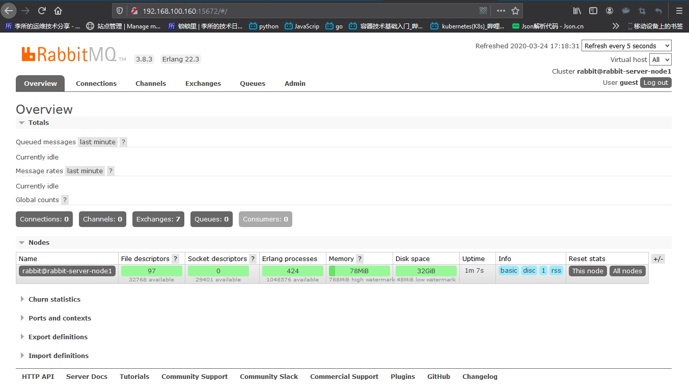
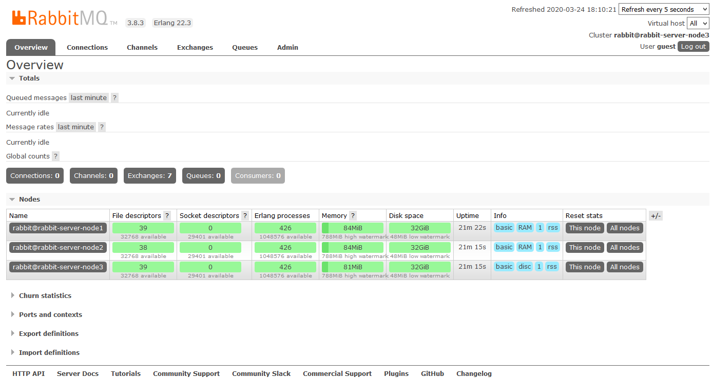
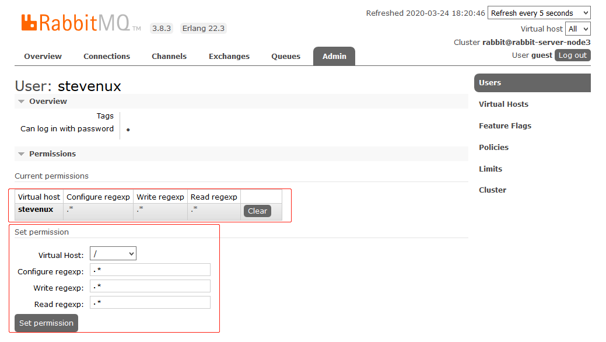
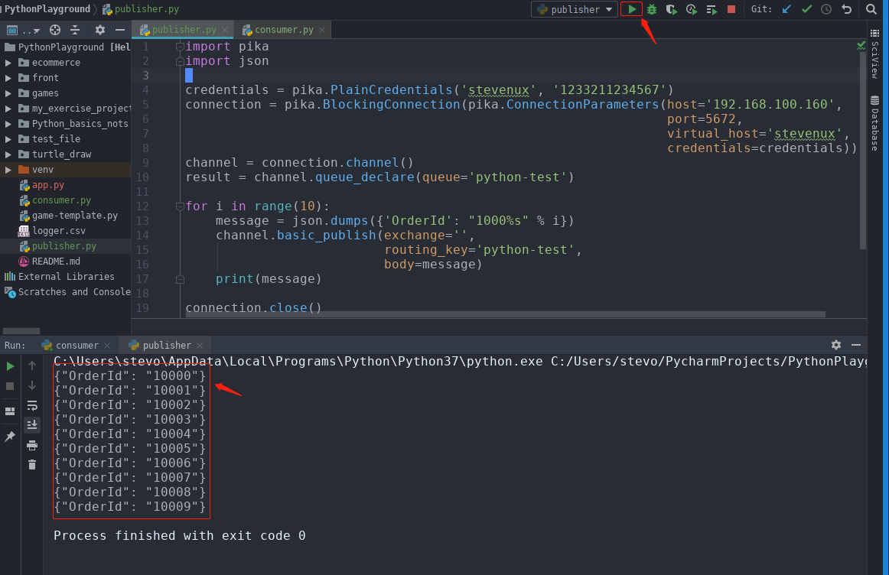
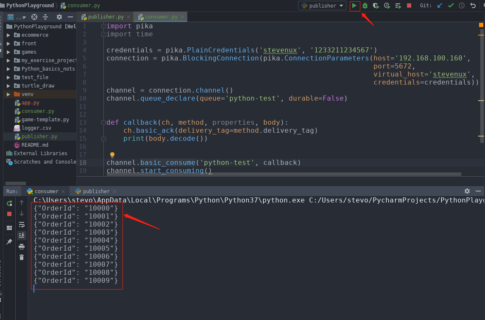

# 一. MQ 简介

消息队列作为高并发系统的核心组件之一，能够帮助业务系统结构提升开发效率和系统
稳定性，消息队列主要具有以下特点：

- **削峰填谷**:主要解决瞬时写压力大于应用服务能力导致消息丢失、系统奔溃等问题
- **系统解耦**:解决不同重要程度、不同能力级别系统之间依赖导致一死全死
- **提升性能**:当存在一对多调用时，可以发一条消息给消息系统，让消息系统通知相关系统
- **蓄流压测**:线上有些链路不好压测，可以通过堆积一定量消息再放开来压测

目前主流的消息队列软件有 RabbitMQ、kafka、ActiveMQ、RocketMQ 等，还有小众的
消息队列软件如 ZeroMQ、Apache Qpid 等。

# 二. RabbitMQ

## 2.1 RabbitMQ 简介

[RabbitMQ 官网](https://www.rabbitmq.com/)

[阿里云消息队列产品](https://www.aliyun.com/product/ons?spm=5176.234368.h2v3icoap.427.2620db25lcHi1Q&aly_as=Tz_Lue_o)

Message Queue 的需求由来已久，在 19 世纪 80 年代金融交易中，美国高盛等公
司采用 Teknekron 公司的产品，当时的 Message queuing 软件叫做(the information
bus（TIB）,后来 TIB 被电信和通讯等公司采用，然后路透社收购了 Teknekron 公
司，再然后 IBM 公司开发了 MQSeries，并且微软也开发了 Microsoft Message
Queue（MSMQ），但是这些商业 MQ 供应商的问题是厂商锁定及使用价格高昂，
于是 2001 年，Java Message queuing 试图解决锁定和交互性的问题，但对应用来
说反而更加麻烦了，于是 2004 年，摩根大通和 iMatrix 开始着手 Advanced Message
Queuing Protocol （AMQP）开放标准的开发，2006 年，AMQP 规范发布，2007
年，Rabbit 技术公司基于 AMQP 标准开发的 RabbitMQ 1.0 发布。

```
路透社:
(Reuters，LSE：RTR，NASDAQ: RTRSY)是世界上最早创办的通讯社之一，也是目前英国最大的
通讯社和西方四大通讯社之一，路透社是世界前三大的多媒体新闻通讯社，提供各类新闻和金融
数据，在128个国家运行。

摩根大通集团:
业界称西摩或小摩，总部位于美国纽约，总资产2.5万亿美元，总存款1.5万亿美
元，占美国存款总额的25%，分行6000多家，是美国最大金融服务机构之一。

iMatrix:
是一个企业级的JAVA快速开发平台。
```

RabbitMQ 采用 Erlang 语言开发，Erlang 语言由 Ericson 设计，Erlang 在分布式编
程和故障恢复方面表现出色，电信领域被广泛使用。

## 2.2 RabbitMQ 组件介绍

- **Broker**: 接收和分发消息的应用，RabbitMQ Server 就是 Message Broker

- **Virtual host**: 出于多租户和安全因素设计的，把 AMQP 的基本组件划分到一个虚
  拟的分组中，类似于网络中的 namespace 概念，当多个不同的用户使用同一个
  RabbitMQ server 提供的服务时，可以划分出多个 vhost，每个用户在自己的 vhost
  创建 exchange/queue 等。

- **Connection**: publisher/consumer 和 broker 之间的 TCP 连接。

- **Channel**: 如果每一次访问 RabbitMQ 都建立一个 Connection，在消息量大的时候
  建立 TCP Connection 的开销将是巨大的，效率也较低。Channel 是在 connection
  内部建立的逻辑连接，如果应用程序支持多线程，通常每个 thread 创建单独的
  channel 进行通讯，AMQP method 包含了 channel id 帮助客户端和 message broker
  识别 channel，所以 channel 之间是完全隔离的。Channel 作为轻量级的 Connection
  极大减少了操作系统建立 TCP connection 的开销。

- **Exchange**: message 到达 broker 的第一站，根据分发规则，匹配查询表中的 routing
  key，分发消息到 queue 中去。常用的类型有：direct (point-to-point), topic (publish-
  subscribe) and fanout (multicast)。

- **Queue**: 消息最终被送到这里等待 consumer 取走。

- **Binding**: exchange 和 queue 之间的虚拟连接，binding 中可以包含 routing key。
  Binding 信息被保存到 exchange 中的查询表中，用于 message 的分发依据。

## 2.3 RabbitMQ 单机部署

### 2.3.1 添加主机名解析

RabbitMQ 强制要求安装其的主机名可以解析。

```bash
root@rabbit-server-node1:~# vim /etc/hosts
...
192.168.100.160 rabbit-server rabbit-server.suosuoli.cn

root@rabbit-server-node1:~# ping rabbit-server
PING rabbit-server (192.168.100.160) 56(84) bytes of data.
64 bytes from rabbit-server (192.168.100.160): icmp_seq=1 ttl=64 time=0.010 ms
^C
--- rabbit-server ping statistics ---
1 packets transmitted, 1 received, 0% packet loss, time 0ms
rtt min/avg/max/mdev = 0.010/0.010/0.010/0.000 ms
root@rabbit-server-node1:~# ping rabbit-server.suosuoli.cn
PING rabbit-server (192.168.100.160) 56(84) bytes of data.
64 bytes from rabbit-server (192.168.100.160): icmp_seq=1 ttl=64 time=0.010 ms
64 bytes from rabbit-server (192.168.100.160): icmp_seq=2 ttl=64 time=0.023 ms
^C
--- rabbit-server ping statistics ---
2 packets transmitted, 2 received, 0% packet loss, time 1015ms
rtt min/avg/max/mdev = 0.010/0.016/0.023/0.007 ms

```

### 2.3.2 安装 RabbitMQ

[快速安装参考](https://www.rabbitmq.com/install-debian.html#apt-bintray-quick-start)

```bash
# 使用官方的快速安装例子
root@rabbit-server-node1:~# vim install_rabbit.sh

#!/bin/sh

## If sudo is not available on the system,
## uncomment the line below to install it
# apt-get install -y sudo

sudo apt-get update -y

## Install prerequisites
sudo apt-get install curl gnupg -y

## Install RabbitMQ signing key
curl -fsSL https://github.com/rabbitmq/signing-keys/releases/download/2.0/rabbitmq-release-signing-key.asc | sudo apt-key add -

## Install apt HTTPS transport
sudo apt-get install apt-transport-https

## Add Bintray repositories that provision latest RabbitMQ and Erlang 21.x releases
sudo tee /etc/apt/sources.list.d/bintray.rabbitmq.list <<EOF
## Installs the latest Erlang 22.x release.
## Change component to "erlang-21.x" to install the latest 21.x version.
## "bionic" as distribution name should work for any later Ubuntu or Debian release.
## See the release to distribution mapping table in RabbitMQ doc guides to learn more.
deb https://dl.bintray.com/rabbitmq-erlang/debian bionic erlang
deb https://dl.bintray.com/rabbitmq/debian bionic main
EOF

## Update package indices
sudo apt-get update -y

## Install rabbitmq-server and its dependencies
sudo apt-get install rabbitmq-server -y --fix-missing

# 安装
root@rabbit-server-node1:~# bash install_rabbit.sh
...
Created symlink /etc/systemd/system/multi-user.target.wants/rabbitmq-server.service → /lib/systemd/system/rabbitmq-server.service.
Processing triggers for ureadahead (0.100.0-21) ...
Processing triggers for systemd (237-3ubuntu10.24) ...
# 安装OK
```

### 2.3.3 启动 RabbitMQ

```bash
# 在ubuntu下，会自动启动
root@rabbit-server-node1:~# systemctl status rabbitmq-server
● rabbitmq-server.service - RabbitMQ broker
   Loaded: loaded (/lib/systemd/system/rabbitmq-server.service; enabled; vendor preset: enabled)
   Active: active (running) since Tue 2020-03-24 16:57:51 CST; 5min ago
 Main PID: 4946 (beam.smp)
 ...
# 开机启动
root@rabbit-server-node1:~# systemctl enable rabbitmq-server
Synchronizing state of rabbitmq-server.service with SysV service script with /lib/systemd/systemd-sysv-install.
Executing: /lib/systemd/systemd-sysv-install enable rabbitmq-server

root@rabbit-server-node1:~# ps -ef | grep rabbit
rabbitmq   4946      1  0 16:57 ?        00:00:06 /usr/lib/erlang/erts-10.7/bin/beam.smp -W w -A 64 -MBas ageffcbf -MHas ageffcbf -MBlmbcs 512 -MHlmbcs 512 -MMmcs 30 -P 1048576 -t 5000000 -stbt db -zdbbl 128000 -K true -- -root /usr/lib/erlang -progname erl -- -home /var/lib/rabbitmq -- -pa /usr/lib/rabbitmq/lib/rabbitmq_server-3.8.3/ebin  -noshell -noinput -s rabbit boot -sname rabbit@rabbit-server-node1 -boot start_sasl -kernel inet_default_connect_options [{nodelay,true}] -sasl errlog_type error -sasl sasl_error_logger false -rabbit lager_log_root "/var/lograbbitmq" -rabbit lager_default_file "/var/log/rabbitmq/rabbit@rabbit-server-node1.log" -rabbit lager_upgrade_file "/var/log/rabbitmq/rabbit@rabbit-server-node1_upgrade.log" -rabbit feature_flags_file "/var/lib/rabbitmq/mnesia/rabbit@rabbit-server-node1-feature_flags" -rabbit enabled_plugins_file "/etc/rabbitmq/enabled_plugins" -rabbit plugins_dir "/usr/lib/rabbitmq/plugins:/usr/lib/rabbitmq/lib/rabbitmq_server-3.8.3/plugins" -rabbit plugins_expand_dir "/var/lib/rabbitmq/mnesia/rabbit@rabbit-server-node1-plugins-expand" -os_mon start_cpu_sup false -os_mon start_disksup false -os_mon start_memsup false -mnesia dir "/var/lib/rabbitmq/mnesia/rabbit@rabbit-server-node1" -ra data_dir "/var/lib/rabbitmq/mnesia/rabbit@rabbit-server-node1/quorum" -kernel inet_dist_listen_min 25672 -kernel inet_dist_listen_max 25672 --
rabbitmq   5041      1  0 16:57 ?        00:00:00 /usr/lib/erlang/erts-10.7/bin/epmd -daemon
rabbitmq   5191   4946  0 16:57 ?        00:00:00 erl_child_setup 32768
rabbitmq   5216   5191  0 16:57 ?        00:00:00 inet_gethost 4
rabbitmq   5217   5216  0 16:57 ?        00:00:00 inet_gethost 4
root       5879   1136  0 17:10 pts/0    00:00:00 grep --color=auto rabbit

root@rabbit-server-node1:~# lsof -i:15672
COMMAND   PID     USER   FD   TYPE DEVICE SIZE/OFF NODE NAME
beam.smp 4946 rabbitmq   94u  IPv4  43507      0t0  TCP *:15672 (LISTEN)
```

### 2.3.4 开启 WEB 管理插件

```bash
root@rabbit-server-node1:~# rabbitmq-plugins list
Listing plugins with pattern ".*" ...
 Configured: E = explicitly enabled; e = implicitly enabled
 | Status: * = running on rabbit@rabbit-server-node1
 |/
[  ] rabbitmq_amqp1_0                  3.8.3
[  ] rabbitmq_auth_backend_cache       3.8.3
[  ] rabbitmq_auth_backend_http        3.8.3
[  ] rabbitmq_auth_backend_ldap        3.8.3
...
[  ] rabbitmq_management               3.8.3
...

root@rabbit-server-node1:~# rabbitmq-plugins enable rabbitmq_management
Enabling plugins on node rabbit@rabbit-server-node1:
rabbitmq_management
The following plugins have been configured:
  rabbitmq_management
  rabbitmq_management_agent
  rabbitmq_web_dispatch
Applying plugin configuration to rabbit@rabbit-server-node1...
The following plugins have been enabled:
  rabbitmq_management
  rabbitmq_management_agent
  rabbitmq_web_dispatch

started 3 plugins.
```

### 2.3.5 登录管理界面

rabbitmq 从 3.3.0 开始禁止使用 guest/guest 权限通过除 localhost 外的访问，直
接访问报错如下：

用户名和密码都是：guest


提示：用户只能在安装 rabbitmq 的服务器登录。


修改配置文件，允许从其他主机登录管理界面；

```bash
root@rabbit-server-node1:~# vim /usr/lib/rabbitmq/lib/rabbitmq_server-3.8.3/ebin/rabbit.app
...
 39             {loopback_users, []},  # 去掉double尖括号及其内容
...
root@rabbit-server-node1:~# systemctl restart rabbitmq-server.service
```

OK


## 2.4 RabbitMQ 集群部署

RabbitMQ 集群工作模式有两种：

- **普通模式**：创建好 RabbitMQ 之后的默认模式。
  普通集群模式：queue 创建之后，如果没有其它 policy，消息实体只存在于其中
  一个节点，A、B 两个 Rabbitmq 节点仅有相同的元数据，即队列结构，但队列的
  数据仅保存有一份，即在创建该队列的 rabbitmq 节点（A 节点）上，当消息进入
  A 节点的 Queue 中后，consumer 从 B 节点拉取时，RabbitMQ 会临时在 A、B
  间进行消息传输，把 A 中的消息实体取出并经过 B 发送给 consumer，所以
  consumer 可以连接每一个节点，从中取消息，该模式存在一个问题就是当 A 节点
  故障后，B 节点无法取到 A 节点中还未消费的消息实体。

- **镜像模式**：把需要的队列做成镜像队列。
  镜像集群模式：把需要的队列做成镜像队列，存在于多个节点，属于 RabbitMQ 的
  HA 方案（镜像模式是在普通模式的基础上，增加一些镜像策略）该模式解决了上述
  问题，其实质和普通模式不同之处在于，消息实体会主动在镜像节点间同步，而不
  是在 consumer 取数据时临时拉取。该模式带来的副作用也很明显，除了降低系统
  性能外，如果镜像队列数量过多，加之大量的消息进入，集群内部的网络带宽将会
  被这种同步通讯大大消耗掉。所以在对可靠性要求较高的场合中适用，一个队列想
  做成镜像队列，需要先设置 policy，然后客户端创建队列的时候，rabbitmq 集群
  根据“队列名称”自动设置是普通集群模式或镜像队列。

- 集群中有两种节点类型：

  - **内存节点**：只将数据保存到内存
  - **磁盘节点**：保存数据到内存和磁盘。
    内存节点虽然不写入磁盘，但是它执行比磁盘节点要好，集群中，只需要一个
    磁盘节点来保存数据就足够了如果集群中只有内存节点，那么不能全部停止它
    们，否则所有数据消息在服务器全部停机之后都会丢失。

- **推荐的架构设计**
  在一个 rabbitmq 集群里，有 3 台或以上机器，其中 1 台使用磁盘模式，其它节
  点使用内存模式，内存节点访问速度更快，由于磁盘 IO 相对较慢，因此可作
  为数据备份使用

### 2.4.1 环境

主机列表：

| 主机名              | IP              |
| :------------------ | :-------------- |
| rabbit-server-node1 | 192.168.100.160 |
| rabbit-server-node2 | 192.168.100.162 |
| rabbit-server-node3 | 192.168.100.164 |

主机域名解析：

```bash
root@rabbit-server-node1:~# vim /etc/hosts
root@rabbit-server-node1:~# cat /etc/hosts
192.168.100.160 rabbit-server-node1 rabbit-server1.suosuoli.cn
192.168.100.162 rabbit-server-node1 rabbit-server2.suosuoli.cn
192.168.100.164 rabbit-server-node1 rabbit-server3.suosuoli.cn

# 分发到其它主机
root@rabbit-server-node1:~# scp /etc/hosts 192.168.100.162:/etc/
root@192.168.100.162's password:
hosts                     100%  189   347.4KB/s   00:00

root@rabbit-server-node1:~# scp /etc/hosts 192.168.100.164:/etc/
root@192.168.100.164's password:
hosts                     100%  189   347.4KB/s   00:00

# 确认一下
root@rabbit-server-node2:~# cat /etc/hosts
192.168.100.160 rabbit-server-node1 rabbit-server1.suosuoli.cn
192.168.100.162 rabbit-server-node1 rabbit-server2.suosuoli.cn
192.168.100.164 rabbit-server-node1 rabbit-server3.suosuoli.cn

root@rabbit-server-node3:~# cat /etc/hosts
192.168.100.160 rabbit-server-node1 rabbit-server1.suosuoli.cn
192.168.100.162 rabbit-server-node1 rabbit-server2.suosuoli.cn
192.168.100.164 rabbit-server-node1 rabbit-server3.suosuoli.cn
```

### 2.4.2 在各主机安装 RabbitMQ

```bash
# 使用官方的快速安装例子
root@rabbit-server-nodeX:~# vim install_rabbit.sh

#!/bin/sh

## If sudo is not available on the system,
## uncomment the line below to install it
# apt-get install -y sudo

sudo apt-get update -y

## Install prerequisites
sudo apt-get install curl gnupg -y

## Install RabbitMQ signing key
curl -fsSL https://github.com/rabbitmq/signing-keys/releases/download/2.0/rabbitmq-release-signing-key.asc | sudo apt-key add -

## Install apt HTTPS transport
sudo apt-get install apt-transport-https

## Add Bintray repositories that provision latest RabbitMQ and Erlang 21.x releases
sudo tee /etc/apt/sources.list.d/bintray.rabbitmq.list <<EOF
## Installs the latest Erlang 22.x release.
## Change component to "erlang-21.x" to install the latest 21.x version.
## "bionic" as distribution name should work for any later Ubuntu or Debian release.
## See the release to distribution mapping table in RabbitMQ doc guides to learn more.
deb https://dl.bintray.com/rabbitmq-erlang/debian bionic erlang
deb https://dl.bintray.com/rabbitmq/debian bionic main
EOF

## Update package indices
sudo apt-get update -y

## Install rabbitmq-server and its dependencies
sudo apt-get install rabbitmq-server -y --fix-missing

# 安装
root@rabbit-server-nodeX:~# bash install_rabbit.sh
...
Created symlink /etc/systemd/system/multi-user.target.wants/rabbitmq-server.service → /lib/systemd/system/rabbitmq-server.service.
Processing triggers for ureadahead (0.100.0-21) ...
Processing triggers for systemd (237-3ubuntu10.24) ...
# 安装OK
```

### 2.4.3 启动 RabbitMQ

```bash
~# systemctl restart rabbitmq-server
~# systemctl enable rabbitmq-server
```

### 2.4.4 创建 RabbitMQ 集群

Rabbitmq 的集群是依赖于 erlang 的集群来工作的，所以必须先构建起 erlang 的
集群环境,而 Erlang 的集群中各节点是通过一个 magic cookie 来实现的，这个
cookie 存放在 `/var/lib/rabbitmq/.erlang.cookie` 文件中，文件是 400 的
权限,所以必须保证各节点 cookie 一致，否则节点之间就无法通信。

#### 2.4.4.1 停止各服务器 RabbitMQ 并同步 cookie

```bash
root@rabbit-server-node1:~# systemctl stop rabbitmq-server
root@rabbit-server-node2:~# systemctl stop rabbitmq-server
root@rabbit-server-node3:~# systemctl stop rabbitmq-server

root@rabbit-server-node1:~# scp /var/lib/rabbitmq/.erlang.cookie rabbit-server-node2:/var/lib/rabbitmq/.erlang.cookie
root@rabbit-server-node2's password:
.erlang.cookie                   100%   20    42.4KB/s   00:00

root@rabbit-server-node1:~# scp /var/lib/rabbitmq/.erlang.cookie rabbit-server-node3:/var/lib/rabbitmq/.erlang.cookie
root@rabbit-server-node3's password:
.erlang.cookie                   100%   20    42.4KB/s   00:00
```

#### 2.4.4.2 启动各服务器 RabbitMQ

```bash
root@rabbit-server-node1:~# systemctl start rabbitmq-server
root@rabbit-server-node2:~# systemctl start rabbitmq-server
root@rabbit-server-node3:~# systemctl start rabbitmq-server
```

#### 2.4.4.3 创建集群

将 rabbit-server-node1 作为内存节点加入 rabbit-server-node3 成为集群，
执行以下命令:

```bash
# 停止app
root@rabbit-server-node1:~# rabbitmqctl stop_app
Stopping rabbit application on node rabbit@rabbit-server-node1 ...
# 清除元数据
root@rabbit-server-node1:~# rabbitmqctl reset
Resetting node rabbit@rabbit-server-node1 ...
# 加入集群，以node3为集群目标
root@rabbit-server-node1:~# rabbitmqctl join_cluster rabbit@rabbit-server-node3 --ram
Clustering node rabbit@rabbit-server-node1 with rabbit@rabbit-server-node3
# 启动app
root@rabbit-server-node1:~# rabbitmqctl start_app
Starting node rabbit@rabbit-server-node1 ...
 completed with 3 plugins.
```

将 rabbit-server-node2 作为内存节点加入 rabbit-server-node3 成为集群，
执行以下命令:

```bash
root@rabbit-server-node2:~# rabbitmqctl stop_app
Stopping rabbit application on node rabbit@rabbit-server-node2 ...
root@rabbit-server-node2:~# rabbitmqctl reset
Resetting node rabbit@rabbit-server-node2 ...
root@rabbit-server-node2:~# rabbitmqctl join_cluster rabbit@rabbit-server-node3 --ram
Clustering node rabbit@rabbit-server-node2 with rabbit@rabbit-server-node3
root@rabbit-server-node2:~# rabbitmqctl start_app
Starting node rabbit@rabbit-server-node2 ...
 completed with 3 plugins.
```

#### 2.4.4.4 将集群设置为镜像模式

在 node1 或者 node2 执行下面的命令：

```bash
root@rabbit-server-node2:~# rabbitmqctl set_policy ha-all "#" '{"ha-mode":"all"}'
Setting policy "ha-all" for pattern "#" to "{"ha-mode":"all"}" with priority "0" for vhost "/" ...
```

#### 2.4.4.5 验证集群状态

```bash
root@rabbit-server-node2:~# rabbitmqctl cluster_status
Cluster status of node rabbit@rabbit-server-node2 ...
Basics

Cluster name: rabbit@rabbit-server-node3

Disk Nodes
# 磁盘节点：集群中至少有一个节点是磁盘节点用于数据持久化
rabbit@rabbit-server-node3

RAM Nodes
# 内存节点
rabbit@rabbit-server-node1
rabbit@rabbit-server-node2

Running Nodes
# 正在运行的节点
rabbit@rabbit-server-node1
rabbit@rabbit-server-node2
rabbit@rabbit-server-node3

Versions
# 软件版本
rabbit@rabbit-server-node1: RabbitMQ 3.8.3 on Erlang 22.3
rabbit@rabbit-server-node2: RabbitMQ 3.8.3 on Erlang 22.3
rabbit@rabbit-server-node3: RabbitMQ 3.8.3 on Erlang 22.3

Alarms

(none)

Network Partitions

(none)

Listeners

Node: rabbit@rabbit-server-node1, interface: [::], port: 25672, protocol: clustering, purpose: inter-node and CLI tool communication
Node: rabbit@rabbit-server-node1, interface: [::], port: 5672, protocol: amqp, purpose: AMQP 0-9-1 and AMQP 1.0
Node: rabbit@rabbit-server-node1, interface: [::], port: 15672, protocol: http, purpose: HTTP API
Node: rabbit@rabbit-server-node2, interface: [::], port: 25672, protocol: clustering, purpose: inter-node and CLI tool communication
Node: rabbit@rabbit-server-node2, interface: [::], port: 5672, protocol: amqp, purpose: AMQP 0-9-1 and AMQP 1.0
Node: rabbit@rabbit-server-node2, interface: [::], port: 15672, protocol: http, purpose: HTTP API
Node: rabbit@rabbit-server-node3, interface: [::], port: 25672, protocol: clustering, purpose: inter-node and CLI tool communication
Node: rabbit@rabbit-server-node3, interface: [::], port: 5672, protocol: amqp, purpose: AMQP 0-9-1 and AMQP 1.0
Node: rabbit@rabbit-server-node3, interface: [::], port: 15672, protocol: http, purpose: HTTP API

Feature flags

Flag: drop_unroutable_metric, state: enabled
Flag: empty_basic_get_metric, state: enabled
Flag: implicit_default_bindings, state: enabled
Flag: quorum_queue, state: enabled
Flag: virtual_host_metadata, state: enabled
```

### 2.4.5 WEB 界面查看集群

各个服务器启用 web 管理界面，不启用 web 插件的 rabbitmq 服务器，会在 web 节点提示节点
统计信息不可用(Node statistics not available)

```bash
root@rabbit-server-node2:~# rabbitmq-plugins enable rabbitmq_management
root@rabbit-server-node3:~# rabbitmq-plugins enable rabbitmq_management
```



## 2.5 RabbitMQ 常用命令

```bash
# 新建vhost
root@rabbit-server-node1:~# rabbitmqctl add_vhost stevenux
Adding vhost "stevenux" ...

# 列出vhost
root@rabbit-server-node1:~# rabbitmqctl list_vhosts
Listing vhosts ...
name
/
stevenux

# 列出队列
root@rabbit-server-node1:~# rabbitmqctl list_queues
Timeout: 60.0 seconds ...
Listing queues for vhost / ...

# 删除vhost
root@rabbit-server-node1:~# rabbitmqctl delete_vhost stevenux
Deleting vhost "stevenux" ...

# 新建用户
root@rabbit-server-node1:~# rabbitmqctl add_user stevenux stevenux
Adding user "stevenux" ...

# 改用户密码
root@rabbit-server-node1:~# rabbitmqctl change_password stevenux 1233211234567
Changing password for user "stevenux" ...


root@rabbit-server-node1:~# rabbitmqctl add_vhost stevenux
Adding vhost "stevenux" ...

# 设置stevenux用户对vhost stevenux有读写权限
root@rabbit-server-node1:~# rabbitmqctl set_permissions -p stevenux stevenux ".*" ".*" ".*"Setting permissions for user "stevenux" in vhost "stevenux" ...
```



# 三. 使用 python 与操作 RabbitMQ

## publisher

```py
import pika
import json

credentials = pika.PlainCredentials('stevenux', '1233211234567')
connection = pika.BlockingConnection(pika.ConnectionParameters(host='192.168.100.160',
                                                               port=5672,
                                                               virtual_host='stevenux',
                                                               credentials=credentials))
channel = connection.channel()
result = channel.queue_declare(queue='python-test')

for i in range(10):
    message = json.dumps({'OrderId': "1000%s" % i})
    channel.basic_publish(exchange='',
                          routing_key='python-test',
                          body=message)
    print(message)

connection.close()

```

## consumer

```py
import pika
import time

credentials = pika.PlainCredentials('stevenux', '1233211234567')
connection = pika.BlockingConnection(pika.ConnectionParameters(host='192.168.100.160',
                                                               port=5672,
                                                               virtual_host='stevenux',
                                                               credentials=credentials))
channel = connection.channel()
channel.queue_declare(queue='python-test', durable=False)


def callback(ch, method, properties, body):
    ch.basic_ack(delivery_tag=method.delivery_tag)
    print(body.decode())


channel.basic_consume('python-test', callback)
channel.start_consuming()
```

运行 publisher：


再运行 consumer：

