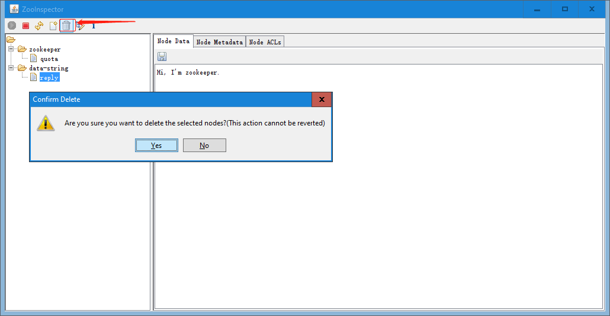

# 一. ZooKeeper 简介

## 1.1 简介

[ZooKeeper 官网](https://zookeeper.apache.org/)


Zookeeper 是一个开源的分布式协调服务，目前由 Apache 进行维护。
Zookeeper 可以用于实现分布式系统中常见的发布/订阅、负载均衡、命令服务、
分布式协调/通知、集群管理、Master 选举、分布式锁和分布式队列等功能。其
具有以下特性：

- 顺序一致性 ：从一个客户端发起的事务请求，最终都会严格按照其发起顺序被
  应用到 Zookeeper 中；

- 原子性 ：所有事务请求的处理结果在整个集群中所有机器上都是一致的；不存
  在部分机器应用了该事务，而另一部分没有应用的情况；

- 单一视图 ：所有客户端看到的服务端数据模型都是一致的；

- 可靠性 ：一旦服务端成功应用了一个事务，则其引起的改变会一直保留，直到
  被另外一个事务所更改；

- 实时性 ：一旦一个事务被成功应用后，Zookeeper 可以保证客户端立即可以读
  取到这个事务变更后的最新状态的数据。

ZooKeeper 最早起源于雅虎研究院的一个研究小组。在当时，研究人员发现，在
雅虎内部很多大型系统基本都需要依赖一个类似的系统来进行分布式协调，但是
这些系统往往都存在分布式单点问题，所以，雅虎的开发人员就试图开发一个通
用的无单点问题的分布式协调框架，以便让开发人员将精力集中在处理业务逻
辑上。

关于"ZooKeeper"这个项目的名字，其实也有一段趣闻：在立项初期，考虑到之前
内部很多项目都是使用动物的名字来命名的(例如著名的 Pig 项目)，雅虎的工程
师希望给这个项目也取一个动物的名字。时任研究院的首席科学家
RaghuRamakrishnan 开玩笑地说："在这样下去，我们这儿就变成动物园了!"此
话一出，大家纷纷表示就叫动物园管理员吧--因为各个以动物命名的分布式
组件放在一起，雅虎的整个分布式系统看上去就像一个大型的动物园了，而
Zookeeper 正好要用来进行分布式环境的协调，于是 Zookeeper 的名字也就由
此诞生了。

## 1.2 ZooKeeper 使用场景

ZooKeeper 是一个分布式服务框架，它主要是用来解决分布式应用中经常遇到的
一些数据管理问题，如：命名服务、状态同步、配置中心、集群管理等。

### 1.2.1 消息的发布/订阅

数据的发布/订阅系统，通常也用作配置中心。在分布式系统中，可能会存在成千
上万个服务节点，如果想要对所有服务的某项配置进行更改，由于数据节点过多，
你不可逐台进行修改，而应该在设计时采用统一的配置中心。之后发布者只需要
将新的配置发送到配置中心，所有服务节点即可自动下载并进行更新，从而实现
配置的集中管理和动态更新。

Zookeeper 通过 Watcher 机制可以实现数据的发布和订阅。分布式系统的所有
的服务节点可以对某个 ZNode 注册监听，之后只需要将新的配置写入该 ZNode，
所有服务节点都会收到该事件。

### 1.2.2 命名服务

命名服务是分布式系统中比较常见的一类场景。命名服务是分布式系统最基本的
公共服务之一。在分布式系统中，被命名的实体通常可以是集群中的机器、提供
的服务地址或远程对象等——这些我们都可以统称它们为名字（Name），其中较
为常见的就是一些分布式服务框架（如 RPC、RMI）中的服务地址列表，通过使
用命名服务，客户端应用能够根据指定名字来获取资源的实体、服务地址和提供
者的信息等。

### 1.2.3 状态同步

每个节点除了存储数据内容和 node 节点状态信息之外，还存储了已经注册的
APP 的状态信息，当有些节点或 APP 不可用，就将当前状态同步给其他服务。

### 1.2.5 集群管理

所谓集群管理，包括集群监控与集群控制两大块，前者侧重对集群运行时状态的
收集，后者则是对集群进行操作与控制，在日常开发和运维过程中，我们经常会
有类似于如下的需求:

```
希望知道当前集群中究竟有多少机器在工作。
对集群中每台机器的运行时状态进行数据收集。
对集群中机器进行上下线操作。
```

ZooKeeper 具有以下两大特性:

```
客户端如果对 ZooKeeper 的一个数据节点注册 Watcher 监听，那么当该数据节
点的内容或是其子节点列表发生变更时，ZooKeeper 服务器就会向订阅的客户
端发送变更通知。

对在 ZooKeeper 上创建的临时节点，一旦客户端与服务器之间的会话失效，那
么该临时节点也就被自动清除。
```

Watcher（事件监听器），是 Zookeeper 中的一个很重要的特性。Zookeeper 允
许用户在指定节点上注册一些 Watcher，并且在一些特定事件触发的时候，
ZooKeeper 服务端会将事件通知到感兴趣的客户端上去，该机制是 Zookeeper
实现分布式协调服务的重要特性。

# 二. ZooKeeper 单机安装

注：生产中一般不使用单机模式

## 2.1 JAVA 环境

[环境依赖介绍](https://zookeeper.apache.org/doc/r3.4.14/zookeeperAdmin.html#sc_requiredSoftware)

```bash
root@zoo-server-node1:~# apt install openjdk-11-jdk

root@zoo-server-node1:~# java -version
openjdk version "11.0.6" 2020-01-14
OpenJDK Runtime Environment (build 11.0.6+10-post-Ubuntu-1ubuntu118.04.1)
OpenJDK 64-Bit Server VM (build 11.0.6+10-post-Ubuntu-1ubuntu118.04.1, mixed mode, sharing)
```

## 2.2 安装 ZooKeeper

[清华镜像源下载](https://archive.apache.org/dist/zookeeper/zookeeper-3.4.14/)
[ZooKeeper 官方下载地址](https://archive.apache.org/dist/zookeeper/)

```bash
root@zoo-server-node1:~# cd /usr/local/src/
root@zoo-server-node1:/usr/local/src# rz -E
rz waiting to receive.
root@zoo-server-node1:/usr/local/src# ls
zookeeper-3.4.14.tar.gz

# 解压
root@zoo-server-node1:/usr/local/src# tar xf zookeeper-3.4.14.tar.gz

# 创建软链接
root@zoo-server-node1:/usr/local/src#  ln -sv /usr/local/src/zookeeper-3.4.14 /usr/local/zookeeper
'/usr/local/zookeeper' -> '/usr/local/src/zookeeper-3.4.14'

# 使用参考配置
root@zoo-server-node1:/usr/local/src# cd /usr/local/zookeeper/conf/
root@zoo-server-node1:/usr/local/zookeeper/conf# cp zoo_sample.cfg zoo.cfg
root@zoo-server-node1:/usr/local/zookeeper/conf# mkdir /data/zookeeper -pv
mkdir: created directory '/data'
mkdir: created directory '/data/zookeeper'

root@zoo-server-node1:/usr/local/zookeeper/conf# grep "^[a-Z]" zoo.cfg
tickTime=2000
initLimit=10
syncLimit=5
dataDir=/data/zookeeper
clientPort=2181
```

## 2.3 启动 zookeeper

```bash
root@zoo-server-node1:~# /usr/local/zookeeper/bin/zkServer.sh start
ZooKeeper JMX enabled by default
Using config: /usr/local/zookeeper/bin/../conf/zoo.cfg
Starting zookeeper ... STARTED

root@zoo-server-node1:~# ps -ef | grep zookeeper
root      20594      1  7 20:53 pts/0    00:00:01 java -Dzookeeper.log.dir=. -Dzookeeper.root.logger=INFO,CONSOLE -cp /usr/local/zookeeper/bin/../zookeeper-server/target/classes:/usr/localzookeeper/bin/../build/classes:/usr/local/zookeeper/bin/../zookeeper-server/target/lib/*.jar:/usr/local/zookeeper/bin/../build/lib/*.jar:/usr/local/zookeeper/bin/../lib/slf4j-log4j12-1.7.25.jar:/usr/local/zookeeper/bin/../lib/slf4j-api-1.7.25.jar:/usr/local/zookeeper/bin/../lib/netty-3.10.6.Final.jar:/usr/local/zookeeper/bin/../lib/log4j-1.2.17.jar:/usr/local/zookeeper/bin/../lib/jline-0.9.94.jar:/usr/local/zookeeper/bin/../lib/audience-annotations-0.5.0.jar:/usr/local/zookeeper/bin/../zookeeper-3.4.14.jar:/usr/local/zookeeper/bin/../zookeeper-server/src/main/resources/lib/*.jar:/usr/local/zookeeper/bin/../conf: -Dcom.sun.management.jmxremote -Dcom.sun.management.jmxremote.local.only=false org.apache.zookeeper.server.quorum.QuorumPeerMain /usr/local/zookeeper/bin/../conf/zoo.cfg
root      20621  12393  0 20:53 pts/0    00:00:00 grep --color=auto zookeeper
```

## 2.4 查看 zookeeper 转态

```bash
root@zoo-server-node1:~# /usr/local/zookeeper/bin/zkServer.sh status
ZooKeeper JMX enabled by default
Using config: /usr/local/zookeeper/bin/../conf/zoo.cfg
Mode: standalone   # 单机模式
```

# 三. 集群介绍

## 3.1 ZooKeeper 集群介绍

ZooKeeper 集群用于解决单点和单机性能及数据高可用等问题:


上图中每一个 node 代表一个安装 Zookeeper 服务的服务器。组成 ZooKeeper
服务的服务器都会在内存中维护当前的服务器状态，并且每台服务器之间都互相保
持着通信。集群间通过 Zab 协议（Zookeeper Atomic Broadcast）来保持数据
的一致性。

最典型集群模式为 Master/Slave 模式（主备模式）。在这种模式中，通常
Master 服务器作为主服务器提供写服务，其他的 Slave 服务器从服务器通
过异步复制的方式获取 Master 服务器最新的数据提供读服务。而在 ZooKeeper
中没有选择传统的 Master/Slave 概念，而是引入了 Leader、Follower 和
Observer 三种角色。如下图所示:


ZooKeeper 集群中的所有机器通过一个 Leader 选举过程来选定一台称为 “Leader”
的机器，Leader 既可以为客户端提供写服务又能提供读服务。除了 Leader 外，
Follower 和 Observer 都只能提供读服务。Follower 和 Observer 唯一的区别
在于 Observer 机器不参与 Leader 的选举过程，也不参与写操作的“过半写成功”
策略，因此 Observer 机器可以在不影响写性能的情况下提升集群的读性能。

**ZooKeeper 集群角色:**


当 Leader 服务器出现网络中断、崩溃退出与重启等异常情况时，ZAB 协议就会进人
恢复模式并选举产生新的 Leader 服务器。这个过程大致是这样的：

1. Leader election（选举阶段）：节点在一开始都处于选举阶段，只要有一个节点
   得到超半数节点的票数，它就可以当选准 leader。
2. Discovery（发现阶段）：在这个阶段，followers 跟准 leader 进行通信，同步
   followers 最近接收的事务提议。
3. Synchronization（同步阶段）:同步阶段主要是利用 leader 前一阶段获得的最
   新提议历史，同步集群中所有的副本。同步完成之后 准 leader 才会成为真正的 leader。
4. Broadcast（广播阶段） ：到了这个阶段，Zookeeper 集群才能正式对外提供事务
   服务，并且 leader 可以进行消息广播。同时如果有新的节点加入，还需要对新节点进行同步。

## 3.2 ZooKeeper 集群特点

在 ZooKeeper 集群中，只要有超过集群数量一半的 zookeeper 节点工作正常，那么
整个集群对外就是可用的，假如有 2 台服务器做了一个 zookeeper 集群，只要有任
何一台故障或宕机，那么这个 zookeeper 集群就不可用了，因为剩下的一台没有超过
集群一半的数量，但是假如有三台 zookeeper 组成一个集群，那么损坏一台就还剩两
台，大于 3 台的一半，所以损坏一台还是可以正常运行的，但是再损坏一台就只剩一
台集群就不可用了。那么要是 4 台组成一个 zookeeper 集群，损坏一台集群肯定是
正常的，那么损坏两台就还剩两台，那么 2 台不大于集群数量的一半，所以 3 台的
zookeeper 集群和 4 台的 zookeeper 集群损坏两台的结果都是集群不可用，以此类推。

# 四. 集群部署

主机：

| 主机名           | IP              |
| :--------------- | :-------------- |
| zoo-server-node1 | 192.168.100.160 |
| zoo-server-node2 | 192.168.100.162 |
| zoo-server-node3 | 192.168.100.164 |

## 4.1 JAVA 环境

各 zookeeper 服务器都配置 java 环境并配置解析

安装 openjdk：

```bash
root@zoo-server-node2:~# apt install openjdk-11-jdk
root@zoo-server-node3:~# apt install openjdk-11-jdk
```

配置解析：

```bash
root@zoo-server-node1:~# cat /etc/hosts
192.168.100.160 zoo-server-node1 zoo-server1.suosuoli.cn
192.168.100.162 zoo-server-node2 zoo-server2.suosuoli.cn
192.168.100.164 zoo-server-node3 zoo-server3.suosuoli.cn

~# scp /etc/hosts 192.168.100.162:/etc/
~# scp /etc/hosts 192.168.100.164:/etc/
```

## 4.2 在各个服务器部署 ZooKeeper

### 4.2.1 zoo-server-node1

```bash
~# pwd
/usr/local/src
~# tar xf zookeeper-3.4.14.tar.gz
~# ln -sv /usr/local/src/zookeeper-3.4.14 /usr/local/zookeeper
~# cd /usr/local/zookeeper/conf/
~# cp zoo_sample.cfg zoo.cfg  # 基于模板配置文件来生成配置
~# vim zoo.cfg
~# mkdir /data/zookeeper -pv  # 存放数据的目录
~# grep "^[a-Z]" zoo.cfg

root@zoo-server-node1:/usr/local/zookeeper/conf# grep "^[a-Z]" zoo.cfg
# 服务器与服务器之间的单次心跳检测时间间隔，单位为毫秒
tickTime=2000

# 集群中leader服务器与follower服务器初始连接心跳次数，即多少个2000毫秒
initLimit=10

# leader与follower之间连接完成之后，后期检测发送和应答的心跳次数，如果
# 该follower在设置的时间内(5*2000)不能与leader 进行通信，那么此 follower
# 将被视为不可用
syncLimit=5

# 自定义的zookeeper保存数据的目录
dataDir=/data/zookeeper

# 客户端连接 Zookeeper 服务器的端口，Zookeeper 会监听这个端口，接受客户端的访问请求
clientPort=2181

# 一个客户端IP可以和zookeeper保持的连接数
maxClientCnxns=4096

# 3.4.0中的新增功能：启用后，ZooKeeper自动清除功能会将autopurge.snapRetainCount
# 最新快照和相应的事务日志分别保留在dataDir和dataLogDir中，并删除其余部分，默认值
# 为3，最小值为3。
autopurge.snapRetainCount=3

# 3.4.0及之后版本，ZK提供了自动清理日志和快照文件的功能，这个参数指定了清理频率，
# 单位是小时，需要配置一个1或更大的整数，默认是0，表示不开启自动清理功能
autopurge.purgeInterval=1

# server.服务器编号=服务器IP:数据同步端口:leader选举端口
server.1=192.168.100.160:2888:3888
server.2=192.168.100.162:2888:3888
server.3=192.168.100.164:2888:3888

root@zoo-server-node1:/usr/local/src# scp zookeeper-3.4.14.tar.gz zoo-server-node3:/usr/local/src
root@zoo-server-node1:/usr/local/src# scp zookeeper-3.4.14.tar.gz zoo-server-node3:/usr/local/src

# 写入当前node的集群ID，此处为1
root@zoo-server-node1:~# echo "1" > /data/zookeeper/myid
root@zoo-server-node1:~# cat /data/zookeeper/myid
1
```

### 4.2.2 zoo-server-node2

```bash
root@zoo-server-node2:/usr/local/src# ll
total 36804
drwxr-xr-x  2 root root     4096 Mar 24 23:08 ./
drwxr-xr-x 10 root root     4096 Dec 30 23:20 ../
-rw-r--r--  1 root root 37676320 Mar 24 23:08 zookeeper-3.4.14.tar.gz
root@zoo-server-node2:/usr/local/src# tar xf zookeeper-3.4.14.tar.gz

root@zoo-server-node2:/usr/local/src# ln -sv /usr/local/src/zookeeper-3.4.14 /usr/local/zookeeper
'/usr/local/zookeeper' -> '/usr/local/src/zookeeper-3.4.14'

root@zoo-server-node2:/usr/local/src# cd /usr/local/zookeeper/conf/
root@zoo-server-node2:/usr/local/zookeeper/conf# cp zoo_sample.cfg zoo.cfg
root@zoo-server-node2:/usr/local/zookeeper/conf# vim zoo.cfg

root@zoo-server-node2:~# mkdir -pv /data/zookeeper
mkdir: created directory '/data'
mkdir: created directory '/data/zookeeper'

root@zoo-server-node2:/usr/local/zookeeper/conf# grep "^[a-Z]" zoo.cfg
tickTime=2000
initLimit=10
syncLimit=5
dataDir=/data/zookeeper
clientPort=2181
maxClientCnxns=128
autopurge.snapRetainCount=3
autopurge.purgeInterval=1
server.1=192.168.100.160:2888:3888
server.2=192.168.100.162:2888:3888
server.3=192.168.100.164:2888:3888

root@zoo-server-node2:~# echo "2" > /data/zookeeper/myid
```

### 4.2.3 zoo-server-node3

```bash
root@zoo-server-node3:/usr/local/src# ll
total 36804
drwxr-xr-x  2 root root     4096 Mar 24 23:08 ./
drwxr-xr-x 10 root root     4096 Dec 30 23:20 ../
-rw-r--r--  1 root root 37676320 Mar 24 23:08 zookeeper-3.4.14.tar.gz
root@zoo-server-node3:/usr/local/src# tar xf zookeeper-3.4.14.tar.gz

root@zoo-server-node3:/usr/local/src# ln -sv /usr/local/src/zookeeper-3.4.14 /usr/local/zookeeper
'/usr/local/zookeeper' -> '/usr/local/src/zookeeper-3.4.14'

root@zoo-server-node3:/usr/local/src# cd /usr/local/zookeeper/conf/
root@zoo-server-node3:/usr/local/zookeeper/conf# cp zoo_sample.cfg zoo.cfg

root@zoo-server-node3:~# mkdir /data/zookeeper -pv
mkdir: created directory '/data'
mkdir: created directory '/data/zookeeper'

root@zoo-server-node3:/usr/local/zookeeper/conf# grep "^[a-Z]" zoo.cfg
tickTime=2000
initLimit=10
syncLimit=5
dataDir=/data/zookeeper
clientPort=2181
maxClientCnxns=128
autopurge.snapRetainCount=3
autopurge.purgeInterval=1
server.1=192.168.100.160:2888:3888
server.2=192.168.100.162:2888:3888
server.3=192.168.100.164:2888:3888

root@zoo-server-node3:~# echo "3" > /data/zookeeper/myid
```

## 4.3 启动集群

### 4.3.1 node1

```bash
root@zoo-server-node1:~# /usr/local/zookeeper/bin/zkServer.sh start
ZooKeeper JMX enabled by default
Using config: /usr/local/zookeeper/bin/../conf/zoo.cfg
Starting zookeeper ... STARTED
```

### 4.3.2 node2

```bash
root@zoo-server-node2:~# /usr/local/zookeeper/bin/zkServer.sh start
ZooKeeper JMX enabled by default
Using config: /usr/local/zookeeper/bin/../conf/zoo.cfg
Starting zookeeper ... STARTED
```

### 4.3.3 node3

```bash
root@zoo-server-node3:~# /usr/local/zookeeper/bin/zkServer.sh start
ZooKeeper JMX enabled by default
Using config: /usr/local/zookeeper/bin/../conf/zoo.cfg
Starting zookeeper ... STARTED
```

## 4.4 验证集群状态

验证各 zookeeper 节点服务运行状态

### 4.4.1 node1

```bash
root@zoo-server-node1:~# /usr/local/zookeeper/bin/zkServer.sh status
ZooKeeper JMX enabled by default
Using config: /usr/local/zookeeper/bin/../conf/zoo.cfg
Mode: follower  # 角色为follower，只提供读服务和路由写请求
```

### 4.4.2 node2

```bash
root@zoo-server-node2:~# /usr/local/zookeeper/bin/zkServer.sh status
ZooKeeper JMX enabled by default
Using config: /usr/local/zookeeper/bin/../conf/zoo.cfg
Mode: follower  # 角色为follower，值提供读服务和路由写请求
```

### 4.4.3 node3

```bash
root@zoo-server-node3:~# /usr/local/zookeeper/bin/zkServer.sh status
ZooKeeper JMX enabled by default
Using config: /usr/local/zookeeper/bin/../conf/zoo.cfg
Mode: leader  # 角色为leader，提供读写服务
```

# 五. ZooKeeper 命令

## 5.1 查看状态

```bash
root@zoo-server-node3:~# /usr/local/zookeeper/bin/zkServer.sh --help
ZooKeeper JMX enabled by default
Using config: /usr/local/zookeeper/bin/../conf/zoo.cfg
Usage: /usr/local/zookeeper/bin/zkServer.sh {start|start-foreground|stop|restart|status|upgrade|print-cmd}
root@zoo-server-node3:~# /usr/local/zookeeper/bin/zkServer.sh status
ZooKeeper JMX enabled by default
Using config: /usr/local/zookeeper/bin/../conf/zoo.cfg
Mode: leader
```

## 5.2 交互命令

可连接至 zookeeper 集群中的任意一台 zookeeper 节点进行交互命令操作，
如写入数据，删除数据等：

```bash
# 使用zkCli.sh脚本进行连接，两种方式:
  # 1.直接在cli指定要连接的server
root@zoo-server-node3:~# /usr/local/zookeeper/bin/zkCli.sh -server 192.168.100.160:2181
Connecting to 192.168.100.160:2181
......
 sessionid = 0x100013fc9550002, negotiated timeout = 30000

WATCHER::

WatchedEvent state:SyncConnected type:None path:null
[zk: 192.168.100.160:2181(CONNECTED) 0]  # 连接上了

  # 2.先连接到本地
root@zoo-server-node3:~# /usr/local/zookeeper/bin/zkCli.sh
.....
WATCHER::

WatchedEvent state:SyncConnected type:None path:null
[zk: localhost:2181(CONNECTED) 0] connect 192.168.100.160:2181  # 使用该命令连接接
WATCHER::

WatchedEvent state:SyncConnected type:None path:null
# 光标会在这里停下，按一下Enter
[zk: 192.168.100.160:2181(CONNECTED) 1]  # 连接上了
```

创建数据节点(Znode)，并写入数据：

```bash
# 创建数据节点
[zk: 192.168.100.160:2181(CONNECTED) 9] create /data-string "Hello, zookeeper."
Created /data-string

# 获取数据节点的数据及元数据信息
[zk: 192.168.100.160:2181(CONNECTED) 10] get /data-string
Hello, zookeeper.
cZxid = 0x20000000f
ctime = Tue Mar 24 23:39:09 CST 2020
mZxid = 0x20000000f
mtime = Tue Mar 24 23:39:09 CST 2020
pZxid = 0x20000000f
cversion = 0
dataVersion = 0
aclVersion = 0
ephemeralOwner = 0x0
dataLength = 17
numChildren = 0

# 创建子数据节点
[zk: 192.168.100.160:2181(CONNECTED) 11] create /data-string/reply "Hi, I'm zookeeper."
Created /data-string/reply

# 获取数据及信息
[zk: 192.168.100.160:2181(CONNECTED) 12] get /data-string/reply
Hi, I'm zookeeper.
cZxid = 0x200000010
ctime = Tue Mar 24 23:39:52 CST 2020
mZxid = 0x200000010
mtime = Tue Mar 24 23:39:52 CST 2020
pZxid = 0x200000010
cversion = 0
dataVersion = 0
aclVersion = 0
ephemeralOwner = 0x0
dataLength = 18
numChildren = 0
```

# 六. ZooKeeper 客户端 zooinspector

## 6.1 编译 zooinspector

[zooinspector 项目地址](https://github.com/zzhang5/zooinspector)


```bash
root@zoo-server-node1:~# cd /usr/local/src/
root@zoo-server-node1:/usr/local/src# git clone https://github.com/zzhang5/zooinspector.git
Cloning into 'zooinspector'...
remote: Enumerating objects: 317, done.
remote: Total 317 (delta 0), reused 0 (delta 0), pack-reused 317
Receiving objects: 100% (317/317), 3.36 MiB | 708.00 KiB/s, done.
Resolving deltas: 100% (116/116), done.
root@zoo-server-node1:/usr/local/src# cd zooinspector/
root@zoo-server-node1:/usr/local/src/zooinspector# ll
total 32
drwxr-xr-x 4 root root 4096 Mar 24 23:45 ./
drwxr-xr-x 4 root root 4096 Mar 24 23:45 ../
drwxr-xr-x 8 root root 4096 Mar 24 23:45 .git/
-rw-r--r-- 1 root root   92 Mar 24 23:45 .gitignore
-rw-r--r-- 1 root root 4653 Mar 24 23:45 pom.xml
-rw-r--r-- 1 root root  601 Mar 24 23:45 README.md
drwxr-xr-x 5 root root 4096 Mar 24 23:45 src/

root@zoo-server-node1:/usr/local/src/zooinspector# apt install maven

root@zoo-server-node1:/usr/local/src/zooinspector# mvn clean package
......
......
# 编译了几次，没编译成功，用windows的吧！
```

## 6.2 使用 zooinspector

### 6.2.1 Linux

Linux 下需要使用 ssh 连接主机，并开启 xwindows 转发：

```bash
# 编译了几次，没编译成功，用windows的吧！
```

### 6.2.2 Windows

Windows 有编译好的可执行 jar 包：


填写 zk 集群中的某个主机 IP:PORT 进行连接：


查看数据节点 Znode 的数据：


子节点数据：


查看节点的元数据：


输出数据节点：


创建数据节点：


# 参考

[可能是全网把 ZooKeeper 概念讲的最清楚的一篇文章](https://www.sohu.com/a/253808097_465221)
[data-flair: zookeeper](https://data-flair.training/blogs/zookeeper-architecture/)
