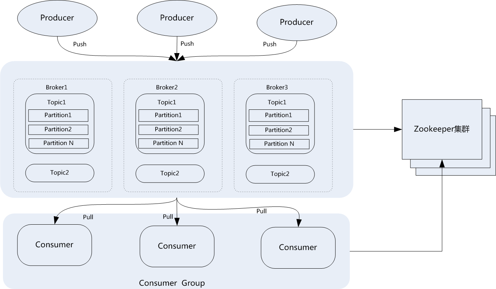
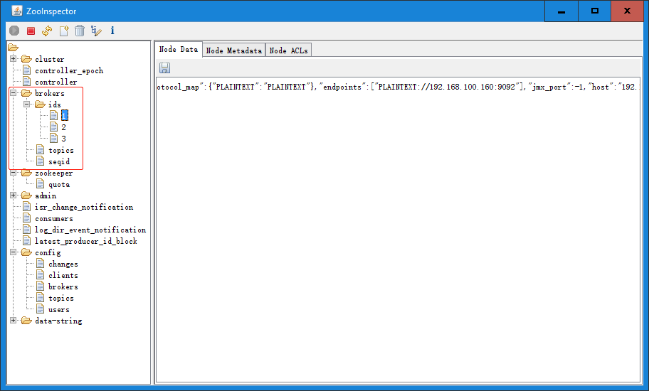
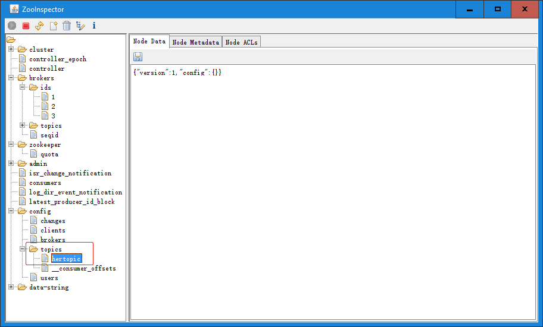

# 一. Kafka 介绍


Kafka 被称为下一代分布式消息系统，是非营利性组织 ASF(Apache Software
Foundation，简称为 ASF)基金会中的一个开源项目，比如 HTTP Server、Hadoop、
ActiveMQ、Tomcat 等开源软件都属于 Apache 基金会的开源软件，类似的消息系
统还有 RbbitMQ、ActiveMQ、ZeroMQ。

实际上 Kafka 最初由 Linkedin 公司开发，是一个分布式、支持分区的（partition）、
多副本的（replica），基于 zookeeper 协调的分布式消息系统，它的最大的特性就
是可以实时的处理大量数据以满足各种需求场景：比如基于 hadoop 的批处理系统、
低延迟的实时系统、storm/Spark 流式处理引擎，web/nginx 日志、访问日志，消息
服务等，Kafka 用 scala 语言编写，Linkedin 于 2010 年贡献给了 Apache 基金
会并成为 ASF 顶级开源项目。

[Kafka 官网](http://kafka.apache.org/)

[阿里云消息队列产品](https://www.aliyun.com/product/ons?spm=5176.234368.h2v3icoap.427.2620db25lcHi1Q&aly_as=Tz_Lue_o)

# 二. Kafka 概念和优势

## 2.1 Kafka 涉及的概念

Kafka 涉及的一些核心概念和术语：

```ruby
Broker：    Kafka集群包含一个或多个服务器，每个服务器就可以称为broker，负责核心存储功能;
Topic：     每条发布到Kafka集群的消息都有一个分类，这个类别被称为Topic(主题);
Producer：  消息的生产者，负责发布(push)消息到kafka broker;
Consumer：  消费消息的消费者，从kafka broker拉取(pull)数据，并消费这些已发布的消息;
Partition： Partition是物理上的概念，每个Topic包含一个或多个Partition，每个partition都是一个
            有序的队列。partition中的每条消息都会被分配一个有序的id(offset)，在所有消息中唯一;
Consumer Group：消费者组，可以给每个Consumer指定消费组，若不指定消费者组，则属于默认的group;
Message：       消息，通信的基本单位，每个producer可以向一个topic发布一些消息。
```

## 2.2 Kafka 集群架构

Kafka 是基于 zookeeper 协调的分布式消息系统。典型的 Kafka 集群需要 Zookeeper
作为协调方和作一些数据存储。Kafka 集群自身包括多个 Broker，以及多个 Producer
和 Consumer。Kafka 通过 Zookeeper 管理集群配置，选举 leader，以及在
Consumer Group 发生变化时进行 rebalance。Producer 使用 push 模式将消息发布到
各 broker，Consumer 则使用 pull 模式从 broker 订阅并消费消息。架构图如下：



上图展示了典型的 kafka 集群结构，zookeeper 也使用了集群部署方式。上图展示了 kafka
集群中的多个 broker，每个 broker 中存在多个 partition，Producer 可以同时将消息发布
给不同的 broker 的不同 partition，同样消费者也可以消费集群中不同的 broker 的不同
partition。允许多个生产者将消息写到同一个 partition 中，但是一个 partition 中的
消息只允许被一个消费者组中的消费者消费。

## 2.3 Topic/Partition

Kafka 中的某个 topic 可以被存储于多个 partition ，每个 topic 都可以设置存储其的
partition 数量。Partition 的数量决定了组成 topic 的 log 的数量。推荐 partition
的数量一定要大于同时运行的 consumer 的数量且小于或等于集群 broker 的数量，这样消
息数据就可以均匀的分布在各个 broker 中。

为什么要将 topic 存储于多个 Partition 呢?
kafka 是基于文件存储的，通过配置多个 partition 可以将消息内容分散存储到多个
broker 上，这样可以避免单个文件尺寸达到单机磁盘的上限。同时，将一个 topic 切分成
任意多个 partitions，可以保证消息存储、消息消费的效率，因为越多的 partitions 可
以容纳更多的 consumer，可有效提升 Kafka 的吞吐率。因此，将 Topic 切分成多个
partitions 的好处是可以将大量的消息分成多批数据同时写到不同节点上，将写请求分担
负载到各个集群节点。

在存储结构上，每个 partition 在物理上对应一个文件夹，partition 在 linux 服务器上
就是一个目录（文件夹）。该文件夹下存储这个 partition 的所有消息和索引文件。partiton
命名规则为 topic 名称+序号，第一个 partiton 序号从 0 开始，序号最大值为
partitions 数量减 1。

在每个 partition(文件夹)中有多个大小相等的 segment(段)数据文件，每个 segment 的
大小是相同的，但是每条消息的大小可能不相同，因此 segment 数据文件中消息数量不一定
相等。segment 数据文件有两个部分组成，分别为 index file 和 data file，此两个文件
是一一对应，成对出现，后缀".index"和".log"分别表示为 segment 索引文件和数据文件。

## 2.4 Kafka 的优势

Kafka 为什么这么快？

[面试中考官会问：Kafka 为什么速度那么快？](https://www.jianshu.com/p/da400265b1e8)

Kafka 优势：

```bash
快快快...
```

## 2.5 Kafka 与 Zookeeper

### 2.5.1 Zookeeper 对 kafka 的协调管理

1. 管理 broker 与 consumer 的动态加入与离开。

2. 触发负载均衡，当 broker 或 consumer 加入或离开时会触发负载均衡算法，使得一
   个 consumer group 内的多个 consumer 的消费负载平衡。

3. 存储和维护消费关系及每个 partition 的消费信息。

### 2.5.2 Zookeeper

1. 每个 broker 启动后会在 zookeeper 上注册一个临时的 broker registry，包含
   broker 的 ip 地址和端口号，所存储的 topics 和 partitions 信息。

2. 每个 consumer 启动后会在 zookeeper 上注册一个临时的 consumer registry，包含
   consumer 所属的 consumer group 以及订阅的 topics。

3. 每个 consumer group 关联一个临时的 owner registry 和一个持久的 offset registry。
   对于被订阅的每个 partition 包含一个 owner registry，内容为订阅这个 partition
   的 consumer id；同时包含一个 offset registry，内容为上一次订阅的 offset。

# 三. Kafka 部署

**在部署 Kafka 之前，需要先部署 zookeeper 集群：**
环境：

| 主机名           | IP              | 运行服务         |
| :--------------- | :-------------- | :--------------- |
| zoo-server-node1 | 192.168.100.160 | ZooKeeper、Kafka |
| zoo-server-node2 | 192.168.100.162 | ZooKeeper、Kafka |
| zoo-server-node3 | 192.168.100.164 | ZooKeeper、Kafka |

## 3.1 Kafka 版本选择

[Kafka 各版本](http://kafka.apache.org/downloads)
目前最新版本为 kafka_2.12-2.3.1
两种版本格式:kafka_scala 版本\_kafka 版本

[scala 版本 2.12](http://distfiles.macports.org/)

kafka_2.12-2.3.1 版本更新内容：

```bash
Kafka Connect REST API 进行了一些改进。
Kafka Connect 现在支持增量式合作再平衡。
Kafka Streams 现在支持内存中的会话存储和窗口存储。
AdminClient 现在允许用户确定他们有权对主题执行哪些操作。
有一个新的代理开始时间指标。
JMXTool 现在可以连接到安全的 RMI 端口。
已添加增量式 AlterConfigs API。 旧的 AlterConfigs API 已被弃用。
现在，我们跟踪低于其最小 ISR 计数的分区。
现在，即使在代理上启用了自动主题创建，消费者也可以选择退出。
Kafka 组件现在可以使用外部配置存储（KIP-421）。
遇到错误时，我们已实现了改进的副本获取程序行为。
```

## 3.2 各节点部署 Kafka

### 3.2.1 node1

```bash
root@zoo-server-node1:/usr/local/src# ll kafka_2.12-2.4.1.tgz
-rw-r--r-- 1 root root 62358954 Mar 25 22:53 kafka_2.12-2.4.1.tgz

root@zoo-server-node1:/usr/local/src# tar xf kafka_2.12-2.4.1.tgz

root@zoo-server-node1:/usr/local/src# ln -sv /usr/local/src/kafka_2.12-2.4.1 /usr/local/kafka
'/usr/local/kafka' -> '/usr/local/src/kafka_2.12-2.4.1'

root@zoo-server-node1:/usr/local/src# cd /usr/local/kafka/config/

root@zoo-server-node1:/usr/local/kafka/config# vim
connect-console-sink.properties    connect-file-sink.properties       connect-mirror-maker.properties    log4j.properties                   tools-log4j.properties
connect-console-source.properties  connect-file-source.properties     connect-standalone.properties      producer.properties                trogdor.conf
connect-distributed.properties     connect-log4j.properties           consumer.properties                server.properties                  zookeeper.properties
root@zoo-server-node1:/usr/local/kafka/config# vim  server.properties

root@zoo-server-node1:/usr/local/kafka/config# grep "^[a-Z]" server.properties
broker.id=1           # broker在集群中的唯一标识，为一个正整数
listeners=PLAINTEXT://192.168.100.160:9092  # kafka监听地址和端口
num.network.threads=3
num.io.threads=8      # IO线程数
socket.send.buffer.bytes=102400  # socket发送缓冲区大小
socket.receive.buffer.bytes=102400 # socket接收缓冲区大小
socket.request.max.bytes=104857600 # socket请求缓冲区大小
log.dirs=/usr/local/kafka/kafka-logs # kakfa用于保存数据的目录，所有的消息都会存储在该目录当中
num.partitions=1                   # 创建topic时默认存储其的分区数
num.recovery.threads.per.data.dir=1
offsets.topic.replication.factor=1
transaction.state.log.replication.factor=1
transaction.state.log.min.isr=1
log.retention.hours=168           # 设置kafka中消息保存时间，默认为168小时即7天
log.segment.bytes=1073741824
log.retention.check.interval.ms=300000

# 定连接的zk的地址,zk中存储了broker的元数据信息
zookeeper.connect=192.168.100.160:2181,192.168.100.162:2181,192.168.100.164:2181
zookeeper.connection.timeout.ms=6000 # 设置连接zookeeper的超时时间，默认6秒钟
group.initial.rebalance.delay.ms=0

root@zoo-server-node1:~# mkdir /usr/local/kafka/kafka-logs
```

将 kafka 程序分发到其它主机：

```bash
root@zoo-server-node1:~# scp /usr/local/src/kafka_2.12-2.4.1.tgz zoo-server-node2:/usr/local/src
root@zoo-server-node2's password:
kafka_2.12-2.4.1.tgz                   100%   59MB 118.1MB/s   00:00
root@zoo-server-node1:~# scp /usr/local/src/kafka_2.12-2.4.1.tgz zoo-server-node3:/usr/local/src
root@zoo-server-node3's password:
kafka_2.12-2.4.1.tgz                   100%   59MB 122.3MB/s   00:00
```

### 3.2.2 node2

```bash
root@zoo-server-node2:/usr/local/src# tar xf kafka_2.12-2.4.1.tgz

root@zoo-server-node2:/usr/local/src# ln -sv /usr/local/src/kafka_2.12-2.4.1 /usr/local/kafka
'/usr/local/kafka' -> '/usr/local/src/kafka_2.12-2.4.1'

root@zoo-server-node2:/usr/local/src# cd ../kafka/config/

root@zoo-server-node2:/usr/local/kafka/config# vim server.properties
root@zoo-server-node2:/usr/local/kafka/config# grep "^[a-Z]" server.properties
broker.id=2
listeners=PLAINTEXT://192.168.100.162:9092
num.network.threads=3
num.io.threads=8
socket.send.buffer.bytes=102400
socket.receive.buffer.bytes=102400
socket.request.max.bytes=104857600
log.dirs=/usr/local/kafka/kafka-logs
num.partitions=1
num.recovery.threads.per.data.dir=1
offsets.topic.replication.factor=1
transaction.state.log.replication.factor=1
transaction.state.log.min.isr=1
log.retention.hours=168
log.segment.bytes=1073741824
log.retention.check.interval.ms=300000
zookeeper.connect=192.168.100.160:2181,192.168.100.162:2181,192.168.100.164:2181
zookeeper.connection.timeout.ms=6000
group.initial.rebalance.delay.ms=0

root@zoo-server-node2:~# mkdir /usr/local/kafka/kafka-logs
```

### 3.2.3 node3

```bash
root@zoo-server-node3:~# cd /usr/local/src/
root@zoo-server-node3:/usr/local/src# tar xf kafka_2.12-2.4.1.tgz
root@zoo-server-node3:/usr/local/src# ln -sv /usr/local/src/kafka_2.12-2.4.1
kafka_2.12-2.4.1/     kafka_2.12-2.4.1.tgz
root@zoo-server-node3:/usr/local/src# ln -sv /usr/local/src/kafka_2.12-2.4.1 /usr/local/kafka
'/usr/local/kafka' -> '/usr/local/src/kafka_2.12-2.4.1'
root@zoo-server-node3:/usr/local/src# cd ../kafka/config/
root@zoo-server-node3:/usr/local/kafka/config# vim server.properties
root@zoo-server-node3:/usr/local/kafka/config# grep "^[a-Z]" server.properties
broker.id=3
listeners=PLAINTEXT://192.168.100.164:9092
num.network.threads=3
num.io.threads=8
socket.send.buffer.bytes=102400
socket.receive.buffer.bytes=102400
socket.request.max.bytes=104857600
log.dirs=/usr/local/kafka/kafka-logs
num.partitions=1
num.recovery.threads.per.data.dir=1
offsets.topic.replication.factor=1
transaction.state.log.replication.factor=1
transaction.state.log.min.isr=1
log.retention.hours=168
log.segment.bytes=1073741824
log.retention.check.interval.ms=300000
zookeeper.connect=192.168.100.160:2181,192.168.100.162:2181,192.168.100.164:2181
zookeeper.connection.timeout.ms=6000
group.initial.rebalance.delay.ms=0

root@zoo-server-node3:~# mkdir /usr/local/kafka/kafka-logs
```

## 3.3 各节点启动 Kafka

### 3.3.1 node1

```bash

root@zoo-server-node1:~# /usr/local/kafka/bin/kafka-server-start.sh -daemon /usr/local/kafka/config/server.properties

root@zoo-server-node1:~# tail -f /usr/local/kafka/logs/server.log
[2020-03-25 23:27:05,512] INFO [TransactionCoordinator id=1] Starting up. (kafka.coordinator.transaction.TransactionCoordinator)
[2020-03-25 23:27:05,515] INFO [TransactionCoordinator id=1] Startup complete. (kafka.coordinator.transaction.TransactionCoordinator)
[2020-03-25 23:27:05,522] INFO [Transaction Marker Channel Manager 1]: Starting (kafka.coordinator.transaction.TransactionMarkerChannelManager)
[2020-03-25 23:27:05,577] INFO [ExpirationReaper-1-AlterAcls]: Starting (kafka.server.DelayedOperationPurgatory$ExpiredOperationReaper)
[2020-03-25 23:27:05,604] INFO [/config/changes-event-process-thread]: Starting (kafka.common.ZkNodeChangeNotificationListener$ChangeEventProcessThread)
[2020-03-25 23:27:05,640] INFO [SocketServer brokerId=1] Started data-plane processors for 1 acceptors (kafka.network.SocketServer)
[2020-03-25 23:27:05,652] INFO Kafka version: 2.4.1 (org.apache.kafka.common.utils.AppInfoParser)
[2020-03-25 23:27:05,653] INFO Kafka commitId: c57222ae8cd7866b (org.apache.kafka.common.utils.AppInfoParser)
[2020-03-25 23:27:05,653] INFO Kafka startTimeMs: 1585150025640 (org.apache.kafka.common.utils.AppInfoParser)
[2020-03-25 23:27:05,658] INFO [KafkaServer id=1] started (kafka.server.KafkaServer)
```

### 3.3.2 node2

```bash
root@zoo-server-node2:~# /usr/local/kafka/bin/kafka-server-start.sh -daemon /usr/local/kafka/config/server.properties

root@zoo-server-node2:~# tail -f /usr/local/kafka/logs/server.log
[2020-03-25 23:27:09,060] INFO [TransactionCoordinator id=2] Starting up. (kafka.coordinator.transaction.TransactionCoordinator)
[2020-03-25 23:27:09,061] INFO [TransactionCoordinator id=2] Startup complete. (kafka.coordinator.transaction.TransactionCoordinator)
[2020-03-25 23:27:09,063] INFO [Transaction Marker Channel Manager 2]: Starting (kafka.coordinator.transaction.TransactionMarkerChannelManager)
[2020-03-25 23:27:09,091] INFO [ExpirationReaper-2-AlterAcls]: Starting (kafka.server.DelayedOperationPurgatory$ExpiredOperationReaper)
[2020-03-25 23:27:09,111] INFO [/config/changes-event-process-thread]: Starting (kafka.common.ZkNodeChangeNotificationListener$ChangeEventProcessThread)
[2020-03-25 23:27:09,133] INFO [SocketServer brokerId=2] Started data-plane processors for 1 acceptors (kafka.network.SocketServer)
[2020-03-25 23:27:09,142] INFO Kafka version: 2.4.1 (org.apache.kafka.common.utils.AppInfoParser)
[2020-03-25 23:27:09,142] INFO Kafka commitId: c57222ae8cd7866b (org.apache.kafka.common.utils.AppInfoParser)
[2020-03-25 23:27:09,143] INFO Kafka startTimeMs: 1585150029134 (org.apache.kafka.common.utils.AppInfoParser)
[2020-03-25 23:27:09,144] INFO [KafkaServer id=2] started (kafka.server.KafkaServer)
```

### 3.3.3 node3

```bash
root@zoo-server-node3:~# /usr/local/kafka/bin/kafka-server-start.sh -daemon /usr/local/kafka/config/server.properties

root@zoo-server-node3:~# tail -f /usr/local/kafka/logs/server.log
[2020-03-25 23:27:12,044] INFO [TransactionCoordinator id=3] Starting up. (kafka.coordinator.transaction.TransactionCoordinator)
[2020-03-25 23:27:12,046] INFO [TransactionCoordinator id=3] Startup complete. (kafka.coordinator.transaction.TransactionCoordinator)
[2020-03-25 23:27:12,046] INFO [Transaction Marker Channel Manager 3]: Starting (kafka.coordinator.transaction.TransactionMarkerChannelManager)
[2020-03-25 23:27:12,073] INFO [ExpirationReaper-3-AlterAcls]: Starting (kafka.server.DelayedOperationPurgatory$ExpiredOperationReaper)
[2020-03-25 23:27:12,097] INFO [/config/changes-event-process-thread]: Starting (kafka.common.ZkNodeChangeNotificationListener$ChangeEventProcessThread)
[2020-03-25 23:27:12,119] INFO [SocketServer brokerId=3] Started data-plane processors for 1 acceptors (kafka.network.SocketServer)
[2020-03-25 23:27:12,129] INFO Kafka version: 2.4.1 (org.apache.kafka.common.utils.AppInfoParser)
[2020-03-25 23:27:12,129] INFO Kafka commitId: c57222ae8cd7866b (org.apache.kafka.common.utils.AppInfoParser)
[2020-03-25 23:27:12,129] INFO Kafka startTimeMs: 1585150032119 (org.apache.kafka.common.utils.AppInfoParser)
[2020-03-25 23:27:12,131] INFO [KafkaServer id=3] started (kafka.server.KafkaServer)
```

## 3.4 查看 zookeeper 中的元数据

1. Broker 依赖于 Zookeeper，每个 Broker 的 id 和 Topic、Partition 这些
   元数据信息都会写入 Zookeeper 的 ZNode 节点中；
2. Consumer 依赖于 Zookeeper，Consumer 在消费消息时，每消费完一条消息，
   会将产生的 offset 保存到 Zookeeper 中，下次消费在当前 offset 往后
   继续消费；ps：kafka0.9 之前 Consumer 的 offset 存储在 Zookeeper 中，
   kafka0.9 以后 offset 存储在本地。
3. Partition 依赖于 Zookeeper，Partition 完成 Replication 备份后，选举
   出一个 Leader，这个是依托于 Zookeeper 的选举机制实现的；



启动 kafka 后，会在 zookeeper 维护的数据结构中生成一个 brokers 节点，该
节点的子节点 ids 保存了各个 kafka broker 的信息，如下：

```json
{
  "listener_security_protocol_map": { "PLAINTEXT": "PLAINTEXT" },
  "endpoints": ["PLAINTEXT://192.168.100.160:9092"],
  "jmx_port": -1,
  "host": "192.168.100.160",
  "timestamp": "1585150025298",
  "port": 9092,
  "version": 4
}
```

# 四. 测试 Kafka 读写数据

## 4.1 创建一个 topic

创建名为 mytopic，partitions(分区)为 3，replication 为 3 的 topic
可以在任意 kafaka 服务器操作：

```bash
root@zoo-server-node2:~# /usr/local/kafka/bin/kafka-topics.sh --create --zookeeper 192.168.100.160:2181,192.168.100.162:2181,192.168.100.164:2181 --partitions 3 --replication-factor 3 --topic mytopic
Created topic mytopic.
```

## 4.2 查看 topic 及 partition

状态说明：mytopic 类的消息可以存储于三个分区分别为 0、1、2，分区 0 的 leader
是 2（broker.id），分区 0 有三个副本，并且状态都为 lsr（ln-sync，表示可以参加
选举成为 leader）

```bash
root@zoo-server-node2:~# /usr/local/kafka/bin/kafka-topics.sh --describe --zookeeper 192.168.100.160:2181,192.168.100.162:2181,192.168.100.164:2181 --topic mytopic
Topic: mytopic	PartitionCount: 3	ReplicationFactor: 3	Configs:
	Topic: mytopic	Partition: 0	Leader: 2	Replicas: 2,3,1	Isr: 2,3,1
	Topic: mytopic	Partition: 1	Leader: 3	Replicas: 3,1,2	Isr: 3,1,2
	Topic: mytopic	Partition: 2	Leader: 1	Replicas: 1,2,3	Isr: 1,2,3
```

获取当前集群的所有 topic：

```bash
root@zoo-server-node2:~# /usr/local/kafka/bin/kafka-topics.sh --list --zookeeper 192.168.100.160:2181,192.168.100.162:2181,192.168.100.164:2181
mytopic

root@zoo-server-node2:~# /usr/local/kafka/bin/kafka-topics.sh --create --zookeeper 192.168.100.160:2181,192.168.100.162:2181,192.168.100.164:2181 --partitions 3 --replication-factor 3 --topic hertopic
Created topic hertopic.

root@zoo-server-node2:~# /usr/local/kafka/bin/kafka-topics.sh --list --zookeeper 192.168.100.160:2181,192.168.100.162:2181,192.168.100.164:2181
hertopic
mytopic
```

## 4.3 测试生产消息

```bash
root@zoo-server-node2:~# /usr/local/kafka/bin/kafka-console-producer.sh --broker-list 192.168.100.160:9092,192.168.100.162:9092,192.168.100.164:9092 --topic mytopic
>Hello, this message belongs to mytopic.
>I have three replica of me.
>haha
>hahahah..
>
>
>
>hello, there...
>

root@zoo-server-node2:~# /usr/local/kafka/bin/kafka-console-producer.sh --broker-list 192.168.100.160:9092,192.168.100.162:9092,192.168.100.164:9092 --topic hertopic
>hello, another topic message...
>

```

## 4.4 测试消费消息

可以到任意一台 kafka 服务器测试消息获取，只要有相应的消息获取客户端即可

```bash
root@zoo-server-node3:~# /usr/local/kafka/bin/kafka-console-consumer.sh --topic mytopic --bootstrap-server 192.168.100.162:9092 --from-beginning
I have three replica of me.
haha
Hello, this message belongs to mytopic.
hahahah..


hello, there...


root@zoo-server-node3:~# /usr/local/kafka/bin/kafka-console-consumer.sh --topic hertopic --bootstrap-server 192.168.100.162:9092 --from-beginning
hello, another topic message...
```

## 4.5 删除一个 topic

```bash
root@zoo-server-node1:~# /usr/local/kafka/bin/kafka-topics.sh --delete --zookeeper 192.168.100.160:2181,192.168.100.162:2181,192.168.100.164:2181 --topic mytopic
Topic mytopic is marked for deletion.
Note: This will have no impact if delete.topic.enable is not set to true. # 只有delete.topic.enable=true，删除才有效

root@zoo-server-node1:~# /usr/local/kafka/bin/kafka-topics.sh --list --zookeeper 192.168.100.160:2181,192.168.100.162:2181,192.168.100.164:2181
__consumer_offsets
hertopic
```

在 zooinspector 中查看 topics：

