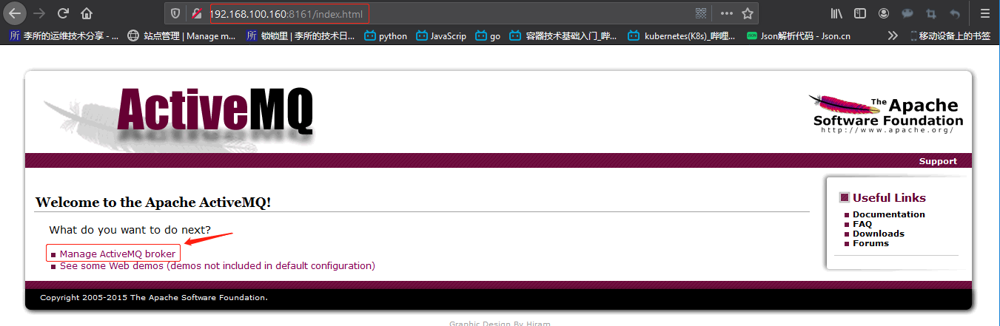
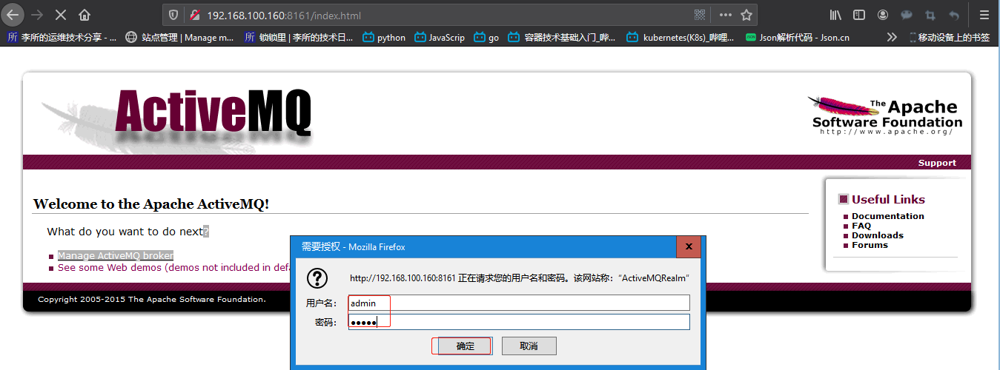
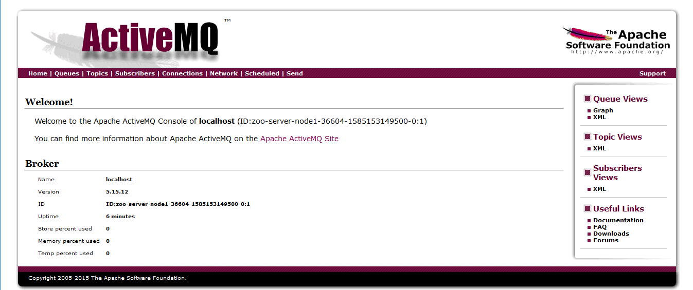

# 一. ActiveMQ 介绍

[ActiveMQ 阿帕奇官网](http://activemq.apache.org/)

ActiveMQ 是一种开源的基于 JMS（Java Message Servie）规范的一种消息中
间件的实现，ActiveMQ 采用 Java 开发，设计目标是提供标准的、面向消息的、
能够跨越多语言和多系统的应用集成消息通信中间件。

ActiveMQ 提供了多语言客户端支持，除了一般的 Java 客户端以外，还可以使用
C/C++、PHP、Python、JavaScript（Ajax）等语言开发客户端。

目前有两个版本可选择，下载地址：

http://activemq.apache.org/components/classic/download/
http://activemq.apache.org/download-archives

# 二. ActiveMQ 单机安装

[官方更新记录](http://activemq.apache.org/components/classic/)
[官方安装文档参考](http://activemq.apache.org/getting-started)

## 2.1 JAVA 环境

```bash
~# apt install openjdk-8-jdk
~# java -version
openjdk version "1.8.0_222"
OpenJDK Runtime Environment (build 1.8.0_222-8u222-b10-1ubuntu1~18.04.1-b10)
OpenJDK 64-Bit Server VM (build 25.222-b10, mixed mode)
```

## 2.2 部署并启动 ActiveMQ

```bash
root@zoo-server-node1:/usr/local/src# tar xf apache-activemq-5.15.12-bin.tar.gz
root@zoo-server-node1:/usr/local/src# ln -sv /usr/local/src/apache-activemq-5.15.12 /usr/local/activemq
'/usr/local/activemq' -> '/usr/local/src/apache-activemq-5.15.12'
root@zoo-server-node1:/usr/local/src# /usr/local/activemq/bin/linux-x86-64/activemq start
Starting ActiveMQ Broker...
```

## 2.3 验证

日志：

```bash
root@zoo-server-node1:/usr/local/src# tail /usr/local/activemq/data/activemq.log
2020-03-26 00:19:09,774 | INFO  | Creating Jetty connector | org.apache.activemq.transport.WebTransportServerSupport | WrapperSimpleAppMain
2020-03-26 00:19:09,938 | WARN  | ServletContext@o.e.j.s.ServletContextHandler@73ae4f61{/,null,STARTING} has uncovered http methods for path: / | org.eclipse.jetty.security.SecurityHandler | WrapperSimpleAppMain
2020-03-26 00:19:09,992 | INFO  | Listening for connections at ws://zoo-server-node1:61614?maximumConnections=1000&wireFormat.maxFrameSize=104857600 | org.apache.activemq.transport.ws.WSTransportServer | WrapperSimpleAppMain
2020-03-26 00:19:09,993 | INFO  | Connector ws started | org.apache.activemq.broker.TransportConnector | WrapperSimpleAppMain
2020-03-26 00:19:09,995 | INFO  | Apache ActiveMQ 5.15.12 (localhost, ID:zoo-server-node1-36604-1585153149500-0:1) started | org.apache.activemq.broker.BrokerService | WrapperSimpleAppMain
2020-03-26 00:19:09,996 | INFO  | For help or more information please see: http://activemq.apache.org | org.apache.activemq.broker.BrokerService | WrapperSimpleAppMain
2020-03-26 00:19:09,997 | WARN  | Store limit is 102400 mb (current store usage is 0 mb). The data directory: /usr/local/src/apache-activemq-5.15.12/bin/linux-x86-64/../../data/kahadb only has 32115 mb of usable space. - resetting to maximum available disk space: 32115 mb | org.apache.activemq.broker.BrokerService | WrapperSimpleAppMain
2020-03-26 00:19:09,997 | WARN  | Temporary Store limit is 51200 mb (current store usage is 0 mb). The data directory: /usr/local/src/apache-activemq-5.15.12/bin/linux-x86-64/../../data only has 32115 mb of usable space. - resetting to maximum available disk space: 32115 mb | org.apache.activemq.broker.BrokerService | WrapperSimpleAppMain
2020-03-26 00:19:11,058 | INFO  | ActiveMQ WebConsole available at http://0.0.0.0:8161/ | org.apache.activemq.web.WebConsoleStarter | WrapperSimpleAppMain  # 访问http://ip:8161即可
2020-03-26 00:19:11,058 | INFO  | ActiveMQ Jolokia REST API available at http://0.0.0.0:8161/api/jolokia/ | org.apache.activemq.web.WebConsoleStarter | WrapperSimpleAppMain
```

端口：

```bash
root@zoo-server-node1:/usr/local/src# lsof -i:8161
COMMAND   PID USER   FD   TYPE DEVICE SIZE/OFF NODE NAME
java    25196 root  143u  IPv6 104271      0t0  TCP *:8161 (LISTEN)
root@zoo-server-node1:/usr/local/src# ss -ntl | grep 8161
LISTEN 0       50                                *:8161                 *:*
root@zoo-server-node1:/usr/local/src# ss -ntlp | grep 8161
LISTEN 0       50                                *:8161                 *:*      users:(("java",pid=25196,fd=143))
```

进程：

```bash
root@zoo-server-node1:/usr/local/src# ps -ef | grep activemq
root      25194      1  0 00:19 ?        00:00:00 /usr/local/src/apache-activemq-5.15.12/bin/linux-x86-64/wrapper /usr/local/src/apache-activemq-5.15.12/bin/linux-x86-64/wrapper.conf wrapper.syslog.ident=ActiveMQ wrapper.pidfile=/usr/local/src/apache-activemq-5.15.12/bin/linux-x86-64/./ActiveMQ.pid wrapper.daemonize=TRUE wrapper.lockfile=/var/lock/subsys/ActiveMQ
root      25196  25194  5 00:19 ?        00:00:06 java -Dactivemq.home=../.. -Dactivemq.base=../.. -Djavax.net.ssl.keyStorePassword=password -Djavax.net.ssl.trustStorePassword=password -Djavax.net.ssl.keyStore=../../conf/broker.ks -Djavax.net.ssl.trustStore=../../conf/broker.ts -Dcom.sun.management.jmxremote -Dorg.apache.activemq.UseDedicatedTaskRunner=true -Djava.util.logging.config.file=logging.properties -Dactivemq.conf=../../conf -Dactivemq.data=../../data -Djava.security.auth.login.config=../../conf/login.config -Xmx1024m -Djava.library.path=../../bin/linux-x86-64/ -classpath ../../bin/wrapper.jar:../../bin/activemq.jar -Dwrapper.key=Mz0K_FVFZpSf2rpD -Dwrapper.port=32000 -Dwrapper.jvm.port.min=31000 -Dwrapper.jvm.port.max=31999 -Dwrapper.pid=25194 -Dwrapper.version=3.2.3 -Dwrapper.native_library=wrapper -Dwrapper.service=TRUE -Dwrapper.cpu.timeout=10 -Dwrapper.jvmid=1 org.tanukisoftware.wrapper.WrapperSimpleApp org.apache.activemq.console.Main start
root      25275  23050  0 00:21 pts/1    00:00:00 grep --color=auto activemq
```

## 2.4 登录 ActiveMQ WEB 端

1. 访问本机的 8161 端口，进入 web 端
   

2. 点击`Manage ActiveMQ broker`
   
   用户名和密码：admin

3. 可以开心的用了
   

# 三. RocketMQ 介绍

[rocketmq.apache](https://rocketmq.apache.org/)

[Github 项目地址](https://github.com/apache/rocketmq)

[阿里开源基于 Java 开发的消息队列](http://jm.taobao.org/tags/Apache-RocketMQ/)
