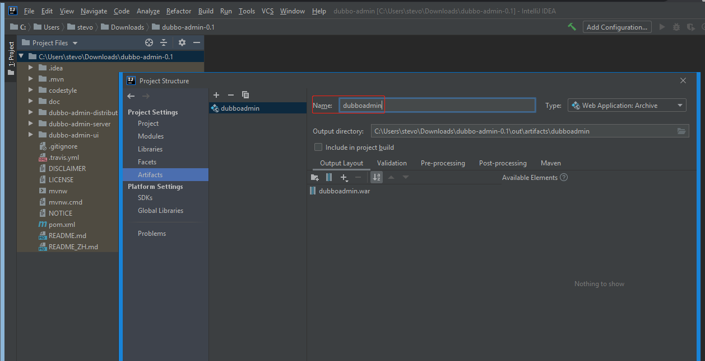
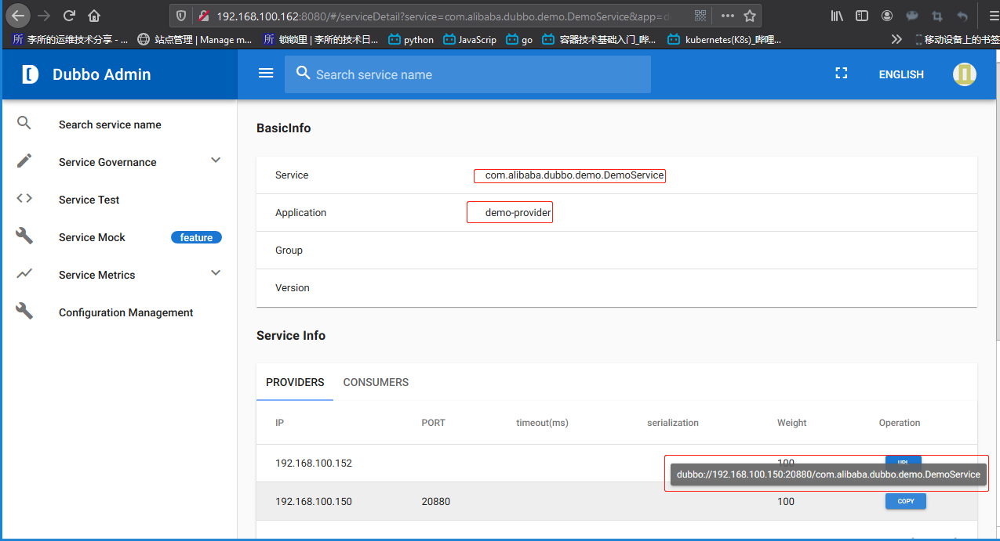

`Apache Dubbo` 是一款高性能、轻量级的开源 Java RPC 框架，它提供了三大核心能力：
面向接口的远程方法调用，智能容错和负载均衡，以及服务自动注册和发现。


节点角色说明:

| 节点      | 角色说明                               |
| :-------- | :------------------------------------- |
| Provider  | 暴露服务的服务提供方                   |
| Consumer  | 调用远程服务的服务消费方               |
| Registry  | 服务注册与发现的注册中心               |
| Monitor   | 统计服务的调用次数和调用时间的监控中心 |
| Container | 服务运行容器                           |

调用关系说明:

1. 服务容器负责启动，加载，运行服务提供者。
2. 服务提供者在启动时，向注册中心注册自己提供的服务。
3. 服务消费者在启动时，向注册中心订阅自己所需的服务。
4. 注册中心返回服务提供者地址列表给消费者，如果有变更，注册中心将基于长连接推送变更数据给消费者。
5. 服务消费者，从提供者地址列表中，基于软负载均衡算法，选一台提供者进行调用，如果调用失败，再选
   另一台调用。
6. 服务消费者和提供者，在内存中累计调用次数和调用时间，定时每分钟发送一次统计数据到监控中心。

[Dubbo Github 项目地址](https://github.com/apache/dubbo)

可以使用 github 的源码编译或者自己打包运行生产者和消费者 demo，这里使用
预先编译的 dubbo demo 程序实现简单的生产者和消费者关系，使用 zookeeper
作为注册中心，tomcat 和 dubbo-admin 提供 web 管理界面。

环境：

| 主机名              | IP              | 运行服务              |
| :------------------ | :-------------- | :-------------------- |
| zoo-server-node1    | 192.168.100.160 | zookeeper,kafka       |
| zoo-server-node2    | 192.168.100.162 | zookeeper,kafka       |
| zoo-server-node3    | 192.168.100.164 | zookeeper,kafka       |
| tomcat-server-node1 | 192.168.100.150 | tomcat,dubbo-provider |
| tomcat-server-node2 | 192.168.100.152 | tomcat,dubbo-consumer |

整个流程会用到以下包：


[下载地址：suosuoli.cn](https://suosuoli.cn/suo/sources/dubbo.zip)

# 一. 生产者示例

## 1.1 启动 Provider

```bash
root@tomcat-server-node1:/usr/local/src# rz -E
rz waiting to receive.
root@tomcat-server-node1:/usr/local/src# tar xf dubbo-demo-provider-2.1.5-assembly.tar.gz

root@tomcat-server-node1:/usr/local/src# cd dubbo-demo-provider-2.1.5/
root@tomcat-server-node1:/usr/local/src/dubbo-demo-provider-2.1.5# vim conf/dubbo.properties
...
#dubbo.registry.address=multicast://224.5.6.7:1234
dubbo.registry.address=zookeeper://192.168.100.160:2181|zookeeper://192.168.100.162:2181|zookeeper://192.168.100.164:2181  # 集群配置，单机配置只写一个
...

root@tomcat-server-node1:/usr/local/src/dubbo-demo-provider-2.1.5# ./bin/start.sh  # 启动
Starting the demo-provider .....

# 查看日志
root@tomcat-server-node1:/usr/local/src/dubbo-demo-provider-2.1.5# tail logs/stdout.log
OpenJDK 64-Bit Server VM warning: Ignoring option PermSize; support was removed in 8.0
log4j:WARN No appenders could be found for logger (com.alibaba.dubbo.common.logger.LoggerFactory).
log4j:WARN Please initialize the log4j system properly.
log4j:WARN See http://logging.apache.org/log4j/1.2/faq.html#noconfig for more info.
WARNING: An illegal reflective access operation has occurred
WARNING: Illegal reflective access by javassist.ClassPool (file:/usr/local/src/dubbo-demo-provider-2.1.5/lib/javassist-3.15.0-GA.jar) to method java.lang.ClassLoader.defineClass(java.lang.String,byte[],int,int)
WARNING: Please consider reporting this to the maintainers of javassist.ClassPool
WARNING: Use --illegal-access=warn to enable warnings of further illegal reflective access operations
WARNING: All illegal access operations will be denied in a future release
[2020-03-26 14:07:31] Dubbo service server started!  # 已经启动
```

## 1.2 zookeeper 查看是否注册


# 二. 消费者示例

## 2.1 部署并启动 Consumer

```bash
root@tomcat-server-node2:~# cd /usr/local/src/
root@tomcat-server-node2:/usr/local/src# rz -E
rz waiting to receive.
root@tomcat-server-node2:/usr/local/src# tar xf dubbo-demo-consumer-2.1.5-assembly.tar.gz
tar: A lone zero block at 22566

# 修改配置文件
root@tomcat-server-node2:/usr/local/src# cd dubbo-demo-consumer-2.1.5/
root@tomcat-server-node2:/usr/local/src/dubbo-demo-consumer-2.1.5# vim conf/dubbo.properties
...
#dubbo.registry.address=multicast://224.5.6.7:1234
dubbo.registry.address=zookeeper://192.168.100.160:2181|zookeeper://192.168.100.162:2181|zookeeper://192.168.100.164:2181
...

# 启动consumer
root@tomcat-server-node2:/usr/local/src/dubbo-demo-consumer-2.1.5# ./bin/start.sh
Starting the demo-consumer ....OK!
PID: 1850
STDOUT: logs/stdout.log
```

## 2.2 zookeeper 查看是否注册


## 2.3 查看 Provider 和 Consumer 日志

Provider:

```bash
root@tomcat-server-node1:/usr/local/src/dubbo-demo-provider-2.1.5# tail logs/stdout.log
[14:15:10] Hello world22, request from consumer: /192.168.100.152:57353
[14:15:12] Hello world23, request from consumer: /192.168.100.152:57353
[14:15:14] Hello world24, request from consumer: /192.168.100.152:57353
[14:15:16] Hello world25, request from consumer: /192.168.100.152:57353
[14:15:18] Hello world26, request from consumer: /192.168.100.152:57353
[14:15:20] Hello world27, request from consumer: /192.168.100.152:57353
[14:15:22] Hello world28, request from consumer: /192.168.100.152:57353
[14:15:24] Hello world29, request from consumer: /192.168.100.152:57353
[14:15:26] Hello world30, request from consumer: /192.168.100.152:57353
[14:15:28] Hello world31, request from consumer: /192.168.100.152:57353
```

Consumer:

```bash
root@tomcat-server-node2:/usr/local/src/dubbo-demo-consumer-2.1.5# tail logs/stdout.log
[14:15:14] Hello world24, response form provider: 192.168.100.150:20880
[14:15:16] Hello world25, response form provider: 192.168.100.150:20880
[14:15:18] Hello world26, response form provider: 192.168.100.150:20880
[14:15:20] Hello world27, response form provider: 192.168.100.150:20880
[14:15:22] Hello world28, response form provider: 192.168.100.150:20880
[14:15:24] Hello world29, response form provider: 192.168.100.150:20880
[14:15:26] Hello world30, response form provider: 192.168.100.150:20880
[14:15:28] Hello world31, response form provider: 192.168.100.150:20880
[14:15:30] Hello world32, response form provider: 192.168.100.150:20880
[14:15:32] Hello world33, response form provider: 192.168.100.150:20880
```

# 三. dubbo-admin 部署

dubbo-admin 是基于 zookeeper 发现并管理 provider 和 consume 的控制管理
web 端。

## 3.1 部署 tomcat 和 dubbo-admin

### 3.1.1 tomcat 部署

略

### 3.1.2 dubbo-admin 部署

1. 到 github 下载 dubbo-admin 源码，并解压
   https://github.com/apache/dubbo-admin

2. 使用 IntelliJ IEAD 作为工程打开，打开工程配置，新增一个 Artifacts
   

3. 点击构建，构建 Artifacts
   


4. 部署：
   将`dubboadmin.war`包上传到服务器，部署在 tomcat 的`webapps/`下：

```bash
root@tomcat-server-node1:~# cd /usr/local/src/
root@tomcat-server-node1:/usr/local/src# rz -E
rz waiting to receive.

# 将dubbo-admin的war包解压到/usr/local/tomca/webapps/
root@tomcat-server-node1:/usr/local/src# unzip dubbo-admin-2.4.1.war -d /usr/local/tomcat/webapps/dubboadmin
Archive:  dubbo-admin-2.4.1.war
...

root@tomcat-server-node1:/usr/local/src# cd /usr/local/tomcat/webapps/dubboadmin

root@tomcat-server-node1:/usr/local/tomcat/webapps/dubboadmin# pwd
/usr/local/tomcat/webapps/dubboadmin

root@tomcat-server-node1:/usr/local/tomcat/webapps/dubboadmin# ll
total 40
drwxr-xr-x  8 root root 4096 Mar 26 14:32 ./
drwxr-x--- 14 root root 4096 Mar 26 14:32 ../
-rw-r--r--  1 root root  101 Jul 19  2012 crossdomain.xml
drwxr-xr-x  2 root root 4096 Jul 23  2012 css/
-rw-r--r--  1 root root 1406 Jul 19  2012 favicon.ico
drwxr-xr-x  2 root root 4096 Jul 23  2012 images/
drwxr-xr-x  2 root root 4096 Jul 23  2012 js/
drwxr-xr-x  4 root root 4096 Jul 23  2012 META-INF/
drwxr-xr-x  2 root root 4096 Jul 23  2012 SpryAssets/
drwxr-xr-x  8 root root 4096 Jul 23  2012 WEB-INF/

# 更改zookeeper地址
root@tomcat-server-node1:/usr/local/tomcat/webapps/dubboadmin# vim WEB-INF/dubbo.properties
dubbo.registry.address=zookeeper://192.168.100.160:2181|zookeeper://192.168.100.162:2181|zookeeper://192.168.100.164:2181
dubbo.admin.root.password=stevenux
dubbo.admin.guest.password=stevenux

# 启动tomcat
root@tomcat-server-node1:~# /usr/local/tomcat/bin/catalina.sh start
Using CATALINA_BASE:   /usr/local/tomcat
Using CATALINA_HOME:   /usr/local/tomcat
Using CATALINA_TMPDIR: /usr/local/tomcat/temp
Using JRE_HOME:        /usr
Using CLASSPATH:       /usr/local/tomcat/bin/bootstrap.jar:/usr/local/tomcat/bin/tomcat-juli.jar
Tomcat started.
root@tomcat-server-node1:~# lsof -i:8080
COMMAND  PID USER   FD   TYPE DEVICE SIZE/OFF NODE NAME
java    2379 root   39u  IPv6  41332      0t0  TCP *:http-alt (LISTEN)

root@tomcat-server-node1:~# ps -ef | grep tomcat
root       2379      1 68 14:37 pts/1    00:00:12 /usr/bin/java -Djava.util.logging.config.file=/usr/local/tomcat/conf/logging.properties -Djava.util.logging.manager=org.apache.juli.ClassLoaderLogManager -Djdk.tls.ephemeralDHKeySize=2048 -Djava.protocol.handler.pkgs=org.apache.catalina.webresources -Dorg.apache.catalina.security.SecurityListener.UMASK=0027 -Dignore.endorsed.dirs= -classpath /usr/local/tomcat/bin/bootstrap.jar:/usr/local/tomcat/bin/tomcat-juli.jar -Dcatalina.base=/usr/local/tomcat -Dcatalina.home=/usr/local/tomcat -Djava.io.tmpdir=/usr/local/tomcat/temp org.apache.catalina.startup.Bootstrap start
root       2433   1945  0 14:37 pts/1    00:00:00 grep --color=auto tomcat

```

## 3.2 查看 tomcat 日志

```bash
~# tail /usr/local/tomcat/logs/catalina.out
...
26-Mar-2020 15:30:37.234 INFO [localhost-startStop-1] org.apache.catalina.startup.HostConfig.deployDirectory Deployment of web application directory [/usr/local/src/apache-tomcat-8.5.42/webapps/dubboadmin] has finished in [3,070] m
26-Mar-2020 15:30:51.341 INFO [main] org.apache.coyote.AbstractProtocol.start Starting ProtocolHandler ["http-nio-8080"]
26-Mar-2020 15:30:51.366 INFO [main] org.apache.coyote.AbstractProtocol.start Starting ProtocolHandler ["ajp-nio-8009"]
26-Mar-2020 15:30:51.368 INFO [main] org.apache.catalina.startup.Catalina.start Server startup in 4781 ms
```

## 3.3 登录 dubbo-admin web

略

# 四. 编译 dubbo-admin

[Dubbo 源码构建说明](http://dubbo.apache.org/zh-cn/docs/dev/build.html)

## 4.1 编译说明

### 4.1.1 克隆代码

```bash
root@zoo-server-node2:/usr/local/src# git clone https://github.com/apache/dubbo-admin.git
Cloning into 'dubbo-admin'...
remote: Enumerating objects: 7753, done.
remote: Total 7753 (delta 0), reused 0 (delta 0), pack-reused 7753
Receiving objects: 100% (7753/7753), 12.87 MiB | 898.00 KiB/s, done.
Resolving deltas: 100% (4210/4210), done.
```

### 4.1.2 maven 工具

Maven 翻译为"专家"、"内行"，是 Apache 下的一个纯 Java 开发的开源项目，
Maven 是一个项目管理工具，可以对 Java 项目进行构建、解决打包依赖等。

POM( Project Object Model，项目对象模型 ) 是 Maven 工程的基本工作单元，
是一个 XML 文件，包含了项目的基本信息，用于描述项目如何构建，声明项目
依赖等，在执行任务或目标时，Maven 会在当前目录中查找 pom 文件，通过读
取 pom 文件获取所需的配置信息，然后编译目标。
Pom 文件中可以指定以下配置:

```bash
项目依赖
插件
执行目标
项目构建 profile
项目版本
项目开发者列表
相关邮件列表信息
```

Maven 安装：
[apache maven](http://maven.apache.org/install.html)
[清华镜像源](http://mirrors.tuna.tsinghua.edu.cn/apache/maven)
[官方各版本下载地址，推荐使用次新版本](https://archive.apache.org/dist/maven/maven-3/)

### 4.1.3 JAVA 环境

Maven 是一个基于 Java 的工具所以服务器要安装 jdk 环境，版本要求如下：

```bash
Maven 3.3 要求 JDK 1.7 或以上
Maven 3.2 要求 JDK 1.6 或以上
Maven 3.0/3.1 要求 JDK 1.5 或以上
```

### 4.1.4 部署 maven

```bash
~# wget https://archive.apache.org/dist/maven/maven-3/3.6.2/binaries/apache-maven-3.6.2-bin.tar.gz
root@zoo-server-node2:/usr/local/src# tar xf apache-maven-3.6.2-bin.tar.gz
root@zoo-server-node2:/usr/local/src# vim /etc/profile.d/maven.sh

root@zoo-server-node2:/usr/local/src# vim /etc/profile.d/maven.sh
export PATH=/usr/local/src/apache-maven-3.6.2/bin/:$PATH

root@zoo-server-node2:/usr/local/src# . /etc/profile.d/maven.sh
root@zoo-server-node2:/usr/local/src# mv
mv        mvn       mvnDebug  mvnyjp
root@zoo-server-node2:/usr/local/src# mvn -v
Apache Maven 3.6.2 (40f52333136460af0dc0d7232c0dc0bcf0d9e117; 2019-08-27T23:06:16+08:00)
Maven home: /usr/local/src/apache-maven-3.6.2
Java version: 11.0.6, vendor: Ubuntu, runtime: /usr/lib/jvm/java-11-openjdk-amd64
Default locale: en_US, platform encoding: UTF-8
OS name: "linux", version: "4.15.0-55-generic", arch: "amd64", family: "unix"
```

## 4.2 执行编译

### 4.2.1 maven 编译命令

Maven 的打包命令:

1. 进入到包含有“pom.xml”的路径，执行：

```bash
~# mvn clean install package
```

2. 有的时候受到测试的干扰，导致无法正在进行编译，这时候可以选择跳过测试：

```bash
~# mvn clean install package -Dmaven.test.skip=true

 #  " -Dmaven.test.skip=true"：跳过测试，并且不编译测试下的源代码；
 #  "-DskipTests"：            不执行测试，但是会进行测试代码的编译；
```

3. 如果需要编译的代码异常庞大，需要考虑对编译环境做一些处理，提成编译效率：

```bash
~# mvn -T 4 clean install package -Dmaven.test.skip=true  # 启动多线程编译：
~# mvn -T 2C clean install package -Dmaven.test.skip=true # 分配编译的 CPU 个数：
~# mvn clean install package -Dmaven.test.skip=true -Dmaven.compile.fork=true # 启用多线程编译：
```

4. 所有的 Maven 都是建立在 JVM 上的，所以进行编译的时候还需要考虑 JVM 参数优化：

Windows 下:`maven/bin/mvn.cmd`
Linux 下: `maven/bin/mvn`
配置参数：`MAVEN_OPTS`

```bash
~# vim /etc/profile
export MAVEN_OPTS="-Xmx6g -Xms6g"

~# source /etc/profile
```

### 4.2.2 编译准备

1. 确保安装 npm：

```bash
root@zoo-server-node2:/usr/local/src/dubbo-admin# apt install npm -y
```

2. 修改 node.js 源为淘宝源，加速资源下载

```bash
~# npm config get registry
https://registry.npmjs.org/

~# npm config set registry=https://registry.npm.taobao.org

~# npm config get registry
https://registry.npm.taobao.org
```

3. 修改配置文件中的 zookeeper 地址

```bash
~# pwd
/usr/local/src
~# cd dubbo-admin/

# 修改zookeeper地址为实际地址
~# vim dubbo-admin-server/src/main/resources/application.properties
...
# centers in dubbo2.7
admin.registry.address=zookeeper://192.168.100.160:2181
admin.config-center=zookeeper://192.168.100.160:2181
admin.metadata-report.address=zookeeper://192.168.100.160:2181
...
```

## 4.3 编译过程

```bash
~# pwd
/usr/local/src/dubbo-admin
~# mvn clean install package -Dmaven.test.skip=true
[INFO] Scanning for projects...
Downloading from central: https://repo.maven.apache.org/maven2/org/springframework/session/spring-session-bom/Bean-SR4/spring-session-bom-Bean-SR4.pom
Downloaded from central: https://repo.maven.apache.org/maven2/org/springframework/session/spring-session-bom/Bean-SR4/spring-session-bom-Bean-SR4.pom (3.0 kB at 1.3 kB/s)
[INFO] ------------------------------------------------------------------------
[INFO] Reactor Build Order:
[INFO]
[INFO] dubbo-admin                                                        [pom]
[INFO] dubbo-admin-ui                                                     [jar]
[INFO] dubbo-admin-server                                                 [jar]
[INFO] dubbo-admin-distribution                                           [jar]
[INFO]
[INFO] -----------------------< org.apache:dubbo-admin >-----------------------
[INFO] Building dubbo-admin 0.1                                           [1/4]
[INFO] --------------------------------[ pom ]---------------------------------
......

[INFO] --- maven-antrun-plugin:1.8:run (default) @ dubbo-admin-distribution ---
[WARNING] Parameter tasks is deprecated, use target instead
[INFO] Executing tasks

main:
[INFO] Executed tasks
[INFO] ------------------------------------------------------------------------
[INFO] Reactor Summary for dubbo-admin 0.1:
[INFO]
[INFO] dubbo-admin ........................................ SUCCESS [22:22 min]
[INFO] dubbo-admin-ui ..................................... SUCCESS [10:58 min]
[INFO] dubbo-admin-server ................................. SUCCESS [28:02 min]
[INFO] dubbo-admin-distribution ........................... SUCCESS [ 22.992 s]
[INFO] ------------------------------------------------------------------------
[INFO] BUILD SUCCESS  # 构建成功
[INFO] ------------------------------------------------------------------------
[INFO] Total time:  01:01 h
[INFO] Finished at: 2020-03-26T14:59:58+08:00
[INFO] ------------------------------------------------------------------------
```

## 4.4 查看生成的 jar 包

```bash
~# pwd
/usr/local/src/dubbo-admin

~# ll dubbo-admin-distribution/target/
antrun/                           dubbo-admin-0.1.jar               maven-archiver/                   .plxarc
classes/                          dubbo-admin-distribution-0.1.jar  maven-shared-archive-resources/

~# ls -l dubbo-admin-distribution/target/dubbo-admin-0.1.jar
-rw-r--r-- 1 root root 63175919 Mar 26 14:59 dubbo-admin-distribution/target/dubbo-admin-0.1.jar

~# file dubbo-admin-distribution/target/dubbo-admin-0.1.jar
dubbo-admin-distribution/target/dubbo-admin-0.1.jar: Java archive data (JAR)
```

## 4.5 启动服务测试

```bash
~# pwd
/usr/local/src/dubbo-admin

~# java -jar dubbo-admin-distribution/target/dubbo-admin-0.1.jar
2020-03-26 15:07:27.969 DEBUG 29632 --- [kground-preinit] .h.v.m.ResourceBundleMessageInterpolator : Loaded expression factory via original TCCL

  .   ____          _            __ _ _
 /\\ / ___'_ __ _ _(_)_ __  __ _ \ \ \ \
( ( )\___ | '_ | '_| | '_ \/ _` | \ \ \ \
 \\/  ___)| |_)| | | | | || (_| |  ) ) ) )
  '  |____| .__|_| |_|_| |_\__, | / / / /
 =========|_|==============|___/=/_/_/_/
 :: Spring Boot ::        (v2.1.4.RELEASE)

log4j:WARN No appenders could be found for logger (org.apache.dubbo.common.logger.LoggerFactory).
log4j:WARN Please initialize the log4j system properly.
log4j:WARN See http://logging.apache.org/log4j/1.2/faq.html#noconfig for more info.
2020-03-26 15:07:30.294  INFO 29632 --- [           main] o.s.b.w.embedded.tomcat.TomcatWebServer  : Tomcat initialized with port(s): 8080 (http)
2020-03-26 15:07:30.481  INFO 29632 --- [           main] o.s.web.context.ContextLoader            : Root WebApplicationContext: initialization completed in 2252 ms
WARNING: An illegal reflective access operation has occurred
WARNING: Illegal reflective access by javassist.ClassPool (jar:file:/usr/local/src/dubbo-admin/dubbo-admin-distribution/target/dubbo-admin-0.1.jar!/BOOT-INF/lib/javassist-3.20.0-GA.jar!/) to method java.lang.ClassLoader.defineClass(java.lang.String,byte[],int,int,java.security.ProtectionDomain)
WARNING: Please consider reporting this to the maintainers of javassist.ClassPool
WARNING: Use --illegal-access=warn to enable warnings of further illegal reflective access operations
WARNING: All illegal access operations will be denied in a future release
2020-03-26 15:07:31.824  INFO 29632 --- [           main] pertySourcedRequestMappingHandlerMapping : Mapped URL path [/v2/api-docs] onto method [public org.springframework.http.ResponseEntity<springfox.documentation.spring.web.json.Json> springfox.documentation.swagger2.web.Swagger2Controller.getDocumentation(java.lang.String,javax.servlet.http.HttpServletRequest)]
2020-03-26 15:07:32.006  INFO 29632 --- [           main] o.s.s.concurrent.ThreadPoolTaskExecutor  : Initializing ExecutorService 'applicationTaskExecutor'
2020-03-26 15:07:32.110  INFO 29632 --- [           main] o.s.b.a.w.s.WelcomePageHandlerMapping    : Adding welcome page: class path resource [public/index.html]
2020-03-26 15:07:32.270  INFO 29632 --- [           main] d.s.w.p.DocumentationPluginsBootstrapper : Context refreshed
2020-03-26 15:07:32.311  INFO 29632 --- [           main] d.s.w.p.DocumentationPluginsBootstrapper : Found 1 custom documentation plugin(s)
2020-03-26 15:07:32.401  INFO 29632 --- [           main] s.d.s.w.s.ApiListingReferenceScanner     : Scanning for api listing references
2020-03-26 15:07:32.720  INFO 29632 --- [           main] .d.s.w.r.o.CachingOperationNameGenerator : Generating unique operation named: disableRouteUsingPUT_1
2020-03-26 15:07:32.725  INFO 29632 --- [           main] .d.s.w.r.o.CachingOperationNameGenerator : Generating unique operation named: enableRouteUsingPUT_1
2020-03-26 15:07:32.792  INFO 29632 --- [           main] .d.s.w.r.o.CachingOperationNameGenerator : Generating unique operation named: searchServiceUsingGET_1
2020-03-26 15:07:32.904  INFO 29632 --- [           main] .d.s.w.r.o.CachingOperationNameGenerator : Generating unique operation named: createRuleUsingPOST_1
2020-03-26 15:07:32.910  INFO 29632 --- [           main] .d.s.w.r.o.CachingOperationNameGenerator : Generating unique operation named: deleteRouteUsingDELETE_1
2020-03-26 15:07:32.920  INFO 29632 --- [           main] .d.s.w.r.o.CachingOperationNameGenerator : Generating unique operation named: detailRouteUsingGET_1
2020-03-26 15:07:32.922  INFO 29632 --- [           main] .d.s.w.r.o.CachingOperationNameGenerator : Generating unique operation named: disableRouteUsingPUT_2
2020-03-26 15:07:32.924  INFO 29632 --- [           main] .d.s.w.r.o.CachingOperationNameGenerator : Generating unique operation named: enableRouteUsingPUT_2
2020-03-26 15:07:32.933  INFO 29632 --- [           main] .d.s.w.r.o.CachingOperationNameGenerator : Generating unique operation named: searchRoutesUsingGET_1
2020-03-26 15:07:32.935  INFO 29632 --- [           main] .d.s.w.r.o.CachingOperationNameGenerator : Generating unique operation named: updateRuleUsingPUT_1
2020-03-26 15:07:33.002  INFO 29632 --- [           main] o.s.b.w.embedded.tomcat.TomcatWebServer  : Tomcat started on port(s): 8080 (http) with context path ''  # 访问8080端口
```

## 4.6 登录 dubbo-admin

这里实际没进入控制台，随便点击某处，会提示登录：


root 用户默认密码 root
guest 用户默认密码 guest


进入管理控制台：


dubbo 生产者和消费者：


调用地址：

