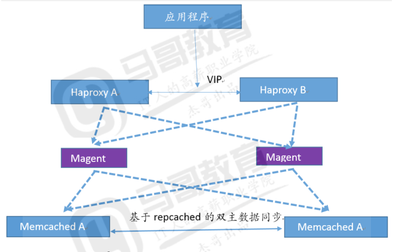
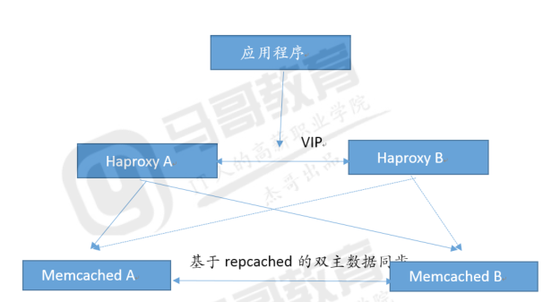

# memcached 简介

memcache 本身没有像 redis 所具备的数据持久化功能，比如 RDB 和 AOF 都没有，但是
可以通过做集群同步的方式，让各 memcache 服务器的数据进行同步，从而实现数据的一致
性，即保证各 memcache 的数据是一样的，即使有任何一台 memcache 发生故障，只要集
群种有一台 memcache 可用就不会出现数据丢失，当其他 memcache 重新加入到集群的时
候可以自动从有数据的 memcache 当中自动获取数据并提供服务。Memcache 借助了操作系
统的 libevent 工具做高效的读写。libevent 是个程序库，它将 Linux 的 epoll、BSD
类操作系统的 kqueue 等事件处理功能封装成统一的接口。即使对服务器的连接数增加，也
能发挥高性能。memcached 使用这个 libevent 库，因此能在 Linux、BSD、Solaris 等
操作系统上发挥其高性能。Memcache 支持最大的内存存储对象为 1M，超过 1M 的数据可
以使用客户端压缩或拆分报包放到多个 key 中，比较大的数据在进行读取的时候需要消耗
的时间比较长，memcache 最适合保存用户的 session 实现 session 共享，Memcached
存储数据时, Memcached 会去申请 1MB 的内存, 把该块内存称为一个 slab, 也称为一个
page。memcached 具有多种语言的客户端开发包，包括：Perl/PHP/JAVA/C/Python/Ruby
/C#/。

[Memcached 官网](http://memcached.org/)

# 二.单机部署 memcached

## 2.1 yum 安装

```bash
# yum  install  memcached  -y
# vim /etc/sysconfig/memcached
PORT="11211" #监听端口
USER="memcached" #启动用户
MAXCONN="1024" #最大连接数
CACHESIZE="1024" #最大使用内存
OPTIONS="" #其他选项
```

## 2.2 使用 python 连接 memcached

```bash
yum install python-pip
pip install python-memcache
```

```py
#!/usr/bin/env python

import memcache

conn = memcache.Client(['192.168.100.18:11211'], debug=True)
for i in range(10000):
    conn.set("K-%d" % i,"V-%d" % i)
    data = m.get('K-%d' % i)
    print(data)
```

## 2.3 编译安装 memcached

### 编译

```bash
# yum install libevent libevent-devel –y
# pwd
/usr/local/src
# tar xvf  memcached-1.5.12.tar.gz
# ./configure   --prefix=/usr/local/memcache
# make && make install
```

### 启动

```bash
# /usr/local/memcache/bin/memcached -u memcached -p 11211 -m 2048 -c 65536 &
```

# 三.memcached 集群部署

## 3.1 基于 magent 部署

该部署方式依赖于 magent 实现高可用，应用端通过负载服务器连接到 magent，然后再由
magent 代理用户应用请求到 memcached 处理，底层的 memcached 为双主结构会自动同步
数据，本部署方式存在 magent 单点问题因此需要两个 magent 实现高可用。



## 3.2 Repcached 实现原理

在 master 上可以通过 -X 指定 replication port，在 slave 上通过 -x/-X 找到 master
并 connect 上去，事实上，如果同时指定了 -x/-X， repcached 一定会尝试连接，但如果
连接失败，它就会用 -X 参数来自己 listen（成为 master）；如果 master 坏掉， slave
侦测到连接断了，它会自动 listen 而成为 master；而如果 slave 坏掉，master 也会侦测
到连接断，它就会重新 listen 等待新的 slave 加入。

从这方案的技术实现来看，其实它是一个单 master 单 slave 的方案，但它的 master/slave
都是可读写的，而且可以相互同步，所以从功能上看，也可以认为它是双机 master-master 方案。

## 3.3 简化后的部署架构

magent 已经有很长时间没有更新，因此可以不再使用 magent，直接通过负载均衡连接之
memcached，任然有两台 memcached 做高可用，memcached 会自动同步数据保持数据一致
性，即使一台 memcached 故障也不影响业务正常运行，故障的 memcached 修复上线后再
自动从另外一台同步数据即可保持数据一致性。



## 3.4 部署

```bash
[root@s6 src]# yum install libevent libevent-devel
[root@s6 src]# wget https://sourceforge.net/projects/repcached/files/repcached/2.2.1-
1.2.8/memcached-1.2.8-repcached-2.2.1.tar.gz
[root@s6 src]# tar xvf memcached-1.2.8-repcached-2.2.1.tar.gz
[root@s6 src]# cd memcached-1.2.8-repcached-2.2.1
[root@s6 memcached-1.2.8-repcached-2.2.1]# ./configure --prefix=/usr/local/repcached --
enable-replication
[root@s6 memcached-1.2.8-repcached-2.2.1]# make
# 报错如下
memcached.c:679:30: error " IOV_MAX" undeclared(first use in this function)
        if (m->mssg_iovlen == IOV_MAX ||
        ...
```

解决

```bash
[root@s6 memcached-1.2.8-repcached-2.2.1]# vim memcached.c
  56 #ifndef IOV_MAX
  57 #if defined(__FreeBSD__) || defined(__APPLE__)
  58 # define IOV_MAX 1024
  59 #endif
  60 #endif
改为如下内容：
  55 /* FreeBSD 4.x doesn\'t have IOV_MAX exposed. */
  56 #ifndef IOV_MAX
  57 # define IOV_MAX 1024
  58 #endif
```

再次编译

```bash
[root@s6memcached-1.2.8-repcached-2.2.1]# make && make instal
```

## 3.5 验证是否编译 OK

```bash
[root@s5 memcached-1.2.8-repcached-2.2.1]# /usr/local/repcached/bin/memcached -h
memcached 1.2.8
repcached 2.2.1
-p <num>      TCP port number to listen on (default: 11211)
-U <num>      UDP port number to listen on (default: 11211, 0 is off)
-s <file>     unix socket path to listen on (disables network support)
-a <mask>     access mask for unix socket, in octal (default 0700)
-l <ip_addr>  interface to listen on, default is INDRR_ANY
-d            run as a daemon
-r            maximize core file limit
-u <username> assume identity of <username> (only when run as root)
-m <num>      max memory to use for items in megabytes, default is 64 MB
-M            return error on memory exhausted (rather than removing items)
-c <num>      max simultaneous connections, default is 1024
-k            lock down all paged memory.  Note that there is a
              limit on how much memory you may lock.  Trying to
              allocate more than that would fail, so be sure you
              set the limit correctly for the user you started
              the daemon with (not for -u <username> user;
              under sh this is done with 'ulimit -S -l NUM_KB').
-v            verbose (print errors/warnings while in event loop)
-vv           very verbose (also print client commands/reponses)
-h            print this help and exit
-i            print memcached and libevent license
-P <file>     save PID in <file>, only used with -d option
-f <factor>   chunk size growth factor, default 1.25
-n <bytes>    minimum space allocated for key+value+flags, default 48
-R            Maximum number of requests per event
              limits the number of requests process for a given con nection
              to prevent starvation.  default 20
-b            Set the backlog queue limit (default 1024)
-x <ip_addr>  hostname or IP address of peer repcached
-X <num:num>  TCP port number for replication. <listen:connect> (default: 11212)
```

# 四.启动 memcached

## 4.1 server 1 相关操作

```bash
[root@s5 ~]# /usr/local/repcached/bin/memcached -d -m 2048 -p 11211 -u root -c 2048
-x 172.18.200.106 -X 16000
```

## 4.2 server 2 相关操作

```bash
[root@s6 src]# /usr/local/repcached/bin/memcached  -d -m 2048  -p 11211  -u root  -c
2048 -x 172.18.200.105 -X 16000
```

## 4.3 连接到 memcache 验证数据

### 4.3.1 shell 命令

```bash
[root@s6 src]# telnet 172.18.200.106 11211
Trying 172.18.200.106...
Connected to 172.18.200.106.
Escape character is '^]'.
set name 0 0 4 #key 的名为 name，且永不超时
jack
STORED #符合长度后自动保存
get name
VALUE name 0 4
jack
END
quit
Connection closed by foreign host.

[root@s6 src]# telnet 172.18.200.105 11211 #到另外一台 memcached 服务器验证是否有数据
Trying 172.18.200.105...
Connected to 172.18.200.105.
Escape character is '^]'.
get name #数据已经自动同步
VALUE name 0 4
jack
END
quit
Connection closed by foreign host.
[root@s6 src]
```

### 4.3.2 python 连接 memcached

````bash

```py
#!/usr/bin/env python

import memcache

conn = memcache.Client(['192.168.100.18:11211'], debug=True)
for i in range(10000):
    conn.set("K-%d" % i,"V-%d" % i)
    data = m.get('K-%d' % i)
    print(data)
````

```

```
