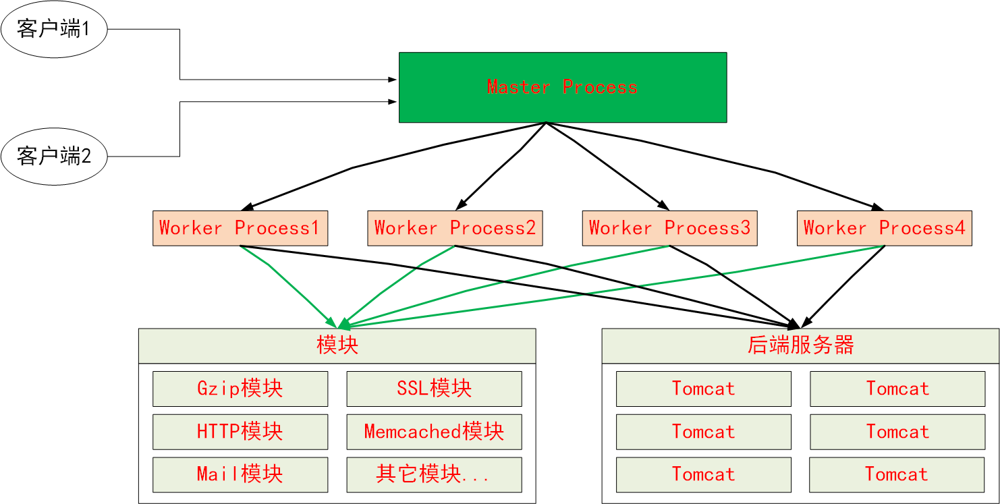
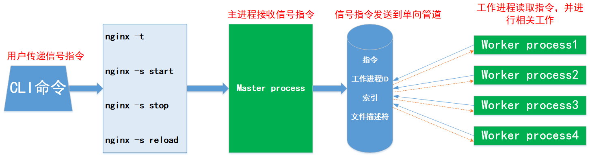

<center><font size=5>Nginx基础</font></center>

# 一.Nginx 介绍

## 1.1 Nginx 介绍

Nginx(读作"engine X" /ɛndʒɪnˈɛks/)是一个 web 服务器，也可以用作反向代理服务、
负载均衡器、邮件代理服务和 HTTP 缓存服务。该软件由俄罗斯的 Igor Sysoev 开发，
并于 2004 年首次公开发布。同名的 nginx 是一家成立于 2011 年的公司，为开源的
nginx 提供支持以及开发和维护另一款付费软件 Nginx plus。

Nginx 是一款免费的开源软件，根据类似于 BSD 的许可协议发布。大部分 web 服务器
都使用 NGINX 作为负载均衡器。

2019 年 3 月，Nginx 公司被 F5 Networks 以 6.7 亿美元收购。截至 2019 年 8 月，
Netcraft 估计 Nginx 为 32%的活跃网站提供服务，排名第一，略高于 Apache 的 29%

2020 年元旦这天我又看了一下，到目前为止，Netcraft 估计的各软件的占有率如下


活动的网站中占有率如下


Nginx 历经⼗⼏年的迭代更新(https://nginx.org/en/CHANGES)， ⽬前功能已经⾮常完善
且运⾏稳定，另外 Nginx 的版本分为开发版、稳定版和过期版，Nginx 以功能丰富著称，它
既可以作为 http 服务器，也可以作为反向代理服务器或者邮件服务器，能够快速的响应静态
⽹⻚的请求，⽀持 FastCGI/SSL/Virtual Host/URLRwrite/Gzip/HTTP Basic Auth/http
或者 TCP 的负载均衡等功能，并且⽀持第三⽅的功能扩展。

另外，其在响应静态资源请求时所消耗内存 apache 少得多，平均处理请求数量时候 apache
的四倍。且国内的各大一线互联网公司如天猫、淘宝、⼩⽶、网易 163、京东和新浪等都在用
nginx 或者进行二次开发，如淘宝的 Tengine 就是基于 nginx 的二次开发软件。

## 1.2 Nginx 功能介绍

### 1.2.1 基础特性

基础特性
: 模块化设计，具有较好的扩展性
: ⾼可靠性
: ⽀持热部署：不停机更新配置⽂件，升级版本和更换⽇志⽂件
: 低内存消耗：10000 个 keep-alive 连接模式下的⾮活动连接，仅需 2.5M 内存

自 2004 年发布以来，nginx 一直专注于高性能、高并发性和低内存使用。另外，
在 I/O 操作层面上，其支持 event-driven 事件驱动的 I/O，POSIX AIO[^1] 异步 I/O
mmap 内存映射和 sendfile 机制等等加速 I/O 的特性。这些特性都是其性能远胜
apache 的原因。

基本功能
: 静态资源的 web 服务器
: http 协议反向代理服务器
: pop3/imap4 协议反向代理服务器
: FastCGI(LNMP),uWSGI(python)等协议
: 模块化(⾮ DSO)，需要编译，如 zip，SSL 模块

### 1.2.2 Nginx 与 web 服务相关的功能

主要功能
: 支持虚拟主机（server）
: ⽀持 keep-alive 和管道连接(利⽤⼀个连接做多次请求)
: 访问⽇志(⽀持⽇志缓冲提⾼其性能)
: `url rewirte` 支持 URL 重写
: 支持路径别名
: 基于 IP 及⽤⼾的访问控制
: ⽀持速率限制及并发数限制
: 重新配置和在线升级⽽⽆须中断客⼾的⼯作进程

# 二.Nginx 工作模型

## 2.1 Nginx 内部架构

[Linux 内部架构文章参考](http://www.aosabook.org/en/nginx.html)

### 2.1.1 Nginx 的工作模型

一般的 WEB 服务器处理请求要么是以多进程的方式，要么是以多线程的方式。我们知道
apache 的 prefork 模型就是使用多个进程去处理请求；其 worker 模型就是多个进程
和多个线程处理请求。

**多进程模型**：服务器每接收到⼀个客⼾端请求就有服务器的主进程⽣成⼀个⼦进程响应客
⼾端，直到⽤⼾关闭连接，这样的优势是处理速度快，各⼦进程之间相互独⽴，但是如果
访问过⼤会导致服务器资源耗尽⽽⽆法提供请求。

**多线程⽅式**：与多进程⽅式类似，但是每收到⼀个客⼾端请求会有服务进程派⽣出⼀个线
程来个客⼾⽅进⾏交互，⼀个线程的开销远远⼩于⼀个进程，因此多线程⽅式在很⼤程度
减轻了 web 服务器对系统资源的要求，但是多线程也有⾃⼰的缺点，即当多个线程位于
同⼀个进程内⼯作的时候，可以相互访问同样的内存地址空间，所以他们相互影响，另外
，⼀旦主进程挂掉则所有⼦线程都不能⼯作了，IIS 服务器使⽤了多线程的⽅式，需要间
隔⼀段时间就重启⼀次才能稳定。

其它的工作模式都是在这两种工作方式上延伸和改进的。

而 Nginx 采用了多进程的组织模型，Nginx 工作时有一个 Master 进程和多个 Worker
进程共同完成所有的服务。Master 进程的工作偏向服务本身的管理，Worker 进程则负责
处理用户请求。Master 进程和 worker 进程的调用过程如下图。


主进程(Master process)的功能：
: 读取 Nginx 配置⽂件并验证其有效性和正确性(nginx -t)
: 建⽴、绑定和关闭 socket 连接
: 按照配置⽣成、管理和结束⼯作进程
: 接受外界指令，⽐如重启、升级及退出服务器等指令
: 不中断服务，实现平滑升级，重启服务并应⽤新的配置
: 开启⽇志⽂件，获取⽂件描述符
: 不中断服务，实现平滑升级，升级失败进⾏回滚处理
: 编译和处理 perl 脚本

工作进程(Worker process)的功能：
: 接受处理客⼾的请求
: 将请求依次送⼊各个功能模块进⾏处理
: IO 调⽤，获取响应数据
: 与后端服务器通信，接收后端服务器的处理结果
: 缓存数据，访问缓存索引，查询和调⽤缓存数据
: 发送请求结果，响应客⼾的请求
: 接收主程序指令，⽐如重启、升级和退出等

### 2.1.2 Nginx 进程与外部环境的交互


如上图，主进程主要是管理自身服务的相关事务，如加载配置文件、创建和回收 Worker
进程及提供不停机更新等功能。而负责处理请求的工作进程则会和更多的外部环境交互
，工作进程面对客户端时通过 HTTP/HTTPS 协议接收请求，作为反向代理服务时工作
进程使用 FastCGI 协议和 PHP 等程序交互、使用 HTTP 协议将请求转发给其它服务
器或者使用 memcache 标准和缓存数据库交互、亦或使用 uWSGI 协议与 Python 程序
交互。面对磁盘和 I/O 时，工作进程使用相关的模块和特性与系统内核提供的特性交互，
比如：使用系统调用 select()或 poll()来实现 I/O 多路复用，使用事件驱动的 I/O
模型或使用 Linux 内核 2.6 版本后提供的异步 I/O(AIO)等特性来加速和优化 I/O 操作。

Nginx 之所以在处理大量的用户请求和高并发场景下的性能远胜 apache，就是因为其
代码实现参考了操作系统的实现并大量使用了异步事务处理机制，nginx 的异步操作是
通过模块化、事件通知、大量使用回调函数和调优计时器来实现的。总的来说，关键的
原则是尽可能的不阻塞。在 I/O 操作方面所支持的多种高级模型就是最好的例子，甚至
支持只有 linux 提供的 AIO 机制(POSIX 标准)。

因为 nginx 不会为每个连接派生一个进程或线程，所以在大多数情况下，内存使用是非常
保守和高效的。这样一来 nginx 也节约了 CPU 周期，因为不存在进程或线程的创建和销
毁的开销。nginx 所做的大部分工作是检查网络相关(网络套接字)和存储相关(文件描述符
是否可以执行异步 I/O)的状态，初始化新的连接，将它们添加到主运行循环中，然后异步
处理，直到完成。请求处理完成后连接被释放并从运行循环中删除。通过谨慎的使用系统调
用和如 poll 等支持接口的精确实现以及，nginx 通常可以在极端工作负载下消耗较低的
CPU 使用率。

由于 nginx 的进程并不随请求的数量变化而变化，所以在配置 nginx 时可以将工作进程
和 CPU 的某个核心绑定来优化性能和增强稳定性。在不同的工作负载下可以规定工作进程
的数量和处理器核心的比例关系来最大化利用 CPU 的处理性能。例如：如果请求的任务为
CPU 密集型的，如大量处理 TCP/IPl 连接、处理 SSL 加密事务或压缩大量文件，那么可
以将 Worker 进程数量设置为和 CPU 核心相同；如果负载和 I/O 操作强相关，如写如(
或读取)大量的数据到存储设备、或是进行繁重的代理工作，那 Worker 进程可以是 CPU
核心数量的 1.5~2 倍。

nginx 服务启动工作时在内存中运行了多个进程。有一个主进程和几个工作进程，还有一些
特殊用途的进程，特别是缓存加载器和缓存管理器。nginx 所有进程主要使用共享内存机制
进行进程间通信。主进程使用 root 用户运行。缓存加载器、缓存管理器和 Worker 进程使
用非特权用户运行。

## 2.2 Nginx 的进程之间通讯

服务启动过程中 Nginx 的⼯作进程是由主进程⽣成的，主进程通过系统调用
fork()函数，在 Nginx 服务器启动过程中主进程根据配置⽂件决定启动⼯作
进程的数量，然后建⽴⼀张全局的⼯作表⽤于存放当前未退出的所有的⼯作进
程信息，主进程⽣成⼯作进程后会将新⽣成的⼯作进程加⼊到⼯作进程表中，
而后建⽴⼀个单向的管道并将其传递给⼯作进程，该管道与普通的管道不同，
它是由主进程指向⼯作进程的单项通道，包含了主进程向⼯作进程发出的指令
、⼯作进程 ID、⼯作进程在⼯作进程表中的索引和必要的⽂件描述符等信息。

主进程与外界通过信号机制进⾏通信，当接收到需要处理的信号时，它通过管
道向相关的⼯作进程发送正确的指令，每个⼯作进程都有能⼒捕获管道中的可
读事件，当管道中有可读事件的时候，⼯作进程就会从管道中读取并解析指令，
然后采取相应的执⾏动作，这样就完成了主进程与⼯作进程的交互。

另外，⼯作进程之间的通信原理基本上和主进程与⼯作进程之间的通信是⼀样的，
只要⼯作进程之间能够取得彼此的信息，建⽴管道即可通信，但是由于⼯作进程
之间是完全隔离的，因此⼀个进程想要知道另外⼀个进程的状态信息就只能通过
主进程来设置了。
为了实现⼯作进程之间的交互，主进程在⽣成⼯作进程之后，会在⼯作进程表中
进⾏遍历，将该新进程的 ID 以及针对该进程建⽴的管道句柄传递给⼯作进程中的
其他进程，为⼯作进程之间的通信做准备，当⼯作进程 1 向⼯作进程 2 发送指令的
时候，⾸先在主进程给它的其他⼯作进程信息中找到 2 的进程 ID，然后将正确的
指令写⼊指向进程 2 的管道，⼯作进程 2 捕获到管道中的事件后，解析指令并进⾏
相关操作，这样就完成了⼯作进程之间的通信。


## 2.3 Nginx 模块介绍

Nginx 可以在编译时加入很多提供特定功能的模块，随后也支持动态加载模块(DSO)
核⼼模块：是 Nginx 服务器正常运⾏ 必不可少 的模块，提供 错误⽇志记录、
配置⽂件解析、事件驱动机制、进程管理等核⼼功能。

`标准 HTTP 模块`：提供 HTTP 协议解析相关的功能，如端⼝配置、⽹⻚编码设置、
HTTP 响应头设置 等等。

`可选 HTTP 模块`：主要⽤于扩展标准的 HTTP 功能，让 Nginx 能处理⼀些特殊的
服务，⽐如： Flash 多媒体传输、解析 GeoIP 请求、⽹络传输压缩、安全协议
SSL ⽀持等。

`邮件服务模块`：主要⽤于⽀持 Nginx 的 邮件服务 ，包括对 POP3 协议、 IMAP
协议和 SMTP 协议的⽀持。

`第三⽅模块`：是为了扩展 Nginx 服务器应⽤，完成开发者⾃定义功能，⽐如：
Json ⽀持、 Lua ⽀持等。

nginx ⾼度模块化，但其模块早期不⽀持 DSO 机制；1.9.11 版本后⽀持动态装载
和卸载模块。

```ruby
核⼼模块：core module
标准模块：
    HTTP 模块：  ngx_http_*
                 HTTP Core modules   默认功能
                 HTTP Optional modules 需编译时指定
    Mail 模块:   ngx_mail_*
    Stream 模块: ngx_stream_*
第三⽅模块：如echo模块
```


# 三.安装 Nginx

Nginx 的安装版本分为 Mainline version(主要开发版本，其实就是还处于开发版)、
Stable version(当前最新稳定版)和 Legacy versions(旧的稳定版)， Nginx 安装
可以使⽤ yum 或源码安装，但是推荐使⽤源码，⼀是 yum 的版本⽐较旧，⼆是编译安
装可以更⽅便⾃定义相关路径，三是使⽤源码编译可以⾃定义相关功能，更⽅便业务上
的使⽤，源码安装需要提前准备标准的编译器，GCC 的全称是(GNU Compiler collection)，
其由 GNU 开发，是⾃由的 UNIX 操作系统的标准编译器，因为 GCC 原本只能处理 C
语⾔，所以原名为 GNU C 语⾔编译器，后来得到快速发展，可以处理 C++,Fortran，
pascal，objective-C，java 以及 Ada 等其他语⾔，此外还需要 Automake ⼯具，
以完成⾃动创建 Makefile 的⼯作，Nginx 的⼀些模块需要依赖第三⽅库，⽐如 pcre
（⽀持 rewrite），zlib（⽀持 gzip 模块）和 openssl（⽀持 ssl 模块）等。

## 3.1 包管理器安装 Nginx

### 3.1.1 安装

需要提前配置好 epel 源

```bash
[root@s1 ~]# yum install epel-release -y
[root@s1 ~]# yum install -y nginx
[root@s1 ~]# rpm -ql nginx
/etc/logrotate.d/nginx
/etc/nginx/fastcgi.conf
/etc/nginx/fastcgi.conf.default
/etc/nginx/fastcgi_params
/etc/nginx/fastcgi_params.default
/etc/nginx/koi-utf
/etc/nginx/koi-win
/etc/nginx/mime.types
/etc/nginx/mime.types.default
/etc/nginx/nginx.conf
/etc/nginx/nginx.conf.default
/etc/nginx/scgi_params
/etc/nginx/scgi_params.default
/etc/nginx/uwsgi_params
/etc/nginx/uwsgi_params.default
/etc/nginx/win-utf
/usr/bin/nginx-upgrade
/usr/lib/systemd/system/nginx.service
/usr/lib64/nginx/modules
/usr/sbin/nginx
/usr/share/doc/nginx-1.16.1
.................
/var/lib/nginx
/var/lib/nginx/tmp
/var/log/nginx

[root@s1 ~]# which  nginx
/usr/sbin/nginx
```

### 3.1.2 帮助

```bash
[root@s1 ~]# nginx -h
nginx version: nginx/1.16.1
Usage: nginx [-?hvVtTq] [-s signal] [-c filename] [-p prefix] [-g directives]

Options:
 -?,-h         : this help
 -v            : show version and exit
 -V            : show version and configure options then exit #显⽰版本和编译参数
 -t            : test configuration and exit #测试配置⽂件是否异常
 -T            : test configuration, dump it and exit #测试并打印
 -q            : suppress non-error messages during configuration testing #静默模式
 -s signal     : send signal to a master process: stop, quit, reopen, reload #发送信号
 -p prefix     : set prefix path (default: /usr/share/nginx/) #指定Nginx ⽬录
 -c filename   : set configuration file (default: /etc/nginx/nginx.conf) #配置⽂件路径
 -g directives : set global directives out of configuration file #设置全局指令
```

### 3.1.3 配置文件语法检查及查看自带的编译选项

```bash
[root@s1 ~]# nginx -t
nginx: the configuration file /etc/nginx/nginx.conf syntax is ok
nginx: configuration file /etc/nginx/nginx.conf test is successful
[root@s1 ~]# nginx -V
nginx version: nginx/1.16.1
built by gcc 4.8.5 20150623 (Red Hat 4.8.5-39) (GCC)
built with OpenSSL 1.0.2k-fips  26 Jan 2017
TLS SNI support enabled
configure arguments: --prefix=/usr/share/nginx --sbin-path=/usr/sbin/nginx --modules-
path=/usr/lib64/nginx/modules --conf-path=/etc/ngin
x/nginx.conf --error-log-path=/var/log/nginx/error.log --http-log-
path=/var/log/nginx/access.log --http-client-body-temp-
path=/var/lib/nginx/tmp/client_body --http-proxy-temp-path=/var/lib/nginx/tmp/proxy --
http-fastcgi-temp-path=/var/lib/nginx/tmp/fastcgi --http-uwsgi-temp-
path=/var/lib/nginx/tmp/uwsgi --http-scgi-temp-path=/var/lib/nginx/tmp/scgi --pid-
path=/run/nginx.pid --lock-path=/run/lock/subsys/nginx --user=nginx --group=nginx --
with-file-aio --with-ipv6 --with-http_ssl_module --with-http_v2_module --with-
http_realip_module --with-stream_ssl_preread_module --with-http_addition_module --with-
http_xslt_module=dynamic --with-http_image_filter_module=dynamic --with-http_sub_module
--with-http_dav_module --with-http_flv_module --with-http_mp4_module --with-
http_gunzip_module --with-http_gzip_static_module --with-http_random_index_module --
with-http_secure_link_module --with-http_degradation_module --with-http_slice_module --
with-http_stub_status_module --with-http_perl_module=dynamic --with-
http_auth_request_module --with-mail=dynamic --with-mail_ssl_module --with-pcre --with-
pcre-jit --with-stream=dynamic --with-stream_ssl_module --with-google_perftools_module
--with-debug --with-cc-opt='-O2 -g -pipe -Wall -Wp,-D_FORTIFY_SOURCE=2 -fexceptions -fstack-protector-strong --param=ssp-buffer-size=4 -grecord-gcc-switches -specs=/usr/lib/rpm/redhat/redhat-hardened-cc1 -m64 -mtune=generic' --with-ld-opt='-Wl,-z,relro -specs=/usr/lib/rpm/redhat/redhat-hardened-ld -Wl,-E'
```

### 3.1.4 启动脚本

```bash
[root@s1 ~]# cat /usr/lib/systemd/system/nginx.service
[Unit]
Description=The nginx HTTP and reverse proxy server
After=network.target remote-fs.target nss-lookup.target

[Service]
Type=forking
PIDFile=/run/nginx.pid
# Nginx will fail to start if /run/nginx.pid already exists but has the wrong
# SELinux context. This might happen when running `nginx -t` from the cmdline.
# https://bugzilla.redhat.com/show_bug.cgi?id=1268621
ExecStartPre=/usr/bin/rm -f /run/nginx.pid
ExecStartPre=/usr/sbin/nginx -t
ExecStart=/usr/sbin/nginx
ExecReload=/bin/kill -s HUP $MAINPID
KillSignal=SIGQUIT
TimeoutStopSec=5
KillMode=process
PrivateTmp=true

[Install]
WantedBy=multi-user.target
```

### 3.1.5 启动和访问

```bash
[root@s1 ~]# systemctl  start nginx
[root@s1 ~]# systemctl  status nginx
● nginx.service - The nginx HTTP and reverse proxy server
   Loaded: loaded (/usr/lib/systemd/system/nginx.service; disabled; vendor preset:
disabled)
   Active: active (running) since Thu 2019-10-24 03:20:18 CST; 14s ago
  Process: 10877 ExecStart=/usr/sbin/nginx (code=exited, status=0/SUCCESS)
  Process: 10874 ExecStartPre=/usr/sbin/nginx -t (code=exited, status=0/SUCCESS)
  Process: 10872 ExecStartPre=/usr/bin/rm -f /run/nginx.pid (code=exited,
status=0/SUCCESS)
 Main PID: 10879 (nginx)
   CGroup: /system.slice/nginx.service
           ├─10879 nginx: master process /usr/sbin/nginx
           ├─10880 nginx: worker process
           └─10881 nginx: worker process

Oct 24 03:20:17 nginx-web1.magedu.net systemd[1]: Starting The nginx HTTP and reverse
proxy server...
Oct 24 03:20:17 nginx-web1.magedu.net nginx[10874]: nginx: the configuration file
/etc/nginx/nginx.conf syntax is ok
Oct 24 03:20:17 nginx-web1.magedu.net nginx[10874]: nginx: configuration file
/etc/nginx/nginx.conf test is successful
Oct 24 03:20:18 nginx-web1.magedu.net systemd[1]: Started The nginx HTTP and reverse
proxy server.


[root@s1 ~]# ps -ef | grep nginx
root      10879      1  0 03:20 ?     00:00:00 nginx: master process /usr/sbin/nginx
nginx     10880  10879  0 03:20 ?     00:00:00 nginx: worker process
nginx     10881  10879  0 03:20 ?     00:00:00 nginx: worker process
root      10885   4078  0 03:20 pts/0 00:00:00 grep --color=auto nginx
```

## 3.2 编译安装 Nginx

### 3.2.1 下载源码及编译

首先要解决依赖(CentOS7)，编译安装必须的库和工具

```bash
[root@s2 ~]# yum install -y vim lrzsz tree screen psmisc lsof tcpdump wget  ntpdate gcc gcc-c++ glibc glibc-devel pcre pcre-devel openssl  openssl-devel systemd-devel net-tools iotop bc  zip unzip zlib-devel bash-completion nfs-utils automake libxml2 libxml2-devel libxslt libxslt-devel perl perl-ExtUtils-Embed
```

- GeoIP 模块和 gd 模块需要安装下面的库

```bash
yum install gd-devel.x86_64
yum install GeoIP-devel.x86_64`
```

```bash
gcc为GNU Compiler Collection的缩写，可以编译C和C++源代码等，它是GNU开发
的C和C++以及其他很多种语⾔的编译器（最早的时候只能编译C，后来很快进化成⼀
个编译多种语⾔的集合，如Fortran、Pascal、Objective-C、Java、Ada、 Go等。）

gcc 在编译C++源代码的阶段，只能编译 C++ 源⽂件，⽽不能⾃动和 C++ 程序使⽤
的库链接（编译过程分为编译、链接两个阶段，注意不要和可执⾏⽂件这个概念搞混，
相对可执⾏⽂件来说有三个重要的概念：编译（compile）、链接（link）、加载
（load）。源程序⽂件被编译成⽬标⽂件，多个⽬标⽂件连同库被链接成⼀个最终的
可执⾏⽂件，可执⾏⽂件被加载到内存中运⾏）。因此，通常使⽤ g++ 命令来完成 C++
程序的编译和连接，该程序会⾃动调⽤ gcc 实现编译。

gcc-c++也能编译C源代码，只不过把会把它当成C++源代码，后缀为.c的，gcc把它
当作是C程序，⽽g++当作是c++程序；后缀为.cpp的，两者都会认为是c++程序，注意，
虽然c++是c的超集，但是两者对语法的要求是有区别的。automake是⼀个从Makefile.am
⽂件⾃动⽣成Makefile.in的⼯具。为了⽣成Makefile.in，automake还需⽤到perl，
由于automake创建的发布完全遵循GNU标准，所以在创建中不需要perl。libtool是⼀
款⽅便⽣成各种程序库的⼯具。

pcre pcre-devel：在Nginx编译需要 PCRE(Perl Compatible Regular Expression)，
因为Nginx 的 Rewrite模块和HTTP 核⼼模块会使⽤到PCRE正则表达式语法。

zlip zlib-devel：nginx启⽤压缩功能的时候，需要此模块的⽀持。

openssl openssl-devel：开启SSL的时候需要此模块的⽀持。
```

下载源码编译

[官⽅源码包下载地址](https://nginx.org/en/download.html)

- 编译安装

```bash
[root@s2 ~]# cd /usr/local/src/
[root@s2 src]# wget https://nginx.org/download/nginx-1.16.1.tar.gz
[root@s2 src]# tar xf nginx-1.16.1.tar.gz
[root@s2 src]# cd nginx-1.16.1/
[root@s2 nginx-1.16.1]#./configure --prefix=/apps/nginx \
--user=nginx  \
--group=nginx \
--with-http_ssl_module \
--with-http_v2_module \
--with-http_realip_module \
--with-http_stub_status_module  \
--with-http_gzip_static_module \
--with-pcre \
--with-stream \
--with-stream_ssl_module \
--with-stream_realip_module

[root@s2 nginx-1.16.1]# make  #编译步骤，根据Makefile⽂件⽣成相应的模块
[root@s2 nginx-1.16.1]# make  install #创建⽬录，并将⽣成的模块和⽂件复制到相应的⽬录：
[root@s2 nginx-1.16.1]# useradd  nginx -s  /sbin/nologin  -u 2000 #以普通⽤⼾启动nginx
[root@s2 nginx-1.16.1]# chown  nginx.nginx -R /apps/nginx/
```

nginx 完成编译安装以后，四个主要的⽬录

: `/apps/nginx/conf`：该⽬录中保存了 nginx 所有的配置⽂件，其中 nginx.conf
是 nginx 服务器的最核⼼最主要的配置⽂件，其他的.conf 则是⽤来配置 nginx 相关
的功能的，例如 fastcgi 功能使⽤的是 fastcgi.conf 和 fastcgi_params 两个⽂件，
配置⽂件⼀般都有个样板配置⽂件，是⽂件名.default 结尾，使⽤的使⽤将其复制为并
将 default 去掉即可。
: `/apps/nginx/html`：该⽬录中保存了 nginx 服务器的 web ⽂件，但是可以更改为
其他⽬录保存 web ⽂件,另外还有⼀个 50x 的 web ⽂件是默认的错误⻚⾯提⽰⻚⾯。
: `/apps/nginx/logs`：该⽬录⽤来保存 nginx 服务器的访问⽇志错误⽇志等⽇志，
logs ⽬录可以放在其他路径，⽐如/var/logs/nginx ⾥⾯。
: `/apps/nginx/sbin`：该⽬录⽤来保存 nginx ⼆进制启动脚本，可以接受不同的参数
以实现不同的功能。

### 3.2.2 验证版本和编译选项

```bash
[root@s2 nginx-1.16.1]# /apps/nginx/sbin/nginx  -V
nginx version: nginx/1.16.1
built by gcc 4.8.5 20150623 (Red Hat 4.8.5-39) (GCC)
built with OpenSSL 1.0.2k-fips  26 Jan 2017
TLS SNI support enabled
configure arguments: --prefix=/apps/nginx --user=nginx --group=nginx --with-
http_ssl_module --with-http_v2_module --with-http_realip_module --with-
http_stub_status_module --with-http_gzip_static_module --with-pcre --with-stream --
with-stream_ssl_module --with-stream_realip_module
```

### 3.2.3 启动和访问

启动
`[root@s2 nginx-1.16.1]# /apps/nginx/sbin/nginx`
访问


### 3.2.4 创建启动脚本

```bash
[root@s1 ~]# cat  /usr/lib/systemd/system/nginx.service
[Unit]
Description=The nginx HTTP and reverse proxy server
After=network.target remote-fs.target nss-lookup.target

[Service]
Type=forking
PIDFile=/run/nginx.pid
# Nginx will fail to start if /run/nginx.pid already exists but has the wrong
# SELinux context. This might happen when running `nginx -t` from the cmdline.
# https://bugzilla.redhat.com/show_bug.cgi?id=1268621
ExecStartPre=/usr/bin/rm -f /run/nginx.pid
ExecStartPre=/apps/nginx/sbin/nginx -t
ExecStart=/apps/nginx/sbin/nginx
ExecReload=/bin/kill -s HUP $MAINPID
KillSignal=SIGQUIT
TimeoutStopSec=5
KillMode=process
PrivateTmp=true

[Install]
WantedBy=multi-user.target
```

### 3.2.5 验证启动脚本的工作情况

```bash
[root@s2 nginx-1.16.1]# systemctl daemon-reload
[root@s2 nginx-1.16.1]# systemctl  start  nginx
[root@s2 nginx-1.16.1]# systemctl  enable  nginx
Created symlink from /etc/systemd/system/multi-user.target.wants/nginx.service to
/usr/lib/systemd/system/nginx.service.
[root@s2 nginx-1.16.1]# systemctl  status   nginx
● nginx.service - The nginx HTTP and reverse proxy server
   Loaded: loaded (/usr/lib/systemd/system/nginx.service; disabled; vendor preset:
disabled)
   Active: active (running) since Thu 2019-10-24 04:01:12 CST; 1min 0s ago
  Process: 7856 ExecStart=/apps/nginx/sbin/nginx (code=exited, status=0/SUCCESS)
  Process: 7853 ExecStartPre=/apps/nginx/sbin/nginx -t (code=exited, status=0/SUCCESS)
  Process: 7851 ExecStartPre=/usr/bin/rm -f /run/nginx.pid (code=exited,
status=0/SUCCESS)
 Main PID: 7858 (nginx)
   CGroup: /system.slice/nginx.service
           ├─7858 nginx: master process /apps/nginx/sbin/nginx
           └─7859 nginx: worker process

Oct 24 04:01:12 nginx-web2.example.com systemd[1]: Starting The nginx HTTP and reverse
proxy server...
Oct 24 04:01:12 nginx-web2.example.com nginx[7853]: nginx: the configuration file
/apps/nginx/conf/nginx.conf syntax is ok
Oct 24 04:01:12 nginx-web2.example.com nginx[7853]: nginx: configuration file
/apps/nginx/conf/nginx.conf test is successful
Oct 24 04:01:12 nginx-web2.example.com systemd[1]: Started The nginx HTTP and reverse
proxy server.
```

### 3.2.6 Nginx 配置格式说明

Nginx 的配置⽂件的组成部分：
: 主配置⽂件`nginx.conf`
: ⼦配置⽂件`include conf.d/\*.conf`

Nginx 主配置⽂件的配置指令遵循 C 语言风格，每个配置指令必须以英文分号
结尾。每个不同级别的配置块使用花括号区分，这使得 Nginx 可以像 C 语言一
样管理复杂的配置层级关系。(配置块有：main, http, server, upstream,
location 等)

```bash
directive value [value2 ...];
  注意：
  (1) 指令必须以分号结尾
  (2) ⽀持使⽤配置变量
      内建变量：由Nginx模块引⼊，可直接引⽤
      ⾃定义变量：由⽤⼾使⽤set命令定义
      set variable_name value;
      引⽤变量：$variable_name
```

```bash
mime.types：⽀持的mime类型，MIME(Multipurpose Internet Mail Extensions)多⽤
途互联⽹邮件扩展类型，MIME消息能包含⽂本、图像、⾳频、视频以及其他应⽤程序专⽤的
数据，是设定某种扩展名的⽂件⽤⼀种应⽤程序来打开的⽅式类型，当该扩展名⽂件被访问
的时候，浏览器会⾃动使⽤指定应⽤程序来打开。多⽤于指定⼀些客⼾端⾃定义的⽂件名，
以及⼀些媒体⽂件打开⽅式。

root@ubuntu-suosuoli-node1:~# cat /etc/nginx/mime.types

types {
    text/html                             html htm shtml;
    text/css                              css;
    text/xml                              xml;
    image/gif                             gif;
    image/jpeg                            jpeg jpg;
    application/javascript                js;
    application/atom+xml                  atom;
    application/rss+xml                   rss;
......
```

> MIME 参考⽂档：https://developer.mozilla.org/zh-CN/docs/Web/HTTP/Basics_of_HTTP/MIME_Types

### 3.2.7 默认配置说明

```ruby
[root@s2 ~]# grep -v "#" /apps/nginx/conf/nginx.conf | grep  -v "^$"
# 全局配置端，对全局⽣效，主要设置nginx的启动⽤⼾/组，启动的⼯作进程数量，⼯作模式，Nginx的PID路径，⽇志路径等。
user  nginx nginx;
worker_processes  1;   # 启动⼯作进程数数量
events { # events设置快，主要影响nginx服务器与⽤⼾的⽹络连接，⽐如是否允许同时接受多个⽹络连接，使⽤哪种事件驱动模型处理请求，每个⼯作进程可以同时⽀持的最⼤连接数，是否开启对多⼯作进程下的⽹络连接进⾏序列化等。
worker_connections  1024;   # 设置单个nginx⼯作进程可以接受的最⼤并发，作为web服务器的时候最⼤并发数为worker_connections * worker_processes，作为反向代理的时候为(worker_connections *worker_processes)/2
}
http { # http块是Nginx服务器配置中的重要部分，缓存、代理和⽇志格式定义等绝⼤多数功能和第三⽅模块都可以在这设置，http块可以包含多个server块，⽽⼀个server块中⼜可以包含多个location块，server块可以配置⽂件引⼊、MIME-Type定义、⽇志⾃定义、是否启⽤sendfile、连接超时时间和单个链接的请求上限等。
    include       mime.types;
    default_type  application/octet-stream;
    sendfile        on; # 作为web服务器的时候打开sendfile加快静态⽂件传输，指定是否使⽤sendfile系统调⽤来传输⽂件,sendfile系统调⽤在两个⽂件描述符之间直接传递数据(完全在内核中操作)，从⽽避免了数据在内核缓冲区和⽤⼾缓冲区之间的拷⻉，操作效率很⾼，被称之为零拷⻉，硬盘 >> kernel buffer (快速拷⻉到kernelsocket buffer) >>协议栈。
    keepalive_timeout  65;  # ⻓连接超时时间，单位是秒
    server { # 设置⼀个虚拟机主机，可以包含⾃⼰的全局快，同时也可以包含多个location模块。⽐如本虚拟机监听的端⼝、本虚拟机的名称和IP配置，多个server 可以使⽤⼀个端⼝，⽐如都使⽤80端⼝提供web服务
        listen       80;  # 配置server监听的端⼝
        server_name  localhost;  # 本server的名称，当访问此名称的时候nginx会调⽤当前serevr内部的配置进程匹配。
        location / { # location其实是server的⼀个指令，为nginx服务器提供⽐较多⽽且灵活的指令，都是在location中提现的，主要是基于nginx接受到的请求字符串，对⽤⼾请求的UIL进⾏匹配，并对特定的指令进⾏处理，包括地址重定向、数据缓存和应答控制等功能都是在这部分实现，另外很多第三⽅模块的配置也是在location 块中配置。
            root   html; # 相当于默认⻚⾯的⽬录名称，默认是相对路径，可以使⽤绝对路径配置。
            index  index.html index.htm; # 默认的⻚⾯⽂件名称
        }
        error_page   500 502 503 504  /50x.html; # 错误⻚⾯的⽂件名称
        location = /50x.html { # location处理对应的不同错误码的⻚⾯定义到/50x.html，这个跟对应其
server中定义的⽬录下。
            root   html; # 定义默认⻚⾯所在的⽬录
        }
    }

# 和邮件相关的配置
# mail {
#                 ...
#         }          mail 协议相关配置段

# tcp代理配置，1.9版本以上⽀持
# stream {
#                 ...
#         }       stream 服务器相关配置段

# 导⼊其他路径的配置⽂件
# include /apps/nginx/conf.d/*.conf
}
```

## 注脚

[^1]: POSIX AIO 允许进程将 I/O 操作排列到一个文件中，当操作完成后得到通知。POSIX AIO 的优点在于最初的 I/O 调用将立刻返回，因此进程不会一直等待数据传输到内核或者等待操作完成。这使得进程可以同 I/O 操作一起并行处理其他的任务（可能会包含将未来的 I/O 操作入队列）。对于特定类型的应用，POSIX AIO 能提供有用的性能优势
