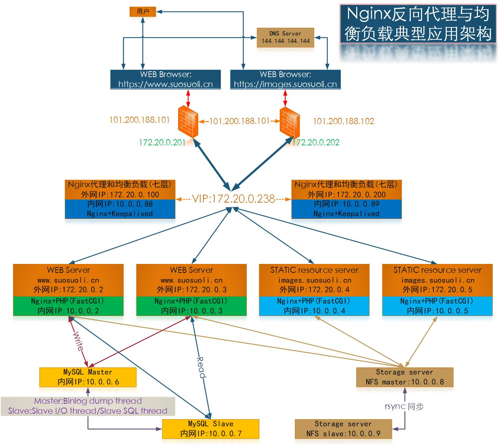
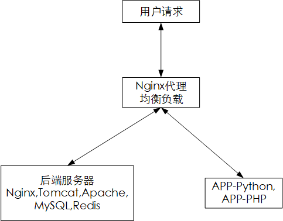

Nginx 反向代理

# 一. Nginx 反向代理

## 1.1 反向代理介绍

在计算机网络中，反向代理一般指代理服务器，其首先代替内网的服务器接收客户端请求
并从一个或多个服务器检索资源，然后将这些资源返回给客户端。在客户端看来，这些资
源就好像来自代理服务器本身一样。与正向代理不同，正向代理是指服务器代替客户端接
收请求的到的资源，后再分发给各个客户端。换句话说，正向代理会暂时代表客户机，而
反向代理则代表服务器。反向代理的主要功能就是将不同的请求转发到不同类型的后端服
务器处理，再将处理结果返回该客户端。

如上图所示，外部网络的客户端请求某个 WEB 资源时，`Proxy`首先代替后端的`Web server`
接收请求，再将请求发送给 server 处理，处理完后将资源返回给`Proxy`，再由`Proxy`返回
给客户端。

```
有人可能有这样的疑问：直接将请求发给内网的Web server不就行了？还经过代理，这不是
多此一举？
我的理解是：
1.在一些极高并发的场景(比如：阿里的双十一、双十二促销，京东的年中大促等场景)，如果
直接将这样海量的请求发送给服务器处理，这是不现实的，如果使用一台服务器，那么这台
服务器的处理性能需要像超级计算机一样，而且这样单台服务器在某些性能方面是不可能达到
的，比如磁盘I/O。
2.不使用反向代理服务器时，如果使用多台服务器来提供服务。那就不得不考虑如何将大量的
请求分发给各个服务器，这时就必须使用专用的服务器来提供请求接收和过滤并基于某些算法
来均衡请求道后端服务器，也就是负载均衡。这也是为什么反向代理服务器也必须要有负载均
衡的能力。
3.反向代理另一个重要的能力是隐藏后端服务器的细节，使得黑客攻击更难下手。由于在实际
应用场景中，公司内部往往是使用私有IP地址的内部局域网络，而代理服务器则代替内部服务
器接收外部网络客户端的请求，此时外部客户端只知道代理服务器的一些信息，而对公司内部
的服务器一无所知。
```


两台计算机(灰色显示)之间的通信通过充当代理服务器的第三台计算机(红色显示)连接。Bob 不
知道这些信息是发给谁的。同样，Alice 不知道 Bob 具体是哪台服务器。因此可以使用代理来保
护隐私。

## 1.2 Nginx 反向代理

Nginx 除了可以在企业提供高性能的 web 服务之外，另外还可以将本身无法处理的请求通过某种
预定义的协议转发至其它服务器处理，不同的协议就是 Nginx 服务器与其他服务器进行通信的
规范，在不同的场景使用不同的模块来提供相应功能。

主要有以下模块：

| 模块                    | 实现的功能                                                  |
| :---------------------- | :---------------------------------------------------------- |
| ngx_http_proxy_module   | 将客户端的请求以 http 协议转发至指定服务器进行处理。        |
| ngx_stream_proxy_module | 将客户端的请求以 tcp 协议转发至指定服务器处理。             |
| ngx_http_fastcgi_module | 将客户端对 php 的请求以 fastcgi 协议转发至指定服务器助理。  |
| ngx_http_uwsgi_module   | 将客户端对 Python 的请求以 uwsgi 协议转发至指定服务器处理。 |

### 1.2.1 Nginx 反向代理生产环境典型架构



该 WEB 服务架构主要有以下特点(优点):

```
1.Nginx实现七层(http/https)反向代理，均衡负载
2.使用多种不同的调度算法均衡负载(Round robin/Least connection/Last time/Generic hash/Random/IP hash)
以适应不同的业务场景
3.后端服务器状态监测
4.解压公网IP
5.隐藏内部服务器细节
```

### 1.2.2 反向代理配置参数

```bash
proxy_pass ip:port|FQDN|ServerGroup;
# 用来设置将客户端请求转发给的后端服务器的主机，可以是主机名、IP地址：端口的方式，也可以代理到预先
# 设置的主机群组，需要模块gx_http_upstream_module支持。

 location /web {
    index index.html;
    proxy_pass http://192.168.7.103:80;
    # 不带斜线将访问的/web,等于访问后端服务器 http://192.168.7.103:80/web/index.html，即后端服
    # 务器配置的站点根目录要有web目录才可以被访问，将/web追加到后端服务器 http://servername:port/WEB/INDEX.HTML的操作

    proxy_pass http://192.168.7.103:80/;
    # 带斜线，等于访问后端服务器的http://192.168.7.103:80/index.html 内容返回给客户端
 }

proxy_hide_header field;
# 用于nginx作为反向代理的时候，在返回给客户端http响应的时候，隐藏后端服务版本相应头部的信息，
# 可以设置在http/server或location块，
 location /web {
    index index.html;
    proxy_pass http://192.168.7.103:80/;
    proxy_hide_header ETag;
 }

proxy_pass_header field;
# 默认nginx在响应报文中不传递后端服务器的首部字段Date, Server, X-Pad,  X-Accel等参数，如果要传递
# 的话则要使用 proxy_pass_header field声明将后端服务器返回的值传递给客户端。

proxy_pass_request_body on | off；
# 是否向后端服务器发送HTTP包体部分,可以设置在http/server或location块，默认即为开启

proxy_pass_request_headers on | off；
# 是否将客户端的请求头部转发给后端服务器，可以设置在http/server或location块，默认即为开启

proxy_set_header；
# 可以更改或添加客户端的请求头部信息内容并转发至后端服务器，比如在后端服务器想要获取客户端的真实IP
# 的时候，就要更改每一个报文的头部，如下：
proxy_set_header X-Forwarded-For $proxy_add_x_forwarded_for;
proxy_set_header X-Forwarded-For  $remote_addr;  
# 添加HOST到报文头部，如果客户端为NAT上网那么其值为客户端的共用的公网IP地址，常用于在日之中记录客
# 户端的真实IP地址。

proxy_connect_timeout time；
# 配置nginx服务器与后端服务器尝试建立连接的超时时间，默认为60秒，用法如下：
proxy_connect_timeout 60s；
# 60s为自定义nginx与后端服务器建立连接的超时时间
proxy_read_time time；
# 配置nginx服务器向后端服务器或服务器组发起read请求后，等待的超时时间，默认60s
proxy_send_time time；
# 配置nginx项后端服务器或服务器组发起write请求后，等待的超时时间，默认60s

proxy_http_version 1.0；
# 用于设置nginx提供代理服务的HTTP协议的版本，默认http 1.0

proxy_ignore_client_abort off；
# 当客户端网络中断请求时，nginx服务器中断其对后端服务器的请求。即如果此项设置为on开启，则服务器会忽
# 略客户端中断并一直等着代理服务执行返回，如果设置为off，则客户端中断后Nginx也会中断客户端请求并立
# 即记录499日志，默认为off。

proxy_headers_hash_bucket_size 128；
# 当配置了 proxy_hide_header和proxy_set_header的时候，用于设置nginx保存HTTP报文头的hash表的上限。

proxy_headers_hash_max_size 512；
# 设置proxy_headers_hash_bucket_size的最大可用空间

server_namse_hash_bucket_size 512;
# server_name hash表申请空间大小
server_names_hash_max_szie   512;
# 设置服务器名称hash表的上限大小
```

### 1.2.3 Nginx 反向代理示例

将用户对域`blog.suosuoli.cn`的请求转发到后端服务器处理，该代理能由模块
`ngx_http_proxy_module`提供。[该模块的文档-->](https://nginx.org/en/docs/http/ngx_http_proxy_module.html，)

| 主机         | 角色                                   |
| ------------ | :------------------------------------- |
| 172.20.2.189 | Nginx 代理服务器 ubuntu-suosuoli-node1 |
| 172.20.2.37  | 后端服务器 node1                       |
| 172.20.2.43  | 后端服务器 node2                       |

大致的架构如下图：



#### 将 http 请求代理到单台后端服务器

```bash

[root@node1 ~]# echo "node1" >  /apps/nginx/html/suosuoli/index.html
[root@node2 ~]# echo "node2" >  /usr/share/nginx/html/index.html

root@ubuntu-suosuoli-node1:/etc/nginx/conf.d# vim blog.conf
server {
        server_name blog.suosuoli.cn;
        keepalive_requests 5;
        keepalive_timeout 65 66;

        client_max_body_size 10m;
        client_body_buffer_size 16k;
        client_body_temp_path /var/www/html/suosuoli/temp 1 2 2;

        location / {
                #root  /var/www/html/suosuoli;
                #index index.html index.htm;
                proxy_pass http://172.20.2.37:80;
        }
}
```

访问`http://blog.suosuoli.cn`显示为`node1`，也就是请求被 172.20.2.37 处理


#### 代理时指定 location

```bash
[root@node1 html]# mkdir node1
[root@node1 html]# echo "node1 172.20.2.37" > node1/index.html

root@ubuntu-suosuoli-node1:/etc/nginx# vim conf.d/blog.conf
server {
        location / {
                root  /var/www/html/suosuoli;
                index index.html index.htm;
        }

        location /node1 {
                #root  /var/www/html/suosuoli;
                #index index.html index.htm;
                proxy_pass http://172.20.2.37:80/;
        }
}
```

访问`http://172.20.2.189`不代理

访问`http://172.20.2.189/node1`代理并跳转到`http://172.20.237/node1`


```bash
root@ubuntu-suosuoli-node1:/var/www/html# tail /var/log/nginx/access.log -f
172.20.1.1 - - [09/Jan/2020:17:48:17 +0800] "GET / HTTP/1.1" 304 0 "-" "Mozilla/5.0 (Windows NT 10.0; WOW64) AppleWebKit/537.36 (KHTML, like Gecko) Chrome/76.0.3809.87 Safari/537.36"

[root@node1 html]# tail /apps/nginx/logs/access.log -f
172.20.1.1 - - [09/Jan/2020:17:50:25 +0800] "GET /node1/ HTTP/1.1" 200 18 "-" "Mozilla/5.0 (Windows NT 10.0; WOW64) AppleWebKit/537.36 (KHTML, like Gecko) Chrome/76.0.3809.87 Safari/537.36"
```

#### 反向代理的缓存功能

```bash
proxy_cache zone | off;  默认off
# 指明调用的缓存，或关闭缓存机制；Context:http, server, location
proxy_cache_key string;
# 为缓存定义一个“键”，键的默认值：proxy_cache_key $scheme$proxy_host$request_uri;
proxy_cache_valid [code ...] time;
# 定义对特定响应码的响应内容的缓存时长，定义在http{...}中
    示例:
    proxy_cache_valid 200 302 10m;
    proxy_cache_valid 404 1m;

proxy_cache_path PATH [...];
# 设置缓存的路径和其他参数。缓存数据存储在文件中。缓存中的文件名是将MD5函数应用于缓存键(proxy_cache_key)
# 的结果。level参数定义缓存的层次结构级别:从1到3，每个级别接受值1或2。
Syntax:	proxy_cache_path path [levels=levels] [use_temp_path=on|off] keys_zone=name:size [inactive=time] [max_size=size] [manager_files=number] [manager_sleep=time] [manager_threshold=time] [loader_files=number] [loader_sleep=time] [loader_threshold=time] [purger=on|off] [purger_files=number] [purger_sleep=time] [purger_threshold=time];
Default:	—
Context:	http
# 例如：
proxy_cache_path /data/nginx/cache levels=1:2 keys_zone=one:10m;
# 缓存中的文件名应该是这样的:
/data/nginx/cache/c/29/b7f54b2df7773722d382f4809d65029c
示例：在http配置定义缓存信息
   proxy_cache_path /var/cache/nginx/proxy_cache # 定义缓存保存路径，proxy_cache会自动创建
   levels=1:2:2 # 定义缓存目录结构层次，1:2:2可以生成2^4x2^8x2^8=1048576个目录
   keys_zone=proxycache:20m # 指内存中缓存的大小，主要用于存放key和metadata（如：使用次数）  
   inactive=120s； # 缓存有效时间  
   max_size=1g; # 最大磁盘占用空间，磁盘存入文件内容的缓存空间最大值

# 调用缓存功能，需要定义在相应的配置块，如server{...}；或者location等
        proxy_cache proxycache;
        proxy_cache_key $request_uri;
        proxy_cache_valid 200 302 301 10m; # 指定的状态码返回的数据缓存多长时间
        proxy_cache_valid any 1m;
proxy_cache_use_stale error http_502 http_503;
# 在被代理的后端服务器出现哪种情况下，可直接使用过期的缓存响应客户端，
proxy_cache_use_stale error | timeout | invalid_header | updating | http_500 | http_502
| http_503 | http_504 | http_403 | http_404 | off ; # 默认是off
proxy_cache_methods GET | HEAD | POST ...;
# 对哪些客户端请求方法对应的响应进行缓存，GET和HEAD方法总是被缓存
```

#### 非缓存场景压力测试

此处拿 node2 做客户端 node2(172.20.2.43)访问代理服务器(172.20.2.189)，代理服务器
将请求转发给 node1(172.20.2.37)。

```bash
[root@node1 html]# ll /apps/nginx/html/node1/学习目标.html -h
-rw-r--r-- 1 root root 11K Sep 24 09:54 /apps/nginx/html/node1/学习目标.html

[root@node2 html]# ab -n 2000 -c200 http://172.20.2.189/node1/学习目标.html
This is ApacheBench, Version 2.3 <$Revision: 1430300 $>
Copyright 1996 Adam Twiss, Zeus Technology Ltd, http://www.zeustech.net/
Licensed to The Apache Software Foundation, http://www.apache.org/

Benchmarking 172.20.2.189 (be patient)
......

Server Software:        nginx/1.14.0
Server Hostname:        172.20.2.189
Server Port:            80

Document Path:          /node1/学习目标.html
Document Length:        11147 bytes

Concurrency Level:      200
Time taken for tests:   1.182 seconds
Complete requests:      2000
Failed requests:        0
Write errors:           0
Total transferred:      22784000 bytes
HTML transferred:       22294000 bytes
Requests per second:    1692.61 [/sec] (mean) # 注意该值，和开启缓存后对比
Time per request:       118.161 [ms] (mean)
Time per request:       0.591 [ms] (mean, across all concurrent requests)
Transfer rate:          18830.30 [Kbytes/sec] received
......
```

#### 在代理服务器配置缓存

```bash
root@ubuntu-suosuoli-node1:/etc/nginx# vim nginx.conf
http {
        sendfile on;
        tcp_nopush on;
        tcp_nodelay on;
        keepalive_timeout 65;
        types_hash_max_size 2048;
        ......
        proxy_cache_path /var/www/html/proxyCache levels=1:1:1 keys_zone=proxyCache:20m inactive=120s max_size=1g; # 配置在http配置块
        ......

      server {
      ......
      }
}

root@ubuntu-suosuoli-node1:/etc/nginx# vim nginx.conf

server {
        ......
        location / {
                root  /var/www/html;
                index index.html index.htm;
        }

        location /node1 {
                #root  /var/www/html/suosuoli;
                #index index.html index.htm;
                proxy_pass http://172.20.2.37:80;
                proxy_set_header clientip $remote_addr;
                proxy_cache proxyCache;
                proxy_cache_key $request_uri;
                proxy_cache_valid 200 302 301 1h;
                proxy_cache_valid any 1m;
        }
}
```

#### 访问并验证缓存

访问`http://172.20.2.37/node1/学习目标.html`并查看缓存是否生成


```bash
root@ubuntu-suosuoli-node1:/var/www/html# ll proxyCache/5/1/3/10eb0b30e8aead8b0ea1229d9f8eb315  -h
-rw------- 1 nginx nginx 12K Jan  9 19:33 proxyCache/5/1/3/10eb0b30e8aead8b0ea1229d9f8eb315

root@ubuntu-suosuoli-node1:/var/www/html# cat proxyCache/5/1/3/10eb0b30e8aead8b0ea1229d9f8eb315
·^nw]§^鹝~o["5d89776e-2b8b"
KEY: /node1/学习目标.html
HTTP/1.1 200 OK
Server: nginx/1.16.1
Date: Thu, 09 Jan 2020 11:33:59 GMT
Content-Type: text/html
Content-Length: 11147
Last-Modified: Tue, 24 Sep 2019 01:54:54 GMT
Connection: close
ETag: "5d89776e-2b8b"
Accept-Ranges: bytes

<!DOCTYPE html>
<html>
<head>
<title>学习目标.md</title>
......

root@ubuntu-suosuoli-node1:/var/www/html# tree proxyCache  # 过一段时间后再次访问http://172.20.2.189/node1/学习目标.html
proxyCache
├── 5
│?? └── 1
│??     └── 3
└── f
    └── 8
        └── 4
            └── 85d4146f38515e465fc4680a746a648f
```

#### 开启缓存后压力测试

```bash
[root@node2 html]# ab -n 2000 -c200 http://172.20.2.189/node1/学习目标.html
This is ApacheBench, Version 2.3 <$Revision: 1430300 $>
Copyright 1996 Adam Twiss, Zeus Technology Ltd, http://www.zeustech.net/
Licensed to The Apache Software Foundation, http://www.apache.org/
......
Server Software:        nginx/1.14.0
Server Hostname:        172.20.2.189
Server Port:            80

Document Path:          /node1/学习目标.html
Document Length:        11147 bytes

Concurrency Level:      200
Time taken for tests:   0.452 seconds
Complete requests:      2000
Failed requests:        0
Write errors:           0
Total transferred:      22784000 bytes
HTML transferred:       22294000 bytes
Requests per second:    4421.31 [#/sec] (mean) # 在此实验性能提升明显
Time per request:       45.236 [ms] (mean)
Time per request:       0.226 [ms] (mean, across all concurrent requests)
Transfer rate:          49187.03 [Kbytes/sec] received
......
```

#### 加头部报文信息

`ngx_http_headers_module`模块允许添加"Expires"和"Cache-Control"字段在报文
头部，还可以添加其他的随机字段。

```bash
Syntax:	 add_header name value [always];
Default: —
Context: http, server, location, if in location
```

例如：

```bash
root@ubuntu-suosuoli-node1:~# vim /etc/nginx/nginx.conf
server {
location /node1 {
                #root  /var/www/html/suosuoli;
                #index index.html index.htm;
                proxy_pass http://172.20.2.37:80;
                proxy_set_header clientip $remote_addr;
                proxy_cache proxyCache;
                proxy_cache_key $request_uri;
                proxy_cache_valid 200 302 301 1h;
                proxy_cache_valid any 1m;
                add_header X-Via  $server_addr;
                add_header X-Cache $upstream_cache_status;
                add_header X-Accel $server_name;
        }
}

[root@node1 html]# ll node1/index.html
-rw-r--r-- 1 root root 18 Jan  9 17:18 node1/index.html
```

#### 验证头部信息

```bash
[root@node2 ~]# curl -I 172.20.2.189/node1
HTTP/1.1 301 Moved Permanently
Server: nginx/1.14.0 (Ubuntu)
Date: Fri, 10 Jan 2020 12:07:03 GMT
Content-Type: text/html
Content-Length: 169
Connection: keep-alive
Location: http://172.20.2.37/node1/
X-Via:  172.20.2.189
X-Cache: MISS       # 第一次访问未使用缓存
X-Accel: _

[root@node2 ~]# curl -I 172.20.2.189/node1
HTTP/1.1 301 Moved Permanently
Server: nginx/1.14.0 (Ubuntu)
Date: Fri, 10 Jan 2020 12:07:05 GMT
Content-Type: text/html
Content-Length: 169
Connection: keep-alive
Location: http://172.20.2.37/node1/
X-Via:  172.20.2.189
X-Cache: HIT        # 第二次和后续的访问都会命中缓存
X-Accel: _
```

### 1.2.4 Nginx 的 http 反向代理高级应用

在前面 1.2.3 中的反向代理可以将客户端的请求转发至单台后端服务器，但是无法
转发至特定的一组的服务器，而且不能对后端服务器提供相应的服务器状态监测，
但是 Nginx 可以基于 `ngx_http_upstream_module` 模块提供服务器分组转发、
权重分配、状态监测、调度算法等高级功能。

为多台后端服务器做代理时，Nginx 可以使用多种算法来均衡负载。默认使用加权的
轮询调度(weighted round-robin)策略。另外其还有如下算法可供选择：

Round robin (轮询)
: This is the default load-balancing method, which distributes
requests in the order of the list of servers in the upstream pool.
You can also take weight into consideration for a weighted
round robin, which you can use if the capacity of the upstream
servers varies. The higher the integer value for the weight, the
more favored the server will be in the round robin. The algo‐
rithm behind weight is simply statistical probability of a weigh‐
ted average.

Least connections (最少连接策略)
: This method balances load by proxying the current request to
the upstream server with the least number of open connections.
Least connections, like round robin, also takes weights into
account when deciding to which server to send the connection.
The directive name is least_conn.

Generic hash (通用哈希策略)
: The administrator defines a hash with the given text, variables
of the request or runtime, or both. NGINX distributes the load
among the servers by producing a hash for the current request
and placing it against the upstream servers. This method is very
useful when you need more control over where requests are sent
or for determining which upstream server most likely will have
the data cached. Note that when a server is added or removed
from the pool, the hashed requests will be redistributed. This
algorithm has an optional parameter, consistent, to minimize
the effect of redistribution. The directive name is hash.

Random (随机策略)
: This method is used to instruct NGINX to select a random
server from the group, taking server weights into consideration.
The optional two [method] parameter directs NGINX to ran‐
domly select two servers and then use the provided load-
balancing method to balance between those two. By default the
least_conn method is used if two is passed without a
method. The directive name for random load balancing is
random.

IP hash (客户端 IP 哈希，只能用于代理 HTTP)
: This method works only for HTTP. IP hash uses the client IP
address as the hash. Slightly different from using the remote
variable in a generic hash, this algorithm uses the first three
octets of an IPv4 address or the entire IPv6 address. This
method ensures that clients are proxied to the same upstream
server as long as that server is available, which is extremely
helpful when the session state is of concern and not handled by
shared memory of the application. This method also takes the
weight parameter into consideration when distributing the
hash. The directive name is ip_hash.

[该模块官方文档](https://nginx.org/en/docs/http/ngx_http_upstream_module.html)

具体的配置参数说明

```bash
http{
......
upstream name {
        # 自定义一组服务器，配置在 http 内
}
......
}

server address [parameters];
# 配置一个后端web服务器，配置在upstream内，至少要有一个server服务器配置。

# server支持的parameters如下：
weight=number     # 设置权重，默认为1。
max_conns=number  # 给当前server设置最大活动链接数，默认为0表示没有限制。
max_fails=number  # 对后端服务器连续监测失败多少次就标记为不可用。
fail_timeout=time # 对后端服务器的单次监测超时时间，默认为10秒。
backup  # 设置为备份服务器，当所有服务器不可用时将重新启用次服务器。
down    # 标记为down状态。
resolve # 当server定义的是主机名的时候，当A记录发生变化会自动应用新IP而不用重启Nginx。
hash KEY consistent；
        # 基于指定key做hash计算，使用consistent参数，将使用ketama一致性hash算法，
        # 此做法适用于后端是Cache服务器的场景。如后端是varnish时使用，consistent定
        # 义使用一致性hash运算，一致性hash基于取模运算。

hash $request_uri consistent; # 基于用户请求的uri做hash
ip_hash； # 源地址hash调度方法，基于的客户端的remote_addr(源地址)做hash计算，以实现会话保持，
least_conn; # 最少连接调度算法，优先将客户端请求调度到当前连接最少的后端服务器
```

#### 反向代理示例--后端多台服务器

```bash
[root@node1 html]# echo "node1 172.20.2.37" > index.html

[root@node2 html]# echo "node2 172.20.2.43" > index.html

[root@node3 ~]# echo "node3 172.20.2.44" > /usr/share/nginx/html/index.html

[root@node4 ~]# echo "node4 172.20.2.45" > /usr/share/nginx/html/index.html

root@ubuntu-suosuoli-node1:/etc/nginx# vim nginx.conf
http {
......
upstream game_servers {
# least_conn;
# hash $request_uri consistent; 一致性hash策略
# ip_hash；
server 172.20.2.37:80 weight=1 fail_timeout=5s max_fail=3;
server 172.20.2.43:80 weight=1 fail_timeout=5s max_fail=3;
server 172.20.2.44:80 weight=1 fail_timeout=5s max_fail=3;
server 172.20.2.45:80 weight=1 fail_timeout=5s max_fail=3;

}
......
server {
        listen 80;
        server_name localhost;
        location / {
                root  /var/www/html;
                index index.html index.htm;
        }

        location /game_servers {
            index index.html;
            proxy_pass http://game_servers/;

        }
    }
}

root@ubuntu-suosuoli-node1:/var/www/html# mkdir game_servers
root@ubuntu-suosuoli-node1:/var/www/html# echo "Prosy for some servers." > game_servers/index.html

# 使用作为备份服务器的node4测试
[root@node4 ~]# while : ; do curl http://172.20.2.189/game_servers ; sleep 1 ; done
node1 172.20.2.37
node2 172.20.2.43
node3 172.20.2.44
node1 172.20.2.37
node2 172.20.2.43
node3 172.20.2.44
node1 172.20.2.37
node2 172.20.2.43
node3 172.20.2.44
^C
```

#### 反向代理--客户端 IP 透传

在 Nginx 代理处将客户端的 IP 添加到 HTTP 报文头部，传给后端服务器。在很多场景
需要这样做。

```bash
root@ubuntu-suosuoli-node1:/etc/nginx# vim nginx.conf

http {
upstream game_servers {

# least_conn; 最少连接算法
# hash $request_uri consistent; 一致性hash策略
# ip_hash； 源IP哈希算法
#server 172.20.2.37:80 weight=1 fail_timeout=5s max_fails=3;
#server 172.20.2.43:80 weight=1 fail_timeout=5s max_fails=3;
server 172.20.2.44:80 weight=1 fail_timeout=5s max_fails=3;
server 172.20.2.45:80 weight=1 fail_timeout=5s max_fails=3 backup;

}

server {
        location / {
                root  /var/www/html;
                index index.html index.htm;
        }

        location /game_servers {
            index index.html;
            proxy_pass http://game_servers/;
            proxy_set_header X-Forwarded-For $proxy_add_x_forwarded_for;

        }

    }
}

# 后端服务器的日志格式需要包含$http_x_forwarded_for
[root@node3 ~]# vim /etc/nginx/nginx.conf
http {
    log_format  main  '$remote_addr - $remote_user [$time_local] "$request" '
                      '$status $body_bytes_sent "$http_referer" '
                      '"$http_user_agent" "$http_x_forwarded_for"'; # 默认有$http_x_forwarded_for

    access_log  /var/log/nginx/access.log  main;
......
}

# 如果是apache
LogFormat "%{X-Forwarded-For}i %h %l %u %t \"%r\" %>s %b \"%{Referer}i\" \"%{User-Agent}i\"" combined


# 访问http://172.20.2.189/game_servers
# 代理服务器日志
root@ubuntu-suosuoli-node1:/var/www/html# tail /var/log/nginx/access.log
......
172.20.1.1 - - [10/Jan/2020:21:25:32 +0800] "GET /game_servers HTTP/1.1" 304 0 "-" "Mozilla/5.0 (Windows NT 10.0; WOW64) AppleWebKit/537.36 (KHTML, like Gecko) Chrome/76.0.3809.87 Safari/537.36"
172.20.1.1 - - [10/Jan/2020:21:25:36 +0800] "GET /game_servers HTTP/1.1" 304 0 "-" "Mozilla/5.0 (Windows NT 10.0; WOW64) AppleWebKit/537.36 (KHTML, like Gecko) Chrome/76.0.3809.87 Safari/537.36"
172.20.1.1 - - [10/Jan/2020:21:25:36 +0800] "GET /game_servers HTTP/1.1" 304 0 "-" "Mozilla/5.0 (Windows NT 10.0; WOW64) AppleWebKit/537.36 (KHTML, like Gecko) Chrome/76.0.3809.87 Safari/537.36"

# 后端服务器日志 node3 172.20.2.44
[root@node3 ~]# tail -f /var/log/nginx/access.log
......
172.20.2.189 - - [10/Jan/2020:21:25:32 +0800] "GET / HTTP/1.0" 304 0 "-" "Mozilla/5.0 (Windows NT 10.0; WOW64) AppleWebKit/537.36 (KHTML, like Gecko) Chrome/76.0.3809.87 Safari/537.36" "172.20.1.1" # IP已经看到
172.20.2.189 - - [10/Jan/2020:21:25:36 +0800] "GET / HTTP/1.0" 304 0 "-" "Mozilla/5.0 (Windows NT 10.0; WOW64) AppleWebKit/537.36 (KHTML, like Gecko) Chrome/76.0.3809.87 Safari/537.36" "172.20.1.1"
172.20.2.189 - - [10/Jan/2020:21:25:36 +0800] "GET / HTTP/1.0" 304 0 "-" "Mozilla/5.0 (Windows NT 10.0; WOW64) AppleWebKit/537.36 (KHTML, like Gecko) Chrome/76.0.3809.87 Safari/537.36" "172.20.1.1"

```

# 二.Nginx 的 TCP 负载均衡

`ngx_stream_proxy_module`模块提供了 Nginx 对于 TCP 的支持。Nginx 在 1.9.0
版本开始支持 tcp 模式的负载均衡，在 1.9.13 版本开始支持 udp 协议的负载，udp
主要用于 DNS 的域名解析，其配置方式和指令和 http 代理类似。

TCP 负载均衡配置参数说明

```bash
stream { # 定义stream
    upstream backend { # 定义后端服务器
        hash $remote_addr consistent; # 定义调度算法

        server backend1.example.com:12345 weight=5; # 定义具体server
        server 127.0.0.1:12345  max_fails=3 fail_timeout=30s;
        server unix:/tmp/backend3;
    }

    upstream dns {  # 定义后端服务器
       server 192.168.0.1:53535;  # 定义具体server
       server dns.example.com:53;
    }

    server { # 定义server
        listen 12345; # 监听IP:PORT
        proxy_connect_timeout 1s; # 连接超时时间
        proxy_timeout 3s; # 转发超时时间
        proxy_pass backend; # 转发到具体服务器组
    }

    server {
        listen 127.0.0.1:53 udp reuseport;
        proxy_timeout 20s;
        proxy_pass dns;
    }

    server {
        listen [::1]:12345;
        proxy_pass unix:/tmp/stream.socket;
    }
}

```

## 2.2 负载均衡示例--Redis

```bash
# 服务器安装redis
[root@s4 ~]# yum install redis -y
[root@s4 ~]# vim /etc/redis.conf
bind 0.0.0.0
......
[root@s4 ~]# systemctl  start  redis
[root@s4 ~]# systemctl  enable  redis
[root@s4 ~]# ss -tnl | grep 6379
LISTEN     0      128          *:6379                     *:*

nginx配置：
[root@s2 ~]# mkdir /apps/nginx/conf/tcp
[root@s2 ~]# cat /apps/nginx/conf/tcp/tcp.conf
stream {
  upstream redis_server {
    #hash $remote_addr consistent;
    server 192.168.7.104:6379 max_fails=3 fail_timeout=30s;
  }

  server {
    listen 192.168.7.102:6379;
    proxy_connect_timeout 3s;
    proxy_timeout 3s;
    proxy_pass redis_server;
    }
}

[root@s2 ~]# vim /apps/nginx/conf/nginx.conf
21 include /apps/nginx/conf/tcp/tcp.conf; # 注意此处的include与http模块平级

# 重启nginx并访问测试
[root@s2 ~]# systemctl  restart nginx
[root@s2 ~]# ss -tnl | grep 6379
LISTEN     0      128    192.168.7.102:6379                     *:*  

# 测试通过nginx 负载连接redis：
[root@s4 ~]# redis-cli -h  192.168.7.102
192.168.7.102:6379> set name jack
OK
192.168.7.102:6379> get name
"jack"
192.168.7.102:6379>
```

## 2.3 负载均衡示例--MySQL

```bash
# 服务器安装MySQL:
[root@s4 ~]# yum install mariadb mariadb-server -y
[root@s4 ~]# systemctl  start mariadb
[root@s4 ~]# mysql_secure_installation #安全初始化
[root@s4 ~]# systemctl  enable  mariadb
[root@s4 ~]# mysql -uroot -p123456
MariaDB [(none)]> GRANT ALL PRIVILEGES ON *.* TO 'root'@'%' IDENTIFIED BY '123456' WITH
GRANT OPTION;
MariaDB [(none)]> FLUSH PRIVILEGES;
Query OK, 0 rows affected (0.00 sec)
MariaDB [(none)]> exit

# nginx配置:
}

#重启nginx并访问测试：
[root@s2 ~]# systemctl  restart nginx

#测试通过nginx负载连接MySQL：
[root@s4 ~]# mysql -uroot -p123456 -h 192.168.7.102
Welcome to the MariaDB monitor.  Commands end with ; or \g.
Your MariaDB connection id is 32
Server version: 5.5.60-MariaDB MariaDB Server

Copyright (c) 2000, 2018, Oracle, MariaDB Corporation Ab and others.

Type 'help;' or '\h' for help. Type '\c' to clear the current input statement.

MariaDB [(none)]> create database linux34;
Query OK, 1 row affected (0.00 sec)

MariaDB [(none)]> show databases;
+--------------------+
| Database           |
+--------------------+
| information_schema |
| linux34            |
| mysql              |
| performance_schema |
+--------------------+
4 rows in set (0.01 sec)

MariaDB [(none)]>
```

# 三.Tengine 使用

Tengin 为淘宝基于 Nginx 开发并开源的 web 服务器，其完全兼容 Nginx。
关闭 nginx，下载 tengine 源码并使用 nginx 参编译安装，tengine 与 nginx
版本不一致会导致编译参数不通用。
[Tengine 使用参考](http://tengine.taobao.org/)

## 3.1 Tengine 的动态模块

[直接看这篇文章](http://tengine.taobao.org/document_cn/dso_cn.html)

Tengine-v2.1.2 在 centos 7.2~7.7 的编译

```bash
# ./configure  --prefix=/apps/tengine-2.1.2  --user=nginx --group=nginx --with-
http_ssl_module --with-http_v2_module --with-http_realip_module --with-
http_stub_status_module --with-http_gzip_static_module --with-pcre
# make && make install


# yum install lua lua-devel
# ./configure  --help | grep shared

# ./configure  --prefix=/apps/tengine-2.1.2  --user=nginx --group=nginx --with-
http_ssl_module --with-http_v2_module --with-http_realip_module --with-
http_stub_status_module --with-http_gzip_static_module --with-pcre  --with-
http_lua_module=shared

# make dso_install

# ll /apps/tengine-2.1.2/modules/ngx_http_lua_module.so

# vim /apps/tengine-2.1.2/conf/nginx.conf
worker_processes  1;

dso {
    load  ngx_http_lua_module.so;
}

# /apps/tengine-2.1.2/sbin/nginx  -t
the configuration file /apps/tengine-2.1.2/conf/nginx.conf syntax is ok
configuration file /apps/tengine-2.1.2/conf/nginx.conf test is successful
# wget http://tengine.taobao.org/download/tengine-2.3.2.tar.gz
# tar xvf tengine-2.3.2.tar.gz
# cd tengine-2.3.2/
# /apps/nginx/sbin/nginx  -V #如果需要兼容Nginx则使用之前Nginx的编译参数
# ./configure  --prefix=/apps/tengine-2.3.2  --user=nginx --group=nginx --with-
http_ssl_module --with-http_v2_module --with-http_realip_module --with-
http_stub_status_module --with-http_gzip_static_module --with-pcre --with-stream --with-
stream_ssl_module --with-stream_realip_module
# make
# make install
```

## 3.2 concat 模块配置和使用

网站中的 css、js 等文件都是小文件，单个文件大小几 k 甚至几个字节，所以文件的
特点是小而多，会造成网站加载时 http 请求较多，且网络传输时间比较短，甚至有时
候请求时间比传输时间还长，当公司网站中的这类小文件很多时，大量的 http 请求就
会造成传输效率低，影响网站的访问速度和客户端体验，这时合并 http 请求就非常有
必要了，concat 模块就提供了合并文件 http 请求的功能，这个模块由淘宝开发，功
能和 apache 的 mod_concat 模块类似。

[Tengine-2.1.2 concat 模块使用](http://tengine.taobao.org/document_cn/http_concat_cn.html)

1、安装 tengine 先不打开 concat：

```bash
# ./configure --prefix=/apps/tengine   --with-http_ssl_module --with-http_v2_module --

with-http_realip_module --with-http_stub_status_module --with-http_gzip_static_module --
with-pcre --with-file-aio
```

2、通过动态模块实现 concat 功能：
http://tengine.taobao.org/document_cn/dso_cn.html

```bash

#./configure --prefix=/apps/tengine   --with-http_ssl_module --with-http_v2_module --
with-http_realip_module --with-http_stub_status_module --with-http_gzip_static_module --
with-pcre --with-file-aio --with-http_concat_module=shared --with-
http_lua_module=shared

# vim /apps/tenginx/conf/nginx.conf

worker_processes  1;
#error_log logs/error.log info;
#pid       logs/nginx.pid;

dso {
  load ngx_http_lua_module.so;
  load ngx_http_concat_module.so;
}

# /apps/tengine/sbin/nginx -t

# /apps/tengine/sbin/nginx -s reload
```

3、通过重新编译 tengine 实现 concat 功能：

```bash
#直接编译至 tengine
--with-http_concat_module
```

## 3.3 Tengine 配置文件

Tengine 兼容其官网指定的 Nginx 版本的配置参数

```bash
server {
  listen      80;
  server_name   www.magedu.net *.www.magedu.net pc.magedu.net;
  aio  on;
  location / {
    concat on;
    root   html;
    index  index.html index.htm;
  }

  location ~ \.php$ {
    root           /data/nginx/php;
    fastcgi_pass   172.18.0.202:9000;
    fastcgi_index  index.php;
    #fastcgi_param SCRIPT_FILENAME  /data/nginx/php$fastcgi_script_name;
    fastcgi_param  SCRIPT_FILENAME  $document_root$fastcgi_script_name;
    include        fastcgi_params;
  }
}
```

## 3.4 openresty 介绍

OpenResty® 是一个基于 Nginx 与 Lua 的高性能 Web 平台，其内部集成了大量精良
的 Lua 库、第三方模块以及大多数的依赖项。用于方便地搭建能够处理超高并发、扩
展性极高的动态 Web 应用、Web 服务和动态网关。

OpenResty® 通过汇聚各种设计精良的 Nginx 模块（主要由 OpenResty 团队自主开发），
从而将 Nginx 有效地变成一个强大的通用 Web 应用平台。这样，Web 开发人员和系统
工程师可以使用 Lua 脚本语言调动 Nginx 支持的各种 C 以及 Lua 模块，快速构造出
足以胜任 10K 乃至 1000K 以上单机并发连接的高性能 Web 应用系统。

OpenResty® 的目标是让你的 Web 服务直接跑在 Nginx 服务内部，充分利用 Nginx 的
非阻塞 I/O 模型，不仅仅对 HTTP 客户端请求,甚至于对远程后端诸如 MySQL、PostgreSQL、
Memcached 以及 Redis 等都进行一致的高性能响应。

```bash
# # pwd
/usr/local/src
# wget https://openresty.org/download/openresty-1.15.8.2.tar.gz
# tar xf openresty-1.15.8.2.tar.gz
# cd openresty-1.15.8.2/
# ./configure  --prefix=/apps/openresty --user=nginx --group=nginx --with-
http_ssl_module --with-http_v2_module --with-http_realip_module --with-
http_stub_status_module --with-http_gzip_static_module --with-pcre --with-stream --with-
stream_ssl_module --with-stream_realip_module

# make && make install

# ll /apps/openresty/
total 280
drwxr-xr-x  8 root root   4096 Jan  8 08:44 ./
drwxr-xr-x  5 root root   4096 Jan  8 08:44 ../
drwxr-xr-x  2 root root   4096 Jan  8 08:44 bin/
-rw-r--r--  1 root root  22924 Jan  8 08:44 COPYRIGHT
drwxr-xr-x  6 root root   4096 Jan  8 08:44 luajit/
drwxr-xr-x  6 root root   4096 Jan  8 08:44 lualib/
drwxr-xr-x  6 root root   4096 Jan  8 08:44 nginx/
drwxr-xr-x 47 root root   4096 Jan  8 08:44 pod/
-rw-r--r--  1 root root 226755 Jan  8 08:44 resty.index
drwxr-xr-x  5 root root   4096 Jan  8 08:44 site/

# /apps/openresty/bin/openresty
```

# 四.使用 Nginx 的服务器优化参考

默认的 Linux 内核参数考虑的是最通用场景，不符合用于支持高并发访问的 Web
服务器的定义，根据业务特点来进行调整，当 Nginx 作为静态 web 内容服务器、
反向代理或者提供压缩服务器的服务器时，内核参数的调整都是不同的，此处针对
最通用的、使 Nginx 支持更多并发请求的 TCP 网络参数做简单的配置,
修改/etc/sysctl.conf 来更改内核参数。

```bash
net.ipv4.ip_nonlocal_bind = 1 # 允许非本地IP地址socket监听
net.ipv4.ip_forward = 1       # 开启IPv4转发
net.ipv4.tcp_timestamps = 0   # 是否开启数据包时间戳
net.ipv4.tcp_tw_reuse = 0     # 端口复用
net.ipv4.tcp_tw_recycle = 0   # 快速回收TIME_WAIT状态，用于大量TIME_OUT场景


fs.file-max = 1000000 # 表示单个进程较大可以打开的句柄数

net.ipv4.tcp_tw_reuse = 1
# 参数设置为 1 ，表示允许将TIME_WAIT状态的socket重新用于新的TCP链接，
# 这对于服务器来说意义重大，因为总有大量TIME_WAIT状态的链接存在

net.ipv4.tcp_keepalive_time = 600
# 当keepalive启动时，TCP发送keepalive消息的频度；默认是2小时，
# 将其设置为10分钟，可更快的清理无效链接

net.ipv4.tcp_fin_timeout = 30
# 当服务器主动关闭链接时，socket保持在FIN_WAIT_2状态的较大时间

net.ipv4.tcp_max_tw_buckets = 5000
# 表示操作系统允许TIME_WAIT套接字数量的较大值，如超过此值，TIME_WAIT套接字将立刻被清除并打印警告信
# 息,默认为8000，过多的TIME_WAIT套接字会使Web服务器变慢

net.ipv4.ip_local_port_range = 1024 65000
# 定义UDP和TCP链接的本地端口的取值范围

net.ipv4.tcp_rmem = 10240 87380 12582912
# 定义了TCP接受socket请求缓存的内存最小值、默认值、较大值

net.ipv4.tcp_wmem = 10240 87380 12582912
# 定义TCP发送缓存的最小值、默认值、较大值

net.core.netdev_max_backlog = 8096
# 当网卡接收数据包的速度大于内核处理速度时，会有一个列队保存这些数据包。这个参数表示该列队的较大值

net.core.rmem_default = 6291456
# 表示内核套接字接受缓存区默认大小

net.core.wmem_default = 6291456
# 表示内核套接字发送缓存区默认大小

net.core.rmem_max = 12582912
# 表示内核套接字接受缓存区较大大小

net.core.wmem_max = 12582912
# 表示内核套接字发送缓存区较大大小
注意：以上的四个参数，需要根据业务逻辑和实际的硬件成本来综合考虑

net.ipv4.tcp_syncookies = 1
# 与性能无关。用于解决TCP的SYN攻击

net.ipv4.tcp_max_syn_backlog = 8192
# 这个参数表示TCP三次握手建立阶段接受SYN请求列队的较大长度，默认1024，将其设置的大一些可使出现Nginx繁
# 忙来不及accept新连接时，Linux不至于丢失客户端发起的链接请求

net.ipv4.tcp_tw_recycle = 1
# 这个参数用于设置启用timewait快速回收

net.core.somaxconn=262114
# 选项默认值是128，这个参数用于调节系统同时发起的TCP连接数，在高并发的请求中，默认的值可能会导致链接超
# 时或者重传，因此需要结合高并发请求数来调节此值。

net.ipv4.tcp_max_orphans=262114
# 选项用于设定系统中最多有多少个TCP套接字不被关联到任何一个用户文件句柄上。如果超过这个数字，孤立链接将
# 立即被复位并输出警告信息。这个限制指示为了防止简单的DOS攻击，不用过分依靠这个限制甚至认为的减小这个
# 值，更多的情况是增加这个值

```
