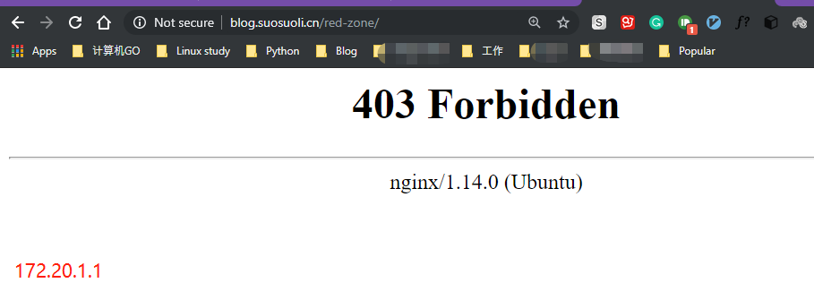
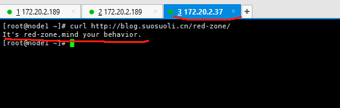
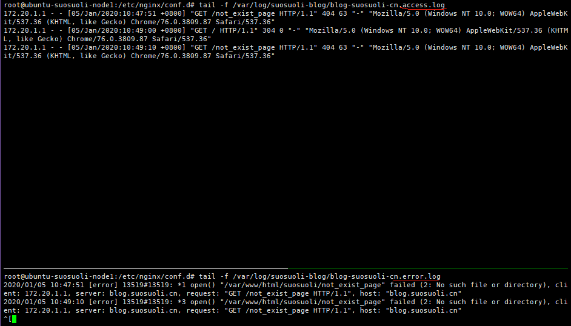
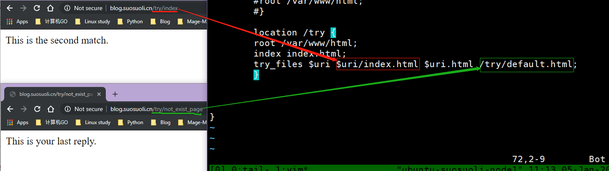
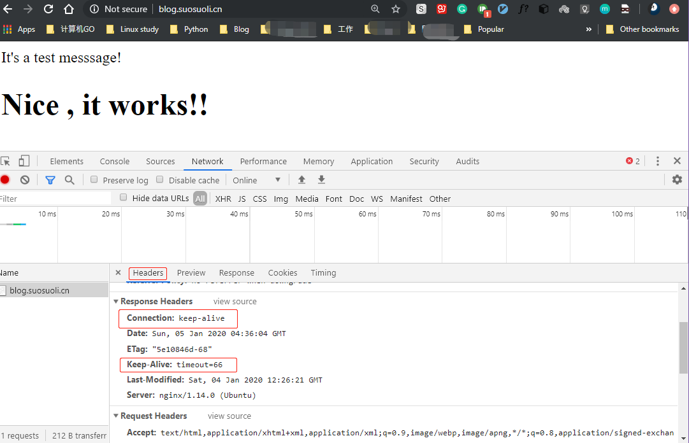
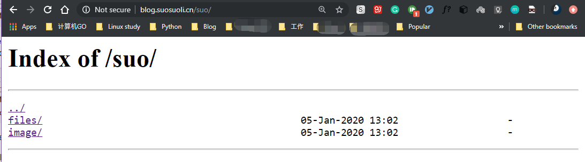
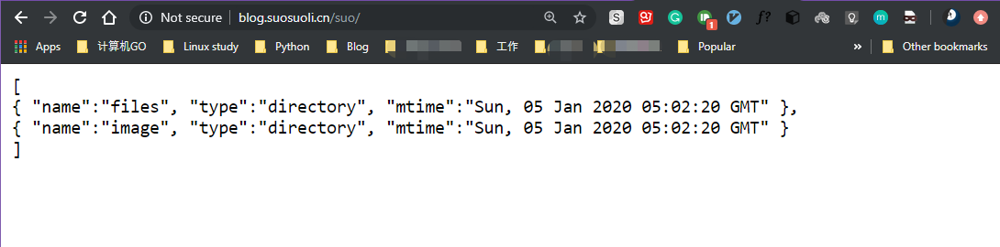

Nginx 核心配置

# 一.全局配置

## 1.1 Nginx 全局配置说明

```sh
user  nginx nginx;                 # 启动Nginx⼯作进程的⽤⼾和组
worker_processes  [number | auto]; # 启动Nginx⼯作进程的数量
worker_cpu_affinity 00000001 00000010 00000100 00001000;
# 将Nginx⼯作进程绑定到指定的CPU核⼼，默认Nginx是不进⾏进程绑定的，绑定并不是意味着当前nginx进程独
# 占以⼀核⼼CPU，但是可以保证此进程不会运⾏在其他核⼼上，这就极⼤减少了nginx的⼯作进程在不同的cpu核
# ⼼上的来回跳转，减少了CPU对进程的资源分配与回收以及内存管理等，因此可以有效的提升nginx服务器的性
# 能。 此处CPU有四颗核心。也可写成:
worker_cpu_affinity 0001 0010 0100 1000;


# 错误⽇志记录配置，语法：error_log file  [debug | info | notice | warn | error | crit | alert | emerg]
# error_log  logs/error.log;
# error_log  logs/error.log  notice;
error_log  /apps/nginx/logs/error.log error;

# pid⽂件保存路径
pid        /apps/nginx/logs/nginx.pid;

worker_priority 0; # ⼯作进程nice值，-20~19
worker_rlimit_nofile 65536; # 这个数字包括Nginx的所有连接（例如与代理服务器的连接等），⽽不仅仅是与
                            # 客⼾端的连接,另⼀个考虑因素是实际的并发连接数不能超过系统级别的最⼤打开⽂件数的限制.
[root@s2 ~]# watch -n1  'ps -axo pid,cmd,nice | grep nginx' #验证进程优先级

daemon off;  # 前台运⾏Nginx服务⽤于测试、docker等环境。
master_process off|on; #是否开启Nginx的master-woker⼯作模式，仅⽤于开发调试场景。

events { # 事件模型配置参数
    worker_connections  65536;  # 设置单个⼯作进程的最⼤并发连接数
    use epoll; # 使⽤epoll事件驱动，Nginx⽀持众多的事件驱动，⽐如select、poll、epoll，只能设置在events模块中设置。
    accept_mutex on; # 优化同⼀时刻只有⼀个请求⽽避免多个睡眠进程被唤醒的设置，on为防⽌被同时唤醒默
                     # 认为off，全部唤醒的过程也成为"惊群"，因此nginx刚安装完以后要进⾏适当的优化。
    multi_accept on; # Nginx服务器的每个⼯作进程可以同时接受多个新的⽹络连接，但是需要在配置⽂件中
                     # 配置，此指令默认为关闭，即默认为⼀个⼯作进程只能⼀次接受⼀个新的⽹络连接，打开后⼏个同时接受多个。
}
```

## 1.2 http 配置块说明

```bash
http {
    include       mime.types; # 导⼊⽀持的⽂件类型
    default_type  application/octet-stream; # 设置默认的类型，会提⽰下载不匹配的类型⽂件

    # ⽇志配置部分
    # log_format  main  '$remote_addr - $remote_user [$time_local] "$request" '
    #                   '$status $body_bytes_sent "$http_referer" '
    #                   '"$http_user_agent" "$http_x_forwarded_for"';
    # access_log  logs/access.log  main;

    # ⾃定义优化参数
    sendfile        on; # 实现⽂件零拷⻉
    #tcp_nopush     on; # 在开启了sendfile的情况下，合并请求后统⼀发送给客⼾端。
    #tcp_nodelay    off; # 在开启了keepalived模式下的连接是否启⽤TCP_NODELAY选项，当为off时，延
                         # 迟0.2s发送，默认On时，不延迟发送，⽴即发送⽤⼾相应报⽂。
    #keepalive_timeout  0;
    keepalive_timeout  65 65; # 设置会话保持时间
    #gzip  on; # 开启⽂件压缩

server {
        listen       80; # 设置监听地址和端⼝
        server_name  localhost; # 设置server name，可以以空格隔开写多个并⽀持正则表达式，如
                                # *.magedu.com www.magedu.* www.(site\d+)\.magedu\.com$ default_server
        #charset koi8-r; # 设置编码格式，默认是俄语格式，可以改为utf-8
        #access_log  logs/host.access.log  main;
        location / {
            root   html;
            index  index.html index.htm;
        }

        #error_page  404              /404.html;
        # redirect server error pages to the static page /50x.html
        #
        error_page   500 502 503 504  /50x.html; # 定义错误⻚⾯
        location = /50x.html {
            root   html;
        }

        # proxy the PHP scripts to Apache listening on 127.0.0.1:80
        #
        #location ~ \.php$ { #以http的⽅式转发php请求到指定web服务器
        #    proxy_pass   http://127.0.0.1;
        #}

        # pass the PHP scripts to FastCGI server listening on 127.0.0.1:9000
        #
        #location ~ \.php$ { #以fastcgi的⽅式转发php请求到php处理
        #    root           html;
        #    fastcgi_pass   127.0.0.1:9000;
        #    fastcgi_index  index.php;
        #    fastcgi_param  SCRIPT_FILENAME  /scripts$fastcgi_script_name;
        #    include        fastcgi_params;
        #}

        # deny access to .htaccess files, if Apache's document root
        # concurs with nginx's one
        #
        #location ~ /\.ht { #拒绝web形式访问指定⽂件，如很多的⽹站都是通过.htaccess⽂件来改变⾃⼰的重定向等功能。
        #    deny  all;
        #}
        location ~ /passwd.html {
            deny  all;
        }
        }

    # another virtual host using mix of IP-, name-, and port-based configuration
    #
    #server { #⾃定义虚拟server
    #    listen       8000;
    #    listen       somename:8080;
    #    server_name  somename  alias  another.alias;

    #    location / {
    #        root   html;
    #        index  index.html index.htm; #指定默认⽹⻚⽂件，此指令由ngx_http_index_module模块提供

    #    }
    #}

    # HTTPS server
    #
    #server { #https服务器配置
    #    listen       443 ssl;
    #    server_name  localhost;

    #    ssl_certificate      cert.pem;
    #    ssl_certificate_key  cert.key;

    #    ssl_session_cache    shared:SSL:1m;
    #    ssl_session_timeout  5m;

    #    ssl_ciphers  HIGH:!aNULL:!MD5;
    #    ssl_prefer_server_ciphers  on;

    #    location / {
    #        root   html;
    #        index  index.html index.htm;
    #    }
    location  /linux38/passwd.ht {
      deny  all;
     }

    #}
```

# 二. 核心配置示例

基于不同的 IP、不同的端⼝以及不⽤得域名实现不同的虚拟主机，依赖于核⼼模块
ngx_http_core_module 实现。

## 2.1 新建⼀个 PC web 站点

```bash
root@ubuntu-suosuoli-node1:/etc/nginx/conf.d# vim blog.conf
server {
        listen 80;
        server_name blog.suosuoli.cn;
        location / {
                root  /var/www/html/suosuoli;
                index index.html index.htm;
        }

        location /about {
        alias /var/www/html/about;
        index index.html;
        }
        }
}

root@ubuntu-suosuoli-node1:/var/www/html# mkdir suosuoli
root@ubuntu-suosuoli-node1:/var/www/html# vim suosuoli/index.html
root@ubuntu-suosuoli-node1:/var/www/html# cat suosuoli/index.html
<!DOCTYPE html>
<head>
It's a test messsage!
</head>
<body>
<h1>Nice , it works!!</h1>
</body>


root@ubuntu-suosuoli-node1:/etc/nginx/conf.d# vim ../nginx.conf
include /apps/nginx/conf/conf.d/*.conf;
......
root@ubuntu-suosuoli-node1:/etc/nginx/conf.d# nginx -t
nginx: the configuration file /etc/nginx/nginx.conf syntax is ok
nginx: configuration file /etc/nginx/nginx.conf test is successful

root@ubuntu-suosuoli-node1:/etc/nginx/conf.d# nginx -s reload
```

在`c:\Windows\System32\drivers\etc\hosts`新增一条解析
`172.20.2.189 blog.suosuoli.cn mob.suosuoli.cn`

然后访问验证`http://blog.suosuoli.cn`


## 2.2 新建一个移动端站点

```bash
root@ubuntu-suosuoli-node1:/etc/nginx/conf.d# vim mob.conf
server {
        listen 80;
        server_name mob.suosuoli.cn;
        location / {
                root /var/www/html/suosuoli-mob;
        }
}

root@ubuntu-suosuoli-node1:/var/www/html# mkdir suosuoli-mob

root@ubuntu-suosuoli-node1:/var/www/html# vim suosuoli-mob/index.html
root@ubuntu-suosuoli-node1:/var/www/html# cat suosuoli-mob/index.html
<!DOCTYPE html>
<head>
It's a test messsage!
</head>
<body>
<h1>Nice , it works!! BTW, this is your mobile site!!</h1>
</body>

root@ubuntu-suosuoli-node1:/etc/nginx/conf.d# nginx -t
nginx: the configuration file /etc/nginx/nginx.conf syntax is ok
nginx: configuration file /etc/nginx/nginx.conf test is successful

root@ubuntu-suosuoli-node1:/etc/nginx/conf.d# nginx -s reload
```

然后访问验证`http://mob.suosuoli.cn`


## 2.3 root 与 alias 配置指令

root 指令用来指定 web 站点的根目录(家目录)，在使用 location 配置块时，
用户访问的文件的绝对路径为`root/location`，如：

```ruby
location /about {
    root /data/nginx/html;
    index index.html
}
```

此时用户访问`http://blog.suosuoli.cn/about`，则打开`/data/nginx/html/about/index.html`

alias 则是定义一个别名，使用 alias 定义的资源地址替代用户输入的 URI， 如：

```ruby
location /about {
    alias /data/suosuoli/about;
    index index.html
}
```

此时用户访问`http://blog.suosuoli.cn/about`，则打开`/data/suosuoli/about/index.html`

具体的例子

```bash
server {
        server_name blog.suosuoli.cn;
        location / {
                root  /var/www/html/suosuoli;
                index index.html index.htm;
        }

        # 用户最终访问到的内容/var/www/html/about1/index.html
        location /about1 {
        root /var/www/html;
        index index.html;
        }

        # 用户访问到的内容/about2-->/var/www/html/suosuoli/about/index.html
        location /about2 { #  #使⽤alias的时候URI后⾯如果加了斜杠则下⾯的路径配置必须加斜杠，否则403
        alias /var/www/html/suosuoli/about;
        index index.html;
        }
        }
}

# /var/www/html 下必须有一个目录名为 about ，这样使用roo指令才可以访问到/var/www/html/about
# 下的index.html
root@ubuntu-suosuoli-node1:/var/www/html# mkdir about1
root@ubuntu-suosuoli-node1:/var/www/html# vim about1/index.html
root@ubuntu-suosuoli-node1:/var/www/html# cat about1/index.html
I'm root.

root@ubuntu-suosuoli-node1:/var/www/html# mkdir suosuoli/about
root@ubuntu-suosuoli-node1:/var/www/html# echo "I'm alias." > suosuoli/about/index.html

root@ubuntu-suosuoli-node1:/etc/nginx/conf.d# nginx -t
nginx: the configuration file /etc/nginx/nginx.conf syntax is ok
nginx: configuration file /etc/nginx/nginx.conf test is successful

root@ubuntu-suosuoli-node1:/etc/nginx/conf.d# nginx -s reload
```

访问`http://blog.suosuoli.cn/about1`


访问`http://blog.suosuoli.cn/about2`


## 2.4 location 配置指令的使用

使用`location`指令时，其匹配 URI 时可以支持正则表达式，该正则表达式遵循相应
的规则。在没有使⽤正则表达式的时候，nginx 会先在 server 配置块中的多个 location
选取匹配度最⾼的⼀个 URI(URI 也就是⽤⼾请求的字符串，即域名后⾯的 web 资源路径)，
如果匹配成功就结束搜索和匹配其它块，并使⽤此 location 处理此请求。

Nginx 的 location 中使用的正则符号规则如下：
语法规则： `location [=|~|~*|^~] /URI/ { … }`

| 匹配符号 | 规则                                                                                     |
| -------- | ---------------------------------------------------------------------------------------- |
| =        | ⽤于标准 URI 前，需要请求字串与 URI 精确匹配，如果匹配成功就停⽌向下匹配并⽴即处理请求。 |
| ~        | ⽤于标准 URI 前，表⽰包含正则表达式并且区分⼤⼩写，并且匹配                              |
| !~       | ⽤于标准 URI 前，表⽰包含正则表达式并且区分⼤⼩写，并且不匹配                            |
| ~\*      | ⽤于标准 URI 前，表⽰包含正则表达式并且不区分⼤写，并且匹配                              |
| !~\*     | ⽤于标准 URI 前，表⽰包含正则表达式并且不区分⼤⼩写,并且不匹配                           |
| ^~       | ⽤于标准 URI 前，表⽰包含正则表达式并且匹配以什么开头                                    |
| \$       | ⽤于标准 URI 前，表⽰包含正则表达式并且匹配以什么结尾                                    |
| \\       | ⽤于标准 URI 前，表⽰包含正则表达式并且转义字符。可以转. \* ?等                          |
| \*       | ⽤于标准 URI 前，表⽰包含正则表达式并且代表任意⻓度的任意字符                            |

如下图，红框 1 表示用户的请求 URI，红框 2 表示 Nginx 的 location 配置块
中事先定义的匹配字符，当红框 1 的内容和红框 2 的字符串满足正则规则时，就匹配
成功。


### 2.4.1 精确匹配访问资源

精确匹配时在 location 和 URI 之间使用`=`，这种用法通常用在长时间不变更
的资源上，例如

```bash
server {
        server_name blog.suosuoli.cn;
        location / {
                root  /var/www/html/suosuoli;
                index index.html index.htm;
        }

        location = /devops.png {
        root /var/www/html/images;
        index index.html;
        }
}

root@ubuntu-suosuoli-node1:/etc/nginx/conf.d# nginx -t
nginx: the configuration file /etc/nginx/nginx.conf syntax is ok
nginx: configuration file /etc/nginx/nginx.conf test is successful

root@ubuntu-suosuoli-node1:/etc/nginx/conf.d# nginx -s reload
```

访问`http://blog.suosuli.cn/devops.png`


### 2.4.2 URI 区分大小写匹配

区分大小写匹配，在 location 和 URI 之间使用`~`，例如：

```bash
server {
        server_name blog.suosuoli.cn;
        location / {
                root  /var/www/html/suosuoli;
                index index.html index.htm;
        }

        location ~ /devop.?\.png {
        root /var/www/html/images;
        index index.html;
        }

root@ubuntu-suosuoli-node1:/etc/nginx/conf.d# nginx -t
nginx: the configuration file /etc/nginx/nginx.conf syntax is ok
nginx: configuration file /etc/nginx/nginx.conf test is successful

root@ubuntu-suosuoli-node1:/etc/nginx/conf.d# nginx -s reload
```

访问:`http://blog.suosuoli.cn/devops.png`
访问:`http://blog.suosuoli.cn/devoPs.png`


### 2.4.3 URI 不区分大小写匹配

不区分大小写匹配，在 location 和 URI 之间使用`~*`，对⽤⼾请求
的 uri 做模糊匹配，也就是 uri 中⽆论都是⼤写、都是⼩写或者⼤⼩
写混合，此模式也都会匹配，通常使⽤此模式匹配⽤⼾ request 中的
静态资源并继续做下⼀步操作。例如：

```bash
server {
        server_name blog.suosuoli.cn;
        location / {
                root  /var/www/html/suosuoli;
                index index.html index.htm;
        }

        location ~* /devop.?\.png {
        root /var/www/html/images;
        index index.html;
        }

注意：
# 对于不区分⼤⼩写的location，则可以访问任意⼤⼩写结尾的图⽚⽂件,如区分⼤⼩写则只
# 能访问aa.jpg，不区分⼤⼩写则可以访问aa.jpg以外的资源⽐如Aa.JPG、aA.jPG这样的混
# 合名称⽂件，但是要求nginx服务器的资源⽬录有相应的⽂件，⽐如有Aa.JPG有aA.jPG。

root@ubuntu-suosuoli-node1:/var/www/html# cp images/devops.png images/devoPs.png

root@ubuntu-suosuoli-node1:/etc/nginx/conf.d# nginx -t
nginx: the configuration file /etc/nginx/nginx.conf syntax is ok
nginx: configuration file /etc/nginx/nginx.conf test is successful

root@ubuntu-suosuoli-node1:/etc/nginx/conf.d# nginx -s reload
```

访问:`http://blog.suosuoli.cn/devops.png`
访问:`http://blog.suosuoli.cn/devoPs.png`


### 2.4.4 以部分资源名称开头的匹配

```bash
root@ubuntu-suosuoli-node1:/var/www/html# mkdir suosuoli/{index1,index2} -pv
mkdir: created directory 'suosuoli/index1'
mkdir: created directory 'suosuoli/index2'
root@ubuntu-suosuoli-node1:/var/www/html# echo "index1" > suosuoli/index1/index.html
root@ubuntu-suosuoli-node1:/var/www/html# echo "index2" > suosuoli/index2/index.html

root@ubuntu-suosuoli-node1:/etc/nginx/conf.d# vim blog.conf
server {
        server_name blog.suosuoli.cn;
        location / {
                root  /var/www/html/suosuoli;
                index index.html index.htm;
        }

        location ^~ /index1 {    # 注意：/var/www/html/suousoli下要有index1文件夹
        root /var/www/html/suosuoli;
        index index.html;
        }

        location /index2 {
        alias /var/www/html/suosuoli/index2;
        index index.html;
        }

}

root@ubuntu-suosuoli-node1:/etc/nginx/conf.d# nginx -t
nginx: the configuration file /etc/nginx/nginx.conf syntax is ok
nginx: configuration file /etc/nginx/nginx.conf test is successful
root@ubuntu-suosuoli-node1:/etc/nginx/conf.d# nginx -s reload
```

访问：`http://blog.suosuoli.cn/index1`
访问：`http://blog.suosuoli.cn/index2`


### 2.4.5 以文件名后缀结尾的资源匹配

匹配以某些类型的文件后缀结尾的资源一般用于动静分离，即将对静态资源的访问定向
到某个位置，这些静态资源皆存储于此。

```bash
server {
        server_name blog.suosuoli.cn;
        location / {
                root  /var/www/html/suosuoli;
                index index.html index.htm;
        }

        location ~* \.(gif|jpg|jpeg|bmp|webp|svg|png|tiff|tif|ico|wmf|js|css)$ {
        root /var/www/html/images;
        index picture.html;
        }

}
```

访问：`http://blog.suosuoli.cn/*.(png|svg|jpg|...)`


### 2.4.6 匹配优先级说明

location 配置块中的通配符的匹配顺序：
`= ---> ^~ ---> ~/~* ----> /`
即是：
`(location = URI {...}) ---> (location 完整URI {...}) --->`
`(location ^~ URI {...}) ---> (location ~/~* URI {...}) --->`
`(location 部分URI {...}) ---> (location / {...})`

```bash
location ~* /devops.jpg {
    index index.html;
    root /var/www/html/images;
  }

  location = /devops.jpg { #通常⽤于精确匹配指定⽂件，如favicon.ico、employcode.js、index.jsp等
    index index.html;
    root /var/www/html/suosuoli/images;
  }
```

由于优先级关系，以上配置将会导致访问:`http:blog.suosuoli.cn/devops.jpg`时
访问的是`/var/www/html/suosuoli/images/devops.jpg`

生产时大致可以如下配置匹配顺序：

```bash
location = / {   # 由于日常访问中，直接访问"/"的类型比较多，在第一个location配置"= /"可以加速访问，原因是在该处匹配后就立即处理请求了。
    /data/html;
    index index.html index.htm;
}

location / {
    ......;
}

# 接着配置静态资源的匹配规则，由于实际应用中大部分图片等静态资源常常由
# 应用命名，会自带各种字符，大小写字母夹杂，所以忽略大小写。
location ^~ /static/ {
    ......;
}
# 或者
location ~* \.(gif|jpg|jpeg|bmp|webp|svg|png|tiff|tif|ico|wmf|js|css)$ {
        root /var/www/html/static;
        index index.html;
        }

# 给多个web应用配置资源匹配规则
location ~* /application1 {
    ......;
}

location ~* /application2 {
    ......;
}
```

## 2.5 Nginx 四层访问控制

Nginx 的四层访问控制基于模块`ngx_http_access_module`实现，可以通过匹配
客户端 IP 地址进行限制。

```bash
root@ubuntu-suosuoli-node1:/var/www/html# mkdir red-zone
root@ubuntu-suosuoli-node1:/var/www/html# echo "It's red-zone,mind your behavior." > red-zone/index.html

server {
        server_name blog.suosuoli.cn;
        location / {
                root  /var/www/html/suosuoli;
                index index.html index.htm;
        }

        location /red-zone {
        root /var/www/html;
        index index.html index.htm;
        deny 172.20.1.1;
        allow 172.20.0.0/16;
        deny all;
        }
}
```

物理机`172.20.1.1`访问:`http://blog.suosuoli.cn/red-zone/`


在`172.20.0.0/16`网段的另一台机子上修改一下 hosts 文件

```bash
vim /etc/hosts
172.20.2.37  blog.suosuoli.cn
```

并在`172.20.2.37`访问:`http://blog.suosuoli.cn/red-zone/`


## 2.6 Nginx 账户认证功能

```bash
root@ubuntu-suosuoli-node1:~# htpasswd -cmb /etc/nginx/conf.d/.htpasswd user1 stevenux
Adding password for user user1
root@ubuntu-suosuoli-node1:~# htpasswd -mb /etc/nginx/conf.d/.htpasswd user2 stevenux
Adding password for user user2
root@ubuntu-suosuoli-node1:~# cat /etc/nginx/conf.d/.htpasswd
user1:$apr1$Ldf9UL25$sKYSQJI7YU5QoP09DNckd.
user2:$apr1$5WMJZBsa$KAGjRkkmV1JuOnXcHBHus1

root@ubuntu-suosuoli-node1:/etc/nginx/conf.d# vim blog.conf

server {
        server_name web.suosuoli.cn;
        location / {
                root  /var/www/html/suosuoli;
                index index.html index.htm;
        }

        location /red-zone {
        satisfy all;

        root /var/www/html;
        index index.html index.htm;
        deny 172.20.1.1;
        allow 172.20.0.0/16;
        deny all;

        auth_basic  "Input passwd to log in.";
        auth_basic_user_file conf.d/.htpasswd;
        }

}

# satisfy all|any;
# 如果ngx_http_access_module、ngx_http_auth_basic_module、ngx_http_auth_request_module或
# ngx_http_auth_jwt_module模块中的所有(all)或至少一个(any)模块允许访问，则允许访问。
```

访问:`http://web.suosuoli.cn/red-zone/`


## 2.7 自定义错误页面

```bash
root@ubuntu-suosuoli-node1:/var/www/html# echo "Oops,what you want is not find." > error.html

root@ubuntu-suosuoli-node1:/etc/nginx/conf.d# vim blog.conf
server {
        server_name blog.suosuoli.cn;
        location / {
                root  /var/www/html/suosuoli;
                index index.html index.htm;
        }
        error_page 500 502 503 504 404 /error.html;
        location = /error.html {
        root /var/www/html;
        }
}

root@ubuntu-suosuoli-node1:/etc/nginx/conf.d# nginx -t
nginx: the configuration file /etc/nginx/nginx.conf syntax is ok
nginx: configuration file /etc/nginx/nginx.conf test is successful
root@ubuntu-suosuoli-node1:/etc/nginx/conf.d# nginx -s reload
```

访问不存在的页面:`http://blog.suosuoli.cn/not_exist_page/`


## 2.8 自定义访问日志

```bash
root@ubuntu-suosuoli-node1:/etc/nginx/conf.d# vim blog.conf
server {
        server_name blog.suosuoli.cn;
        location / {
                root  /var/www/html/suosuoli;
                index index.html index.htm;
        }

        error_page 500 502 503 504 404 /error.html;
        access_log /var/log/suosuoli-blog/blog-suosuoli-cn.access.log;
        error_log /var/log/suosuoli-blog/blog-suosuoli-cn.error.log;
        location = /error.html {
                 root /var/www/html;
        }
}
```

上：正常访问访问`http://blog.suousoli.cn`
下：不存在页面访问，访问`http://blog.suousoli.cn/not_exist_page`


## 2.9 try_files 指令

try_files 用于检测需要访问的资源是否存在，其会按顺序检查⽂件是否存在，返回第
⼀个找到的⽂件或⽂件夹(结尾加斜线表⽰为⽂件夹)，如果所有⽂件或⽂件夹都找不到，
会进⾏⼀个内部重定向到 try_files 后面的最后⼀个参数。只有最后⼀个参数可以引起
⼀个内部重定向，之前的参数只设置内部 URI 的指向。最后⼀个参数是回退 URI 且必须
存在，否则会出现内部 500 错误。

```bash
root@ubuntu-suosuoli-node1:/var/www/html# mkdir try
root@ubuntu-suosuoli-node1:/var/www/html# echo "This is the second match." > try/index.html
root@ubuntu-suosuoli-node1:/var/www/html# echo "This is your last reply." > try/default.html

root@ubuntu-suosuoli-node1:/etc/nginx/conf.d# vim blog.conf
server {
        server_name blog.suosuoli.cn;
        location / {
                root  /var/www/html/suosuoli;
                index index.html index.htm;
        }
        location /try {
        root /var/www/html;
        index index.html;
        try_files $uri $uri/index.html $uri.html /try/default.html;
        }
```

红-访问:`http://blog.suosuoli.cn/try/index`
绿-访问:`http://blog.suosuoli.cn/try/not_exist_page`


上面当访问到`http://blog.suosuoli.xn/try/xx.html`等不存在的 uri 会显⽰`default.html`，
还可以将最后一个匹配自定义为状态码，如果是⾃定义的状态码则会显⽰在返回数据的状态码中。

```bash
root@ubuntu-suosuoli-node1:/etc/nginx/conf.d# vim blog.conf

server {
        server_name blog.suosuoli.cn;
        location / {
                root  /var/www/html/suosuoli;
                index index.html index.htm;
        }
        location /try {
        root /var/www/html;
        index index.html;
        #try_files $uri $uri/index.html $uri.html /try/default.html;
        try_files $uri $uri/index.html $uri/$uri.html =500;
        }
```

访问到`http://blog.suosuoli.cn/try/xx.html`时如下图，显示了自定义的 500 状态码。


## 2.10 长连接配置

Nginx 长连接使用指令`keepalive_timeout number1 [number2];`设置。第一个参数`number1`
设置一个超时，在此期间，服务器端上的 keep-alive 客户机连接将保持打开状态。`number1`的
数值为 0 表⽰禁⽌⻓连接，默认为 75s，通常配置在 http 字段作为站点全局配置。`number2`表
示在服务器处理请求后响应头中的`Keep-Alive`键。如：
在配置时`keepalive_timeout 65 66;`则浏览器收到响应后的`Keep-Alive`字段如下：
`Keep-Alive:timeout=66`，及实际的长连接时间`number1`可以和值`number2`不同。另外，
指令`keepalive_requests number;` 则设置在⼀次⻓连接上所允许请求的资源的最⼤次数，默
认为 100 次。
**值得注意的是**：为了释放每个连接的内存分配(通常每个连接会消耗一些内存)，需要周期性地
关闭连接。因此，使用过高的最大请求数可能会导致过多的内存使用，不建议这样做。

```bash
root@ubuntu-suosuoli-node1:/etc/nginx/conf.d# vim blog.conf
server {
        server_name blog.suosuoli.cn;
        keepalive_requests 5;
        keepalive_timeout 65 66;
        location / {
                root  /var/www/html/suosuoli;
                index index.html index.htm;
        }
}

# 使用另一台虚拟机测试
[root@node1 html]# telnet blog.suosuoli.cn 80
Trying 172.20.2.189...
Connected to blog.suosuoli.cn.
Escape character is '^]'.
GET / HTTP/1.1          # 键入请求方法(GET)、请求的资源(/)和HTTP协议(HTTP/1.1)
HOST:blog.suosuoli.cn   # 键入主机名
                        # 回车，表示请求头结束
HTTP/1.1 200 OK         # 响应头如下
Server: nginx/1.14.0 (Ubuntu)
Date: Sun, 05 Jan 2020 04:37:57 GMT
Content-Type: text/html
Content-Length: 104
Last-Modified: Sat, 04 Jan 2020 12:26:21 GMT
Connection: keep-alive
Keep-Alive: timeout=66
ETag: "5e10846d-68"
Accept-Ranges: bytes

<!DOCTYPE html>     # 响应体内容
<head>
	It's a test messsage!
</head>
<body>
	<h1>Nice , it works!!</h1>
</body>
```

物理机访问`http://blog.suosuoli.cn`并使用调试模式查看键`Keep-Alive`的值


## 2.11 配置为下载服务器

Nginx 可以配置为下载服务器，像阿里云和清华大学的镜像源站点都是基于 Nginx
来配置为下载服务器的。需要如下几个配置指令：

```ruby
autoindex  on | off; # 开启或者关闭列表生成
autoindex_format html | xml | json | jsonp; # 规定生成的列表格式，默认为html格式
autoindex_exact_size  on; # 对于html格式的列表，使用确切的字节大小表示文件还是四舍五入为KB/MB/GB
autoindex_localtime  on; # 对于html格式的列表，规定列表中显示文件信息的时间时区，使用本地时区还是UTC时区
limit_rate rate; # 限制响应给客⼾端的传输速率，单位是bytes/second，默认值0表⽰⽆限制
# 如：
limit_rate 10k;
```

`ngx_http_autoindex_module`模块用来处理以斜杠字符('/')结尾的请求，并生成
一个目录列表返回给客户端。通常，当`ngx_http_index_module`模块找不到索引文
件时，请求会被传递给 ngx_http_autoindex_module 模块。

```bash
root@ubuntu-suosuoli-node1:/var/www/html# mkdir suo/{image,files}/{2019,2020} -pv
mkdir: created directory 'suo'
mkdir: created directory 'suo/image'
mkdir: created directory 'suo/image/2019'
mkdir: created directory 'suo/image/2020'
mkdir: created directory 'suo/files'
mkdir: created directory 'suo/files/2019'
mkdir: created directory 'suo/files/2020'
root@ubuntu-suosuoli-node1:/var/www/html# tree  suo
suo
├── files
│   ├── 2019
│   └── 2020
└── image
    ├── 2019
    └── 2020
root@ubuntu-suosuoli-node1:/var/www/html# cp images/devops.png suo/image/2020/
root@ubuntu-suosuoli-node1:/var/www/html# cp images/nginx.png suo/files/2020/
root@ubuntu-suosuoli-node1:/var/www/html# tree suo
suo
├── files
│   ├── 2019
│   └── 2020
│       └── nginx.png
└── image
    ├── 2019
    └── 2020
        └── devops.png

root@ubuntu-suosuoli-node1:/etc/nginx/conf.d# vim blog.conf
server {
        server_name blog.suosuoli.cn;
        keepalive_requests 5;
        keepalive_timeout 65 66;
        location / {
                root  /var/www/html/suosuoli;
                index index.html index.htm;
        }

        location /suo {
                autoindex on;
                autoindex_exact_size on;
                autoindex_localtime on;
                # autoindex_format json;
                root /var/www/html;
        }
}
```

访问`http://blog.suosuoli.cn/suo/`如下


访问`http://blog.suosuoli.cn/suo/files/2020/`如下


访问`http://blog.suosuoli.cn/suo/image/2020/`如下


取消注释`autoindex_format json;`，则访问`http://blog.suosuoli.cn/suo`效果如下：


## 2.12 配置为上传服务器

Nginx 作为上传服务时，需要配置一些必须的配置项，比如允许上传的单个文件
大小等。不同的场景往往配置不同。

```bash
client_max_body_size 1m；       # 设置允许客⼾端上传单个⽂件的最⼤值，默认值为1m
client_body_buffer_size size;   # ⽤于接收每个客⼾端请求报⽂的body部分的缓冲区⼤⼩；默认16k；
                                # 超出此⼤⼩时，其将被暂存到磁盘上的由下⾯client_body_temp_path指令所定义的位置
client_body_temp_path path [level1 [level2 [level3]]]; # 设定存储客⼾端请求报⽂的body部分的临时存储路
                                                       # 径及⼦⽬录结构和数量，⽬录名为16进制的数字，# 使⽤hash之后的值从后往前截取1位、2位、2位作为⽂件名：
```

```bash
root@ubuntu-suosuoli-node1:/etc/nginx/conf.d# vim blog.conf
server {
        server_name blog.suosuoli.cn;
        keepalive_requests 5;
        keepalive_timeout 65 66;

        client_max_body_size 10m;
        client_body_buffer_size 16k;
        client_body_temp_path /var/www/html/suosuoli/temp 1 2 2;
        # 1级⽬录占1位16进制，即2^4=16个⽬录  0-f
        # 2级⽬录占2位16进制，即2^8=256个⽬录 00-ff
        # 3级⽬录占2位16进制，即2^8=256个⽬录 00-ff

        location / {
                root  /var/www/html/suosuoli;
                index index.html index.htm;
        }
}

root@ubuntu-suosuoli-node1:/var/www/html# tree suosuoli/temp/  # reload Nginx⾃动创建temp⽬录
suosuoli/temp/

0 directories, 0 files

```

## 2.13 其它的配置

```bash
keepalive_disable none | browser ...;  # 对哪种浏览器禁⽤⻓连接

limit_except method ... { ... } # 仅⽤于location配置块；限制客⼾端使⽤除了指定的请求⽅法之外的其它⽅法
                                # method:GET, HEAD, POST, PUT, DELETE，MKCOL, COPY, MOVE, OPTIONS, PROPFIND, PROPPATCH, LOCK, UNLOCK, PATCH
limit_except GET {
    allow 192.168.0.0/24;
    allow 192.168.7.101;
    deny  all;
}
```

`limit_except`配置示例:除了 GET 方法之外的其它方法只允许`172.20.1.1`
主机访问。

```bash
location /upload {
    root /var/www/html/suosuoli;
    index index.html;
    limit_except GET {
        allow 172.20.1.1;
        deny all;
    }
}
```

```bash
aio on | off  # 是否启⽤asynchronous file I/O(AIO)功能，需要编译开启

# linux 2.6以上内核提供以下⼏个系统调⽤来⽀持aio：
1、SYS_io_setup：建⽴aio 的context
2、SYS_io_submit: 提交I/O操作请求
3、SYS_io_getevents：获取已完成的I/O事件
4、SYS_io_cancel：取消I/O操作请求
5、SYS_io_destroy：毁销aio的context
```

```bash
directio size | off; # 操作完全和aio相反，aio是读取⽂件⽽directio是写⽂件到磁盘
                     # 直接I/O默认为关闭，当⽂件⼤于等于给定⼤⼩时写磁盘，例如directio 4m
                     # 同步（直接）写磁盘，⽽⾮写缓存。

open_file_cache off; # 是否缓存打开过的⽂件信息
open_file_cache max=N [inactive=time];
# nginx可以缓存以下三种信息：
    #(1) ⽂件元数据：⽂件的描述符、⽂件⼤⼩和最近⼀次的修改时间
    #(2) 打开的⽬录结构
    #(3) 没有找到的或者没有权限访问的⽂件的相关信息
    # max=N：可缓存的缓存项上限数量；达到上限后会使⽤LRU(Least recently used，最近最少使⽤)算法实现管理
inactive=time; # 缓存项的⾮活动时⻓，在此处指定的时⻓内未被命中的或命中的次数少于open_file_cache_min_uses指令所指定的次数的缓存项即为⾮活动项，将被删除
```

```bash
open_file_cache_errors on | off; # 是否缓存查找时发⽣错误的⽂件⼀类的信息,默认值为off
```

```bash
open_file_cache_min_uses number;
    # open_file_cache指令的inactive参数指定的时⻓内，⾄少被命中此处指定的次数⽅可被归类为活动项
    # 默认值为1
open_file_cache_valid time;
    # 缓存项有效性的检查验证频率，默认值为60s

open_file_cache max=10000 inactive=60s; # 最⼤缓存10000个⽂件，⾮活动数据超时时⻓60s
open_file_cache_valid    60s;           # 每间隔60s检查⼀下缓存数据有效性
open_file_cache_min_uses 5;             # 60秒内⾄少被命中访问5次才被标记为活动数据
open_file_cache_errors   on;            # 缓存错误信息
server_tokens off;                      # 隐藏Nginx server版本
```
