Nginx 重写功能

# 一. ngx_http_rewrite_module 模块

Nginx 服务器利⽤ ngx_http_rewrite_module 模块解析和处理 rewrite 请求，
此功能依靠 PCRE(perl compatible regular expression)，因此编译之前要安
装 PCRE 库，rewrite 是 nginx 服务器的重要功能之⼀，⽤于实现 URL 的重写
，URL 的重写是⾮常有⽤的功能，⽐如它可以在我们改变⽹站结构之后，不需要客
⼾端修改原来的书签，也⽆需其他⽹站修改我们的链接，就可以设置为访问，另外
还可以在⼀定程度上提⾼⽹站的安全性。

ngx_http_rewrite_module 模块会使用 PCRE 正则表达式更改用户请求的 URI、
返回重定向后 URI 指向的资源以及有条件地选择配置来更改请求 URI。

针对该模块提供的功能的配置指令有  
: break
: if
: return
: rewrite
: rewrite_log
: set
: uninitialized_variable_warn

## 1.1 if 指令

if 指令⽤于条件匹配，并根据条件判断结果选择相应的 Nginx 配置，可以配置在
server 或 location 块中，ngx_http_rewrite_module 的 if 语法仅能使⽤ if
做单次判断。配置形式如下：

```bash
if (condition) {
    action;
}
# 如果condition满足，则选择花括号内的动作执行；否则，匹配其它配置块的动作。
```

if 判断的条件一般会用到下面的匹配表达式：

```bash
# 匹配成功时if指令认为条件为true，执行if指定的配置指令；否则认为false，搜索匹配其它块内配置

=   # ⽐较变量和字符串是否相等，相等时if指令认为该条件为true，反之为false。
!=  # ⽐较变量和字符串是否不相等，不相等时if指令认为条件为true，反之为false。

~   # 表⽰在匹配过程中区分⼤⼩写字符，(可以通过正则表达式匹配)，满⾜匹配条件为真，不满⾜为假。
!~  # 为区分⼤⼩写字符且字符不匹配，不匹配为真，字符匹配为假。
~*  # 表⽰在匹配过程中不区分⼤⼩写字符，(可以通过正则表达式匹配)，满⾜匹配条件为真，不满⾜为假。
!~* # 为不区分⼤⼩字符且字符不匹配，匹配为假，不匹配为真。
~,!~,~*,!~*等匹配规则在匹配时可以使用括号来打组，使用$1~$9来进行后向引用，或者在if语句块内重用。

-f 和 ! -f  # 判断请求的⽂件是否存在和是否不存在
-d 和 ! -d  # 判断请求的⽬录是否存在和是否不存在。
-x 和 ! -x  # 判断⽂件是否可执⾏和是否不可执⾏。
-e 和 ! -e  # 判断请求的⽂件或⽬录是否存在和是否不存在(包括⽂件，⽬录，软链接)。

.     # 匹配除换行符以外的任意字符
\w    # 匹配字母或数字或下划线或汉字
\s    # 匹配任意的空白符
\d    # 匹配数字
\b    # 匹配单词的开始或结束
^     # 匹配字符串的开始
$     # 匹配字符串的结束

*        # 重复零次或更多次
+        # 重复一次或更多次
?        # 重复零次或一次
{n}      # 重复n次
{n,}     # 重复n次或更多次
{n,m}    # 重复n到m次
*?       # 复任意次，但尽可能少重复
+?       # 重复1次或更多次，但尽可能少重复
??       # 重复0次或1次，但尽可能少重复
{n,m}?   # 重复n到m次，但尽可能少重复
{n,}?    # 重复n次以上，但尽可能少重复

\W       # 匹配任意不是字母，数字，下划线，汉字的字符
\S       # 匹配任意不是空白符的字符
\D       # 匹配任意非数字的字符
\B       # 匹配不是单词开头或结束的位置
[^x]     # 匹配除了x以外的任意字符
[^aeiou] # 匹配除了aeiou这几个字母以外的任意字符
```

注：如果\$变量的值为空字符串，则 if 指令认为该条件为 false，其他条件为 true。
在 nginx-1.0.1 及以前的版本中，以 0 开头的任意字符串都认为是 false。

示例：

```bash
http {
......
    # pc virtual host #
    server {

    server_name pc.suosuoli.cn;
    listen              80;
    listen              443 ssl;
    ssl_certificate     /apps/nginx/certs/www.suosuoli.cn.crt;
    ssl_certificate_key /apps/nginx/certs/www.suosuoli.cn.key;
    ssl_session_cache   shared:sslcache:20m;
    ssl_session_timeout 10m;

    location / {
        root /apps/nginx/html/suosuoli;
        index index.html;

        default_type text/html;

        if ( $scheme = http ){
            echo "Warning!!!!";
        }

        if ( $scheme = https ){
            echo "Nice!!!!";
        }

        if ( !-e $request_filename ) {
            echo "Oops, file not find.";
            echo $request_filename;
        }
    }

    }
......
}
```

访问`https://pc.suosuoli.cn`
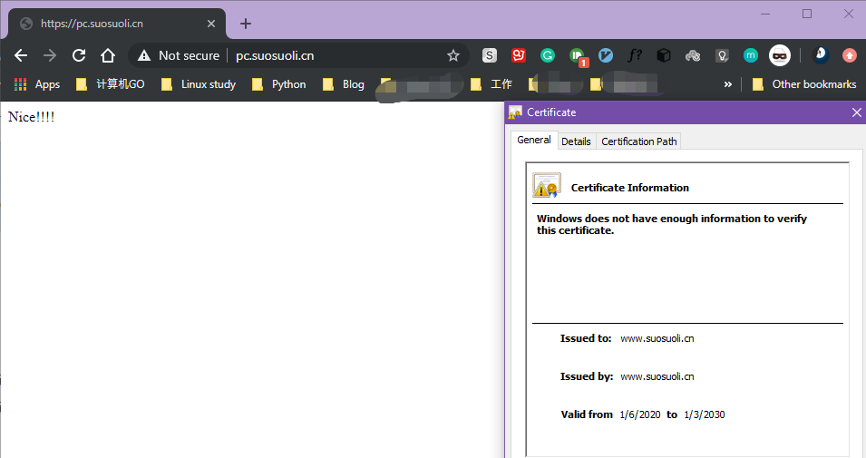
访问`http://pc.suosuoli.cn`
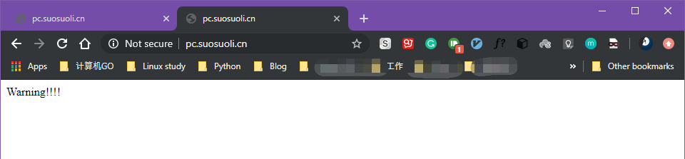
访问`http://pc.suosuoli.cn/not_exist_file`

访问`https://pc.suosuoli.cn/not_exist_file`
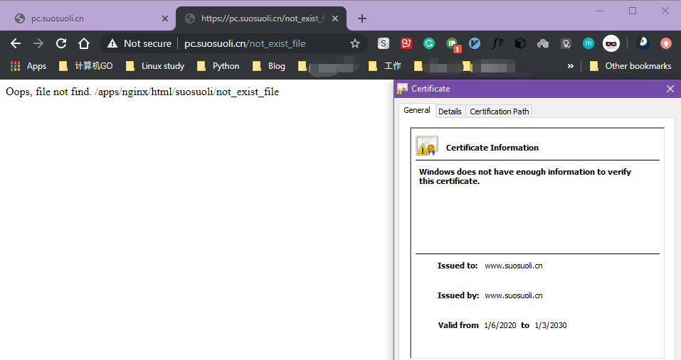

```bash
server {
    server_name pc.suosuoli.cn;
    listen              80;
    listen              443 ssl;
    ssl_certificate     /apps/nginx/certs/www.suosuoli.cn.crt;
    ssl_certificate_key /apps/nginx/certs/www.suosuoli.cn.key;
    ssl_session_cache   shared:sslcache:20m;
    ssl_session_timeout 10m;

 location / {
        root /apps/nginx/html/suosuoli;
        index index.html;

        default_type text/html;

        if ( $request_filename ~* (.*)exist(.*) ){
                echo "$1";
                echo "exist";
                echo "$2";
        }
    }
}
```

验证使用\$1~\$9 重用匹配到的字符串
访问`http://pc.suosuoli.cn/not_exist_file`
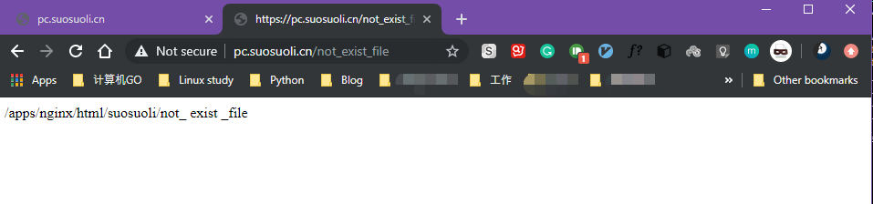

## 1.2 set 指令

`ngx_http_rewrite_module`模块的 set 指令用来指定一个键`key`，并紧跟着赋值给
该键，键必须带\$符，值可以是字符串、变量(\$val)或者二者的组合。格式如下：
`set $key value` 或者 `set $key $value`

```bash
 server {

    server_name pc.suosuoli.cn;
    listen              80;
    listen              443 ssl;
    ssl_certificate     /apps/nginx/certs/www.suosuoli.cn.crt;
    ssl_certificate_key /apps/nginx/certs/www.suosuoli.cn.key;
    ssl_session_cache   shared:sslcache:20m;
    ssl_session_timeout 10m;

    location / {
        root /apps/nginx/html/suosuoli;
        index index.html;

        default_type text/html;

        set $my_name stevenux;
        echo $my_name;
        set $my_host_name $host;
        echo $my_host_name;
    }
}
```

访问`https://pc.suosuoli.cn`


## 1.3 break 指令

用于中断当前相同作用域(location)中的其他 Nginx 配置，与该指令处于同一作用域的
Nginx 配置中，位于它前面的配置生效，位于后面的指令配置就不再生效了，Nginx 服务
器在根据配置处理请求的过程中遇到该指令的时候，回到上一层作用域继续向下读取配置，
该指令可以在 server 块和 location 块以及 if 块中使用，使用语法如下：

```bash
server {
location / {
        root /apps/nginx/html/suosuoli;
        index index.html;

        default_type text/html;

        set $my_name stevenux;
        echo $my_name;
        break;
        set $my_host_name $host;
        echo $my_host_name;
}
...
}
```

访问`https://pc.suosuoli.cn`，可以看到主机名未被 echo。


## 1.4 return 指令

`ngx_http_rewrite_module`模块的 return 指令用来结束请求处理并向客户端返回一个
状态码。非标准的 444 状态码会导致服务器在不发送响应头的情况下主动关闭连接。

从 nginx 版本 0.8.42 开始，return 可以用于指定一个重定向 URL(状态码 301,302,303,
307 和 308) 或者是指定提示文本内容(对于特殊状态码 403/500 等)，处于此指令后的所
有配置都将不被执行，return 可以在 server、if 和 location 块进行配置，用法如下：

```bash
Syntax:	return code [text];  # 返回给客户端的状态码及响应体内容，可以调用变量
        return code URL; # 返回给客户端指定的HTTP状态码和URL
        return URL; # 返回给客户端的URL地址
Default:—
Context:server, location, if
```

- 重定向到某个 URL

```bash
server {
location / {
       root /apps/nginx/html/suosuoli;
       index index.html;

       default_type text/html;

       set $my_name stevenux;
       echo $my_name;
       return "http://www.baidu.com";
       set $my_host_name $host;
       echo $my_host_name;
   }
}
```

访问`https://pc.suosuoli.cn`跳转到`http://www.baidu.com`
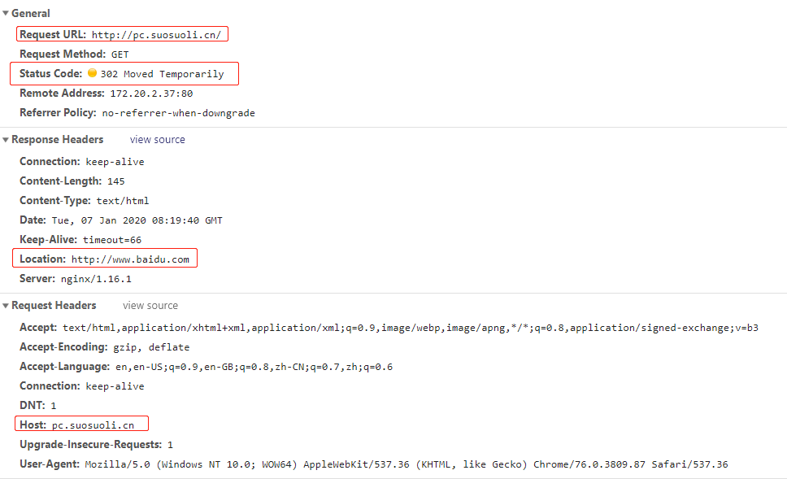

- 返回一个自定义状态码

```bash
server {
    .......
    location {
     if ( $scheme = http ){
                return 888;
            }
    }
}
```

访问`https://pc.suosuoli.cn`
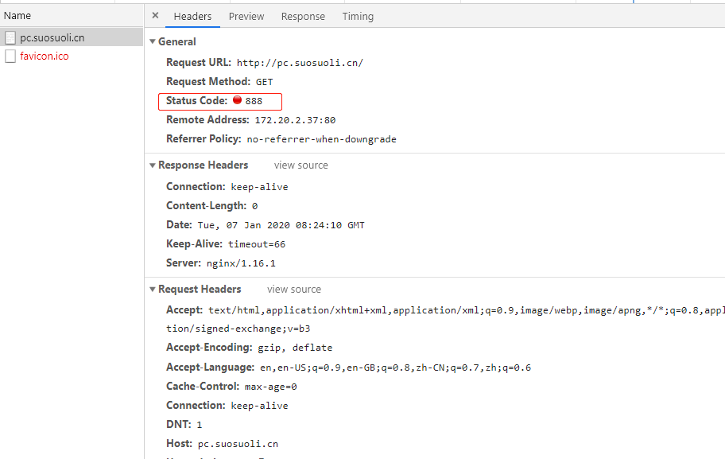

- 返回状态码及重定向

```bash
server {
    .......
    location {
     if ( $scheme = http ){
                return 301 http://www.baidu.com;
            }
    }
}
```

访问`http://pc.suosuoli.cn`
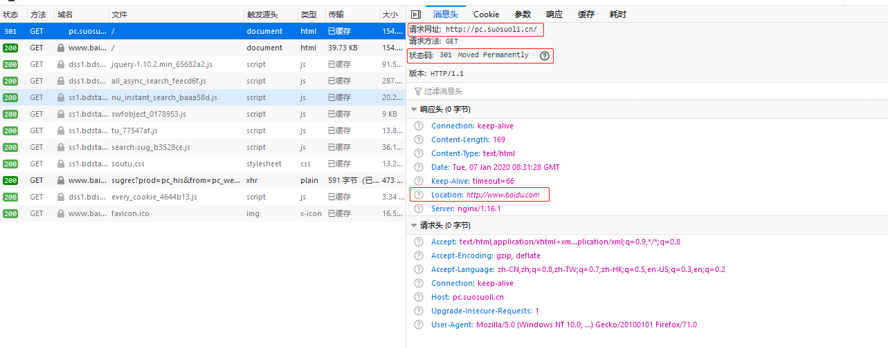

- 返回状态码和自定义信息

```bash
server {
    location {
     if ( $scheme = http ){
                 return 500 "Server internal malfunctioning.";
                 echo "You will not see this.";
             }
         }
}
```

访问`http://pc.suosuoli.cn`
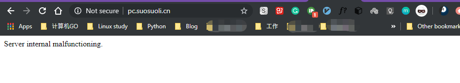

## 1.5 rewrite_log 指令

`ngx_http_rewrite_module`模块的 rewrite_log 指令用来开启或者关闭`error_log`
对该模块的处理请求的日志记录，记录级别为`notice`。用法：

```bash
Syntax:  rewrite_log on | off;
Default: rewrite_log off;
Context: http, server, location, if
```

```bash

[root@node1 conf]# vim nginx.conf

error_log  logs/error.log  notice;

server {
    ......
    location /rewrite_log {
        index index.html;
        default_type text/html;

        set $my_name stevenux;
        echo $my_name;
        rewrite_log on;
        break;
        set $my_host_name $host;
        echo $my_host_name;
    }
}


# 开启rewrite_log后
# 访问http://pc.suosuoli.cn/rewrite_lo和http://pc.suosuoli.cn/rewrite_lo触发错误日志并记录
# 访问http://pc.suosuoli.cn/rewrite_log也记录

# 关闭rewrite_log后
# 访问http://pc.suosuoli.cn/rewrite_log无记录
# 访问http://pc.suosuoli.cn/rewrite_lo和http://pc.suosuoli.cn/rewrite_lo触发错误日志并记录

[root@node1 html]# tail -f /apps/nginx/logs/error.log
2020/01/07 17:05:58 [notice] 1241#0: using the "epoll" event method
2020/01/07 17:05:58 [notice] 1241#0: start worker processes
2020/01/07 17:05:58 [notice] 1241#0: start worker process 4504
2020/01/07 17:05:58 [notice] 1241#0: start worker process 4505
2020/01/07 17:05:58 [notice] 1241#0: signal 17 (SIGCHLD) received from 4497
2020/01/07 17:05:58 [notice] 1241#0: worker process 4497 exited with code 0
2020/01/07 17:05:58 [notice] 1241#0: signal 29 (SIGIO) received
2020/01/07 17:05:58 [notice] 1241#0: signal 17 (SIGCHLD) received from 4498
2020/01/07 17:05:58 [notice] 1241#0: worker process 4498 exited with code 0
2020/01/07 17:05:58 [notice] 1241#0: signal 29 (SIGIO) received
2020/01/07 17:06:10 [error] 4504#0: *287 open() "/apps/nginx/html/suosuoli/rewrite_lo" failed (2: No such file or directory), client: 172.20.1.1, server: pc.suosuoli.cn, request: "GET /rewrite_lo HTTP/1.1", host: "pc.suosuoli.cn"
2020/01/07 17:06:15 [warn] 4504#0: *287 using uninitialized "my_host_name" variable, client: 172.20.1.1, server: pc.suosuoli.cn, request: "GET /rewrite_log HTTP/1.1", host: "pc.suosuoli.cn"
2020/01/07 17:06:21 [error] 4504#0: *287 open() "/apps/nginx/html/suosuoli/rewrite_l" failed (2: No such file or directory), client: 172.20.1.1, server: pc.suosuoli.cn, request: "GET /rewrite_l HTTP/1.1", host: "pc.suosuoli.cn"
2020/01/07 17:10:28 [warn] 4515#0: *290 using uninitialized "my_host_name" variable, client: 172.20.1.1, server: pc.suosuoli.cn, request: "GET /rewrite_log HTTP/1.1", host: "pc.suosuoli.cn"
2020/01/07 17:10:31 [warn] 4515#0: *290 using uninitialized "my_host_name" variable, client: 172.20.1.1, server: pc.suosuoli.cn, request: "GET /rewrite_log HTTP/1.1", host: "pc.suosuoli.cn"
```

# 二. rewrite 指令使用

`ngx_http_rewrite_module`的 rewrite 指令通过正则表达式的匹配来改变 URI，可以同时
存在一个或多个指令，按照顺序依次对 URI 进行匹配，rewrite 主要是针对用户请求的 URL
或者是 URI 做具体处理。
URI(universal resource identifier)：通用资源标识符，标识一个资源的路径，可以不带
协议。URL(uniform resource location):统一资源定位符，是用于在 Internet 中描述资
源的字符串，是 URI 的子集，主要包括传输协议(scheme)、主机(IP、端口号或者域名)和资
源具体地址(目录和文件名)等三部分，一般格式为:
`scheme://主机名[:端口号][/资源路径]`
如：
`http://www.a.com:8080/path/file/index.html`就是一个 URL 路径，URL 必须带访问
协议。每个 URL 都是一个 URI，但是 URI 不都是 URL。

例如：

```bash
http://example.org:8080/path/to/resource.txt  # URI/URL
ftp://example.org/resource.txt   # URI/URL
/absolute/path/to/resource.txt   # URI
```

rewrite 的官方介绍地址：
`https://nginx.org/en/docs/http/ngx_http_rewrite_module.html#rewrite`
rewrite 可以配置在 server、location、if，其具体使用方式为：
`rewrite regex replacement [flag];`

rewrite 将用户请求的 URI 基于 regex 所描述的模式进行检查，匹配到时将其替换为
表达式指定的新的 URI。 注意：如果在同一级配置块中存在多个 rewrite 规则，那么
会按照其在配置块中的顺序自上而下逐个检查。

被某条件规则替换完成后，会重新一轮的替换检查，隐含有循环机制，但不超过 10 次；
如果超过，提示 500 响应码，[flag]所表示的标志位用于控制此循环机制，如果替换后
的 URL 是以`http://`或`https://`开头，则替换结果会直接重定向返回给客户端,
即 301 永久重定向。

## 2.1 rewrite+flag 使用

利用 `ngx_http_rewrite_module` 的 rewrite 的指令，可以实现 url 的重新跳转，
rewrtie 可以接受四种不同的 flag，分别是 redirect(临时重定向)、permanent(永
久重定向)、break 和 last。其中前两种是跳转型的 flag，后两种是代理型，跳转型
是指有客户端浏览器重新对新地址进行请求，代理型是在 WEB 服务器内部实现跳转的。

```bash
Syntax:	rewrite regex replacement [flag];
Default:—
Context:server, location, if
```

```bash
redirect；
# 临时重定向，重写完成后以临时重定向方式直接返回重写后生成的新URL给客户端，由客户端重新发起请求；使# 用相对路径,或者http://或https://开头，状态码：302

permanent；
# 重写完成后以永久重定向方式直接返回重写后生成的新URL给客户端，由客户端重新发起请求，状态码：301

last；
# 重写完成后停止对当前URI在当前location中后续的其它重写操作，而后对新的URL启动新一轮重写检查，不建# 议在 location中使用

break；
# 重写完成后停止对当前URL在当前location中后续的其它重写操作，而后直接将匹配结果返还给客户端即结束
# 循环并返回数据给客户端，建议在location中使用
```

## 2.2 案例-域名重定向

要求：因业务需要，将访问源域名 pc.suosuoli.cn 的请求永久重定向到 https://github.com/JaccyLi
临时重定向不会缓存域名解析记录(A 记录)，但是永久重定向会缓存解析记录。

- 永久重定向

```bash
server {
    location / {
        root /apps/nginx/html/suosuoli;
        index index.html;
        rewrite / https://github.com/JaccyLi permanent;
    }
}
```

访问`http://pc.suosuoli.cn`重定向到了`https://www.github.com/JaccyLi`，永久重定向
再次访问`http://pc.suosuoli.cn`时跳转到 github 使用了磁盘缓存。
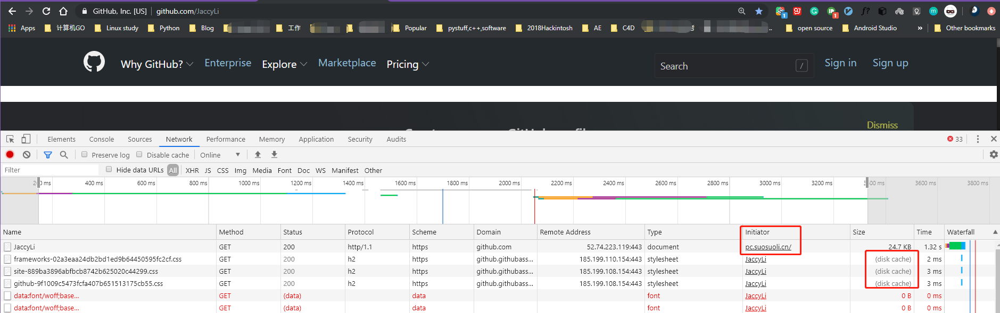

- 临时重定向

```bash
server {
    location / {
        root /apps/nginx/html/suosuoli;
        index index.html;
        rewrite / https://github.com/JaccyLi redirect;
    }
}
```

访问`http://pc.suosuoli.cn`临时重定向到`https://www.github.com/JaccyLi`，此时
不使用磁盘缓存。
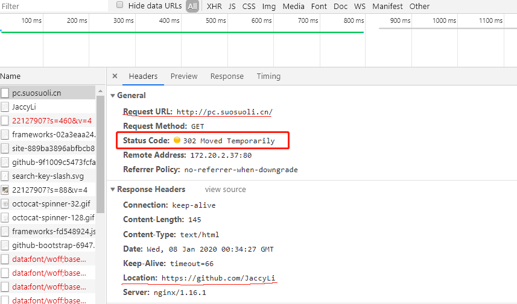

## 2.3 案例-break 和 last 标记

### 2.3.1 break 标识

```bash
[root@node1 html]# mkdir break_demo jump_here jump_there  -pv
mkdir: created directory ‘break_demo’
mkdir: created directory ‘jump_here’
mkdir: created directory ‘jump_there’

[root@node1 html]# echo "break_demo" > break_demo/index.html
[root@node1 html]# echo "jump_here" > jump_here/index.html
[root@node1 html]# echo "jump_there" > jump_there/index.html

[root@node1 html]# tree j* b*
jump_here
└── index.html
jump_there
└── index.html
break_demo
└── index.html

[root@node1 conf]# vim nginx.conf
......
location /break_demo {
 35
 36     root /var/www/html;
 37     index index.html;
 38
 39     rewrite ^/break_demo/(.*) /jump_here/$1 break; # 此处匹配后就不再向下匹配，也不会搜索其它的location块，直接给客户端返回结果。
 40
 41     rewrite ^/jump_here/(.*) /jump_there/$1 break;
 42
 43
 44
 45     }
 ......
```

访问`http://pc.suosuoli.cn/break_demo`只跳转到`/var/www/html/jump_here/index.html`


在使用重写功能时， `break`标记适用于不改变客户端的访问方式，但是服务端的资源
结构发生改变的情况。比如两个版本的网站应用 app-V1 和 app-V2 的前端页面并存，旧版
app-V1 的静态数据以前放于文件夹`/statics`，新版本的静态资源路径放于`/static`
此时就要将访问新版时的请求重写。

```bash
server {
    location {
        root /var/www/html;
        index index.html;
        rewrite ^/statics/(.*) /static/$1 break;
    }
}
```

### 2.3.2 last 标识

- last 标识用于服务端多次重写资源路径的场景，不多用。

```bash
[root@node1 html]# mkdir last
[root@node1 html]# echo "jump to last" > last/index.html

[root@node1 html]# tree j* b* l*
jump_here
└── index.html
jump_there
└── index.html
break_demo
└── index.html
last
└── index.html

[root@node1 conf]# vim nginx.conf
server {

location /break_demo {

    root /var/www/html;
    index index.html;
    rewrite ^/break_demo/(.*) /jump_here/$1 last;
    }

    location /jump_here {
    default_type text/html;
    rewrite ^/jump_here/(.*) /jump_there/$1 last;
    #echo "You are gonna not see this.";
    #root /var/www/html;
    #index index.html;
    }

    location /jump_there {
    rewrite ^/jump_there/(.*) /last/$1 last;
    root /var/www/html;
    index index.html;
    }
}
```

访问`http://pc.suosuoli.cn/break_demo`，最终被重写到`/last`
跳转过程`/break_demo --> /jump_here --> jump_there --> /last`


## 2.4 案例-自动跳转 http--https

在实际应用中，公司一般要求全站实现加密，在此时就需要将 http 跳转到 https 并且
不影响客户的正常访问。

```bash
[root@node1 conf]# vim nginx.conf
http {
    include       mime.types;
    default_type  application/octet-stream;

    # pc virtual host #
    server {

    server_name pc.suosuoli.cn;
    listen              80;
    listen              443 ssl;
    ssl_certificate     /apps/nginx/certs/www.suosuoli.cn.crt;
    ssl_certificate_key /apps/nginx/certs/www.suosuoli.cn.key;
    ssl_session_cache   shared:sslcache:20m;
    ssl_session_timeout 10m;

    location / {
    root /apps/nginx/html/suosuoli;
    index index.html;
    if ( $scheme = http ) {    ## 如果该处不加if判断，则会陷入循环匹配，还好会被限制在10次内
        rewrite / https://pc.suosuoli.cn permanent;
        }

    }
  }
}
```

访问`http://pc.suosuoli.cn`，跳转到`https://pc.suosuoli.cn`
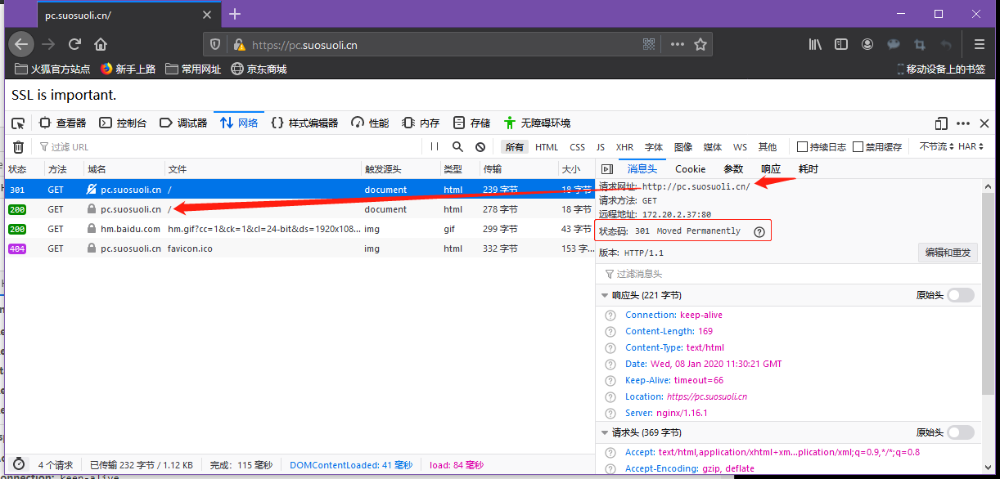

重写时不加 if 条件则会陷入循环重写，现象如下：
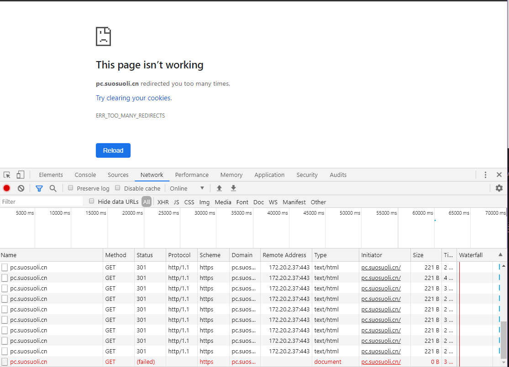

## 2.5 案例-判断文件是否存在

文件不存在时不显示`无法找到请求的文件`类似字样，而是将其重定向到主页。

```bash
location / {
    root /apps/nginx/html/suosuoli;
    index index.html;
    if ( $scheme = http ) {
        rewrite / https://pc.suosuoli.cn permanent;
        }

    if ( !-f $request_filename ) {
    rewrite (.*) http://pc.suosuoli.cn/index.html;
    }

    }
```

访问`http://pc.suosuoli.cn/not_exist_file`
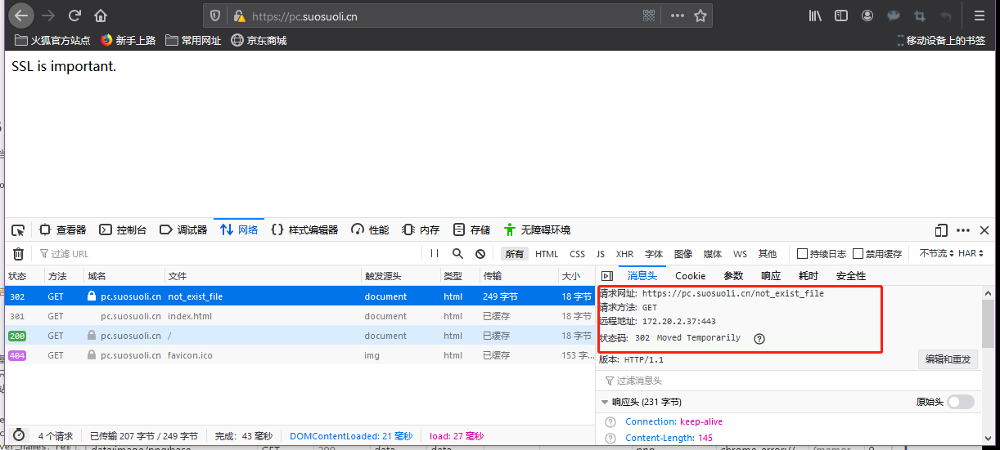

# 三. Nginx 防止盗链

防盗链基于客户端携带的 referer 实现，referer 是记录一个页面跳转到另一个页面
的标记信息，如果别人只链接了自己网站图片或某个单独的资源，而不是打开了网站的
整个页面，这就是盗链。referer 保存了盗链的网站域名，正常的 referer 信息有以
下几种：

```bash
none：请求报文首部没有referer首部，比如用户直接在浏览器输入域名访问web网站，就没有referer信息。
blocked：请求报文有referer首部，但无有效值，比如为空。
server_names：referer首部中包含本主机名及即nginx 监听的server_name。
arbitrary_string：自定义指定字符串，但可使用*作通配符。
regular expression：被指定的正则表达式模式匹配到的字符串,要使用~开头，例如： ~.*\.suosuoli\.cn。
```

## 3.1 盗链实现

在一个 web 站点盗链另一个站点的资源信息，比如图片、视频等。

```bash
[root@node1 conf.d]# pwd
/apps/nginx/conf/conf.d
[root@node1 conf.d]# cat  mageedu.net.conf
server {
  listen 80;
  server_name  pc.suosuoli.cn;

  location / {
    index index.html;
    root "/data/nginx/html/suosuoli";
    access_log /apps/nginx/logs/suosuoli.log access_json;
  }
}

# 准备盗链web页面
[root@node1 conf.d]# mkdir /data/nginx/html/suosuoli
[root@node1 conf.d]# cat /data/nginx/html/suosuoli/index.html
<!DOCTYPE html>
<html lang="en">
<head>
    <meta charset="UTF-8">
    <title>盗链页面</title>
</head>
<body>
<a href="http://pc.suosuoli.cn">测试盗链</a>

</body>
</html>
```

## 3.2 防盗链实现

基于访问安全考虑，nginx 支持通过[ungx_http_referer_module 模块](https://nginx.org/en/docs/http/ngx_http_referer_module.html#valid_referers) 检查访问请求的 referer
信息是否有效实现防盗链功能，定义方式如下：

```bash
location ^~ /images {
    root /data/nginx;
    index index.html;
    valid_referers none blocked server_names  *.suosuoli.cn  www.suosuoli.*  api.online.test/v1/hostlist   ~\.google\.  ~\.baidu\.;  # 定义有效的referer
    if ($invalid_referer) {  # 假如是使用其他的无效的referer访问：
      return 403; # 返回状态码403
    }
  }
```
