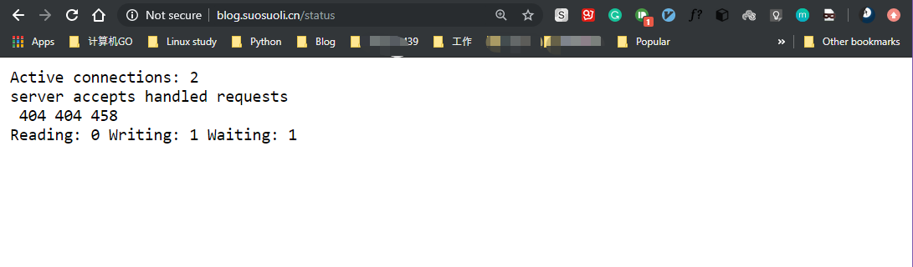
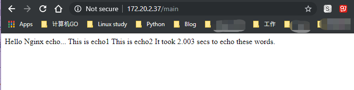
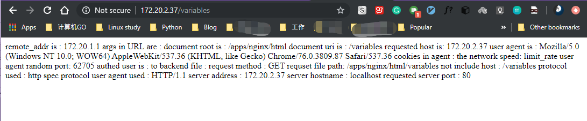
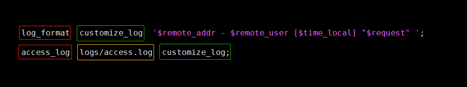
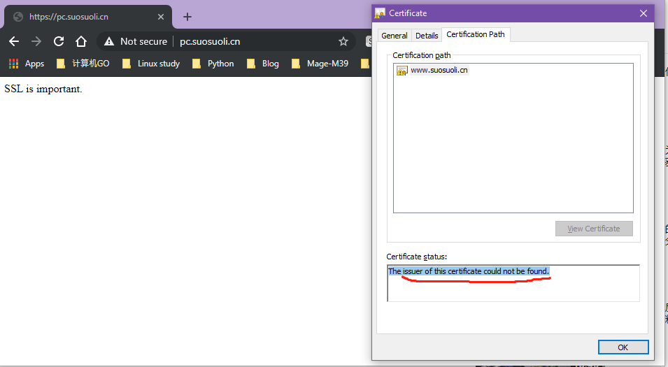
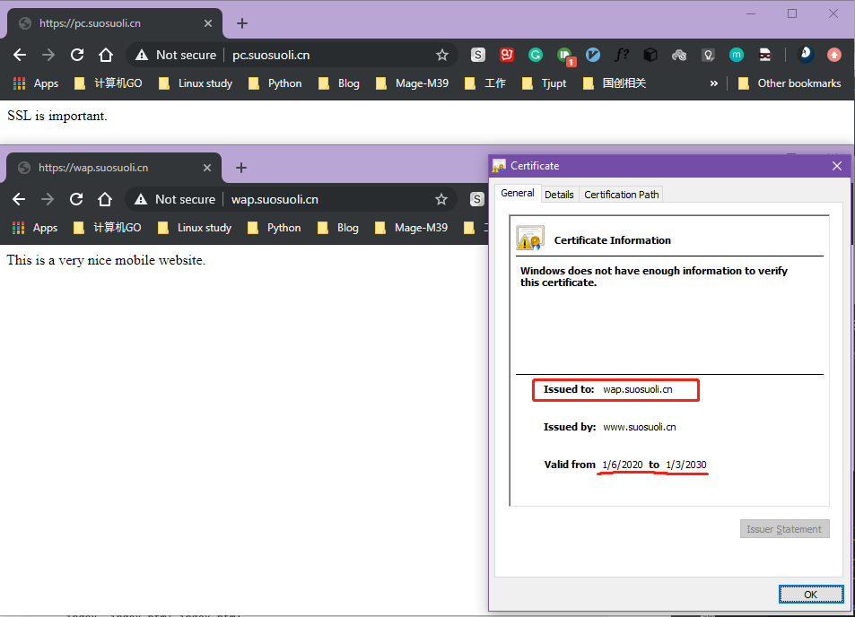

Nginx 高级配置

# 一.状态页

Nginx 状态页类似于 apache 和 php 使用的状态页面，基于`ngx_http_auth_basic_module`
实现，在编译安装 nginx 的时候需要添加编译参数`--with-http_stub_status_module`，
否则配置完成之后监测会是提⽰语法错误。

```bash
server {
        server_name blog.suosuoli.cn;
        keepalive_requests 5;
        keepalive_timeout 65 66;

        location /status {
                stub_status;
                allow 172.20.1.1;
                allow 127.0.0.1;
                deny all;
        }
```

访问`http://blog.suosuoli.cn/status`


说明

```bash
# 对齐一下是下面的样子
Active connections: 2
server accepts handled requests
       404     404     458
Reading: 0 Writing: 1 Waiting: 1

ctive connections： 当前处于活动状态的客⼾端连接数，包括连接等待空闲连接数。
accepts：统计总值，Nginx⾃启动后已经接受的客⼾端请求的总数。
handled：统计总值，Nginx⾃启动后已经处理完成的客⼾端请求的总数，通常等于accepts，除⾮有因
worker_connections的值限制等被拒绝的连接。
requests：统计总值，Nginx⾃启动后客⼾端发来的总的请求数。
Reading：当前状态，正在读取客⼾端请求报⽂⾸部的连接的连接数。
Writing：当前状态，正在向客⼾端发送响应报⽂过程中的连接数。
Waiting：当前状态，正在等待客⼾端发出请求的空闲连接数，开启 keep-alive的情况下,这个值
Waiting = Active connections – (Reading+Writing). 此处 1=2-1
```

# 二.第三方模块使用

Nginx 支持扩展第三方模块，第三⽅模块需要在编译安装 Nginx 的时候使⽤
参数`--add-module=PATH`指定路径添加，`PATH`是第三方模块的源码路径。
有的模块是由公司的开发⼈员针对业务需求定制开发的，有的模块是开源爱好者
开发好之后上传到 github 进⾏开源的模块，nginx ⽀持第三⽅模块需要从源码
重新编译⽀持，⽐如开源的 echo 模块。
[echo-github](https://github.com/openresty/echo-nginx-module)

```bash
[root@node1 data]# cd /usr/local/src
[root@node1 src]# git clone https://github.com/openresty/echo-nginx-module.git
Cloning into 'echo-nginx-module'...
remote: Enumerating objects: 18, done.
remote: Counting objects: 100% (18/18), done.
remote: Compressing objects: 100% (13/13), done.
remote: Total 3015 (delta 8), reused 11 (delta 5), pack-reused 2997
Receiving objects: 100% (3015/3015), 1.15 MiB | 16.00 KiB/s, done.
Resolving deltas: 100% (1619/1619), done.

[root@node1 src]# vim /apps/nginx/conf/nginx.conf
server {
     server {
        listen       80;
        server_name  localhost;

        location / {
            root   html;
            index  index.html index.htm;
        }

        location /status {
        stub_status;
        allow 172.20.1.1;
        allow 127.0.0.1;
        deny all;
        }

        location /echo1 {
                echo _sleep 1;
                echo This is echo1!!;
        }

        location /echo2 {
                echo _sleep 1;
                echo This is echo2!!;
        }
}

[root@node1 src]# nginx -s stop
# 五echo模块，报错，无法关闭nginx
nginx: [emerg] unknown directive "echo" in /etc/nginx/conf.d/blog.conf:31

# 注释掉echo配置
[root@node1 src]# nginx -s stop

[root@node1 src]# ll echo-nginx-module/
total 104
drwxr-xr-x 6 root root  4096 Jan  5 16:01 ./
drwxr-xr-x 3 root root  4096 Jan  5 16:00 ../
-rw-r--r-- 1 root root  3184 Jan  5 16:01 config
drwxr-xr-x 8 root root  4096 Jan  5 16:01 .git/
-rw-r--r-- 1 root root    27 Jan  5 16:01 .gitattributes
-rw-r--r-- 1 root root   618 Jan  5 16:01 .gitignore
-rw-r--r-- 1 root root  1345 Jan  5 16:01 LICENSE
-rw-r--r-- 1 root root 54503 Jan  5 16:01 README.markdown
drwxr-xr-x 2 root root  4096 Jan  5 16:01 src/
drwxr-xr-x 2 root root  4096 Jan  5 16:01 t/
-rw-r--r-- 1 root root  2216 Jan  5 16:01 .travis.yml
drwxr-xr-x 2 root root  4096 Jan  5 16:01 util/
-rw-r--r-- 1 root root   986 Jan  5 16:01 valgrind.suppress

# 编译安装
[root@node1 src]# cd nginx-1.16.1
[root@node1 nginx-1.16.1]# cd nginx-1.16.1
./configure  \
--prefix=/apps/nginx \
--user=nginx --group=nginx \
--with-http_ssl_module \
--with-http_v2_module \
--with-http_realip_module \
--with-http_stub_status_module \
--with-http_gzip_static_module \
--with-pcre \
--with-stream \
--with-stream_ssl_module \
--with-stream_realip_module \
--with-http_perl_module \
--add-module=/usr/local/src/echo-nginx-module  # 指定第三方模块的源码路径

[root@node1 nginx-1.16.1]# make -f 4 && make install

[root@node1 src]# /apps/nginx/sbin/nginx -t
nginx: the configuration file /apps/nginx/conf/nginx.conf syntax is ok
nginx: configuration file /apps/nginx/conf/nginx.conf test is successful

[root@node1 nginx-1.16.1]# vim /apps/nginx/conf/nginx.conf
server {
listen 80;
server_name localhost;

        location / {
            root   html;
            index  index.html index.htm;
        }

        location /status {
        stub_status;
        allow 172.20.1.1;
        allow 127.0.0.1;
        deny all;
        }

        location /main {
                index index.html;
                default_type text/html;
                echo "Hello Nginx echo...";
                echo_reset_timer;
                echo_location /echo1;
                echo_location /echo2;
                echo "It took $echo_timer_elapsed secs to echo these words.";
        }


        location /echo1 {
                echo_sleep 1;
                echo This is echo1;
        }

        location /echo2 {
                echo_sleep 1;
                echo This is echo2;
        }
}

root@ubuntu-suosuoli-node1:/etc/nginx/conf.d# curl 172.20.2.37/echo1
This is echo1
root@ubuntu-suosuoli-node1:/etc/nginx/conf.d# curl 172.20.2.37/echo2
This is echo2

root@ubuntu-suosuoli-node1:/etc/nginx/conf.d# curl 172.20.2.37/main
Hello Nginx echo...
This is echo1
This is echo2
It took 2.002 secs to echo these words.`
```

访问`http://172.20.2.37/main`


# 三.Nginx 变量

nginx 的变量可以在配置⽂件中引⽤，作为功能判断或者⽇志等场景使⽤，变量可以分为
内置变量和⾃定义变量，内置变量是由 nginx 模块⾃带，通过变量可以获取到众多的与
客⼾端访问相关的值。

| 变量                | 含义                                                                                                                                                     |
| ------------------- | :------------------------------------------------------------------------------------------------------------------------------------------------------- |
| \$remote_addr;      | 存放了客⼾端的地址，注意是客⼾端的公⽹ IP，也就是⼀家⼈访问⼀个⽹站，则会显⽰为路由器的公⽹ IP。                                                         |
| \$args              | 变量中存放了 URL 中的指令，例如http://blog.suosuoli.cn/main/index.do?id=20190221&partner=search 中的 id=20190221&partner=search                          |
| \$document_root     | 保存了针对当前资源的请求的系统根⽬录，如/apps/nginx/html。                                                                                               |
| \$document_uri      | 保存了当前请求中不包含指令的 URI，注意是不包含请求的指令，⽐如http://blog.suosuoli.cn/main/index.do? id=20190221&partner=search 会被定义为/main/index.do |
| \$host              | 存放了请求的 host 名称。                                                                                                                                 |
| \$http_user_agent   | 客⼾端浏览器的详细信息                                                                                                                                   |
| \$http_cookie       | 客⼾端的 cookie 信息。                                                                                                                                   |
| limit_rate 10240;   | echo \$limit_rate; 如果 nginx 服务器使⽤ limit_rate 配置了显⽰⽹络速率，则会显⽰，如果没有设置， 则显⽰ 0。                                              |
| \$remote_port       | 客⼾端请求 Nginx 服务器时随机打开的端⼝，这是每个客⼾端⾃⼰的端⼝。                                                                                      |
| \$remote_user       | 已经经过 Auth Basic Module 验证的⽤⼾名。                                                                                                                |
| \$request_body_file | 做反向代理时发给后端服务器的本地资源的名称。                                                                                                             |
| \$request_method    | 请求资源的⽅式，GET/PUT/DELETE 等                                                                                                                        |
| \$request_filename  | 当前请求的资源⽂件的路径名称，由 root 或 alias 指令与 URI 请求⽣成的⽂件绝对路径， 如/apps/nginx/html/main/index.html                                    |
| \$request_uri       | 包含请求参数的原始 URI，不包含主机名，如：/main/index.do?id=20190221&partner=search。                                                                    |
| \$scheme            | 请求的协议，如 ftp，https，http 等。                                                                                                                     |
| \$server_protocol   | 保存了客⼾端请求资源使⽤的协议的版本，如 HTTP/1.0，HTTP/1.1，HTTP/2.0 等。                                                                               |
| \$server_addr       | 保存了服务器的 IP 地址。                                                                                                                                 |
| \$server_name       | 请求的服务器的主机名。                                                                                                                                   |
| \$server_port       | 请求的服务器的端⼝号。                                                                                                                                   |

例子：

```bash
[root@node1 nginx-1.16.1]# vim /apps/nginx/conf/nginx.conf
server {
        listen       80;
        server_name  localhost;

        location / {
            root   html;
            index  index.html index.htm;
        }

        location /status {
        stub_status;
        allow 172.20.1.1;
        allow 127.0.0.1;
        deny all;
        }
location /variables {
                index index.html;
                default_type text/html;

                echo "remote_addr is   : $remote_addr";
                echo "args in URL are  : $args";
                echo "document root is : $document_root";
                echo "document uri is  : $document_uri";
                echo "requested host is: $host";
                echo "user agent is    : $http_user_agent";
                echo "cookies in agent : $http_cookie";
                echo "the network speed: limit_rate";
                echo "user agent random port: $remote_port";
                echo "authed user is   : $remote_user";
                echo "to backend file  : $request_body_file";
                echo "request method   : $request_method";
                echo "requset file path: $request_filename"; # 如/apps/nginx/html/main/index.html
                echo "not include host : $request_uri";
                echo "protocol used    : $scheme";
                echo "spec protocol user agent used : $server_protocol";
                echo "server address   : $server_addr";
                echo "server hostname  : $server_name";
                echo "requested server port : $server_port";

        }
}

# 使用curl测试
root@ubuntu-suosuoli-node1:/etc/nginx/conf.d# curl 172.20.2.37/variables
remote_addr is   : 172.20.2.189
args in URL are  :
document root is : /apps/nginx/html
document uri is  : /variables
requested host is: 172.20.2.37
user agent is    : curl/7.58.0
cookies in agent :
the network speed: limit_rate
user agent random port: 60513
authed user is   :
to backend file  :
request method   : GET
requset file path: /apps/nginx/html/variables
not include host : /variables
protocol used    : http
spec protocol user agent used : HTTP/1.1
server address   : 172.20.2.37
server hostname  : localhost
requested server port : 80
```

访问`http://172.20.2.37/variables`


## 自定义变量

Nginx 的变量支持自定义变量。假如需要⾃定义变量名称和值，使⽤指令
`set \$variable value;`。具体⽅法如下：

```bash
Syntax: set $variable value; Default: — Context: server, location, if

set $name magedu;
echo $name;
set $my_port $server_port;
echo $my_port;
echo "$server_name:$server_port";
```

示例：

```bash
[root@node1 nginx-1.16.1]# vim /apps/nginx/conf/nginx.conf
 server {
        listen       80;
        server_name  localhost;

        location / {
            root   html;
            index  index.html index.htm;
        }

        location /status {
        stub_status;
        allow 172.20.1.1;
        allow 127.0.0.1;
        deny all;
        }


        location /my_info {
                index index.html;
                default_type text/html;
                set $my_name suosuoli;
                echo "My name is : $my_name";
                set $my_profession DevOps;
                echo "My profession is : $my_profession";
                set $my_hobbies Linux;
                echo "My hobbies are : $my_hobbies";
                set $my_host $server_addr;
                echo "I'm admin $my_host just for now.";
        }
 }

# curl 测试
root@ubuntu-suosuoli-node1:/etc/nginx/conf.d# curl 172.20.2.37/my_info
My name is : suosuoli
My profession is : DevOps
My hobbies are : Linux
I'm admin 172.20.2.37 just for now.
```

访问`http://172.20.2.37/my_info`


# 四.自定义访问日志

## 4.1 自定义日志

`access_log`访问⽇志用来记录客⼾端的具体请求内容信息;`error_log`错误日
志用在全局配置(http{...})块中指定服务器运行时的日志和记录的错误级别。

Nginx 的错误⽇志⼀般只有⼀个，但是访问⽇志可以在不同 server 中定义多个，
定义⼀个⽇志需要使⽤ access_log 指定⽇志的保存路径，使⽤ log_format 指
定⽇志的格式，格式中定义要保存的具体⽇志内容。

```bash
[root@node1 nginx-1.16.1]# vim /apps/nginx/conf/nginx.conf
http {
    include       mime.types;
    default_type  application/octet-stream;
    #log_format  main  '$remote_addr - $remote_user [$time_local] "$request" '
    #                  '$status $body_bytes_sent "$http_referer" '
    #                  '"$http_user_agent" "$http_x_forwarded_for"';
    #access_log  logs/access.log  main;

    log_format  customize_log  '$remote_addr - $remote_user [$time_local] "$request" ';
    access_log  logs/access.log  customize_log;
    sendfile        on;
    tcp_nopush     on;
    keepalive_timeout  65 66;

    server {
        listen       80;
        server_name  localhost;

        location / {
            root   html;
            index  index.html index.htm;
        }
    }
}

# 访问验证
[root@node1 html]# tail /apps/nginx/logs/access.log
......
172.20.1.1 - - [05/Jan/2020:20:14:44 +0800] "GET /my_info HTTP/1.1"
172.20.1.1 - - [05/Jan/2020:20:14:45 +0800] "GET /my_info HTTP/1.1"
172.20.1.1 - - [05/Jan/2020:20:14:45 +0800] "GET /my_info HTTP/1.1"
172.20.2.189 - - [05/Jan/2020:20:14:55 +0800] "GET / HTTP/1.1"
172.20.2.189 - - [05/Jan/2020:20:15:00 +0800] "GET / HTTP/1.1"
```

自定义日志如下图: 使用红色的指令指明定义日志格式和存放路径，使用绿色的框
写明自定义日志名称，黄色代表日志文件存储路径。


## 4.2 自定义 json 格式日志

Nginx 的默认访问⽇志记录内容相对⽐较单⼀，默认的格式也不⽅便后期做⽇志统
计分析，⽣产环境中通常将 nginx ⽇志转换为 json ⽇志，然后配合使⽤ ELK 等
工具做⽇志收集-统计-分析。典型的配置如下：

```json
log_format access_json '{"@timestamp":"$time_iso8601",'
        '"host":"$server_addr",'
        '"clientip":"$remote_addr",'
        '"size":$body_bytes_sent,'
        '"responsetime":$request_time,'
        '"upstreamtime":"$upstream_response_time",'
        '"upstreamhost":"$upstream_addr",'
        '"http_host":"$host",'
        '"uri":"$uri",'
        '"domain":"$host",'
        '"xff":"$http_x_forwarded_for",'
        '"referer":"$http_referer",'
        '"tcp_xff":"$proxy_protocol_addr",'
        '"http_user_agent":"$http_user_agent",'
        '"status":"$status"}';
     access_log  /apps/nginx/logs/access_json.log  access_json;
```

```bash
[root@node1 nginx-1.16.1]# vim /apps/nginx/conf/nginx.conf
http {
    include       mime.types;
    default_type  application/octet-stream;
    #log_format  main  '$remote_addr - $remote_user [$time_local] "$request" '
    #                  '$status $body_bytes_sent "$http_referer" '
    #                  '"$http_user_agent" "$http_x_forwarded_for"';
    #access_log  logs/access.log  main;

    #log_format  customize_log  '$remote_addr - $remote_user [$time_local] "$request" ';
    #access_log  logs/access.log  customize_log;

    log_format  log_json  '{"@timestamp":"$time_iso8601",'
        '"host":"$server_addr",'
        '"clientip":"$remote_addr",'
        '"size":$body_bytes_sent,'
        '"responsetime":$request_time,'
        '"upstreamtime":"$upstream_response_time",'
        '"upstreamhost":"$upstream_addr",'
        '"http_host":"$host",'
        '"uri":"$uri",'
        '"domain":"$host",'
        '"xff":"$http_x_forwarded_for",'
        '"referer":"$http_referer",'
        '"tcp_xff":"$proxy_protocol_addr",'
        '"http_user_agent":"$http_user_agent",'
        '"status":"$status"}';
    access_log  /apps/nginx/logs/access_json_log  log_json;

    sendfile        on;
    tcp_nopush     on;
    keepalive_timeout  65 66;

    server {
        listen       80;
        server_name  localhost;

        location / {
            root   html;
            index  index.html index.htm;
        }
    }
}

# 访问测试
[root@node1 html]# tail /apps/nginx/logs/access_json_log -f
{"@timestamp":"2020-01-05T20:25:45+08:00","host":"172.20.2.37","clientip":"172.20.1.1","size":136,"responsetime":0.000,"upstreamtime":"-","upstreamhost":"-","http_host":"172.20.2.37","uri":"/my_info","domain":"172.20.2.37","xff":"-","referer":"-","tcp_xff":"","http_user_agent":"Mozilla/5.0 (Windows NT 10.0; WOW64) AppleWebKit/537.36 (KHTML, like Gecko) Chrome/76.0.3809.87 Safari/537.36","status":"200"}
{"@timestamp":"2020-01-05T20:25:49+08:00","host":"172.20.2.37","clientip":"172.20.1.1","size":136,"responsetime":0.000,"upstreamtime":"-","upstreamhost":"-","http_host":"172.20.2.37","uri":"/my_info","domain":"172.20.2.37","xff":"-","referer":"-","tcp_xff":"","http_user_agent":"Mozilla/5.0 (Windows NT 10.0; WOW64) AppleWebKit/537.36 (KHTML, like Gecko) Chrome/76.0.3809.87 Safari/537.36","status":"200"}
{"@timestamp":"2020-01-05T20:26:01+08:00","host":"172.20.2.37","clientip":"172.20.1.1","size":136,"responsetime":0.000,"upstreamtime":"-","upstreamhost":"-","http_host":"172.20.2.37","uri":"/my_info","domain":"172.20.2.37","xff":"-","referer":"-","tcp_xff":"","http_user_agent":"Mozilla/5.0 (Windows NT 10.0; WOW64) AppleWebKit/537.36 (KHTML, like Gecko) Chrome/76.0.3809.87 Safari/537.36","status":"200"}
{"@timestamp":"2020-01-05T20:26:07+08:00","host":"172.20.2.37","clientip":"172.20.2.189","size":612,"responsetime":0.000,"upstreamtime":"-","upstreamhost":"-","http_host":"172.20.2.37","uri":"/index.html","domain":"172.20.2.37","xff":"-","referer":"-","tcp_xff":"","http_user_agent":"curl/7.58.0","status":"200"}
{"@timestamp":"2020-01-05T20:26:13+08:00","host":"172.20.2.37","clientip":"172.20.2.189","size":612,"responsetime":0.000,"upstreamtime":"-","upstreamhost":"-","http_host":"172.20.2.37","uri":"/index.html","domain":"172.20.2.37","xff":"-","referer":"-","tcp_xff":"","http_user_agent":"curl/7.58.0","status":"200"}
{"@timestamp":"2020-01-05T20:26:13+08:00","host":"172.20.2.37","clientip":"172.20.2.189","size":612,"responsetime":0.000,"upstreamtime":"-","upstreamhost":"-","http_host":"172.20.2.37","uri":"/index.html","domain":"172.20.2.37","xff":"-","referer":"-","tcp_xff":"","http_user_agent":"curl/7.58.0","status":"200"}
{"@timestamp":"2020-01-05T20:26:38+08:00","host":"172.20.2.37","clientip":"172.20.1.1","size":555,"responsetime":0.000,"upstreamtime":"-","upstreamhost":"-","http_host":"172.20.2.37","uri":"/sdf","domain":"172.20.2.37","xff":"-","referer":"-","tcp_xff":"","http_user_agent":"Mozilla/5.0 (Windows NT 10.0; WOW64) AppleWebKit/537.36 (KHTML, like Gecko) Chrome/76.0.3809.87 Safari/537.36","status":"404"}
{"@timestamp":"2020-01-05T20:26:47+08:00","host":"172.20.2.37","clientip":"172.20.1.1","size":555,"responsetime":0.000,"upstreamtime":"-","upstreamhost":"-","http_host":"172.20.2.37","uri":"/devops.png","domain":"172.20.2.37","xff":"-","referer":"-","tcp_xff":"","http_user_agent":"Mozilla/5.0 (Windows NT 10.0; WOW64) AppleWebKit/537.36 (KHTML, like Gecko) Chrome/76.0.3809.87 Safari/537.36","status":"404"}
```

## 4.3 使用 Python 统计 json 格式日志

- 简单的处理程序

```py
#! /usr/bin/env python
#coding:utf-8
status_200 = []
status_404 = []
with open("access_json_log") as log_data:
    for line in log_data.readlines():
        line = eval(line)
        if line.get("status") == "200":
            status_200.append(line.get)
        elif line.get("status") == "404":
            status_404.append(line.get)
        else:
            print("status ERROR")
log_data.close()

print(f'There are {len(status_200)} requests succeeded.')
print(f'There are {len(status_404)} requests for something not find.')
```

- 将日志文件和 python 处理程序放`/data`目录下测试

```bash
[root@node1 data]# ll
-rw-r--r-- 1 root  root     2968 Jan  5 20:36 access_json_log
-rw-r--r-- 1 root  root      624 Jan  5 20:37 log_analyses.py

[root@node1 data]# python3 log_analyses.py
There are 6 requests succeeded.
There are 2 requests for something not find.
```

# 五.https 配置

Web ⽹站的登录⻚⾯都是使⽤ https 加密传输的，加密数据以保障数据的安全，
HTTPS 能够加密信息，以免敏感信息被第三⽅获取，所以很多银⾏⽹站或电⼦邮
箱等等安全级别较⾼的服务都会采⽤ HTTPS 协议，HTTPS 其实是有两部分组成：
HTTP + SSL / TLS，也就是在 HTTP 上⼜加了⼀层处理加密信息的模块。服务
端和客⼾端的信息传输都会通过 TLS 进⾏加密，所以传输的数据都是加密后的
数据。

HTTPS 协议加密原理如下图：


https 实现过程如下:

```bash
1.客⼾端发起HTTPS请求：
客⼾端访问某个web端的地址，⼀般都是URL+443端⼝。例如：https://www.suosuoli.cn:443
由于https默认端口是443，所以直接访问:https://wwww.suosuoli.cn就可以。

2.服务端的配置：
采⽤https协议的服务器必须要有⼀套证书，可以通过⼀些组织申请，也可以⾃⼰制作，
向证书颁发机构申请的证书需要交费用，这种证书是受信任的证书，可以用来实现
https。自己给自己颁发的证书不受信任，但是可以在局域网或者公司内部使用，只要
公司内部的电脑都被配置为信任该证书。

3.传送证书：
服务端给客⼾端传递证书，其实就是公钥，⾥⾯包含了很多信息，例如证书的颁发机构、
证书的过期时间等等。

4.客⼾端解析证书：
这部分⼯作是有客⼾端完成的，⾸先会验证公钥的有效性，⽐如颁发机构、过期时间等，
如果发现异常则会弹出⼀个警告框提⽰证书可能存在问题，如果服务器返回的公钥没有
问题就⽣成⼀个随机值，然后⽤公钥对该随机值进⾏加密，由于服务器的公钥加密的内
容只能使用服务器的私钥解密，所以在此时传输过程中就算有中间人截获该信息，其
也无能为力。

5.传送4步骤的加密数据：
就是将⽤证书加密后的随机值传递给服务器，⽬的就是为了让服务器得到这个随机值，以
后客⼾端和服务端的通信就可以通过这个随机值进⾏加密解密了。

6.服务端解密信息：
服务端⽤私钥解密5步骤加密后的随机值之后，得到了客⼾端传过来的随机值(私钥)，然后
把内容通过该值进⾏对称加密，对称加密就是将信息和私钥通过算法混合在⼀起，这样除⾮
你知道私钥，不然是⽆法获取其内部的内容，⽽正好客⼾端和服务端都知道这个私钥，所以
只要机密算法够复杂就可以保证数据的安全性。

7.传输加密后的信息:
服务端将⽤私钥加密后的数据传递给客⼾端，在客⼾端可以被还原出原数据内容。

8.客⼾端解密信息：
客⼾端⽤之前⽣成的私钥获解密服务端传递过来的数据，由于数据⼀直是加密的，因此即使
第三⽅获取到数据也⽆法知道其详细内容。
```

## 5.1 SSL 配置项

nginx 的 https 功能基于模块 `ngx_http_ssl_module` 实现，因此如果是编译安装的
nginx 要使⽤参数 `--with-http_ssl_module` 开启 ssl 功能，但是作为 nginx 的核
⼼功能，yum 安装的 nginx 默认就是开启的。
[ngx_http_ssl_modeule 官⽅⽂档](https://nginx.org/en/docs/http/ngx_http_ssl_module.html)

配置参数如下：

```bash
ssl on | off;
# 为指定的虚拟主机配置是否启⽤ssl功能，此功能在1.15.0废弃，使⽤listen [ssl]替代。

ssl_certificate /path/to/file;
# 当前虚拟主机使⽤使⽤的公钥⽂件，⼀般是crt⽂件

ssl_certificate_key /path/to/file;
# 当前虚拟主机使⽤的私钥⽂件，⼀般是key⽂件

ssl_protocols [SSLv2] [SSLv3] [TLSv1] [TLSv1.1] [TLSv1.2];
# ⽀持ssl协议版本，早期为ssl,现在是TSL，默认为后三个

ssl_session_cache off | none | [builtin[:size]] [shared:name:size];
# 配置ssl缓存
    off:   关闭缓存
    none:  通知客⼾端⽀持ssl session cache，但实际不⽀持
    builtin[:size]: 使⽤OpenSSL内建缓存，为每worker进程私有
    [shared:name:size]: # 在各worker之间使⽤⼀个共享的缓存，需要定义⼀个缓存名称和缓存空间⼤⼩，
                        # 1MB 可以存储4000个会话信息，多个虚拟主机可以使⽤相同的缓存名称。

ssl_session_timeout time; # 客⼾端连接可以复⽤ssl session cache中缓存的有效时⻓，默认5m
```

## 5.1 使用自签名证书

```bash
# 创建一个目录保存证书文件
[root@node1 nginx]# mkdir certs
[root@node1 nginx]# ll certs/
total 0
[root@node1 nginx]# cd certs/

# 生成自签名证书
[root@node1 certs]# openssl req -newkey rsa:4096 -nodes -sha256 -keyout ca.key -x509 -days 3650 -out ca.crt
Generating a 4096 bit RSA private key
...++
................................++
writing new private key to 'ca.key'
-----
You are about to be asked to enter information that will be incorporated
into your certificate request.
What you are about to enter is what is called a Distinguished Name or a DN.
There are quite a few fields but you can leave some blank
For some fields there will be a default value,
If you enter '.', the field will be left blank.
-----
Country Name (2 letter code) [XX]:CN
State or Province Name (full name) []:BeiJing
Locality Name (eg, city) [Default City]:BeiJing
Organization Name (eg, company) [Default Company Ltd]:HW
Organizational Unit Name (eg, section) []:DevOps
Common Name (eg, your name or your server\'s hostname) []:www.suosuoli.cn
Email Address []:stevenux@gmail.com
[root@node1 certs]# ll
total 8
-rw-r--r-- 1 root root 2114 Jan  6 20:11 ca.cert
-rw-r--r-- 1 root root 3268 Jan  6 20:11 ca.key

# 生成私钥和证书申请请求文件
[root@node1 certs]# openssl req -newkey rsa:4096 -nodes -sha256 -keyout www.suosuoli.cn.key -out www.suosuoli.cn.csr
Generating a 4096 bit RSA private key
.....................................................................................................................................++
..........................................................................................................................................................................................++
writing new private key to 'www.suosuoli.cn.key'
-----
You are about to be asked to enter information that will be incorporated
into your certificate request.
What you are about to enter is what is called a Distinguished Name or a DN.
There are quite a few fields but you can leave some blank
For some fields there will be a default value,
If you enter '.', the field will be left blank.
-----
Country Name (2 letter code) [XX]:CN
State or Province Name (full name) []:BeiJing
Locality Name (eg, city) [Default City]:BeiJing
Organization Name (eg, company) [Default Company Ltd]:ByteDancer
Organizational Unit Name (eg, section) []:DevOps
Common Name (eg, your name or your server\'s hostname) []:www.suosuoli.cn
Email Address []:stevenux@gmail.com

Please enter the following 'extra' attributes
to be sent with your certificate request
A challenge password []:
An optional company name []:
[root@node1 certs]# ll
total 16
-rw-r--r-- 1 root root 2114 Jan  6 20:11 ca.crt
-rw-r--r-- 1 root root 3268 Jan  6 20:11 ca.key
-rw-r--r-- 1 root root 1760 Jan  6 20:13 www.suosuoli.cn.csr
-rw-r--r-- 1 root root 3272 Jan  6 20:13 www.suosuoli.cn.key

# 给自己签发证书
[root@node1 certs]# openssl x509 -req -days 3650 -in www.suosuoli.cn.csr -CA ca.crt -CAkey ca.key -CAcreateserial -out www.suosuoli.cn.crt
Signature ok
subject=/C=CN/ST=BeiJing/L=BeiJing/O=ByteDancer/OU=DevOps/CN=www.suosuoli.cn/emailAddress=stevenux@gmail.com
Getting CA Private Key

# 查看签发的证书内容
[root@node1 certs]# openssl x509 -in www.suosuoli.cn.crt -noout -text
Certificate:
    Data:
        Version: 1 (0x0)
        Serial Number:
            b4:3e:df:28:b3:5f:62:5a
    Signature Algorithm: sha256WithRSAEncryption
        Issuer: C=CN, ST=BeiJing, L=BeiJing, O=HW, OU=DevOps, CN=www.suosuoli.cn/emailAddress=stevenux@gmail.com
        Validity
            Not Before: Jan  6 12:17:41 2020 GMT
            Not After : Jan  3 12:17:41 2030 GMT
        Subject: C=CN, ST=BeiJing, L=BeiJing, O=ByteDancer, OU=DevOps, CN=www.suosuoli.cn/emailAddress=stevenux@gmail.com
        Subject Public Key Info:
            Public Key Algorithm: rsaEncryption
                Public-Key: (4096 bit)
                Modulus:
                    00:bd:12:fc:61:8f:23:b6:79:06:ce:c1:5c:32:23:
                    36:b2:6c:c6:89:f1:e4:6f:d0:85:0d:c1:c5:20:01:
                    f2:07:9a:f0:28:c9:9e:6a:75:c4:69:40:e5:eb:09:
                    28:58:bb:81:6a:f6:6c:b6:46:1c:ff:92:03:7e:c8:
                    55:46:3a:8b:00:dd:4c:f7:f2:9c:86:15:e3:19:b2:
                    a8:85:69:c5:f1:cb:1e:b7:e5:24:e4:0e:32:55:33:
                    c3:4a:ee:56:a0:39:44:bc:b2:c7:33:8b:91:77:ac:
                    0b:8c:57:3b:92:db:ba:80:6b:b2:00:5a:99:99:42:
                    f1:d7:8e:08:84:5d:6b:66:12:a3:ef:b5:75:77:04:
                    64:46:1c:9a:eb:bd:01:97:ba:6a:24:83:33:78:52:
                    41:d3:51:ff:42:0f:83:b8:15:0e:82:95:5c:93:f1:
                    54:48:0d:68:bc:a5:80:f2:9f:a2:0b:17:cf:c6:7e:
                    40:8d:05:8b:7d:c5:8f:15:77:67:34:d5:6c:db:3c:
                    49:e7:84:21:29:71:65:99:ab:e3:3c:cc:12:0b:da:
                    2f:a7:1e:5a:30:ef:b4:98:62:4f:9f:28:5c:c7:6c:
                    ed:58:2f:63:dc:14:23:26:72:84:41:03:0f:d0:0a:
                    7b:6c:9d:44:d3:a9:93:a4:4e:03:b4:33:e0:8e:d3:
                    3e:d5:78:0a:ff:b4:82:e2:6d:a6:46:0a:6f:ce:34:
                    41:80:1a:61:94:ac:ab:84:e6:f4:5f:fa:74:02:9b:
                    9e:cf:fd:11:a6:f9:59:a7:f0:f1:2f:5e:bf:87:e8:
                    f8:9e:e2:84:ab:31:7d:c8:36:71:82:45:1b:61:94:
                    13:0f:fa:b7:bf:a2:50:08:3a:08:e8:cf:a2:33:ec:
                    c4:13:a0:8f:05:ce:38:51:f6:ba:d8:cf:62:2b:28:
                    0a:e9:8a:c4:e1:69:c3:86:b2:8e:6f:de:d1:3b:70:
                    69:f7:29:24:63:c4:1f:15:63:67:35:89:c3:b4:f8:
                    1d:65:26:53:df:6e:63:03:be:fe:e5:d5:61:ef:5f:
                    61:b9:f2:63:1b:f8:41:2d:da:59:4f:79:00:9f:da:
                    4d:fe:74:73:c4:5d:3a:0e:f9:1d:22:29:bc:07:5b:
                    e9:1d:2b:0b:4a:18:aa:13:ce:36:52:cd:7e:eb:2f:
                    40:f9:30:38:9b:72:91:0b:ca:98:ab:c0:df:7d:97:
                    e9:86:d7:0e:92:a0:81:1d:85:33:97:c6:0e:d2:19:
                    48:8b:15:d3:5a:e0:e6:44:5b:64:06:97:8e:e4:55:
                    f0:38:98:fb:30:7a:12:ab:70:b3:14:63:32:f5:c7:
                    56:f4:f5:47:a6:78:cc:17:22:dd:24:a7:1d:6d:ec:
                    ec:ba:0d
                Exponent: 65537 (0x10001)
    Signature Algorithm: sha256WithRSAEncryption
         8b:64:6e:66:19:4a:97:24:c3:fc:22:0d:00:7e:bf:fc:05:5a:
         08:63:90:77:6d:35:57:4b:96:ac:80:bb:b5:98:fe:56:82:6c:
         c5:48:51:1b:10:84:a7:ae:bc:a5:9c:c9:56:d8:6e:f3:27:a7:
         d2:93:4b:7f:18:9c:4d:88:b8:95:ee:67:c9:1b:af:5e:5e:5b:
         27:60:5e:28:71:60:25:06:92:1f:fd:92:63:88:61:11:a4:93:
         0b:11:17:e5:a7:e8:e2:68:05:d9:02:01:2c:91:72:30:33:c9:
         87:f0:ac:10:71:8e:de:1c:8b:b4:6b:0d:38:84:3f:47:d9:4a:
         5b:17:0f:e1:dc:2c:c4:b4:26:4d:c9:43:5a:25:c5:e8:2c:1d:
         73:eb:9e:9d:7c:87:20:4d:a5:38:2f:8d:dc:ab:5f:41:94:7d:
         01:64:50:02:b0:f5:73:b2:74:c3:29:ed:ad:7b:8d:b1:79:47:
         96:1d:19:66:74:48:4a:e4:d9:22:e8:8d:b1:91:0b:d8:ef:ef:
         77:ef:88:f7:b2:4b:82:0c:ed:bf:09:8b:98:79:85:3e:92:1a:
         8b:4c:c7:9d:1f:af:44:dd:fa:07:1a:bd:97:4a:53:58:97:cb:
         6a:a4:9b:c5:73:75:7e:5a:3d:7f:6d:e4:fe:1c:ef:9d:3d:09:
         16:5a:06:da:81:b0:f8:09:c8:d7:b1:84:c0:cf:e9:dc:87:fe:
         72:80:55:19:c3:26:9f:68:eb:9e:3e:fd:56:8e:ac:2e:f1:e8:
         20:fb:c6:c8:eb:8b:d1:d2:f7:0b:f5:b5:cf:ec:00:13:8c:3d:
         46:45:25:1d:7d:4c:92:3d:4e:25:bb:0a:cb:4c:64:ae:64:09:
         12:70:ef:bf:65:32:12:2c:3e:6e:7a:a5:24:4d:a4:2e:e9:d7:
         d1:46:fd:e5:23:e8:1b:72:97:7a:89:3d:3d:ef:d4:15:3d:2b:
         bb:6a:b7:1c:73:c2:ce:09:0b:11:fd:7c:20:9b:83:ef:7e:01:
         3c:a4:d7:0a:f4:cd:96:5b:4b:66:85:75:57:b3:c1:c2:47:ea:
         4d:aa:9a:08:16:c8:b8:68:ab:8d:5c:b3:d4:7e:87:27:e4:c8:
         86:7c:f6:b6:32:8b:9e:06:13:17:0b:25:82:15:de:53:4c:62:
         1b:6d:c9:b8:e9:12:cb:5b:66:f8:48:4d:af:30:d0:9f:22:5c:
         e8:47:80:1e:de:15:f9:55:17:db:e0:f8:60:75:ad:53:ff:6b:
         f3:72:f1:1a:11:67:4e:1f:ab:18:c1:b8:40:ca:20:47:97:ff:
         d7:43:9d:ac:1d:d8:d1:0f:79:b8:d9:36:ba:ca:4c:76:4a:da:
         99:24:2c:97:cd:7e:1a:55

# 通过查看该证书内容，可以看到Issuer(颁发者)和Subject(申请者)的信息几乎一样，
# 这就说明可该证书是自签名证书
```

## 5.2 Nginx ssl 证书示例

```bash
[root@node1 conf]# vim nginx.conf
http {
......
server {

    server_name pc.suosuoli.cn;
    listen              80;
    listen              443 ssl;
    ssl_certificate     /apps/nginx/certs/www.suosuoli.cn.crt;
    ssl_certificate_key /apps/nginx/certs/www.suosuoli.cn.key;
    ssl_session_cache   shared:sslcache:20m;
    ssl_session_timeout 10m;

    location / {
        root /apps/nginx/html/suosuoli;
        index index.html;
        }
    }
......
}
```

在 hosts 文件添加`172.20.2.37 pc.suosuoli.cn`
访问`https://pc.suosuoli.cn`，浏览器提示不安全，点击高级，继续访问该网站。

由上图可以看出，我的证书是不受浏览器信任的，是因为它找不到我的证书的颁发者。
而实际上这个证书是我自己颁发的，浏览器当然找不到。所以是不受信任的。事实上
受信任的证书都来自收信人的颁发机构，而几乎所有的操作系统都会提前把所有受
信任的颁发机构预置到系统中，下图就是 windows 预置的受信任的证书颁发机构，
包括顶级 CA、中级 CA 和一些第三方 CA。

`Ctrl+r ，输入certmgr.msc`就可以调出该窗口。

## 5.3 实现多域名 HTTPS

Nginx ⽀持基于单个 IP 实现多域名的功能，并且还⽀持单 IP 多域名的基础之上实现
HTTPS，其实是基于 Nginx 的 SNI(Server Name Indication)功能实现，SNI 是为了
解决⼀个 Nginx 服务器内使⽤⼀个 IP 绑定多个域名和证书的功能，其具体功能是客⼾
端在连接到服务器建⽴ SSL 链接之前先发送要访问站点的域名(Hostname)，这样服务
器再根据这个域名返回给客⼾端⼀个合适的证书。

```bash
# 生成私钥和证书申请文件
[root@node1 certs]# openssl req -newkey rsa:4096 -nodes -sha256 -keyout wap.suosuoli.cn.key -out www.suosuoli.cn.csr
Generating a 4096 bit RSA private key
................................................................................................................................................................................................................................................................................++
................++
writing new private key to 'wap.suosuoli.cn.key'
-----
You are about to be asked to enter information that will be incorporated
into your certificate request.
What you are about to enter is what is called a Distinguished Name or a DN.
There are quite a few fields but you can leave some blank
For some fields there will be a default value,
If you enter '.', the field will be left blank.
-----
Country Name (2 letter code) [XX]:CN
State or Province Name (full name) []:BeiJing
Locality Name (eg, city) [Default City]:BeiJing
Organization Name (eg, company) [Default Company Ltd]:Alabobo
Organizational Unit Name (eg, section) []:DevOps
Common Name (eg, your name or your server\'s hostname) []:wap.suosuoli.cn
Email Address []:stevenu@gmail.com

Please enter the following 'extra' attributes
to be sent with your certificate request
A challenge password []:
An optional company name []:
[root@node1 certs]# ll
total 28
-rw-r--r-- 1 root root 2114 Jan  6 20:11 ca.crt
-rw-r--r-- 1 root root 3268 Jan  6 20:11 ca.key
-rw-r--r-- 1 root root   17 Jan  6 20:17 ca.srl
-rw-r--r-- 1 root root 3268 Jan  6 20:54 wap.suosuoli.cn.key
-rw-r--r-- 1 root root 1752 Jan  6 20:54 wap.suosuoli.cn.csr
-rw-r--r-- 1 root root 2009 Jan  6 20:17 www.suosuoli.cn.crt
-rw-r--r-- 1 root root 3272 Jan  6 20:13 www.suosuoli.cn.key

# 签名证明
[root@node1 certs]# openssl x509 -req -days 3650 -in wap.suosuoli.cn.csr -CA ca.crt -CAkey ca.key -CAcreateserial -out wap.suosuoli.cn.crt
Signature ok
subject=/C=CN/ST=BeiJing/L=BeiJing/O=Alabobo/OU=DevOps/CN=wap.suosuoli.cn/emailAddress=stevenu@gmail.com
Getting CA Private Key
[root@node1 certs]# ll
total 32
-rw-r--r-- 1 root root 2114 Jan  6 20:11 ca.cert
-rw-r--r-- 1 root root 3268 Jan  6 20:11 ca.key
-rw-r--r-- 1 root root   17 Jan  6 20:58 ca.srl
-rw-r--r-- 1 root root 2004 Jan  6 20:58 wap.suosuoli.cn.crt
-rw-r--r-- 1 root root 3268 Jan  6 20:54 wap.suosuoli.cn.key
-rw-r--r-- 1 root root 2009 Jan  6 20:17 www.suosuoli.cn.crt
-rw-r--r-- 1 root root 3272 Jan  6 20:13 www.suosuoli.cn.key

# 查看证书
[root@node1 certs]# openssl x509 -in wap.suosuoli.cn.crt -noout -text
Certificate:
    Data:
        Version: 1 (0x0)
        Serial Number:
            b4:3e:df:28:b3:5f:62:5b
    Signature Algorithm: sha256WithRSAEncryption
        Issuer: C=CN, ST=BeiJing, L=BeiJing, O=HW, OU=DevOps, CN=www.suosuoli.cn/emailAddress=stevenux@gmail.com
        Validity
            Not Before: Jan  6 12:58:02 2020 GMT
            Not After : Jan  3 12:58:02 2030 GMT
        Subject: C=CN, ST=BeiJing, L=BeiJing, O=Alabobo, OU=DevOps, CN=wap.suosuoli.cn/emailAddress=stevenu@gmail.com
        Subject Public Key Info:
            Public Key Algorithm: rsaEncryption
                Public-Key: (4096 bit)
                Modulus:
                    00:b7:87:a7:86:fe:40:63:49:47:7a:58:2b:a7:5f:
                    29:43:83:f6:2c:d0:3c:b9:4a:1d:af:92:a0:84:12:
                    d1:62:47:80:b2:ee:51:9e:2f:d1:0a:d7:f4:7c:f6:
                    bb:c0:93:3f:9b:5e:d8:c6:55:b8:11:57:39:3b:ee:
                    df:f4:1c:ff:23:da:3d:10:92:a7:36:73:88:6c:ec:
                    65:88:50:29:fa:95:ac:67:32:d9:6e:70:4b:33:5a:
                    e9:7b:04:e5:2d:38:db:4f:28:c2:ac:3e:d5:47:18:
                    4a:5b:9b:96:30:f8:4a:1a:6b:26:3d:8a:eb:6f:9e:
                    46:21:60:08:e7:17:3b:c2:d5:24:07:2c:f7:53:9f:
                    44:48:42:99:6f:91:cd:59:07:df:44:55:90:23:0e:
                    c1:94:cc:37:5b:a2:2d:0a:f0:a4:f6:bf:dd:6e:80:
                    89:45:c0:c6:43:ed:47:b3:5d:62:5f:b0:2f:03:27:
                    7c:4d:3a:e3:9e:ef:69:1c:23:fd:6e:37:85:ed:25:
                    27:db:66:92:e2:86:03:57:91:09:d6:38:db:d9:52:
                    ac:ac:66:41:db:39:38:ae:b3:a3:9c:ee:fa:33:c4:
                    12:a0:8b:9f:27:ea:dc:83:96:eb:05:01:db:5c:a6:
                    71:c1:82:bd:fd:e9:28:d8:72:30:cd:ad:e4:20:f8:
                    4c:bd:6b:10:4b:ab:53:ce:42:14:ae:fc:f6:84:15:
                    90:21:ed:3c:0a:75:56:27:a4:f6:15:9e:29:da:b1:
                    13:42:22:a9:e7:9f:f0:cc:af:74:ed:38:b6:e3:d7:
                    d5:37:1b:bf:5e:10:14:f0:3f:ab:af:a1:11:e2:b0:
                    ab:8e:1a:79:1c:ee:b1:6f:5d:7e:65:af:f1:45:88:
                    9b:fb:1a:78:24:2c:36:7d:d3:ca:f1:dd:25:c7:6b:
                    49:5b:20:43:f1:be:b6:f9:66:6e:d7:ef:2d:f9:96:
                    69:9b:95:32:f5:c0:4e:61:37:95:d8:75:c4:6e:f9:
                    9e:5c:0b:c1:57:74:a9:16:b9:f1:cb:74:21:54:77:
                    14:28:a6:9b:f1:19:85:06:7c:83:26:00:1f:a8:70:
                    94:38:42:77:44:df:ee:9c:e0:06:df:9d:cf:d1:e5:
                    60:ec:39:6f:53:c9:d2:a2:d5:41:18:01:c5:f0:67:
                    17:30:50:32:56:55:6c:4a:fa:c5:8f:fc:82:db:f4:
                    45:bf:8a:7c:08:19:39:ef:58:58:36:da:e9:2a:b0:
                    46:e4:b5:e5:6d:60:b1:dc:f0:8c:31:5a:4e:1e:d6:
                    30:dc:41:dc:a3:26:93:82:d9:3f:7d:b3:c9:30:95:
                    03:e2:2c:dc:86:81:bf:fc:eb:44:f0:d9:ca:e9:6c:
                    4b:85:59
                Exponent: 65537 (0x10001)
    Signature Algorithm: sha256WithRSAEncryption
         72:22:af:f2:b5:c1:00:b7:d3:15:7d:5b:61:da:df:f2:f6:31:
         0a:02:56:40:c6:3a:25:85:bb:aa:43:30:74:cc:b0:3e:ae:29:
         5e:88:9a:91:88:13:31:66:8a:31:45:38:99:85:fa:66:f3:a4:
         97:26:1e:53:81:5b:cb:eb:57:e6:5a:ee:3d:5f:16:40:5b:6a:
         a7:b0:22:f8:d4:20:99:23:20:d6:b7:88:cf:36:c5:bb:5c:ab:
         00:79:e2:8e:c8:79:93:b9:53:80:81:5a:76:e2:c3:0a:67:25:
         5e:6b:cc:57:5a:71:ff:e7:85:eb:28:79:e2:91:d3:7d:5b:b2:
         da:3c:52:0b:45:e6:4d:94:5c:16:c4:79:f1:87:56:b4:39:1e:
         63:57:ad:d3:77:f0:47:05:17:de:eb:bf:11:35:70:3f:97:35:
         43:29:fc:97:be:38:3e:3d:de:90:d1:90:32:aa:6b:68:c5:f3:
         d8:16:a8:35:77:55:c5:b2:06:1f:f2:70:6c:95:89:5e:6e:42:
         96:4b:98:6c:21:44:fa:34:5f:72:de:26:f5:23:a4:da:2d:b5:
         ad:a0:d7:bb:fd:d5:c1:25:5d:05:81:b6:11:d0:50:e3:d5:10:
         84:21:56:55:89:ae:d5:2c:b4:d7:dc:98:d6:ca:1d:2f:e0:14:
         86:f8:68:9f:52:30:9a:6f:31:0a:11:17:dd:d2:7b:dd:1e:a4:
         51:18:4c:4c:44:38:53:66:ee:73:33:25:9c:8a:9a:74:11:ea:
         0f:ff:f4:b1:09:b8:24:a4:17:90:52:03:7e:6e:48:3d:17:e8:
         c1:17:5f:8e:e8:8c:9a:8b:6f:78:a1:53:b3:3d:2b:b5:39:0e:
         f1:b0:12:42:7a:cd:96:ad:21:87:34:62:5a:a7:be:88:45:c2:
         bd:5a:1c:00:d5:da:fe:6e:35:96:8d:57:4f:92:35:42:8c:c1:
         7c:7e:25:01:ec:17:92:65:ae:44:5a:1a:4a:a6:10:c8:5b:6d:
         b4:a6:a0:c9:f5:be:70:6f:3b:25:55:d9:3b:c2:98:1a:66:29:
         f0:32:b5:74:6d:ce:82:b3:3a:3f:d2:90:71:72:74:da:f5:ad:
         ef:e8:09:72:53:83:a6:26:e3:89:24:5c:7a:86:ce:b8:53:ab:
         0a:1f:ff:30:bc:7f:7f:66:d1:a0:7e:dc:2e:fd:c0:c7:2f:47:
         ae:be:e5:2e:fc:8a:3a:a3:fc:cd:31:b0:7a:45:34:28:25:b6:
         48:16:af:21:64:a9:4c:b8:7b:0f:33:55:ce:ca:6e:21:df:66:
         e3:1c:d9:85:e6:5e:3e:70:19:69:28:27:b3:ab:eb:1e:f8:fd:
         2f:8a:fe:31:45:68:cb:6a

# 配置Nginx
[root@node1 html]# mkdir suosuoli-wap
[root@node1 html]# echo "This is a very nice mobile website." > suosuoli-wap/index.html
[root@node1 html]# ll
total 28
-rw-r--r-- 1 root root  494 Dec 30 21:00 50x.html
-rw-r--r-- 1 root root 9117 Jan  6 08:25 cus_404.html
-rw-r--r-- 1 root root 9117 Jan  6 08:25 index.html
drwxr-xr-x 2 root root   24 Jan  6 20:31 suosuoli
drwxr-xr-x 2 root root   24 Jan  6 21:05 suosuoli-wap
[root@node1 html]# ll suosuoli-wap/
total 4
-rw-r--r-- 1 root root 36 Jan  6 21:05 index.html
[root@node1 html]# cat suosuoli-wap/index.html
This is a very nice mobile website.

http {
    include       mime.types;
    default_type  application/octet-stream;
......
    # pc virtual host #
    server {

    server_name pc.suosuoli.cn;
    listen              80;
    listen              443 ssl;
    ssl_certificate     /apps/nginx/certs/www.suosuoli.cn.crt;
    ssl_certificate_key /apps/nginx/certs/www.suosuoli.cn.key;
    ssl_session_cache   shared:sslcache:20m;
    ssl_session_timeout 10m;

    location / {
        root /apps/nginx/html/suosuoli;
        index index.html;
        }
    }

    # mobile virtual host #
    server {

    server_name wap.suosuoli.cn;
    listen              80;
    listen              443 ssl;
    ssl_certificate     /apps/nginx/certs/wap.suosuoli.cn.crt;
    ssl_certificate_key /apps/nginx/certs/wap.suosuoli.cn.key;
    ssl_session_cache   shared:sslcache:20m;
    ssl_session_timeout 10m;

    location / {
        root /apps/nginx/html/suosuoli-wap;
        index index.html;
        }
    }
......
}
```


可以看到，移动端的证书有效期是 10 年，但是不被信任。

# 六.安全配置

## 6.1 隐藏 Nginx 版本号

通过修改源码的某些变量值，可以自定义一些信息，其中 Nginx 版本就可以通过
修改源码来变更，让外界无法知晓网站用的是什么服务。

```bash
[root@node1 data]# vim nginx-1.16.1/src/http/ngx_http_header_filter_module.c
......
 47
 48
 49 static u_char ngx_http_server_string[] = "Server: nginx" CRLF;
 50 static u_char ngx_http_server_full_string[] = "Server: " NGINX_VER CRLF;
 51 static u_char ngx_http_server_build_string[] = "Server: " NGINX_VER_BUILD CRLF;
 52
......
# 将无符号字符串static u_char ngx_http_server_string[] 改为自己想改的字符串，比如
49 static u_char ngx_http_server_string[] = "Server: Suouoli-engine/1.0" CRLF;

# 再编译安装，就可以在浏览器的调试面板看到响应信息。如：
Server: Suosuoli-engine/1.0
```

## 6.2 升级 OpenSSL 版本

⼼脏出⾎（英语：Heartbleed），也简称为⼼⾎漏洞，是⼀个出现在加密程序库
OpenSSL 的安全漏洞，该程序库⼴泛⽤于实现互联⽹的传输层安全（TLS）协议。
它于 2012 年被引⼊了软件中，2014 年 4 ⽉⾸次向公众披露。只要使⽤的是存
在缺陷的 OpenSSL 实例，⽆论是服务器还是客⼾端，都可能因此⽽受到攻击。此
问题的原因是在实现 TLS 的⼼跳扩展时没有对输⼊进⾏适当验证（缺少边界检查），
因此漏洞的名称来源于“⼼跳”（heartbeat）。该程序错误属于缓冲区过读，即可
以读取的数据⽐应该允许读取的还多。

```bash
准备OpenSSL源码包：
# pwd
/usr/local/src
# tar xvf openssl-1.1.1d

编译安装Nginx并制定新版本OpenSSL路径：
# cd /usr/local/src/nginx-1.16.1/
#./configure  --prefix=/apps/nginx --user=nginx --group=nginx --with-http_ssl_module --
with-http_v2_module --with-http_realip_module --with-http_stub_status_module --with-
http_gzip_static_module --with-pcre --with-stream --with-stream_ssl_module --with-
stream_realip_module --with-select_module --with-file-aio --add-
module=/usr/local/src/echo-nginx-module --with-openssl=/usr/local/src/openssl-1.1.1d
# make && make install

验证并启动Nginx：
# /apps/nginx/sbin/nginx -t
nginx: the configuration file /apps/nginx/conf/nginx.conf syntax is ok
nginx: configuration file /apps/nginx/conf/nginx.conf test is successful
# /apps/nginx/sbin/nginx
```

# 七.其它配置

## 7.1 Nginx 压缩功能

Nginx ⽀持对指定类型的⽂件进⾏压缩然后再传输给客⼾端，⽽且压缩还可以设置压缩
⽐例，压缩后的⽂件⼤⼩将⽐源⽂件显著变⼩，这样有助于降低出⼝带宽的利⽤率，降
低企业的 IT ⽀出，不过会占⽤相应的 CPU 资源。Nginx 对⽂件的压缩功能是依赖于模
块`ngx_http_gzip_module`[官⽅⽂档](https://nginx.org/en/docs/http/ngx_http_gzip_module.html)
配置指令如下：

```bash
#启⽤或禁⽤gzip压缩，默认关闭
gzip on | off;

#压缩⽐由低到⾼从1到9，默认为1
gzip_comp_level level;

#禁⽤IE6 gzip功能
gzip_disable "MSIE [1-6]\.";

#gzip压缩的最⼩⽂件，⼩于设置值的⽂件将不会压缩
gzip_min_length 1k;

#启⽤压缩功能时，协议的最⼩版本，默认HTTP/1.1
gzip_http_version 1.0 | 1.1;

#指定Nginx服务需要向服务器申请的缓存空间的个数*⼤⼩，默认32 4k|16 8k;
gzip_buffers number size;

#指明仅对哪些类型的资源执⾏压缩操作；默认为gzip_types text/html，不⽤显⽰指定，否则出错
gzip_types mime-type ...;

#如果启⽤压缩，是否在响应报⽂⾸部插⼊“Vary: Accept-Encoding”
gzip_vary on | off;
```

## 7.2 favicon.ico

favicon.ico ⽂件是浏览器收藏⽹址时显⽰的图标，也就是在每个浏览器的调板
上显示的图标。当客⼾端使⽤浏览器问⻚⾯时，浏览器会⾃⼰主动发起请求获取
⻚⾯的 favicon.ico ⽂件，但是当浏览器请求的 favicon.ico ⽂件不存在时，
服务器会记录 404 ⽇志，⽽且浏览器也会显⽰ 404 报错。

- 一般可以准备一个图标文件，并进行如下配置

```bash
#⼀：服务器不记录访问⽇志：
    #location = /favicon.ico {
      #log_not_found off;
      #access_log off;
    #}

#⼆：将图标保存到指定⽬录访问：
    #location ~ ^/favicon\.ico$ {
    location = /favicon.ico {
      root   /data/nginx/html/suosuoli/images;
      expires 90d; #设置⽂件过期时间
    }
```

- 如下图，划红线的就是没配置 favicon.ico 的站点
  
