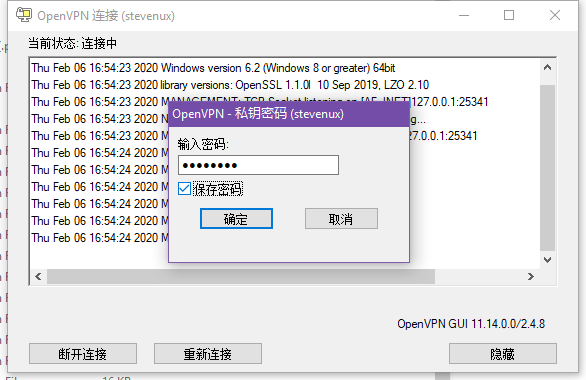
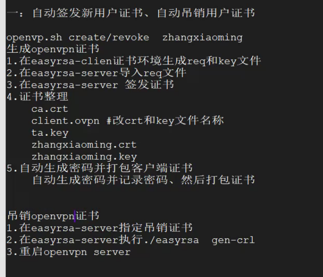

# 一.OpenVPN 简介及部署

## 1.1 OpenVPN 简介

OpenVPN 是一个健全且高效的 VPN 守护进程，它支持 SSL/TLS 安全、以太网桥，支持
TCP 或者 UDP 代理或者是 NAT 通道传输，支持动态 IP 地址和 DHCP，可支持成百上
千的用户，并且可以移植到大多数主要平台的操作系统上。

OpenVPN 需要使用 OpenSSL 库，这是因为它使用了 OpenSSL 的加密功能。 
OpenVPN 支持常规的加密，即使用预共享密钥(即静态 Key 模式)或者客户端和服务器端
的证书公钥安全(即 SSL/TLS 模式)。它还支持非加密的 TCP/UDP 通道。OpenVPN  被设
计为使用 TUN/TAP 虚拟网络接口连接网络，这种接口可以在大多数平台上使用。

OpenVPN 允许任何选项放置在命令行或者是配置文件中(在配置文件中我们称选项为指令)

[官网](https://openvpn.net)
[项目 GitHub 地址](https://github.com/OpenVPN/openvpn)

OpenVPN 示意图


## 1.2 OpenVPN 部署

### 1.2.1 OpenVPN 部署环境

使用华为云主机当 OpenVPN 服务器

| 主机             | IP            |
| :--------------- | :------------ |
| openvpn-server   | 192.168.0.248 |
| web-server-node1 | 192.168.0.250 |
| Windows10-client | 192.168.10.18 |

操作系统版本和时间同步

```bash
[root@openvpn-server ~]# cat /etc/redhat-release
CentOS Linux release 7.6.1810 (Core)
[root@openvpn-server ~]# ntp
ntpd        ntpdc       ntpq        ntptime
ntpdate     ntp-keygen  ntpstat
[root@openvpn-server ~]# ntpdate time1.aliyun.com
 6 Feb 10:46:45 ntpdate[12220]: the NTP socket is in use, exiting
```

### 1.2.2 安装 OpenVPN

安装 openvpn 和 easy-rsa 证书管理工具

```bash
[root@openvpn-server ~]# yum install epel-release -y
[root@openvpn-server ~]# yum install openvpn -y
[root@openvpn-server ~]# yum install easy-rsa -y
```

配置文件整理

```bash
[root@openvpn-server ~]# cp /usr/share/doc/openvpn-2.4.8/sample/sample-config-files/server.conf /etc/openvpn
[root@openvpn-server ~]# cp -r /usr/share/easy-rsa/ /etc/openvpn/easyrsa-server
[root@openvpn-server ~]# cp /usr/share/doc/easy-rsa-3.0.6/vars.example /etc/openvpn/easyrsa-server/3
3/     3.0/   3.0.6/
[root@openvpn-server ~]# cp /usr/share/doc/easy-rsa-3.0.6/vars.example /etc/openvpn/easyrsa-server/3
3/     3.0/   3.0.6/
[root@openvpn-server ~]# cp /usr/share/doc/easy-rsa-3.0.6/vars.example /etc/openvpn/easyrsa-server/3/vars
[root@openvpn-server ~]# cd /etc/openvpn/easyrsa-server
[root@openvpn-server easyrsa-server]# cd 3
[root@openvpn-server 3]# pwd
/etc/openvpn/easyrsa-server/3
[root@openvpn-server 3]# tree
.
├── easyrsa
├── openssl-easyrsa.cnf
├── vars
└── x509-types
    ├── ca
    ├── client
    ├── code-signing
    ├── COMMON
    ├── server
    └── serverClient

1 directory, 9 files
```

### 1.2.3 初始化 pki 环境和 CA 签发机构

```bash
[root@openvpn-server 3]# pwd
/etc/openvpn/easyrsa-server/3
[root@openvpn-server 3]# ll
total 72
-rwxr-xr-x 1 root root 48730 Feb  6 10:37 easyrsa
-rw-r--r-- 1 root root  4651 Feb  6 10:37 openssl-easyrsa.cnf
-rw-r--r-- 1 root root  8576 Feb  6 10:37 vars
drwxr-xr-x 2 root root  4096 Feb  6 10:37 x509-types
[root@openvpn-server 3]# ./easyrsa init-pki

Note: using Easy-RSA configuration from: ./vars

init-pki complete; you may now create a CA or requests.
Your newly created PKI dir is: /etc/openvpn/easyrsa-server/3/pki

[root@openvpn-server 3]# ll pki/
total 16
-rw------- 1 root root 4651 Feb  6 10:48 openssl-easyrsa.cnf
drwx------ 2 root root 4096 Feb  6 10:48 private
drwx------ 2 root root 4096 Feb  6 10:48 reqs
```

### 1.2.4 创建 CA 机构

```bash
[root@openvpn-server 3]# ./easyrsa build-ca nopass

Note: using Easy-RSA configuration from: ./vars

Using SSL: openssl OpenSSL 1.0.2k-fips  26 Jan 2017
Generating RSA private key, 2048 bit long modulus
......................+++
...................+++
e is 65537 (0x10001)
You are about to be asked to enter information that will be incorporated
into your certificate request.
What you are about to enter is what is called a Distinguished Name or a DN.
There are quite a few fields but you can leave some blank
For some fields there will be a default value,
If you enter '.', the field will be left blank.
-----
Common Name (eg: your user, host, or server name) [Easy-RSA CA]:

CA creation complete and you may now import and sign cert requests.
Your new CA certificate file for publishing is at:
/etc/openvpn/easyrsa-server/3/pki/ca.crt

[root@openvpn-server 3]# ll pki/c
ca.crt           certs_by_serial/
[root@openvpn-server 3]# ll pki/ca.crt
-rw------- 1 root root 1172 Feb  6 10:49 pki/ca.crt
[root@openvpn-server 3]# ll pki/private/ca.key
-rw------- 1 root root 1675 Feb  6 10:49 pki/private/ca.key
```

### 1.2.5 生成服务端私钥

```bash
[root@openvpn-server 3]# ./easyrsa gen-req server nopass

Note: using Easy-RSA configuration from: ./vars

Using SSL: openssl OpenSSL 1.0.2k-fips  26 Jan 2017
Generating a 2048 bit RSA private key
.............................+++
.+++
writing new private key to '/etc/openvpn/easyrsa-server/3/pki/private/server.key.k5cfaNWDBd'
-----
You are about to be asked to enter information that will be incorporated
into your certificate request.
What you are about to enter is what is called a Distinguished Name or a DN.
There are quite a few fields but you can leave some blank
For some fields there will be a default value,
If you enter '.', the field will be left blank.
-----
Common Name (eg: your user, host, or server name) [server]:

Keypair and certificate request completed. Your files are:
req: /etc/openvpn/easyrsa-server/3/pki/reqs/server.req
key: /etc/openvpn/easyrsa-server/3/pki/private/server.key
[root@openvpn-server 3]# ll pki/reqs/
total 4
-rw------- 1 root root 887 Feb  6 10:50 server.req
[root@openvpn-server 3]# ll pki/private/
total 8
-rw------- 1 root root 1675 Feb  6 10:49 ca.key
-rw------- 1 root root 1704 Feb  6 10:50 server.key
```

### 1.2.6 签发服务端证书

使用自建 ca 签发服务器证书，即生成服务端 crt 证书，crt 证书后期将发给各用户客
户端，从而实现与 openvpn-server 端加密传输数据。

```bash
[root@openvpn-server 3]# ./easyrsa sign server server

Note: using Easy-RSA configuration from: ./vars

Using SSL: openssl OpenSSL 1.0.2k-fips  26 Jan 2017


You are about to sign the following certificate.
Please check over the details shown below for accuracy. Note that this request
has not been cryptographically verified. Please be sure it came from a trusted
source or that you have verified the request checksum with the sender.

Request subject, to be signed as a server certificate for 1080 days:

subject=
    commonName                = server


Type the word 'yes' to continue, or any other input to abort.
  Confirm request details: yes
Using configuration from /etc/openvpn/easyrsa-server/3/pki/safessl-easyrsa.cnf
Check that the request matches the signature
Signature ok
The Subject''s Distinguished Name is as follows
commonName            :ASN.1 12:'server'
Certificate is to be certified until Jan 21 02:54:54 2023 GMT (1080 days)

Write out database with 1 new entries
Data Base Updated

Certificate created at: /etc/openvpn/easyrsa-server/3/pki/issued/server.crt

[root@openvpn-server 3]# ll pki/issued/server.crt
-rw------- 1 root root 4552 Feb  6 10:54 pki/issued/server.crt
```

### 1.2.7 生成 dh.pem 证书

DH 密钥交换方法，由惠特菲尔德·迪菲(Bailey Whitfield Diffie)、马丁·赫尔曼
(Martin Edward Hellman)于 1976 年发表，它是一种安全协议，让双方在完全没
有对方任何预先信息的条件下通过不安全信道建立起一个密钥，这个密钥一般作为
"对称加密"的密钥而被双方在后续数据传输中使用，DH 数学原理是 base 离散对数
问题，做类似事情的还有非对称加密类算法，如：RSA。其应用非常广泛，在 SSH、
VPN、Https...都有应用，勘称现代密码基石。
`.pem`证书和`.crt`证书的差别就是编码方式不一样，本质上都是证书文件。

```bash
[root@openvpn-server 3]# pwd
/etc/openvpn/easyrsa-server/3
[root@openvpn-server 3]# ./easyrsa gen-dh

Note: using Easy-RSA configuration from: ./vars

Using SSL: openssl OpenSSL 1.0.2k-fips  26 Jan 2017
Generating DH parameters, 2048 bit long safe prime, generator 2
This is going to take a long time
.............................................................+...........................................................++*++*

DH parameters of size 2048 created at /etc/openvpn/easyrsa-server/3/pki/dh.pem

[root@openvpn-server 3]# ll /etc/openvpn/easyrsa-server/3/pki/dh.pem
-rw------- 1 root root 424 Feb  6 10:58 /etc/openvpn/easyrsa-server/3/pki/dh.pem
```

### 1.2.8 生成客户端证书

```bash
[root@openvpn-server ~]# pwd
/root
[root@openvpn-server ~]# cp -r /usr/share/easy-rsa/ /etc/openvpn/easyrsa-client
[root@openvpn-server ~]# cp /usr/share/doc/easy-rsa-3.0.6/vars.example /etc/openvpn/easyrsa-client/3/vars
[root@openvpn-server ~]# cd /etc/openvpn/easyrsa-client/3
[root@openvpn-server 3]# pwd
/etc/openvpn/easyrsa-client/3
[root@openvpn-server 3]# ll
total 72
-rwxr-xr-x 1 root root 48730 Feb  6 11:01 easyrsa
-rw-r--r-- 1 root root  4651 Feb  6 11:01 openssl-easyrsa.cnf
-rw-r--r-- 1 root root  8576 Feb  6 11:01 vars
drwxr-xr-x 2 root root  4096 Feb  6 11:01 x509-types
[root@openvpn-server 3]# ./easyrsa init-pki

Note: using Easy-RSA configuration from: ./vars

init-pki complete; you may now create a CA or requests.
Your newly created PKI dir is: /etc/openvpn/easyrsa-client/3/pki

[root@openvpn-server 3]# ll pki
total 16
-rw------- 1 root root 4651 Feb  6 11:02 openssl-easyrsa.cnf
drwx------ 2 root root 4096 Feb  6 11:02 private
drwx------ 2 root root 4096 Feb  6 11:02 reqs
[root@openvpn-server 3]# ll pki/private/
total 0
[root@openvpn-server 3]# ll pki/reqs/
total 0
[root@openvpn-server 3]# pwd
/etc/openvpn/easyrsa-client/3
[root@openvpn-server 3]# ./easyrsa gen-req lisuo nopass

Note: using Easy-RSA configuration from: ./vars

Using SSL: openssl OpenSSL 1.0.2k-fips  26 Jan 2017
Generating a 2048 bit RSA private key
.............+++
......................................................................................+++
writing new private key to '/etc/openvpn/easyrsa-client/3/pki/private/lisuo.key.qShPkliedt'
-----
You are about to be asked to enter information that will be incorporated
into your certificate request.
What you are about to enter is what is called a Distinguished Name or a DN.
There are quite a few fields but you can leave some blank
For some fields there will be a default value,
If you enter '.', the field will be left blank.
-----
Common Name (eg: your user, host, or server name) [lisuo]:

Keypair and certificate request completed. Your files are:
req: /etc/openvpn/easyrsa-client/3/pki/reqs/lisuo.req
key: /etc/openvpn/easyrsa-client/3/pki/private/lisuo.key

[root@openvpn-server 3]# tree /etc/openvpn/easyrsa-client/3/pki/
/etc/openvpn/easyrsa-client/3/pki/
├── openssl-easyrsa.cnf
├── private
│   └── lisuo.key
├── reqs
│   └── lisuo.req
└── safessl-easyrsa.cnf

2 directories, 4 files

```

### 1.2.9 为客户端签发证书

在 openvpn server 目录中签发客户端证书

```bash
[root@openvpn-server 3]# pwd
/etc/openvpn/easyrsa-client/3
[root@openvpn-server 3]# cd /etc/openvpn/easyrsa-server/3
[root@openvpn-server 3]# ./easyrsa import-req /etc/openvpn/easyrsa-client/3/pki/reqs/lisuo.req lisuo

Note: using Easy-RSA configuration from: ./vars

Using SSL: openssl OpenSSL 1.0.2k-fips  26 Jan 2017

The request has been successfully imported with a short name of: lisuo
You may now use this name to perform signing operations on this request.

[root@openvpn-server 3]# ./easyrsa sign client lisuo

Note: using Easy-RSA configuration from: ./vars

Using SSL: openssl OpenSSL 1.0.2k-fips  26 Jan 2017


You are about to sign the following certificate.
Please check over the details shown below for accuracy. Note that this request
has not been cryptographically verified. Please be sure it came from a trusted
source or that you have verified the request checksum with the sender.

Request subject, to be signed as a client certificate for 1080 days:

subject=
    commonName                = lisuo


Type the word 'yes' to continue, or any other input to abort.
  Confirm request details: yes
Using configuration from /etc/openvpn/easyrsa-server/3/pki/safessl-easyrsa.cnf
Check that the request matches the signature
Signature ok
The Subject''s Distinguished Name is as follows
commonName            :ASN.1 12:'lisuo'
Certificate is to be certified until Jan 21 03:07:37 2023 GMT (1080 days)

Write out database with 1 new entries
Data Base Updated

Certificate created at: /etc/openvpn/easyrsa-server/3/pki/issued/lisuo.crt

[root@openvpn-server 3]# ll /etc/openvpn/easyrsa-server/3/pki/issued/lisuo.crt
-rw------- 1 root root 4431 Feb  6 11:07 /etc/openvpn/easyrsa-server/3/pki/issued/lisuo.crt

```

### 1.2.10 归档服务端证书到 server 目录

对签发的服务端证书进行归档保存

```bash
[root@openvpn-server 3]# mkdir /etc/openvpn/certs
[root@openvpn-server 3]# cd /etc/openvpn/certs
[root@openvpn-server certs]# pwd
/etc/openvpn/certs
[root@openvpn-server certs]# cp /etc/openvpn/easyrsa-server/3/pki/dh.pem .
[root@openvpn-server certs]# cp /etc/openvpn/easyrsa-server/3/pki/ca.crt .
[root@openvpn-server certs]# cp /etc/openvpn/easyrsa-server/3/pki/issued/server.crt .
[root@openvpn-server certs]# cp /etc/openvpn/easyrsa-server/3/pki/private/server.key .
[root@openvpn-server certs]# pwd
/etc/openvpn/certs
[root@openvpn-server certs]# tree
.
├── ca.crt
├── dh.pem
├── server.crt
└── server.key

0 directories, 4 files
```

### 1.2.11 归档客户端证书到相应目录

对签发的客户端证书进行归档保存

```bash
[root@openvpn-server certs]# mkdir /etc/openvpn/client/lisuo
[root@openvpn-server certs]# cd /etc/openvpn/client/lisuo
[root@openvpn-server lisuo]# pwe
-bash: pwe: command not found
[root@openvpn-server lisuo]# pwd
/etc/openvpn/client/lisuo
[root@openvpn-server lisuo]# cp /etc/openvpn/easyrsa-server/3/pki/ca.crt .
[root@openvpn-server lisuo]# cp /etc/openvpn/easyrsa-server/3/pki/issued/lisuo.crt .
[root@openvpn-server lisuo]# cp /etc/openvpn/easyrsa-server/3/pki/private/lisuo.key .
cp: cannot stat ‘/etc/openvpn/easyrsa-server/3/pki/private/lisuo.key’: No such file or directory
[root@openvpn-server lisuo]# cp /etc/openvpn/easyrsa-client/3/pki/private/lisuo.key .
[root@openvpn-server lisuo]# pwd
/etc/openvpn/client/lisuo
[root@openvpn-server lisuo]# tree
.
├── ca.crt
├── lisuo.crt
└── lisuo.key

0 directories, 3 files

```

### 1.2.12 server 端配置

服务器端配置说明

```bash
[root@openvpn-server ~]# vim /etc/openvpn/server.conf
local  192.168.0.148 # 本机监听IP
port 1194 # 端口

# TCP or UDP server?
proto tcp # 协议，指定OpenVPN创建的通信隧道类型
#proto udp

#dev tap：创建一个以太网隧道，以太网使用tap
dev tun # 创建一个路由IP隧道，互联网使用tun一个TUN设备大多时候，被用于基于IP协议的通讯。一个TAP设备允
        # 许完整的以太网帧通过Openvpn隧道，因此提供非ip协议的支持，比如IPX协议和AppleTalk协议

#dev-node MyTap # TAP-Win32适配器。非windows不需要

#topology subnet # 网络拓扑，不需要配置
server 10.8.0.0 255.255.255.0 #客户端连接后分配IP的地址池，服务器默认会占用第一个IP 10.8.0.1

#ifconfig-pool-persist ipp.txt #为客户端分配固定IP，不需要配置

#server-bridge 10.8.0.4 255.255.255.0 10.8.0.50 10.8.0.100 #配置网桥模式，不需要


push "route 10.20.0.0 255.255.255.0"  # 给客户端生成的静态路由表，下一跳为openvpn服务器的
                                      # 10.8.0.1,地址段为openvpn服务器后的公司内部网络，可以是多个网段
push "route 192.168.0.0 255.255.255.0"

;client-config-dir ccd #为指定的客户端添加路由，改路由通常是客户端后面的内网网段而不是服务端的，也不需要设置
;route 192.168.40.128 255.255.255.248
;client-config-dir ccd
;route 10.9.0.0 255.255.255.252

;learn-address ./script #运行外部脚本，创建不同组的iptables 规则，不配置
;push "redirect-gateway def1 bypass-dhcp" #启用后，客户端所有流量都将通过VPN服务器，因此不需要配置

#;push "dhcp-option DNS 208.67.222.222" #推送DNS服务器，不需要配置
#;push "dhcp-option DNS 208.67.220.220"

#client-to-client #允许不同的client通过openvpn server直接通信，不开启

;duplicate-cn #多个用户共用一个账户，一般用于测试环境，生产环境都是一个用户一个证书

keepalive 10 120 #设置服务端检测的间隔和超时时间，默认为每 10 秒 ping一次，如果 120 秒没有回应则认为对方已经 down

#tls-auth /etc/openvpn/server/ta.key  0 #可使用以下命令来生成：openvpn –genkey –secret
ta.key #服务器和每个客户端都需要拥有该密钥的一个拷贝。第二个参数在服务器端应该为’0’，在客户端应该为’1’
cipher AES-256-CBC #加密算法

;compress lz4-v2 #启用压缩
;push "compress lz4-v2"
;comp-lzo #旧户端兼容的压缩配置，需要客户端配置开启压缩

;max-clients 100 #最大客户端数

user nobody #运行openvpn服务的用户和组
group nobody

#persist-key #重启OpenVPN服务，重新读取keys文件，保留使用第一次的keys文件，不开启
#persist-tun #重启OpenVPN服务，一直保持tun或者tap设备是up的，否则会先down然后再up，不开启

status openvpn-status.log #openVPN状态记录文件，每分钟会记录一次

#;log         openvpn.log #日志记录方式和路径，log会在openvpn启动的时候清空日志文件
log-append  /var/log/openvpn/openvpn.log #重启openvpn后在之前的日志后面追加新的日志

verb 3  #设置日志级别，0-9，级别越高记录的内容越详细，
mute 20 #相同类别的信息只有前20条会输出到日志文件中
explicit-exit-notify 1  # 通知客户端，在服务端重启后可以自动重新连接，仅能用于udp模式，tcp模式不需要
                        # 配置即可实现断开重连接，且tcp配置后会导致openvpn服务无法启动。
...
[root@openvpn-server ~]# mkdir /var/log/openvpn
[root@openvpn-server ~]# chown  nobody.nobody /var/log/openvpn
```

最终配置

```bash
[root@openvpn-server ~]# grep "^[a-Z]" /etc/openvpn/server.conf
local 192.168.0.248
port 1194
proto tcp
dev tun
ca /etc/openvpn/certs/ca.crt
cert /etc/openvpn/certs/server.crt
key /etc/openvpn/certs/server.key  # This file should be kept secret
dh /etc/openvpn/certs/dh.pem
server 10.8.0.0 255.255.255.0
push "route 10.20.0.0 255.255.255.0"
push "route 192.168.0.0 255.255.255.0"
client-to-client
keepalive 10 120
# tls-auth ta.key 0 # This file is secret
cipher AES-256-CBC
max-clients 100
user nobody
group nobody
persist-key
persist-tun
status openvpn-status.log
log-append  /var/log/openvpn/openvpn.log
verb 9
mute 20
```

### 1.2.13 client 端配置文件

```bash
[root@openvpn-server ~]# cd /etc/openvpn/client/lisuo/
[root@openvpn-server lisuo]# ll
total 16
-rw------- 1 root root 1172 Feb  6 11:11 ca.crt
-rw------- 1 root root 4431 Feb  6 11:12 lisuo.crt
-rw------- 1 root root 1704 Feb  6 11:12 lisuo.key
[root@openvpn-server lisuo]# grep -Ev "^(#|$|;)" /usr/share/doc/openvpn-2.4.8/sample/sample-config-files/client.conf > /etc/openvpn/client/lisuo/client.ovpn

[root@openvpn-server lisuo]# vim /etc/openvpn/client/lisuo/client.ovpn
client    # 声明自己是个客户端
dev tun   # 接口类型，必须和服务端保持一致
proto tcp # 使用的协议，必须和服务端保持一致
remote 192.168.0.248 1194 #server端的ip和端口，可以写域名但是需要可以解析成IP
resolv-retry infinite # 如果是写的server端的域名，那么就始终解析，如果域名发生变化，
                      # 会重新连接到新的域名对应的IP
nobind #本机不绑定监听端口，客户端是随机打开端口连接到服务端的1194
persist-key #
persist-tun
ca ca.crt
cert lisuo.crt
key lisuo.key
remote-cert-tls server #指定采用服务器校验方式
#tls-auth ta.key 1
cipher AES-256-CBC
verb 3

[root@openvpn-server lisuo]# tree
.
├── ca.crt
├── client.ovpen
├── lisuo.crt
└── lisuo.key

0 directories, 4 files
```

### 1.2.14 OpenVPN 启动

```bash
[root@openvpn-server lisuo]# cd
[root@openvpn-server ~]# systemctl stop firewalld
[root@openvpn-server ~]# systemctl disable firewalld
[root@openvpn-server ~]# yum install iptables-services iptables -y
[root@openvpn-server ~]# systemctl enable iptables.service
Created symlink from /etc/systemd/system/basic.target.wants/iptables.service to /usr/lib/systemd/system/iptables.service.
[root@openvpn-server ~]# systemctl start iptables.service

[root@openvpn-server ~]# iptables -F
[root@openvpn-server ~]# iptables -X
[root@openvpn-server ~]# iptables -Z
[root@openvpn-server ~]# iptables -vnL
Chain INPUT (policy ACCEPT 6 packets, 348 bytes)
 pkts bytes target     prot opt in     out     source               destination

Chain FORWARD (policy ACCEPT 0 packets, 0 bytes)
 pkts bytes target     prot opt in     out     source               destination

Chain OUTPUT (policy ACCEPT 4 packets, 352 bytes)
 pkts bytes target     prot opt in     out     source               destination

[root@openvpn-server ~]# vim /etc/sysctl.conf
net.ipv4.ip_forward=1
"/etc/sysctl.conf" 19L, 582C written
[root@openvpn-server ~]# sysctl  -p
...
net.ipv4.ip_forward = 1

[root@openvpn-server ~]# iptables -t nat -A POSTROUTING -s 10.8.0.0/16 -j MASQUERADE
[root@openvpn-server ~]# iptables -A INPUT -p TCP --dport 1194 -j ACCEPT
[root@openvpn-server ~]# iptables -A INPUT -m state --state ESTABLISHED,RELATED -j ACCEPT
[root@openvpn-server ~]# iptables -vnL
Chain INPUT (policy ACCEPT 0 packets, 0 bytes)
 pkts bytes target     prot opt in     out     source               destination
    0     0 ACCEPT     tcp  --  *      *       0.0.0.0/0            0.0.0.0/0            tcp dpt:1194
   36  2088 ACCEPT     all  --  *      *       0.0.0.0/0            0.0.0.0/0            state RELATED,ESTABLISHED

Chain FORWARD (policy ACCEPT 0 packets, 0 bytes)
 pkts bytes target     prot opt in     out     source               destination

Chain OUTPUT (policy ACCEPT 19 packets, 1484 bytes)
 pkts bytes target     prot opt in     out     source               destination
[root@openvpn-server ~]# iptables -t nat -vnL
Chain PREROUTING (policy ACCEPT 0 packets, 0 bytes)
 pkts bytes target     prot opt in     out     source               destination

Chain INPUT (policy ACCEPT 0 packets, 0 bytes)
 pkts bytes target     prot opt in     out     source               destination

Chain OUTPUT (policy ACCEPT 1 packets, 76 bytes)
 pkts bytes target     prot opt in     out     source               destination

Chain POSTROUTING (policy ACCEPT 1 packets, 76 bytes)
 pkts bytes target     prot opt in     out     source               destination
    0     0 MASQUERADE  all  --  *      *       10.8.0.0/16          0.0.0.0/0

[root@openvpn-server ~]# service iptables save
iptables: Saving firewall rules to /etc/sysconfig/iptables:[  OK  ]

[root@openvpn-server ~]# mkdir /var/log/openvpn
[root@openvpn-server ~]# chown nobody.nobody /var/log/openvpn

# 启动OpenVPN
[root@openvpn-server ~]# systemctl start openvpn@server.service
[root@openvpn-server ~]# systemctl status openvpn@server.service
● openvpn@server.service - OpenVPN Robust And Highly Flexible Tunneling Application On server
   Loaded: loaded (/usr/lib/systemd/system/openvpn@.service; disabled; vendor preset: disabled)
   Active: active (running) since Thu 2020-02-06 12:08:13 CST; 5s ago
 Main PID: 12628 (openvpn)
   Status: "Initialization Sequence Completed"
   CGroup: /system.slice/system-openvpn.slice/openvpn@server.service
           └─12628 /usr/sbin/openvpn --cd /etc/openvpn/ --config server.conf

Feb 06 12:08:13 openvpn-server systemd[1]: Starting OpenVPN Robust And Highly Flexible Tunneling Application On server...
Feb 06 12:08:13 openvpn-server systemd[1]: Started OpenVPN Robust And Highly Flexible Tunneling Application On server.
[root@openvpn-server ~]# systemctl enable openvpn@server.service
Created symlink from /etc/systemd/system/multi-user.target.wants/openvpn@server.service to /usr/lib/systemd/system/openvpn@.service.

[root@openvpn-server ~]# tail /var/log/openvpn/openvpn.log
Thu Feb  6 12:08:17 2020 us=581126 MULTI TCP: multi_tcp_action a=TA_TUN_READ p=0
Thu Feb  6 12:08:17 2020 us=581133 MULTI TCP: multi_tcp_dispatch a=TA_TUN_READ mi=0x00000000
Thu Feb  6 12:08:17 2020 us=581144  read from TUN/TAP returned 48
Thu Feb  6 12:08:17 2020 us=581153 MULTI TCP: multi_tcp_post TA_TUN_READ -> TA_UNDEF
Thu Feb  6 12:08:17 2020 us=581162 SCHEDULE: schedule_find_least NULL
Thu Feb  6 12:08:21 2020 us=589032 EP_WAIT[0] rwflags=0x0001 ev=0x00000001 arg=0x00000002
Thu Feb  6 12:08:21 2020 us=589088 MULTI: REAP range 16 -> 32
Thu Feb  6 12:08:21 2020 us=589098 MULTI TCP: multi_tcp_action a=TA_TUN_READ p=0
Thu Feb  6 12:08:21 2020 us=589116 MULTI TCP: multi_tcp_dispatch a=TA_TUN_READ mi=0x00000000
Thu Feb  6 12:08:21 2020 us=589126 NOTE: --mute triggered...

```

验证 tun 网卡设备：

```bash
[root@openvpn-server ~]# ifconfig tun0
tun0: flags=4305<UP,POINTOPOINT,RUNNING,NOARP,MULTICAST>  mtu 1500
        inet 10.8.0.1  netmask 255.255.255.255  destination 10.8.0.2
        inet6 fe80::8a69:b152:413b:2421  prefixlen 64  scopeid 0x20<link>
        unspec 00-00-00-00-00-00-00-00-00-00-00-00-00-00-00-00  txqueuelen 100  (UNSPEC)
        RX packets 0  bytes 0 (0.0 B)
        RX errors 0  dropped 0  overruns 0  frame 0
        TX packets 3  bytes 144 (144.0 B)
        TX errors 0  dropped 0 overruns 0  carrier 0  collisions 0
```

### 1.2.15 安装 OpenVPN 的 Windows 客户端

[官方客户端下载地址](https://openvpn.net/community-downloads/)
[非官方地址](https://sourceforge.net/projects/securepoint/files/)


### 1.2.16 客户端连接测试

保存证书到 openvpn 客户端安装目录：`C:\Program Files\OpenVPN\config`

```bash
[root@openvpn-server ~]# cd /etc/openvpn/client/lisuo/
[root@openvpn-server lisuo]# tar -cJvf lisuo.tar.xz ./*
./ca.crt
./client.ovpen
./lisuo.crt
./lisuo.key
[root@openvpn-server lisuo]# ll
total 28
-rw------- 1 root root 1172 Feb  6 11:11 ca.crt
-rw-r--r-- 1 root root  214 Feb  6 11:47 client.ovpn
-rw------- 1 root root 4431 Feb  6 11:12 lisuo.crt
-rw------- 1 root root 1704 Feb  6 11:12 lisuo.key
-rw-r--r-- 1 root root 4756 Feb  6 12:16 lisuo.tar.xz
```


连接成功：会提示一个警告信息，说当前配是把密码缓存到了内存，可以使用
auth-nocache 选项避免显示。


在 windows 命令行使用`route print`看到以下信息


再加一台云主机，IP:192.168.0.250/24，测试是否可直接访问云端的局域网。

```bash
[root@ecs-d1b9 ~]# hostname web-server-node1
[root@ecs-d1b9 ~]# ifconfig eth0
eth0: flags=4163<UP,BROADCAST,RUNNING,MULTICAST>  mtu 1500
        inet 192.168.0.250  netmask 255.255.255.0  broadcast 192.168.0.255
        inet6 fe80::f816:3eff:feb5:85a1  prefixlen 64  scopeid 0x20<link>
        ether fa:16:3e:b5:85:a1  txqueuelen 1000  (Ethernet)
        RX packets 331  bytes 39550 (38.6 KiB)
        RX errors 0  dropped 0  overruns 0  frame 0
        TX packets 369  bytes 38421 (37.5 KiB)
        TX errors 0  dropped 0 overruns 0  carrier 0  collisions 0

[root@ecs-d1b9 ~]# hostname web-server-node1
[root@ecs-d1b9 ~]# exit
logout
Connection to 192.168.0.250 closed.
```

两台云主机情况


在客户端 Windows 10 系统直接 xshell 连接 192.168.0.250
成功连接，主机名为`web-server-node1`


# 二.OpenVPN 高级功能

员工入职、离职涉及到的创建账户与吊销账户证书。

## 2.1 秘钥设置密码保护

新建一个名称叫做 stevenux 的账户，并且设置证书密码，提高证书安全性。

### 2.2.1 证书申请及签发

```bash
[root@openvpn-server lisuo]# cd /etc/openvpn/easyrsa-client/3
[root@openvpn-server 3]# ll
total 76
-rwxr-xr-x 1 root root 48730 Feb  6 11:01 easyrsa
-rw-r--r-- 1 root root  4651 Feb  6 11:01 openssl-easyrsa.cnf
drwx------ 4 root root  4096 Feb  6 11:04 pki
-rw-r--r-- 1 root root  8576 Feb  6 11:01 vars
drwxr-xr-x 2 root root  4096 Feb  6 11:01 x509-types
[root@openvpn-server 3]# ./easyrsa gen-req stevenux

Note: using Easy-RSA configuration from: ./vars

Using SSL: openssl OpenSSL 1.0.2k-fips  26 Jan 2017
Generating a 2048 bit RSA private key
...............................................................+++
...................+++
writing new private key to '/etc/openvpn/easyrsa-client/3/pki/private/stevenux.key.0zvtMm6qk9'
Enter PEM pass phrase:
Verifying - Enter PEM pass phrase:
-----
You are about to be asked to enter information that will be incorporated
into your certificate request.
What you are about to enter is what is called a Distinguished Name or a DN.
There are quite a few fields but you can leave some blank
For some fields there will be a default value,
If you enter '.', the field will be left blank.
-----
Common Name (eg: your user, host, or server name) [stevenux]:www.suosuoli.cn

Keypair and certificate request completed. Your files are:
req: /etc/openvpn/easyrsa-client/3/pki/reqs/stevenux.req
key: /etc/openvpn/easyrsa-client/3/pki/private/stevenux.key

[root@openvpn-server 3]# pwd
/etc/openvpn/easyrsa-client/3
[root@openvpn-server 3]# cd /etc/openvpn/easyrsa-client/3
[root@openvpn-server 3]# pwd
/etc/openvpn/easyrsa-client/3
[root@openvpn-server 3]# cd /etc/openvpn/easyrsa-server/3
[root@openvpn-server 3]# pwd
/etc/openvpn/easyrsa-server/3
[root@openvpn-server 3]# ./easyrsa import-req /etc/openvpn/easyrsa-client/3/pki/reqs/stevenux.req stevenux

Note: using Easy-RSA configuration from: ./vars

Using SSL: openssl OpenSSL 1.0.2k-fips  26 Jan 2017

The request has been successfully imported with a short name of: stevenux
You may now use this name to perform signing operations on this request.

[root@openvpn-server 3]# ./easyrsa import-req /etc/openvpn/easyrsa-client/3/pki/reqs/stevenux.req stevenux

Note: using Easy-RSA configuration from: ./vars

Using SSL: openssl OpenSSL 1.0.2k-fips  26 Jan 2017

Easy-RSA error:

Unable to import the request as the destination file already exists.
Please choose a different name for your imported request file.
Existing file at: /etc/openvpn/easyrsa-server/3/pki/reqs/stevenux.req

[root@openvpn-server 3]# ./easyrsa sign client stevenux

Note: using Easy-RSA configuration from: ./vars

Using SSL: openssl OpenSSL 1.0.2k-fips  26 Jan 2017


You are about to sign the following certificate.
Please check over the details shown below for accuracy. Note that this request
has not been cryptographically verified. Please be sure it came from a trusted
source or that you have verified the request checksum with the sender.

Request subject, to be signed as a client certificate for 1080 days:

subject=
    commonName                = www.suosuoli.cn


Type the word 'yes' to continue, or any other input to abort.
  Confirm request details: yes
Using configuration from /etc/openvpn/easyrsa-server/3/pki/safessl-easyrsa.cnf
Check that the request matches the signature
Signature ok
The Subject''s Distinguished Name is as follows
commonName            :ASN.1 12:'www.suosuoli.cn'
Certificate is to be certified until Jan 21 08:15:11 2023 GMT (1080 days)

Write out database with 1 new entries
Data Base Updated

Certificate created at: /etc/openvpn/easyrsa-server/3/pki/issued/stevenux.crt

# 整理新账户证书
[root@openvpn-server 3]# mkdir /etc/openvpn/client/stevenux
[root@openvpn-server 3]# cd /etc/openvpn/client/stevenux
[root@openvpn-server stevenux]# pwd
/etc/openvpn/client/stevenux
[root@openvpn-server stevenux]# cp /etc/openvpn/easyrsa-server/3/pki/ca.crt .
[root@openvpn-server stevenux]# cp /etc/openvpn/easyrsa-server/3/pki/issued/stevenux.crt .
[root@openvpn-server stevenux]# cp /etc/openvpn/easyrsa-server/3/pki/private/stevenux.key .
[root@openvpn-server stevenux]# cp /etc/openvpn/client/lisuo/client.ovpn .
[root@openvpn-server stevenux]# vim client.ovpn
client
dev tun
proto tdp
remote 114.116.248.58 1194
resolv-retry infinite
nobind
persist-key
persist-tun
ca ca.crt
cert stevenux.crt
key stevenux.key
remote-cert-tls server
# tls-auth ta.key 1
cipher AES-256-CBC
verb 3

"client.ovpn" 15L, 219C written
[root@openvpn-server stevenux]# ll
total 20
-rw------- 1 root root 1172 Feb  6 16:25 ca.crt
-rw-r--r-- 1 root root  219 Feb  6 16:27 client.ovpn
-rw------- 1 root root 1704 Feb  6 16:25 stevenux.key
-rw------- 1 root root 4453 Feb  6 16:25 stevenux.crt

[root@openvpn-server stevenux]# pwd
/etc/openvpn/client/stevenux
[root@openvpn-server stevenux]# tar cJvf stevenux.tar.xz ./*
./ca.crt
./client.ovpn
./stevenux.key
./stevenux.crt
[root@openvpn-server stevenux]# sz stevenux.tar.xz

```

### 2.2.2 测试 stevenux 账户连接




## 2.2 账户证书管理

主要是证书的创建和吊销，对相应的员工的入职和离职分发和吊销其证书。

### 2.2.1 证书自动过期配置

过期时间以服务器时间为准，开始检查证书的有效期是否在服务器时间为准的有效期内。

```bash
[root@openvpn-server stevenux]# cd /etc/openvpn/easyrsa-server/3/
[root@openvpn-server 3]# pwd
/etc/openvpn/easyrsa-server/3
[root@openvpn-server 3]# vim vars
124 #set_var EASYRSA_CERT_EXPIRE    1080
125 set_var EASYRSA_CERT_EXPIRE     90
...

```

### 2.2.2 证书手动注销

目前正处连接


吊销

```bash
[root@openvpn-server 3]# cat /etc/openvpn/easyrsa-server/3/pki/index.txt
V	230121025454Z		B149F5E246A16B3EF695B06030D82C3B	unknown	/CN=server
V	230121030737Z		E18D86613FBFB4256BE241A3EB6A448F	unknown	/CN=lisuo
V	230121081511Z		7EC6AE9190A57A46FECC83ABA79920E3	unknown	/CN=www.suosuoli.cn
[root@openvpn-server 3]# pwd
/etc/openvpn/easyrsa-server/3
[root@openvpn-server 3]# ./easyrsa revoke lisuo

Note: using Easy-RSA configuration from: ./vars

Using SSL: openssl OpenSSL 1.0.2k-fips  26 Jan 2017


Please confirm you wish to revoke the certificate with the following subject:

subject=
    commonName                = lisuo


Type the word 'yes' to continue, or any other input to abort.
  Continue with revocation: yes
Using configuration from /etc/openvpn/easyrsa-server/3/pki/safessl-easyrsa.cnf
Revoking Certificate E18D86613FBFB4256BE241A3EB6A448F.
Data Base Updated

IMPORTANT!!!

Revocation was successful. You must run gen-crl and upload a CRL to your
infrastructure in order to prevent the revoked cert from being accepted.

# 生成证书吊销文件
[root@openvpn-server 3]# pwd
/etc/openvpn/easyrsa-server/3
[root@openvpn-server 3]# ./easyrsa gen-crl

Note: using Easy-RSA configuration from: ./vars

Using SSL: openssl OpenSSL 1.0.2k-fips  26 Jan 2017
Using configuration from /etc/openvpn/easyrsa-server/3/pki/safessl-easyrsa.cnf

An updated CRL has been created.
CRL file: /etc/openvpn/easyrsa-server/3/pki/crl.pem

[root@openvpn-server 3]# vim /etc/openvpn/server.conf
crl-verify /etc/openvpn/easyrsa-server/3/pki/crl.pem
"/etc/openvpn/server.conf" 318L, 10946C written
...
[root@openvpn-server 3]# systemctl restart openvpn@server

```

此时 lisuo 已经无法连接


查看吊销记录

```bash
[root@openvpn-server 3]# cat /etc/openvpn/easyrsa-server/3/pki/index.txt
V	230121025454Z		B149F5E246A16B3EF695B06030D82C3B	unknown	/CN=server
R	230121030737Z	200206120802Z	E18D86613FBFB4256BE241A3EB6A448F	unknown	/CN=lisuo  # R 表示已经被吊销
V	230121081511Z		7EC6AE9190A57A46FECC83ABA79920E3	unknown	/CN=www.suosuoli.cn
```

### 2.2.3 账户重名证书的签发

假如公司已有员工叫 lisuo 已经离职且证书已被吊销，但是又新来一个员工还叫
lisuo，那么一般的区分办法是在用户名后面加数字，如 lisuo1、lisuo2 等，
假如还想使用 lisuo 这个账户名签发证书的话，那么需要删除服务器之前 lisuo
的账户，并删除签发记录和证书，否则新用户的证书无法导入，具体证书重新签发
过程如下：

```bash
[root@openvpn-server ~]# cd /etc/openvpn/easyrsa-client/3/
[root@openvpn-server 3]# pwd
/etc/openvpn/easyrsa-client/3
[root@openvpn-server 3]# rm -rf pki/private/lisuo.key
[root@openvpn-server 3]# rm -rf pki/reqs/lisuo.req
[root@openvpn-server 3]# rm -rf /etc/openvpn/client/lisuo/

# 删除被R标记的吊销了的记录
[root@openvpn-server 3]# vim /etc/openvpn/easyrsa-server/3/pki/index.txt
R       230121030737Z   200206120802Z   E18D86613FBFB4256BE241A3EB6A448F        unknown /CN=lisuo

# 生成该账户证书请求文件
[root@openvpn-server 3]# ./easyrsa gen-req lisuo

# CA导入请求文件并签发
[root@openvpn-server ~]# cd /etc/openvpn/easyrsa-server/3
[root@openvpn-server 3]# pwd
/etc/openvpn/easyrsa-server/3
[root@openvpn-server 3]# ./easyrsa import-req /etc/openvpn/easyrsa-client/3/pki/reqs/lisuo.req lisuo

Note: using Easy-RSA configuration from: ./vars

Using SSL: openssl OpenSSL 1.0.2k-fips  26 Jan 2017

The request has been successfully imported with a short name of: lisuo
You may now use this name to perform signing operations on this request.

[root@openvpn-server 3]# ./easyrsa sign client lisuo

Note: using Easy-RSA configuration from: ./vars

Using SSL: openssl OpenSSL 1.0.2k-fips  26 Jan 2017


You are about to sign the following certificate.
Please check over the details shown below for accuracy. Note that this request
has not been cryptographically verified. Please be sure it came from a trusted
source or that you have verified the request checksum with the sender.

Request subject, to be signed as a client certificate for 90 days:

subject=
    commonName                = lisuo


Type the word 'yes' to continue, or any other input to abort.
  Confirm request details: yes
Using configuration from /etc/openvpn/easyrsa-server/3/pki/safessl-easyrsa.cnf
Check that the request matches the signature
Signature ok
The Subject''s Distinguished Name is as follows
commonName            :ASN.1 12:'lisuo'
Certificate is to be certified until May  6 12:39:04 2020 GMT (90 days)

Write out database with 1 new entries
Data Base Updated

Certificate created at: /etc/openvpn/easyrsa-server/3/pki/issued/lisuo.crt


# 归档打包证书文件
[root@openvpn-server 3]# mkdir /etc/openvpn/client/lisuo
[root@openvpn-server 3]# cd /etc/openvpn/client/lisuo
[root@openvpn-server lisuo]# cp /etc/openvpn/easyrsa-server/3/pki/issued/lisuo.crt .
[root@openvpn-server lisuo]# cp /etc/openvpn/easyrsa-client/3/pki/private/lisuo.key .
[root@openvpn-server lisuo]# cp ../
lisuo/    stevenux/
[root@openvpn-server lisuo]# cp ../stevenux/ca.crt .
[root@openvpn-server lisuo]# cp ../stevenux/client.ovpn .
[root@openvpn-server lisuo]# cat ../stevenux/client.ovpn
client
dev tun
proto tdp
remote 114.116.248.58 1194
resolv-retry infinite
nobind
persist-key
persist-tun
ca ca.crt
cert stevenux.crt
key stevenux.key
remote-cert-tls server
# tls-auth ta.key 1
cipher AES-256-CBC
verb 3
[root@openvpn-server lisuo]# tree
.
├── ca.crt
├── client.ovpn
├── lisuo.crt
└── lisuo.key

0 directories, 4 files

[root@openvpn-server lisuo]# tar czvf lisuo.tar.gz ./*
./ca.crt
./client.ovpn
./lisuo.crt
./lisuo.key
[root@openvpn-server lisuo]# sz lisuo.tar.gz
```

## 2.3 配置概览

### 2.3.1 OpenVPN server 端配置

```ruby
[root@openvpn-server ~]# cat  /etc/openvpn/server.conf
local  172.18.200.101
port 1194
proto tcp
dev tun
ca /etc/openvpn/certs/ca.crt
cert /etc/openvpn/certs/server.crt
key /etc/openvpn/certs/server.key
dh /etc/openvpn/certs/dh.pem
server 10.8.0.0 255.255.255.0
push "route 10.20.0.0 255.255.0.0"
push "route 172.31.0.0 255.255.0.0"
client-to-client
keepalive 10 120
cipher AES-256-CBC
max-clients 100
user nobody
group nobody
persist-key
persist-tun
status openvpn-status.log
log-append  /var/log/openvpn/openvpn.log
verb 9
mute 20
crl-verify /etc/openvpn/easy-rsa/3.0.3/pki/crl.pem
```

### 2.3.2 OpenVPN client 端配置

```ruby
[root@openvpn-server ~]# cat /etc/openvpn/client/zhangxiaoming/client.ovpn
client
dev tun
proto tcp
remote 172.18.200.101 1194
resolv-retry infinite
nobind
#persist-key
#persist-tun
ca ca.crt
cert zhangshijie.crt
key zhangshijie.key
remote-cert-tls server
#tls-auth ta.key 1
cipher AES-256-CBC
verb 3
```

## 2.4 自动创建账户的脚本

OpenVPN 新增账户和吊销证书脚本编写参考：


- 新增账户

```bash
#!/bin/bash
# Add a user to openvpn
if [[ $# -eq 0 ]]; then
    echo "Usage: basename $0 USERNAME1 [USERNAME2 [USERNAME3...]]"
fi

for user in "$@"; do
    echo"Adding new user: $user"
    if [[ -d "/etc/openvpn/client/$user" ]]; then
        rm -rf /etc/openvpn/client/$user
        rm -rf /etc/openvpn/easy-rsa/3.0.3/pki/reqs/$user.req
        sed -i '/'''$user'''/d' /etc/openvpn/easy-rsa/3.0.3/pki/index.txt
    fi

    echo "Gen .csr file."
    cd/etc/openvpn/client/easy-rsa/3.0.3
    ./easyrsa init-pki
    ./easyrsa gen-req $user nopass

    echo "Sign client certification."
    cd /etc/ openvpn/easy-rsa/3.0.3/
    ./easyrsa import-req /etc/openvpn/client/easy-rsa/3.0.3/pki/reqs/$user.req $user
    ./easyrsa sign client $user

    echo "Manage the crts."
    mkdir -p /etc/openvpn/client/$user/
    cp /etc/openvpn/easy-rsa/3.0.3/pki/ca.crt /etc/openvpn/client/$user/
    cp /etc/openvpn/easy-rsa/3.0.3/pki/issued/$user.crt /etc/openvpn/client/$user/
    cp /etc/openvpn/client/easy-rsa/3.0.3/pki/private/$user.key /etc/openvpn/client/$user/
    cp /etc/openvpn/client/admin.ovpn /etc/openvpn/client/$user/$user.ovpn
    sed -i 's/admin/'''$user'''/g' /etc/openvpn/client/$user/$user.ovpn
    cd etc/openvpn/client/$user/
    zip -r $user.zip *
    mv /etc/openvpn/client/$user/$user.zip ~

    echo "All done."
done

```

## 2.5 吊销证书脚本

- 吊销证书

```bash
#!/bin/bash
# Del a user from openvpn

if [[ $# -eq 0 ]]; then
    echo "Usage: basename $0 USERNAME"
fi

echo "Revoking $1..."
cd /etc/openvpn/easy-rsa/3.0.3/
./easyrsa revoke $1 # 吊销$user账户的证书
./easyrsa gen-crl

if [[ -f /etc/openvpn/easy-rsa/3.0.3/pki/crl.pem ]]; then
    echo "crl-verify  /etc/openvpn/easyrsa-server/3/pki/crl.pem" >> /etc/openvpn/server.conf
else
    echo "Can not find crl.pem. Exit."
fi
echo "Done."
```
