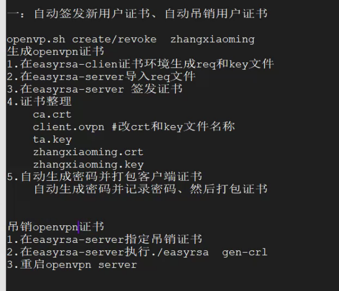

OpenVPN 新增账户和吊销证书脚本编写参考：


- 新增账户

```bash
#!/bin/bash
# Add a user to openvpn
if [[ $# -eq 0 ]]; then
    echo "Usage: basename $0 USERNAME1 [USERNAME2 [USERNAME3...]]"
fi

for user in "$@"; do
    echo"Adding new user: $user"
    if [[ -d "/etc/openvpn/client/$user" ]]; then
        rm -rf /etc/openvpn/client/$user
        rm -rf /etc/openvpn/easy-rsa/3.0.3/pki/reqs/$user.req
        sed -i '/'''$user'''/d' /etc/openvpn/easy-rsa/3.0.3/pki/index.txt
    fi

    echo "Gen .csr file."
    cd/etc/openvpn/client/easy-rsa/3.0.3
    ./easyrsa init-pki
    ./easyrsa gen-req $user nopass

    echo "Sign client certification."
    cd /etc/ openvpn/easy-rsa/3.0.3/
    ./easyrsa import-req /etc/openvpn/client/easy-rsa/3.0.3/pki/reqs/$user.req $user
    ./easyrsa sign client $user

    echo "Manage the crts."
    mkdir -p /etc/openvpn/client/$user/
    cp /etc/openvpn/easy-rsa/3.0.3/pki/ca.crt /etc/openvpn/client/$user/
    cp /etc/openvpn/easy-rsa/3.0.3/pki/issued/$user.crt /etc/openvpn/client/$user/
    cp /etc/openvpn/client/easy-rsa/3.0.3/pki/private/$user.key /etc/openvpn/client/$user/
    cp /etc/openvpn/client/admin.ovpn /etc/openvpn/client/$user/$user.ovpn
    sed -i 's/admin/'''$user'''/g' /etc/openvpn/client/$user/$user.ovpn
    cd etc/openvpn/client/$user/
    zip -r $user.zip *
    mv /etc/openvpn/client/$user/$user.zip ~

    echo "All done."
done

```

- 吊销证书

```bash
#!/bin/bash
# Del a user from openvpn

if [[ $# -eq 0 ]]; then
    echo "Usage: basename $0 USERNAME"
fi

echo "Revoking $1..."
cd /etc/openvpn/easy-rsa/3.0.3/
./easyrsa revoke $1 # 吊销$user账户的证书
./easyrsa gen-crl

if [[ -f /etc/openvpn/easy-rsa/3.0.3/pki/crl.pem ]]; then
    echo "crl-verify  /etc/openvpn/easyrsa-server/3/pki/crl.pem" >> /etc/openvpn/server.conf
else
    echo "Can not find crl.pem. Exit."
fi
echo "Done."
```
