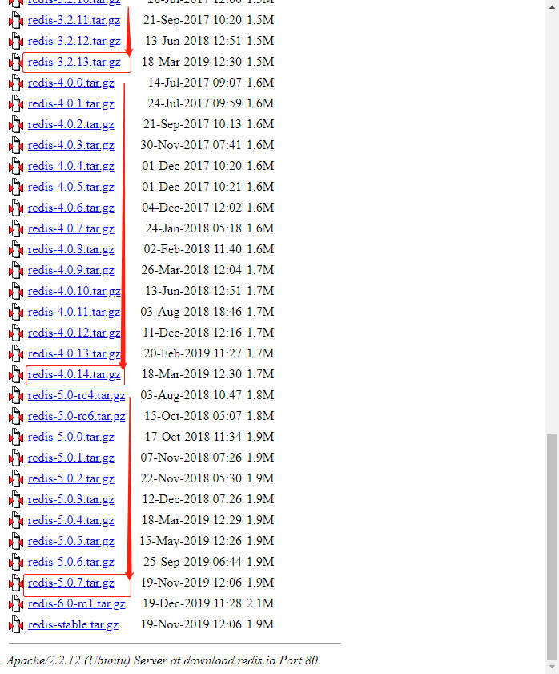
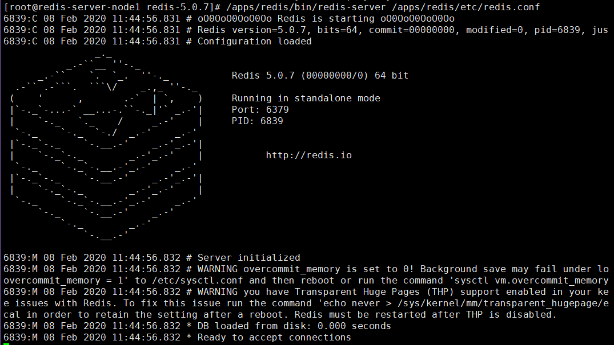
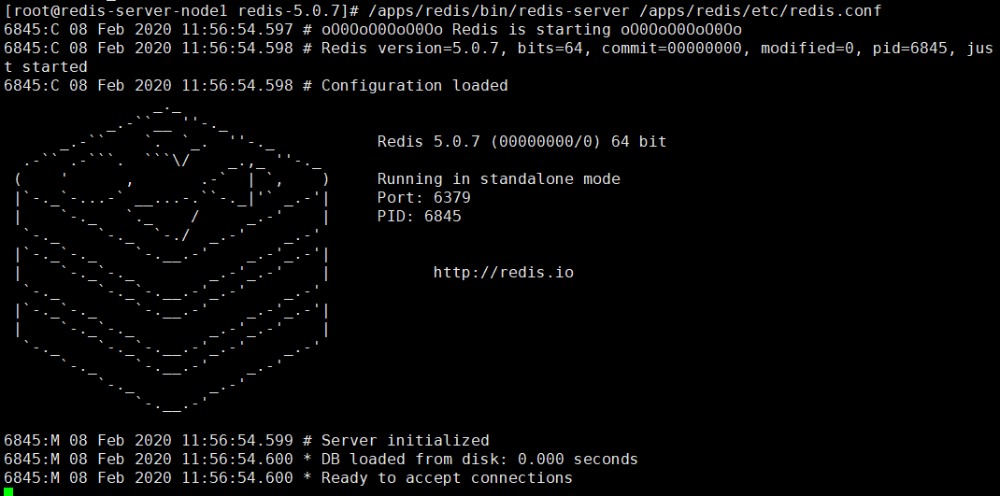

# 一.Redis 介绍

## 1.1 缓存介绍

### 1.1.1 系统缓存

#### 1.1.1.1 buffer 和 cache

#### 1.1.1.2 cache 特性

### 1.1.2 用户层缓存

#### 1.1.2.1 DNS 缓存

#### 1.1.2.2 缓存过期机制

##### 使用最后修改时间

##### Etag 标记的作用

##### 过期时间控制

### 1.1.3 CDN 缓存

#### 1.1.3.1 什么是 CDN?

#### 1.1.3.2 用户请求 CDN 的流程

#### 1.1.3.3 CDN 优势

### 1.1.4 应用层缓存

### 1.1.5 其它类型的缓存

#### 1.1.5.1 CPU 内部的缓存

#### 1.1.5.2 cookie 和 session

#### 1.1.5.3 session 和 cookie 区别

## 1.2 Redis 介绍

# 二.Redis 单机部署

## 2.1 Redis 安装

### 2.1.1 使用包管理器安装

Redis 属于 epel 源的软件，centos 需要安装 epel 源

```bash
[root@redis-server-node1 ~]# yum install epel-release -y
Loaded plugins: fastestmirror
Loading mirror speeds from cached hostfile
 * base: mirrors.huaweicloud.com
 * epel: mirror.lzu.edu.cn
 * extras: mirrors.huaweicloud.com
 * updates: mirror.bit.edu.cn
Installed Packages
redis.x86_64                                             3.2.12-2.el7                                             @epel
# 此处@epel表示已经安装
```

安装 redis

```bash
[root@redis-server-node1 ~]# yum install redis -y
[root@redis-server-node1 ~]# systemctl start redis
[root@redis-server-node1 ~]# systemctl enable redis
# 连接试试
[root@redis-server-node1 ~]# redis-cli
127.0.0.1:6379> info
# Server
redis_version:3.2.12
redis_git_sha1:00000000
redis_git_dirty:0
redis_build_id:7897e7d0e13773f
redis_mode:standalone
os:Linux 3.10.0-1062.1.1.el7.x86_64 x86_64
arch_bits:64
multiplexing_api:epoll
gcc_version:4.8.5
process_id:1725
run_id:01b34011ed867c89345b70550dbc18d45b691574
tcp_port:6379
uptime_in_seconds:1955
uptime_in_days:0
hz:10
lru_clock:3993132
executable:/usr/bin/redis-server
config_file:/etc/redis.conf

# Clients
connected_clients:1
client_longest_output_list:0
client_biggest_input_buf:0
blocked_clients:0

# Memory
used_memory:813568
used_memory_human:794.50K
used_memory_rss:6037504
used_memory_rss_human:5.76M
used_memory_peak:813568
used_memory_peak_human:794.50K
total_system_memory:3972988928
total_system_memory_human:3.70G
used_memory_lua:37888
used_memory_lua_human:37.00K
maxmemory:0
maxmemory_human:0B
maxmemory_policy:noeviction
mem_fragmentation_ratio:7.42
mem_allocator:jemalloc-3.6.0

# Persistence
loading:0
rdb_changes_since_last_save:0
rdb_bgsave_in_progress:0
rdb_last_save_time:1581050382
rdb_last_bgsave_status:ok
rdb_last_bgsave_time_sec:0
rdb_current_bgsave_time_sec:-1
aof_enabled:0
aof_rewrite_in_progress:0
aof_rewrite_scheduled:0
aof_last_rewrite_time_sec:-1
aof_current_rewrite_time_sec:-1
aof_last_bgrewrite_status:ok
aof_last_write_status:ok

# Stats
total_connections_received:2
total_commands_processed:12
instantaneous_ops_per_sec:0
total_net_input_bytes:447
total_net_output_bytes:22158
instantaneous_input_kbps:0.00
instantaneous_output_kbps:0.00
rejected_connections:0
sync_full:0
sync_partial_ok:0
sync_partial_err:0
expired_keys:0
evicted_keys:0
keyspace_hits:3
keyspace_misses:0
pubsub_channels:0
pubsub_patterns:0
latest_fork_usec:646
migrate_cached_sockets:0

# Replication
role:master
connected_slaves:0
master_repl_offset:0
repl_backlog_active:0
repl_backlog_size:1048576
repl_backlog_first_byte_offset:0
repl_backlog_histlen:0

# CPU
used_cpu_sys:1.27
used_cpu_user:0.59
used_cpu_sys_children:0.00
used_cpu_user_children:0.00

# Cluster
cluster_enabled:0

# Keyspace
db0:keys=1,expires=0,avg_ttl=0

# 存储K-V试试
127.0.0.1:6379> set url www.suosuoli.cn
OK
127.0.0.1:6379> get url
"www.suosuoli.cn"
127.0.0.1:6379>

```

### 2.1.2 编译安装

#### 2.1.2.1 编译安装

下载当前最新 release 版本 [redis 源码包](http://download.redis.io/releases/)



[官方编译安装参考](https://redis.io/download)

```bash
[root@redis-server-node1 src]# tar -xf redis-5.0.7.tar.gz
[root@redis-server-node1 redis-5.0.7]# pwd
/usr/local/src/redis-5.0.7
[root@redis-server-node1 redis-5.0.7]# make PREFIX=/apps/redis install
[root@redis-server-node1 redis-5.0.7]# ll /apps/redis/
total 4
drwxr-xr-x 2 root root 4096 Feb  8 11:38 bin

# 创建redis用户和数据目录
[root@redis-server-node1 redis-5.0.7]# useradd -u 994 -s /sbin/nologin
[root@redis-server-node1 redis-5.0.7]# id redis
uid=996(redis) gid=994(redis) groups=994(redis)
[root@redis-server-node1 redis-5.0.7]# mkdir /apps/redis/{etc,logs,data,run} -v
mkdir: created directory ‘/apps/redis/etc’
mkdir: created directory ‘/apps/redis/logs’
mkdir: created directory ‘/apps/redis/data’
mkdir: created directory ‘/apps/redis/run’
[root@redis-server-node1 redis-5.0.7]# chown redis.redis /apps/redis -R

```

#### 2.1.2.2 前台启动 redis



#### 2.1.2.3 警告解决

的看法接收到看风景的开发商来房间是大佬开发精灵盛典上课的废旧塑料的方式来地方可

1. vm.overcommit_memory
   该值设为 0: 表示内核将检查是否有足够的可用内存供应用进程使用；如果有足够的
   可 用内存，内存申请允许；否则，内存申请失败，并把错误返回给应用进程。
   该值设为 1: 表示内核允许分配所有的物理内存，而不管当前的内存状态如何。
   该值设为 2: 表示内核允许分配超过所有物理内存和交换空间总和的内存
   一般设置为 1：
   `vm.overcommit_memory=1`

2. transparent hugepage
   大页内存动态分配机制，需要关闭让 redis 负责。
   `echo never > /sys/kernel/mm/transparent_hugepage/enabled`

3. tcp-backlog
   此处使用云主机没有出现 tcp-backlog 警告，在使用新装的虚拟机时可能会出现
   The backlog argument defines the maximum length to which the queue of
   pending connections for sockfd may grow. If a connection request arrives
   when the queue is full, the client may receive an error with an
   indication of ECONNREFUSED or, if the underlying protocol supports
   retransmission, the request may be ignored so that a later reattempt
   at connection succeeds. backlog 参数控制的是三次握手的时候 server 端收到
   client ack 确认号之后的队列值。
   `net.core.somaxconn = 512`

操作

```bash
[root@redis-server-node1 redis-5.0.7]# echo never > /sys/kernel/mm/transparent_hugepage/enabled
[root@redis-server-node1 redis-5.0.7]# vim /etc/sysctl.conf
net.core.somaxconn=1024
vm.overcommit_memory=1
...
[root@redis-server-node1 redis-5.0.7]# sysctl -p
net.core.somaxconn = 1024
vm.overcommit_memory = 1
...
```

4. 再次启动没有警告
   

#### 2.1.2.4 编辑 redis 服务启动脚本

可以使用 yum 安装的 service 文件作为参考来编写编译安装的 service 文件

```bash
[root@redis-server-node1 redis-5.0.7]# cat /usr/lib/systemd/system/redis.service
[Unit]
Description=Redis persistent key-value database
After=network.target
After=network-online.target
Wants=network-online.target

[Service]
# ExecStart=/usr/bin/redis-server /etc/redis.conf --supervised systemd
ExecStart=/apps/redis/bin/redis-server /apps/redis/etc/redis.conf --supervised systemd
ExecReload=/bin/kill -s HUP $MAINPID
# ExecStop=/usr/libexec/redis-shutdown
ExecStop=/bin/kill -s QUIT $MAINPID
Type=notify
User=redis
Group=redis
RuntimeDirectory=redis
RuntimeDirectoryMode=0755

[Install]
WantedBy=multi-user.target
```

#### 2.1.2.5 使用 systemd 启动 Redis

```bash
[root@redis-server-node1 redis-5.0.7]# cd
[root@redis-server-node1 ~]# systemctl daemon-reload
[root@redis-server-node1 ~]# systemctl start redis
[root@redis-server-node1 ~]# ss -ntl
State      Recv-Q Send-Q                               Local Address:Port                                              Peer Address:Port
LISTEN     0      100                                      127.0.0.1:25                                                           *:*
LISTEN     0      511                                      127.0.0.1:6379                                                         *:*
LISTEN     0      511                                              *:80                                                           *:*
LISTEN     0      128                                              *:22                                                           *:*
LISTEN     0      100                                          [::1]:25                                                        [::]:*
LISTEN     0      128                                           [::]:22

[root@redis-server-node1 ~]# systemctl status redis
● redis.service - Redis persistent key-value database
   Loaded: loaded (/usr/lib/systemd/system/redis.service; disabled; vendor preset: disabled)
   Active: active (running) since Sun 2020-02-09 13:56:54 CST; 1s ago
   ...
[root@redis-server-node1 ~]# systemctl enable redis
Created symlink from /etc/systemd/system/multi-user.target.wants/redis.service to /usr/lib/systemd/system/redis.service.

# 连接测试
[root@redis-server-node1 ~]# /apps/redis/bin/redis-cli
127.0.0.1:6379> set url www.suouoli.cn
OK
127.0.0.1:6379> get url
"www.suouoli.cn"
127.0.0.1:6379> info
# Server
redis_version:5.0.7
redis_git_sha1:00000000
redis_git_dirty:0
redis_build_id:831df5170c6e139f
redis_mode:standalone
os:Linux 3.10.0-1062.1.1.el7.x86_64 x86_64
...
```

#### 2.1.2.6 使用非本机客户端连接 redis

```bash
~$ /apps/redis/bin/redis-cli  -h  IP/HOSTNAME -p PORT -a PASSWORD

# 如：
[root@steve ~]$redis-cli -h 114.116.248.58 -p 6379 -a stevenux
```

#### 2.1.2.7 创建 redis 命令的软连接

将命令链接到`/usr/bin`下，不再输入命令的绝对路径

```bash
[root@redis-server-node1 ~]# ln -sv /apps/redis/bin/redis-* /usr/bin/
‘/usr/bin/redis-benchmark’ -> ‘/apps/redis/bin/redis-benchmark’
‘/usr/bin/redis-check-aof’ -> ‘/apps/redis/bin/redis-check-aof’
‘/usr/bin/redis-check-rdb’ -> ‘/apps/redis/bin/redis-check-rdb’
‘/usr/bin/redis-cli’ -> ‘/apps/redis/bin/redis-cli’
‘/usr/bin/redis-sentinel’ -> ‘/apps/redis/bin/redis-sentinel’
‘/usr/bin/redis-server’ -> ‘/apps/redis/bin/redis-server’
```

编译安装后的额命令功能

```bash
[root@redis-server-node1 ~]# ll /apps/redis/bin/
total 32772
-rwxr-xr-x 1 redis redis 4366824 Feb  8 11:38 redis-benchmark # redis的性能测试工具
-rwxr-xr-x 1 redis redis 8125216 Feb  8 11:38 redis-check-aof # AOF文件检查工具
-rwxr-xr-x 1 redis redis 8125216 Feb  8 11:38 redis-check-rdb # RDB文件检查工具
-rwxr-xr-x 1 redis redis 4807896 Feb  8 11:38 redis-cli       # redis客户端，连接redis数据库使用
lrwxrwxrwx 1 redis redis      12 Feb  8 11:38 redis-sentinel -> redis-server # redis哨兵，使用软连接连到redis-server
-rwxr-xr-x 1 redis redis 8125216 Feb  8 11:38 redis-server  # redis服务
```

### 2.1.3 windows 安装 redis

[Windows 版 Redis 下载地址](https://github.com/MicrosoftArchive/redis/releases)

强烈不推荐在生产环境使用 Windows 系统运行 Redis 服务。开发测试时可以使用。

## 2.2 Redis 使用

### 2.2.1 连接到 redis

运维人员和各种语言编写的程序的都可以连接到 redis 数据库，主要有以下几种方式:

#### 2.2.1.1 运维式的连接

1. 本机非密码

```bash
~$ redis-cli
```

2. 跨主机非密码

```bash
~$ redis-cli -h HOSTNAME/IP -p PORT
```

3. 跨主机使用密码

```bash
~$ redis-cli -h HOSTNAME/IP -p PORT -a PASSWORD
```

#### 2.2.1.2 shell 程序连接 redis

shell 脚本连接和写入数据

脚本

```bash
[root@redis-server-node1 ~]# vim redis-test.sh
#!/bin/bash
# A connection prog for redis.

NUM=`seq 1 10000`  # 使用for循环写入10000个键值对
for i in ${NUM};do
    redis-cli -h 127.0.0.1 set key-${i} value-${i}
done
```

测试

```bash
[root@redis-server-node1 ~]# chmod u+x redis-test.sh
[root@redis-server-node1 ~]# ./redis-test.sh
[root@redis-server-node1 ~]# time ./redis-test.sh
...
OK
OK
OK
OK

real	0m13.860s
user	0m4.581s
sys	0m9.654s
[root@redis-server-node1 ~]#redis-cli
127.0.0.1:6379> get key-1000
"VaLuE-1000"
127.0.0.1:6379> get key-10000
"VaLuE-10000"
127.0.0.1:6379> get key-0
(nil)
127.0.0.1:6379> get key-1
"VaLuE-1"

```

#### 2.2.1.3 python 程序连接 redis

Python 程序连接和写入数据

1. 准备 python 环境

```bash
[root@redis-server-node1 ~]# py
pydoc      python     python2    python2.7
[root@redis-server-node1 ~]# yum install python3
[root@redis-server-node1 ~]# python3
Python 3.6.8 (default, Aug  7 2019, 17:28:10)
[GCC 4.8.5 20150623 (Red Hat 4.8.5-39)] on linux
Type "help", "copyright", "credits" or "license" for more information.
>>>
...
[root@redis-server-node1 ~]# pip3 install redis
WARNING: Running pip install with root privileges is generally not a good idea. Try `pip3 install --user` instead.
Collecting redis
  Downloading https://files.pythonhosted.org/packages/f0/05/1fc7feedc19c123e7a95cfc9e7892eb6cdd2e5df4e9e8af6384349c1cc3d/redis-3.4.1-py2.py3-none-any.whl (71kB)
    100% |████████████████████████████████| 71kB 36kB/s
Installing collected packages: redis
Successfully installed redis-3.4.1
[root@redis-server-node1 ~]# vim redis-test.py
```

2. `redis-test.py`内容

```py
#!/bin/env python3
# A test conn prog for redis.

import redis


conn_pool = redis.ConnectionPool(host="127.0.0.1", port=6379, password="")
redis_write = redis.Redis(connection_pool=conn_pool)
for row in range(10000): # 同样使用for循环写入10000个键值对
    redis_write.set("key-%d" % row, "value-%d" % row)
    data = redis_write.get("key-%d" % row)
```

3. 运行测试数据写入

```bash
[root@redis-server-node1 ~]# time python3 redis-test.py

real	0m1.985s   # 比使用shell脚本块了不止10倍
user	0m1.248s
sys	0m0.549s

[root@redis-server-node1 ~]# redis-cli
127.0.0.1:6379> info
# Server
redis_version:5.0.7
...

127.0.0.1:6379> get key-1
"value-1"
127.0.0.1:6379> get key-10000
"value-10000"
127.0.0.1:6379> get key-9999
"value-9999"
127.0.0.1:6379> get key-0
"value-0"              # python中内建函数range()使用时，从0计数，如range(10)表示0-9
                       # 测试程序中range(1000)写入的数据为value-0到value-999
                       # 这说明已经连接成功


```

## 2.3 Redis 配置

redis-5.0.7 配置文件说明

```bash
################################## INCLUDES ###################################
################################## 文件包含  ###################################
# include /path/to/local.conf
# include /path/to/other.conf
#
################################## MODULES #####################################
################################## 模块加载 #####################################
# loadmodule /path/to/my_module.so
# loadmodule /path/to/other_module.so
#
################################## NETWORK #####################################
################################## 网络配置 #####################################
# bind 192.168.1.100 10.0.0.1
# bind 127.0.0.1 ::1
# bind 127.0.0.1
bind 0.0.0.0
    # 配置redis接收连接的监听地址，空格分隔多个地址

protected-mode yes
    # redis3.2 之后加入的新特性，默认开启。在没有设置bind IP和密码的时候redis只允许访问
    # 127.0.0.1:6379，远程访问将提示警告信息并拒绝远程访问

port 6379
    # redis-server监听连接的端口，如果配置为0，那么redis不监听TCP socket

tcp-backlog 511
    # TCP协议三次握手的时候redis-server端收到client ack确认号之后的队列个数。在单位时间
    # 内(比如1秒)连接数很多时，需要调高该数值。需要注意是该数值不会超过/proc/sys/net/core/somaxconn
    # 定义的值大小，如果需要调大，那么该内核参数也要调大。

timeout 0
    # 客户端和Redis服务端的连接超时时间，默认是0，表示永不超时。
    # timeout 5 表示客户端闲置5秒后redis会断开该链接

# unixsocket /tmp/redis.sock
# unixsocketperm 700
    # 指定监听的unix套接字，默认不监听unix套接字

tcp-keepalive 300
    # 用于保持TCP会话
    # Redis 3.2.1后的推荐配置为300

################################# GENERAL #####################################
################################# 常规配置 ####################################
daemonize no
    # 认情况下 redis 不作为守护进程运行。当redis作为守护进程运行的时候，其默认将PID文件
    # 写入/var/run/redis.pid 文件。

supervised no
    # 配置是否通过系统的管理服务upstart或者systemd来启动和管理Redis守护进程。
    # CentOS7 及以后都使用systemd
    # 可以配置如下选项：
        # supervised upstart - signal upstart by putting Redis into SIGSTOP mode
        # supervised systemd - signal systemd by writing READY=1 to $NOTIFY_SOCKET
        # supervised auto    - detect upstart or systemd method based on
        #                      UPSTART_JOB or NOTIFY_SOCKET environment variables

pidfile /var/run/redis_6379.pid
    # PID文件路径，Redis以守护进程启动时使用的PID文件，在启动时创建，在退出时删除。
    # 不指定该文件redis默认会创建在"/var/run/redis.pid"。如果redis无法穿件该PID文件
    # 也不会报错，redis还会正常启动工作

loglevel notice
    # 指定服务器输出日志的详细级别
    # 可以是以下值：
        # debug (很多信息，开发和测试使用)
        # verbose (很多极少使用到的有用信息，不如debug级别详细)
        # notice (细节差不多刚刚好，生产中这样配，懂？)
        # warning (只有很重要/要命的信息被记录输出)

logfile ""
    # 指定日志文件，空字符串表示强制redis输出日志到标准输出
    # 如果你将redis作为服务守护进程启动而未指定日志文件，那么日志将写入设备/dev/null

# syslog-enabled no
    # 该选项配置要不要将redis日志合并到system logger
# syslog-ident redis
    # 指定syslog标识
# syslog-facility local0
    # 指定syslog设备，必须为USER 或 LOCAL0-LOCAL7.

databases 16
    # 设置数据库个数，默认的数据库为DB 0 ，索引为0
    # 可以使用指令：SELECT <dbid>选择某个数据库
    # databases 16 表示数据库DB0-DB15

always-show-logo yes
    # 该配置指令配置是否在前台启动redis时向交互终端的标准输出设备写ASCII
    # 编码的redis logo

################################ SNAPSHOTTING  ################################
################################ RedisDB快照机制 ###############################
# save <seconds> <changes>
    # 将数据库保存在磁盘上，在一段时间内改变的键个数到达一定时间时触发保存
    # 注释save开头的行将停止数据库快照机制
    # save "" 该配置将删除以前配置的所有快照保存点
save 900 1
    # 900秒后如果有1个键(key)改变，就快照该数据库保存到磁盘
save 300 10
    # 300秒后如果有10个键(key)改变，就快照该数据库保存到磁盘
save 60 10000
    # 60秒后如果有10000个键(key)改变，就快照该数据库保存到磁盘

stop-writes-on-bgsave-error no
    # 配置后台保存(快照)出错时是否禁用 redis 写入操作
    # 默认情况下，如果redis开启了RDB快照机制(至少有一个保存点)并且最近一次的后台快照操作
    # 失败，就会禁用写操作。如果后台的保存进程又开始正常工作，那么redis又会允许写入操作
    # 如果已经通过其他机制良好的配置了redis数据持久策略，那么可以将该选项配置为no。这使得
    # redis在硬盘出问题或者遇到权限问题时任然能正常工作。

rdbcompression yes
    # 该配置项决定持久化数据到RDB文件时，是否压缩，"yes"为压缩，"no"则反之
    # 保存.rdb文件时使用LZF压缩字符串对象
    # 不压缩可以从保存进程得到一些CPU性能，但是推荐yes

rdbchecksum yes
    # 该配置决定是否使用CRC64校验RDB文件，默认使用
    # 版本5的RDB数据库文件末尾存放了该CRC64校验值，使用校验会使得RDB文件更不容易
    # 损坏，但是校验会在保存和加载RDB文件时损失10%的性能，如果最求最大化性能，可
    # 以设置为no禁用。
    # checksum 禁用时创建的RDB文件有一个为0的checksum值，告知加载代码跳过检查

dbfilename dump.rdb
    # 快照保存的文件名

dir ./
    # 快照文件保存路径，必须是文件夹路径，非文件路径
    # AOF文件也会被保存到此路径

################################# REPLICATION #################################
################################# 主从复制配置 #################################
#   +------------------+      +---------------+
#   |      Master      | ---> |    Replica    |
#   | (receive writes) |      |  (exact copy) |
#   +------------------+      +---------------+
# 1. Redis的主从复制是异步的，也可以将Master配置为当与其连接的从库少于一定数量时
#    停止接受写操作命令
# 2. Redis的从库可以在连接断开的一定时间内执行和主库的部分重同步，这个行为需要合适
#    的backlog大小配置
# 3. 主从的复制是自动进行的。

# replicaof <masterip> <masterport>
    # 该指令将该Redis实例变为配置的IP和端口指向的库的从库

# masterauth <master-password>
    # 设置连接密码

replica-serve-stale-data yes
    # 该配置决定从库和主库断开连接后，从库应对请求的行为：
    # "yes" 表示，从库继续接受客户端请求，这可能会返给客户端一些过时数据
    # "no" 表示，除了INFO, replicaOF, AUTH, PING, SHUTDOWN, REPLCONF, ROLE, CONFIG,
    #               SUBSCRIBE, UNSUBSCRIBE, PSUBSCRIBE, PUNSUBSCRIBE, PUBLISH, PUBSUB,
    #               COMMAND, POST, HOST: and LATENCY等命令会响应外，其它的请求都回应一个
    #               错误"SYNC with master in progress"

replica-read-only yes
    # 该选项设置从库是否只读

repl-diskless-sync no
# -------------------------------------------------------
# WARNING: DISKLESS REPLICATION IS EXPERIMENTAL CURRENTLY
# 注意：无盘复制目前处于试验阶段
# -------------------------------------------------------
    # 该选择配置复制时同步(SYNC)的策略：写disk或者写socket
    # 新的从库或者处于重新连接的从库无法继续进行主从复制，只会收到数据差异信息。此时
    # 从库需要和主库做全量同步。主库redis会将内存中dump出新的RDB文件，并发送该从库。
    # 有两种方式发送：
        # 1) Disk-backed(yes): Redis master 创建一个新的进程将RDB文件写入到磁盘。之后
        #    Redis主进程以增量方式传输该从库。
        # 2) Diskless(no): Redis master 创建一个新进程直接dump RDB到slave的socket，不经
        #    过主进程，不经过硬盘
    # 基于硬盘的话，RDB文件创建后，一旦创建完毕，可以同时服务更多的slave，但是基于socket
    # 的话， 新slave连接到master之后得逐个同步数据。在较慢并且网络较快的时候，可以用
    # diskless(yes),否则使用磁盘(no)`

repl-diskless-sync-delay 5
    # 复制的延迟时间，设置0为关闭，在延迟时间内连接的新客户端，会一起通过disk方式同步数据，
    # 但是一旦复制开始还没有结束之前，master节点不会再接收新slave的复制请求，直到下一次
    # 同步开始。

# repl-ping-replica-period 10
    # 该选项使得slave根据master指定的时间进行周期性的PING监测

# repl-timeout 60
    # 该复制超时配置指令设置以下情况的超时(必须大于repl-ping-replica-period):
    # 1) 从库角度，在SYNC时(同步期间)的批量文件传输I/O超时
    # 2) 从库角度，主库超时(数据传输超时，ping超时)
    # 3) 主库角度，从库的复制超时(REPLCONF ACK pings).

repl-disable-tcp-nodelay no
    # 在socket的复制同步模式下是否在slave套接字发送SYNC之后禁用 TCP_NODELAY
        # "yes" redis会使用较少量的TCP包和带宽向从站发送数据。但这会导致在从站增加一点数据
        # 的时延。Linux内核默认配置情况下最多40毫秒的延时。
        # "no" 从站的数据延时不会那么多，但备份需要的带宽相对较多。默认情况下追求最小延迟
        # 设置为no，但在高负载情况下或者在主从站距离比较远的情况下，把它切换为yes更好。

# repl-backlog-size 1mb
    # 设置复制的backlog大小，backlog是在从库断开连接后累加复制数据的缓冲，所以在某个从库
    # 断开连接重新连接后，通常只需部分同步，而不需要完全同步。
    # backlog越大，允许从库断开连接的实际越长而不会丢失数据(重连后进行部分同步)

# repl-backlog-ttl 3600
    # 该选项配置master在多久时间内没有slave连接就清空backlog缓冲
    # 计时从最后一个slave断开开始，值为0表示不释放buffer

replica-priority 100
    # 当master不可用，Sentinel会根据slave的优先级选举一个master，最低的优先级的slave会
    # 被选为master 。而配置成0，永远不会被选举

# min-replicas-to-write 3
# min-replicas-max-lag 10
    # 上面两个配置项表示：存在至少3个活动的从库连接并且从库的延迟小于或等于10秒，就让主库
    # master停止接收写请求，将写请求给从库处理。设置为0则不启用该功能。

# replica-announce-ip 5.5.5.5
# replica-announce-port 1234


################################## SECURITY ###################################
################################## 安全配置 ###################################
# requirepass foobared
    # 配置redis客户端连接密码，需要客户端连接后在处理其他命令前先执行UTH <PASSWORD>

# rename-command CONFIG b840fc02d524045429941cc15f59e41cb7be6c52
    # 重命名命令，可以避免将危险的命令暴露给外部，也可保证安全性。
    # rename-command CONFIG "" 表示禁用CONFIG指令

################################### CLIENTS ####################################
# maxclients 10000
    # 设置同时允许连接的客户端的最大数目

############################## MEMORY MANAGEMENT ################################
############################## 内存管理配置       ################################
# maxmemory <bytes>
    # 配置Redis的内存使用上限，redis最大内存，单位为字节，8G内存配置时指定的数值
    # 为：8*1024*1024*1024(Byte)，需要注意的是slave的输出缓冲区是不计算在maxmemory内的。
    # Redis在启动时会把数据加载到内存中，达到最大内存后，Redis会先尝试清除已到期或即将到期
    # 的Key。当此方法处理后，仍然到达最大内存设置，将无法再进行写入操作，但仍然可以进行读
    # 取操作。Redis新的vm机制，会把Key存放内存，Value会存放在swap区。


# maxmemory-policy noeviction
    # 当内存达到maxmemory指定的值时，Redis选择移除什么来释放内存
        # volatile-lru    -> 使用接近LRU的算法回收设置有过期时间的KEY。
        # allkeys-lru     -> 使用接近LRU的算法回收任何KEY。
        # volatile-lfu    -> 使用接近LFU的算法回收设置有过期时间的KEY。
        # allkeys-lfu     -> Evict any key using approximated LFU.
        # volatile-random -> 随机移除设置有过期时间的KEY。
        # allkeys-random  -> 随机移除任何KEY。
        # volatile-ttl    -> 移除即将过期的KEY。(minor TTL)
        # noeviction      -> 不移除任何KEY，只对读操作返回一个错误。
            # LRU means Least Recently Used-最近最少使用算法
            # LFU means Least Frequently Used-最近最频繁使用算法

# maxmemory-samples 5
    # 由于LRU, LFU and volatile-ttl等算法都是使用近似随机的算法实现的，所以不是很
    # 准确。该选项用来在性能和准确性上做平衡。默认Redis会检查5个KEY然后选择一个最近
    # 最少使用的KEY释放。简单的说就是算法取样的大小。
    # 取3个快不准，取5个差不多，取10个准不快 (懂我意思吗？)

# replica-ignore-maxmemory yes
    # Redis 5开始，从库会忽略最大的内存配置项。KEY的回收由master库发送DEL指令到从库
    # 完成，就如同master回收自己的KEY一样。

############################# LAZY FREEING ####################################
############################# 删除KEY回收内存的机制-LAZY FREEING ##############
# Redis有两种删除KEY的原语。一个是指令DEL，是一种阻塞删除对象的机制，也就是说使用DEL
# 时server会停止处理新的命令，以同步的方式来回收与删除的对象相关的内存。
# 另一种非阻塞删除对象的原语如：FLUSHALL和FLUSHDB指令的UNLINK(非阻塞删除)和ASYNC。
# 这些指令会使用一个新的线程在后台回收内存。
# 默认是以阻塞的方式删除对象并回收内存，但是也可以配置为非阻塞的方式。如下:

lazyfree-lazy-eviction no
lazyfree-lazy-expire no
lazyfree-lazy-server-del no
replica-lazy-flush no

############################## APPEND ONLY MODE ###############################
############################## 数据持久化策略：只追加模式 #######################
# Append Only File是除了RDB数据持久化的另一个方案，比RDB更加可靠。RBD和AOF策略可以
# 同时打开。
appendonly no
appendfilename "appendonly.aof"

# appendfsync always
appendfsync everysec
# appendfsync no
    # 该配置使用了fsync()系统调用通知OS将输出缓冲的数据立即写到磁盘。某些OS会直接写到
    # 磁盘，但是另一些则只会假模假式的ASAP。
    # no       表示不执行fsync，由操作系统自己决定何时将数据同步到磁盘，速度最快。
    # always   表示每次写入只追加日志都执行fsync，以保证数据同步到磁盘，慢安全。
    # everysec 表示每秒执行一次fsync，可能会导致丢失这1s数据。

no-appendfsync-on-rewrite no

auto-aof-rewrite-percentage 100
auto-aof-rewrite-min-size 64mb
aof-load-truncated yes
aof-use-rdb-preamble yes

################################ LUA SCRIPTING  ###############################
lua-time-limit 5000

################################ REDIS CLUSTER  ###############################
# cluster-enabled yes
# cluster-node-timeout 15000
# cluster-replica-validity-factor 10
# cluster-migration-barrier 1
# cluster-require-full-coverage yes
# cluster-replica-no-failover no

################################## SLOW LOG ###################################
slowlog-log-slower-than 10000
slowlog-max-len 128

################################ LATENCY MONITOR ##############################
latency-monitor-threshold 0

############################# EVENT NOTIFICATION ##############################
notify-keyspace-events ""

############################### ADVANCED CONFIG ###############################
hash-max-ziplist-entries 512
hash-max-ziplist-value 64
list-max-ziplist-size -2
list-compress-depth 0
set-max-intset-entries 512
zset-max-ziplist-entries 128
zset-max-ziplist-value 64
hll-sparse-max-bytes 3000
stream-node-max-bytes 4096
stream-node-max-entries 100
activerehashing yes
client-output-buffer-limit normal 0 0 0
client-output-buffer-limit replica 256mb 64mb 60
client-output-buffer-limit pubsub 32mb 8mb 60
# client-query-buffer-limit 1gb
# proto-max-bulk-len 512mb
hz 10
dynamic-hz yes
aof-rewrite-incremental-fsync yes
rdb-save-incremental-fsync yes
# +--------+------------+------------+------------+------------+------------+
# | factor | 100 hits   | 1000 hits  | 100K hits  | 1M hits    | 10M hits   |
# +--------+------------+------------+------------+------------+------------+
# | 0      | 104        | 255        | 255        | 255        | 255        |
# +--------+------------+------------+------------+------------+------------+
# | 1      | 18         | 49         | 255        | 255        | 255        |
# +--------+------------+------------+------------+------------+------------+
# | 10     | 10         | 18         | 142        | 255        | 255        |
# +--------+------------+------------+------------+------------+------------+
# | 100    | 8          | 11         | 49         | 143        | 255        |
# +--------+------------+------------+------------+------------+------------+
#
# lfu-log-factor 10
# lfu-decay-time 1

########################### ACTIVE DEFRAGMENTATION #######################
# activedefrag yes
# active-defrag-ignore-bytes 100mb
# active-defrag-threshold-lower 10
# active-defrag-threshold-upper 100
# active-defrag-cycle-min 5
# active-defrag-cycle-max 75
# active-defrag-max-scan-fields 1000

```

翻译后的配置文件

```bash
bind 0.0.0.0       # 监听地址，可以用空格隔开后多个监听IP
protected-mode yes # redis3.2 之后加入的新特性，在没有设置bind IP和密码的时候,redis只允许访问127.0.0.1:6379，远程访问将提示警告信息并拒绝远程访问
port 6379          # 监听端口
tcp-backlog 511    # 三次握手的时候server端收到client ack确认号之后的队列值。
timeout 0          # 客户端和Redis服务端的连接超时时间，默认是0，表示永不超时。
tcp-keepalive 300  # tcp 会话保持时间
daemonize n        # 认情况下 redis 不是作为守护进程运行的，如果你想让它在后台运行，你就把它改成 yes,当redis作为守护进程运行的时候，它会写一个 pid 到 /var/run/redis.pid 文件里面
supervised no      # 和操作系统相关参数，可以设置通过upstart和systemd管理Redis守护进程，centos 7以后都使用
systemd
pidfile /var/run/redis_6379.pid # pid文件路径
loglevel notice                 # 日志级别
logfile ""                      # 日志路径
databases 16                    # 设置db 库数量，默认16个库
always-show-logo yes            # 在启动redis 时是否显示log
save 900 1                      # 在900秒内有一个键内容发生更改就出就快照机制
save 300 10
save 60 10000
stop-writes-on-bgsave-error no  # 快照出错时是否禁止redis 写入操作
rdbcompression yes              # 持久化到RDB文件时，是否压缩，"yes"为压缩，"no"则反之
rdbchecksum yes                 # 是否开启RC64校验，默认是开启

dbfilename dump.rdb             # 快照文件名
dir ./                          # 快照文件保存路径
replica-serve-stale-data yes    # 当从库同主库失去连接或者复制正在进行，从机库有两种运行方式：
1、如果replica-serve-stale-data设置为yes(默认设置)，从库会继续响应客户端的读请求。
2、如果replica-serve-stale-data设置为no，除去指定的命令之外的任何请求都会返回一个错误"SYNC with master in progress"。
replica-read-only yes          # 是否设置从库只读
repl-diskless-sync no          # 是否使用socket方式复制数据(无盘同步)，新slave连接连接时候需要做数据的全量同步，redis server就要从内存dump出新的RDB文件，然后从master传到slave，有两种方式把RDB文件传输给客户端：
1、基于硬盘（disk-backed）：master创建一个新进程dump RDB，RDB完成之后由父进程（即主进程）传给slaves。
2、基于socket（diskless）：master创建一个新进程直接dump RDB到slave的socket，不经过主进程，不经过硬盘。
基于硬盘的话，RDB文件创建后，一旦创建完毕，可以同时服务更多的slave，但是基于socket的话， 新slave连接
到master之后得逐个同步数据。在较慢并且网络较快的时候，可以用diskless(yes),否则使用磁盘(no)
repl-diskless-sync-delay 30   # diskless**复制的延迟时间**，设置0为关闭，在延迟时间内连接的新客户端，会一
起通过disk方式同步数据，但是一旦复制开始还没有结束之前，master节点不会再接收新slave的复制请求，直到
下一次同步开始。
repl-ping-slave-period 10     # slave根据master指定的时间进行周期性的PING 监测
repl-timeout 60               # 复制连接的超时时间，需要大于repl-ping-slave-period，否则会经常报超时
repl-disable-tcp-nodelay no   # 在socket模式下是否在slave套接字发送SYNC之后禁用 TCP_NODELAY，如果选择
“yesRedis将使用更少的TCP包和带宽来向slaves发送数据，但是这将使数据传输到slave上有延迟，Linux
内核的默认配置会达到40毫秒，如果你选择了 "no"** 数据传输到salve**的延迟将会减少但要使用更多的带宽。
repl-backlog-size 512mb       # 复制缓冲区内存大小，只有在slave连接之后才分配内存。
repl-backlog-ttl 3600         # 多次时间master没有slave连接，就清空backlog缓冲区。
replica-priority 100          # 当master不可用，Sentinel会根据slave的优先级选举一个master，最低的优先级的slave，当选master，而配置成0，永远不会被选举。
requirepass foobared          # 设置redis 连接密码
rename-command                # 重命名一些高危命令
maxclients 10000              # Redis最大连接客户端
maxmemory                     # 最大内存，单位为bytes字节，8G内存的计算方式8(G)1024(MB)1024(KB)*1024(Kbyte)，需要注意的是slave的输出缓冲区是不计算在maxmemory内。

appendonly no                 # 是否开启AOF日志记录，默认redis使用的是rdb方式持久化，这种方式在许多应用中已经足够用
了，但是redis如果中途宕机，会导致可能有几分钟的数据丢失(取决于dumpd数据的间隔时间)，根据save来策略
进行持久化，Append Only File是另一种持久化方式，可以提供更好的持久化特性，Redis会把每次写入的数据在
接收后都写入 appendonly.aof 文件，每次启动时Redis都会先把这个文件的数据读入内存里，先忽略RDB文件。
appendfilename "appendonly.aof" # AOF文件名
appendfsync everysec            # aof持久化策略的配置,no表示不执行fsync，由操作系统保证数据同步到磁盘,always表示
每次写入都执行fsync，以保证数据同步到磁盘,everysec表示每秒执行一次fsync，可能会导致丢失这1s数据。
no-appendfsync-on-rewrite no在aof rewrite期间,是否对aof新记录的append暂缓使用文件同步策略,主要考虑磁
盘IO开支和请求阻塞时间。默认为no,表示"不暂缓",新的aof记录仍然会被立即同步，Linux的默认fsync策略是30
秒，如果为yes 可能丢失30秒数据，但由于yes性能较好而且会避免出现阻塞因此比较推荐。
auto-aof-rewrite-percentage 100 # 当Aof log增长超过指定百分比例时，重写AOF文件， 设置为0表示不自动重写
Aof 日志，重写是为了使aof体积保持最小，但是还可以确保保存最完整的数据，
auto-aof-rewrite-min-size 64mb  # 触发aof rewrite的最小文件大小
aof-load-truncated yes          # 是否加载由于其他原因导致的末尾异常的AOF文件(主进程被kill/断电等)
aof-use-rdb-preamble no         # redis4.0新增RDB-AOF混合持久化格式，在开启了这个功能之后，AOF重写产生的文
件将同时包含RDB格式的内容和AOF格式的内容，其中RDB格式的内容用于记录已有的数据，而AOF格式的内存则
用于记录最近发生了变化的数据，这样Redis就可以同时兼有RDB持久化和AOF持久化的优点（既能够快速地生成
重写文件，也能够在出现问题时，快速地载入数据）。
 
lua-time-limit 5000            # lua脚本的最大执行时间，单位为毫秒
cluster-enabled yes            # 是否开启集群模式，默认是单机模式
cluster-config-file nodes-6379.conf # 由node节点自动生成的集群配置文件
cluster-node-timeout 15000          # 集群中node节点连接超时时间
cluster-replica-validity-factor 10  # 在执行故障转移的时候可能有些节点和master断开一段时间数据比较旧，这些
节点就不适用于选举为master，超过这个时间的就不会被进行故障转移
cluster-migration-barrier 1         # 集群迁移屏障，一个主节点拥有的至少正常工作的从节点，即如果主节点的slave节
点故障后会将多余的从节点分配到当前主节点成为其新的从节点。
cluster-require-full-coverage no    # 集群请求槽位全部覆盖，如果一个主库宕机且没有备库就会出现集群槽位不
全，那么yes情况下redis集群槽位验证不全就不再对外提供服务，而no则可以继续使用但是会出现查询数据查不到
的情况(因为有数据丢失)。
 
#Slow log 是 Redis 用来记录查询执行时间的日志系统，slow log 保存在内存里面，读写速度非常快，因此你可以
放心地使用它，不必担心因为开启 slow log 而损害 Redis 的速度。
slowlog-log-slower-than 10000 # 以微秒为单位的慢日志记录，为负数会禁用慢日志，为0会记录每个命令操作。
slowlog-max-len 128           # 记录多少条慢日志保存在队列，超出后会删除最早的，以此滚动删除

127.0.0.1:6379> slowlog len
(integer) 14
127.0.0.1:6379> slowlog get
1) 1) (integer) 14
2) (integer) 1544690617
3) (integer) 4
4) 1) "slowlog"
127.0.0.1:6379> SLOWLOG reset
OK
```

# 三.Redis 基础

## 3.1 Redis 支持的数据类型

## 3.2 消息队列介绍

## 3.3 Redis 常用命令
