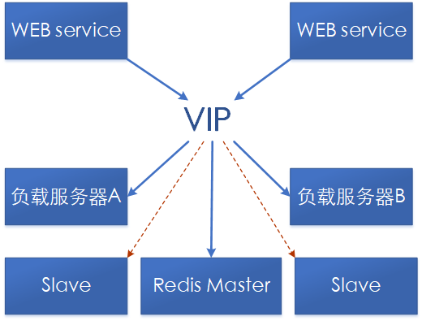
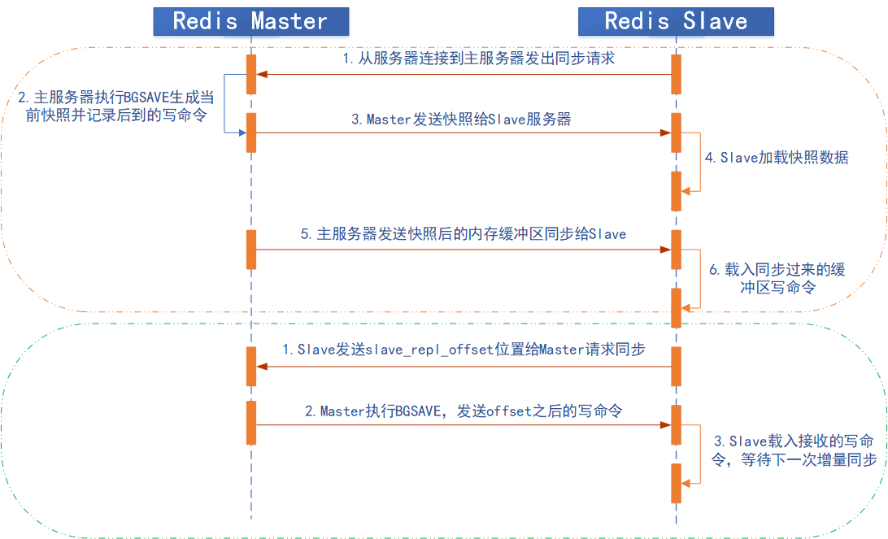
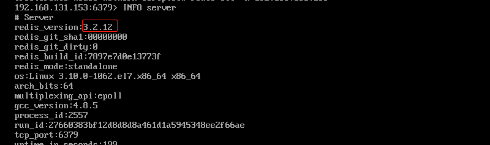
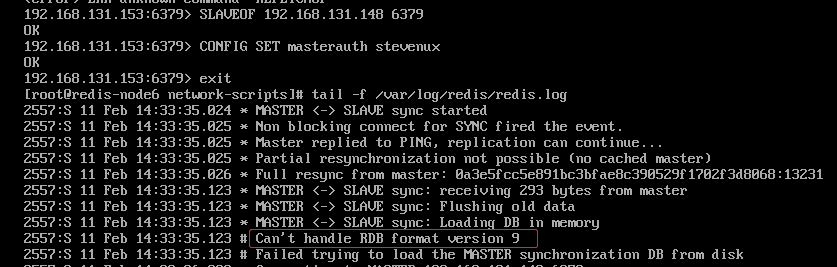
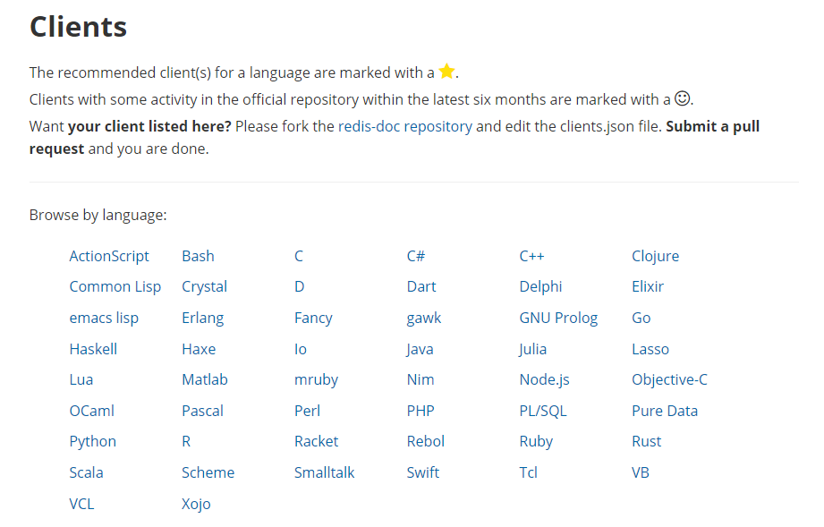

# Redis 高可用与集群

虽然 Redis 可以实现单机的数据持久化，但无论是 RDB 也好或者 AOF 也好，都解决
不了单点宕机问题，即一旦单台 redis 服务器本身出现系统故障、硬件故障等问题后，
就会直接造成数据的丢失，因此需要使用另外的技术来解决单点问题。

# 一.Redis 主从

主备模式，可以实现 Redis 数据的跨主机备份。程序端连接到高可用负载的 VIP，然后
连接到负载服务器设置的 Redis 后端 real server，此模式不需要在程序里面配置
Redis 服务器的真实 IP 地址，当后期 Redis 服务器 IP 地址发生变更只需要更改
redis 相应的后端 real server 即可，可避免更改程序中的 IP 地址设置。



环境

| 主机               | IP              | 角色   |
| :----------------- | :-------------- | :----- |
| redis-server-node1 | 192.168.131.148 | Master |
| redis-node2        | 192.168.131.149 | Slave  |

## 1.1 Redis 主从复制主要配置

Redis Slave 也要开启持久化并设置和 master 同样的连接密码，因为后期 slave 会
有提升为 master 的可能，Slave 端切换 master 同步后会丢失之前的所有数据。一旦
某个 Slave 成为一个 master 的 slave，Redis Slave 服务会清空当前 redis 服务
器上的所有数据并将 master 的数据导入到自己的内存，但是断开同步关系后不会删除当
前已经同步过的数据。

### 1.1.1 通过命令行配置

```bash
192.168.131.149:6379> REPLICAOF 192.168.131.148 6379
OK
192.168.131.149:6379> CONFIG SET masterauth stevenux
OK
(1.71s)
```

### 1.1.2 查看同步日志

Slave

```bash
[root@redis-node2 ~]# tail -f /var/log/redis.log
7160:S 11 Feb 2020 11:35:55.542 * Connecting to MASTER 192.168.131.148:6379
7160:S 11 Feb 2020 11:35:55.542 * MASTER <-> REPLICA sync started
7160:S 11 Feb 2020 11:35:55.542 * Non blocking connect for SYNC fired the event.
7160:S 11 Feb 2020 11:35:55.543 * Master replied to PING, replication can continue...
7160:S 11 Feb 2020 11:35:55.544 * Partial resynchronization not possible (no cached master)
7160:S 11 Feb 2020 11:35:55.546 * Full resync from master: 0a3e5fcc5e891bc3bfae8c390529f1702f3d8068:546   # 首次连接全量复制
7160:S 11 Feb 2020 11:35:55.629 * MASTER <-> REPLICA sync: receiving 176 bytes from master
7160:S 11 Feb 2020 11:35:55.630 * MASTER <-> REPLICA sync: Flushing old data
7160:S 11 Feb 2020 11:35:55.630 * MASTER <-> REPLICA sync: Loading DB in memory
7160:S 11 Feb 2020 11:35:55.630 * MASTER <-> REPLICA sync: Finished with success
```

Master

```bash
[root@redis-server-node1 ~]# tail -f /var/log/redis.log
2976:M 11 Feb 2020 11:32:03.391 * Synchronization with replica 192.168.131.149:6379 succeeded
2976:M 11 Feb 2020 11:32:04.541 # Connection with replica client id #86 lost.
2976:M 11 Feb 2020 11:35:55.546 * Replica 192.168.131.149:6379 asks for synchronization
2976:M 11 Feb 2020 11:35:55.546 * Full resync requested by replica 192.168.131.149:6379
2976:M 11 Feb 2020 11:35:55.546 * Starting BGSAVE for SYNC with target: disk
2976:M 11 Feb 2020 11:35:55.546 * Background saving started by pid 3185
3185:C 11 Feb 2020 11:35:55.549 * DB saved on disk
3185:C 11 Feb 2020 11:35:55.550 * RDB: 0 MB of memory used by copy-on-write
2976:M 11 Feb 2020 11:35:55.630 * Background saving terminated with success
2976:M 11 Feb 2020 11:35:55.630 * Synchronization with replica 192.168.131.149:6379 succeeded
```

### 1.1.3 查看 Master-Slave 状态

Master 状态

```bash
[root@redis-server-node1 redis]# redis-cli -h 192.168.131.148
192.168.131.148:6379> info replication
NOAUTH Authentication required.
192.168.131.148:6379> AUTH stevenux
OK
192.168.131.148:6379> info replication
# Replication
role:master
connected_slaves:1   # 连接的从库数
slave0:ip=192.168.131.149,port=6379,state=online,offset=0,lag=3 # 从库的具体情况
master_replid:0a3e5fcc5e891bc3bfae8c390529f1702f3d8068 # 主库复制ID
master_replid2:0000000000000000000000000000000000000000
master_repl_offset:154
second_repl_offset:-1
repl_backlog_active:1
repl_backlog_size:1048576
repl_backlog_first_byte_offset:1
repl_backlog_histlen:154
```

Slave 状态

```bash
192.168.131.149:6379> info replication
# Replication
role:slave
master_host:192.168.131.148
master_port:6379
master_link_status:up   # 主库在线
master_last_io_seconds_ago:7
master_sync_in_progress:0
slave_repl_offset:560
slave_priority:100
slave_read_only:1   # 从库只读
connected_slaves:0
master_replid:0a3e5fcc5e891bc3bfae8c390529f1702f3d8068  # 主库复制ID
master_replid2:0000000000000000000000000000000000000000
master_repl_offset:560
second_repl_offset:-1
repl_backlog_active:1
repl_backlog_size:1048576
repl_backlog_first_byte_offset:547
repl_backlog_histlen:14
```

### 1.1.4 修改配置永久生效

Master

```bash
[root@redis-server-node1 ~]# vim /apps/redis/etc/redis.conf
################################## SECURITY ###################################
requirepass stevenux
...
```

Slave

```bash
[root@redis-node2 ~]# vim /apps/redis/etc/redis.conf
################################# REPLICATION #################################
replicaof 192.168.131.148 6379
masterauth stevenux
...
```

### 1.1.5 重启并验证数据一致性

Master

```bash
192.168.131.148:6379> SET keyone lisuo
OK
192.168.131.148:6379> GET keyone
"lisuo"
192.168.131.148:6379> LPUSH menu apple banana
(integer) 2
192.168.131.148:6379> LPUSH menu pine
(integer) 3
192.168.131.148:6379> LRANGE menu 0 -1
1) "pine"
2) "banana"
3) "apple"
```

Slave

```bash
192.168.131.149:6379> KEYS *
1) "menu"
2) "keyone"
192.168.131.149:6379> LRANGE menu 0 -1
1) "pine"
2) "banana"
3) "apple"
192.168.131.149:6379> GET keyone
"lisuo"
```

Slave 只读不可写

```bash
192.168.131.149:6379> SET KEY0 V0
(error) READONLY You can't write against a read only replica.
```

### 1.1.6 Master 日志

有数据变动后 Master 的日志

```bash
[root@redis-server-node1 ~]# tail -f /var/log/redis.log
2976:M 11 Feb 2020 11:32:03.391 * Synchronization with replica 192.168.131.149:6379 succeeded
2976:M 11 Feb 2020 11:32:04.541 # Connection with replica client id #86 lost.
2976:M 11 Feb 2020 11:35:55.546 * Replica 192.168.131.149:6379 asks for synchronization
2976:M 11 Feb 2020 11:35:55.546 * Full resync requested by replica 192.168.131.149:6379
2976:M 11 Feb 2020 11:35:55.546 * Starting BGSAVE for SYNC with target: disk
2976:M 11 Feb 2020 11:35:55.546 * Background saving started by pid 3185
3185:C 11 Feb 2020 11:35:55.549 * DB saved on disk
3185:C 11 Feb 2020 11:35:55.550 * RDB: 0 MB of memory used by copy-on-write
2976:M 11 Feb 2020 11:35:55.630 * Background saving terminated with success
2976:M 11 Feb 2020 11:35:55.630 * Synchronization with replica 192.168.131.149:6379 succeeded
2976:M 11 Feb 2020 11:45:29.674 * Background saving started by pid 3344
3344:C 11 Feb 2020 11:45:29.675 * DB saved on disk
3344:C 11 Feb 2020 11:45:29.675 * RDB: 0 MB of memory used by copy-on-write
2976:M 11 Feb 2020 11:45:29.706 * Background saving terminated with success
2976:M 11 Feb 2020 12:00:30.031 * 1 changes in 900 seconds. Saving...    # 数据变动(有业务活动)
2976:M 11 Feb 2020 12:00:30.031 * Background saving started by pid 3490
3490:C 11 Feb 2020 12:00:30.032 * DB saved on disk   # (RDB保存完成)
3490:C 11 Feb 2020 12:00:30.032 * RDB: 0 MB of memory used by copy-on-write
2976:M 11 Feb 2020 12:00:30.132 * Background saving terminated with success
```

有数据变动后 Slave 的同步日志

```bash
[root@redis-node2 ~]# tail -f /var/log/redis.log
7160:S 11 Feb 2020 11:35:55.542 * Connecting to MASTER 192.168.131.148:6379
7160:S 11 Feb 2020 11:35:55.542 * MASTER <-> REPLICA sync started
7160:S 11 Feb 2020 11:35:55.542 * Non blocking connect for SYNC fired the event.
7160:S 11 Feb 2020 11:35:55.543 * Master replied to PING, replication can continue...
7160:S 11 Feb 2020 11:35:55.544 * Partial resynchronization not possible (no cached master)
7160:S 11 Feb 2020 11:35:55.546 * Full resync from master: 0a3e5fcc5e891bc3bfae8c390529f1702f3d8068:546  # 首次连接全量复制开始
7160:S 11 Feb 2020 11:35:55.629 * MASTER <-> REPLICA sync: receiving 176 bytes from master
7160:S 11 Feb 2020 11:35:55.630 * MASTER <-> REPLICA sync: Flushing old data
7160:S 11 Feb 2020 11:35:55.630 * MASTER <-> REPLICA sync: Loading DB in memory
7160:S 11 Feb 2020 11:35:55.630 * MASTER <-> REPLICA sync: Finished with success # 全量复制结束
7160:S 11 Feb 2020 11:50:56.009 * 1 changes in 900 seconds. Saving...
7160:S 11 Feb 2020 11:50:56.010 * Background saving started by pid 7194
7194:C 11 Feb 2020 11:50:56.010 * DB saved on disk
7194:C 11 Feb 2020 11:50:56.011 * RDB: 0 MB of memory used by copy-on-write
7160:S 11 Feb 2020 11:50:56.110 * Background saving terminated with success
7160:S 11 Feb 2020 12:05:57.044 * 1 changes in 900 seconds. Saving...  # 主从同步后数据化变动
7160:S 11 Feb 2020 12:05:57.045 * Background saving started by pid 7256
7256:C 11 Feb 2020 12:05:57.045 * DB saved on disk  # RDB文件保存到吸盘
7256:C 11 Feb 2020 12:05:57.046 * RDB: 0 MB of memory used by copy-on-write
7160:S 11 Feb 2020 12:05:57.146 * Background saving terminated with success
```

### 1.1.7 主从复制过程

Redis 支持主从复制分为全量同步和增量同步，首次同步是全量同步，主从同步可以让
从服务器从主服务器备份数据，而且从服务器还可与有从服务器，即另外一台 redis
服务器可以从一台从服务器进行数据同步，redis 的主从同步是非阻塞的，master 收
到从服务器的 sync(2.8 版本之前是 PSYNC)命令会 fork 一个子进程在后台执行
BGSAVE 命令，并将新写入的数据写入到一个缓冲区里面，bgsave 执行完成之后并生
成的将 RDB 文件发送给客户端，客户端将收到后的 RDB 文件载入自己的内存，然后
redis master 再将缓冲区的内容在全部发送给 redis slave，之后的同步 slave 服
务器会发送一个 offset 的位置(等同于 MySQL 的 binlog 的位置)给主服务器，主服
务器检查后位置没有错误将此位置之后的数据包括写在缓冲区的积压数据发送给 redis
从服务器，从服务器将主服务器发送的挤压数据写入内存，这样一次完整的数据同步，
再之后再同步的时候从服务器只要发送当前的 offset 位 置给主服务器，然后主服务器
根据相应的位置将之后的数据发送给从服务器保存到其内存即可。

Redis 全量复制一般发生在 Slave 首次初始化阶段，这时 Slave 需要将 Master 上的
所有数据都复制一份。具体主从同步骤如下：

1. 从服务器连接主服务器，发送 SYNC 命令；
2. 主服务器接收到 SYNC 命名后，开始执行 BGSAVE 命令生成 RDB 快照文件并使用缓冲
   区记录此后执行的所有写命令；
3. 主服务器 BGSAVE 执行完后，向所有从服务器发送快照文件，并在发送期间继续记录被
   执行的写命令；
4. 从服务器收到快照文件后丢弃所有旧数据，载入收到的快照；
5. 主服务器快照发送完毕后开始向从服务器发送缓冲区中的写命令；
6. 从服务器完成对快照的载入，开始接收命令请求，并执行来自主服务器缓冲区的写命令；
7. 后期同步会先发送自己 slave_repl_offset 位置，只同步新增加的数据，不再全量同步。

如下：橙框中全量同步过程，绿框部分同步


### 1.1.8 主从同步的优化配置

Redis 在 2.8 版本之前没有提供增量部分复制的功能，当网络闪断或者 slave Redis 重启
之后会导致主从之间的全量同步，即从 2.8 版本开始增加了部分复制的功能。

```bash
repl-diskless-sync no
   # 是否使用无盘同步RDB文件，默认为no，no为不使用无盘，需要将RDB文件保存到磁盘后
   # 再发送给slave，yes为支持无盘，支持无盘就是RDB文件不需要保存至本地磁盘，而且直
   # 接通过socket文件发送给slave。

repl-diskless-sync-delay 5
   # Master准备好RDB文件后等等待传输时间

repl-ping-slave-period 10
   # slave端向server端发送ping的时间区间设置，默认为10秒

repl-timeout 60
   # 设置复制超时时间

repl-disable-tcp-nodelay no
   # 是否启用TCP_NODELAY，如设置成yes，则redis会合并小的TCP包从而节省带宽，但会增加
   # 同步延迟（40ms），造成master与slave数据不一致，假如设置成no，则redis master会
   # 立即发送同步数据，没有延迟，前者关注性能，后者关注redis服务中的数据一致性。

repl-backlog-size 1mb
   # master的写入数据缓冲区，用于记录自上一次同步后到下一次同步过程中间的写入命令，
   # 计算公式：repl-backlog-size = 允许从节点最大中断时长 * 主实例offset每秒写入量
   # 比如master每秒最大写入64mb，最大允许60秒，那么就要设置为64mb*60秒=3840MB(3.8G)
 
repl-backlog-ttl 3600
   # 如果一段时间后没有slave连接到master，则backlog size的内存将会被释放。如果值
   # 为0则表示永远不释放这部份内存。 slave-priority 100 #slave端的优先级设置，值是
   # 一个整数，数字越小表示优先级越高。当master故障时将会按照优先级来选择slave端进行
   # 恢复，如果值设置为0，则表示该slave永远不会被选择。
 
#min-slaves-to-write 1
   # 设置一个master端的可用slave至少多少

#min-slaves-max-lag 20
   # 设置所有slave延迟时间都大于多少秒时，master不接收写操作(拒绝写入)。
```

### 1.1.9 Slave 切换为 Master

Master 的切换会导致 master_replid 发生变化，slave 之前的 master_replid 就和
当前 master 不一致从而会引发所有 slave 的全量同步。Slave 切换为 Master 很简单，
只需要运行`SLAVEOF no one`即可。

查看当前 Slave 情况：

```bash
192.168.131.149:6379> info replication
# Replication
role:slave
master_host:192.168.131.148
master_port:6379
master_link_status:up
master_last_io_seconds_ago:3
master_sync_in_progress:0
...
```

停止 Slave 同步并查看状态：

```bash
192.168.131.149:6379> SLAVEOF no one
OK
192.168.131.149:6379> info replication
# Replication
role:master
connected_slaves:0
master_replid:bfc98f9b16833d6c7c9638c34ef4a9be4ccc7999
master_replid2:0a3e5fcc5e891bc3bfae8c390529f1702f3d8068
master_repl_offset:13231
second_repl_offset:13232
repl_backlog_active:1
repl_backlog_size:1048576
repl_backlog_first_byte_offset:547
repl_backlog_histlen:12685
```

测试此时是否能写入数据：

```bash
192.168.131.149:6379> set keytest hello
OK
192.168.131.149:6379> get keytest
"hello"
```

失去连接后 Master 日志

```bash
...
2976:M 11 Feb 2020 14:04:51.220 # Connection with replica 192.168.131.149:6379 lost
```

失去连接后 Slave 日志

```bash
...
7160:M 11 Feb 2020 14:04:51.202 # Connection with master lost.
7160:M 11 Feb 2020 14:04:51.202 * Caching the disconnected master state.
7160:M 11 Feb 2020 14:04:51.202 * Discarding previously cached master state.
7160:M 11 Feb 2020 14:04:51.202 * MASTER MODE enabled (user request from 'id=23 addr=192.168.131.149:33746 fd=8 name= age=5 idle=0 flags=N db=0 sub=0 psub=0 multi=-1 qbuf=34 qbuf-free=32734 obl=0 oll=0 omem=0 events=r cmd=slaveof')
7160:M 11 Feb 2020 14:05:48.724 * 1 changes in 900 seconds. Saving...
7160:M 11 Feb 2020 14:05:48.724 * Background saving started by pid 7514
7514:C 11 Feb 2020 14:05:48.728 * DB saved on disk
7514:C 11 Feb 2020 14:05:48.728 * RDB: 0 MB of memory used by copy-on-write
7160:M 11 Feb 2020 14:05:48.825 * Background saving terminated with success
```

## 1.2 Trouble Shooting

### 1.2.1 Slave 端未正确设置 master 验证密码

master 密码为 stevenux，设置为 123456 试试：

```bash
192.168.131.149:6379> REPLICAOF 192.168.131.148 6379
OK
192.168.131.149:6379> CONFIG SET masterauth 123456
OK
192.168.131.149:6379> info replication
# Replication
role:slave
master_host:192.168.131.148
master_port:6379
master_link_status:down  # 显示master未连接
master_last_io_seconds_ago:-1
master_sync_in_progress:0
...
```

Slave 的日志

```bash
...
7160:S 11 Feb 2020 14:12:09.761 * Connecting to MASTER 192.168.131.148:6379
7160:S 11 Feb 2020 14:12:09.761 * MASTER <-> REPLICA sync started
7160:S 11 Feb 2020 14:12:09.763 * Non blocking connect for SYNC fired the event.
7160:S 11 Feb 2020 14:12:09.763 * Master replied to PING, replication can continue...
7160:S 11 Feb 2020 14:12:09.764 # Unable to AUTH to MASTER: -ERR invalid password

```

### 1.2.2 Redis 版本不一致

Redis Master 使用 5.0.7 版本，Redis Slave 使用 3.2.12 版本


Slave 日志提示 DRB 格式不兼容


### 1.2.3 无法远程连接

在开启了安全模式情况下，没有设置 bind 地址或者密码导致。

```bash
protected-mode yes # 该选项开启安全模式
bind 0.0.0.0 # 表示可以从任意地址连接redis
requirepass www.suosuoli.cn # 设置密码
```

# 二.Redis 集群

Redis 的主从架构无法实现 master 和 slave 角色的自动切换，即当 master 出现 redis 服务
异常、主机断电、磁盘损坏等问题导致 master 无法使用，而 redis 高可用无法实现自故障转移
(将 slave 提升为 master)，需要手动改环境配置才能切换到 slave redis 服务器，另外也无法
横向扩展 Redis 服务的并行写入性能，当单台 Redis 服务器性能无法满足业务写入需求的时候就
必须需要一种方式解决以上的两个核心问题。即：

1. master 和 slave 角色的无缝切换，让业务无感知从而不影响业务使用
2. 可以横向动态扩展 Redis 服务器，从而实现多台服务器并行写入以实现更高并发的目的。

Redis 集群有多种实现方式
: 客户端分片方式
: 代理分片
: Redis Cluster

## 2.1 Sentinel-Redis 哨兵机制

Sentinel 进程用于监控 redis 集群中 Master 主服务器工作的状态，在 Master 主服务器
发生故障的时候，可以实现 Master 和 Slave 服务器的切换，保证系统的高可用，其已经被
集成在 redis2.6+的版本中。

Redis 的哨兵机制到了 2.8 版本之后就稳定了下来。一般在生产环境也建议使用 Redis 的
2.8 版本的以后版本。

哨兵(Sentinel) 是一个分布式系统，可以在一个架构中运行多个哨兵(sentinel) 进程，这些
进程使用流言协议(gossip protocols)来接收关于 Master 主服务器是否下线的信息，并使用
投票协议(Agreement Protocols)来决定是否执行自动故障迁移，以及选择哪个 Slave 作为新
的 Master。每个哨兵(Sentinel)进程会向其它哨兵(Sentinel)、Master、Slave 定时发送消
息，以确认对方是否"活"着，如果发现对方在指定配置时间(可配置的)内未得到回应，则暂时认
为对方已掉线，也就是所谓的"主观认为宕机"，主观是每个成员都具有的独自的而且可能相同
也可能不同的意识，英文名称：Subjective Down，简称 SDOWN。有主观宕机，肯定就有客观宕
机。当"哨兵群"中的多数 Sentinel 进程在对 Master 主服务器做出 SDOWN 的判断，并且通过
SENTINEL is-master-down-by-addr 命令互相交流之后，得出的 Master Server 下线判断，
这种方式就是**"客观宕机"**，客观是不依赖于某种意识而已经实际存在的一切事物，英文名称是：
Objectively Down，简称 ODOWN。通过一定的 vote 算法，从剩下的 slave 从服务器节点中，
选一台提升为 Master 服务器节点，然后自动修改相关配置，并开启故障转移(failover)。

Sentinel 机制可以解决 master 和 slave 角色的切换问题。

### 2.1.1 手动配置主从复制

环境

| 主机               | IP              | 角色   |
| :----------------- | :-------------- | :----- |
| redis-server-node1 | 192.168.131.148 | Master |
| redis-node2        | 192.168.131.149 | Slave  |
| redis-node3        | 192.168.131.150 | Slave  |

新增一台 Slave：192.168.131.150 的配置

```bash
192.168.131.150:6379> REPLICAOF 192.168.131.148 6379
OK
192.168.131.150:6379> CONFIG SET masterauth stevenux
OK
(2.27s)
```

增加后 Master 的状态

```bash
192.168.131.148:6379> auth stevenux
OK
192.168.131.148:6379> info replication
# Replication
role:master
connected_slaves:2
slave0:ip=192.168.131.149,port=6379,state=online,offset=13427,lag=1
slave1:ip=192.168.131.150,port=6379,state=online,offset=0,lag=0
master_replid:85f9d986a9f7e06d5bf273d8b1004d517e20a7ea
master_replid2:0000000000000000000000000000000000000000
master_repl_offset:13427
second_repl_offset:-1
repl_backlog_active:1
repl_backlog_size:1048576
repl_backlog_first_byte_offset:13232
repl_backlog_histlen:196
```

查看新增的 Slave 数据同步情况

```bash
[root@redis-node3 ~]# redis-cli -h 192.168.131.150
192.168.131.150:6379> KEYS *
1) "key3"
2) "keyone"
3) "zset1"
4) "menu"
5) "set1"
# 同步正常
```

#### 2.1.1.1 故障转移时程序连接 Redis

[Redis 各种客户端的官方文档](https://redis.io/clients)


java 客户端连接 redis 是通过 Jedis 来实现的，java 代码用的时候只要创建 Jedis 对
象就可以建多个 Jedis 连接池来连接 redis，应用程序再直接调用连接池即可连接 Redis。

而 Redis 为了保障高可用,服务一般都是 Sentinel 部署方式，当 Redis 服务中的主服务
挂掉之后,会仲裁出另外一台 Slaves 服务充当 Master。这个时候,我们的应用即使使用了
Jedis 连接池,Master 服务挂了,我们的应用将还是无法连接新的 Master 服务，为了解决
这个问题, Jedis 也提供了相应的 Sentinel 实现,能够在 Redis Sentinel 主从切换时候,
通知我们的应用,把我们的应用连接到新的 Master 服务。

在使用程序连接 Redis 时 Redis Sentinel 的使用也是十分简单的,只是在 JedisPool 中
添加了 Sentinel 和 MasterName 参数，JRedis Sentinel 底层基于 Redis 订阅实现
Redis 主从服务的切换通知，当 Reids 发生主从切换时，Sentinel 会发送通知主动通知
Jedis 进行连接的切换，JedisSentinelPool 在每次从连接池中获取链接对象的时候,都要
对连接对象进行检测,如果此链接和 Sentinel 的 Master 服务连接参数不一致,则会关闭此
连接,重新获取新的 Jedis 连接对象。

### 2.1.2 编辑哨兵配置文件

哨兵可以与 Redis 服务器分开部署，实际使用中一般配置在同一台主机

Master:192.168.131.148

```bash

```

Slave:192.168.131.149
Slave:192.168.131.150

### 2.1.3 启动哨兵

Master:192.168.131.148

```bash
[root@redis-server-node1 ~]# /apps/redis/bin/redis-sentinel /apps/redis/etc/sentinel.conf
[root@redis-server-node1 ~]# ss -ntl
State      Recv-Q Send-Q            Local Address:Port             Peer Address:Port
LISTEN     0      100                   127.0.0.1:25                          *:*
LISTEN     0      128                   127.0.0.1:9000                        *:*
LISTEN     0      50                            *:3306                        *:*
LISTEN     0      511                           *:26379                       *:*
LISTEN     0      511                           *:6379                        *:*
LISTEN     0      128                           *:111                         *:*
LISTEN     0      128                           *:22                          *:*
LISTEN     0      100                       [::1]:25                       [::]:*
LISTEN     0      128                        [::]:111                      [::]:*
LISTEN     0      128                        [::]:22                       [::]:*
```

Slave:192.168.131.149

```bash
[root@redis-node2 etc]# /apps/redis/bin/redis-sentinel /apps/redis/etc/sentinel.conf
[root@redis-node2 etc]# ss -ntl
State      Recv-Q Send-Q              Local Address:Port         Peer Address:Port
LISTEN     0      100                       127.0.0.1:25                 *:*
LISTEN     0      511                 192.168.131.149:26379              *:*
LISTEN     0      511                               *:6379               *:*
LISTEN     0      128                               *:111                *:*
LISTEN     0      128                               *:80                 *:*
LISTEN     0      128                               *:22                 *:*
LISTEN     0      100                           [::1]:25              [::]:*
LISTEN     0      128                            [::]:111             [::]:*
LISTEN     0      128                            [::]:22              [::]:*
```

Slave:192.168.131.150

```bash
[root@redis-node3 etc]# /apps/redis/bin/redis-sentinel /apps/redis/etc/sentinel.conf
[root@redis-node3 etc]# ss -ntl
State      Recv-Q Send-Q              Local Address:Port             Peer Address:Port
LISTEN     0      100                     127.0.0.1:25                          *:*
LISTEN     0      511               192.168.131.150:26379                       *:*
LISTEN     0      511                             *:6379                        *:*
LISTEN     0      128                             *:111                         *:*
LISTEN     0      128                             *:80                          *:*
LISTEN     0      128                             *:22                          *:*
LISTEN     0      100                         [::1]:25                       [::]:*
LISTEN     0      128                          [::]:111                      [::]:*
LISTEN     0      128                          [::]:80                       [::]:*
LISTEN     0      128                          [::]:22                       [::]:*
```

**哨兵服务日志**

```bash
[root@redis-server-node1 ~]# tail -f /apps/redis/logs/sentinel_26379.log
6752:X 11 Feb 2020 16:38:37.989 # Redis version=5.0.7, bits=64, commit=00000000, modified=0, pid=6752, just started
6752:X 11 Feb 2020 16:38:37.989 # Configuration loaded
6753:X 11 Feb 2020 16:38:37.990 * Increased maximum number of open files to 10032 (it was originally set to 1024).
6753:X 11 Feb 2020 16:38:37.991 * Running mode=sentinel, port=26379.
6753:X 11 Feb 2020 16:38:37.991 # Sentinel ID is e67caf2137b93d25c9b3ae98f4da1b37722c33ae
6753:X 11 Feb 2020 16:38:37.992 # +monitor master mymaster 192.168.131.148 6379 quorum 2
6753:X 11 Feb 2020 16:38:37.992 * +slave slave 192.168.131.149:6379 192.168.131.149 6379 @ mymaster 192.168.131.148 6379
6753:X 11 Feb 2020 16:38:37.993 * +slave slave 192.168.131.150:6379 192.168.131.150 6379 @ mymaster 192.168.131.148 6379
6753:X 11 Feb 2020 16:38:48.759 * +sentinel sentinel e6a6c4e2aeac5e259d2fab347e14ebe8c260b875 192.168.131.149 26379 @ mymaster 192.168.131.148 6379
6753:X 11 Feb 2020 16:38:57.607 * +sentinel sentinel d1322d808ebd2abd6e65fad6f53599aa4eb11ddc 192.168.131.150 26379 @ mymaster 192.168.131.148 6379
```

### 2.1.4 停止 Redis Master 测试故障转移

**查看 Redis Master 状态**

```bash
192.168.131.148:6379> info replication
# Replication
role:master
connected_slaves:2
slave0:ip=192.168.131.149,port=6379,state=online,offset=91470,lag=1
slave1:ip=192.168.131.150,port=6379,state=online,offset=91470,lag=1
master_replid:85f9d986a9f7e06d5bf273d8b1004d517e20a7ea
master_replid2:0000000000000000000000000000000000000000
master_repl_offset:91615
second_repl_offset:-1
repl_backlog_active:1
repl_backlog_size:1048576
repl_backlog_first_byte_offset:13232
repl_backlog_histlen:78384
```

**当前 sentinel 状态**

在 sentinel 状态中尤其是最后一行，涉及到 masterIP 是多少，有几个 slave，有几个
sentinels，必须是符合全部服务器数量的。

```bash
[root@redis-server-node1 ~]# redis-cli -h 192.168.131.148 -p 26379
192.168.131.148:26379> info sentinel
# Sentinel
sentinel_masters:1
sentinel_tilt:0
sentinel_running_scripts:0
sentinel_scripts_queue_length:0
sentinel_simulate_failure_flags:0
master0:name=mymaster,status=ok,address=192.168.131.148:6379,slaves=2,sentinels=3
# 最后一行指明masterIP和Slave个数及Sentinel个数
```

**停止 Master**

```bash
[root@redis-server-node1 ~]# systemctl stop redis
[root@redis-server-node1 ~]# ss -ntl
State       Recv-Q Send-Q                     Local Address:Port                                    Peer Address:Port
LISTEN      0      100                            127.0.0.1:25                                                 *:*
LISTEN      0      128                            127.0.0.1:9000                                               *:*
LISTEN      0      50                                     *:3306                                               *:*
LISTEN      0      511                                    *:26379                                              *:*
```

### 2.1.5 故障转移过程 Sentinel 日志分析

单台服务器中，将 Master 停止后，选举 redis-node3(192.168.131.150) 为新的 Master

```bash
6011:X 11 Feb 2020 16:38:55.553 # oO0OoO0OoO0Oo Redis is starting oO0OoO0OoO0Oo
6011:X 11 Feb 2020 16:38:55.553 # Redis version=5.0.7, bits=64, commit=00000000, modified=0, pid=6011, just started
6011:X 11 Feb 2020 16:38:55.553 # Configuration loaded
6012:X 11 Feb 2020 16:38:55.555 * Increased maximum number of open files to 10032 (it was originally set to 1024).
6012:X 11 Feb 2020 16:38:55.555 * Running mode=sentinel, port=26379.

########################################## 当前Redis哨兵的运行ID
6012:X 11 Feb 2020 16:38:55.556 # Sentinel ID is d1322d808ebd2abd6e65fad6f53599aa4eb11ddc

########################################## 当前使用仲裁成员是2个
6012:X 11 Feb 2020 16:38:55.557 # +monitor master mymaster 192.168.131.148 6379 quorum 2
6012:X 11 Feb 2020 16:38:55.558 * +slave slave 192.168.131.149:6379 192.168.131.149 6379 @ mymaster 192.168.131.148 6379
6012:X 11 Feb 2020 16:38:55.559 * +slave slave 192.168.131.150:6379 192.168.131.150 6379 @ mymaster 192.168.131.148 6379
6012:X 11 Feb 2020 16:38:56.384 * +sentinel sentinel e67caf2137b93d25c9b3ae98f4da1b37722c33ae 192.168.131.148 26379 @ mymaster 192.168.131.148 6379
6012:X 11 Feb 2020 16:38:56.891 * +sentinel sentinel e6a6c4e2aeac5e259d2fab347e14ebe8c260b875 192.168.131.149 26379 @ mymaster 192.168.131.148 6379

########################################## 主观认为宕机
6012:X 11 Feb 2020 17:12:59.241 # +sdown master mymaster 192.168.131.148 6379

########################################## 仲裁后确认为宕机
6012:X 11 Feb 2020 17:12:59.305 # +odown master mymaster 192.168.131.148 6379 #quorum 2/2
6012:X 11 Feb 2020 17:12:59.305 # +new-epoch 1

########################################## 尝试故障转移
6012:X 11 Feb 2020 17:12:59.305 # +try-failover master mymaster 192.168.131.148 6379

########################################## 投票选取Master
6012:X 11 Feb 2020 17:12:59.308 # +vote-for-leader d1322d808ebd2abd6e65fad6f53599aa4eb11ddc 1
6012:X 11 Feb 2020 17:12:59.310 # e67caf2137b93d25c9b3ae98f4da1b37722c33ae voted for d1322d808ebd2abd6e65fad6f53599aa4eb11ddc 1
6012:X 11 Feb 2020 17:12:59.310 # e6a6c4e2aeac5e259d2fab347e14ebe8c260b875 voted for d1322d808ebd2abd6e65fad6f53599aa4eb11ddc 1
6012:X 11 Feb 2020 17:12:59.385 # +elected-leader master mymaster 192.168.131.148 6379

########################################## 故障转移主机为192.168.131.148
6012:X 11 Feb 2020 17:12:59.385 # +failover-state-select-slave master mymaster 192.168.131.148 6379

########################################## 故障转移目标为192.168.131.150
6012:X 11 Feb 2020 17:12:59.476 # +selected-slave slave 192.168.131.150:6379 192.168.131.150 6379 @ mymaster 192.168.131.148 6379
6012:X 11 Feb 2020 17:12:59.476 * +failover-state-send-slaveof-noone slave 192.168.131.150:6379 192.168.131.150 6379 @ mymaster 192.168.131.148 6379
6012:X 11 Feb 2020 17:12:59.532 * +failover-state-wait-promotion slave 192.168.131.150:6379 192.168.131.150 6379 @ mymaster 192.168.131.148 6379
6012:X 11 Feb 2020 17:13:00.279 # +promoted-slave slave 192.168.131.150:6379 192.168.131.150 6379 @ mymaster 192.168.131.148 6379
6012:X 11 Feb 2020 17:13:00.279 # +failover-state-reconf-slaves master mymaster 192.168.131.148 6379
6012:X 11 Feb 2020 17:13:00.350 * +slave-reconf-sent slave 192.168.131.149:6379 192.168.131.149 6379 @ mymaster 192.168.131.148 6379
6012:X 11 Feb 2020 17:13:01.377 * +slave-reconf-inprog slave 192.168.131.149:6379 192.168.131.149 6379 @ mymaster 192.168.131.148 6379
6012:X 11 Feb 2020 17:13:01.449 # -odown master mymaster 192.168.131.148 6379
6012:X 11 Feb 2020 17:16:00.291 # +failover-end-for-timeout master mymaster 192.168.131.148 6379
6012:X 11 Feb 2020 17:16:00.291 # +failover-end master mymaster 192.168.131.148 6379
6012:X 11 Feb 2020 17:16:00.291 * +slave-reconf-sent-be slave 192.168.131.150:6379 192.168.131.150 6379 @ mymaster 192.168.131.148 6379
6012:X 11 Feb 2020 17:16:00.291 * +slave-reconf-sent-be slave 192.168.131.149:6379 192.168.131.149 6379 @ mymaster 192.168.131.148 6379
6012:X 11 Feb 2020 17:16:00.291 # +switch-master mymaster 192.168.131.148 6379 192.168.131.150 6379
6012:X 11 Feb 2020 17:16:00.291 * +slave slave 192.168.131.149:6379 192.168.131.149 6379 @ mymaster 192.168.131.150 6379
6012:X 11 Feb 2020 17:16:00.291 * +slave slave 192.168.131.148:6379 192.168.131.148 6379 @ mymaster 192.168.131.150 6379
6012:X 11 Feb 2020 17:16:30.315 # +sdown slave 192.168.131.148:6379 192.168.131.148 6379 @ mymaster 192.168.131.150 6379

```

### 2.1.6 故障转移后配置文件会被修改

故障转移后 redis.conf 中的 `replicaof IP PORT` 行的 master IP 会被修改
sentinel.conf 中的 `sentinel monitor IP` 会被修改

redis-node2--Slave:192.168.131.149 原来的 IP 都指向
redis-server-node1--Master:192.168.131.148

故障转移后都被该为 192.168.131.150，即新选举的 Master

```bash
[root@redis-node2 etc]# vim /apps/redis/etc/redis.conf
################################# REPLICATION #################################
replicaof 192.168.131.150 6379
...

[root@redis-node2 etc]# vim /apps/redis/etc/sentinel.conf
# Default is 30 seconds.
sentinel monitor mymaster 192.168.131.150 6379 2
...
```

修改原 Master 的配置文件，将其 Master 指向新的 Master：192.168.131.150
新 Master 的复制状态:

```bash
127.0.0.1:6379> info replication
# Replication
role:master
connected_slaves:2
slave0:ip=192.168.131.148,port=6379,state=online,offset=897322,lag=0
slave1:ip=192.168.131.149,port=6379,state=online,offset=897322,lag=1
master_replid:f7f6ecbb5964ee44160654fbf82fedac3303ba67
master_replid2:85f9d986a9f7e06d5bf273d8b1004d517e20a7ea
master_repl_offset:897322
second_repl_offset:449770
repl_backlog_active:1
repl_backlog_size:1048576
repl_backlog_first_byte_offset:13722
repl_backlog_histlen:883601
```

## 2.2 Redis Cluster

### 2.2.1 Redis 集群架构

### 2.2.2 Redis 集群的部署

### 2.2.3 Redis Cluster 集群节点维护
