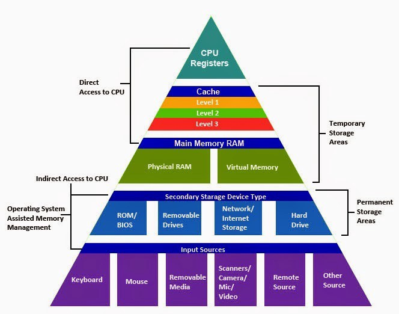
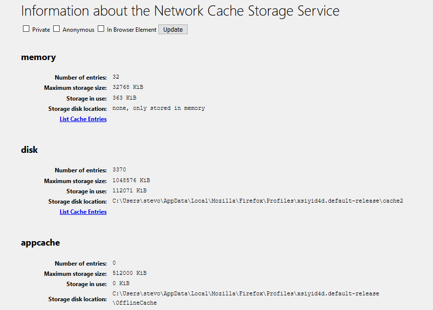
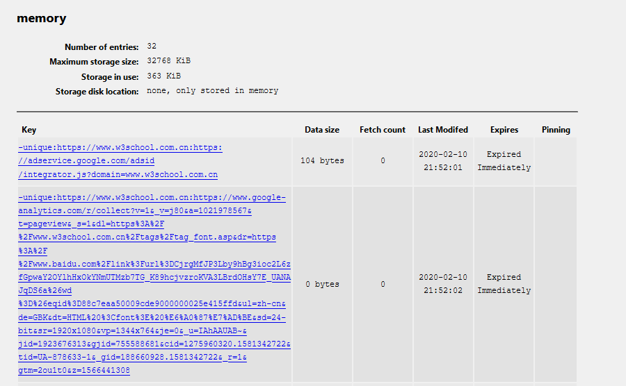
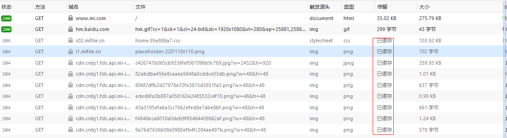
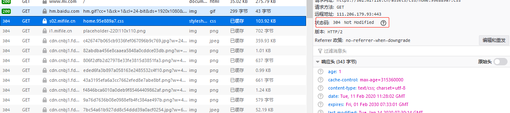
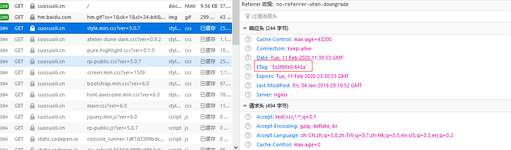
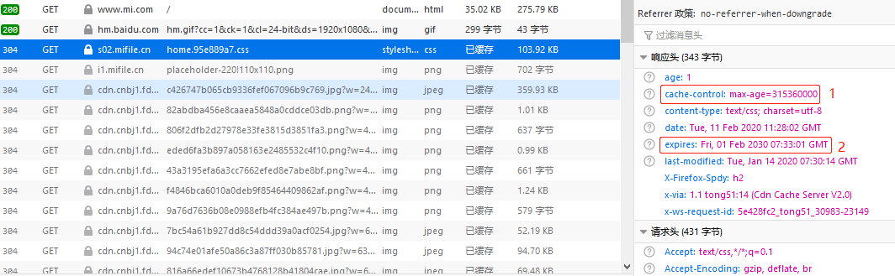
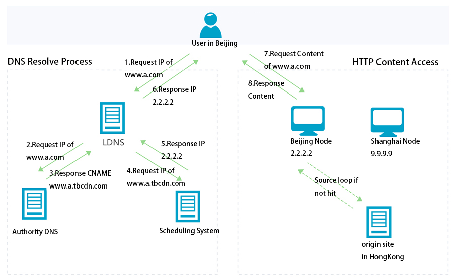
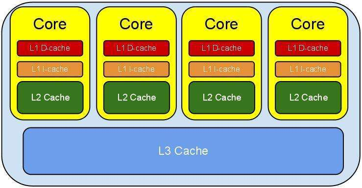
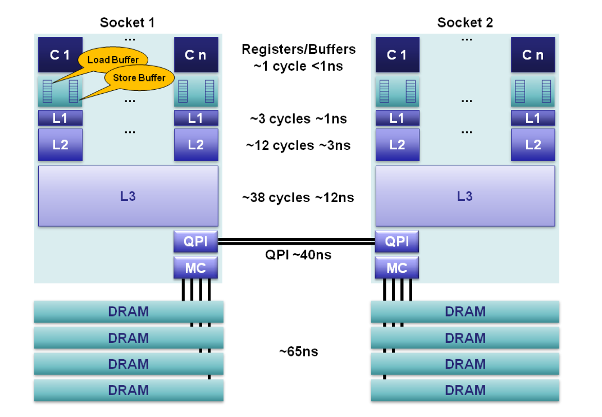

# 缓存介绍

## 1.1 缓存介绍

缓存是为了调节速度不一致的两个或多个不同的物质的速度，在中间对速度较快的一方起
到一个加速访问速度较慢的一方的作用，比如 CPU 的一级、二级缓存是保存了 CPU 最近
经常访问的数据，内存是保存 CPU 经常访问硬盘的数据，而且硬盘也有大小不一的缓存，
甚至是物理服务器的 raid 卡有也缓存，都是为了起到加速 CPU 访问硬盘数据的目的，
因为 CPU 的速度太快了，CPU 需要的数据由于硬盘往往不能在短时间内满足 CPU 的需求，
因此 PCU 缓存、 内存、Raid 卡缓存以及硬盘缓存就在一定程度上满足了 CPU 的数据需
求，即 CPU 从缓存读取数据可以大幅提高 CPU 的工作效率。
[这里有一篇比价生动的文章来描述缓存](http://www.sohu.com/a/246498483_468626)



### 1.1.1 系统缓存

#### 1.1.1.1 buffer 和 cache

**buffer**：缓冲也叫写缓冲，一般用于写操作，可以将数据先写入内存再写入磁盘，
buffer 一般用于写缓冲，用于解决不同介质的速度不一致的缓冲，先将数据临时写入
到里自己最近的地方，以提高写入速度，CPU 会把数据先写到内存的磁盘缓冲区，然后
就认为数据已经写入完成，然后由内核在后续的时间在写入磁盘，所以服务器突然断
电会丢失内存中的部分数据。buffer 内的数据一般会停留一次，就被移走。

**cache**：缓存也叫读缓存，一般用于读操作，CPU 读文件从内存读，如果内存没有
就先从硬盘读到内存再读到 CPU，将需要频繁读取的数据放在里自己最近的缓存区域，
下次读取的时候即可快速读取。cache 中的数据则可以部分的常时间驻于其中。cache
可以看作是 buffer 的特例。

StackExchange 论坛的提问：
**What is the difference between a cache and a buffer?**
用户 fluffy 解答：

```bash
It would be more accurate to say that a cache is a particular usage pattern of a buffer,
that implies multiple uses of the same data. Most uses of "buffer" imply that the data
will be drained or discarded after a single use (although this isn't necessarily the case),
whereas "cache" implies that the data will be reused multiple times. Caching also often
implies that the data is stored as it is also being simultaneously used, although this
isn't necessarily the case (as in pre-fetching and the like), whereas buffering implies
that the data is being stored up for later use.
```

#### 1.1.1.2 cache 特性

cache 内的数据都会过期，过期的时间长短由 cache 的设计算法决定

在 CPU 的 L1 和 L2 及 L3 级 cache 中，会将最近经常使用的指令或数据缓存在其中，
包括了数据 cache 和指令 cache。其设计使用了多种算法来淘汰数据或者缓存特定数据，
每次 CPU 从 cache 中得到指令或数据就叫命中，不从 cache 取得指令或数据就未命中。
cache 的重要指标之一就是命中率。

### 1.1.2 用户层缓存

#### 1.1.2.1 DNS 缓存

浏览器对 DNS 记录的缓存时间默认为 60 秒，即 60 秒之内在访问同一个域名就不在
进行 DNS 解析： 查看 chrome 浏览器的 DNS 缓存：`chrome://net-internals/#dns`


早期的 chrome 支持管理 DNS 缓存，新的版本已不支持，只有清除 cache 选项

火狐浏览器缓存：`about:cache`




#### 1.1.2.2 缓存过期机制

##### 使用最后修改时间

server 端系统调用文件的时候会获取文件的最后修改时间，如果没有发生变化就
返回给浏览器 304 的状态码，表示没有发生变化，然后浏览器就使用的本地的缓
存展示资源。

如果服务端返回最后修改时间没有发生过变化，则直接使用浏览器的本地缓存，
状态码就是 304




##### Etag 标记的作用

基于 Etag 标记是否一致做判断页面是否发生过变化，比如基于 Nginx 的配置指令
etag on 来实现 Etag 标记。


##### 过期时间控制

以上两种都需要发送请求，即不管资源是否过期都要发送请求进行协商，这样会消耗
不必要的时间，因此有了缓存的过期时间，即第一次请求资源的时候带一个资源的过
期时间，默认为 30 天，当前这种方式使用的比表较多，但是无法保证客户的时间都
是准确并且一致的，因此会加入一个最大生存周期，使用用户本地的时间计算缓存数
据是否超过多少天，下面的过期时间为 2030 年(2)，但是缓存的最大生存周期计算
为天等于 3650 天即 10 年(1)，过期时间如下：



### 1.1.3 CDN 缓存

#### 1.1.3.1 什么是 CDN?

内容分发网络(Content Delivery Network)，通过将服务内容分发至全网加速节点，
利用全球调度系统使用户能够就近获取，有效降低访问延迟，提升服务可用性，CDN
第一降低机房的使用带宽，因为很多资源通过 CDN 就直接返回用户了，第二解决不
同运营商之间的互联，因为可以让联通的网络访问联通让电信的网络访问电信，起到
加速用户访问的目的， 第三：解决用户访问的地域问题，就近返回用户资源。

[百度 CDN](https://cloud.baidu.com/product/cdn.html)
[阿里 CDN](https://www.aliyun.com/product/cdn?spm=5176.8269123.416540.50.728y8n)
[腾讯 CDN](https://www.qcloud.com/product/cdn)

#### 1.1.3.2 用户请求 CDN 的流程



#### 1.1.3.3 CDN 优势

CDN 服务器会提前对静态内容进行预缓存，避免大量的请求回源，导致主站网络带宽
被占用而导致数据无法更新，另外 CDN 可以将数据根据访问的热度不同而进行不同
级别的缓存，例如访问量最高的资源访问 CDN 边缘节点的内存，其次的放在 SSD 或
者 SATA，再其次的放在云存储，这样兼顾了速度与成本。缓存到最快的地方如内存，
缓存的数据准确命中率高，访问速度就快。

简要的说 CDN 主要有以下特点
: 调度准确-将用户调度到最近的边缘节点
: 性能优化-CDN 专门用于缓存响应速度快
: 安全相关-抵御攻击
: 节省带宽：由于用户请求由边缘节点响应，因此大幅降低到源站带宽

### 1.1.4 应用层缓存

Nginx、PHP 等 web 服务可以设置应用缓存以加速响应用户请求，另外有些解释性语言
比如 PHP/Python/Java 不能直接运行，需要先编译成字节码，但字节码需要解释器解
释为机器码之后才能执行，因此字节码也是一种缓存，有时候会出现程序代码上线后字
节码没有更新的现象，此时就需要设计相应的应用层缓存来避免此类情况。

### 1.1.5 其它类型的缓存

#### 1.1.5.1 CPU 内部的缓存

CPU 缓存(L1 数据缓存和 L1 指令缓存)、L2 二级缓存、L3 三级缓存

cache 层级



cache 速度(延迟)



#### 1.1.5.2 cookie 和 session

Cookie 是访问某些网站以后在本地存储的一些网站相关的信息，下次再访问的时候
减少一些步骤,比如加密后的账户名密码等信息 Cookies 是服务器在客户端浏览器
上存储的小段文本并随每一个请求发送至同一个服务器，是一种实现客户端保持状态
的方案。 session 称为会话信息，位于 web 服务器上，主要负责访问者与网站之
间的交互，当浏览器请求 http 地址时，可以基于之前的 session 实现会话保持、
session 共享等。

#### 1.1.5.3 session 和 cookie 区别

session 和 cookie 主要区别如下：

1. Cookie 以文本文件格式存储在浏览器中，而 session 存储在服务端。
2. cookie 的存储限制了数据量，只允许 4KB，而 session 是无限制的。
3. cookie 包含在每一个客户端请求报文中，因此容易被人捕获。
4. cookie 和 session 都可以设置过期时间。
