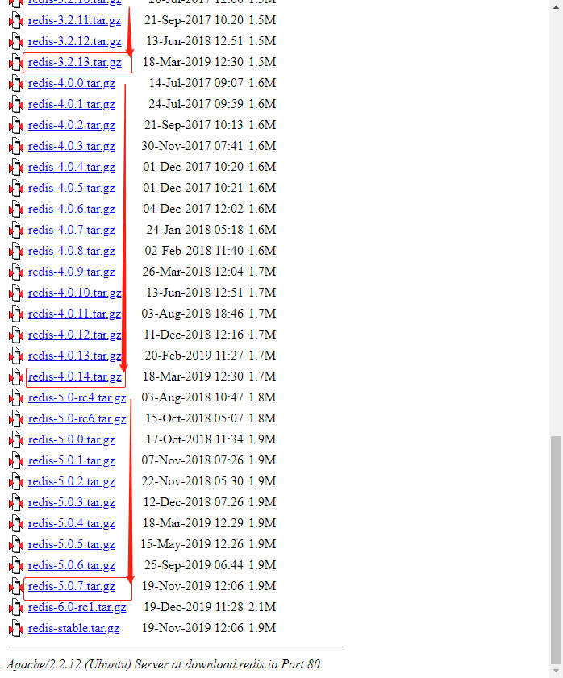
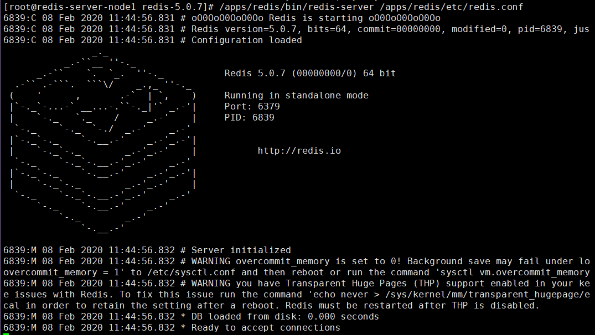
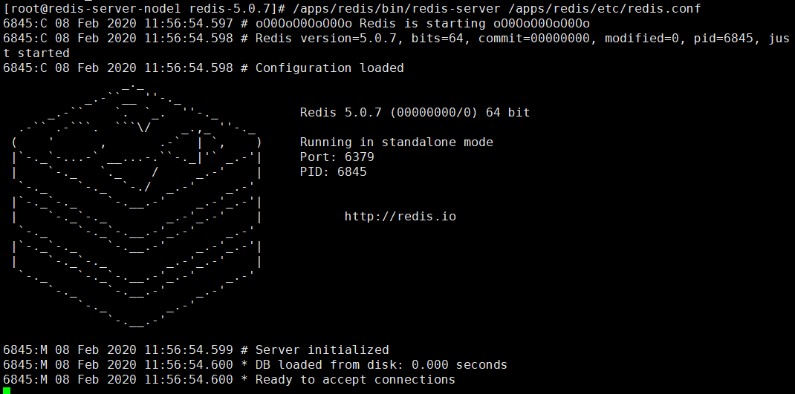

# 一.Redis 介绍

Redis 和 Memcached 都是非关系型数据库也称为 NoSQL 数据库，MySQL、
Mariadb、SQL Server、PostgreSQL、Oracle 数据库属于关系型数据
关系型数据库(RDBMS, Relational Database Management System)。

## 1.1 Redis 介绍

Redis(Remote Dictionary Server)在 2009 年发布，开发者 Salvatore Sanfilippo
是意大利开发者，他本想为自己的公司开发一个用于替换 MySQL 的产品 Redis，但
是没有想到他把 Redis 开源后大受欢迎，短短几年，Redis 就有了 大的用户群体，
目前国内外使用的公司有知乎网、新浪微博、GitHub 等

redis 是一个开源的、遵循 BSD 协议的、基于内存的而且目前比较流行的键值数据
库(key-value database)，是一个非关系型数据库，redis 提供将内存通过网络远
程共享的一种服务，提供类似功能的还有 memcache，但相比 memcache，redis 还
提供了易扩展、高性能、具备数据持久性等功能。

Redis 在高并发、低延迟环境要求比较高的环境使用量非常广泛，目前 redis 在
[DB-Engine 月排行榜](https://db-engines.com/en/ranking)中一直比较靠前，而且一直是键值型存储类的首位。

[Redis 官网地址](https://redis.io/)

## 1.2 Redis 对比 Memcached

Memcached 不支持数据持久化，而 Redis 支持数据的持久化：可以将内存中的数据
保持在磁盘中，重启 redis 服务或者服务器之后可以从备份文件中恢复数据到内存
继续使用。

1. Redis 支持更多的数据类型：支持 string(字符串)、hash(哈希数据)、
   list(列表)、set(集合)、zet(有序集合)

2. Redis 支持数据的备份：可以实现类似于数据的 master-slave 模式的数据备份，
   另外也支持使用快照+AOF。

3. Redis 支持更大的 value 数据：memcache 单个 key value 最大只支持 1MB，
   而 redis 最大支持 512MB。

4. Redis 是单线程，而 memcache 是多线程，所以单机情况下没有 memcache 并发
   高，但 redis 支持分布式集群以实现

5. Redis 支持更高的并发，单 Redis 实例可以实现数万并发。

6. Redis 支持集群横向扩展：基于 redis cluster 的横向扩展，可以实现分布式
   集群，大幅提升性能和数据安全性。Redis 和 memcached 都是基于 C 语言开发。

# 二.Redis 单机部署

## 2.1 Redis 安装

### 2.1.1 使用包管理器安装

Redis 属于 epel 源的软件，centos 需要安装 epel 源

```bash
[root@redis-server-node1 ~]# yum install epel-release -y
Loaded plugins: fastestmirror
Loading mirror speeds from cached hostfile
 * base: mirrors.huaweicloud.com
 * epel: mirror.lzu.edu.cn
 * extras: mirrors.huaweicloud.com
 * updates: mirror.bit.edu.cn
Installed Packages
redis.x86_64                                             3.2.12-2.el7                                             @epel
# 此处@epel表示已经安装
```

安装 redis

```bash
[root@redis-server-node1 ~]# yum install redis -y
[root@redis-server-node1 ~]# systemctl start redis
[root@redis-server-node1 ~]# systemctl enable redis
# 连接试试
[root@redis-server-node1 ~]# redis-cli
127.0.0.1:6379> info
# Server
redis_version:3.2.12
redis_git_sha1:00000000
redis_git_dirty:0
redis_build_id:7897e7d0e13773f
redis_mode:standalone
os:Linux 3.10.0-1062.1.1.el7.x86_64 x86_64
arch_bits:64
multiplexing_api:epoll
gcc_version:4.8.5
process_id:1725
run_id:01b34011ed867c89345b70550dbc18d45b691574
tcp_port:6379
uptime_in_seconds:1955
uptime_in_days:0
hz:10
lru_clock:3993132
executable:/usr/bin/redis-server
config_file:/etc/redis.conf

# Clients
connected_clients:1
client_longest_output_list:0
client_biggest_input_buf:0
blocked_clients:0

# Memory
used_memory:813568
used_memory_human:794.50K
used_memory_rss:6037504
used_memory_rss_human:5.76M
used_memory_peak:813568
used_memory_peak_human:794.50K
total_system_memory:3972988928
total_system_memory_human:3.70G
used_memory_lua:37888
used_memory_lua_human:37.00K
maxmemory:0
maxmemory_human:0B
maxmemory_policy:noeviction
mem_fragmentation_ratio:7.42
mem_allocator:jemalloc-3.6.0

# Persistence
loading:0
rdb_changes_since_last_save:0
rdb_bgsave_in_progress:0
rdb_last_save_time:1581050382
rdb_last_bgsave_status:ok
rdb_last_bgsave_time_sec:0
rdb_current_bgsave_time_sec:-1
aof_enabled:0
aof_rewrite_in_progress:0
aof_rewrite_scheduled:0
aof_last_rewrite_time_sec:-1
aof_current_rewrite_time_sec:-1
aof_last_bgrewrite_status:ok
aof_last_write_status:ok

# Stats
total_connections_received:2
total_commands_processed:12
instantaneous_ops_per_sec:0
total_net_input_bytes:447
total_net_output_bytes:22158
instantaneous_input_kbps:0.00
instantaneous_output_kbps:0.00
rejected_connections:0
sync_full:0
sync_partial_ok:0
sync_partial_err:0
expired_keys:0
evicted_keys:0
keyspace_hits:3
keyspace_misses:0
pubsub_channels:0
pubsub_patterns:0
latest_fork_usec:646
migrate_cached_sockets:0

# Replication
role:master
connected_slaves:0
master_repl_offset:0
repl_backlog_active:0
repl_backlog_size:1048576
repl_backlog_first_byte_offset:0
repl_backlog_histlen:0

# CPU
used_cpu_sys:1.27
used_cpu_user:0.59
used_cpu_sys_children:0.00
used_cpu_user_children:0.00

# Cluster
cluster_enabled:0

# Keyspace
db0:keys=1,expires=0,avg_ttl=0

# 存储K-V试试
127.0.0.1:6379> set url www.suosuoli.cn
OK
127.0.0.1:6379> get url
"www.suosuoli.cn"
127.0.0.1:6379>

```

### 2.1.2 编译安装

#### 2.1.2.1 编译安装

下载当前最新 release 版本 [redis 源码包](http://download.redis.io/releases/)



[官方编译安装参考](https://redis.io/download)

```bash
[root@redis-server-node1 src]# tar -xf redis-5.0.7.tar.gz
[root@redis-server-node1 redis-5.0.7]# pwd
/usr/local/src/redis-5.0.7
[root@redis-server-node1 redis-5.0.7]# make PREFIX=/apps/redis install
[root@redis-server-node1 redis-5.0.7]# ll /apps/redis/
total 4
drwxr-xr-x 2 root root 4096 Feb  8 11:38 bin

# 创建redis用户和数据目录
[root@redis-server-node1 redis-5.0.7]# useradd -u 994 -s /sbin/nologin
[root@redis-server-node1 redis-5.0.7]# id redis
uid=996(redis) gid=994(redis) groups=994(redis)
[root@redis-server-node1 redis-5.0.7]# mkdir /apps/redis/{etc,logs,data,run} -v
mkdir: created directory ‘/apps/redis/etc’
mkdir: created directory ‘/apps/redis/logs’
mkdir: created directory ‘/apps/redis/data’
mkdir: created directory ‘/apps/redis/run’
[root@redis-server-node1 redis-5.0.7]# chown redis.redis /apps/redis -R

```

#### 2.1.2.2 前台启动 redis



#### 2.1.2.3 警告解决

的看法接收到看风景的开发商来房间是大佬开发精灵盛典上课的废旧塑料的方式来地方可

1. vm.overcommit_memory
   该值设为 0: 表示内核将检查是否有足够的可用内存供应用进程使用；如果有足够的
   可用内存，内存申请允许；否则，内存申请失败，并把错误返回给应用进程。该值设
   为 1: 表示内核允许分配所有的物理内存，而不管当前的内存状态如何。该值设为
   2: 表示内核允许分配超过所有物理内存和交换空间总和的内存。一般设置为 1
   `vm.overcommit_memory=1`

2. transparent hugepage
   大页内存动态分配机制，需要关闭让 redis 负责。
   `echo never > /sys/kernel/mm/transparent_hugepage/enabled`

3. tcp-backlog
   此处使用云主机没有出现 tcp-backlog 警告，在使用新装的虚拟机时可能会出现
   ```
   The backlog argument defines the maximum length to which the queue of
   pending connections for sockfd may grow. If a connection request arrives
   when the queue is full, the client may receive an error with an
   indication of ECONNREFUSED or, if the underlying protocol supports
   retransmission, the request may be ignored so that a later reattempt
   at connection succeeds.
   ```
   backlog 参数控制的是三次握手的时候 server 端收到 client ack 确认号之后的队列值。
   `net.core.somaxconn = 512`

接触警告操作

```bash
[root@redis-server-node1 redis-5.0.7]# echo never > /sys/kernel/mm/transparent_hugepage/enabled
[root@redis-server-node1 redis-5.0.7]# vim /etc/sysctl.conf
net.core.somaxconn=1024
vm.overcommit_memory=1
...
[root@redis-server-node1 redis-5.0.7]# sysctl -p
net.core.somaxconn = 1024
vm.overcommit_memory = 1
...
```

4. 再次启动没有警告
   

#### 2.1.2.4 编辑 redis 服务启动脚本

可以使用 yum 安装的 service 文件作为参考来编写编译安装的 service 文件

```bash
[root@redis-server-node1 redis-5.0.7]# cat /usr/lib/systemd/system/redis.service
[Unit]
Description=Redis persistent key-value database
After=network.target
After=network-online.target
Wants=network-online.target

[Service]
# ExecStart=/usr/bin/redis-server /etc/redis.conf --supervised systemd
ExecStart=/apps/redis/bin/redis-server /apps/redis/etc/redis.conf --supervised systemd
ExecReload=/bin/kill -s HUP $MAINPID
# ExecStop=/usr/libexec/redis-shutdown
ExecStop=/bin/kill -s QUIT $MAINPID
Type=notify
User=redis
Group=redis
RuntimeDirectory=redis
RuntimeDirectoryMode=0755

[Install]
WantedBy=multi-user.target
```

#### 2.1.2.5 使用 systemd 启动 Redis

```bash
[root@redis-server-node1 redis-5.0.7]# cd
[root@redis-server-node1 ~]# systemctl daemon-reload
[root@redis-server-node1 ~]# systemctl start redis
[root@redis-server-node1 ~]# ss -ntl
State      Recv-Q Send-Q                               Local Address:Port                                              Peer Address:Port
LISTEN     0      100                                      127.0.0.1:25                                                           *:*
LISTEN     0      511                                      127.0.0.1:6379                                                         *:*
LISTEN     0      511                                              *:80                                                           *:*
LISTEN     0      128                                              *:22                                                           *:*
LISTEN     0      100                                          [::1]:25                                                        [::]:*
LISTEN     0      128                                           [::]:22

[root@redis-server-node1 ~]# systemctl status redis
● redis.service - Redis persistent key-value database
   Loaded: loaded (/usr/lib/systemd/system/redis.service; disabled; vendor preset: disabled)
   Active: active (running) since Sun 2020-02-09 13:56:54 CST; 1s ago
   ...
[root@redis-server-node1 ~]# systemctl enable redis
Created symlink from /etc/systemd/system/multi-user.target.wants/redis.service to /usr/lib/systemd/system/redis.service.

# 连接测试
[root@redis-server-node1 ~]# /apps/redis/bin/redis-cli
127.0.0.1:6379> set url www.suouoli.cn
OK
127.0.0.1:6379> get url
"www.suouoli.cn"
127.0.0.1:6379> info
# Server
redis_version:5.0.7
redis_git_sha1:00000000
redis_git_dirty:0
redis_build_id:831df5170c6e139f
redis_mode:standalone
os:Linux 3.10.0-1062.1.1.el7.x86_64 x86_64
...
```

#### 2.1.2.6 使用非本机客户端连接 redis

```bash
~$ /apps/redis/bin/redis-cli  -h  IP/HOSTNAME -p PORT -a PASSWORD

# 如：
[root@steve ~]$redis-cli -h 114.116.248.58 -p 6379 -a stevenux
```

#### 2.1.2.7 创建 redis 命令的软连接

将命令链接到`/usr/bin`下，不再输入命令的绝对路径

```bash
[root@redis-server-node1 ~]# ln -sv /apps/redis/bin/redis-* /usr/bin/
‘/usr/bin/redis-benchmark’ -> ‘/apps/redis/bin/redis-benchmark’
‘/usr/bin/redis-check-aof’ -> ‘/apps/redis/bin/redis-check-aof’
‘/usr/bin/redis-check-rdb’ -> ‘/apps/redis/bin/redis-check-rdb’
‘/usr/bin/redis-cli’ -> ‘/apps/redis/bin/redis-cli’
‘/usr/bin/redis-sentinel’ -> ‘/apps/redis/bin/redis-sentinel’
‘/usr/bin/redis-server’ -> ‘/apps/redis/bin/redis-server’
```

编译安装后的额命令功能

```bash
[root@redis-server-node1 ~]# ll /apps/redis/bin/
total 32772
-rwxr-xr-x 1 redis redis 4366824 Feb  8 11:38 redis-benchmark # redis的性能测试工具
-rwxr-xr-x 1 redis redis 8125216 Feb  8 11:38 redis-check-aof # AOF文件检查工具
-rwxr-xr-x 1 redis redis 8125216 Feb  8 11:38 redis-check-rdb # RDB文件检查工具
-rwxr-xr-x 1 redis redis 4807896 Feb  8 11:38 redis-cli       # redis客户端，连接redis数据库使用
lrwxrwxrwx 1 redis redis      12 Feb  8 11:38 redis-sentinel -> redis-server # redis哨兵，使用软连接连到redis-server
-rwxr-xr-x 1 redis redis 8125216 Feb  8 11:38 redis-server  # redis服务
```

### 2.1.3 windows 安装 redis

[Windows 版 Redis 下载地址](https://github.com/MicrosoftArchive/redis/releases)

强烈不推荐在生产环境使用 Windows 系统运行 Redis 服务。开发测试时可以使用。

## 2.2 Redis 使用

### 2.2.1 连接到 redis

运维人员和各种语言编写的程序的都可以连接到 redis 数据库，主要有以下几种方式:

#### 2.2.1.1 运维式的连接

1. 本机非密码

```bash
~$ redis-cli
```

2. 跨主机非密码

```bash
~$ redis-cli -h HOSTNAME/IP -p PORT
```

3. 跨主机使用密码

```bash
~$ redis-cli -h HOSTNAME/IP -p PORT -a PASSWORD
```

#### 2.2.1.2 shell 程序连接 redis

shell 脚本连接和写入数据

脚本

```bash
[root@redis-server-node1 ~]# vim redis-test.sh
#!/bin/bash
# A connection prog for redis.

NUM=`seq 1 10000`  # 使用for循环写入10000个键值对
for i in ${NUM};do
    redis-cli -h 127.0.0.1 set key-${i} value-${i}
done
```

测试

```bash
[root@redis-server-node1 ~]# chmod u+x redis-test.sh
[root@redis-server-node1 ~]# ./redis-test.sh
[root@redis-server-node1 ~]# time ./redis-test.sh
...
OK
OK
OK
OK

real	0m13.860s
user	0m4.581s
sys	0m9.654s
[root@redis-server-node1 ~]#redis-cli
127.0.0.1:6379> get key-1000
"VaLuE-1000"
127.0.0.1:6379> get key-10000
"VaLuE-10000"
127.0.0.1:6379> get key-0
(nil)
127.0.0.1:6379> get key-1
"VaLuE-1"

```

#### 2.2.1.3 python 程序连接 redis

Python 程序连接和写入数据

1. 准备 python 环境

```bash
[root@redis-server-node1 ~]# py
pydoc      python     python2    python2.7
[root@redis-server-node1 ~]# yum install python3
[root@redis-server-node1 ~]# python3
Python 3.6.8 (default, Aug  7 2019, 17:28:10)
[GCC 4.8.5 20150623 (Red Hat 4.8.5-39)] on linux
Type "help", "copyright", "credits" or "license" for more information.
>>>
...
[root@redis-server-node1 ~]# pip3 install redis
WARNING: Running pip install with root privileges is generally not a good idea. Try `pip3 install --user` instead.
Collecting redis
  Downloading https://files.pythonhosted.org/packages/f0/05/1fc7feedc19c123e7a95cfc9e7892eb6cdd2e5df4e9e8af6384349c1cc3d/redis-3.4.1-py2.py3-none-any.whl (71kB)
    100% |████████████████████████████████| 71kB 36kB/s
Installing collected packages: redis
Successfully installed redis-3.4.1
[root@redis-server-node1 ~]# vim redis-test.py
```

2. `redis-test.py`内容

```py
#!/bin/env python3
# A test conn prog for redis.

import redis


conn_pool = redis.ConnectionPool(host="127.0.0.1", port=6379, password="")
redis_write = redis.Redis(connection_pool=conn_pool)
for row in range(10000): # 同样使用for循环写入10000个键值对
    redis_write.set("key-%d" % row, "value-%d" % row)
    data = redis_write.get("key-%d" % row)
```

3. 运行测试数据写入

```bash
[root@redis-server-node1 ~]# time python3 redis-test.py

real	0m1.985s   # 比使用shell脚本块了不止10倍
user	0m1.248s
sys	0m0.549s

[root@redis-server-node1 ~]# redis-cli
127.0.0.1:6379> info
# Server
redis_version:5.0.7
...

127.0.0.1:6379> get key-1
"value-1"
127.0.0.1:6379> get key-10000
"value-10000"
127.0.0.1:6379> get key-9999
"value-9999"
127.0.0.1:6379> get key-0
"value-0"              # python中内建函数range()使用时，从0计数，如range(10)表示0-9
                       # 测试程序中range(10000)写入的数据为value-0到value-9999
                       # 这说明已经连接成功


```

## 2.3 Redis 配置

### 2.3.1 Redis 配置文件详解

redis-5.0.7 配置文件翻译(<font face="黑体" color="red">**有错误欢迎留言指出**</font>)

```bash
################################## INCLUDES ###################################
################################## 文件包含  ###################################
# include /path/to/local.conf
# include /path/to/other.conf
#
################################## MODULES #####################################
################################## 模块加载 #####################################
# loadmodule /path/to/my_module.so
# loadmodule /path/to/other_module.so
#
################################## NETWORK #####################################
################################## 网络配置 #####################################
# bind 192.168.1.100 10.0.0.1
# bind 127.0.0.1 ::1
# bind 127.0.0.1
bind 0.0.0.0
    # 配置redis接收连接的监听地址，空格分隔多个地址

protected-mode yes
    # redis3.2 之后加入的新特性，默认开启。在没有设置bind IP和密码的时候redis只允许访问
    # 127.0.0.1:6379，远程访问将提示警告信息并拒绝远程访问

port 6379
    # redis-server监听连接的端口，如果配置为0，那么redis不监听TCP socket

tcp-backlog 511
    # TCP协议三次握手的时候redis-server端收到client ack确认号之后的队列个数。在单位时间
    # 内(比如1秒)连接数很多时，需要调高该数值。需要注意是该数值不会超过/proc/sys/net/core/somaxconn
    # 定义的值大小，如果需要调大，那么该内核参数也要调大。

timeout 0
    # 客户端和Redis服务端的连接超时时间，默认是0，表示永不超时。
    # timeout 5 表示客户端闲置5秒后redis会断开该链接

# unixsocket /tmp/redis.sock
# unixsocketperm 700
    # 指定监听的unix套接字，默认不监听unix套接字

tcp-keepalive 300
    # 用于保持TCP会话
    # Redis 3.2.1后的推荐配置为300

################################# GENERAL #####################################
################################# 常规配置 ####################################
daemonize no
    # 认情况下 redis 不作为守护进程运行。当redis作为守护进程运行的时候，其默认将PID文件
    # 写入/var/run/redis.pid 文件。

supervised no
    # 配置是否通过系统的管理服务upstart或者systemd来启动和管理Redis守护进程。
    # CentOS7 及以后都使用systemd
    # 可以配置如下选项：
        # supervised upstart - signal upstart by putting Redis into SIGSTOP mode
        # supervised systemd - signal systemd by writing READY=1 to $NOTIFY_SOCKET
        # supervised auto    - detect upstart or systemd method based on
        #                      UPSTART_JOB or NOTIFY_SOCKET environment variables

pidfile /var/run/redis_6379.pid
    # PID文件路径，Redis以守护进程启动时使用的PID文件，在启动时创建，在退出时删除。
    # 不指定该文件redis默认会创建在"/var/run/redis.pid"。如果redis无法穿件该PID文件
    # 也不会报错，redis还会正常启动工作

loglevel notice
    # 指定服务器输出日志的详细级别
    # 可以是以下值：
        # debug (很多信息，开发和测试使用)
        # verbose (很多极少使用到的有用信息，不如debug级别详细)
        # notice (细节差不多刚刚好，生产中这样配，懂？)
        # warning (只有很重要/要命的信息被记录输出)

logfile ""
    # 指定日志文件，空字符串表示强制redis输出日志到标准输出
    # 如果你将redis作为服务守护进程启动而未指定日志文件，那么日志将写入设备/dev/null

# syslog-enabled no
    # 该选项配置要不要将redis日志合并到system logger
# syslog-ident redis
    # 指定syslog标识
# syslog-facility local0
    # 指定syslog设备，必须为USER 或 LOCAL0-LOCAL7.

databases 16
    # 设置数据库个数，默认的数据库为DB 0 ，索引为0
    # 可以使用指令：SELECT <dbid>选择某个数据库
    # databases 16 表示数据库DB0-DB15

always-show-logo yes
    # 该配置指令配置是否在前台启动redis时向交互终端的标准输出设备写ASCII
    # 编码的redis logo

################################ SNAPSHOTTING  ################################
################################ RedisDB快照机制 ###############################
# save <seconds> <changes>
    # 将数据库保存在磁盘上，在一段时间内改变的键个数到达一定时间时触发保存
    # 注释save开头的行将停止数据库快照机制
    # save "" 该配置将删除以前配置的所有快照保存点
save 900 1
    # 900秒后如果有1个键(key)改变，就快照该数据库保存到磁盘
save 300 10
    # 300秒后如果有10个键(key)改变，就快照该数据库保存到磁盘
save 60 10000
    # 60秒后如果有10000个键(key)改变，就快照该数据库保存到磁盘

stop-writes-on-bgsave-error no
    # 配置后台保存(快照)出错时是否禁用 redis 写入操作
    # 默认情况下，如果redis开启了RDB快照机制(至少有一个保存点)并且最近一次的后台快照操作
    # 失败，就会禁用写操作。如果后台的保存进程又开始正常工作，那么redis又会允许写入操作
    # 如果已经通过其他机制良好的配置了redis数据持久策略，那么可以将该选项配置为no。这使得
    # redis在硬盘出问题或者遇到权限问题时任然能正常工作。

rdbcompression yes
    # 该配置项决定持久化数据到RDB文件时，是否压缩，"yes"为压缩，"no"则反之
    # 保存.rdb文件时使用LZF压缩字符串对象
    # 不压缩可以从保存进程得到一些CPU性能，但是推荐yes

rdbchecksum yes
    # 该配置决定是否使用CRC64校验RDB文件，默认使用
    # 版本5的RDB数据库文件末尾存放了该CRC64校验值，使用校验会使得RDB文件更不容易
    # 损坏，但是校验会在保存和加载RDB文件时损失10%的性能，如果最求最大化性能，可
    # 以设置为no禁用。
    # checksum 禁用时创建的RDB文件有一个为0的checksum值，告知加载代码跳过检查

dbfilename dump.rdb
    # 快照保存的文件名

dir ./
    # 快照文件保存路径，必须是文件夹路径，非文件路径
    # AOF文件也会被保存到此路径

################################# REPLICATION #################################
################################# 主从复制配置 #################################
#   +------------------+      +---------------+
#   |      Master      | ---> |    Replica    |
#   | (receive writes) |      |  (exact copy) |
#   +------------------+      +---------------+
# 1. Redis的主从复制是异步的，也可以将Master配置为当与其连接的从库少于一定数量时
#    停止接受写操作命令
# 2. Redis的从库可以在连接断开的一定时间内执行和主库的部分重同步，这个行为需要合适
#    的backlog大小配置
# 3. 主从的复制是自动进行的。

# replicaof <masterip> <masterport>
    # 该指令将该Redis实例变为配置的IP和端口指向的库的从库

# masterauth <master-password>
    # 设置连接密码

replica-serve-stale-data yes
    # 该配置决定从库和主库断开连接后，从库应对请求的行为：
    # "yes" 表示，从库继续接受客户端请求，这可能会返给客户端一些过时数据
    # "no" 表示，除了INFO, replicaOF, AUTH, PING, SHUTDOWN, REPLCONF, ROLE, CONFIG,
    #               SUBSCRIBE, UNSUBSCRIBE, PSUBSCRIBE, PUNSUBSCRIBE, PUBLISH, PUBSUB,
    #               COMMAND, POST, HOST: and LATENCY等命令会响应外，其它的请求都回应一个
    #               错误"SYNC with master in progress"

replica-read-only yes
    # 该选项设置从库是否只读

repl-diskless-sync no
# -------------------------------------------------------
# WARNING: DISKLESS REPLICATION IS EXPERIMENTAL CURRENTLY
# 注意：无盘复制目前处于试验阶段
# -------------------------------------------------------
    # 该选择配置复制时同步(SYNC)的策略：写disk或者写socket
    # 新的从库或者处于重新连接的从库无法继续进行主从复制，只会收到数据差异信息。此时
    # 从库需要和主库做全量同步。主库redis会将内存中dump出新的RDB文件，并发送该从库。
    # 有两种方式发送：
        # 1) Disk-backed(yes): Redis master 创建一个新的进程将RDB文件写入到磁盘。之后
        #    Redis主进程以增量方式传输该从库。
        # 2) Diskless(no): Redis master 创建一个新进程直接dump RDB到slave的socket，不经
        #    过主进程，不经过硬盘
    # 基于硬盘的话，RDB文件创建后，一旦创建完毕，可以同时服务更多的slave，但是基于socket
    # 的话， 新slave连接到master之后得逐个同步数据。在较慢并且网络较快的时候，可以用
    # diskless(yes),否则使用磁盘(no)`

repl-diskless-sync-delay 5
    # 复制的延迟时间，设置0为关闭，在延迟时间内连接的新客户端，会一起通过disk方式同步数据，
    # 但是一旦复制开始还没有结束之前，master节点不会再接收新slave的复制请求，直到下一次
    # 同步开始。

# repl-ping-replica-period 10
    # 该选项使得slave根据master指定的时间进行周期性的PING监测

# repl-timeout 60
    # 该复制超时配置指令设置以下情况的超时(必须大于repl-ping-replica-period):
    # 1) 从库角度，在SYNC时(同步期间)的批量文件传输I/O超时
    # 2) 从库角度，主库超时(数据传输超时，ping超时)
    # 3) 主库角度，从库的复制超时(REPLCONF ACK pings).

repl-disable-tcp-nodelay no
    # 在socket的复制同步模式下是否在slave套接字发送SYNC之后禁用 TCP_NODELAY
        # "yes" redis会使用较少量的TCP包和带宽向从站发送数据。但这会导致在从站增加一点数据
        # 的时延。Linux内核默认配置情况下最多40毫秒的延时。
        # "no" 从站的数据延时不会那么多，但备份需要的带宽相对较多。默认情况下追求最小延迟
        # 设置为no，但在高负载情况下或者在主从站距离比较远的情况下，把它切换为yes更好。

# repl-backlog-size 1mb
    # 设置复制的backlog大小，backlog是在从库断开连接后累加复制数据的缓冲，所以在某个从库
    # 断开连接重新连接后，通常只需部分同步，而不需要完全同步。
    # backlog越大，允许从库断开连接的实际越长而不会丢失数据(重连后进行部分同步)

# repl-backlog-ttl 3600
    # 该选项配置master在多久时间内没有slave连接就清空backlog缓冲
    # 计时从最后一个slave断开开始，值为0表示不释放buffer

replica-priority 100
    # 当master不可用，Sentinel会根据slave的优先级选举一个master，最低的优先级的slave会
    # 被选为master 。而配置成0，永远不会被选举

# min-replicas-to-write 3
# min-replicas-max-lag 10
    # 上面两个配置项表示：存在至少3个活动的从库连接并且从库的延迟小于或等于10秒，就让主库
    # master停止接收写请求，将写请求给从库处理。设置为0则不启用该功能。

# replica-announce-ip 5.5.5.5
# replica-announce-port 1234


################################## SECURITY ###################################
################################## 安全配置 ###################################
# requirepass foobared
    # 配置redis客户端连接密码，需要客户端连接后在处理其他命令前先执行UTH <PASSWORD>

# rename-command CONFIG b840fc02d524045429941cc15f59e41cb7be6c52
    # 重命名命令，可以避免将危险的命令暴露给外部，也可保证安全性。
    # rename-command CONFIG "" 表示禁用CONFIG指令

################################### CLIENTS ####################################
# maxclients 10000
    # 设置同时允许连接的客户端的最大数目

############################## MEMORY MANAGEMENT ################################
############################## 内存管理配置       ################################
# maxmemory <bytes>
    # 配置Redis的内存使用上限，redis最大内存，单位为字节，8G内存配置时指定的数值
    # 为：8*1024*1024*1024(Byte)，需要注意的是slave的输出缓冲区是不计算在maxmemory内的。
    # Redis在启动时会把数据加载到内存中，达到最大内存后，Redis会先尝试清除已到期或即将到期
    # 的Key。当此方法处理后，仍然到达最大内存设置，将无法再进行写入操作，但仍然可以进行读
    # 取操作。Redis新的vm机制，会把Key存放内存，Value会存放在swap区。


# maxmemory-policy noeviction
    # 当内存达到maxmemory指定的值时，Redis选择移除什么来释放内存
        # volatile-lru    -> 使用接近LRU的算法回收设置有过期时间的KEY。
        # allkeys-lru     -> 使用接近LRU的算法回收任何KEY。
        # volatile-lfu    -> 使用接近LFU的算法回收设置有过期时间的KEY。
        # allkeys-lfu     -> Evict any key using approximated LFU.
        # volatile-random -> 随机移除设置有过期时间的KEY。
        # allkeys-random  -> 随机移除任何KEY。
        # volatile-ttl    -> 移除即将过期的KEY。(minor TTL)
        # noeviction      -> 不移除任何KEY，只对读操作返回一个错误。
            # LRU means Least Recently Used-最近最少使用算法
            # LFU means Least Frequently Used-最近最频繁使用算法

# maxmemory-samples 5
    # 由于LRU, LFU and volatile-ttl等算法都是使用近似随机的算法实现的，所以不是很
    # 准确。该选项用来在性能和准确性上做平衡。默认Redis会检查5个KEY然后选择一个最近
    # 最少使用的KEY释放。简单的说就是算法取样的大小。
    # 取3个快不准，取5个差不多，取10个准不快 (懂我意思吗？)

# replica-ignore-maxmemory yes
    # Redis 5开始，从库会忽略最大的内存配置项。KEY的回收由master库发送DEL指令到从库
    # 完成，就如同master回收自己的KEY一样。

############################# LAZY FREEING ####################################
############################# 删除KEY回收内存的机制-LAZY FREEING ##############
# Redis有两种删除KEY的原语。一个是指令DEL，是一种阻塞删除对象的机制，也就是说使用DEL
# 时server会停止处理新的命令，以同步的方式来回收与删除的对象相关的内存。
# 另一种非阻塞删除对象的原语如：FLUSHALL和FLUSHDB指令的UNLINK(非阻塞删除)和ASYNC。
# 这些指令会使用一个新的线程在后台回收内存。
# 默认是以阻塞的方式删除对象并回收内存，但是也可以配置为非阻塞的方式。如下:

lazyfree-lazy-eviction no
lazyfree-lazy-expire no
lazyfree-lazy-server-del no
replica-lazy-flush no

############################## APPEND ONLY MODE ###############################
############################## 数据持久化策略：只追加模式 #######################
# Append Only File是除了RDB数据持久化的另一个方案，比RDB更加可靠。RBD和AOF策略可以
# 同时打开。
appendonly no
appendfilename "appendonly.aof"
    # 是否开启AOF数据持久化特性，指定AOF文件名。

# appendfsync always
appendfsync everysec
# appendfsync no
    # 该配置使用了fsync()系统调用通知OS将输出缓冲的数据立即写到磁盘。某些OS会直接写到
    # 磁盘，但是另一些则只会假模假式的ASAP。
    # no       表示不执行fsync，由操作系统自己决定何时将数据同步到磁盘，速度最快。
    # always   表示每次写入只追加日志都执行fsync，以保证数据同步到磁盘，慢安全。
    # everysec 表示每秒执行一次fsync，可能会导致丢失这1s数据。

no-appendfsync-on-rewrite no
    # 当AOF的fsync策略被设置为always或者everysec时，会有一个后台进程(后台BGSAVE或者
    # BGREWRITEAOF)进行频繁的I/O 操作，在某些Linux版本的内核设置中，这种情况会导致
    # Redis在调用fsync()时被阻塞时间过长。Linux的默认fsync策略是30秒，如果为"yes"可能
    # 丢失30秒数据。
    # 为了缓解以上问题，使用该指令来阻止fsync()被Redis主进程调用(在BGSAVE或者BGREWRITEAOF
    # 进行时)。如果有延迟问题，则可以设置为"yes"，否则使用默认的"no"。

auto-aof-rewrite-percentage 100
auto-aof-rewrite-min-size 64mb
    # 上面选项控制在AOF文件大小增长到一定程度后调用BGREWRITEAOF自动重写AOF日志文件，
    # Redis会记住最近一次重写后AOF文件的大小(如果自Redis重启以来，AOF文件未被重写过，
    # 那么Redis会记住Redis启动时的大小)，之后Redis会将该值与当前的AOF文件大小作比较，
    # 如果当前的AOF文件增大幅度超过指令指定的百分比，则触发重写。另外，需要指定一个
    # 允许重写的最小AOF文件大小值，避免在AOF文件很小时频繁重写。
    # 指定一个为0的百分比则禁用该特性。

aof-load-truncated yes
    # 该选项控制在某些原因下AOF文件尾部有数据被截断时Redis的行为
    # 问题：在Redis运行的OS突然崩溃或者挂载EXT4文件系统没有指定data=ordered挂载选项时，
    #       在Redis启动过程中，AOF文件被加载进内存时可能会发现被截断过的AOF文件(数据缺失)，
    #       当然，如果Redis自身崩溃或者拒绝启动，但是OS正常运行，那就不会出现此问题。
    # 出现以上情况后，Redis在启动时可以抛出错误并退出或者加载尽可能多的数据(当找到被截断的
    # AOF文件时)。
    # 选项：aof-load-truncated yes 表示Redis会加载一个截断的AOF文件并启动，然后输出一段
    # 日志来通知用户该事件。aof-load-truncated no 表示Redis放弃启动并抛出错误，此时用户
    # 需要使用"redis-check-aof"工具修复AOF文件后才能正常启动Redis。

aof-use-rdb-preamble yes
    # 是否开启Redis4.0新增的RDB-AOF混合持久化格式，当该选项为yes时，AOF文件由两节组成：
    #   [RDB file][AOF tail]
    # 这样可以兼具RDB和AOF特性，快速重写AOF和快速载入AOF文件。在Redis启动载入AOF时
    # 会先载入带有"REDIS"前缀的RDB文件内容，再载入后面的AOF格式文件内容。

################################ LUA SCRIPTING  ###############################
lua-time-limit 5000
    # 限制lua脚本的执行时间，单位为毫秒(milliseconds)。如果脚本运行到达最大的执行时间
    # 限制，则Redis会记录一条日志并返回给查询语句一个错误。
    # 当一个脚本超过了最大执行时间限制。则只有SCRIPT KILL和SHUTDOWN NOSAVE两条命名可以使用。
    # 第一个可以结束没有调写命令的脚本。
    # 要是脚本已经调用了写命令，则只能用第二个命令关闭Redis服务。

################################ REDIS CLUSTER ###############################
################################ Redis 集群配置 ###############################
# Redis实例不能为Redis集群的节点，除非作为节点启动。为了以集群节点启动Redis实例，可以
# 取消下面的集群配置，并进行相关配置。

# cluster-enabled yes
    # 使用集群

# cluster-config-file nodes-6379.conf
    # 每个集群节点都有一个集群配置文件。该配置文件由节点自己生成和更新，不能手动更改。
    # 每个集群节点都需要一个单独的不同的配置文件。确保运行在同一个系统的Redis节点实例
    # 的配置文件名不同。

# cluster-node-timeout 15000
    # 集群中的节点最长的不可达时间，超过该时间不可达表示该节点死了，死了，死了...

# cluster-replica-validity-factor 10
    # Master出故障后死了，在进行故障转移的时候，全部slave node都会请求申请为master node，
    # 但是有某slave(最低优先级)可能与master断开连接一段时间了，导致数据过于陈旧，这样的
    # slave不应该被提升为master。该参数用来判断slave的数据新旧程度(与Master数据的一致程度)。
    # 该选项的值越大代表可以允许数据更旧的slave在故障转移中转换为master，防止亦然。
    # 默认是10

# cluster-migration-barrier 1
    # "集群迁移屏障"---在Redis集群中，某个主节点(MasterA)没有任何Slave时集群可以将另外的
    # 某个主库(MasterB)的Slave转移到MasterA下，该主库(MasterB)至少需要有一定数量的正常工
    # 作的slave节点，此时MasterB的从库(slave)才会转移到MasterA下做为MasterA的从库。
    # MasterB至少可用的slave数量就叫"集群迁移屏障"。该值反映了在Redis集群中你想要你的每个
    # Master有几个slave。该功能可以增强集群的健壮性。

# cluster-require-full-coverage yes
    # 集群处理请求需要槽位全部覆盖(可用)，如果一个主库宕机且没有备库就会出现集群槽位不全，
    # "yes" redis集群槽位验证不全就不再对外提供服务。"no" 可以继续使用但是会出现查询数据
    # 查不到的情况(因为有数据丢失)。不建议打开该配置，这样会造成分区的时候，小分区的master
    # 一直在接受写请求，而造成很长时间数据不一致。

# cluster-replica-no-failover no
    # 该选项配置是否开启正常的集群故障迁移，yes为禁止故障迁移

########################## CLUSTER DOCKER/NAT support  ########################
########################## 集群对Docker/NAT的支持       ########################

# 在一些特定的部署情况下，Redis集群的节点地址发现会失效，原因是进行了NAT地址转换或者
# 进行了端口转发（典型的场景是Docker和其他的容器部署时）。

# 为了让Redis能够在这些环境下正常工作，使得每个节点知道自己的公共地址的静态配置就需要
# 提供。下面的两个选项就是提供这种配置的：
#
# * cluster-announce-ip
# * cluster-announce-port
# * cluster-announce-bus-port
#
# 上面的配置分别指出该节点的地址，客户端端口和集群消息总线的端口。该消息被发布在
# 总线报文的头部，以便以其它节点能够正确的映射发布该消息的节点的地址。
#
# 如果上面的配置未使用，那么常规的Redis集群的自动检测将会被使用。
#
# Example:
#
# cluster-announce-ip 10.1.1.5
# cluster-announce-port 6379
# cluster-announce-bus-port 6380

################################## SLOW LOG ###################################
################################## 慢日志   ###################################
# Redis慢日志系统用来记录超过指定的执行时间的查询操作。该执行时间不包括I/O操作(如与客户端
# 的交流信息、发送响应给客户端)，仅只执行命令的时间(该情况下只执行命令相关的线程被阻塞无法
# 提供其它请求的服务)。

# 下面的两个选项用来配置慢日志：

slowlog-log-slower-than 10000  # (10000 微秒 = 10 毫秒 = 0.1秒)
    # 指定执行时间超过多久的查询可以被日志记录，以微妙(microseconds)为单位。配置一个
    # 负的整数禁用慢日志，配置0表示日志将记录每一个命令。
    # 单位：1000000 microsec(微妙) = 1000 millisec(毫秒) = 1 sec(秒)

slowlog-max-len 128
    # 指定慢日志的记录文件大小，该值无上限。过大吃内存，使用 SLOWLOG RESET 清除慢日志文件。

################################ LATENCY MONITOR ##############################
################################ 延迟监控        ##############################
latency-monitor-threshold 0
    # 该选项用于配置Redis的延迟监控系统，该系统会在Redis运行时取样不同的操作。该配置
    # 主要配合慢日志系统使用，当"slowlog-log-slower-than 0"时，即记录任何命令的日志时，
    # 延迟监控会自动禁用。建议不开启。

############################# EVENT NOTIFICATION ##############################
############################# 事件通知           ##############################
# Redis可以通知Pub/Sub客户端(发布/订阅客户端)关于在键空间(key space)发生的事件。
#
# 例如：如果keyspace事件通知开启情况下，某个客户端在DB0上的"foo"键上执行了一个DEL命令
# 那么两条消息将会通过发布/订阅机制发布出来：
# PUBLISH __keyspace@0__:foo del
# PUBLISH __keyevent@0__:del foo
#
# 可以用单个字符表示需要记录和发布什么操作：
#  K     Keyspace events, published with __keyspace@<db>__ prefix.
#  E     Keyevent events, published with __keyevent@<db>__ prefix.
#  g     Generic commands (non-type specific) like DEL, EXPIRE, RENAME, ...
#  $     String commands
#  l     List commands
#  s     Set commands
#  h     Hash commands
#  z     Sorted set commands
#  x     Expired events (events generated every time a key expires)
#  e     Evicted events (events generated when a key is evicted for maxmemory)
#  A     Alias for g$lshzxe, so that the "AKE" string means all the events.

# 如： notify-keyspace-events Elg 表示使能列表和常规的命令事件通知
# 输入的参数中至少要有一个 K 或者 E，否则的话，不管其余的参数是什么，都不会有任何通知被分发。

notify-keyspace-events ""

############################### ADVANCED CONFIG ###############################
############################### 高级配置        ###############################
hash-max-ziplist-entries 512
    # hash类型的数据结构在编码上可以使用ziplist和hashtable
    # ziplist的特点就是文件存储(或者内存存储)所需的空间较小,在内容较小时,性能和hashtable
    # 几乎一样。因此redis对hash类型默认采取ziplist。如果hash中条目的条目个数或者value长度
    # 达到阀值,将会被重构为hashtable。这个参数指的是ziplist中允许存储的最大条目个数，默认
    # 为512。

hash-max-ziplist-value 64
    # ziplist数据结构中允许每个条目的value值最大字节数，默认为64，建议为1024

list-max-ziplist-size -2
    # 在Redis中为了节约内存空间，list列表也使用了特殊的编码方式。
    # 该配置项的值当取正时，表示按照列表中数据项个数来限定每个内部列表节点长度。当该
    # 参数配置成100时，表示每个列表节点的list最多包含100个数据项。
    # 当取负值的时候，表示按照占用字节数来限定每个列表节点上的列表长度。这时，它只能
    # 取-1到-5这五个值，每个值含义如下：
        # -5: 每个quicklist节点上的ziplist大小不能超过64 Kb。（注：1kb => 1024 bytes）
        # -4: 每个quicklist节点上的ziplist大小不能超过32 Kb。
        # -3: 每个quicklist节点上的ziplist大小不能超过16 Kb。
        # -2: 每个quicklist节点上的ziplist大小不能超过8 Kb。（-2或-1是Redis推荐值）
        # -1: 每个quicklist节点上的ziplist大小不能超过4 Kb。

list-compress-depth 0
    # Redis的列表是可以被压缩后再存入内存的，该配置项规定quicklist双向链表两端不被压缩的
    # 节点个数(压缩深度)。
        # 0: 表示不压缩ziplist列表。
        # 1: 深度为1表示在第一个ziplist后才压缩quicklist中的ziplist列表。
        #    也就是说这里的头和尾都未压缩: [head]->node->node->...->node->[tail]
        #    实际上[head]和[tail]永远不会被压缩，这是为了能够快速执行PUSH/POP操作。
        # 2: [head]->[next]->node->node->...->node->[prev]->[tail]
        #    此时表示只压缩 head 或 head->next 或 tail->prev 或 tail,压缩它们之间的其它
        #    节点。
        # 3: [head]->[next]->[next]->node->node->...->node->[prev]->[prev]->[tail]
        # 以此类推...

set-max-intset-entries 512
    # Redis的集合类型在其内容(字符串)恰巧为不超过64比特大小范围内保存的十进制数时，其
    # 使用了一种特殊的编码方式。该配置表示数据量小于等于512时使用intset集合，大于512
    # 时使用set集合

zset-max-ziplist-entries 128 # ziplist长度
zset-max-ziplist-value 64 # 有序集合的元素个数
    # 同样，在Redis中有序集合也使用特殊的编码方式以节省内存空间，当ziplist的长度和有序集合
    # 中的元素小于上面的配置值时才使用该编码。

hll-sparse-max-bytes 3000
    # 该值划分HyperLogLog使用的数据结构，该配置表示当HyperLogLog的大小小于或等于3000时使用
    # 稀疏(sparce)数据结构，超过该值使用密集(dence)的数据结构。推荐的值为3000。

stream-node-max-bytes 4096
stream-node-max-entries 100
    # 没看懂

activerehashing yes
    # Redis在每100毫秒时间内1毫秒的CPU时间来对redis的hash表进行重新hash，可以降低内存的使用。
    # 用场景中有非常严格的实时性需要时，不能够接受Redis时不时的对请求有2毫秒的延迟的话，no。
    # 如果没有这么严格的实时性要求，可以设置为yes，以便能够尽可能快的释放内存。

# client-output-buffer-limit <class> <hard limit> <soft limit> <soft seconds>
# class：normal | replica | pubsub
client-output-buffer-limit normal 0 0 0
    # 该配置项用于对客户端输出缓冲进行限制，可以强迫那些从服务器读取数据非常慢的客户端断开连接，
    # 对于normal client，第一个0表示取消hard limit，第二个0和第三个0表示取消soft limit
    # normal client默认取消限制。normal client包括MONITER client。
client-output-buffer-limit replica 256mb 64mb 60
    # 对于slave client，如果client-output-buffer一旦超过256mb，又或者超过64mb持续60秒，
    # 那么服务器就会立即断开客户端连接
client-output-buffer-limit pubsub 32mb 8mb 60
    # 对于pubsub client，如果client-output-buffer一旦超过32mb，又或者超过8mb持续60秒，那么服
    # 务器就会立即断开客户端连接。

# client-query-buffer-limit 1gb
    # 客户端的查询缓冲会积累新的命令。该选项配置查询缓冲的大小。

# proto-max-bulk-len 512mb
    # 在Redis协议中，表示单个字符串的元素大小通常被限制在512MB内。

hz 10
    # 该值代表Redis执行任务的频率(Hz)，该值为10表示每秒执行10个任务。
    # Redis会调用一个内部函数来执行多个后台任务，如在客户端超时时关闭连接，清除未被使用的
    # 的过期键等。
    # 提高该值会使得Redis在空闲时更消耗CPU资源，但是在同时有大量KEY过期时Redsi响应会更快。
    # 值在1~500之间，使用100可以获得超低的延迟，但是这样的情况极少。

dynamic-hz yes
    # 该选项用于配置hz的值是否跟随连接的客户端个数动态变化，而实际配置的hz值则作为参考基线。
    # 这种情况下，空闲的Redis进程将使用更少的CPU资源，一个高负载的redis也会更快响应。

aof-rewrite-incremental-fsync yes
    # 当一个子进程重写AOF文件时，如果该配置项为yes，则AOF文件将会系统会在AOF文件每产生32MB
    # 时执行一次fsync。这对于把文件写入磁盘是有帮助的，可以避免过大的延迟峰值。

rdb-save-incremental-fsync yes
    # 同前一选项，针对RDB文件
#
# lfu-log-factor 10
# lfu-decay-time 1

########################### ACTIVE DEFRAGMENTATION #######################
########################### 主动碎片整理            #######################
# WARNING THIS FEATURE IS EXPERIMENTAL.
# 该特性处于测试阶段，但是通过了生产中和压力测试。
#
# What is active defragmentation?
# -------------------------------
#
# Active (online) defragmentation allows a Redis server to compact the
# spaces left between small allocations and deallocations of data in memory,
# thus allowing to reclaim back memory.
#
# Fragmentation is a natural process that happens with every allocator (but
# less so with Jemalloc, fortunately) and certain workloads. Normally a server
# restart is needed in order to lower the fragmentation, or at least to flush
# away all the data and create it again. However thanks to this feature
# implemented by Oran Agra for Redis 4.0 this process can happen at runtime
# in an "hot" way, while the server is running.
#
# Basically when the fragmentation is over a certain level (see the
# configuration options below) Redis will start to create new copies of the
# values in contiguous memory regions by exploiting certain specific Jemalloc
# features (in order to understand if an allocation is causing fragmentation
# and to allocate it in a better place), and at the same time, will release the
# old copies of the data. This process, repeated incrementally for all the keys
# will cause the fragmentation to drop back to normal values.
#
# 重要：
#
# 1. This feature is disabled by default, and only works if you compiled Redis
#    to use the copy of Jemalloc we ship with the source code of Redis.
#    This is the default with Linux builds.
#
# 2. You never need to enable this feature if you don't have fragmentation
#    issues.
#
# 3. Once you experience fragmentation, you can enable this feature when
#    needed with the command "CONFIG SET activedefrag yes".
#

# 配置：
# activedefrag yes
# active-defrag-ignore-bytes 100mb
# active-defrag-threshold-lower 10
# active-defrag-threshold-upper 100
# active-defrag-cycle-min 5
# active-defrag-cycle-max 75
# active-defrag-max-scan-fields 1000
```

### 2.3.2 Redis 数据持久化模式

Redis 虽然是一个内存级别的缓存程序，也就是 redis 是使用内存进行数据的缓存的，
但是其可以将内存的数据按照一定的策略保存到硬盘上，从而实现数据持久保存的目的，
目前 redis 支持两种不同方式的数据持久化保存机制，分别是 RDB(Redis Databases)
和 AOF(Append Only File)。

#### 2.3.2.1 RDB 模式

**RDB(Redis DataBase)**：基于时间的快照，其默认只保留当前最新的一次快照，特点
是执行速度比较快，缺点是可能会丢失从上次快照到当前时间点之间未做快照的数据。RDB
实现的具体过程 Redis 从主进程先 fork 出一个子进程，使用写时复制机制，子进程将内
存的数据保存为一个临时文件，比如 dump.rdb.temp，当数据保存完成之后再将上一次保
存的 RDB 文件替换掉，然后关闭子进程，这样可以保存每一次做 RDB 快照的时候保存的数
据都是完整的，因为直接替换 RDB 文件的时候可能会出现突然断电等问题而导致 RDB 文件
还没有保存完整就突然关机停止保存而导致数据丢失的情况，可以手动将每次生成的 RDB
文件进程备份，这样可以最大化保存历史数据。

RDB 模式的优缺点:

- 优点：RDB 快照保存了某个时间点的数据，可以通过脚本执行 bgsave(非阻塞)或者
  save(阻塞)命令自定义时间点备份，可以保留多个备份，当出现问题可以恢复到不同时
  间点的版本。 可以最大化 IO 的性能，因为父进程在保存 RDB 文件的时候唯一要做的
  是 fork 出一个子进程，然后的-操作都会有这个子进程操作，父进程无需任何的 IO
  操作 RDB 在大 量数据比如几个 G 的数据，恢复的速度比 AOF 的快。
- 缺点：不能时时的保存数据，会丢失自上一次执行 RDB 备份到当前的内存数据。数据量
  非常大的时候，从父进程 fork 的时候需要一点时间，可能是毫秒或者秒或者分钟，取
  决于磁盘 IO 性能。

#### 2.3.2.2 AOF 模式

AOF：按照操作顺序依次将操作添加到指定的日志文件当中，特点是数据安全性相对较高，
缺点是即使有些操作是重复的也会全部记录。AOF 和 RDB 一样使用了写时复制机制，AOF
默认为每秒钟 fsync 一次，即将执行的命令保存到 AOF 文件当中，这样即使 redis
服务器发生故障的话顶多也就丢失 1 秒钟之内的数据，也可以设置不同的 fsync 策略，
或者设置每次执行命令的时候执行 fsync，fsync 会在后台执行线程，所以主线程可以继
续处理用户的正常请求而不受到写入 AOF 文件的 IO 影响。

AOF 模式的优缺点：
AOF 的文件大小要大于 RDB 格式的文件
根据所使用的 fsync 策略(fsync 是同步内存中 redis 所有已经修改的文件到存储设备)，
默认是 appendfsync everysec 即每秒执行一次 fsync。

# 三.Redis 基础

## 3.1 Redis 支持的数据类型

### 3.1.1 字符串-string

添加一个 key 使用 SET 指令：
`SET key value [expiration EX seconds|PX milliseconds] [NX|XX]`

```bash
127.0.0.1:6379> SET keyone value-one
OK
```

获取一个 key 的内容：

```bash
127.0.0.1:6379> GET keyone
"value-one"
```

删除一个 key：

```bash
127.0.0.1:6379> DEL keyone
(integer) 1  # 表示删除成功
127.0.0.1:6379> DEL keyone
(integer) 0  # 表示未删除失败
127.0.0.1:6379>

```

批量设置多个 key：

```bash
127.0.0.1:6379> MSET keyone value-one keytwo value-two
OK
```

批量获取多个 key：

```bash
127.0.0.1:6379> MGET keyone keytwo
1) "value-one"
2) "value-two"

```

追加数据：

```bash
127.0.0.1:6379> APPEND keytwo -surfix
(integer) 16
127.0.0.1:6379> GET keytwo
"value-two-surfix"
```

数值递增：

```bash
127.0.0.1:6379> INCR not_exist_key
(integer) 1
127.0.0.1:6379> INCR not_exist_key
(integer) 2
127.0.0.1:6379> INCR not_exist_key
(integer) 3
127.0.0.1:6379> SET NU 30
OK
127.0.0.1:6379> INCR NU
(integer) 31
127.0.0.1:6379> INCR NU
(integer) 32
127.0.0.1:6379> GET keyone
"value-one"
127.0.0.1:6379> INCR keyone
(error) ERR value is not an integer or out of range
```

数值递减：

```bash
127.0.0.1:6379> DECR NU
(integer) 31
127.0.0.1:6379> DECR NU
(integer) 30
127.0.0.1:6379> DECR NU
(integer) 29
127.0.0.1:6379> DECR not_exist_key
(integer) 2
127.0.0.1:6379> DECR not_exist_key
(integer) 1
127.0.0.1:6379> DECR not_exist_key
(integer) 0
127.0.0.1:6379> DECR not_exist_key
(integer) -1
127.0.0.1:6379> DECR not_exist_key
(integer) -2

```

返回字符串 key 长度：

```bash
127.0.0.1:6379> STRLEN keyone
(integer) 9
127.0.0.1:6379> STRLEN keytwo
(integer) 16
127.0.0.1:6379> STRLEN NU
(integer) 2
```

判断 key 是否存在：

```bash
127.0.0.1:6379> EXISTS NU
(integer) 1
127.0.0.1:6379> EXISTS NUu
(integer) 0
127.0.0.1:6379> EXISTS not_exists
(integer) 0
127.0.0.1:6379> EXISTS keyone
(integer) 1
```

查看 key 的过期时间：

```bash
TTL key   # 查看key的剩余生存时间
    -1  # 负一为永不过期，默认创建的key是永不过期，重新对key赋值，
        # 也会从有剩余生命周期变成永不过期
    -2  # 为没有此key
其它数字 # key的剩余有效期

127.0.0.1:6379> TTL keyone
(integer) -1
```

设置 key 的过期时间：

```bash
127.0.0.1:6379> EXPIRE keyone 86400
(integer) 1
```

取消 key 的过期时间：

```bash
127.0.0.1:6379> PERSIST keyone
(integer) 1
```

```bash
127.0.0.1:6379> EXPIRE NU 333
(integer) 1
127.0.0.1:6379> TTL NU
(integer) 322
127.0.0.1:6379> TTL NU
(integer) 321
127.0.0.1:6379> TTL NU
(integer) 319
127.0.0.1:6379> PERSIST NU
(integer) 1
127.0.0.1:6379> TTL NU
(integer) -1

```

### 3.1.2 列表-list

列表是一个双向可读写的管道，其头部是左侧尾部是右侧，一个列表最多可以包含
(2^32-1) 个元素即 4294967295 个元素。

生成列表并插入数据：

```bash
127.0.0.1:6379> LPUSH color_array red blue purple green pink
(integer) 5
127.0.0.1:6379> TYPE color_array
list
```

向列表追加数据：

```bash
127.0.0.1:6379> LPUSH color_array white
(integer) 6
```

获取列表长度：

```bash
127.0.0.1:6379> LLEN color_array
(integer) 6
```

获取列表指定位置数据：

```bash
127.0.0.1:6379> LRANGE color_array 0 1
1) "white"
2) "pink"
127.0.0.1:6379> LRANGE color_array 0 0
1) "white"
127.0.0.1:6379> LRANGE color_array 0 -1
1) "white"
2) "pink"
3) "green"
4) "purple"
5) "blue"
6) "red"
```

移除列表数据：

```bash
127.0.0.1:6379> LPOP color_array
"white"
127.0.0.1:6379> RPOP color_array
"red"
```

### 3.2.3 集合-set

Set 是 String 类型的无序集合，集合中的成员是唯一的，这就意味着集合中不能
出现重复的数据，可以在两个不同的集合中对数据进行对比并取值。

生成集合 KEY：

```bash
127.0.0.1:6379> SADD menu apple pie banana strawberry
(integer) 4
127.0.0.1:6379> TYPE set1
set

```

追加元素：

```bash
# 追加的时候不能追加已经存在的数值
127.0.0.1:6379> SADD menu apple # 添加失败
(integer) 0
127.0.0.1:6379> SADD menu pine
(integer) 1

```

查看集合的所有数据：

```bash
127.0.0.1:6379> SMEMBERS menu
1) "pie"
2) "apple"
3) "banana"
4) "strawberry"
5) "pine"

```

获取集合的差集：
差集：已属于 A 而不属于 B 的元素称为 A 与 B 的差（集）

```bash
127.0.0.1:6379> SMEMBERS menu
1) "pie"
2) "apple"
3) "banana"
4) "strawberry"
5) "pine"
127.0.0.1:6379> SADD menu2 apple pine rice nuddle
(integer) 4
127.0.0.1:6379> SDIFF menu menu2  # 左边对右边的差集
1) "strawberry"
2) "banana"
3) "pie"
127.0.0.1:6379> SDIFF menu2 menu
1) "rice"
2) "nuddle"
```

获取集合的交集：
交集：已属于 A 且属于 B 的元素称为 A 与 B 的交（集）

```bash
127.0.0.1:6379> SINTER menu menu2
1) "pine"
2) "apple"
```

获取集合的并集：
并集：已属于 A 或属于 B 的元素为称为 A 与 B 的并（集）

```bash
127.0.0.1:6379> SUNION menu menu2
1) "banana"
2) "strawberry"
3) "rice"
4) "nuddle"
5) "pie"
6) "pine"
7) "apple"
```

### 3.2.4 有序集合-sorted set

Redis 有序集合和集合一样也是 string 类型元素的集合,且不允许重复的成员，不同
的是每个元素都会关联一个 double(双精度浮点型)类型的分数，redis 正是通过该分
数来为集合中的成员进行从小到大的排序，有序集合的成员是唯一的,但分数(score)却
可以重复，集合是通过哈希表实现的，所以添加、删除、查找的复杂度都是 O(1)，集合
中最大的成员数为 2^32 - 1 (4294967295, 每个集合可存储 40 多亿个成员)。

生成有序集合：

```bash
127.0.0.1:6379> ZADD zsetkey 1 you
(integer) 1
127.0.0.1:6379> ZADD zsetkey 2 her
(integer) 1
127.0.0.1:6379> ZADD zsetkey 3 me
(integer) 1
127.0.0.1:6379> ZADD zsetkey 4 all
(integer) 1
127.0.0.1:6379> TYPE zsetkey
zset

一次生成多个数据：
192.168.7.101:6379> ZADD zset2 1 v1  2 v2 3 v3 4 v4 5 v5
(integer) 5
```

集合排行：

```bash
127.0.0.1:6379> ZADD rank 999 jay 998 david 9999 leslie
(integer) 3
127.0.0.1:6379> TYPE rank
zset
127.0.0.1:6379> ZRANGE rank 0 -1
1) "david"
2) "jay"
3) "leslie"
127.0.0.1:6379> ZRANGE rank 0 -1 WITHSCORES
1) "david"
2) "998"
3) "jay"
4) "999"
5) "leslie"
6) "9999"
```

获取集合的长度数：

```bash
127.0.0.1:6379> ZCARD rank
(integer) 3
```

基于索引返回数值：

```bash
127.0.0.1:6379> ZRANGE rank 0 0
1) "david"
127.0.0.1:6379> ZRANGE rank 0 1
1) "david"
2) "jay"
127.0.0.1:6379> ZRANGE rank 0 2
1) "david"
2) "jay"
3) "leslie"
127.0.0.1:6379> ZRANGE rank 0 3
1) "david"
2) "jay"
3) "leslie"
127.0.0.1:6379> ZRANGE rank 0 -1
1) "david"
2) "jay"
3) "leslie
```

返回某个数值的索引：

```bash
127.0.0.1:6379> ZRANK rank jay
(integer) 1
127.0.0.1:6379> ZRANK rank leslie
(integer) 2
127.0.0.1:6379> ZRANK rank david
(integer) 0
```

### 3.2.5 哈希-hash

hash 是一个 string 类型的 field 和 value 的映射表，hash 特别适合用于存储对象,
Redis 中每个 hash 可以存储 2^32 - 1 键值对（40 多亿）。

生成 hash key：

```bash
127.0.0.1:6379> HSET hash-info name lisuo age 24 city beijing url www.suosuoli.cn
(integer) 4
127.0.0.1:6379> TYPE hash-info
hash
```

获取 hash key 字段值：

```bash
127.0.0.1:6379> HGET hash-info name
"lisuo"
127.0.0.1:6379> HGET hash-info url
"www.suosuoli.cn"
```

删除一个 hash key 的字段：

```bash
127.0.0.1:6379> HDEL hash-info city
(integer) 1
127.0.0.1:6379> HGET hash-info city
(nil)
```

获取所有 hash 表中的 key：

```bash
127.0.0.1:6379> HMGET hash-info name age url
1) "lisuo"
2) "24"
3) "www.suosuoli.cn"
127.0.0.1:6379> HKEYS hash-info
1) "name"
2) "age"
3) "url"
```

获取指定 hash 的所有 key 及 value：

```bash
127.0.0.1:6379> HGETALL hash-info
1) "name"
2) "lisuo"
3) "age"
4) "24"
5) "url"
6) "www.suosuoli.cn"

```

## 3.2 消息队列介绍

消息队列主要分为两种，分别是生产者消费者模式和发布者订阅者模式，这两种模式
Redis 都支持。

### 3.2.1 生产者消费者模式 MQ

在生产者消费者(Producer/Consumer)模式下，上层应用接收到的外部请求后开始处理
其当前步骤的操作，在执行完成后将已经完成的操作发送至指定的频道(channel)当中，
并由其下层的应用监听该频道并继续下一步的操作，如果其处理完成后没有下一步的操作
就直接返回数据给外部请求，如果还有下一步的操作就再将任务发布到另外一个频道，由
另外一个消费者继续监听和处理。

#### 3.2.1.1 模式介绍

生产者消费者模式下，多个消费者同时监听一个队里，但是一个消息只能被最先抢到消息
的消费者消费，即消息任务是一次性读取和处理，此模式在分布式业务架构中非常常用，
比较常用的软件还有 RabbitMQ、Kafka、RocketMQ、ActiveMQ 等。

#### 3.2.1.2 队列介绍

队列当中的消息由不同的生产者写入也会有不同的消费者取出进行消费处理，但是一条消息
一定是只能被取出一次也就是被消费一次。

#### 3.2.1.3 生产者发布消息

```bash
127.0.0.1:6379> LPUSH MSG-CH1 msg01
(integer) 1
127.0.0.1:6379> LPUSH MSG-CH1 msg02
(integer) 2
127.0.0.1:6379> LPUSH MSG-CH1 msg03
(integer) 3
127.0.0.1:6379> LPUSH MSG-CH1 msg04
(integer) 4
127.0.0.1:6379> LPUSH MSG-CH1 msg09
(integer) 5
127.0.0.1:6379> LRANGE MSG-CH1 0 -1
1) "msg09"
2) "msg04"
3) "msg03"
4) "msg02"
5) "msg01"
```

#### 3.2.1.3 消费者消费消息

```bash
127.0.0.1:6379> RPOP MSG-CH1
"msg01"
127.0.0.1:6379> RPOP MSG-CH1
"msg02"
127.0.0.1:6379> RPOP MSG-CH1
"msg03"
127.0.0.1:6379> RPOP MSG-CH1
"msg04"
127.0.0.1:6379> RPOP MSG-CH1
"msg09"
127.0.0.1:6379> RPOP MSG-CH1
(nil)
127.0.0.1:6379> LRANGE MSG-CH1 0 -1
(empty list or set)
```

### 3.2.2 发布者订阅者模式 MQ

#### 3.2.2.1 模式介绍

在发布者订阅者模式下，发布者将消息发布到指定的 channel 里面，凡是监听该 channel
的消费者都会收到同样的一份消息，这种模式类似于是收音机的广播模式，即凡是收听某个
频道的听众都会收到主持人发布的相同的消息内容。此模式常用语群聊天、群通知、群公告
等场景。

```ruby
Subscriber：订阅者
Publisher：发布者
Channel：频道
```

#### 3.2.2.2 订阅者监听频道

```bash
127.0.0.1:6379> SUBSCRIBE music-ch1
Reading messages... (press Ctrl-C to quit)
1) "subscribe"
2) "music-ch1"
3) (integer) 1
```

#### 3.2.2.3 发布者发布消息

```bash
127.0.0.1:6379> PUBLISH music-ch1 东风破
(integer) 2
127.0.0.1:6379> PUBLISH music-ch1 liangzhu
(integer) 2
```

#### 3.2.2.4 各订阅者验证消息

```bash
[root@redis-server-node1 ~]# redis-cli
127.0.0.1:6379> SUBSCRIBE music-ch1
Reading messages... (press Ctrl-C to quit)
1) "subscribe"
2) "music-ch1"
3) (integer) 1
1) "message"
2) "music-ch1"
3) "\xe4\xb8\x9c\xe9\xa3\x8e\xe7\xa0\xb4"
1) "message"
2) "music-ch1"
3) "liangzhu
```

#### 3.2.2.5 订阅多个频道

```bash
[root@redis-server-node1 ~]# redis-cli
127.0.0.1:6379> SUBSCRIBE ch1 ch2 ch3
Reading messages... (press Ctrl-C to quit)
1) "subscribe"
2) "ch1"
3) (integer) 1
1) "subscribe"
2) "ch2"
3) (integer) 2
1) "subscribe"
2) "ch3"
3) (integer) 3
```

#### 3.2.2.6 订阅所有频道

```bash
127.0.0.1:6379> SUBSCRIBE *
Reading messages... (press Ctrl-C to quit)
1) "subscribe"
2) "*"
3) (integer) 1
```

#### 3.2.2.7 订阅匹配的频道

```bash
[root@redis-server-node1 ~]# redis-cli
127.0.0.1:6379> PSUBSCRIBE MUSIC*
Reading messages... (press Ctrl-C to quit)
1) "psubscribe"
2) "MUSIC*"
3) (integer) 1
```

## 3.3 Redis 常用命令

[Redis 命令官方参考](https://redis.io/commands/)

### 3.3.1 CONFIG

config 命令用于查看当前 redis 配置、以及不重启更改 redis 配置等

#### 3.3.1.2 更改最大内存

```bash
127.0.0.1:6379> CONFIG SET maxmemory 8589934592
OK
127.0.0.1:6379> CONFIG GET maxmemory
1) "maxmemory"
2) "8589934592"
```

#### 3.3.1.3 设置连接密码

```bash
127.0.0.1:6379> CONFIG SET requirepass stevenux
OK
127.0.0.1:6379> CONFIG GET requirepass
(error) NOAUTH Authentication required.
127.0.0.1:6379> AUTH stevenu
(error) ERR invalid password
127.0.0.1:6379> AUTH stevenux
OK
127.0.0.1:6379> CONFIG GET requirepass
1) "requirepass"
2) "stevenux"
```

#### 3.3.1.4 获取当前配置

```bash
127.0.0.1:6379> CONFIG GET *
  1) "dbfilename"
  2) "dump.rdb"
  3) "requirepass"
  4) ""
  5) "masterauth"
  6) ""
  7) "cluster-announce-ip"
  8) ""
  9) "unixsocket"
 10) ""
...
```

### 3.3.2 info

显示当前节点 redis 运行状态信息

### 3.3.3 SELECT

切换数据库，等于 MySQL 的 use DBNAME 指令

```bash
127.0.0.1:6379> SELECT 0
OK
127.0.0.1:6379> SELECT 1
OK
127.0.0.1:6379[1]> SELECT 16
(error) ERR DB index is out of range
127.0.0.1:6379[1]> SELECT 15
OK
```

### 3.3.4 KEYS

查看当前库下的所有 key：

```bash
127.0.0.1:6379> KEYS *
 1) "SDFSFASDFS"
 2) "hash-info"
 3) "menu2"
 4) "color_array"
 5) "not_exist_key"
 6) "menu"
 7) "value-two"
 8) "rank"
 9) "keyone"
10) "set1"
11) "ASET1"
12) "zsetkey"
13) "channel1"
14) "keytwo"
15) "L"
16) "hash1"
17) "list"
18) "NU"
19) "SET2"
20) "SDFSFASDFSA"
21) "SET1"
```

### 3.3.5 BGSAVE

手动在后台执行 RDB 持久化操作

```bash
127.0.0.1:6379> BGSAVE
(error) NOAUTH Authentication required.
127.0.0.1:6379> AUTH stevenux
OK
127.0.0.1:6379> BGSAVE
Background saving started
```

### 3.3.6 DBSIZE

返回当前库下的所有 key 数量

```bash
127.0.0.1:6379> DBSIZE
(integer) 21
```

### 3.3.7 FLUSHDB

强制清空当前库中的所有 key

### 3.3.8 FLUSHALL

强制清空当前 redis 服务器所有数据库中的所有 key，即删除所有数据
