# Redis 高可用与集群

虽然 Redis 可以实现单机的数据持久化，但无论是 RDB 也好或者 AOF 也好，都解决
不了单点宕机问题，即一旦单台 redis 服务器本身出现系统故障、硬件故障等问题后，
就会直接造成数据的丢失，因此需要使用另外的技术来解决单点问题。

# 一.Redis 主从

主备模式，可以实现 Redis 数据的跨主机备份。程序端连接到高可用负载的 VIP，然后
连接到负载服务器设置的 Redis 后端 real server，此模式不需要在程序里面配置
Redis 服务器的真实 IP 地址，当后期 Redis 服务器 IP 地址发生变更只需要更改
redis 相应的后端 real server 即可，可避免更改程序中的 IP 地址设置。


环境

| 主机               | IP              | 角色   |
| :----------------- | :-------------- | :----- |
| redis-server-node1 | 192.168.131.148 | Master |
| redis-node2        | 192.168.131.149 | Slave  |

## 1.1 Redis 主从复制主要配置

Redis Slave 也要开启持久化并设置和 master 同样的连接密码，因为后期 slave 会
有提升为 master 的可能，Slave 端切换 master 同步后会丢失之前的所有数据。一旦
某个 Slave 成为一个 master 的 slave，Redis Slave 服务会清空当前 redis 服务
器上的所有数据并将 master 的数据导入到自己的内存，但是断开同步关系后不会删除当
前已经同步过的数据。

### 1.1.1 通过命令行配置

```bash
192.168.131.149:6379> REPLICAOF 192.168.131.148 6379
OK
192.168.131.149:6379> CONFIG SET masterauth stevenux
OK
(1.71s)
```

### 1.1.2 查看同步日志

Slave

```bash
[root@redis-node2 ~]# tail -f /var/log/redis.log
7160:S 11 Feb 2020 11:35:55.542 * Connecting to MASTER 192.168.131.148:6379
7160:S 11 Feb 2020 11:35:55.542 * MASTER <-> REPLICA sync started
7160:S 11 Feb 2020 11:35:55.542 * Non blocking connect for SYNC fired the event.
7160:S 11 Feb 2020 11:35:55.543 * Master replied to PING, replication can continue...
7160:S 11 Feb 2020 11:35:55.544 * Partial resynchronization not possible (no cached master)
7160:S 11 Feb 2020 11:35:55.546 * Full resync from master: 0a3e5fcc5e891bc3bfae8c390529f1702f3d8068:546   # 首次连接全量复制
7160:S 11 Feb 2020 11:35:55.629 * MASTER <-> REPLICA sync: receiving 176 bytes from master
7160:S 11 Feb 2020 11:35:55.630 * MASTER <-> REPLICA sync: Flushing old data
7160:S 11 Feb 2020 11:35:55.630 * MASTER <-> REPLICA sync: Loading DB in memory
7160:S 11 Feb 2020 11:35:55.630 * MASTER <-> REPLICA sync: Finished with success
```

Master

```bash
[root@redis-server-node1 ~]# tail -f /var/log/redis.log
2976:M 11 Feb 2020 11:32:03.391 * Synchronization with replica 192.168.131.149:6379 succeeded
2976:M 11 Feb 2020 11:32:04.541 # Connection with replica client id #86 lost.
2976:M 11 Feb 2020 11:35:55.546 * Replica 192.168.131.149:6379 asks for synchronization
2976:M 11 Feb 2020 11:35:55.546 * Full resync requested by replica 192.168.131.149:6379
2976:M 11 Feb 2020 11:35:55.546 * Starting BGSAVE for SYNC with target: disk
2976:M 11 Feb 2020 11:35:55.546 * Background saving started by pid 3185
3185:C 11 Feb 2020 11:35:55.549 * DB saved on disk
3185:C 11 Feb 2020 11:35:55.550 * RDB: 0 MB of memory used by copy-on-write
2976:M 11 Feb 2020 11:35:55.630 * Background saving terminated with success
2976:M 11 Feb 2020 11:35:55.630 * Synchronization with replica 192.168.131.149:6379 succeeded
```

### 1.1.3 查看 Master-Slave 状态

Master 状态

```bash
[root@redis-server-node1 redis]# redis-cli -h 192.168.131.148
192.168.131.148:6379> info replication
NOAUTH Authentication required.
192.168.131.148:6379> AUTH stevenux
OK
192.168.131.148:6379> info replication
# Replication
role:master
connected_slaves:1   # 连接的从库数
slave0:ip=192.168.131.149,port=6379,state=online,offset=0,lag=3 # 从库的具体情况
master_replid:0a3e5fcc5e891bc3bfae8c390529f1702f3d8068 # 主库复制ID
master_replid2:0000000000000000000000000000000000000000
master_repl_offset:154
second_repl_offset:-1
repl_backlog_active:1
repl_backlog_size:1048576
repl_backlog_first_byte_offset:1
repl_backlog_histlen:154
```

Slave 状态

```bash
192.168.131.149:6379> info replication
# Replication
role:slave
master_host:192.168.131.148
master_port:6379
master_link_status:up   # 主库在线
master_last_io_seconds_ago:7
master_sync_in_progress:0
slave_repl_offset:560
slave_priority:100
slave_read_only:1   # 从库只读
connected_slaves:0
master_replid:0a3e5fcc5e891bc3bfae8c390529f1702f3d8068  # 主库复制ID
master_replid2:0000000000000000000000000000000000000000
master_repl_offset:560
second_repl_offset:-1
repl_backlog_active:1
repl_backlog_size:1048576
repl_backlog_first_byte_offset:547
repl_backlog_histlen:14
```

### 1.1.4 修改配置永久生效

Master

```bash
[root@redis-server-node1 ~]# vim /apps/redis/etc/redis.conf
################################## SECURITY ###################################
requirepass stevenux
...
```

Slave

```bash
[root@redis-node2 ~]# vim /apps/redis/etc/redis.conf
################################# REPLICATION #################################
replicaof 192.168.131.148 6379
masterauth stevenux
...
```

### 1.1.5 重启并验证数据一致性

Master

```bash
192.168.131.148:6379> SET keyone lisuo
OK
192.168.131.148:6379> GET keyone
"lisuo"
192.168.131.148:6379> LPUSH menu apple banana
(integer) 2
192.168.131.148:6379> LPUSH menu pine
(integer) 3
192.168.131.148:6379> LRANGE menu 0 -1
1) "pine"
2) "banana"
3) "apple"
```

Slave

```bash
192.168.131.149:6379> KEYS *
1) "menu"
2) "keyone"
192.168.131.149:6379> LRANGE menu 0 -1
1) "pine"
2) "banana"
3) "apple"
192.168.131.149:6379> GET keyone
"lisuo"
```

Slave 只读不可写

```bash
192.168.131.149:6379> SET KEY0 V0
(error) READONLY You can't write against a read only replica.
```

### 1.1.6 Master 日志

有数据变动后 Master 的日志

```bash
[root@redis-server-node1 ~]# tail -f /var/log/redis.log
2976:M 11 Feb 2020 11:32:03.391 * Synchronization with replica 192.168.131.149:6379 succeeded
2976:M 11 Feb 2020 11:32:04.541 # Connection with replica client id #86 lost.
2976:M 11 Feb 2020 11:35:55.546 * Replica 192.168.131.149:6379 asks for synchronization
2976:M 11 Feb 2020 11:35:55.546 * Full resync requested by replica 192.168.131.149:6379
2976:M 11 Feb 2020 11:35:55.546 * Starting BGSAVE for SYNC with target: disk
2976:M 11 Feb 2020 11:35:55.546 * Background saving started by pid 3185
3185:C 11 Feb 2020 11:35:55.549 * DB saved on disk
3185:C 11 Feb 2020 11:35:55.550 * RDB: 0 MB of memory used by copy-on-write
2976:M 11 Feb 2020 11:35:55.630 * Background saving terminated with success
2976:M 11 Feb 2020 11:35:55.630 * Synchronization with replica 192.168.131.149:6379 succeeded
2976:M 11 Feb 2020 11:45:29.674 * Background saving started by pid 3344
3344:C 11 Feb 2020 11:45:29.675 * DB saved on disk
3344:C 11 Feb 2020 11:45:29.675 * RDB: 0 MB of memory used by copy-on-write
2976:M 11 Feb 2020 11:45:29.706 * Background saving terminated with success
2976:M 11 Feb 2020 12:00:30.031 * 1 changes in 900 seconds. Saving...    # 数据变动(有业务活动)
2976:M 11 Feb 2020 12:00:30.031 * Background saving started by pid 3490
3490:C 11 Feb 2020 12:00:30.032 * DB saved on disk   # (RDB保存完成)
3490:C 11 Feb 2020 12:00:30.032 * RDB: 0 MB of memory used by copy-on-write
2976:M 11 Feb 2020 12:00:30.132 * Background saving terminated with success
```

有数据变动后 Slave 的同步日志

```bash
[root@redis-node2 ~]# tail -f /var/log/redis.log
7160:S 11 Feb 2020 11:35:55.542 * Connecting to MASTER 192.168.131.148:6379
7160:S 11 Feb 2020 11:35:55.542 * MASTER <-> REPLICA sync started
7160:S 11 Feb 2020 11:35:55.542 * Non blocking connect for SYNC fired the event.
7160:S 11 Feb 2020 11:35:55.543 * Master replied to PING, replication can continue...
7160:S 11 Feb 2020 11:35:55.544 * Partial resynchronization not possible (no cached master)
7160:S 11 Feb 2020 11:35:55.546 * Full resync from master: 0a3e5fcc5e891bc3bfae8c390529f1702f3d8068:546  # 首次连接全量复制开始
7160:S 11 Feb 2020 11:35:55.629 * MASTER <-> REPLICA sync: receiving 176 bytes from master
7160:S 11 Feb 2020 11:35:55.630 * MASTER <-> REPLICA sync: Flushing old data
7160:S 11 Feb 2020 11:35:55.630 * MASTER <-> REPLICA sync: Loading DB in memory
7160:S 11 Feb 2020 11:35:55.630 * MASTER <-> REPLICA sync: Finished with success # 全量复制结束
7160:S 11 Feb 2020 11:50:56.009 * 1 changes in 900 seconds. Saving...
7160:S 11 Feb 2020 11:50:56.010 * Background saving started by pid 7194
7194:C 11 Feb 2020 11:50:56.010 * DB saved on disk
7194:C 11 Feb 2020 11:50:56.011 * RDB: 0 MB of memory used by copy-on-write
7160:S 11 Feb 2020 11:50:56.110 * Background saving terminated with success
7160:S 11 Feb 2020 12:05:57.044 * 1 changes in 900 seconds. Saving...  # 主从同步后数据化变动
7160:S 11 Feb 2020 12:05:57.045 * Background saving started by pid 7256
7256:C 11 Feb 2020 12:05:57.045 * DB saved on disk  # RDB文件保存到吸盘
7256:C 11 Feb 2020 12:05:57.046 * RDB: 0 MB of memory used by copy-on-write
7160:S 11 Feb 2020 12:05:57.146 * Background saving terminated with success
```

### 1.1.7 主从复制过程

Redis 支持主从复制分为全量同步和增量同步，首次同步是全量同步，主从同步可以让
从服务器从主服务器备份数据，而且从服务器还可与有从服务器，即另外一台 redis
服务器可以从一台从服务器进行数据同步，redis 的主从同步是非阻塞的，master 收
到从服务器的 sync(2.8 版本之前是 PSYNC)命令会 fork 一个子进程在后台执行
BGSAVE 命令，并将新写入的数据写入到一个缓冲区里面，bgsave 执行完成之后并生
成的将 RDB 文件发送给客户端，客户端将收到后的 RDB 文件载入自己的内存，然后
redis master 再将缓冲区的内容在全部发送给 redis slave，之后的同步 slave 服
务器会发送一个 offset 的位置(等同于 MySQL 的 binlog 的位置)给主服务器，主服
务器检查后位置没有错误将此位置之后的数据包括写在缓冲区的积压数据发送给 redis
从服务器，从服务器将主服务器发送的挤压数据写入内存，这样一次完整的数据同步，
再之后再同步的时候从服务器只要发送当前的 offset 位 置给主服务器，然后主服务器
根据相应的位置将之后的数据发送给从服务器保存到其内存即可。

Redis 全量复制一般发生在 Slave 首次初始化阶段，这时 Slave 需要将 Master 上的
所有数据都复制一份。具体主从同步骤如下：

1. 从服务器连接主服务器，发送 SYNC 命令；
2. 主服务器接收到 SYNC 命名后，开始执行 BGSAVE 命令生成 RDB 快照文件并使用缓冲
   区记录此后执行的所有写命令；
3. 主服务器 BGSAVE 执行完后，向所有从服务器发送快照文件，并在发送期间继续记录被
   执行的写命令；
4. 从服务器收到快照文件后丢弃所有旧数据，载入收到的快照；
5. 主服务器快照发送完毕后开始向从服务器发送缓冲区中的写命令；
6. 从服务器完成对快照的载入，开始接收命令请求，并执行来自主服务器缓冲区的写命令；
7. 后期同步会先发送自己 slave_repl_offset 位置，只同步新增加的数据，不再全量同步。

如下：橙框中全量同步过程，绿框部分同步
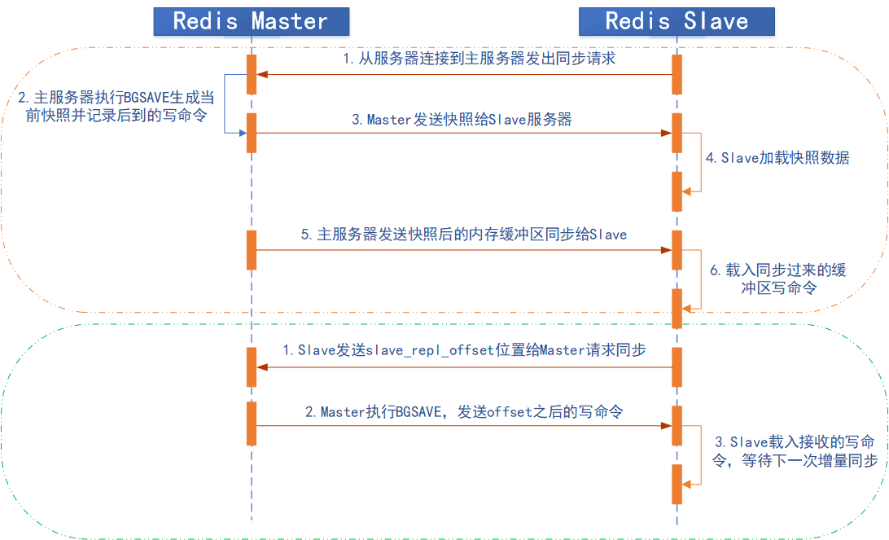

### 1.1.8 主从同步的优化配置

Redis 在 2.8 版本之前没有提供增量部分复制的功能，当网络闪断或者 slave Redis 重启
之后会导致主从之间的全量同步，即从 2.8 版本开始增加了部分复制的功能。

```bash
repl-diskless-sync no
   # 是否使用无盘同步RDB文件，默认为no，no为不使用无盘，需要将RDB文件保存到磁盘后
   # 再发送给slave，yes为支持无盘，支持无盘就是RDB文件不需要保存至本地磁盘，而且直
   # 接通过socket文件发送给slave。

repl-diskless-sync-delay 5
   # Master准备好RDB文件后等等待传输时间

repl-ping-slave-period 10
   # slave端向server端发送ping的时间区间设置，默认为10秒

repl-timeout 60
   # 设置复制超时时间

repl-disable-tcp-nodelay no
   # 是否启用TCP_NODELAY，如设置成yes，则redis会合并小的TCP包从而节省带宽，但会增加
   # 同步延迟（40ms），造成master与slave数据不一致，假如设置成no，则redis master会
   # 立即发送同步数据，没有延迟，前者关注性能，后者关注redis服务中的数据一致性。

repl-backlog-size 1mb
   # master的写入数据缓冲区，用于记录自上一次同步后到下一次同步过程中间的写入命令，
   # 计算公式：repl-backlog-size = 允许从节点最大中断时长 * 主实例offset每秒写入量
   # 比如master每秒最大写入64mb，最大允许60秒，那么就要设置为64mb*60秒=3840MB(3.8G)
 
repl-backlog-ttl 3600
   # 如果一段时间后没有slave连接到master，则backlog size的内存将会被释放。如果值
   # 为0则表示永远不释放这部份内存。 slave-priority 100 #slave端的优先级设置，值是
   # 一个整数，数字越小表示优先级越高。当master故障时将会按照优先级来选择slave端进行
   # 恢复，如果值设置为0，则表示该slave永远不会被选择。
 
#min-slaves-to-write 1
   # 设置一个master端的可用slave至少多少

#min-slaves-max-lag 20
   # 设置所有slave延迟时间都大于多少秒时，master不接收写操作(拒绝写入)。
```

### 1.1.9 Slave 切换为 Master

Master 的切换会导致 master_replid 发生变化，slave 之前的 master_replid 就和
当前 master 不一致从而会引发所有 slave 的全量同步。Slave 切换为 Master 很简单，
只需要运行`SLAVEOF no one`即可。

查看当前 Slave 情况：

```bash
192.168.131.149:6379> info replication
# Replication
role:slave
master_host:192.168.131.148
master_port:6379
master_link_status:up
master_last_io_seconds_ago:3
master_sync_in_progress:0
...
```

停止 Slave 同步并查看状态：

```bash
192.168.131.149:6379> SLAVEOF no one
OK
192.168.131.149:6379> info replication
# Replication
role:master
connected_slaves:0
master_replid:bfc98f9b16833d6c7c9638c34ef4a9be4ccc7999
master_replid2:0a3e5fcc5e891bc3bfae8c390529f1702f3d8068
master_repl_offset:13231
second_repl_offset:13232
repl_backlog_active:1
repl_backlog_size:1048576
repl_backlog_first_byte_offset:547
repl_backlog_histlen:12685
```

测试此时是否能写入数据：

```bash
192.168.131.149:6379> set keytest hello
OK
192.168.131.149:6379> get keytest
"hello"
```

失去连接后 Master 日志

```bash
...
2976:M 11 Feb 2020 14:04:51.220 # Connection with replica 192.168.131.149:6379 lost
```

失去连接后 Slave 日志

```bash
...
7160:M 11 Feb 2020 14:04:51.202 # Connection with master lost.
7160:M 11 Feb 2020 14:04:51.202 * Caching the disconnected master state.
7160:M 11 Feb 2020 14:04:51.202 * Discarding previously cached master state.
7160:M 11 Feb 2020 14:04:51.202 * MASTER MODE enabled (user request from 'id=23 addr=192.168.131.149:33746 fd=8 name= age=5 idle=0 flags=N db=0 sub=0 psub=0 multi=-1 qbuf=34 qbuf-free=32734 obl=0 oll=0 omem=0 events=r cmd=slaveof')
7160:M 11 Feb 2020 14:05:48.724 * 1 changes in 900 seconds. Saving...
7160:M 11 Feb 2020 14:05:48.724 * Background saving started by pid 7514
7514:C 11 Feb 2020 14:05:48.728 * DB saved on disk
7514:C 11 Feb 2020 14:05:48.728 * RDB: 0 MB of memory used by copy-on-write
7160:M 11 Feb 2020 14:05:48.825 * Background saving terminated with success
```

## 1.2 Trouble Shooting

### 1.2.1 Slave 端未正确设置 master 验证密码

master 密码为 stevenux，设置为 123456 试试：

```bash
192.168.131.149:6379> REPLICAOF 192.168.131.148 6379
OK
192.168.131.149:6379> CONFIG SET masterauth 123456
OK
192.168.131.149:6379> info replication
# Replication
role:slave
master_host:192.168.131.148
master_port:6379
master_link_status:down  # 显示master未连接
master_last_io_seconds_ago:-1
master_sync_in_progress:0
...
```

Slave 的日志

```bash
...
7160:S 11 Feb 2020 14:12:09.761 * Connecting to MASTER 192.168.131.148:6379
7160:S 11 Feb 2020 14:12:09.761 * MASTER <-> REPLICA sync started
7160:S 11 Feb 2020 14:12:09.763 * Non blocking connect for SYNC fired the event.
7160:S 11 Feb 2020 14:12:09.763 * Master replied to PING, replication can continue...
7160:S 11 Feb 2020 14:12:09.764 # Unable to AUTH to MASTER: -ERR invalid password

```

### 1.2.2 Redis 版本不一致

Redis Master 使用 5.0.7 版本，Redis Slave 使用 3.2.12 版本
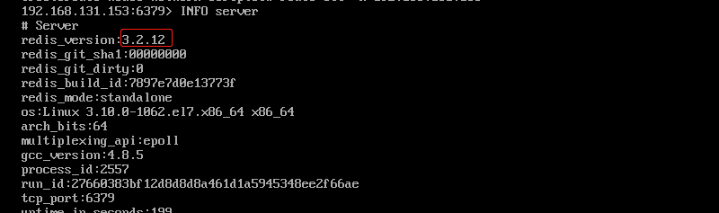

Slave 日志提示 DRB 格式不兼容
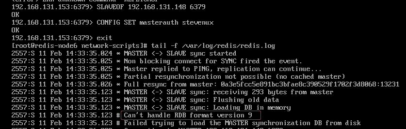

### 1.2.3 无法远程连接

在开启了安全模式情况下，没有设置 bind 地址或者密码导致。

```bash
protected-mode yes # 该选项开启安全模式
bind 0.0.0.0 # 表示可以从任意地址连接redis
requirepass www.suosuoli.cn # 设置密码
```

# 二.Redis 集群

Redis 的主从架构无法实现 master 和 slave 角色的自动切换，即当 master 出现 redis 服务
异常、主机断电、磁盘损坏等问题导致 master 无法使用，而 redis 高可用无法实现自故障转移
(将 slave 提升为 master)，需要手动改环境配置才能切换到 slave redis 服务器，另外也无法
横向扩展 Redis 服务的并行写入性能，当单台 Redis 服务器性能无法满足业务写入需求的时候就
必须需要一种方式解决以上的两个核心问题。即：

1. master 和 slave 角色的无缝切换，让业务无感知从而不影响业务使用
2. 可以横向动态扩展 Redis 服务器，从而实现多台服务器并行写入以实现更高并发的目的。

Redis 集群有多种实现方式
: 客户端分片方式
: 代理分片
: Redis Cluster

## 2.1 Sentinel-Redis 哨兵机制

Sentinel 进程用于监控 redis 集群中 Master 主服务器工作的状态，在 Master 主服务器
发生故障的时候，可以实现 Master 和 Slave 服务器的切换，保证系统的高可用，其已经被
集成在 redis2.6+的版本中。

Redis 的哨兵机制到了 2.8 版本之后就稳定了下来。一般在生产环境也建议使用 Redis 的
2.8 版本的以后版本。

哨兵(Sentinel) 是一个分布式系统，可以在一个架构中运行多个哨兵(sentinel) 进程，这些
进程使用流言协议(gossip protocols)来接收关于 Master 主服务器是否下线的信息，并使用
投票协议(Agreement Protocols)来决定是否执行自动故障迁移，以及选择哪个 Slave 作为新
的 Master。每个哨兵(Sentinel)进程会向其它哨兵(Sentinel)、Master、Slave 定时发送消
息，以确认对方是否"活"着，如果发现对方在指定配置时间(可配置的)内未得到回应，则暂时认
为对方已掉线，也就是所谓的"主观认为宕机"，主观是每个成员都具有的独自的而且可能相同
也可能不同的意识，英文名称：Subjective Down，简称 SDOWN。有主观宕机，肯定就有客观宕
机。当"哨兵群"中的多数 Sentinel 进程在对 Master 主服务器做出 SDOWN 的判断，并且通过
SENTINEL is-master-down-by-addr 命令互相交流之后，得出的 Master Server 下线判断，
这种方式就是**"客观宕机"**，客观是不依赖于某种意识而已经实际存在的一切事物，英文名称是：
Objectively Down，简称 ODOWN。通过一定的 vote 算法，从剩下的 slave 从服务器节点中，
选一台提升为 Master 服务器节点，然后自动修改相关配置，并开启故障转移(failover)。

Sentinel 机制可以解决 master 和 slave 角色的切换问题。

### 2.1.1 手动配置主从复制

环境

| 主机               | IP              | 角色   |
| :----------------- | :-------------- | :----- |
| redis-server-node1 | 192.168.131.148 | Master |
| redis-node2        | 192.168.131.149 | Slave  |
| redis-node3        | 192.168.131.150 | Slave  |

新增一台 Slave：192.168.131.150 的配置

```bash
192.168.131.150:6379> REPLICAOF 192.168.131.148 6379
OK
192.168.131.150:6379> CONFIG SET masterauth stevenux
OK
(2.27s)
```

增加后 Master 的状态

```bash
192.168.131.148:6379> auth stevenux
OK
192.168.131.148:6379> info replication
# Replication
role:master
connected_slaves:2
slave0:ip=192.168.131.149,port=6379,state=online,offset=13427,lag=1
slave1:ip=192.168.131.150,port=6379,state=online,offset=0,lag=0
master_replid:85f9d986a9f7e06d5bf273d8b1004d517e20a7ea
master_replid2:0000000000000000000000000000000000000000
master_repl_offset:13427
second_repl_offset:-1
repl_backlog_active:1
repl_backlog_size:1048576
repl_backlog_first_byte_offset:13232
repl_backlog_histlen:196
```

查看新增的 Slave 数据同步情况

```bash
[root@redis-node3 ~]# redis-cli -h 192.168.131.150
192.168.131.150:6379> KEYS *
1) "key3"
2) "keyone"
3) "zset1"
4) "menu"
5) "set1"
# 同步正常
```

#### 2.1.1.1 故障转移时程序连接 Redis

[Redis 各种客户端的官方文档](https://redis.io/clients)
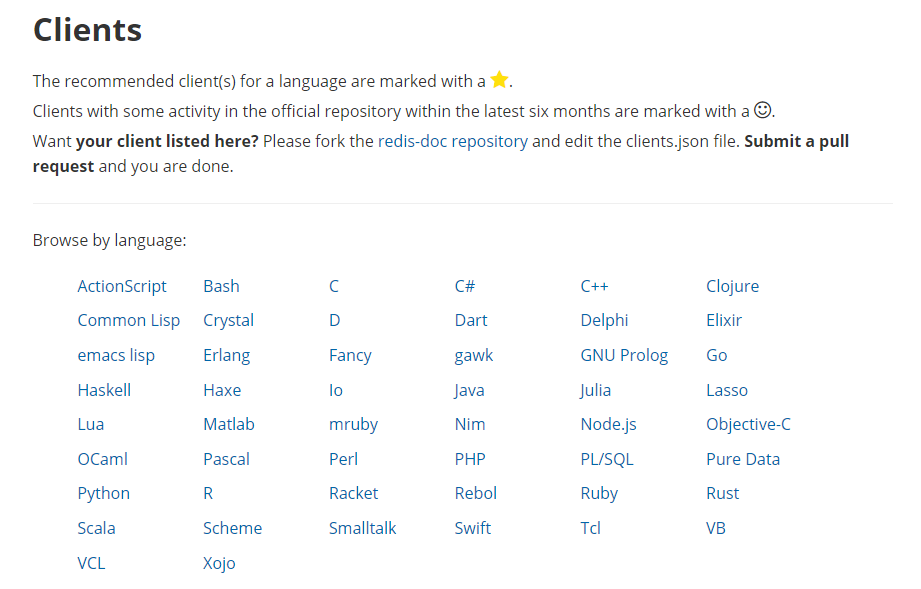

java 客户端连接 redis 是通过 Jedis 来实现的，java 代码用的时候只要创建 Jedis 对
象就可以建多个 Jedis 连接池来连接 redis，应用程序再直接调用连接池即可连接 Redis。

而 Redis 为了保障高可用,服务一般都是 Sentinel 部署方式，当 Redis 服务中的主服务
挂掉之后,会仲裁出另外一台 Slaves 服务充当 Master。这个时候,我们的应用即使使用了
Jedis 连接池,Master 服务挂了,我们的应用将还是无法连接新的 Master 服务，为了解决
这个问题, Jedis 也提供了相应的 Sentinel 实现,能够在 Redis Sentinel 主从切换时候,
通知我们的应用,把我们的应用连接到新的 Master 服务。

在使用程序连接 Redis 时 Redis Sentinel 的使用也是十分简单的,只是在 JedisPool 中
添加了 Sentinel 和 MasterName 参数，JRedis Sentinel 底层基于 Redis 订阅实现
Redis 主从服务的切换通知，当 Reids 发生主从切换时，Sentinel 会发送通知主动通知
Jedis 进行连接的切换，JedisSentinelPool 在每次从连接池中获取链接对象的时候,都要
对连接对象进行检测,如果此链接和 Sentinel 的 Master 服务连接参数不一致,则会关闭此
连接,重新获取新的 Jedis 连接对象。

### 2.1.2 编辑哨兵配置文件

哨兵可以与 Redis 服务器分开部署，实际使用中一般配置在同一台主机

Master:192.168.131.148

```bash

```

Slave:192.168.131.149
Slave:192.168.131.150

### 2.1.3 启动哨兵

Master:192.168.131.148

```bash
[root@redis-server-node1 ~]# /apps/redis/bin/redis-sentinel /apps/redis/etc/sentinel.conf
[root@redis-server-node1 ~]# ss -ntl
State      Recv-Q Send-Q            Local Address:Port             Peer Address:Port
LISTEN     0      100                   127.0.0.1:25                          *:*
LISTEN     0      128                   127.0.0.1:9000                        *:*
LISTEN     0      50                            *:3306                        *:*
LISTEN     0      511                           *:26379                       *:*
LISTEN     0      511                           *:6379                        *:*
LISTEN     0      128                           *:111                         *:*
LISTEN     0      128                           *:22                          *:*
LISTEN     0      100                       [::1]:25                       [::]:*
LISTEN     0      128                        [::]:111                      [::]:*
LISTEN     0      128                        [::]:22                       [::]:*
```

Slave:192.168.131.149

```bash
[root@redis-node2 etc]# /apps/redis/bin/redis-sentinel /apps/redis/etc/sentinel.conf
[root@redis-node2 etc]# ss -ntl
State      Recv-Q Send-Q              Local Address:Port         Peer Address:Port
LISTEN     0      100                       127.0.0.1:25                 *:*
LISTEN     0      511                 192.168.131.149:26379              *:*
LISTEN     0      511                               *:6379               *:*
LISTEN     0      128                               *:111                *:*
LISTEN     0      128                               *:80                 *:*
LISTEN     0      128                               *:22                 *:*
LISTEN     0      100                           [::1]:25              [::]:*
LISTEN     0      128                            [::]:111             [::]:*
LISTEN     0      128                            [::]:22              [::]:*
```

Slave:192.168.131.150

```bash
[root@redis-node3 etc]# /apps/redis/bin/redis-sentinel /apps/redis/etc/sentinel.conf
[root@redis-node3 etc]# ss -ntl
State      Recv-Q Send-Q              Local Address:Port             Peer Address:Port
LISTEN     0      100                     127.0.0.1:25                          *:*
LISTEN     0      511               192.168.131.150:26379                       *:*
LISTEN     0      511                             *:6379                        *:*
LISTEN     0      128                             *:111                         *:*
LISTEN     0      128                             *:80                          *:*
LISTEN     0      128                             *:22                          *:*
LISTEN     0      100                         [::1]:25                       [::]:*
LISTEN     0      128                          [::]:111                      [::]:*
LISTEN     0      128                          [::]:80                       [::]:*
LISTEN     0      128                          [::]:22                       [::]:*
```

**哨兵服务日志**

```bash
[root@redis-server-node1 ~]# tail -f /apps/redis/logs/sentinel_26379.log
6752:X 11 Feb 2020 16:38:37.989 # Redis version=5.0.7, bits=64, commit=00000000, modified=0, pid=6752, just started
6752:X 11 Feb 2020 16:38:37.989 # Configuration loaded
6753:X 11 Feb 2020 16:38:37.990 * Increased maximum number of open files to 10032 (it was originally set to 1024).
6753:X 11 Feb 2020 16:38:37.991 * Running mode=sentinel, port=26379.
6753:X 11 Feb 2020 16:38:37.991 # Sentinel ID is e67caf2137b93d25c9b3ae98f4da1b37722c33ae
6753:X 11 Feb 2020 16:38:37.992 # +monitor master mymaster 192.168.131.148 6379 quorum 2
6753:X 11 Feb 2020 16:38:37.992 * +slave slave 192.168.131.149:6379 192.168.131.149 6379 @ mymaster 192.168.131.148 6379
6753:X 11 Feb 2020 16:38:37.993 * +slave slave 192.168.131.150:6379 192.168.131.150 6379 @ mymaster 192.168.131.148 6379
6753:X 11 Feb 2020 16:38:48.759 * +sentinel sentinel e6a6c4e2aeac5e259d2fab347e14ebe8c260b875 192.168.131.149 26379 @ mymaster 192.168.131.148 6379
6753:X 11 Feb 2020 16:38:57.607 * +sentinel sentinel d1322d808ebd2abd6e65fad6f53599aa4eb11ddc 192.168.131.150 26379 @ mymaster 192.168.131.148 6379
```

### 2.1.4 停止 Redis Master 测试故障转移

**查看 Redis Master 状态**

```bash
192.168.131.148:6379> info replication
# Replication
role:master
connected_slaves:2
slave0:ip=192.168.131.149,port=6379,state=online,offset=91470,lag=1
slave1:ip=192.168.131.150,port=6379,state=online,offset=91470,lag=1
master_replid:85f9d986a9f7e06d5bf273d8b1004d517e20a7ea
master_replid2:0000000000000000000000000000000000000000
master_repl_offset:91615
second_repl_offset:-1
repl_backlog_active:1
repl_backlog_size:1048576
repl_backlog_first_byte_offset:13232
repl_backlog_histlen:78384
```

**当前 sentinel 状态**

在 sentinel 状态中尤其是最后一行，涉及到 masterIP 是多少，有几个 slave，有几个
sentinels，必须是符合全部服务器数量的。

```bash
[root@redis-server-node1 ~]# redis-cli -h 192.168.131.148 -p 26379
192.168.131.148:26379> info sentinel
# Sentinel
sentinel_masters:1
sentinel_tilt:0
sentinel_running_scripts:0
sentinel_scripts_queue_length:0
sentinel_simulate_failure_flags:0
master0:name=mymaster,status=ok,address=192.168.131.148:6379,slaves=2,sentinels=3
# 最后一行指明masterIP和Slave个数及Sentinel个数
```

**停止 Master**

```bash
[root@redis-server-node1 ~]# systemctl stop redis
[root@redis-server-node1 ~]# ss -ntl
State       Recv-Q Send-Q                     Local Address:Port                                    Peer Address:Port
LISTEN      0      100                            127.0.0.1:25                                                 *:*
LISTEN      0      128                            127.0.0.1:9000                                               *:*
LISTEN      0      50                                     *:3306                                               *:*
LISTEN      0      511                                    *:26379                                              *:*
```

### 2.1.5 故障转移过程 Sentinel 日志分析

单台服务器中，将 Master 停止后，选举 redis-node3(192.168.131.150) 为新的 Master

```bash
6011:X 11 Feb 2020 16:38:55.553 # oO0OoO0OoO0Oo Redis is starting oO0OoO0OoO0Oo
6011:X 11 Feb 2020 16:38:55.553 # Redis version=5.0.7, bits=64, commit=00000000, modified=0, pid=6011, just started
6011:X 11 Feb 2020 16:38:55.553 # Configuration loaded
6012:X 11 Feb 2020 16:38:55.555 * Increased maximum number of open files to 10032 (it was originally set to 1024).
6012:X 11 Feb 2020 16:38:55.555 * Running mode=sentinel, port=26379.

########################################## 当前Redis哨兵的运行ID
6012:X 11 Feb 2020 16:38:55.556 # Sentinel ID is d1322d808ebd2abd6e65fad6f53599aa4eb11ddc

########################################## 当前使用仲裁成员是2个
6012:X 11 Feb 2020 16:38:55.557 # +monitor master mymaster 192.168.131.148 6379 quorum 2
6012:X 11 Feb 2020 16:38:55.558 * +slave slave 192.168.131.149:6379 192.168.131.149 6379 @ mymaster 192.168.131.148 6379
6012:X 11 Feb 2020 16:38:55.559 * +slave slave 192.168.131.150:6379 192.168.131.150 6379 @ mymaster 192.168.131.148 6379
6012:X 11 Feb 2020 16:38:56.384 * +sentinel sentinel e67caf2137b93d25c9b3ae98f4da1b37722c33ae 192.168.131.148 26379 @ mymaster 192.168.131.148 6379
6012:X 11 Feb 2020 16:38:56.891 * +sentinel sentinel e6a6c4e2aeac5e259d2fab347e14ebe8c260b875 192.168.131.149 26379 @ mymaster 192.168.131.148 6379

########################################## 主观认为宕机
6012:X 11 Feb 2020 17:12:59.241 # +sdown master mymaster 192.168.131.148 6379

########################################## 仲裁后确认为宕机
6012:X 11 Feb 2020 17:12:59.305 # +odown master mymaster 192.168.131.148 6379 #quorum 2/2
6012:X 11 Feb 2020 17:12:59.305 # +new-epoch 1

########################################## 尝试故障转移
6012:X 11 Feb 2020 17:12:59.305 # +try-failover master mymaster 192.168.131.148 6379

########################################## 投票选取Master
6012:X 11 Feb 2020 17:12:59.308 # +vote-for-leader d1322d808ebd2abd6e65fad6f53599aa4eb11ddc 1
6012:X 11 Feb 2020 17:12:59.310 # e67caf2137b93d25c9b3ae98f4da1b37722c33ae voted for d1322d808ebd2abd6e65fad6f53599aa4eb11ddc 1
6012:X 11 Feb 2020 17:12:59.310 # e6a6c4e2aeac5e259d2fab347e14ebe8c260b875 voted for d1322d808ebd2abd6e65fad6f53599aa4eb11ddc 1
6012:X 11 Feb 2020 17:12:59.385 # +elected-leader master mymaster 192.168.131.148 6379

########################################## 故障转移主机为192.168.131.148
6012:X 11 Feb 2020 17:12:59.385 # +failover-state-select-slave master mymaster 192.168.131.148 6379

########################################## 故障转移目标为192.168.131.150
6012:X 11 Feb 2020 17:12:59.476 # +selected-slave slave 192.168.131.150:6379 192.168.131.150 6379 @ mymaster 192.168.131.148 6379
6012:X 11 Feb 2020 17:12:59.476 * +failover-state-send-slaveof-noone slave 192.168.131.150:6379 192.168.131.150 6379 @ mymaster 192.168.131.148 6379
6012:X 11 Feb 2020 17:12:59.532 * +failover-state-wait-promotion slave 192.168.131.150:6379 192.168.131.150 6379 @ mymaster 192.168.131.148 6379
6012:X 11 Feb 2020 17:13:00.279 # +promoted-slave slave 192.168.131.150:6379 192.168.131.150 6379 @ mymaster 192.168.131.148 6379
6012:X 11 Feb 2020 17:13:00.279 # +failover-state-reconf-slaves master mymaster 192.168.131.148 6379
6012:X 11 Feb 2020 17:13:00.350 * +slave-reconf-sent slave 192.168.131.149:6379 192.168.131.149 6379 @ mymaster 192.168.131.148 6379
6012:X 11 Feb 2020 17:13:01.377 * +slave-reconf-inprog slave 192.168.131.149:6379 192.168.131.149 6379 @ mymaster 192.168.131.148 6379
6012:X 11 Feb 2020 17:13:01.449 # -odown master mymaster 192.168.131.148 6379
6012:X 11 Feb 2020 17:16:00.291 # +failover-end-for-timeout master mymaster 192.168.131.148 6379
6012:X 11 Feb 2020 17:16:00.291 # +failover-end master mymaster 192.168.131.148 6379
6012:X 11 Feb 2020 17:16:00.291 * +slave-reconf-sent-be slave 192.168.131.150:6379 192.168.131.150 6379 @ mymaster 192.168.131.148 6379
6012:X 11 Feb 2020 17:16:00.291 * +slave-reconf-sent-be slave 192.168.131.149:6379 192.168.131.149 6379 @ mymaster 192.168.131.148 6379
6012:X 11 Feb 2020 17:16:00.291 # +switch-master mymaster 192.168.131.148 6379 192.168.131.150 6379
6012:X 11 Feb 2020 17:16:00.291 * +slave slave 192.168.131.149:6379 192.168.131.149 6379 @ mymaster 192.168.131.150 6379
6012:X 11 Feb 2020 17:16:00.291 * +slave slave 192.168.131.148:6379 192.168.131.148 6379 @ mymaster 192.168.131.150 6379
6012:X 11 Feb 2020 17:16:30.315 # +sdown slave 192.168.131.148:6379 192.168.131.148 6379 @ mymaster 192.168.131.150 6379

```

### 2.1.6 故障转移后配置文件会被修改

故障转移后 redis.conf 中的 `replicaof IP PORT` 行的 master IP 会被修改
sentinel.conf 中的 `sentinel monitor IP` 会被修改

redis-node2--Slave:192.168.131.149 原来的 IP 都指向
redis-server-node1--Master:192.168.131.148

故障转移后都被该为 192.168.131.150，即新选举的 Master

```bash
[root@redis-node2 etc]# vim /apps/redis/etc/redis.conf
################################# REPLICATION #################################
replicaof 192.168.131.150 6379
...

[root@redis-node2 etc]# vim /apps/redis/etc/sentinel.conf
# Default is 30 seconds.
sentinel monitor mymaster 192.168.131.150 6379 2
...
```

修改原 Master 的配置文件，将其 Master 指向新的 Master：192.168.131.150
新 Master 的复制状态:

```bash
127.0.0.1:6379> info replication
# Replication
role:master
connected_slaves:2
slave0:ip=192.168.131.148,port=6379,state=online,offset=897322,lag=0
slave1:ip=192.168.131.149,port=6379,state=online,offset=897322,lag=1
master_replid:f7f6ecbb5964ee44160654fbf82fedac3303ba67
master_replid2:85f9d986a9f7e06d5bf273d8b1004d517e20a7ea
master_repl_offset:897322
second_repl_offset:449770
repl_backlog_active:1
repl_backlog_size:1048576
repl_backlog_first_byte_offset:13722
repl_backlog_histlen:883601
```

## 2.2 Redis Cluster

早期 Redis 分布式集群部署方案：

1. 客户端请求分片：由客户端程序决定 key 写分配和写入的 redis node，但是需要客户端
   自己处理写入分配、高可用管理和故障转移等
2. 代理方案：基于三方软件实现 redis proxy，客户端先连接之代理层，由代理层实现 key
   的写入分配，对客户端来说是有比较简单，但是对于集群管节点增减相对比较麻烦，而且代
   理本身也是单点和性能瓶颈。

目前 Redis 的解决方案:
在 Redis 的哨兵 sentinel 机制中，可以解决 redis 高可用的问题，即当 master 故障后
可以自动将 slave 提升为 master 从而可以保证 redis 服务的正常使用，但是无法解决
redis 单机写入的瓶颈问题，即单机的 redis 写入性能受限于单机的内存大小、并发数量、
网卡速率等因素，因此 redis 官方在 redis 3.0 版本之后推出了无中心架构的
redis cluster 机制，在无中心的 redis 集群当中，其每个节点保存当前节点数据和整个集
群状态,每个节点都和其他所有节点连接，特点如下：

```ruby
1.所有 Redis 节点使用(PING 机制)互联
2.集群中某个节点的失效，是整个集群中超过半数的节点监测都失效才算真正的失效
3.客户端不需要 proxy 即可直接连接 redis，应用程序需要写全部的 redis 服务器 IP。
4.redis cluster 把所有的 redis node 映射到 0-16383 个槽位(slot)上，读写需要到指定的
redis node 上进 操作，因此有多少个 reids node 相当于 redis 并发扩展了多少倍。
5.Redis cluster 预先分配 16384 个(slot)槽位，当需要在 redis 集群中写入一个 key-value
的时候，会使用 CRC16(key) mod 16384 之后的值，决定将 key 写入值哪一个槽位从而决定写入哪
一个 Redis 节点上，从而有效解决 机瓶颈。
```

### 2.2.1 Redis 集群架构

#### 2.2.1.1 Redis cluster 基本架构

假如三个主节点分别是：A, B, C 三个节点，采用哈希槽 (hash slot)的方式来分配 16384
个 slot 的话，它们三个节点分别承担的 slot 区间是：

```ruby
节点A覆盖 0－5460
节点B覆盖 5461－10922
节点C覆盖 10923－16383
```

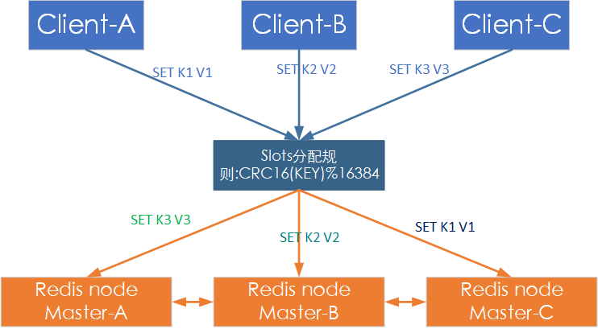

#### 2.2.1.2 Redis cluster 主从架构

Redis cluster 的架构虽然解决了**并发的问题**，但是又引入了一个新的问题，每个
**Redis master 的高可用**如何解决呢？

> 此时 Redis cluster 主从架构走进了直播间！！

Redis Cluster 示意图如下:

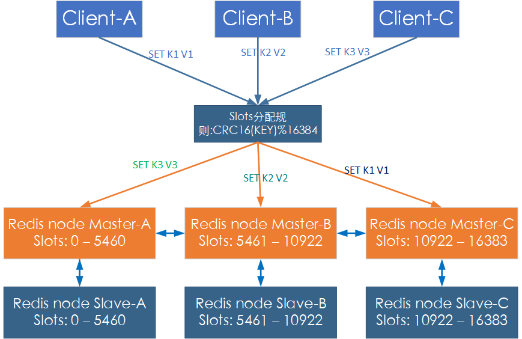

### 2.2.2 Redis 集群的部署

环境准备

| 主机            | 主机名             | 角色   |
| :-------------- | :----------------- | :----- |
| 192.168.131.155 | redis-server-node1 | Master |
| 192.168.131.156 | redis-node2        | Master |
| 192.168.131.157 | redis-node3        | Master |
| 192.168.131.158 | redis-node4        | Slave  |
| 192.168.131.159 | redis-node5        | Slave  |
| 192.168.131.154 | redis-node6        | Slave  |
| 192.168.131.160 | redis-node7        | 备用   |
| 192.168.131.161 | redis-node8        | 备用   |

#### 2.2.2.1 创建 Redis Cluster 主从架构的前提

1. 每个 redis node 节点采用相同的硬件配置、相同的密码、相同的 redis 版本。
2. 每个节点必须开启的参数`cluster-enabled yes`开启集群，开启后 redis 进程信息
   会有[cluster]显示。

```bash
   [root@redis-server-node5 ~]# ps -ef | grep redis
   redis      1788      1  0 15:12 ?        00:00:15 /apps/redis/bin/redis-server 0.0.0.0:6379 [cluster]  # 集群运行模式
```

3. `cluster-config-file nodes-6380.conf`该选项配置集群为每个节点生成的配置文件，
   该文件由 Redis Cluster 集群自动创建和维护，不需要任何手动操作
4. 所有 Redis 服务器事先必须没有任何数据
5. 先启动为单机

#### 2.2.2.2 创建 Redis 集群

**对于 Redis 3 和 Redis 4 版本：**
需要使用到集群管理工具 redis-trib.rb，这个工具是 redis 官方推出的管理 redis 集群
的工具，集成在 redis 的源码 src 目录下，是基于 redis 提供的集群命令封装成简单、便
捷、实用的操作工具，redis-trib.rb 是 redis 作者用 ruby 开发完成的，centos 系统
yum 安装的 ruby 存在版本较低问题，如下

```bash
~$ yum install ruby rubygems
~$ yum install redis
```


下载较高版本的 Ruby 编译安装:

```bash
[root@redis-server-node1 redis4]# yum remove ruby rubygems  -y
[root@redis-server-node1 redis4]# wget https://cache.ruby-lang.org/pub/ruby/2.5/ruby-2.5.5.tar.gz
[root@redis-server-node1 src]# tar xf ruby-2.5.5.tar.gz
[root@redis-server-node1 src]# cd ruby-2.5.5
[root@redis-server-node1 ruby-2.5.5]# ./configure
[root@redis-server-node1 ruby-2.5.5]# make -j 2
[root@redis-server-node1 ruby-2.5.5]# make install
[root@redis-server-node1 ruby-2.5.5]# gem  install redis
[root@redis-server-node1 ruby-2.5.5]# gem install redis
Fetching: redis-4.1.3.gem (100%)
Successfully installed redis-4.1.3
Parsing documentation for redis-4.1.3
Installing ri documentation for redis-4.1.3
Done installing documentation for redis after 0 seconds
1 gem installed
[root@redis-server-node1 ruby-2.5.5]# find / -name redis-trib.rb
/usr/local/src/redis-4.0.14/src/redis-trib.rb
[root@redis-server-node1 ruby-2.5.5]# cp /usr/local/src/redis-4.0.14/src/redis-trib.rb /usr/bin/

#如果无法在线安装，可以下载reids模块安装包离线安装
#https://rubygems.org/gems/redis #先下载redis模块安装包
#gem install -l redis-3.3.0.gem #安装redis模块
```

安装后验证 `redis-trib.rb` 命令是否可执行

```bash
[root@redis-server-node1 ruby-2.5.5]# redis-trib.rb
Usage: redis-trib <command> <options> <arguments ...>

  create          host1:port1 ... hostN:portN
                  --replicas <arg>
  check           host:port
  info            host:port
  fix             host:port
                  --timeout <arg>
  reshard         host:port
                  --from <arg>
                  --to <arg>
                  --slots <arg>
                  --yes
                  --timeout <arg>
                  --pipeline <arg>
  rebalance       host:port
                  --weight <arg>
                  --auto-weights
                  --use-empty-masters
                  --timeout <arg>
                  --simulate
                  --pipeline <arg>
                  --threshold <arg>
  add-node        new_host:new_port existing_host:existing_port
                  --slave
                  --master-id <arg>
  del-node        host:port node_id
  set-timeout     host:port milliseconds
  call            host:port command arg arg .. arg
  import          host:port
                  --from <arg>
                  --copy
                  --replace
  help            (show this help)

For check, fix, reshard, del-node, set-timeout you can specify the host and port of any working node in the cluster.
```

如果 Redis 被设置密码，需要更改 ruby 客户端源码修改 password 为设置的密码

```bash
[root@redis-server-node1 ruby-2.5.5]# vim /usr/local/lib/ruby/gems/2.5.0/gems/redis-4.1.3/lib/redis/client.rb
# frozen_string_literal: true

require_relative "errors"
require "socket"
require "cgi"
class Redis
  class Client

    DEFAULTS = {
      :url => lambda { ENV["REDIS_URL"] },
      :scheme => "redis",
      :host => "127.0.0.1",
      :port => 6379,
      :path => nil,
      :timeout => 5.0,
      :password => "stevenux",  # 原来值为nil
      :db => 0,
      :driver => nil,
      :id => nil,
      :tcp_keepalive => 0,
      :reconnect_attempts => 1,
      :reconnect_delay => 0,
      :reconnect_delay_max => 0.5,
      :inherit_socket => false
    }
    ...
```

先将各 Redis 实例启动，启动后会多出一个端口，该端口在 Redis 的 6379 基础上加 10000

```bash
[root@redis-server-node1 ~]# systemctl start redis
[root@redis-server-node1 ~]# ss -ntl
State       Recv-Q Send-Q Local Address:Port               Peer Address:Port
LISTEN      0      100       127.0.0.1:25                            *:*
LISTEN      0      511               *:16379 # 集群主机间通信的端口   *:*
LISTEN      0      128       127.0.0.1:9000                          *:*
LISTEN      0      50                *:3306                          *:*
LISTEN      0      511               *:6379 # Redis端口              *:*
LISTEN      0      128               *:111                           *:*
LISTEN      0      128               *:22                            *:*
LISTEN      0      100           [::1]:25                         [::]:*
LISTEN      0      128            [::]:111                        [::]:*
LISTEN      0      128            [::]:22                         [::]:*
```

Redis3/4 版本使用 ruby 脚本来创建集群:

```ruby
[root@redis-server-node1 ~]# redis-trib.rb create --replicas 1 192.168.100.10:6379 192.168.100.11:6379 192.168.100.12:6379 192.168.100.13:6379 192.168.100.14:6379 192.168.100.15:6379
>>> Creating cluster
>>> Performing hash slots allocation on 6 nodes...
Using 3 masters:
192.168.100.10:6379
192.168.100.11:6379
192.168.100.12:6379
Adding replica 192.168.100.14:6379 to 192.168.100.10:6379
Adding replica 192.168.100.15:6379 to 192.168.100.11:6379
Adding replica 192.168.100.13:6379 to 192.168.100.12:6379
M: 90c32a437cff64d61aa433b46d3143c77bc66eec 192.168.100.10:6379
   slots:0-5460 (5461 slots) master
M: 9f26fd0ac2b4694708c76edeb71d3c9ed02bbae4 192.168.100.11:6379
   slots:5461-10922 (5462 slots) master
M: 6789c52caa900c09dda2df57132e73646bcf3735 192.168.100.12:6379
   slots:10923-16383 (5461 slots) master
S: 9884dd51c7bd74c4abb2b9dc5ac0409488f2c0ae 192.168.100.13:6379
   replicates 6789c52caa900c09dda2df57132e73646bcf3735
S: 8c495ba64297d26f30101d4d63e9898239d1160f 192.168.100.14:6379
   replicates 90c32a437cff64d61aa433b46d3143c77bc66eec
S: 79a9a7ec7b4963dc44e9a8ff6e8ad6b233e242c2 192.168.100.15:6379
   replicates 9f26fd0ac2b4694708c76edeb71d3c9ed02bbae4
Can I set the above configuration? (type 'yes' to accept): yes
>>> Nodes configuration updated
>>> Assign a different config epoch to each node
>>> Sending CLUSTER MEET messages to join the cluster
Waiting for the cluster to join......
>>> Performing Cluster Check (using node 192.168.100.10:6379)
M: 90c32a437cff64d61aa433b46d3143c77bc66eec 192.168.100.10:6379
   slots:0-5460 (5461 slots) master
   1 additional replica(s)
S: 79a9a7ec7b4963dc44e9a8ff6e8ad6b233e242c2 192.168.100.15:6379
   slots: (0 slots) slave
   replicates 9f26fd0ac2b4694708c76edeb71d3c9ed02bbae4
M: 6789c52caa900c09dda2df57132e73646bcf3735 192.168.100.12:6379
   slots:10923-16383 (5461 slots) master
   1 additional replica(s)
S: 9884dd51c7bd74c4abb2b9dc5ac0409488f2c0ae 192.168.100.13:6379
   slots: (0 slots) slave
   replicates 6789c52caa900c09dda2df57132e73646bcf3735
S: 8c495ba64297d26f30101d4d63e9898239d1160f 192.168.100.14:6379
   slots: (0 slots) slave
   replicates 90c32a437cff64d61aa433b46d3143c77bc66eec
M: 9f26fd0ac2b4694708c76edeb71d3c9ed02bbae4 192.168.100.11:6379
   slots:5461-10922 (5462 slots) master
   1 additional replica(s)
[OK] All nodes agree about slots configuration.
>>> Check for open slots...
>>> Check slots coverage...
[OK] All 16384 slots covered.

主从对应关系：主<-->从
192.168.100.10 <--> 192.168.100.14
192.168.100.11 <--> 192.168.100.15
192.168.100.12 <--> 192.168.100.13

```

如果遇到 Redis 内有数据残留，则会导致集群创建失败，清空数据:

```bash
192.168.131.155>FLUSHDB
192.168.131.155>FLUSHALL
192.168.131.155>CLUSTER RESET # 重置集群
```

Redis3/4 查看集群状态：

```bash
[root@redis-server-node1 ~]# redis-trib.rb info 192.168.100.14:6379
192.168.100.12:6379 (6789c52c...) -> 0 keys | 5461 slots | 1 slaves.
192.168.100.11:6379 (9f26fd0a...) -> 0 keys | 5462 slots | 1 slaves.
192.168.100.10:6379 (90c32a43...) -> 0 keys | 5461 slots | 1 slaves.
[OK] 0 keys in 3 masters.
0.00 keys per slot on average.
```

Redis5 版本使用自己的`redis-cli`命令创建集群:

```bash
[root@redis-server-node1 ~]# redis-cli -a stevenux --cluster create 192.168.131.155:6379 192.168.131.156:6379 192.168.131.157:6379 192.168.131.158:6379 192.168.131.159:6379 192.168.131.154:6379 --cluster-replicas 1
Warning: Using a password with '-a' or '-u' option on the command line interface may not be safe.
>>> Performing hash slots allocation on 6 nodes...
Master[0] -> Slots 0 - 5460
Master[1] -> Slots 5461 - 10922
Master[2] -> Slots 10923 - 16383
Adding replica 192.168.131.159:6379 to 192.168.131.155:6379
Adding replica 192.168.131.154:6379 to 192.168.131.156:6379
Adding replica 192.168.131.158:6379 to 192.168.131.157:6379
M: c50ffdba27c949e44fd108fbb43ea7f0b5155073 192.168.131.155:6379
   slots:[0-5460] (5461 slots) master
M: 25f50036c8e17175d1a4b7f2e9aca845af4114a6 192.168.131.156:6379
   slots:[5461-10922] (5462 slots) master
M: 55ac711af0b76fe380102a71c1a2f02657ec4009 192.168.131.157:6379
   slots:[10923-16383] (5461 slots) master
S: f762795742a5d6a19bb2735f3eb3db4fb86e24c3 192.168.131.158:6379
   replicates 55ac711af0b76fe380102a71c1a2f02657ec4009
S: 686b5cf3ae7719e43882d53dbe0da4ae40b2134e 192.168.131.159:6379
   replicates c50ffdba27c949e44fd108fbb43ea7f0b5155073
S: 827a9a793e893c92036736678eed55175d3dc3e5 192.168.131.154:6379
   replicates 25f50036c8e17175d1a4b7f2e9aca845af4114a6
Can I set the above configuration? (type 'yes' to accept): yes
>>> Nodes configuration updated
>>> Assign a different config epoch to each node
>>> Sending CLUSTER MEET messages to join the cluster
Waiting for the cluster to join
....
>>> Performing Cluster Check (using node 192.168.131.155:6379)
M: c50ffdba27c949e44fd108fbb43ea7f0b5155073 192.168.131.155:6379
   slots:[0-5460] (5461 slots) master
   1 additional replica(s)
M: 55ac711af0b76fe380102a71c1a2f02657ec4009 192.168.131.157:6379
   slots:[10923-16383] (5461 slots) master
   1 additional replica(s)
S: f762795742a5d6a19bb2735f3eb3db4fb86e24c3 192.168.131.158:6379
   slots: (0 slots) slave
   replicates 55ac711af0b76fe380102a71c1a2f02657ec4009
S: 686b5cf3ae7719e43882d53dbe0da4ae40b2134e 192.168.131.159:6379
   slots: (0 slots) slave
   replicates c50ffdba27c949e44fd108fbb43ea7f0b5155073
S: 827a9a793e893c92036736678eed55175d3dc3e5 192.168.131.154:6379
   slots: (0 slots) slave
   replicates 25f50036c8e17175d1a4b7f2e9aca845af4114a6
M: 25f50036c8e17175d1a4b7f2e9aca845af4114a6 192.168.131.156:6379
   slots:[5461-10922] (5462 slots) master
   1 additional replica(s)
[OK] All nodes agree about slots configuration.
>>> Check for open slots...
>>> Check slots coverage...
[OK] All 16384 slots covered.

主从对应关系：主<-->从
# 192.168.131.155<-->192.168.131.159
# 192.168.131.156<-->192.168.131.154
# 192.168.131.157<-->192.168.131.158

没设置静态IP的后果，第二天IP全变了：主 <--> 从
192.168.131.168 <--> 192.168.131.165
192.168.131.166 <--> 192.168.131.167
192.168.131.170 <--> 192.168.131.169
```

变动后的环境

| 主机            | 主机名             | 角色   |
| :-------------- | :----------------- | :----- |
| 192.168.131.165 | redis-node5        | Slave  |
| 192.168.131.166 | redis-node3        | Master |
| 192.168.131.167 | redis-node4        | Slave  |
| 192.168.131.168 | redis-server-node1 | Master |
| 192.168.131.169 | redis-node6        | Slave  |
| 192.168.131.170 | redis-node2        | Master |
| 192.168.131.160 | redis-node7        | 备用   |
| 192.168.131.161 | redis-node8        | 备用   |

#### 2.2.2.3 验证 Redis 集群状态

看到师傅聚少离多了速度快放假十点多了疯狂接收到反馈了水电费考虑精神上的联发科
由于未设置 masterauth 认证密码，所以主从未建立起来，但是集群已经运行，所以需
要在每个 slave 控制台使用 config set 设置 masterauth 密码，或者写在每个
redis 配置文件中，最好是在控制点设置密码之后再写入配置文件 中。

此时查看主从关系，显示主库是 down 状态，设置一下 `masterauth` 即可
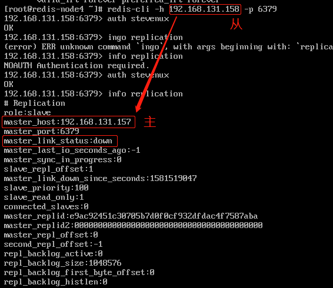

在从库执行`CONFIG SET masterauth stevenux`
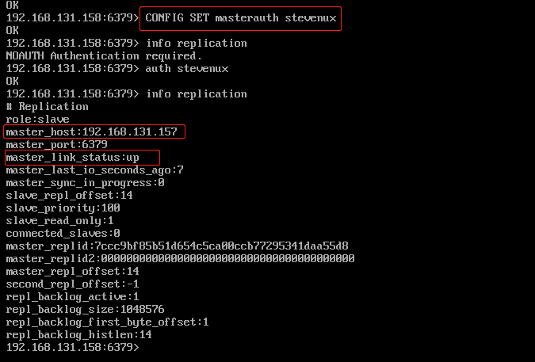

另外两台从库分别设置`CONFIG SET masterauth stevenux`

#### 2.2.2.4 确认 slave 连接到的 master 状态为 up

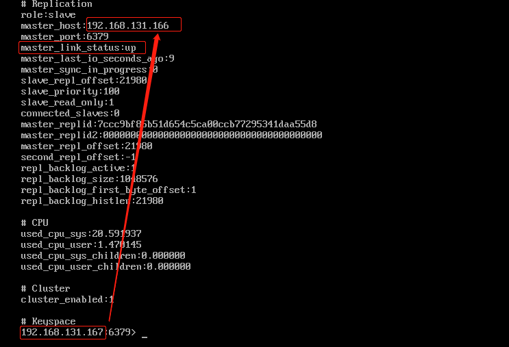

```bash
192.168.131.165:6379> info replication
# Replication
role:slave
master_host:192.168.131.168
master_port:6379
master_link_status:up
master_last_io_seconds_ago:6
master_sync_in_progress:0
slave_repl_offset:922
slave_priority:100
slave_read_only:1
connected_slaves:0
master_replid:8792e94ec747252b1521d724319c63b8eff47c78
master_replid2:0000000000000000000000000000000000000000
master_repl_offset:922
second_repl_offset:-1
repl_backlog_active:1
repl_backlog_size:1048576
repl_backlog_first_byte_offset:1
repl_backlog_histlen:922

192.168.131.167:6379> info replication
# Replication
role:slave
master_host:192.168.131.166
master_port:6379
master_link_status:up    # master为166，已连接
master_last_io_seconds_ago:7
master_sync_in_progress:0
slave_repl_offset:22848
slave_priority:100
slave_read_only:1
connected_slaves:0
master_replid:7ccc9bf85b51d654c5ca00ccb77295341daa55d8
master_replid2:0000000000000000000000000000000000000000
master_repl_offset:22848
second_repl_offset:-1
repl_backlog_active:1
repl_backlog_size:1048576
repl_backlog_first_byte_offset:1
repl_backlog_histlen:22848

192.168.131.169:6379> INFO replication
# Replication
role:slave
master_host:192.168.131.170
master_port:6379
master_link_status:up
master_last_io_seconds_ago:3
master_sync_in_progress:0
slave_repl_offset:28
slave_priority:100
slave_read_only:1
connected_slaves:0
master_replid:2eb15a59d68d46b214b2a6ed0fa4819e13e12959
master_replid2:0000000000000000000000000000000000000000
master_repl_offset:28
second_repl_offset:-1
repl_backlog_active:1
repl_backlog_size:1048576
repl_backlog_first_byt
```

#### 2.2.2.5 确认 master 也连接到 slave

```bash
[root@redis-node3 ~]# redis-cli -h 192.168.131.166 -p 6379
192.168.131.166:6379> auth stevenux
OK
192.168.131.166:6379> ingo replication
(error) ERR unknown command `ingo`, with args beginning with: `replication`,
192.168.131.166:6379> info replication
# Replication
role:master
connected_slaves:1  # slave为167，已连接
slave0:ip=192.168.131.167,port=6379,state=online,offset=22750,lag=1
master_replid:7ccc9bf85b51d654c5ca00ccb77295341daa55d8
master_replid2:0000000000000000000000000000000000000000
master_repl_offset:22750
second_repl_offset:-1
repl_backlog_active:1
repl_backlog_size:1048576
repl_backlog_first_byte_offset:1
repl_backlog_histlen:22750

192.168.131.168:6379> info replication
# Replication
role:master
connected_slaves:1
slave0:ip=192.168.131.165,port=6379,state=online,offset=740,lag=0
master_replid:8792e94ec747252b1521d724319c63b8eff47c78
master_replid2:0000000000000000000000000000000000000000
master_repl_offset:740
second_repl_offset:-1
repl_backlog_active:1
repl_backlog_size:1048576
repl_backlog_first_byte_offset:1
repl_backlog_histlen:740

192.168.131.170:6379> info replication
# Replication
role:master
connected_slaves:1
slave0:ip=192.168.131.169,port=6379,state=online,offset=616,lag=1
master_replid:2eb15a59d68d46b214b2a6ed0fa4819e13e12959
master_replid2:0000000000000000000000000000000000000000
master_repl_offset:616
second_repl_offset:-1
repl_backlog_active:1
repl_backlog_size:1048576
repl_backlog_first_byte_offset:1
repl_backlog_histlen:616
```

#### 2.2.2.6 查看集群状态

```bash
[root@redis-node4 ~]# redis-cli -h 192.168.131.167 -p 6379
192.168.131.170:6379> CLUSTER INFO
cluster_state:ok
cluster_slots_assigned:16384
cluster_slots_ok:16384
cluster_slots_pfail:0
cluster_slots_fail:0
cluster_known_nodes:6 # 6个节点
cluster_size:3
cluster_current_epoch:6
cluster_my_epoch:2
cluster_stats_messages_ping_sent:24775
cluster_stats_messages_pong_sent:25321
cluster_stats_messages_meet_sent:3
cluster_stats_messages_sent:50099
cluster_stats_messages_ping_received:25319
cluster_stats_messages_pong_received:24765
cluster_stats_messages_meet_received:2
cluster_stats_messages_received:50086
```

#### 2.2.2.7 查看集群 node 对应关系

```bash
192.168.131.170:6379> cluster nodes
f762795742a5d6a19bb2735f3eb3db4fb86e24c3 192.168.131.167:6379@16379 slave 55ac711af0b76fe380102a71c1a2f02657ec4009 0 1581581004450 4 connected
55ac711af0b76fe380102a71c1a2f02657ec4009 192.168.131.166:6379@16379 master - 0 1581581003441 3 connected 10923-16383
686b5cf3ae7719e43882d53dbe0da4ae40b2134e 192.168.131.165:6379@16379 slave c50ffdba27c949e44fd108fbb43ea7f0b5155073 0 1581581002431 5 connected
827a9a793e893c92036736678eed55175d3dc3e5 192.168.131.169:6379@16379 slave 25f50036c8e17175d1a4b7f2e9aca845af4114a6 0 1581581002000 6 connected
25f50036c8e17175d1a4b7f2e9aca845af4114a6 192.168.131.156:6379@16379 myself,master - 0 1581581000000 2 connected 5461-10922
c50ffdba27c949e44fd108fbb43ea7f0b5155073 192.168.131.168:6379@16379 master - 0 1581581001000 1 connected 0-5460
```

#### 2.2.2.8 验证集群数据写入和同步

各 Master 的写入:

```bash
[root@redis-node3 ~]# redis-cli -h 192.168.131.166
192.168.131.166:6379> set key1 v1 # 经过计算，当前key1的槽位不在本机，在192.168.131.170
(error) MOVED 9189 192.168.131.170:6379
192.168.131.166:6379> set key2 v2
(error) MOVED 4998 192.168.131.168:6379
192.168.131.166:6379> set key3 v3
(error) MOVED 935 192.168.131.168:6379
192.168.131.166:6379> set key4 v4   # 经过计算，当前key4的槽位在本机
OK
192.168.131.166:6379> get key4
(error) NOAUTH Authentication required.
192.168.131.166:6379> auth stevenux
OK
192.168.131.166:6379> get key4
"v4"

# 从库 Slave 可以看有哪些 key，但是无法读取 key 的内容:
# 从库查看数据，Slave为192.168.131.167
192.168.131.167:6379> keys *
1) "key4"
192.168.131.167:6379> get key4
(error) MOVED 13120 192.168.131.166:6379   # 提示只能在主库看内容

[root@redis-server-node1 ~]# redis-cli -h 192.168.131.168
192.168.131.168:6379> SET KEY1 V1
(error) NOAUTH Authentication required.
192.168.131.168:6379> auth stevenux
OK
192.168.131.168:6379> SET KEY1 V1
OK
192.168.131.168:6379> keys *
1) "KEY1"

# 从库查看数据，Slave为192.168.131.165
192.168.131.165:6379> keys *
1) "KEY1"
192.168.131.165:6379> get KEY1
(error) MOVED 5259 192.168.131.168:6379

[root@redis-node2 ~]# redis-cli -h 192.168.131.170
192.168.131.170:6379> SET KEY3 V7
(error) MOVED 13513 192.168.131.166:6379
192.168.131.170:6379> SET KEY2 V7
OK
192.168.131.170:6379> GET KEY2
(error) NOAUTH Authentication required.
192.168.131.170:6379> auth stevenux
OK
192.168.131.170:6379> GET KEY2
"V7"

# 从库查看数据，Slave为192.168.131.169
192.168.131.169:6379> keys *
1) "KEY2"
192.168.131.169:6379> get KEY2
(error) MOVED 9448 192.168.131.170:6379
```

#### 2.2.2.9 集群状态验证与监控

```bash
# Redis4使用：
[root@s1 ~]# redis-trib.rb info  172.18.200.105:6379

# Redis5使用：
[root@redis-node3 ~]# redis-cli -a stevenux --cluster check 192.168.131.166:6379
Warning: Using a password with '-a' or '-u' option on the command line interface may not be safe.
192.168.131.166:6379 (55ac711a...) -> 1 keys | 5461 slots | 1 slaves.
192.168.131.168:6379 (c50ffdba...) -> 1 keys | 5461 slots | 1 slaves.
192.168.131.170:6379 (25f50036...) -> 1 keys | 5462 slots | 1 slaves.
[OK] 3 keys in 3 masters.
0.00 keys per slot on average.
>>> Performing Cluster Check (using node 192.168.131.166:6379)
M: 55ac711af0b76fe380102a71c1a2f02657ec4009 192.168.131.166:6379
   slots:[10923-16383] (5461 slots) master
   1 additional replica(s)
S: 686b5cf3ae7719e43882d53dbe0da4ae40b2134e 192.168.131.165:6379
   slots: (0 slots) slave
   replicates c50ffdba27c949e44fd108fbb43ea7f0b5155073
S: 827a9a793e893c92036736678eed55175d3dc3e5 192.168.131.169:6379
   slots: (0 slots) slave
   replicates 25f50036c8e17175d1a4b7f2e9aca845af4114a6
S: f762795742a5d6a19bb2735f3eb3db4fb86e24c3 192.168.131.167:6379
   slots: (0 slots) slave
   replicates 55ac711af0b76fe380102a71c1a2f02657ec4009
M: c50ffdba27c949e44fd108fbb43ea7f0b5155073 192.168.131.168:6379
   slots:[0-5460] (5461 slots) master
   1 additional replica(s)
M: 25f50036c8e17175d1a4b7f2e9aca845af4114a6 192.168.131.170:6379
   slots:[5461-10922] (5462 slots) master
   1 additional replica(s)
[OK] All nodes agree about slots configuration.
>>> Check for open slots...
>>> Check slots coverage...
[OK] All 16384 slots covered.
```

### 2.2.3 Redis Cluster 集群节点维护

集群运行时间长久之后，难免由于硬件故障、网络规划、业务增长等原因对已有集群进行
相应的调整，比如增加 Redis node 节点、减少节点、节点迁移、更换服务器等。增加
节点和删除节点会涉及到已有的槽位重新分配及数据迁移等问题。在添加和删除节点前需
要做充分的准备，不能想当然。

#### 2.2.3.1 动态添加节点

增加 Redis node 节点，需要与之前的 Redis node 版本相同、配置一致，然后分别启
动两台 Redis node，一主一从，在实际生产中最后也是更换主和从，因为主和从的运行
时间时一样的，老化程度也是一样的。

例如：
因公司业务发展迅猛，现有的三主三从 redis cluster 架构可能无法满足现有业务的并
发写入需求，因此公司紧急采购两台服务器 192.168.131.163，和 192.168.131.164
需要将其动态添加到集群当中其不能影响业务使用和数据丢失，则添加过程如下:

同步之前 Redis node 的配置文件到 192.168.131.163 Redis 编译安装目录，注意配置
文件的监听 IP。

```bash
[root@redis-node3 ~]# scp /apps/redis/etc/redis.conf 192.168.131.163:/apps/redis/etc/
The authenticity of host '192.168.131.163 (192.168.131.163)' can't be established.
ECDSA key fingerprint is SHA256:Th4hwF8/bfgThJ5IrqAGh3GSsasTSmHmPfVNDI6EKss.
ECDSA key fingerprint is MD5:fb:cf:db:aa:73:87:4c:8f:4e:bb:c3:d8:45:14:20:0e.
Are you sure you want to continue connecting (yes/no)? yes
Warning: Permanently added '192.168.131.163' (ECDSA) to the list of known hosts.
root@192.168.131.163's password:
redis.conf                                               100% 5183     7.0MB/s   00:00

[root@redis-node7 ~]# ll /apps/redis/etc/
total 12
-rw-r--r-- 1 redis redis 5183 Feb 13 16:38 redis.conf
```

启动要添加的 redis

```bash
[root@redis-node7 ~]# systemctl start redis
[root@redis-node7 ~]# ss -ntl
State       Recv-Q Send-Q       Local Address:Port           Peer Address:Port
LISTEN      0      100              127.0.0.1:25                        *:*
LISTEN      0      511                      *:16379                     *:*
LISTEN      0      511                      *:6379                      *:*
```

##### 添加节点到集群

把新的 Redis 节点 192.168.131.163-redis-node7 添加到当前 Redis 集群当中。
Redis 4 添加方式：

```bash
[root@redis-server-node1 ~]# redis-trib.rb add-node 192.168.100.16:6379 192.168.100.10:6379
>>> Adding node 192.168.100.16:6379 to cluster 192.168.100.10:6379
>>> Performing Cluster Check (using node 192.168.100.10:6379)
M: 90c32a437cff64d61aa433b46d3143c77bc66eec 192.168.100.10:6379
   slots:0-5460 (5461 slots) master
   1 additional replica(s)
M: 6789c52caa900c09dda2df57132e73646bcf3735 192.168.100.12:6379
   slots:10923-16383 (5461 slots) master
   1 additional replica(s)
S: 9884dd51c7bd74c4abb2b9dc5ac0409488f2c0ae 192.168.100.13:6379
   slots: (0 slots) slave
   replicates 6789c52caa900c09dda2df57132e73646bcf3735
S: 8c495ba64297d26f30101d4d63e9898239d1160f 192.168.100.14:6379
   slots: (0 slots) slave
   replicates 90c32a437cff64d61aa433b46d3143c77bc66eec
M: 9f26fd0ac2b4694708c76edeb71d3c9ed02bbae4 192.168.100.11:6379
   slots:5461-10922 (5462 slots) master
   0 additional replica(s)
[OK] All nodes agree about slots configuration.
>>> Check for open slots...
>>> Check slots coverage...
[OK] All 16384 slots covered.
>>> Send CLUSTER MEET to node 192.168.100.16:6379 to make it join the cluster.
[OK] New node added correctly. # 添加成功
```

Redis 5 添加方式：

```bash
[root@redis-node3 ~]# redis-cli -a stevenux --cluster add-node  192.168.131.163:6379  192.168.131.166:6379
Warning: Using a password with '-a' or '-u' option on the command line interface may not be safe.
>>> Adding node 192.168.131.163:6379 to cluster 192.168.131.166:6379
>>> Performing Cluster Check (using node 192.168.131.166:6379)
M: 55ac711af0b76fe380102a71c1a2f02657ec4009 192.168.131.166:6379
   slots:[10923-16383] (5461 slots) master
   1 additional replica(s)
S: 686b5cf3ae7719e43882d53dbe0da4ae40b2134e 192.168.131.165:6379
   slots: (0 slots) slave
   replicates c50ffdba27c949e44fd108fbb43ea7f0b5155073
S: 827a9a793e893c92036736678eed55175d3dc3e5 192.168.131.169:6379
   slots: (0 slots) slave
   replicates 25f50036c8e17175d1a4b7f2e9aca845af4114a6
S: f762795742a5d6a19bb2735f3eb3db4fb86e24c3 192.168.131.167:6379
   slots: (0 slots) slave
   replicates 55ac711af0b76fe380102a71c1a2f02657ec4009
M: c50ffdba27c949e44fd108fbb43ea7f0b5155073 192.168.131.168:6379
   slots:[0-5460] (5461 slots) master
   1 additional replica(s)
M: 25f50036c8e17175d1a4b7f2e9aca845af4114a6 192.168.131.170:6379
   slots:[5461-10922] (5462 slots) master
   1 additional replica(s)
[OK] All nodes agree about slots configuration.
>>> Check for open slots...
>>> Check slots coverage...
[OK] All 16384 slots covered.
>>> Send CLUSTER MEET to node 192.168.131.163:6379 to make it join the cluster.
[OK] New node added correctly.   # 添加成功
```

##### 重新分配 slots 曹位

添加主机之后需要对添加至集群种的新主机重新分片否则其没有分片也就无法写入数据。
验证当前状态：

Redis4:

```bash
[root@s1 ~]# redis-trib.rb  check    192.168.131.165:6379 #当前状态
[root@redis-server-node1 ~]# redis-trib.rb check 192.168.100.16:6379
>>> Performing Cluster Check (using node 192.168.100.16:6379)
M: 69e8db533eb78a831013a398bf2ef3ac4d23c8fb 192.168.100.16:6379
   slots: (0 slots) master  # 192.168.100.16的曹位为0
   0 additional replica(s)
M: 9f26fd0ac2b4694708c76edeb71d3c9ed02bbae4 192.168.100.11:6379
   slots:5461-10922 (5462 slots) master
   0 additional replica(s)
S: 9884dd51c7bd74c4abb2b9dc5ac0409488f2c0ae 192.168.100.13:6379
   slots: (0 slots) slave
   replicates 6789c52caa900c09dda2df57132e73646bcf3735
M: 90c32a437cff64d61aa433b46d3143c77bc66eec 192.168.100.10:6379
   slots:0-5460 (5461 slots) master
   1 additional replica(s)
S: 8c495ba64297d26f30101d4d63e9898239d1160f 192.168.100.14:6379
   slots: (0 slots) slave
   replicates 90c32a437cff64d61aa433b46d3143c77bc66eec
M: 6789c52caa900c09dda2df57132e73646bcf3735 192.168.100.12:6379
   slots:10923-16383 (5461 slots) master
   1 additional replica(s)
[OK] All nodes agree about slots configuration.
>>> Check for open slots...
>>> Check slots coverage...
[OK] All 16384 slots covered.

[root@s1 ~]# redis-trib.rb  reshard  192.168.131.163:6379 #重新分片
[root@redis-server-node1 ~]# redis-trib.rb reshard 192.168.100.16:6379
>>> Performing Cluster Check (using node 192.168.100.16:6379)
M: 69e8db533eb78a831013a398bf2ef3ac4d23c8fb 192.168.100.16:6379
   slots: (0 slots) master
   0 additional replica(s)
M: 9f26fd0ac2b4694708c76edeb71d3c9ed02bbae4 192.168.100.11:6379
   slots:5461-10922 (5462 slots) master
   0 additional replica(s)
S: 9884dd51c7bd74c4abb2b9dc5ac0409488f2c0ae 192.168.100.13:6379
   slots: (0 slots) slave
   replicates 6789c52caa900c09dda2df57132e73646bcf3735
M: 90c32a437cff64d61aa433b46d3143c77bc66eec 192.168.100.10:6379
   slots:0-5460 (5461 slots) master
   1 additional replica(s)
S: 8c495ba64297d26f30101d4d63e9898239d1160f 192.168.100.14:6379
   slots: (0 slots) slave
   replicates 90c32a437cff64d61aa433b46d3143c77bc66eec
M: 6789c52caa900c09dda2df57132e73646bcf3735 192.168.100.12:6379
   slots:10923-16383 (5461 slots) master
   1 additional replica(s)
[OK] All nodes agree about slots configuration.
>>> Check for open slots...
>>> Check slots coverage...
[OK] All 16384 slots covered.
How many slots do you want to move (from 1 to 16384)? 4096
What is the receiving node ID? 69e8db533eb78a831013a398bf2ef3ac4d23c8fb
Source node #1:all
  Moving slot 12286 from 6789c52caa900c09dda2df57132e73646bcf3735
    Moving slot 12287 from 6789c52caa900c09dda2df57132e73646bcf3735
Do you want to proceed with the proposed reshard plan (yes/no)?
...
Moving slot 12286 from 192.168.100.12:6379 to 192.168.100.16:6379:
Moving slot 12287 from 192.168.100.12:6379 to 192.168.100.16:6379:
[root@redis-server-node1 ~]#
[root@redis-server-node1 ~]# redis-trib.rb check 192.168.100.16:6379
>>> Performing Cluster Check (using node 192.168.100.16:6379)
M: 69e8db533eb78a831013a398bf2ef3ac4d23c8fb 192.168.100.16:6379
   slots:0-1364,5461-6826,10923-12287 (4096 slots) master
   0 additional replica(s)
M: 9f26fd0ac2b4694708c76edeb71d3c9ed02bbae4 192.168.100.11:6379
   slots:6827-10922 (4096 slots) master
   0 additional replica(s)
S: 9884dd51c7bd74c4abb2b9dc5ac0409488f2c0ae 192.168.100.13:6379
   slots: (0 slots) slave
   replicates 6789c52caa900c09dda2df57132e73646bcf3735
M: 90c32a437cff64d61aa433b46d3143c77bc66eec 192.168.100.10:6379
   slots:1365-5460 (4096 slots) master
   1 additional replica(s)
S: 8c495ba64297d26f30101d4d63e9898239d1160f 192.168.100.14:6379
   slots: (0 slots) slave
   replicates 90c32a437cff64d61aa433b46d3143c77bc66eec
M: 6789c52caa900c09dda2df57132e73646bcf3735 192.168.100.12:6379
   slots:12288-16383 (4096 slots) master
   1 additional replica(s)
[OK] All nodes agree about slots configuration.
>>> Check for open slots...
>>> Check slots coverage...
[OK] All 16384 slots covered.   # 重新分配成功
```

Redis5:

新加入的 Master:192.168.131.163 未分配曹位
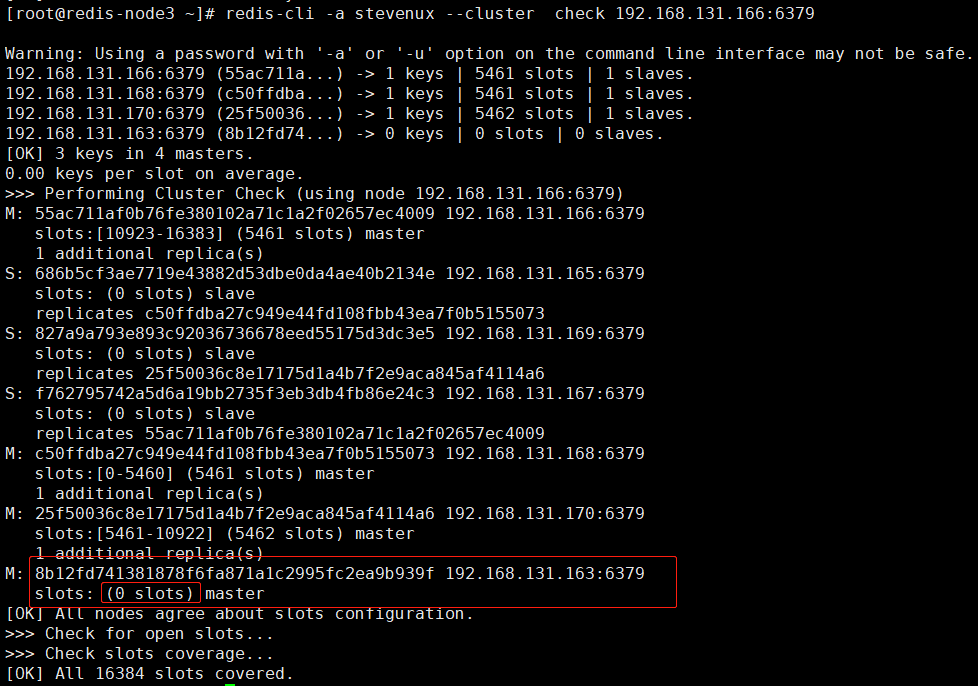

使用`redis-cli --cluster reshard NEWIP:PORT`重新分配曹位

```bash
[root@redis-node3 ~]# redis-cli -a stevenux --cluster reshard 192.168.131.163:6379
Warning: Using a password with '-a' or '-u' option on the command line interface may not be safe.
>>> Performing Cluster Check (using node 192.168.131.163:6379)
M: 8b12fd741381878f6fa871a1c2995fc2ea9b939f 192.168.131.163:6379
   slots: (0 slots) master
S: f762795742a5d6a19bb2735f3eb3db4fb86e24c3 192.168.131.167:6379
   slots: (0 slots) slave
   replicates 55ac711af0b76fe380102a71c1a2f02657ec4009
M: c50ffdba27c949e44fd108fbb43ea7f0b5155073 192.168.131.168:6379
   slots:[0-5460] (5461 slots) master
   1 additional replica(s)
S: 827a9a793e893c92036736678eed55175d3dc3e5 192.168.131.169:6379
   slots: (0 slots) slave
   replicates 25f50036c8e17175d1a4b7f2e9aca845af4114a6
M: 55ac711af0b76fe380102a71c1a2f02657ec4009 192.168.131.166:6379
   slots:[10923-16383] (5461 slots) master
   1 additional replica(s)
S: 686b5cf3ae7719e43882d53dbe0da4ae40b2134e 192.168.131.165:6379
   slots: (0 slots) slave
   replicates c50ffdba27c949e44fd108fbb43ea7f0b5155073
M: 25f50036c8e17175d1a4b7f2e9aca845af4114a6 192.168.131.170:6379
   slots:[5461-10922] (5462 slots) master
   1 additional replica(s)
[OK] All nodes agree about slots configuration.
>>> Check for open slots...
>>> Check slots coverage...
[OK] All 16384 slots covered.
How many slots do you want to move (from 1 to 16384)?4096 # 需要迁移的槽位
What is the receiving node ID? 8b12fd741381878f6fa871a1c2995fc2ea9b939f  # 接收曹位的主机ID(新增的节点ID)
Please enter all the source node IDs.
  Type 'all' to use all the nodes as source nodes for the hash slots.  # 输入all直接从各个master均分曹位到新节点
  Type 'done' once you entered all the source nodes IDs.
Source node #1: c50ffdba27c949e44fd108fbb43ea7f0b5155073  # 迁移曹位的源节点1
Source node #2: 55ac711af0b76fe380102a71c1a2f02657ec4009  # 迁移曹位的源节点2
Source node #3: 25f50036c8e17175d1a4b7f2e9aca845af4114a6  # 迁移曹位的源节点3
Source node #4: done    # 完成
    Moving slot 5468 from 25f50036c8e17175d1a4b7f2e9aca845af4114a6
    Moving slot 5469 from 25f50036c8e17175d1a4b7f2e9aca845af4114a6
    ...
     Moving slot 11809 from 55ac711af0b76fe380102a71c1a2f02657ec4009
    Moving slot 11810 from 55ac711af0b76fe380102a71c1a2f02657ec4009
Do you want to proceed with the proposed reshard plan (yes/no)?yes

```

##### 验证槽位迁移是否完成

Redis4:

```bash
[root@redis-server-node1 ~]# redis-trib.rb check 192.168.100.16:6379
>>> Performing Cluster Check (using node 192.168.100.16:6379)
M: 69e8db533eb78a831013a398bf2ef3ac4d23c8fb 192.168.100.16:6379
   slots:0-1364,5461-6826,10923-12287 (4096 slots) master
   0 additional replica(s)
M: 9f26fd0ac2b4694708c76edeb71d3c9ed02bbae4 192.168.100.11:6379
   slots:6827-10922 (4096 slots) master
   0 additional replica(s)
S: 9884dd51c7bd74c4abb2b9dc5ac0409488f2c0ae 192.168.100.13:6379
   slots: (0 slots) slave
   replicates 6789c52caa900c09dda2df57132e73646bcf3735
M: 90c32a437cff64d61aa433b46d3143c77bc66eec 192.168.100.10:6379
   slots:1365-5460 (4096 slots) master
   1 additional replica(s)
S: 8c495ba64297d26f30101d4d63e9898239d1160f 192.168.100.14:6379
   slots: (0 slots) slave
   replicates 90c32a437cff64d61aa433b46d3143c77bc66eec
M: 6789c52caa900c09dda2df57132e73646bcf3735 192.168.100.12:6379
   slots:12288-16383 (4096 slots) master
   1 additional replica(s)
[OK] All nodes agree about slots configuration.
>>> Check for open slots...
>>> Check slots coverage...
[OK] All 16384 slots covered.
```

Redis5:

```bash

```

##### 为新的 master 添加 slave 节点

再加一台节点 Slave:192.168.131.164 来作为新加的 Master 的从库，实现高可用

Redis4:

```bash
# 添加
root@redis-server-node1 ~]# redis-trib.rb add-node 192.168.100.17:6379 192.168.100.10:6379
>>> Adding node 192.168.100.17:6379 to cluster 192.168.100.10:6379
>>> Performing Cluster Check (using node 192.168.100.10:6379)
M: 90c32a437cff64d61aa433b46d3143c77bc66eec 192.168.100.10:6379
   slots:1365-5460 (4096 slots) master
   1 additional replica(s)
M: 6789c52caa900c09dda2df57132e73646bcf3735 192.168.100.12:6379
   slots:12288-16383 (4096 slots) master
   1 additional replica(s)
M: 69e8db533eb78a831013a398bf2ef3ac4d23c8fb 192.168.100.16:6379
   slots:0-1364,5461-6826,10923-12287 (4096 slots) master
   0 additional replica(s)
S: 9884dd51c7bd74c4abb2b9dc5ac0409488f2c0ae 192.168.100.13:6379
   slots: (0 slots) slave
   replicates 6789c52caa900c09dda2df57132e73646bcf3735
S: 8c495ba64297d26f30101d4d63e9898239d1160f 192.168.100.14:6379
   slots: (0 slots) slave
   replicates 90c32a437cff64d61aa433b46d3143c77bc66eec
M: 9f26fd0ac2b4694708c76edeb71d3c9ed02bbae4 192.168.100.11:6379
   slots:6827-10922 (4096 slots) master
   0 additional replica(s)
[OK] All nodes agree about slots configuration.
>>> Check for open slots...
>>> Check slots coverage...
[OK] All 16384 slots covered.
>>> Send CLUSTER MEET to node 192.168.100.17:6379 to make it join the cluster.
[OK] New node added correctly.


# 检查集群
[root@redis-server-node8 ~]# redis-trib.rb check 192.168.100.17
Invalid IP or Port (given as 192.168.100.17) - use IP:Port format
[root@redis-server-node8 ~]# redis-trib.rb check 192.168.100.17:6379
>>> Performing Cluster Check (using node 192.168.100.17:6379)
M: b39722ddcd69ef8ac2fdd792fa120c0732565cb2 192.168.100.17:6379
   slots: (0 slots) master
   0 additional replica(s)
M: 69e8db533eb78a831013a398bf2ef3ac4d23c8fb 192.168.100.16:6379
   slots:0-1364,5461-6826,10923-12287 (4096 slots) master
   0 additional replica(s)
M: 90c32a437cff64d61aa433b46d3143c77bc66eec 192.168.100.10:6379
   slots:1365-5460 (4096 slots) master
   1 additional replica(s)
S: 9884dd51c7bd74c4abb2b9dc5ac0409488f2c0ae 192.168.100.13:6379
   slots: (0 slots) slave
   replicates 6789c52caa900c09dda2df57132e73646bcf3735
M: 9f26fd0ac2b4694708c76edeb71d3c9ed02bbae4 192.168.100.11:6379
   slots:6827-10922 (4096 slots) master
   0 additional replica(s)
S: 8c495ba64297d26f30101d4d63e9898239d1160f 192.168.100.14:6379
   slots: (0 slots) slave
   replicates 90c32a437cff64d61aa433b46d3143c77bc66eec
M: 6789c52caa900c09dda2df57132e73646bcf3735 192.168.100.12:6379
   slots:12288-16383 (4096 slots) master
   1 additional replica(s)
[OK] All nodes agree about slots configuration.
>>> Check for open slots...
>>> Check slots coverage...
[OK] All 16384 slots covered.

# 设置192.168.100.16为192.168.100.17的主库
[root@redis-server-node8 ~]# redis-cli -h 192.168.100.17
192.168.100.17:6379> auth stevenux
OK
192.168.100.17:6379> info replication
# Replication
role:master
connected_slaves:0
master_replid:b44fe27c247dee3c68779e8855d21a7b04b7deda
master_replid2:0000000000000000000000000000000000000000
master_repl_offset:0
second_repl_offset:-1
repl_backlog_active:0
repl_backlog_size:1048576
repl_backlog_first_byte_offset:0
repl_backlog_histlen:0
192.168.100.17:6379> cluster replicate 69e8db533eb78a831013a398bf2ef3ac4d23c8fb  # 192.168.100.16的ID
OK
192.168.100.17:6379> config set masterauth stevenux
OK
192.168.100.17:6379> info replication
# Replication
role:slave
master_host:192.168.100.16   # 设置成功
master_port:6379
master_link_status:up
master_last_io_seconds_ago:6
master_sync_in_progress:0
slave_repl_offset:0
slave_priority:100
slave_read_only:1
connected_slaves:0
master_replid:67ac09c6185d2004f3b4fcebc5a352f61340ec36
master_replid2:0000000000000000000000000000000000000000
master_repl_offset:0
second_repl_offset:-1
repl_backlog_active:1
repl_backlog_size:1048576
repl_backlog_first_byte_offset:1
repl_backlog_histlen:0

# 检查集群完整性
[root@redis-server-node7 ~]# redis-trib.rb check 192.168.100.16:6379
>>> Performing Cluster Check (using node 192.168.100.16:6379)
M: 69e8db533eb78a831013a398bf2ef3ac4d23c8fb 192.168.100.16:6379
   slots:0-1364,5461-6826,10923-12287 (4096 slots) master
   1 additional replica(s)
M: 9f26fd0ac2b4694708c76edeb71d3c9ed02bbae4 192.168.100.11:6379
   slots:6827-10922 (4096 slots) master
   1 additional replica(s)
S: 9884dd51c7bd74c4abb2b9dc5ac0409488f2c0ae 192.168.100.13:6379
   slots: (0 slots) slave
   replicates 6789c52caa900c09dda2df57132e73646bcf3735
S: 79a9a7ec7b4963dc44e9a8ff6e8ad6b233e242c2 192.168.100.15:6379
   slots: (0 slots) slave
   replicates 9f26fd0ac2b4694708c76edeb71d3c9ed02bbae4
M: 90c32a437cff64d61aa433b46d3143c77bc66eec 192.168.100.10:6379
   slots:1365-5460 (4096 slots) master
   1 additional replica(s)
S: b39722ddcd69ef8ac2fdd792fa120c0732565cb2 192.168.100.17:6379
   slots: (0 slots) slave
   replicates 69e8db533eb78a831013a398bf2ef3ac4d23c8fb
S: 8c495ba64297d26f30101d4d63e9898239d1160f 192.168.100.14:6379
   slots: (0 slots) slave
   replicates 90c32a437cff64d61aa433b46d3143c77bc66eec
M: 6789c52caa900c09dda2df57132e73646bcf3735 192.168.100.12:6379
   slots:12288-16383 (4096 slots) master
   1 additional replica(s)
[OK] All nodes agree about slots configuration.
>>> Check for open slots...
>>> Check slots coverage...
[OK] All 16384 slots covered.
```

Redis5:

```bash
[root@redis-node3 ~]# redis-cli -a stevenux --cluster add-node 192.168.131.164:6379 192.168.131.165:6379
Warning: Using a password with '-a' or '-u' option on the command line interface may not be safe.
>>> Adding node 192.168.131.164:6379 to cluster 192.168.131.165:6379
>>> Performing Cluster Check (using node 192.168.131.165:6379)
S: 686b5cf3ae7719e43882d53dbe0da4ae40b2134e 192.168.131.165:6379
   slots: (0 slots) slave
   replicates c50ffdba27c949e44fd108fbb43ea7f0b5155073
M: 8b12fd741381878f6fa871a1c2995fc2ea9b939f 192.168.131.163:6379
   slots: (0 slots) master
M: 25f50036c8e17175d1a4b7f2e9aca845af4114a6 192.168.131.170:6379
   slots:[5461-10922] (5462 slots) master
   1 additional replica(s)
S: f762795742a5d6a19bb2735f3eb3db4fb86e24c3 192.168.131.167:6379
   slots: (0 slots) slave
   replicates 55ac711af0b76fe380102a71c1a2f02657ec4009
S: 827a9a793e893c92036736678eed55175d3dc3e5 192.168.131.169:6379
   slots: (0 slots) slave
   replicates 25f50036c8e17175d1a4b7f2e9aca845af4114a6
M: c50ffdba27c949e44fd108fbb43ea7f0b5155073 192.168.131.168:6379
   slots:[0-5460] (5461 slots) master
   1 additional replica(s)
M: 55ac711af0b76fe380102a71c1a2f02657ec4009 192.168.131.166:6379
   slots:[10923-16383] (5461 slots) master
   1 additional replica(s)
[OK] All nodes agree about slots configuration.
>>> Check for open slots...
>>> Check slots coverage...
[OK] All 16384 slots covered.
>>> Send CLUSTER MEET to node 192.168.131.164:6379 to make it join the cluster.
[OK] New node added correctly.
```

##### 更改新节点状态为 slave

需要手动将其指定为某个 master 的 slave，否则其默认角色为 master
登录新节点，使用命令`CLUSTER REPLICATE MasterID`配置为某 master 的 slave

```bash
192.168.131.164:6379> CLUSTER REPLICATE f98ad5793d9faefdce6dccd274c9afd9d82f07de
192.168.131.164:6379> CONFIG SET masterauth stevenux


# 设置192.168.100.16为192.168.100.17的主库
[root@redis-server-node8 ~]# redis-cli -h 192.168.100.17
192.168.100.17:6379> auth stevenux
OK
192.168.100.17:6379> info replication
# Replication
role:master
connected_slaves:0
master_replid:b44fe27c247dee3c68779e8855d21a7b04b7deda
master_replid2:0000000000000000000000000000000000000000
master_repl_offset:0
second_repl_offset:-1
repl_backlog_active:0
repl_backlog_size:1048576
repl_backlog_first_byte_offset:0
repl_backlog_histlen:0
192.168.100.17:6379> cluster replicate 69e8db533eb78a831013a398bf2ef3ac4d23c8fb  # 192.168.100.16的ID
OK
192.168.100.17:6379> config set masterauth stevenux
OK
192.168.100.17:6379> info replication
# Replication
role:slave
master_host:192.168.100.16   # 设置成功
master_port:6379
master_link_status:up
master_last_io_seconds_ago:6
master_sync_in_progress:0
slave_repl_offset:0
slave_priority:100
slave_read_only:1
connected_slaves:0
master_replid:67ac09c6185d2004f3b4fcebc5a352f61340ec36
master_replid2:0000000000000000000000000000000000000000
master_repl_offset:0
second_repl_offset:-1
repl_backlog_active:1
repl_backlog_size:1048576
repl_backlog_first_byte_offset:1
repl_backlog_histlen:0
```

##### 验证当前集群状态

确保每个 Mater 都有一个 Slave 节点

Redis4:

```bash
[root@redis-server-node7 ~]# redis-trib.rb check 192.168.100.16:6379
>>> Performing Cluster Check (using node 192.168.100.16:6379)
M: 69e8db533eb78a831013a398bf2ef3ac4d23c8fb 192.168.100.16:6379
   slots:0-1364,5461-6826,10923-12287 (4096 slots) master
   1 additional replica(s)
M: 9f26fd0ac2b4694708c76edeb71d3c9ed02bbae4 192.168.100.11:6379
   slots:6827-10922 (4096 slots) master
   1 additional replica(s)
S: 9884dd51c7bd74c4abb2b9dc5ac0409488f2c0ae 192.168.100.13:6379
   slots: (0 slots) slave
   replicates 6789c52caa900c09dda2df57132e73646bcf3735
S: 79a9a7ec7b4963dc44e9a8ff6e8ad6b233e242c2 192.168.100.15:6379
   slots: (0 slots) slave
   replicates 9f26fd0ac2b4694708c76edeb71d3c9ed02bbae4
M: 90c32a437cff64d61aa433b46d3143c77bc66eec 192.168.100.10:6379
   slots:1365-5460 (4096 slots) master
   1 additional replica(s)
S: b39722ddcd69ef8ac2fdd792fa120c0732565cb2 192.168.100.17:6379
   slots: (0 slots) slave
   replicates 69e8db533eb78a831013a398bf2ef3ac4d23c8fb
S: 8c495ba64297d26f30101d4d63e9898239d1160f 192.168.100.14:6379
   slots: (0 slots) slave
   replicates 90c32a437cff64d61aa433b46d3143c77bc66eec
M: 6789c52caa900c09dda2df57132e73646bcf3735 192.168.100.12:6379
   slots:12288-16383 (4096 slots) master
   1 additional replica(s)
[OK] All nodes agree about slots configuration.
>>> Check for open slots...
>>> Check slots coverage...
[OK] All 16384 slots covered.
```

Redis5:

```bash
[root@redis-node5 ~]# redis-cli -a stevenux --cluster check 192.168.131.170:6379
Warning: Using a password with '-a' or '-u' option on the command line interface may not be safe.
192.168.131.170:6379 (25f50036...) -> 0 keys | 4096 slots | 1 slaves.
192.168.131.167:6379 (d81888e8...) -> 0 keys | 4096 slots | 1 slaves.
192.168.131.168:6379 (314e1ca8...) -> 0 keys | 4096 slots | 1 slaves.
192.168.131.169:6379 (827a9a79...) -> 0 keys | 4096 slots | 1 slaves.
[OK] 0 keys in 4 masters.
0.00 keys per slot on average.
>>> Performing Cluster Check (using node 192.168.131.170:6379)
M: 25f50036c8e17175d1a4b7f2e9aca845af4114a6 192.168.131.170:6379
   slots:[0-4095] (4096 slots) master
   1 additional replica(s)
M: d81888e80018bb7ecdd7778373317ea591beb16a 192.168.131.167:6379
   slots:[12288-16383] (4096 slots) master
   1 additional replica(s)
S: 27b4c0993bdba6460123655a5167ca32ad3c497d 192.168.131.163:6379
   slots: (0 slots) slave
   replicates d81888e80018bb7ecdd7778373317ea591beb16a
S: 3f3f142332722bda502d1019cbdce87dbcb89b70 192.168.131.164:6379
   slots: (0 slots) slave
   replicates 314e1ca8d842bfafb8b059cab891e662b5240b3b
S: 4a1e762f3d69113005617379cb4d290c9a792185 192.168.131.165:6379
   slots: (0 slots) slave
   replicates 827a9a793e893c92036736678eed55175d3dc3e5
M: 314e1ca8d842bfafb8b059cab891e662b5240b3b 192.168.131.168:6379
   slots:[8192-12287] (4096 slots) master
   1 additional replica(s)
M: 827a9a793e893c92036736678eed55175d3dc3e5 192.168.131.169:6379
   slots:[4096-8191] (4096 slots) master
   1 additional replica(s)
S: 809c3debc42c25256001b0abcac46b23d64b0402 192.168.131.166:6379
   slots: (0 slots) slave
   replicates 25f50036c8e17175d1a4b7f2e9aca845af4114a6
[OK] All nodes agree about slots configuration.
>>> Check for open slots...
>>> Check slots coverage...
[OK] All 16384 slots covered.
```

#### 2.2.3.2 动态删除节点

添加节点的时候是先添加 node 节点到集群，然后分配槽位，删除节点的操作与添加节点
的操作正好相反，是先将被删除的 Redis node 上的槽位迁移到集群中的其他 Redis node
节点上，然后再将其删除，如果一个 Redis node 节点上的槽位没有被完全迁移，删除该
node 的时候会提示有数据且无法删除。

##### 迁移要删除的 master 的槽位至其他 master

被迁移 Redis master 源服务器必须保证没有数据，否则迁移报错并会被强制中断

Redis4：

```bash
# 192.168.100.16 --> 192.168.100.10  移动4096
root@redis-server-node6 ~]# redis-trib.rb check 192.168.100.16:6379
...
Moving slot 12283 from 192.168.100.16:6379 to 192.168.100.10:6379:
Moving slot 12284 from 192.168.100.16:6379 to 192.168.100.10:6379:
Moving slot 12285 from 192.168.100.16:6379 to 192.168.100.10:6379:
Moving slot 12286 from 192.168.100.16:6379 to 192.168.100.10:6379:
Moving slot 12287 from 192.168.100.16:6379 to 192.168.100.10:6379:

[root@redis-server-node6 ~]# redis-trib.rb check 192.168.100.16:6379
>>> Performing Cluster Check (using node 192.168.100.16:6379)
M: 69e8db533eb78a831013a398bf2ef3ac4d23c8fb 192.168.100.16:6379
   slots: (0 slots) master  # 已经没有槽位
   0 additional replica(s)
M: 9f26fd0ac2b4694708c76edeb71d3c9ed02bbae4 192.168.100.11:6379
   slots:6827-10922 (4096 slots) master
   1 additional replica(s)
S: 9884dd51c7bd74c4abb2b9dc5ac0409488f2c0ae 192.168.100.13:6379
   slots: (0 slots) slave
   replicates 6789c52caa900c09dda2df57132e73646bcf3735
S: 79a9a7ec7b4963dc44e9a8ff6e8ad6b233e242c2 192.168.100.15:6379
   slots: (0 slots) slave
   replicates 9f26fd0ac2b4694708c76edeb71d3c9ed02bbae4
M: 90c32a437cff64d61aa433b46d3143c77bc66eec 192.168.100.10:6379
   slots:0-6826,10923-12287 (8192 slots) master   # 8192个
   2 additional replica(s)
S: b39722ddcd69ef8ac2fdd792fa120c0732565cb2 192.168.100.17:6379
   slots: (0 slots) slave
   replicates 90c32a437cff64d61aa433b46d3143c77bc66eec
S: 8c495ba64297d26f30101d4d63e9898239d1160f 192.168.100.14:6379
   slots: (0 slots) slave
   replicates 90c32a437cff64d61aa433b46d3143c77bc66eec
M: 6789c52caa900c09dda2df57132e73646bcf3735 192.168.100.12:6379
   slots:12288-16383 (4096 slots) master
   1 additional replica(s)
[OK] All nodes agree about slots configuration.
>>> Check for open slots...
>>> Check slots coverage...
[OK] All 16384 slots covered.


```

```bash
[root@s1 ~]# redis-trib.rb    reshard  192.168.7.101:6379
[root@s1 ~]# redis-trib.rb fix  192.168.7101:6379  # 如果迁移失败使用此命令修复集群
```

Redis5：

```bash
[root@redis-node5 ~]# redis-cli -a stevenux --cluster reshard 192.168.131.170:6379
Warning: Using a password with '-a' or '-u' option on the command line interface may not be safe.
>>> Performing Cluster Check (using node 192.168.131.170:6379)
M: 25f50036c8e17175d1a4b7f2e9aca845af4114a6 192.168.131.170:6379
   slots:[0-4095] (4096 slots) master
   1 additional replica(s)
M: d81888e80018bb7ecdd7778373317ea591beb16a 192.168.131.167:6379
   slots:[12288-16383] (4096 slots) master
   1 additional replica(s)
S: 27b4c0993bdba6460123655a5167ca32ad3c497d 192.168.131.163:6379
   slots: (0 slots) slave
   replicates d81888e80018bb7ecdd7778373317ea591beb16a
S: 3f3f142332722bda502d1019cbdce87dbcb89b70 192.168.131.164:6379
   slots: (0 slots) slave
   replicates 314e1ca8d842bfafb8b059cab891e662b5240b3b
S: 4a1e762f3d69113005617379cb4d290c9a792185 192.168.131.165:6379
   slots: (0 slots) slave
   replicates 827a9a793e893c92036736678eed55175d3dc3e5
M: 314e1ca8d842bfafb8b059cab891e662b5240b3b 192.168.131.168:6379
   slots:[8192-12287] (4096 slots) master
   1 additional replica(s)
M: 827a9a793e893c92036736678eed55175d3dc3e5 192.168.131.169:6379
   slots:[4096-8191] (4096 slots) master
   1 additional replica(s)
S: 809c3debc42c25256001b0abcac46b23d64b0402 192.168.131.166:6379
   slots: (0 slots) slave
   replicates 25f50036c8e17175d1a4b7f2e9aca845af4114a6
[OK] All nodes agree about slots configuration.
>>> Check for open slots...
>>> Check slots coverage...
[OK] All 16384 slots covered.
How many slots do you want to move (from 1 to 16384)? 4096
What is the receiving node ID? d81888e80018bb7ecdd7778373317ea591beb16a  # 167接收
Please enter all the source node IDs.
  Type 'all' to use all the nodes as source nodes for the hash slots.
  Type 'done' once you entered all the source nodes IDs.
Source node #1: 25f50036c8e17175d1a4b7f2e9aca845af4114a6 # 170为源
Source node #2: done
   Moving slot 4095 from 25f50036c8e17175d1a4b7f2e9aca845af4114a6
Do you want to proceed with the proposed reshard plan (yes/no)? yes
Moving slot 0 from 192.168.131.170:6379 to 192.168.131.167:6379
...
Moving slot 4095 from 192.168.131.170:6379 to 192.168.131.167:6379
```

##### 从机集群删除服务器

虽然槽位已经迁移完成，但是服务器 IP 信息还在集群当中，因此还需要将 IP
信息从集群删除。

Redis3/4:

```bash
~$ redis-rtib.rb del-node 192.168.131.170:6379 25f50036c8e17175d1a4b7f2e9aca845af4114a6
[root@redis-server-node6 ~]# redis-trib.rb del-node 192.168.100.16:6379 69e8db533eb78a831013a398bf2ef3ac4d23c8fb
>>> Removing node 69e8db533eb78a831013a398bf2ef3ac4d23c8fb from cluster 192.168.100.16:6379
>>> Sending CLUSTER FORGET messages to the cluster...
>>> SHUTDOWN the node.
```

Redis5:

```bash
~$ redis-cli -a stevenux --cluster del-node 192.168.131.170:6379 25f50036c8e17175d1a4b7f2e9aca845af4114a6
```

##### 验证节点是否删除

Redis4:
确认 192.168.100.16 已经从集群删除

```bash
[root@redis-server-node6 ~]# redis-trib.rb check 192.168.100.16:6379
[ERR] Sorry, can't connect to node 192.168.100.16:6379
[root@redis-server-node6 ~]# redis-trib.rb check 192.168.100.16:6379
[ERR] Sorry, can't connect to node 192.168.100.16:6379
[root@redis-server-node6 ~]# redis-trib.rb check 192.168.100.15:6379
>>> Performing Cluster Check (using node 192.168.100.15:6379)
S: 79a9a7ec7b4963dc44e9a8ff6e8ad6b233e242c2 192.168.100.15:6379
   slots: (0 slots) slave
   replicates 9f26fd0ac2b4694708c76edeb71d3c9ed02bbae4
S: b39722ddcd69ef8ac2fdd792fa120c0732565cb2 192.168.100.17:6379
   slots: (0 slots) slave
   replicates 90c32a437cff64d61aa433b46d3143c77bc66eec
S: 9884dd51c7bd74c4abb2b9dc5ac0409488f2c0ae 192.168.100.13:6379
   slots: (0 slots) slave
   replicates 6789c52caa900c09dda2df57132e73646bcf3735
S: 8c495ba64297d26f30101d4d63e9898239d1160f 192.168.100.14:6379
   slots: (0 slots) slave
   replicates 90c32a437cff64d61aa433b46d3143c77bc66eec
M: 90c32a437cff64d61aa433b46d3143c77bc66eec 192.168.100.10:6379
   slots:0-6826,10923-12287 (8192 slots) master
   2 additional replica(s)  # 192.168.100.17跑到了192.168.100.10的直播间！！！
M: 9f26fd0ac2b4694708c76edeb71d3c9ed02bbae4 192.168.100.11:6379
   slots:6827-10922 (4096 slots) master
   1 additional replica(s)
M: 6789c52caa900c09dda2df57132e73646bcf3735 192.168.100.12:6379
   slots:12288-16383 (4096 slots) master
   1 additional replica(s)
[OK] All nodes agree about slots configuration.
>>> Check for open slots...
>>> Check slots coverage...
[OK] All 16384 slots covered.
```

Redis5:
确认 192.168.131.170 已经从集群删除

```bash
~$ redis-cli -a stevenux --cluster check 192.168.131.163:6379
```

注：192.168.131.170 被删除之后，其之前的 slave 自动成为了 Redis 集群中其他 master
的 slave，此节点如果不需要也可以一并删除。

##### 验证删除 192.168.131.170 后的集群

```bash
~$ redis-cli -a stevenux --cluster check 192.168.131.163:6379
```

##### 验证删除 192.168.100.16 后的集群

```bash
[root@redis-server-node6 ~]# redis-trib.rb check 192.168.100.15:6379
>>> Performing Cluster Check (using node 192.168.100.15:6379)
S: 79a9a7ec7b4963dc44e9a8ff6e8ad6b233e242c2 192.168.100.15:6379
   slots: (0 slots) slave
   replicates 9f26fd0ac2b4694708c76edeb71d3c9ed02bbae4
S: b39722ddcd69ef8ac2fdd792fa120c0732565cb2 192.168.100.17:6379
   slots: (0 slots) slave
   replicates 90c32a437cff64d61aa433b46d3143c77bc66eec
S: 9884dd51c7bd74c4abb2b9dc5ac0409488f2c0ae 192.168.100.13:6379
   slots: (0 slots) slave
   replicates 6789c52caa900c09dda2df57132e73646bcf3735
S: 8c495ba64297d26f30101d4d63e9898239d1160f 192.168.100.14:6379
   slots: (0 slots) slave
   replicates 90c32a437cff64d61aa433b46d3143c77bc66eec
M: 90c32a437cff64d61aa433b46d3143c77bc66eec 192.168.100.10:6379
   slots:0-6826,10923-12287 (8192 slots) master
   2 additional replica(s)  # 192.168.100.17跑到了192.168.100.10的直播间！！！
M: 9f26fd0ac2b4694708c76edeb71d3c9ed02bbae4 192.168.100.11:6379
   slots:6827-10922 (4096 slots) master
   1 additional replica(s)
M: 6789c52caa900c09dda2df57132e73646bcf3735 192.168.100.12:6379
   slots:12288-16383 (4096 slots) master
   1 additional replica(s)
[OK] All nodes agree about slots configuration.
>>> Check for open slots...
>>> Check slots coverage...
[OK] All 16384 slots covered.
```

#### 2.2.3.3 模拟 Master 宕机

目前的架构为三主三从，互为跨主机 master-slave 模式，测试 master 宕机之后
是否会自动切换至 slave。

##### 测试 Master:192.168.100.11 数据写入

```bash
[root@redis-server-node2 ~]# redis-cli -h 192.168.100.11
192.168.100.11:6379> AUTH stevenux
OK
192.168.100.11:6379> SET master immaster
(error) MOVED 5565 192.168.100.10:6379
192.168.100.11:6379> SET master1 immaster
(error) MOVED 170 192.168.100.10:6379
192.168.100.11:6379> SET master2 immaster
(error) MOVED 12489 192.168.100.12:6379
192.168.100.11:6379> SET master3 immaster  # master3
OK
192.168.100.11:6379> SET master6 immaster
(error) MOVED 12365 192.168.100.12:6379
192.168.100.11:6379> SET master5 immaster
(error) MOVED 46 192.168.100.10:6379
192.168.100.11:6379> SET master4 immaster
(error) MOVED 4111 192.168.100.10:6379
192.168.100.11:6379> SET master7 immaster  # master7
OK

```

##### 测试 Slave:192.168.100.15 数据同步

```bash
[root@redis-server-node6 ~]# redis-cli -h 192.168.100.15
192.168.100.15:6379> AUTH stevenux
OK
192.168.100.15:6379> KEYS *
1) "master7"
2) "master3"
```

##### 停止 master 并验证故障转移

Redis Master 服务停止之后，其对应的 slave 会被选举为 master 继续处理数据
的读写操作

```bash
[root@redis-server-node2 ~]# systemctl stop redis

```

##### 验证 Slave 日志

```bash
[root@redis-server-node6 ~]# tail -f -n30 /apps/redis/logs/redis.log
...
1692:S 13 Feb 23:41:25.587 * MASTER <-> SLAVE sync started
1692:S 13 Feb 23:41:25.587 # Error condition on socket for SYNC: Connection refused
1692:S 13 Feb 23:41:26.091 # Starting a failover election for epoch 10.
1692:S 13 Feb 23:41:26.093 # Currently unable to failover: Waiting for votes, but majority still not reached.
1692:S 13 Feb 23:41:26.093 # Failover election won: I'm the new master. # 选为master
1692:S 13 Feb 23:41:26.093 # configEpoch set to 10 after successful failover
1692:M 13 Feb 23:41:26.093 # Setting secondary replication ID to bbc2adff0a23a7b90be69e27353b95c9c5d6954c, valid up to offset: 113. New replication ID is 7d75d5faf1386624d99d9e9f1e59524698ab3b6f
1692:M 13 Feb 23:41:26.093 * Discarding previously cached master state.
1692:M 13 Feb 23:41:26.093 # Cluster state changed: ok  # 集群状态更新
1692:M 13 Feb 23:41:31.353 * Slave 192.168.100.14:6379 asks for synchronization
...

[root@redis-server-node2 ~]# redis-trib.rb check 192.168.100.15:6379
>>> Performing Cluster Check (using node 192.168.100.15:6379)
M: 79a9a7ec7b4963dc44e9a8ff6e8ad6b233e242c2 192.168.100.15:6379  # 已经提升为主库
   slots:6827-10922 (4096 slots) master
   1 additional replica(s)
S: b39722ddcd69ef8ac2fdd792fa120c0732565cb2 192.168.100.17:6379
   slots: (0 slots) slave
   replicates 90c32a437cff64d61aa433b46d3143c77bc66eec
S: 9884dd51c7bd74c4abb2b9dc5ac0409488f2c0ae 192.168.100.13:6379
   slots: (0 slots) slave
   replicates 6789c52caa900c09dda2df57132e73646bcf3735
S: 8c495ba64297d26f30101d4d63e9898239d1160f 192.168.100.14:6379
   slots: (0 slots) slave
   replicates 79a9a7ec7b4963dc44e9a8ff6e8ad6b233e242c2
M: 90c32a437cff64d61aa433b46d3143c77bc66eec 192.168.100.10:6379
   slots:0-6826,10923-12287 (8192 slots) master
   1 additional replica(s)
M: 6789c52caa900c09dda2df57132e73646bcf3735 192.168.100.12:6379
   slots:12288-16383 (4096 slots) master
   1 additional replica(s)
[OK] All nodes agree about slots configuration.
>>> Check for open slots...
>>> Check slots coverage...
[OK] All 16384 slots covered.
`
```

#### 2.2.3.4 导入现有 Redis 数据

导入数据需要 redis cluster 不能与被导入的数据有重复的 key 名称，否则
导入不成功或中断。例如：
公司将 redis cluster 部署完成之后，需要将之前的数据导入之 Redis cluster
集群，但是由于 Redis cluster 使用的分片保存 key 的机制，因此使用传统的 AOF
文件或 RDB 快照无法满足需求，因此需要使用集群数据导入命令完成。

导入数据之前需要关闭各 redis 服务器的密码，包括集群中的各 node 和源 Redis server，
避免认证带来的环境不一致从而无法导入，可以加参数--cluster-replace 强制替换
Redis cluster 已有的 key。

```bash
[root@redis-server-node1 ~]# redis-trib.rb import --from 192.168.100.16:6379 --replace 192.168.100.12:6379
root@redis-server-node1 ~]# redis-trib.rb import --from 192.168.100.16:6379 --replace 192.168.100.10:6379
>>> Importing data from 192.168.100.16:6379 to cluster
>>> Performing Cluster Check (using node 192.168.100.10:6379)
M: 90c32a437cff64d61aa433b46d3143c77bc66eec 192.168.100.10:6379
   slots:0-6826,10923-12287 (8192 slots) master
   1 additional replica(s)
M: 79a9a7ec7b4963dc44e9a8ff6e8ad6b233e242c2 192.168.100.15:6379
   slots:6827-10922 (4096 slots) master
   1 additional replica(s)
S: b39722ddcd69ef8ac2fdd792fa120c0732565cb2 192.168.100.17:6379
   slots: (0 slots) slave
   replicates 90c32a437cff64d61aa433b46d3143c77bc66eec
M: 9884dd51c7bd74c4abb2b9dc5ac0409488f2c0ae 192.168.100.13:6379
   slots:12288-16383 (4096 slots) master
   0 additional replica(s)
S: 8c495ba64297d26f30101d4d63e9898239d1160f 192.168.100.14:6379
   slots: (0 slots) slave
   replicates 79a9a7ec7b4963dc44e9a8ff6e8ad6b233e242c2
[OK] All nodes agree about slots configuration.
>>> Check for open slots...
>>> Check slots coverage...
[OK] All 16384 slots covered.
>>> Connecting to the source Redis instance
*** Importing 5 keys from DB 0
Migrating fourth to 192.168.100.10:6379: ERR Syntax error, try CLIENT (LIST | KILL | GETNAME | SETNAME | PAUSE | REPLY)
Migrating kssdf to 192.168.100.15:6379: ERR Syntax error, try CLIENT (LIST | KILL | GETNAME | SETNAME | PAUSE | REPLY)
Migrating second to 192.168.100.10:6379: ERR Syntax error, try CLIENT (LIST | KILL | GETNAME | SETNAME | PAUSE | REPLY)
Migrating ksdf to 192.168.100.10:6379: ERR Syntax error, try CLIENT (LIST | KILL | GETNAME | SETNAME | PAUSE | REPLY)
Migrating key1 to 192.168.100.15:6379: ERR Syntax error, try CLIENT (LIST | KILL | GETNAME | SETNAME | PAUSE | REPLY)

# 该错误可参考这篇博文：https://blog.csdn.net/m0_37128231/article/details/80755478
```

### 2.2.4 Redis 扩展集群的第三方方案

除了 Redis 官方自带的 Redis cluster 集群之外，还有一些开源的集群解决
方案可供参考使用，但是大部分公司不会使用。

#### 2.2.4.1 Codis

Codis 是一个分布式 Redis 解决方案, 对于上层的应用来说, 连接到 Codis Proxy
和连接原生的 Redis Server 没有显著区别 (令不支持的命列表), 上层应用可以像使
用单机的 Redis 一样使用, Codis 底层会处理请求的转发, 不停机的数据迁移等工作,
所有后边的一切事情, 对于前面的客户端来说是透明的, 可以简单的认为后边连接的是
一个内存无限大的 Redis 服务。

codis-proxy 相当于 redis，即连接 codis-proxy 和连接 redis 是没有任何区别的，
codis-proxy 无状态，不负责记录是否在哪保存，数据在 zookeeper 记录，即 codis
proxy 向 zookeeper 查询 key 的记录位置，proxy 将请求转发到一个组进行处理，一
个组里面有一个 master 和一个或者多个 slave 组成，默认有 1024 个槽位，
redis cluster 默认有 16384 个槽位，其把不同的槽位的内容放在不同的 group。

[Github 项目地址](https://github.com/CodisLabs/codis/)

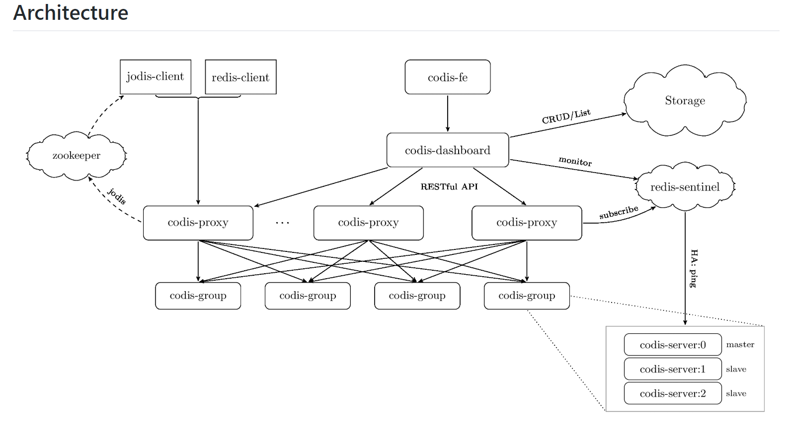

#### 2.2.4.2 twemproxy

由 Twemproxy 双向代理客户端实现分片，即代替用户将数据分片并到不同的后端服务器
进行读写，其还支持 memcached，可以为 proxy 配置算法，缺点为 twemproxy 是瓶颈，
不支持数据迁移。

[GitHub 项目地址](https://github.com/twitter/twemproxy)
