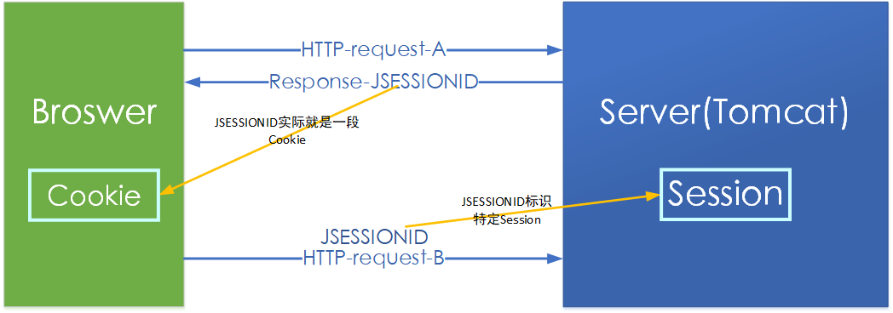
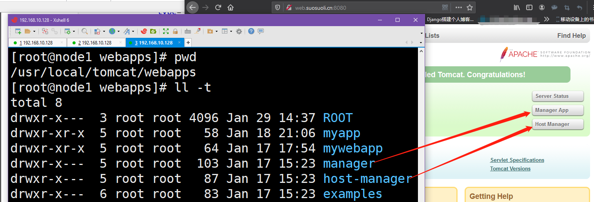

# 一.Web 应用配置和部署

## 1.1 介绍

web.xm 是 web 应用的描述文件，它支持的元素及属性来自于 servlet 规范定义。在 Tomcat
中，web 应用的描述信息包括 `tomcat/conf/web.xml` 中的默认配置以及 web 应用文件目录
中 `WEB-INE/web.xml` 内的定制配置。

## 1.2 ServletContext 初始化参数

可以通过`<context-param>`添加 Servletcontext 初始化参数，它配置了一个键值对,这样就
可以在应用程序中使用 javax.servlet.servletContext.getInitParameter()方法获取参数，
以此来配置 Servlet context 初始化时的一些参数信息，也就是说通过`<context-param>`配
置的参数可以在 servlet 中使用。

```xml
<context-param>
    <param-name>contextConfigLocation</param-name>
    <param-value>classpath:applicationContext-*.xm1</param-value>
    <description>Spring Config File Location</description>
</context-param>

<!-- 例如：web.xml中配置为 -->
<context-param>
    <param-name>site_of_project</param-name> <!-- 参数名 -->
    <param-value>www.suosuoli.cn</param-value>
</context-param>

<!-- 在servlet中使用下面的方法获取该参数 -->
public class BbsServlet extends HttpServlet {

@Override
protected void doGet (...){
String value = req.getServletContext ().getInitParameter( S: "site_of_project");<!-- 使用该方法获取参数 -->
System. out.println(value) ;
}
...
}
```

## 1.3 会话配置 session-config

### 1.3.1 会话介绍


如上图，左边为客户端浏览器，右边为服务器。假设 HTTP 请求 A 为登录请求，那么服务器端
就会记录此次登录信息，将其保存在服务端 Session 内。保存好后，服务器给客服端响应一
个 JSESSIONID，这个 JSESSIONID 实际上就是个 Cookie，将该 Cookie 写入给浏览器端，下
一次浏览器访问该服务器时，比如图中请求 B，就会带上 JSESSIONID，此时，服务器就知道
该客户端之前登录过，客户端也就不必再次登录。此时浏览器默认的 Cookie 就是 JSESSIONID。
Tomcat 的会话配置就是上图中 Session 交互过程的属性配置，如 Session 的生命周期，和 Cookie
相关配置。

### 1.3.2 会话配置

`<session-config>`用于配置 web 应用会话,包括超时时间、Cookie 配置以及会话追踪模式。
它将覆盖 server.xml 和 context.xml 中的相应配置。

```xml
<session-config>
    <session-timeout>30</session-timeout>  <!-- session有效期 -->
    <cookie-config>
        <name>JESSIONID</name>  <!-- 默认的cookie名叫JSESSIONID -->
        <domain>www.suosuoli.cn</domain>
        <path>/</path>
        <comment>Session Cookie</comment> <!-- 注释信息 -->
        <http-only>true</http-only>  <!-- 该cookie对象只能通过http请求携带到服务端 -->
        <secure>false</secure>  <!-- true 则表示只允许https协议携带该cookie -->
        <max-age>3600</max-age> <!-- cookie的有效期 -->
    </cookie-config>
    <tracking-mode>COOKIE</tracking-mode> <!-- session会话的跟踪模式，此处使用cookie跟踪，还可以使用URL或者SSL -->
</session-config>
```

配置说明：

1. `session-timeout` :会话超时时间 ，单位分钟
2. `cookie-config`: 用于配置会话追踪 Cookie
   `name` : Cookie 的名称
   `domain` : Cookie 的域名
   `path` : Cookie 的路径
   `comment` : 注释
   `http-only` : cookie 只能通过 HTTP 方式进行访问，JS 无法读取或修改，此项可以
   增加网站访问的安全性。
   `secure` :此 cookie 只能通过 HTTPs 连接传递到服务器，而 HTTP 连接则不会传递
   该信息。注意是从浏览器传递到服务器，服务器端的`Cookie`对象不受此项影响。
   `max-age` :以秒为单位表示 cookie 的生存期，默认为-1 表示是会话 cookie，浏览器
   关闭时就会消失。
3. `tracking-mode` :用于配置会话追踪模式，Servlet3.0 版本中支持的追踪模式:
   COOKIE、URL、 SSL
   A. `COOKIE` : 通过 HTTP Cookie 追踪会话是最常用的会话追踪机制，而且 servlet
   规范也要求所有的 Servlet 都需要支持 Cookie 追踪。
   B. `URL` : URL 重写是最基本的会话追踪机制。当客户端不支持 Cookie 时，可以采用
   URL 重写的方式。当采用 URL 追踪模式时,请求路径需要包含会话标识信息，Servlet 容
   器会根据路径中的会话标识设置请求的会话信息。如:
   http://www.suosuoli.cn/user/index.html;jessionid=1234567890.
   C. `SSL` :对于 SSL 请求，通过 SSL 会话标识确定请求会话标识。

## 1.4 Servlet 配置

Servlet 的配置主要是两部分，`servlet` 和 `servlet-mapping`:

```xml
<servlet>
    <servlet-name>myServlet</servlet-name>  <!-- servlet的名称 -->
    <servlet-class>cn.itcast.web.MyServlet</servlet-c1ass> <!-- 指定servlet类 -->
    <init-param> <!-- 针对当前的servlet的初始化参数配置 -->
        <param-name> fileName</param-name>
        <param-value>init.conf</param-value>
    </init-param>
    <load-on-startup>1</load-on-startup>  <!-- 当前servelt的加载顺序,0或者大于0时表示应用程序启动时加载该servlet -->
    <enabled>true</enabled> <!-- 当前servlet是否能够接受请求 -->
</servlet>

<servlet-mapping>  <!-- servlet映射配置 -->
    <servlet-name>myServlet</servlet-name>
    <url-pattern>*.do</url-pattern>
    <url-pattern>/myservlet/*</url-pattern>  <!-- 此配置表示访问http://www.suosuoli.cn/myservlet/* 等URL就找myServlet进行请求处理 -->
</servlet-mapping>
```

配置说明:

1. `servlet-name`: 指定 servlet 的名称，该属性在 web.xm1 中唯一。
2. `servlet-class` :用于指定 servlet 类名
3. `init-param`: 用于指定 servlet 的初始化参数 ，在应用中可以通过
   HttpServlet.getInitParameter 获取。
4. `load-on-startup`: 用于控制在 Web 应用启动时，Servlet 的加载顺序。
   若值小于 0，web 应用启动时，不加载该 servlet,第一次访问时加载，值
   为 0 或者大于 0，则表示程序启动时加载该 servlet。
5. `enabled`: true ，false 。若为 false ，表示 servlet 不处理任何请求。
6. `url-pattern`: 用于指定 URL 表达式，一个 servlet-mapping 可以同时
   配置多个 url-pattern.

Servlet 中文件上传配置示例：

```xml
<servlet>
<servlet-name>uploadServlet</servlet-name >
<servlet-class>cn.suosuoli.web.UploadServlet</servlet-class>
<multipart-config>
<location>D://path</location>
<max-file-size>10485760</max-file-size>
<max-request-size>10485760</max-request-aize>
<file-size-threshold>0</file-size-threshold>
</multipart-config>
</servlet>
```

配置说明:

1. `location` :存放生成的文件地址。
2. `max-file-size` :允许上传的文件最大值。 默认值为-1，表示没有限制。
3. `max-request-size` :针对该 multi/form-data 请求的最大数量，默认值为-1，
   表示无限制。
4. `file-size-threshold`: 当数量量大于该值时，内容会被写入文件。

## 1.5 Listener 配置

Listener 用于监听 servlet 中的事件,例如 context、request、 session 对象的创建、
修改、删除,并触发响应事件。Listener 是观察者模式的实现,在 servlet 中主要用于对
context、 request、 session 对象的生命周期进行监控。在 servlet2.5 规范中共定义
了 8 种 Listener。在启动时, servletContextlistener 的执行顺序与 web.xml 中的
配置顺序一致，停止时执行顺序相反。

```xml
<listener>
    <listener-class>oxg. spxingfr amework .web. context. ContextLoaderListener</listener-class>
</listenex>
```

## 1.6 Filter 配置

filter 用于配置 web 应用过滤器，用来过滤资源请求及响应。 经常用于认证、日志、加密、
数据转换等操作，配置如下:

```xml
<filter>
    <filter-name>myFilter</filter-name>
    <filter-class>cn.suosuoli.web.MyFilter</filter-cla33>
    <async-supported>true</async-supported>
    <init-param>
    <param-name>language</param-name>
    <param-value>CN</param-value>
    </init-param>
</filter>

<fiter-mapping>
    <filter-name>myFilter</filter-name>
    <url-pattern>/*</url-pattern>
</filter-mapping>
```

配置说明:

1. `filter-name` :用于指定过滤器名称 ，在 web.xm1 中，过滤器名称必须唯一
2. `filter-class` :过滤器的全限定类名，该类必须实现 Filter 接口
3. `async-supported`: 该过滤器是否支持异步
4. `init-param` :用于配置 Filter 的初始化参数， 可以配置多个，可以通过
   FilterConfig.getInitParameter 获取
5. `url-pattern`: 指定该过滤器需要拦截的 URL

## 1.7 欢迎页面和错误页面

### 1.7.1 欢迎页面配置

`welcome-file-list` 用于指定 web 应用的欢迎文件列表。在每个应用中配置则
覆盖 tomcat 的默认 web.xml 中的配置。

```xml
<welcome-file-list>
    <welcome-file>index.html</welcome-file>
    <welcome-file>index.htm</welcome-file>
    <welcome-file>index.jsp</welcome-file>
</welcome-file-list>
```

尝试请求的顺序为从上到下。

### 1.7.2 错误页面配置

error-page 用于配置 web 应用访问异常时定向到的页面,支持 HTTP 响应码和异常类两种形式。

```xml
<error-page>
    <error-code>404</error-code>
    <location>/404.html</location>
</error-page>
<error-page>
    <error-code>500</error-code>
    <location>/500.html</location>
</error-page>
<error-page>
    <exception-type>java.lang.Exception</exception-type>
    <location>/error.jsp</location>
</error-page>
```

# 二.Tomcat 管理配置

从早期的 Tomcat 版本开始,就提供了 Web 版的管理控制台,他们是两个独立的 web 应用,
位于 webapps 目录下。Tomcat 提供的管理应用有用于管理的 Host 的 host-manager 和
用于管理 web 应用的 manager。

## 3.1 虚拟主机管理 host-manager

Tomcat 启动之后,可以通过`http://localhost:8080/host-manager/html` 访问该 Web 应用。
host-manager 默认添加了访问权限控制,当打开网址时,需要输入用户名和密码
(conf/tomcat-users.xm1 中配置)。 所以要想访问该页面,需要在`conf/tomcat-users.xml`
中配置,并分配对应的角色:

1. `admin-gui` :用于控制 HTML 页面访问权限
2. `admin-script` :用于控制以简单文本的形式进行访问

配置如下:

```xml
<role rolename="admin-gui"/>
<role rolename="admin-script"/>
<user username="suosuoli" password="suosuoli" roles="admin-script, admin-gui"/>
```

默认 Tomcat 不允许其它主机访问，只允许 Tomcat 所在的本地主机访问，需要编辑
`webapps/host-manager/META-INF/context.xml`

```xml
[root@node1 tomcat]# vim webapps/host-manager/META-INF/context.xml
<Context antiResourceLocking="false" privileged="true" >
  <Valve className="org.apache.catalina.valves.RemoteAddrValve"
         allow="127\.\d+\.\d+\.\d+|::1|0:0:0:0:0:0:0:1|192.168.*"/>  <!-- 增加需要访问Tomcat应用的相应主机的地址 -->
  <Manager sessionAttributeValueClassNameFilter="java\.lang\.(?:Boolean|Integer|Long|Number|String)|org\.apache\.catalina\.filters\.CsrfPreventionFilter\$Lru
Cache(?:\$1)?|java\.util\.(?:Linked)?HashMap"/>
</Context>
```

## 3.2 Web 应用管理 manager

manager 的访问地址为`http://localhost:8080/manager`
同样，manager 也添加了页面访问控制,因此我们需要为登录用户分配角色为:

```xml
<role rolename="manager-gui"/>
<role rolename="manager-script"/>
<user username="tomcat" password="stevenux" roles="admin-script, admin-gui, manager -gui , manager-script"/>
```

同样需要编辑`webapps/manager/META-INF/context.xml`

```xml
<Context antiResourceLocking="false" privileged="true" >
  <Valve className="org.apache.catalina.valves.RemoteAddrValve"
         allow="127\.\d+\.\d+\.\d+|::1|0:0:0:0:0:0:0:1|192.168.*" />
  <Manager sessionAttributeValueClassNameFilter="java\.lang\.(?:Boolean|Integer|Long|Number|String)|org\.apache\.catalina\.filters\.CsrfPreventionFilter\$Lru
Cache(?:\$1)?|java\.util\.(?:Linked)?HashMap"/>
</Context>
```


