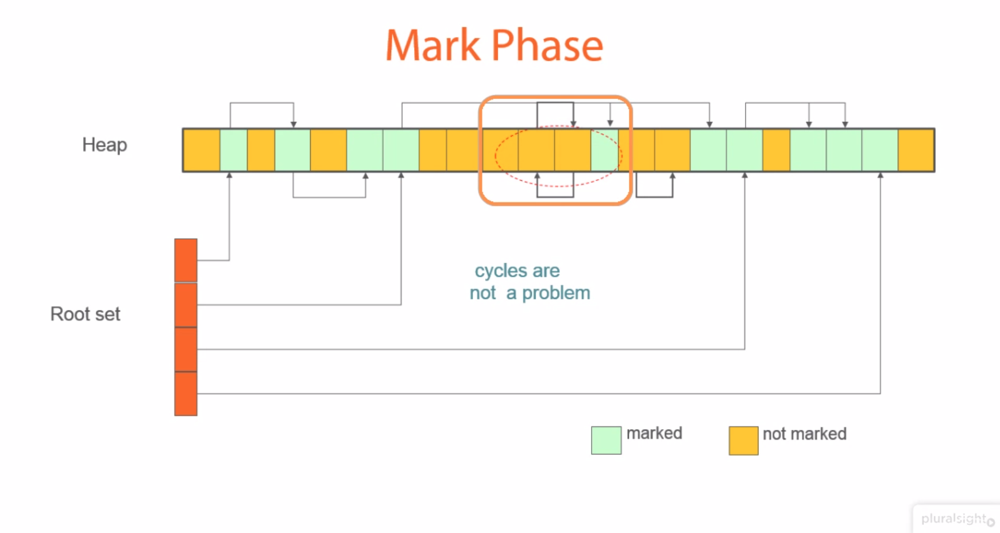
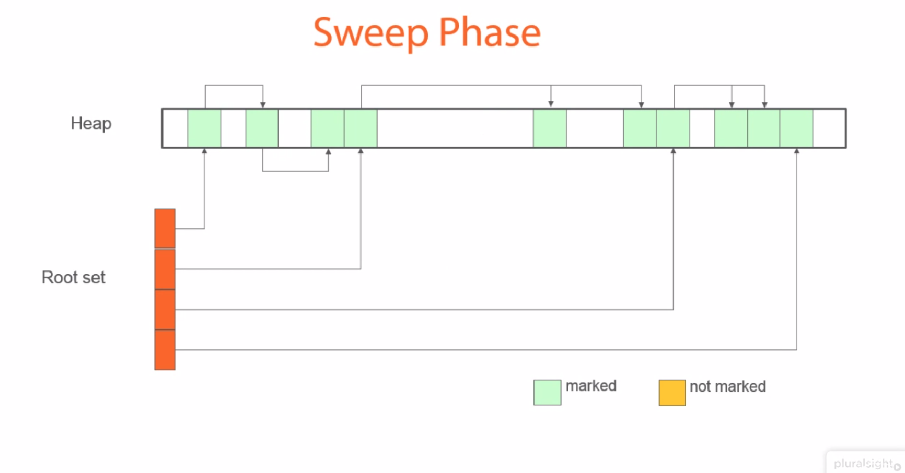
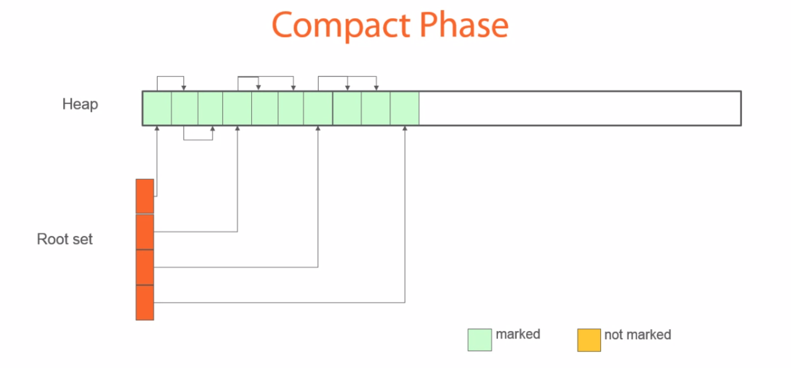
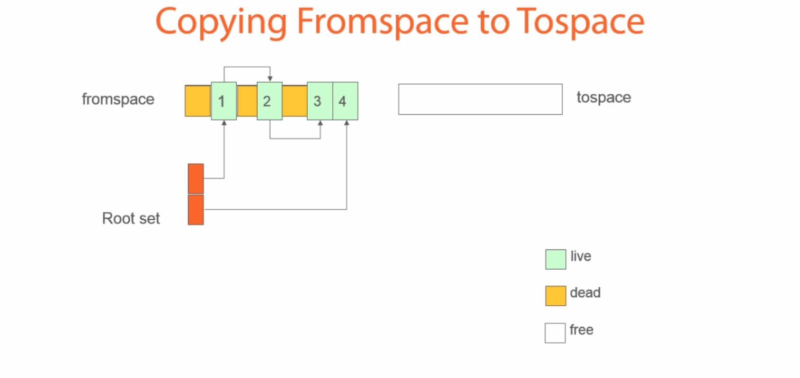
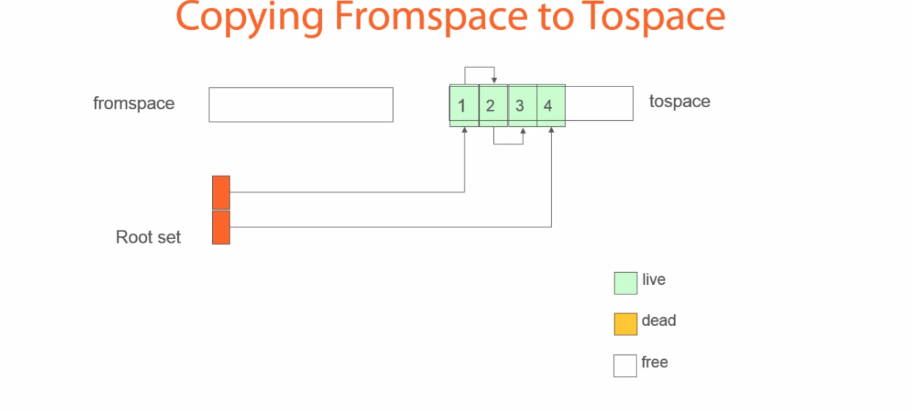
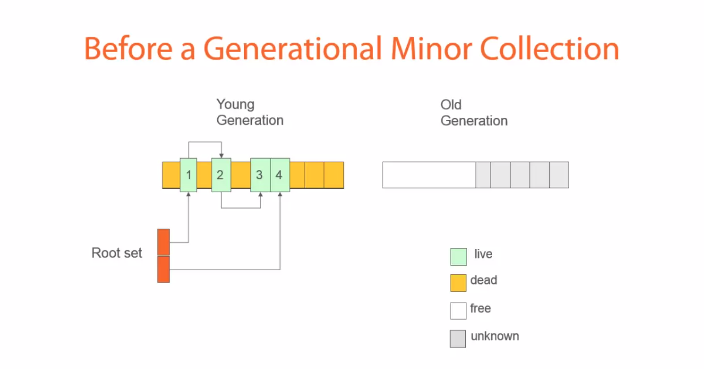
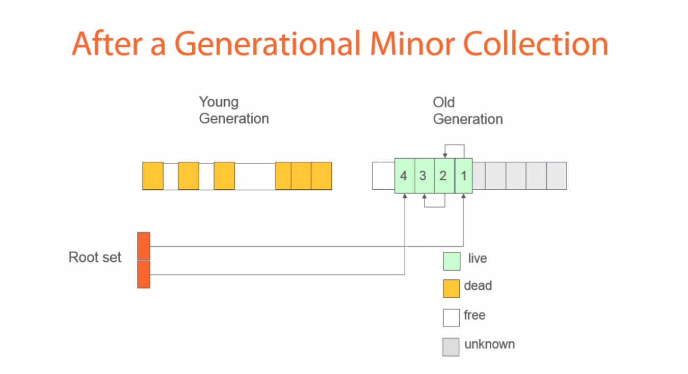
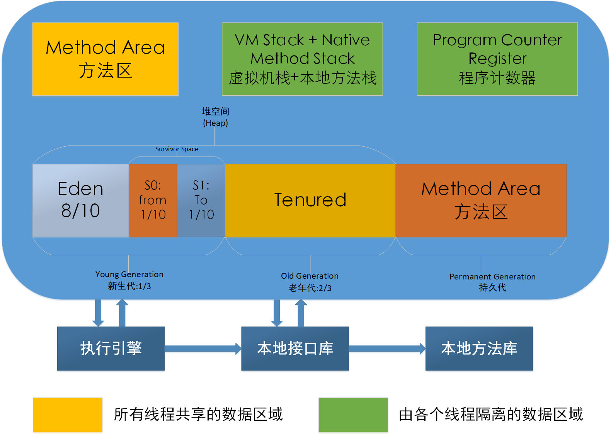
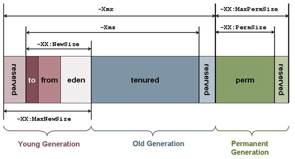

# 一.JVM 虚拟机


使用 Java 语言编写`.java` Source Code 文件，通过 javac 编译成`.class`
Byte Code 文件，JVM 就可以识别`.class`文件，并使用 JIT compiler 将`.class`
文件编译为机器码后运行。

`class loader 类加载器`：将所需的类加载到内存，必要时将类实例化成实例。

图中中间部分是进程的内存逻辑结构，称为 Jvm 运行时区域，由下面几部分构成：

`Method Area`方法区：所有线程共享的内存空间，存放已加载的类信息、常量和静态变量。

`Heap` 堆：所有线程共享的内存空间，存放创建的所有对象。堆是靠 GC 垃圾回收器管理的。

`Java Stack`栈：每个线程会分配一个栈，存放线程用的本地变量、方法参数和返回值等。

`PC 寄存器`：PC, 即 Program Counter，每一个线程用于记录当前线程正在执行的字节码
指令地址。因为线程需要切换，当一个线程被切换回来需要执行的时候，知道执行到哪里了。

`本地方法栈`：为本地方法执行构建的内存空间，存放本地方法执行时的局部变量、操作数等。

所谓本地方法，简单的说是非 Java 实现的方法，例如操作系统的 C 编写的库提供的本地
方法，Java 调用这些本地方法接口执行。但是要注意，本地方法应该避免直接编程使用，
因为 Java 可能跨平台使用，如果用了 Windows API，换到了 Linux 平台部署就有了问题。

# 二.内存垃圾回收

## 2.2 GC 内存垃圾回收器

堆内存里面经常创建、销毁对象，内存高频率的被使用、被释放。如果不妥善处理，一个
使用频繁的进程，将可能有内存空间，但是无法分配出可用内存空间，因为没有连续地址
的内存区域了，内存全是碎片化的数据。因此，JVM 的 GC 即是用来解决这样的问题的。

### 2.2.1 GC 内存回收基本算法

#### 1. 引用计数

每一个堆内对象上都与一个私有引用计数器，记录着被引用的次数，引用计数清零，该对象
所占用堆内存就可以被回收。循环引用的对象都无法引用计数归零，就无法清除。

#### 2. 标记-清除 Mark-Sweep

顾名思义，标记和清除垃圾收集器有两个阶段

1. 标记阶段
   标记阶段，找到所有可访问对象打个标记。需要注意的是，在标记阶段，会停止应用程序
   线程，以避免在标记阶段对对象状态进行更改。
   
2. 清除阶段
   清理阶段，遍历整个堆，对未标记对象清理。在清除阶段，所有来自标记阶段的未标记对
   象将从内存中删除，从而释放空间。
   

从上面的图中可以看出，在清除阶段之后可能存在大量的可用内存区域。但是，由于这些内
存为小段的碎片，如果下一个内存分配大于所有现有的空闲区域，那么它可能会分配失败。
因此，需要引入第三个阶段，即压缩阶段。

#### 3. 标记-清除-压缩 Mark-Sweep-Compact

分垃圾标记阶段和内存整理阶段。标记阶段，找到所有可访问对象打个标记。内存清理
阶段时，整理时将对象向内存一端移动，整理后存活对象连续的集中在内存一端。

标记


清除


压缩整理:在扫描阶段之后，所有内存位置将重新安排，以提供更紧凑的内存分配。这种方法
的缺点是 GC 暂停时间增加，因为它需要将所有对象复制到一个新位置并更新对这些对象的
所有引用。


由上面的图可知，`标记-清除-压缩`算法好处是整理后内存空间连续分配，有大段的连续
内存可分配，没有内存碎片。缺点是内存整理过程有消耗。

#### 4. 标记-复制 Mark-Copying

先将可用内存分为大小相同两块区域 A 和 B，每次只用其中一块，比如 A。当 A 用完后，
则将 A 中存活的对象复制到 B。复制到 B 的时候连续的使用内存，最后将 A 一次性清除
干净。缺点是比较浪费内存，能使用原来一半的内存，因为内存对半划分了，复制过程毕竟
也是有代价。好处是没有碎片，复制过程中保证对象使用连续空间。

这种垃圾回收机制类似于`标记-清除`，但内存空间分为两部分。最初，将对象分配给一个
内存空间(fromspace)，并标记活动对象。



在复制阶段，被标记的对象被复制到另一个内存空间(tospace)，同时被压缩。然后，
fromspace 被清空。


#### 5. 分代收集算法

既然上述垃圾回收算法都有优缺点，能不能对不同数据进行区分管理，不同分区对数据实施
不同回收策略，分而治之?Tomcat 中 JVM 使用堆内存的`分代回收机制`来针对不同数据区域
进行内存回收。
Tomcat1.7 及以前，堆内存分为新生代、老年代、持久代。
Tomcat1.8 开始，持久代没有了，取而代之使用 MetaSpace。

在分代垃圾回收中，内存空间被划分为不同的代(如年轻代和老年代)。最初，所有的对象将
驻留在年轻代。然而，当垃圾收集周期发生时，在垃圾回收之后存活的对象将被提升到
老年代。

一次 Minor Collection 回收(新生代回收)前

一次 Minor Collection 回收后

回收后，可以清除年轻代中遗留的对象，因为所有活动对象都将移动到老代中。

老一代的垃圾回收周期比年轻一代的长。这种方法背后的关键思想是，在第一次垃圾收集后
存活下来的对象往往寿命更长。因此，可以减少老一代对象的垃圾收集频率。代的数量因编
程语言的不同而不同。例如，在 Java 中有两代，在.NET 中有三代。

### 2.2.2 STW

对于大多数垃圾回收算法而言，GC 线程工作时，需要停止所有工作的线程，称为
`Stop The World`。GC 完成时，恢复其他工作线程运行。这也是 JVM 运行中最
头疼的问题。

### 2.2.3 垃圾收集器类型

按回收线程数个数分为：

- 串行垃圾回收器：一个 GC 线程完成回收工作
- 并行垃圾回收器：多个 GC 线程同时一起完成回收工作，充分利用 CPU 资源

按工作模式不同：

- 并发垃圾回收器：让 GC 线程垃圾回收某些阶段可以和工作线程一起进行。
- 独占垃圾回收器：只有 GC 在工作，STW 一直进行到回收完毕，工作线程才能继续执行。

一般情况下，抉择串行还是并行我们大概可以使用以下原则：
: 客户端或较小程序，内存使用量不大，可以使用串行回收；
: 对于服务端大型计算，可以使用并行回收；
: 大型 WEB 应用，用户端不愿意等，尽量少的 STW，可以使用并发回收；

# 三.JVM 堆内存回收

## 3.1 JVM 内存模型

JVM 内存模型图示


堆内存在 JVM 使用的内存中占比最大，Heap 堆内存分为:

1. `新生代`：刚刚创建的对象
2. `伊甸园区`
3. `存活区 Servivor Space`：有 2 个存活区，一个是 from 区，一个是 to 区。
   它们大小相等、地位相同、可互换。to 指的是本次复制数据的目标区
4. `老年代`：长时间存活的对象
5. `持久代`：JVM 的类和方法

## 3.2 JVM 堆内存回收

如 2.1 中 JVM 内存模型图所示


**新生代回收**
起始时，所有新建对象都出生在 eden，当 eden 满了，启动 GC。这个称为 `Young GC`或
`Minor GC`。先标记 eden 存活对象，然后将存活对象复制到 s0(假设本次是 s0，也可以
是 s1，它们可以调换)，eden 剩余所有空间都"清空"，GC 回收内存完成。
继续新建对象，当 eden 满了，启动 GC。先标记 eden 和 s0 中存活对象，然后将存活对
象复制到 s1。将 eden 和 s0 "清空"。继续新建对象，当 eden 满了，启动 GC。先标记
eden 和 s1 中存活对象，然后将存活对象复制到 s0。将 eden 和 s1 "清空"。
以后的内存回收重复上面步骤。

大多数对象都不会存活很久，而且创建活动非常多，新生代就需要频繁垃圾回收。但是，如果
一个对象一直存活，它最后就在 from、to 来回复制，如果 from 区中对象复制次数达到阈
值，就直接复制到老年代。

**老年代回收**
进入老年代的数据较少，所以老年代区被占满的速度较慢，所以垃圾回收也不频繁。老年代
GC 称为 `Old GC`或`Major GC`。由于老年代对象一般来说存活次数较长，所有较常采用
`标记-压缩`算法。

**Full GC**
对所有"代"的内存进行垃圾回收

Minor GC 比较频繁，Major GC 较少。但一般 Major GC 时，由于老年代对象也可以引用
新生代对象，所以先进行一次 Minor GC，然后在 Major GC 会提高效率。可以认为回收老
年代的时候完成了一次 Full GC。

GC 触发条件
: `Minor GC 触发条件`:当 eden 区满了触发
: `Full GC 触发条件`: 老年代满了,新生代搬向老年代,老年代空间不够,持久代满了
使用 System.gc()手动调用，不推荐

GC 调整策略
: 减少 STW 时长，串行变并行
: 减少 GC 次数，要分配合适的内存大小

对 JVM 调整策略应用极广
: 在 WEB 领域中 Tomcat 等
: 在大数据领域 Hadoop 生态各组件
: 在消息中间件领域的 Kafka 等
: 在搜索引擎领域的 ElasticSearch、Solr 等

在不同领域对 JVM 需要不同的调整策略

# 四.Tomcat 中 JVM 配置

最常见的 JVM 配置当属内存分配,因为在绝大多数情况下, JVM 默认分配的内存可能不能够
满足我们的需求。特别是在生产环境,此时需要手动修改 Tomcat 启动时的内存参数分配。

linux 平台(catalina.sh) :

```java
JAVA_OPTS="-server -Xms1024m -Xmx2048m -XX:MetaspaceSize=256m -XX:MaxMetaspaceSize=512m -XX:SurvivorRatio=8"
```

windows 平台(catalina.bat) :

```java
set JAVA_OPTS=-server -Xms2048m -Xmx2048m -XX:MetaspaceSize=256m -XX:MaxMetaspaceSize=256m -XX:SurvivorRatio=8
```

选项说明

| 参数                                                | 说明                                                                                                                                         | 举例                                                                                                                                                                                                                                                                            |
| :-------------------------------------------------- | :------------------------------------------------------------------------------------------------------------------------------------------- | :------------------------------------------------------------------------------------------------------------------------------------------------------------------------------------------------------------------------------------------------------------------------------ |
| -Xms                                                | 设置应用程序初始使用的堆内存大小(新生代+老年代)                                                                                              | -Xms2g                                                                                                                                                                                                                                                                          |
| -Xmx                                                | 设置应用程序能获得的最大堆内存，早期 JVM 不建议超过 32G，内存管理效率下降                                                                    | -Xms4g                                                                                                                                                                                                                                                                          |
| -XX:NewSize                                         | 设置初始新生代大小                                                                                                                           |
| -XX:MaxNewSize                                      | 设置最大新生代内存空间                                                                                                                       |
| -XX:NewRatio                                        | 以比例方式设置新生代和老年代                                                                                                                 | -XX:NewRatio=2 new/old=1/2                                                                                                                                                                                                                                                      |
| -XX:SurvivorRatio                                   | 以比例方式设置 eden 和 survivor                                                                                                              | -XX:SurvivorRatio=6 eden/survivor=6/1 survivor/new=1/8 如-XX:SurvivorRatio=10 表示伊甸园区(Eden) 是幸存区 To 大小的 10 倍(也是幸存区 From 的 10 倍)。所以，伊甸园区(Eden) 占新生代大小的 10/12 ，幸存区 Frcm 和幸存区 To 每个占新生代的 1/12 。注意，两个幸存区永远是一样大的。 |
| -Xss                                                | 设置线程的栈大小                                                                                                                             |
| -XX:Metaspacesize                                   | 元空间内存初始大小，在 JDR1. 8 版本之前配置为-Xx:Permsize (永久代)                                                                           |
| -XX:MaxMetaspacesize                                | 元空间内存最大大小，在 JDK1. 8 版本之前配置为-XX:MaxPermsize (永久代)                                                                        |
| -XX:ReservedCodeCacheSize -XX: InitialCodeCachesize | 代码缓存区大小                                                                                                                               |
| -XX:NewRatio                                        | 设置新生代和老年代的相对大小比例。这种方式的优点是新生代大小会随着整个堆大小动态扩展。如-XX:NewRatio=3 指定老年代/新生代为 3/1。老年代占堆大 |
| 小的 3/4,新生代占 1/4。                             |

选项与堆内存的对应关系


# Reference

1.[Garbage Collection: How it’s done----by Kasun Dharmadasa](https://medium.com/@kasunpdh/garbage-collection-how-its-done-d48135c7fe77)
