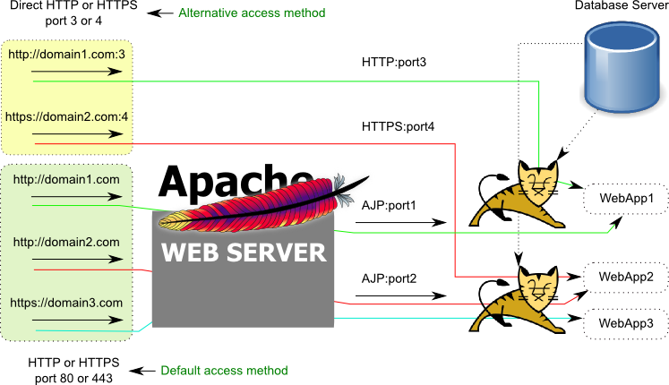

# 一.JAVA 介绍

## 1.1 java 介绍

Java 是由 Sun Microsystems 公司于 1995 年 5 月推出的高级程序设计语言。
Java 可运行于多个平台，如 Windows, Mac OS，及其他多种 UNIX 版本的系统。

Java 原指的是印度尼西亚的爪哇岛，人口众多，盛产咖啡、橡胶等。Java 语言
最早是在 1991 年开始设计的，期初叫 Oak 项目，它初衷是跑在不同机顶盒设
备中的。1993 网景公司(Netscape)成立。Oak 项目组很快他们发现了浏览器和
动态网页技术这个巨大的市场，转向 WEB 方向。并首先发布了可以让网页动起来
的 Applet 技术(在浏览器中嵌入运行 Java 字节码的技术)。在 1995 年，一杯
爪哇岛咖啡成就了 Java 这个名字。

Sun 公司第一个 Java 公开版本 1.0 发布于 1996 年。口号是"一次编写，到处
运行"(Write once，Run anywhere)，跨平台运行。

1999 年，SUN 公司发布了第二代 Java 平台(Java2)。

2009 年 4 月 20 日，Oracle 甲骨文公司宣布将以每股 9.50 美元，总计 74 亿
美金收购 SUN（计算机系统）公司。2010 年 1 月成功收购。

2010 年，Java 创始人之一的 James Gosling 离开了 Oracle，去了 Google。

```ruby
2010年8月13日，Oracle在加利福尼亚地方法院起诉Google侵犯版权和专利权。Oracle声称
Google侵犯了Java 37个API和部分专利。地方法院的陪审团认为未侵犯专利，且API无版权。

2016年5月26日，地方法院二审陪审团认定未侵犯版权，对37个JAVA API的重新实现受到合理使
用的保护。

2017年Oracle上诉美国联邦巡回上诉法院，2018年3月27日，判决Oracle胜诉，Google应赔偿近
90亿美金。

2019年1月Google想让美国最高法院撤销联邦法院裁决。谷歌表示裁决是“对软件业的毁灭性一
击”。现任特朗普政府支持Oracle公司，但微软、Mozilla、红帽支持Google。目前案件已经受
理，并将审理。

此案如果Oracle胜诉，将在美国形成判例，将深远广泛影响软件业。例如POSIX接口，是商用系
统UNIX的兼容接口规范。
```

## 1.2 Java 组成

直接说 java 的组成是不合适的，在实际应用中，java 有不同的版本。有标准的
java 也有企业版的 java，还有适合于嵌入式设备运行的 java 环境集合。一般
来说，使用 java 语言编写的应用要在各种平台运行起来，需要以下部分：

1. java 应用源代码
2. 依赖库，标准库、第三方库
3. JVM 虚拟机

不同的操作系统的 ABI(应用程序二进制接口)不一样，所以在不同的操作系统上
都有不同的 JVM 实现。这是 java 可以跨平台的根本原因。

1995 年，Java 发布 Applet 技术，Java 程序在后台编译成字节码，发送到浏
览器端，在浏览器中运行一个 Applet 程序，这段程序是运行在另外一个 JVM
进程中的。但是这种在客户端运行 Java 代码的技术，会有很大的安全问题。
1997 年 CGI 技术发展起来，动态网页技术开始向后端开发转移，在后端将动态
内容组织好，拼成 HTML 发回到浏览器端。

## 1.3 JVM/JRE/JDK 三者关系

### 1.3.1 JDK

JDK:Java Development Kit，其实 java 语言的开发工具包，
一般包含 JRE 和 JVM。
JDK 也就是常说的 J2SE，在 1999 年，正式发布了 Java 第二代平台，发布了三个版本：
J2SE：标准版，适用于桌面平台
J2EE：企业版，适用于企业级应用服务器开发
J2ME：微型版，适用于移动、无线、机顶盒等设备环境
2005 年，Java 的版本又更名为 JavaSE、JavaEE、JavaME。
Servlet、Jsp 都包含在 JavaEE 规范中。

JDK 和 JRE 和 JVM 三者的关系如下图：


JDK 包含了开发所需要的所有工具和相关的 API 和相关的库。

JDK 版本历史


JDK7、JDK8、JDK11 是 LTS(Long Term Suppot)长期支持版

[JDK 下载](https://www.oracle.com/technetwork/java/javase/downloads/jdk8-downloads-2133151.html)

Centos7 安装 OpenJDK

```ruby
[root@node1 ~]# yum install java-1.8.0-openjdk.x86_64 -y
[root@node1 ~]# java -version
openjdk version "1.8.0_222-ea"
OpenJDK Runtime Environment (build 1.8.0_222-ea-b03)
OpenJDK 64-Bit Server VM (build 25.222-b03, mixed mode)
```

使用 Oracle 官网的 JDK 8 的 rpm 安装

```ruby
# yum install jdk-8u191-linux-x64.rpm
# java
# java -version
java version "1.8.0_191"
Java(TM) SE Runtime Environment (build 1.8.0_191-b12)
Java HotSpot(TM) 64-Bit Server VM (build 25.191-b12, mixed mode)
```

Java 全局配置

```ruby
# ll /usr/java
lrwxrwxrwx 1 root root  16 1月  13 01:22 default -> /usr/java/latest
drwxr-xr-x 8 root root 258 1月  13 01:22 jdk1.8.0_191-amd64
lrwxrwxrwx 1 root root  28 1月  13 01:22 latest -> /usr/java/jdk1.8.0_191-amd64
# vi /etc/profile.d/jdk.sh
export JAVA_HOME=/usr/java/default
export PATH=$JAVA_HOME/bin:$PATH
# . /etc/profile.d/jdk.sh
```

### 1.3.2 OpenJDK

OpenJDK 是 Sun 公司采用 GPL v2 协议发布的 JDK 开源版本，于 2009 年正
式发布。[OpenJDK 官网](https://openjdk.java.net/projects/jdk6/)

OpenJDK 7 是基于 JDK7 的 beta 版开发，但为了也将 Java SE 6 开源，从
OpenJDK7 的 b20 构建反向分支开发，从中剥离了不符合 Java SE 6 规范的
代码，发布 OpenJDK 6。所以 OpenJDK6 和 JDK6 没什么关系。OpenJDK 使用
GPL v2 可以用于商业用途。

### 1.3.3 JRE

JRE:Java Runtime Environment，指 Java 运行时环境，
包含 JVM + Java 核心类库。


JRE 包含了：部署工具、用户接口工具、集成类库和用户接口类库、其它的基础库和
java 虚拟机等。

### 1.3.4 JVM

JVM:Java Virtual Machine，指将 java 源码翻译为机器码的引擎。下面的图
展示了整个 JVM 的内部架构。


图中被类加载子系统加载的`.class`类文件是由 javac 编译器编译而成。类加载
子系统除了加载类文件外还进行连接和初始化，之后类文件被加载进 java 运行数据
内存区，之后被执行引擎执行。执行引擎实质是一个即时编译器(JIT Compiler:
just-in-time compiler)，在这里类文件被转换成中间语言，经过代码优化器后
生成可以执行的目标语言(机器语言)，之后被 CPU 执行。在这期间，涉及内存垃圾
回收和多种库的相互配合。

## 1.4 Java 动态网页技术

Java 的动态网页技术本(servlet)质上就是一段 java 程序

```java
import java.io.*;
import javax.servlet.*;
import javax.servlet.http.*;
public class HelloWorld extends HttpServlet {
  private String message;
  public void init() throws ServletException
  {
      message = "Hello World";
  }
  public void doGet(HttpServletRequest request,
                    HttpServletResponse response)
            throws ServletException, IOException
{
      response.setContentType("text/html");
      PrintWriter out = response.getWriter();
      out.println("<h1>" + message + "</h1>");
  }

  public void destroy()
  {
  }
}
```

在 Servlet 中最大的问题是，HTML 输出和 Java 代码混在一起，
如果网页布局要调整，就是个噩梦。除了安全性，这是其最大的缺点。

jsp(Java Server Pages)

提供一个 HTML，把它变成一个模板，也就是在网页中预留以后填充的空，以后就变成了填空了。

```html
<%@ page language="java" contentType="text/html; charset=UTF-8"
pageEncoding="UTF-8"%>
<!DOCTYPE html>
<html>
  <head>
    <meta charset="utf-8" />
    <title>jsp例子</title>
  </head>
  <body>
    <!-- 后面的内容是服务器端动态生成字符串，最后拼接在一起 -->
    <% out.println("你的 IP 地址 " + request.getRemoteAddr()); %>
  </body>
</html>
```

JSP 是基于 Servlet 实现，JSP 将表现和逻辑分离，这样页面开发人员
更好的注重页面表现力更好服务客户。JSP 先转换为 Servlet 的源代码
.java 文件（Tomcat 中使用 Jasper 转换），然后再编译成.class 文
件，最后就可以在 JVM 中运行了。

# 二.Tomcat 介绍

[Tomcat8 下载地址](https://archive.apache.org/dist/tomcat/tomcat-8/)

## 2.1 简介

Tomcat 是由一系列可配置的组件组成的容器。各个组件各司其职，各个组件之间松耦合。
由于各个组件之间的松耦合使得整体架构具有很强的可伸缩性和可扩展性。

Tomcat 起始于 SUN 的一个 Servlet 的参考实现项目 Java Web Server，作者是
James Duncan Davidson，后将项目贡献给了 ASF。和 ASF 现有的项目合并，并开
源成为顶级项目，[官网](http://tomcat.apache.org/)。

Tomcat 仅仅实现了 Java EE 规范中与 Servlet、JSP 相关的类库，是 JavaEE
不完整实现。著名图书出版商 O'Reilly 约稿该项目成员，出一本关于 Tomcat 的
书籍，书名为：`Tomca The Definitive Guide`，中文也叫 Tomcat 权威指南。
Davidson 希望使用一个公猫作为封面，但是公猫已经被另一本书使用，书出版后
封面是一只雪豹。


1999 年发布初始版本是 Tomcat 3.0，实现了 Servlet 2.2 和 JSP1.1 规范。
Tomcat 4.x 发布时，内建了 Catalina(Servlet 容器)和 Jasper(JSP engine)等。
商用的有 IBM WebSphere、Oracle WebLogic（原属于 BEA 公司）、Oracle Oc4j、
Glassfish、JBoss 等。开源实现有 Tomcat、Jetty、Resin。

## 2.2 安装和目录结构

### 2.2.1 使用 yum 源安装

可以使用 CentOS7 yum 源自带的安装，yum 源中是 Tomcat 7.0 版本。

```ruby
[root@node1 ~]# yum install tomcat tomcat-admin-webapps tomcat-webapps
[root@node1 ~]# rpm -ql tomcat
/etc/logrotate.d/tomcat
/etc/sysconfig/tomcat
/etc/tomcat
...
/usr/bin/tomcat
...
[root@node1 ~]# systemctl start tomcat
[root@node1 ~]# ss -ntl
State      Recv-Q Send-Q                         Local Address:Port                                        Peer Address:Port
...
LISTEN     0      1                         [::ffff:127.0.0.1]:8005                                                [::]:*
LISTEN     0      100                                     [::]:8009                                                [::]:*
LISTEN     0      100                                     [::]:8080                                                [::]:*
...
```

### 2.2.2 使用官方二进制包安装

[Tomcat8.5.42 下载地址](https://archive.apache.org/dist/tomcat/tomcat-8/v8.5.42/bin/)

```bash
[root@node1 data]# wget https://archive.apache.org/dist/tomcat/tomcat-8/v8.5.42/bin/
[root@node1 data]# ll apache-tomcat-8.5.42.tar.gz
-rw-r--r-- 1 root root 9711748 Jun 20  2019 apache-tomcat-8.5.42.tar.gz
[root@node1 data]# ll apache-tomcat-8.5.42.tar.gz
-rw-r--r-- 1 root root 9711748 Jun 20  2019 apache-tomcat-8.5.42.tar.gz
[root@node1 data]# tar xf apache-tomcat-8.5.42.tar.gz -C /usr/local/
[root@node1 data]# cd /usr/local/
[root@node1 local]# ln -sv apache-tomcat-8.5.42 tomcat
‘tomcat’ -> ‘apache-tomcat-8.5.42’
[root@node1 local]# ll tomcat
lrwxrwxrwx 1 root root 20 Jan 17 15:23 tomcat -> apache-tomcat-8.5.42

[root@node1 local]# cd tomcat/bin/
[root@node1 bin]# ./catalina.sh --help
Using CATALINA_BASE:   /usr/local/tomcat
Using CATALINA_HOME:   /usr/local/tomcat
Using CATALINA_TMPDIR: /usr/local/tomcat/temp
Using JRE_HOME:        /usr
Using CLASSPATH:       /usr/local/tomcat/bin/bootstrap.jar:/usr/local/tomcat/bin/tomcat-juli.jar
Usage: catalina.sh ( commands ... )
commands:
  debug             Start Catalina in a debugger
  debug -security   Debug Catalina with a security manager
  jpda start        Start Catalina under JPDA debugger
  run               Start Catalina in the current window
  run -security     Start in the current window with security manager
  start             Start Catalina in a separate window
  start -security   Start in a separate window with security manager
  stop              Stop Catalina, waiting up to 5 seconds for the process to end
  stop n            Stop Catalina, waiting up to n seconds for the process to end
  stop -force       Stop Catalina, wait up to 5 seconds and then use kill -KILL if still running
  stop n -force     Stop Catalina, wait up to n seconds and then use kill -KILL if still running
  configtest        Run a basic syntax check on server.xml - check exit code for result
  version           What version of tomcat are you running?

[root@node1 bin]# ./catalina.sh version
Using CATALINA_BASE:   /usr/local/tomcat
Using CATALINA_HOME:   /usr/local/tomcat
Using CATALINA_TMPDIR: /usr/local/tomcat/temp
Using JRE_HOME:        /usr
Using CLASSPATH:       /usr/local/tomcat/bin/bootstrap.jar:/usr/local/tomcat/bin/tomcat-juli.jar
Server version: Apache Tomcat/8.5.42
Server built:   Jun 4 2019 20:29:04 UTC
Server number:  8.5.42.0
OS Name:        Linux
OS Version:     3.10.0-1062.el7.x86_64
Architecture:   amd64
JVM Version:    1.8.0_222-ea-b03
JVM Vendor:     Oracle Corporation

[root@node1 bin]# ./catalina.sh start
Using CATALINA_BASE:   /usr/local/tomcat
Using CATALINA_HOME:   /usr/local/tomcat
Using CATALINA_TMPDIR: /usr/local/tomcat/temp
Using JRE_HOME:        /usr
Using CLASSPATH:       /usr/local/tomcat/bin/bootstrap.jar:/usr/local/tomcat/bin/tomcat-juli.jar
Tomcat started.
[root@node1 bin]# ss -ntlpa
...
LISTEN      0      1      [::ffff:127.0.0.1]:8005                             [::]:*                   users:(("java",pid=49295,fd=75))
LISTEN      0      100                  [::]:8009                             [::]:*                   users:(("java",pid=49295,fd=54))
LISTEN      0      100                  [::]:8080                             [::]:*                   users:(("java",pid=49295,fd=49))
...
```


```ruby
# ./startup.sh  == ./catalina.sh start
# ./shutdown.sh  == ./catalina.sh stop
```

可以看到 tomcat 使用 root 账户作为启动用户了，为了安全起见，新建一个
系统账户 java 给 tomcat 使用

```ruby
[root@node1 bin]# ps aux | grep tomcat
root      49295  2.1  6.7 2933016 110668 pts/0  Sl   15:26   0:05 /usr/bin/java -Djava.util.logging.config.file=/usr/local/tomcat/conf/logging.properties -Djava.util.logging.manager=org.apache.juli.ClassLoaderLogManager -Djdk.tls.ephemeralDHKeySize=2048 -Djava.protocol.handler.pkgs=org.apache.catalina.webresources -Dorg.apache.catalina.security.SecurityListener.UMASK=0027 -Dignore.endorsed.dirs= -classpath /usr/local/tomcat/bin/bootstrap.jar:/usr/local/tomcat/bin/tomcat-juli.jar -Dcatalina.base=/usr/local/tomcat -Dcatalina.home=/usr/local/tomcat -Djava.io.tmpdir=/usr/local/tomcat/temp org.apache.catalina.startup.Bootstrap start

[root@node1 bin]# ./catalina.sh stop
Using CATALINA_BASE:   /usr/local/tomcat
Using CATALINA_HOME:   /usr/local/tomcat
Using CATALINA_TMPDIR: /usr/local/tomcat/temp
Using JRE_HOME:        /usr
Using CLASSPATH:       /usr/local/tomcat/bin/bootstrap.jar:/usr/local/tomcat/bin/tomcat-juli.jar

[root@node1 bin]# useradd -r java
[root@node1 bin]# id java
uid=996(java) gid=994(java) groups=994(java)
[root@node1 bin]# cd /usr/local/
[root@node1 local]# chown -R java:java tomcat
[root@node1 local]# su - java -c '/usr/local/tomcat/bin/catalina.sh start'
```

将 tomcat 启动脚本路径添加到 PATH 环境变量

```bash
[root@node1 ~]# vim /etc/profile.d/tomcat.sh
export CATALINA_BASE=/usr/local/tomcat
export PATH=$CATALINA_BASE/bin:$PATH
...
[root@node1 ~]# . /etc/profile.d/tomcat.sh
[root@node1 ~]# startup.sh
Using CATALINA_BASE:   /usr/local/tomcat
Using CATALINA_HOME:   /usr/local/tomcat
Using CATALINA_TMPDIR: /usr/local/tomcat/temp
Using JRE_HOME:        /usr
Using CLASSPATH:       /usr/local/tomcat/bin/bootstrap.jar:/usr/local/tomcat/bin/tomcat-juli.jar
Tomcat started.
[root@node1 ~]# ss -ntl
...
LISTEN      0      1           [::ffff:127.0.0.1]:8005                                  [::]:*
LISTEN      0      100                       [::]:8009                                  [::]:*
LISTEN      0      128                       [::]:111                                   [::]:*
LISTEN      0      100                       [::]:8080                                  [::]:*
...
[root@node1 ~]# shutdown.sh
Using CATALINA_BASE:   /usr/local/tomcat
Using CATALINA_HOME:   /usr/local/tomcat
Using CATALINA_TMPDIR: /usr/local/tomcat/temp
Using JRE_HOME:        /usr
Using CLASSPATH:       /usr/local/tomcat/bin/bootstrap.jar:/usr/local/tomcat/bin/tomcat-juli.jar
```

### 2.2.3 目录结构说明

Tomcat 的主要目录及文件如下表：

| 目录    | 该目录下文件             | 说明                                                                                                  |
| :------ | :----------------------- | :---------------------------------------------------------------------------------------------------- |
| bin     | /                        | 存放 Tomcat 的启动、停止等脚本文件和批处理文件                                                        |
|         | startup.sh/startup.bat   | Linux 下的启动脚本/Win 下的启动脚本                                                                   |
|         | shutdown.sh/shutdown.bat | Linux 下/Win 下的停止脚本                                                                             |
| conf    | /                        | 存放配置文件                                                                                          |
|         | catalina                 | 存放针对每个虚拟机的 Context 的配置                                                                   |
|         | context.xml              | 用于定义 web 应用都需要加载的 Context 配置，如果 web 应用指定了自己的 context.xml，该文件内容将被覆盖 |
|         | catalina.properties      | Tomcat 的环境变量，Java 属性的定义文件，用于设定类加载器路径，以及一些与 JVM 调优相关参数             |
|         | catalina.policy          | Tomcat 运行的安全策略配置                                                                             |
|         | loggging.properties      | Tomcat 的日志配置文件，可以通过该文件修改 Tomcat 的日志级别和日志路径等                               |
|         | server.xml               | Tomcat 的核心配置文件                                                                                 |
|         | tomcat-user.xml          | 定义 Tomcat 默认的用户及角色映射信息的配置                                                            |
|         | web.xml                  | Tomcat 中所有应用默认的部署描述文件，主要定义了基础的 Servlet 和 MIME 映射关系                        |
| lib     | /                        | Tomcat 服务器的依赖包存放处                                                                           |
| logs    | /                        | Tomcat 默认的日志存放目录                                                                             |
| webapps | /                        | Tomcat 默认的 Web 应用部署目录                                                                        |
| work    | /                        | Web 应用 JSP 代码生成和编译使用的临时目录                                                             |

## 2.4 Tomcat 的组件

顶级组件

- Server，代表整个 Tomcat 容器

服务类组件

- Service，组织 Engine 和 Connector，里面只能包含一个 Engine

连接器组件

- Connector，有 HTTP、HTTPS、AJP 协议的连接器

容器类

- Engine、Host、Context 都是容器类组件，可以嵌入其它组件，内部配置如何运行应用程序。

内嵌类:可以内嵌到其他组件内

- valve、logger、realm、loader、manager 等

集群类组件

- listener、cluster

## 2.5 Tomcat 内部大致组成

由 2.4 中的各个组件的实现就组成了 Tomcat，如下图


各个组件功能说明

| 组件名称  | 说明                                                                           |
| :-------- | :----------------------------------------------------------------------------- |
| Server    | Tomcat 运行的进程实例                                                          |
| Connector | 负责客户端的 HTTP、HTTPS、AJP 等协议的连接。一个 Connector 只属于某一个 Engine |
| Service   | 用来组织 Engine 和 Connector 的关系                                            |
| Engine    | 响应并处理用户请求，一个引擎上可以绑定多个 Connector                           |
| Host      | 虚拟主机                                                                       |
| Context   | 应用的上下文，配置路径映射 path => directory                                   |

注：AJP（Apache Jserv protocol）是一种基于 TCP 的二进制通讯协议。

核心组件

- Tomcat 启动一个 Server 进程。可以启动多个 Server，但一般只启动一个
- 创建一个 Service 提供服务。可以创建多个 Service，但一般也只创建一个
  - 每个 Service 中，是 Engine 和其连接器 Connector 的关联配置
- 可以为这个 Server 提供多个连接器 Connector，这些 Connector 使用了不同的协议，绑定了不同的
  端口。其作用就是处理来自客户端的不同的连接请求或响应
- Service 内部还定义了 Engine，引擎才是真正的处理请求的入口，其内部定义多个虚拟主机 Host
  - Engine 对请求头做了分析，将请求发送给相应的虚拟主机
  - 如果没有匹配，数据就发往 Engine 上的 defaultHost 缺省虚拟主机
  - Engine 上的缺省虚拟主机可以修改
- Host 定义虚拟主机，虚拟主机有 name 名称，通过名称匹配
- Context 定义应用程序单独的路径映射和配置

配置示例

```xml
<?xml version="1.0" encoding="UTF-8"?>   <!-- 指明配置文件版本和编码 -->
<Server port="8005" shutdown="SHUTDOWN"> <!-- Server配置，可以在Server中配置多个Service -->
  <Service name="Catalina"> <!-- Service配置，可以在Service中配置多个Connector和一个Engine-->
<Connector port="8080" protocol="HTTP/1.1"
               connectionTimeout="20000"
               redirectPort="8443" />
    <Connector port="8009" protocol="AJP/1.3" redirectPort="8443" /> <!-- Connector配置 -->
    <Engine name="Catalina" defaultHost="localhost"> <!-- Engine配置，可以在Engine中配置多个Host -->
      <Host name="localhost"  appBase="webapps"
            unpackWARs="true" autoDeploy="true"> <!-- Host配置 -->
      </Host>
    </Engine>
  </Service>
</Server>

<!-- 如果把配置标签保留去除属性，则配置和上图中的层级是一一对应的 -->
<Server ... >
    <Service ... >
    <Connector  ... > ... </Connector>
    <Connector  ... > ... </Connector>
        <Engine ... >
            <Realm ... > ... </Realm>
            <Realm ... > ... </Realm>
            <Host ... >
                 <Valve ... />
            </Host>
        </Engine>
    </Service>
</Server>
```

## 2.6 请求的处理过程

Tomcat 处理请求的大致过程

假设来自客户的请求为：http://localhost:8080/test/index.jsp

```
1. 浏览器端的请求被发送到服务端端口 8080，Tomcat 进程监听在此端口上。通过侦听的 HTTP/1.1
Connector 获得此请求。
2. Connector 把该请求交给它所在的 Service 的 Engine 来处理，并等待 Engine 的响应
3. Engine 获得请求 localhost:8080/test/index.jsp，匹配它所有虚拟主机 Host
4. Engine 匹配到名为 localhost 的 Host。即使匹配不到也把请求交给该 Host 处理，因为该 Host 被定义
为该 Engine 的默认主机
5. localhost Host 获得请求/test/index.jsp，匹配它所拥有的所有 Context
6. Host 匹配到路径为/test 的 Context
7. path=/test 的 Context 获得请求/index.jsp，在它的 mapping table 中寻找对应的 servlet
8. Context 匹配到 URL PATTERN 为\*.jsp 的 servlet，对应于 JspServlet 类构造 HttpServletRequest 对
象和 HttpServletResponse 对象，作为参数调用 JspServlet 的 doGet 或 doPost 方法。
9. Context 把执行完了之后的 HttpServletResponse 对象返回给 Host
10. Host 把 HttpServletResponse 对象返回给 Engine
11. Engine 把 HttpServletResponse 对象返回给 Connector
12. Connector 把 HttpServletResponse 对象返回给浏览器端
```

## 2.6 Tomcat 简单部署

Tomcat 部署的一般结构如下图：


### 2.6.1 Web 应用的根目录

Tomcat 部署 Web 应用时的根目录与 Nginx 或者 Apache 有所不同，Tomcat 中
默认网站根目录是 `CATALINA_BASE/webapps/`，而`CATALINA_BASE`一般是
Tomcat 的主程序目录路径。

在 nginx 中部署 Web 应用时：
假设在 nginx 中部署 2 个网站应用 eshop、bbs，假设网站根目录是
/var/www/html，那么部署可以是这样的。eshop 解压缩所有文件放到
/var/www/html/目录下。bbs 的文件放在/var/www/html/bbs 下。

在 Tomcat 部署 Web 应用时：
Tomcat 中默认网站根目录是 CATALINA_BASE/webapps/
在 Tomcat 的 webapps 目录中，有个非常特殊的目录 ROOT，它就是网站
默认根目录。将 eshop 解压后的文件放到这个 ROOT 中。bbs 解压后文件
都放在 CATALINA_BASE/webapps/bbs 目录下，与 ROOT 同级。

```ruby
[root@node1 tomcat]# pwd
/usr/local/tomcat
[root@node1 tomcat]# ll
total 124
...
drwxr-x--- 7 root root    81 Jun  5  2019 webapps # tomcat默认应用部署路径
...
[root@node1 tomcat]# ll webapps/
total 4
drwxr-x--- 14 root root 4096 Jan 17 15:23 docs
drwxr-x---  6 root root   83 Jan 17 15:23 examples
drwxr-x---  5 root root   87 Jan 17 15:23 host-manager  # 主机管理
drwxr-x---  5 root root  103 Jan 17 15:23 manager  # 后台管理
drwxr-xr-x  5 root root   41 Jan 17 16:35 myapp   ########## 自己部署的web应用
drwxr-x---  3 root root  306 Jan 17 15:23 ROOT  # 默认部署站点的主站
[root@node1 tomcat]# ll webapps/myapp/
total 0
drwxr-xr-x 2 root root 6 Jan 17 16:35 bbs
drwxr-xr-x 2 root root 6 Jan 17 16:35 blog
drwxr-xr-x 2 root root 6 Jan 17 16:34 ROOT  ######### 自己部署的web应用的主站点
```

每一个虚拟主机的目录都可以使用 appBase 配置自己的站点目录，里面都
可以使用 ROOT 目录作为主站目录。在虚拟主机中部署的一般都是 JSP 网
页应用程序。

JSP WebApp 的目录结构

`主页配置`：一般指定为 index.jsp 或 index.html
`WEB-INF/`：当前 WebApp 的私有资源路径，通常存储当前应用使用的
web.xml 和 context.xml 配置文件
`META-INF/`：类似于 WEB-INF
`classes/`：类文件，当前 webapp 需要的类
`lib/`：当前应用依赖的 jar 包

### 2.6.2 主页

默认情况下在`/usr/local/tomcat/conf/web.xml`中定义了在
`/usr/loca/tomcat/webapps/ROOT/`下的主页类型的访问顺序：

```xml
...
<welcome-file-list>
        <welcome-file>index.jsp</welcome-file>
        <welcome-file>index.htm</welcome-file>
        <welcome-file>index.html</welcome-file>
    </welcome-file-list>
...
```

会先访问 index.jsp，而 ROOT 下默认是由 index.jsp 的

```bash
[root@node1 tomcat]# ll webapps/ROOT/
total 184
-rw-r----- 1 root root 12208 Jun  5  2019 index.jsp # 直接显示该文件了

```

所以默认情况下`/usr/loca/tomcat/webapps/ROOT/`中添加
index.html 文件是没用的，不会默认访问到。

将`/usr/local/tomcat/conf/web.xml` 中的下面`<welcome-file-list>`标签
内容（默认页），复制到`/usr/local/tomcat/webapps/ROOT/WEB-INF/web.xml` 中
如下:

```xml
<web-app xmlns="http://xmlns.jcp.org/xml/ns/javaee"
  xmlns:xsi="http://www.w3.org/2001/XMLSchema-instance"
  xsi:schemaLocation="http://xmlns.jcp.org/xml/ns/javaee
                      http://xmlns.jcp.org/xml/ns/javaee/web-app_3_1.xsd"
  version="3.1"
  metadata-complete="true">
  <display-name>Welcome to Tomcat</display-name>
  <description>
     Welcome to Tomcat
  </description>
  <welcome-file-list>
        <welcome-file>index.html</welcome-file>
        <welcome-file>index.htm</welcome-file>
        <welcome-file>index.jsp</welcome-file>
    </welcome-file-list>
</web-app>


[root@node1 ROOT]# pwd
/usr/local/tomcat/webapps/ROOT
[root@node1 ROOT]# vim index.html
hello
...

[root@node1 ~]# startup.sh
Using CATALINA_BASE:   /usr/local/tomcat
Using CATALINA_HOME:   /usr/local/tomcat
Using CATALINA_TMPDIR: /usr/local/tomcat/temp
Using JRE_HOME:        /usr
Using CLASSPATH:       /usr/local/tomcat/bin/bootstrap.jar:/usr/local/tomcat/bin/tomcat-juli.jar
Tomcat started.
```

此时先匹配到 index.html


### 2.6.2 webapp 的部署方式

webapp 归档格式

```ruby
.war：WebApp打包
.jar：EJB类打包文件
.rar：资源适配器类打包文件
.ear：企业级WebApp打包
```

传统应用开发测试后，通常打包为 war 格式，这种文件部署到了 Tomcat 的 webapps 下，
还可以自动展开。配置示例：

```xml
<Host name="localhost"  appBase="webapps" unpackWARs="true" autoDeploy="true">
```

webapp 部署 Deploy

部署概念：将 webapp 的源文件放置到目标目录，通过 web.xml 和 context.xml
文件中配置的路径就可以访问该 webapp，通过类加载器加载其特有的类和依赖的类
到 JVM 上。

- 自动部署 Auto Deploy：Tomcat 发现多了这个应用就把它加载并启动起来
  手动部署
  - 冷部署：将 webapp 放到指定目录，才去启动 Tomcat
  - 热部署：Tomcat 服务不停止，需要依赖 manager、ant 脚本、tcd(tomcat
    client deployer)等工具
- 反部署 undeploy：停止 webapp 的运行，并从 JVM 上清除已经加载的类，从
  Tomcat 应用目录中移除部署的文件
- 启动 start：是 webapp 能够访问
- 停止 stop：webapp 不能访问，不能提供服务，但是 JVM 并不清除它

### 2.6.3 部署 app 示例

#### 编写一个测试 JSP

```jsp
<%@ page language="java" contentType="text/html; charset=UTF-8"
    pageEncoding="UTF-8"%>
<!DOCTYPE html>
<html>
<head>
    <meta charset="utf-8">
    <title>jsp例子</title>
</head>
<body>
<!-- 后面的内容是服务器端动态生成字符串，最后拼接在一起 -->
<%
out.println("hello jsp");
%>
<br>
<%=request.getRequestURL()%>
</body>
</html>
```

先把 test.jsp 放到 ROOT 下去，试试看，访问`http://YourIP:8080/test.jsp`
立即可以看到，这是通过路径映射找到相应的 test.jsp 后，转换成 test_jsp.java，
再编译成 test_jsp.class。
`/usr/local/tomcat/work/Catalina/localhost/ROOT/org/apache/jsp` 下有转换后的文件。


#### 添加应用必要文件

创建一般的 jsp 应用目录层级

```ruby
[root@node1 data]# mkdir projects/mywebapp/{WEB-INF,classes,lib} -pv
mkdir: created directory ‘projects’
mkdir: created directory ‘projects/mywebapp’
mkdir: created directory ‘projects/mywebapp/WEB-INF’
mkdir: created directory ‘projects/mywebapp/classes’
mkdir: created directory ‘projects/mywebapp/lib’

[root@node1 data]# vim projects/mywebapp/index.jsp
<%@ page language="java" contentType="text/html; charset=UTF-8"
    pageEncoding="UTF-8"%>
<!DOCTYPE html>
<html>
<head>
    <meta charset="utf-8">
    <title>jsp例子</title>
</head>
<body>
<!-- 后面的内容是服务器端动态生成字符串，最后拼接在一起 -->
<%
out.println("hello jsp");
%>
<br>
<%=request.getRequestURL()%>
</body>
</html>

[root@node1 data]# pwd
/data
[root@node1 data]# tree projects/
projects/
└── mywebapp
    ├── classes
    ├── index.jsp
    ├── lib
    └── WEB-INF

# 拷贝app到部署目录
[root@node1 data]# cp -r projects/mywebapp /usr/local/tomcat/webapps/

```

#### 测试

### 2.6.4 部分配置说明

#### server.xml

server.xml 配置文件

```xml
<?xml version="1.0" encoding="UTF-8"?>
<Server port="8005" shutdown="SHUTDOWN">
  <Listener className="org.apache.catalina.startup.VersionLoggerListener" />
  <Listener className="org.apache.catalina.core.AprLifecycleListener" SSLEngine="on" />
  <Listener className="org.apache.catalina.core.JreMemoryLeakPreventionListener" />
  <Listener className="org.apache.catalina.mbeans.GlobalResourcesLifecycleListener" />
  <Listener className="org.apache.catalina.core.ThreadLocalLeakPreventionListener" />

    <Resource name="UserDatabase" auth="Container"
              type="org.apache.catalina.UserDatabase"
              description="User database that can be updated and saved"
              factory="org.apache.catalina.users.MemoryUserDatabaseFactory"
              pathname="conf/tomcat-users.xml" />
  </GlobalNamingResources>

  <Service name="Catalina">

    <Connector port="8080" protocol="HTTP/1.1"
               connectionTimeout="20000"
               redirectPort="8443" />
    <Connector port="8009" protocol="AJP/1.3" redirectPort="8443" />

    <Engine name="Catalina" defaultHost="localhost">

      <Realm className="org.apache.catalina.realm.LockOutRealm">
        <Realm className="org.apache.catalina.realm.UserDatabaseRealm"
               resourceName="UserDatabase"/>
      </Realm>

      <Host name="localhost"  appBase="webapps"
            unpackWARs="true" autoDeploy="true">

        <Valve className="org.apache.catalina.valves.AccessLogValve" directory="logs"
               prefix="localhost_access_log" suffix=".txt"
               pattern="%h %l %u %t &quot;%r&quot; %s %b" />

      </Host>
    </Engine>
  </Service>
</Server>
```

`<Server port="8005" shutdown="SHUTDOWN">`
8005 是 Tomcat 的管理端口，默认监听在 127.0.0.1 上。SHUTDOWN 这个字符串
接收到后就会关闭此 Server。

```ruby
[root@node1 ~]# ss -ntl
State       Recv-Q Send-Q           Local Address:Port                          Peer Address:Port
LISTEN      0      100                  127.0.0.1:25                                       *:*
LISTEN      0      50                           *:3306                                     *:*
LISTEN      0      128                          *:111                                      *:*
LISTEN      0      128                          *:80                                       *:*
LISTEN      0      128                          *:22                                       *:*
LISTEN      0      100                      [::1]:25                                    [::]:*
LISTEN      0      1           [::ffff:127.0.0.1]:8005                                  [::]:*
LISTEN      0      100                       [::]:8009                                  [::]:*
LISTEN      0      128                       [::]:111                                   [::]:*
LISTEN      0      100                       [::]:8080                                  [::]:*
LISTEN      0      128                       [::]:22                                    [::]:*
[root@node1 ~]# telnet 127.0.0.1 8005
Trying 127.0.0.1...
Connected to 127.0.0.1.
Escape character is '^]'.
SHUTDOWN
Connection closed by foreign host.
[root@node1 ~]# ss -ntl
State       Recv-Q Send-Q           Local Address:Port                          Peer Address:Port
LISTEN      0      100                  127.0.0.1:25                                       *:*
LISTEN      0      50                           *:3306                                     *:*
LISTEN      0      128                          *:111                                      *:*
LISTEN      0      128                          *:80                                       *:*
LISTEN      0      128                          *:22                                       *:*
LISTEN      0      100                      [::1]:25                                    [::]:*
LISTEN      0      128                       [::]:111                                   [::]:*
LISTEN      0      128                       [::]:22                                    [::]:*
```

#### 用户认证配置

#### Service

#### Connector

#### Engine

#### 虚拟主机 Host

### 2.6.5 虚拟主机配置示例

### 2.6.6 Context 配置

# 三.Tomcat 常见配置方式

## 3.1 Tomcat 和 Nginx 配置

## 3.2 应用管理

## 3.3 Tomcat 和 HTTPD
