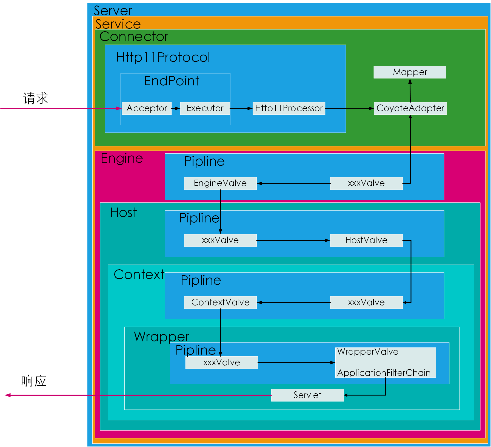

# 一.整体架构

## 1.1 从请求的处理过程看总体架构


如上图中的图 1 和图 2：

1. 在图 1 中，HTTP 服务器直接调用具体的业务类，各个应用程序和服务器是紧耦合的。
   这种架构下，HTTP 需要接受不同的请求，并根据不同的请求调用不同的类来处理请
   求，HTTP 服务器将会长期高负载工作，而且必须打通和各个类的调用接口。
2. 在图 2 中，HTTP 服务器不直接调用业务类，而是把请求交给容器来处理，容器通过
   Servlet 接口调用业务类。Servlet 接口和 Servlet 容器的出现，使得 HTTP
   服务器和各业务类解耦。而 Servlet 接口和 Servlet 容器遵循 Servlet 规范。
   Tomcat 按照 Servlet 规范的要求实现了 Servlet 容器，同时他们也具有 HTTP
   服务器的功能。如果要实现新的业务功能，只要实现一个 Servlet，并将其注册到
   Tomcat(Servlet 容器)中，剩下的就由 Tomcat 处理了。

## 1.2 Servlet 容器工作流程

单用户请求某个资源时，HTTP 服务器会用一个 ServletRequest 对象把客户的请求
信息封装起来，然后调用 Servlet 容器的 service 方法，Servlet 容器拿到请求后，
根据请求的 URL 和 Servlet 的映射关系，找到相应的 Servlet，如果 Servlet 还没
有被加载，就用反射机制创建这个 Servlet，并调用 Servlet 的 init 方法来完成初
始化，接着调用 Servlet 的 service 方法来处理请求，把 ServletResponse 对象
返回给 HTTP 服务器，HTTP 服务器把响应发送给客户端。


## 1.3 Tomcat 整体架构

Tomcat 的设计需要实现两个核心功能：

1. 处理 Socket 连接，复制网络字节流与 Request 和 Response 对象的转化。
2. 加载和管理 Servlet，处理 Request 请求的具体功能。

因此，Tomcat 设计了两个核心组件：连接器(connector)和容器(Container)来分别
完成这两件事。连接器负责对外，容器负责内部处理。


# 二.架构细节

## 2.1 Coyote(connector)连接器

Coyote 是 Tomcat 的连接器框架名称，是 Tomcat 服务器提供的供客户端访问的
外部接口。客户端通过 Coyote 与服务器建立连接、发送请求并接受响应。

### 2.1.1 Coyote 与 Catalina 的交互

Coyote 封装了底层的网络通信(Socket 请求及响应处理)，为 Catalina 容器提
供了统一的接口，使得 Catalina 容器与具体的请求协议及 IO 操作方式完全解耦。
Coyote 将 Socket 输入转换封装为 Request 对象，交由 Catalina 容器进行处
理，处理完成后，Catalina 通过 Coyote 提供的 Response 对象将结果写入输出流。

Coyote 作为独立模块，只负责具体的协议和 IO 相关操作，与 Servlet 规范实现
没有直接关系，因此即便是 Request 和 Response 对象也并未实现 Servlet 规范
对应的接口，而是在 Catalina 中将它们进一步封装为 ServletRequest 和
ServletResponse。

Coyote 与 Catalina 的交互


### 2.1.2 IO 模型与协议

在 Coyote 中，Tomcat 支持多种 I/O 模块和应用层协议，下表为 Tomcat 支持的 IO
模型 (自 8.9/9.0 版本其，Tomcat 移除了对 BIO 的支持)

| IO 模型 | 描述                                                                                  |
| :------ | :------------------------------------------------------------------------------------ |
| NIO     | 非阻塞 I/O，采用 Java NIO 类库实现                                                    |
| NIO2    | 异步 I/O，采用 JDK 7 最新的 NIO2 类库实现                                             |
| APR     | 采用 Apache 可移植运行库实现，是 c/c++编写的本地库。如果选择该模型，需要安装 APR 库。 |

Tomcat 支持的应用层协议：

| 协议     | 说明                                                                                |
| :------- | :---------------------------------------------------------------------------------- |
| HTTP/1.1 | 这是大部分 web 应用采用的协议                                                       |
| AJP      | 用于和 web 服务器集成(Apache)，以实现对静态资源的优化以及集群部署，当前支持 AJP/1.3 |
| HTTP/2   | HTTP 2.0 大幅度的提升了 web 性能。Tomcat8.5 以及 9.0 版本后支持。                   |

Tomcat 中的协议层关系

|        |      |      |       |
| :----- | :--- | :--- | :---- |
| 应用层 | HTTP | AJP  | HTTP2 |
| 传输层 | NIO  | NIO2 | APR   |

Tomcat 为了实现支持多种 I/O 模型和应用层协议，一个容器可以对接多个连接器。
但是单独的连接器或者容器都不能对外提供服务，需要把它们组合起来才能够工作，
组合后的整体叫做 Service 件。值得注意的是，Service 本并没有涉及到请求
的处理，只是起到封装连接器和容器的作用。Tomcat 服务器可以配置多个 ervice，
这样的设计处于灵活性考虑。这样可以通过在 Tomcat 配置多个 Srvice，通过
不同的端口来访问同一台服务器上部署的不同应用。

### 2.1.3 连接器组件


连接器组件中的各个子组件的作用：
Endpoint

1. Endpoint 为 Coyote 的通讯端点，及监听通讯的接口，是具体的 Socket
   接收和发送处理器，是对传输层的抽象，因此 Endpoint 是用来实现 TCP/IP
   协议的。
2. Tomcat 并没有 Endpoint 接口，而是提供了一个抽象类 AbstractEndpoint，里面
   定义了两个内部类：Acceptor 和 SocketProcessor。Acceptor 用于监听 Socket
   请求。SocketProcessor 用于处理接收到的 Socket 请求，它实现 Runnable 接口，
   在 Run 方法里面调用协议处理组件 Processor 进行处理。为了提高处理性能，
   SocketProcessor 被提交到线程池来执行。而这个线程池叫做执行器(Executor)

Processor
Processor 是 Coyote 协议处理接口，Endpoint 实现 ICP/IP 协议，而 Processor
则是 HTTP 协议的抽象。Processor 接收来自 Endpoint 的 Socket，读取字节流解析
成 Tomcat Request 和 Response 对象，并通过 Adapter 将其提交到容器处理。

ProtocolHandler
ProtocolHandler 是 Coyote 协议接口，通过 Endpoint 和 Processor，实现针对具
体协议的处理能力。Tomcat 安装协议和 I/O 提供了 6 个实现类：AjpNioProtocol、
AjpAprProtocol、AjpNio2Protocol、Http11NioProtocol、Http11Nio2Protocol、
Http11AprProtocol。在配置 tomcat/conf/server.xml 时，至少要要指定具体的
ProtocolHandler，当然也可以指定协议名称，如：HTTP/1.1，如果按照了 APR，那么
将使用 Http11AprProtocol，否则，使用 Http11NioProtocol。

Adapter
由于协议的不同，客户端发送过来的请求信息也不同。Tomcat 定义了自己的 Request
类来封装这些请求信息。ProtocolHandler 接口负责解析请求并生成 Tomcat Request 类。
但是这个 Request 对象不是标准的 servletRequest ,也就意味着,不能用 Tomcat Request
作为参数来调用容器。Tomcat 设计者的解决方案是引入 CoyoteAdapter ,这是适配器模式
的经典运用,连接器调用 CoyoteAdapter 的 Sevice 方法,传入的是 Tomcat Request 对象 ,
CoyoteAdapter 负责将 Tomcat Request 转成 servletRequest ,再调用容器的 Service
方法。

## 2.2 Catalina(servlet container)容器

### 2.2.1 Catalina 在 Tomcat 组件中的地位

Tomcat 是由一系列可配置的组件构成的 web 容器 ,而 catalina 实质就是 Tomcat 的
servlet 容器。Catalina 是 servlet 容器的实现。它通过松耦合的方式集成 coyote ，
以完成按照请求协议进行数据读写。

Tomcat 分层结构


Tomcat 本质上就是一款 servlet 容器，因此 catalina 才是 Tomcat 的核心，其他模块
都是为 catalina 提供支撑的。 比如:通过 coyote 模块提供链接通信, Jasper 模块提供
JSP 引擎, Naming 提供 JNDI 服务, Juli 提供日志服务。

从源码的结构也可以看出其分层结构


### 2.2.2 Catalina 结构

Catalina 的主要组件结构


如上图所示，Catalina 负责管理 Server ,而 Server 表示着整个服务器。Server 下面有
多个服务 service ,每个服务都包含着多个连接器组件 connector ( coyote 实现)和一个
容器组件 container。在 Tomcat 启动的时候，会初始化一个 catalina 的实例。Catalina
各个组件的作用：

| 组件      | 作用                                                                                                                                                                   |
| :-------- | :--------------------------------------------------------------------------------------------------------------------------------------------------------------------- |
| Catalina  | 负责解析 romcat 的配置文件，以此来创建服务器 server 组件,并根据命令来对其进行管理                                                                                      |
| Server    | 服务器:表示整个 Catalina servlet 容器以及其它组件,负责组装并启动 servlet 引擎，Tomcat 连接器。server 通过实现 Lifecycle 接口，提供了一种优雅的启动和关闭整个系统的方式 |
| service   | 服务是 server 内部的组件，一个 server 包含多个 service。 它将若干个 connector 组件绑定到一个 Container ( Engine)上                                                     |
| Connector | 连接器,处理与客户端的通信,它负责接收客户请求，然后转给相关的容器处理，最后向客户返回响应结果                                                                           |
| Container | 容器,负责处理用户的 servlet 请求,并返回对象给 web 用户的模块                                                                                                           |

### 2.2.3 Container 结构

Tomcat 设计了 4 种容器,分别是 Engine、Host、 Context 和 Wrapper. 这 4 种容器
不是平行关系,而是父子关系。Tomcat 通过分层的架构使得 Servlet 容器具有很好的灵
活性。


各个组件的含义:

| 容器组件 | 说明                                                                                                                   |
| :------- | :--------------------------------------------------------------------------------------------------------------------- |
| Engine   | 表示整个 catalina 的 servlet 引擎,用来管理多个虚拟站点, 一个 Service 最多只能有一个 Engine,但是一个引擎可包含多个 Host |
| Host     | 代表一个虚拟主机，或者说一个站点。可以给 Tomcat 配置多个虚拟主机地址,而一个虚拟主机下可包含多个 Context                |
| Context  | 表示一个 Web 应用程序，一个 web 应用可包含多个 Wrapper                                                                 |
| Wrapper  | 表示一个 Servlet，Wrapper 作为容器中的最底层，不能包含子容器                                                           |

我们也可以再通过 Tomcat 的 server.xm1 配置文件来加深对 Tomcat 容器的理解。
Tomcat 采用了组件化的设计,它的构成组件都是可配置的，其中最外层的是 server ,
其他组件按照一定的格式要求配置在这个顶层容器中。配置框架如下：

```xml
<Server ... >
    <Service ... >
    <Connector  ... > ... </Connector>
    <Connector  ... > ... </Connector>
        <Engine ... >
            <Realm ... > ... </Realm>
            <Realm ... > ... </Realm>
            <Host ... >
                 <Valve ... />
            </Host>
        </Engine>
    </Service>
</Server>
```

Tomcat 是如何管理这些容器的呢?仔细看看上面的配置，你会发现这些容器具有父子关系,
形成了一个树形结构,你可能马上就想到了 java 设计模式中的`组合模式`。没错，Tomcat
就是用组合模式来管理这些容器的。具体实现方法是,所有容器组件都实现了 Container
接口,因此组合模式可以使得用户对单容器对象和组合容器对象的使用具有一致性。 这里
单容器对象指的是最底层的 wrapper ,组合容器对象指的是上面的 context、Host 或者
Engine。


# 三.Tomcat 启动细节

## 3.1 tomcat 启动流程

Tomcat 的 UML 启动流程图


步骤:

1. 启动 tomcat ，需要调用 bin/startup.sh (在 windows 目录下，需要调用
   bin/startup.bat) ，在 startup.sh 脚本中，调用了 catalina.sh。
2. 在 catalina.sh 脚本文件中,调用了 Bootstrap 中的 main 方法。
3. 在 Bootstrap 的 main 方法中调用了 init 方法，来创建 catalina 及初始化
   类加载器。
4. 在 BootStrap 的 main 方法中调用了 load 方法，在其中又调用了 Catalina
   的 1oad 方法。
5. 在 catalina 的 1oad 方法中，需要进行一些初始化的工作，并需要构造 Digester
   对象，用于解析 XML 配置文件。
6. 然后在调用后续组件的初始化操作...

最后加载 romcat 的配置文件,初始化容箭组件监听对应的端口号 ，准备接受客户端请求 。

## 3.2 Tomcat 启动流程涉及的组件

### 3.2.1 Lifecycle 接口

由于所有的组件均存在初始化、启动、停止等生命周期方法,拥有生命周期管理的特性，
所以 romcat 在设计的时候， 基于生命周期管理抽象成了一个接口 Lifecycle , 而
组件 Server、 Service、 Container、 Executor、 Connector，都实现了一个生
命周期接口， 从而具有了以下生命周期中的核心方法:

1. `init()`:初始化组件
2. `start()`:启动组件
3. `stop()`:停止组件
4. `destroy()`:销毁组件


### 3.3.2 各组件的默认实现

上面提到的 Server、Service、Engine、Host、Context 都是接口，这些接口的默认实现
类如下图。对于 Endpoint 组件来说，在 Tomcat 中没有对应的 Endpoint 接口，但是有
一个抽象类 AbstractEndpoint , 其下有三个实现类: NioEndpoint、Nio2Endpoint、
AprEndpoint，这三个实现类分别对应于前面讲解链接器 Coyote 时，提到的链接器支持的
三种 I0 模型 : NIO,NIO2 和 APR，Tomcat8. 5 版本中,默认采用的是 NioEndpoint。


ProtocolHandler : Coyote 协议接口,通过封装 Endpoint 和 Processor，实现针对
具体协议的处理功能。Tomcat 按照协议和 Io 提供了 6 个实现类。

AJP 协议:

1. AjpNioProtocol : 采用 NIo 的 I0 模型。
2. AjpNio2Protocol :采用 NIO2 的 I0 模型。
3. AjpAprProtoco1 : 采用 APR 的 I0 模型,需要依赖于 APR 库。

HTTP 协议: I

1. Http11NioProtocol : 采用 NIO 的 IO 模型,为 Tomcat 默认使用的
   协议(如果服务器没有安装 APR)。
2. Http11Nio2Protocol :采用 NIO2 的 I0 模型。
3. Http11AprProtocol : 采用 APR 的 I0 模型,需要依赖于 APR 库。


# 四.Tomcat 处理请求的流程

## 4.1 请求流程

设计了这么多层次的容器, Tomcat 是怎么确定每一个请求应该由哪 个 Wrapper 容器
里的 servlet 来处理的呢?
答案是:Tomcat 是用 Mapper 组件来完成这个任务的。

Mapper 组件的功能就是将用户请求的 URL 定位到一个 servlet ,它的工作原理是:
Mapper 组件里保存了 web 应用的配置信息,其实就是容器组件与访问路径的映射关系,
比如 Host 容器里配置的域名、Context 容器里的 web 应用路径,以及 wrapper 容器
里 servlet 映射的路径,你可以想象这些配置信息就是一个多层次的 Map。

当一个请求到来时, Mapper 组件通过解析请求 URI 里的域名和路径,再到自己保存的
Map 里去查找,就能定位到一个 servlet。 请注意,一个 URL 最后只会定位到一个
Wrapper 容器,也就是一个 servlet.

下面的示意图中， 就描述了 当用户请求链接 http://www.suosuoli.cn/articles/tomcat
之后， 是如何找到最终处理业务逻辑的 servlet 的过程。


上面这幅图只是描述了根据请求的 URI 如何查找到需要执行的 servlet，下面再来解析一下
从 Tomcat 的设计架构层面来分析 Tomcat 的请求处理。


具体步骤如下:

1. Connector 组件 Endpoint 中的 Acceptor 监听客户端套接字连接并接收 socket。
2. 将连接交给线程池 Executor 处理 ,开始执行请求响应任务。
3. Processor 组件读取消息报文,解析请求行、请求体、请求头,封装成 Request 对象。
4. Mapper 组件根据请求行的 URL 值和请求头的 Host 值匹配由哪个 Host 容器、
   Context 容器、 Wrapper 容器处理请求。
5. CoyoteAdaptor 组件负责将 Connector 组件和 Engine 容器关联起来 ,把生成的
   Request 对象和响应对象 Response 传递到 Engine 容器中,调用 Pipeline.
6. Engine 容器的管道开始处理,管道中包含若干个 valve、每个 valve 负责部分处理
   逻辑。执行完 Valve 后会执行基础的 valve，即 StandardEnginevalve ,其负责
   调用 Host 容器的 pipeline.
7. Host 容器的管道开始处理,流程类似,最后执行 Context 容器的 Pipeline.
8. Context 容 器的管道开始处理,流程类似,最后执往 wrapper 容器的 Pipeline。
9. wrapper 容器的管道开始处理 ,流程类似,最后执行 Wrapper 容器对应的 Servlet
   对象的处理方法。

## 4.2 请求流程源码解析



在 Tomcat 的整体架构中,我们发现 Tomcat 中的各个组件各司其职,组件之间松耦合,确保了
整体架构的可伸缩性和可拓展性。
在组件内部如何增强组件的灵活性和拓展性呢?
在 Tomcat 中,每个 Container 组件采用责任链模式来完成具体的请求处理。
在 Tomcat 中定义了 Pipeline 和 Valve 两个接口，Pipeline 用于构建责任链，后者
代责任链上的每个处理器。Pipeline 中维护了一个基础的 valve ,它始终位于 Pipeline
的末端(最后执行) , 封装了具体的请求处理和输出响应的过程。当然,我们也可以调用
addvalve ()方法，为 Pipeline 添加其他的 valve，后添加的 valve 位于基础的 valve
之前,并按照添加顺序执行。Pipiline 通过获得首个 valve 来启动整合链条的执行。

# 五.Jasper 引擎

## 5.1 Jasper 引擎介绍

对于基于 JSP 的 web 应用来说,我们可以直接在 Jsp 页面中编写 Java 代码,添加第三方
的标签库,以及使用 EL 表达式。但是无论经过何种形式的处理,最终输出到客户端的都是
标准的 HTMI 页面(包含 js , css... ) ,并不包含任何的 java 相关的语法。也就是说，
我们可以把 jsp 看做是一种运行在服务端的脚本。那么服务器是如何将 Jsp 页面转换为
HTML 页面的呢?

Jasper 模块是 Tomcat 的 JsP 核心引擎,我们知道 JSP 本质上是一个 servlet。
Tomcat 使用 Jasper 对 Jsp 语法进行解析,生成 servlet 并生成 Class 字节码,用户
在进行访问 jsp 时,会访问 Servlet ,最终将访问的结果直接响应在浏览器端。另外,在
运行的时候, Jasper 还会检 Jsp 文件是否修改,如果修改,则会重新编译 Jsp 文件。

一句话：Jasper 解析`.JSP`页面并生成对应的`Servlet`，最终编译为`.class`字节码文件

## 5.2 Jasper 编译方式

### 5.2.1 运行时编译

Tomcat 并不会在启动 web 应用的时候自动编译 Jsp 文件，而是在客户端第一次请求时,
才编译需要访问的 Jsp 文件。

可以通过一个案例来理解运行时编译，创建一个 web 项目，并编写测试 JSP 代码:

```
<%@ page import="java. text.DateFormat" %>
<%@ page import="java.text .SimpleDateFormat" %>
<%@ page import="java.util.Date" %>
<%@ page contentType="text/html; charset=UTF-8" language="java" %>
<%@ taglib prefix="c" uri="http://java.sun.com/jsp/jstl/core" %>
<html>
<head>
    <title>$Title$</title>
</head>
<body>
<%
DateFormat dateFormat = new SimpleDateFormat ("yyyy-MM-dd HH:mm:ss") ;
String format = dateFormat. format (new Date ()) ;
%>
Hello，Java Server Page 。。。。
<br/>
        <%= format %>
    </body>
</html>
```

#### 5.2.1.1 编译过程

Tomcat 在默认的 web.xml 中配置了一个 org.apache.jasper.servlet.JspServlet ,
用于处理所有的`.jsp`或`.jspx` 结尾的请求,该 servlet 实现即是运行时编译的入口。

```xml
<servlet>
    <servlet-name>jsp</servlet-name>
    <servlet-class>org . apache. jasper. servlet .JspServlet</servlet-class>
    <init-param>
        <param-name>fork</param-name>
        <param-value>false</param-value>
    </init-param>
    <init-param>
        <param-name>xpoweredBy</param-name>
        <param-value>false</param-value>
    </init-param>
    <load-on-startup>3</load-on-startup>
</servlet>
<servlet-mapping>
    <servlet-name>jsp</servlet-name>
    <url-pattern>*.jsp</url-pattern>
    <url-pattern>*.jspx</url-pattern>
</servlet-mapping>
```

JspServlet 处理流程：


### 5.2.2 编译结果

1. 如果在 `tomcat/conf/web.xml` 中配置了参数 scratchdir，则 jsp 编译后的结果,
   就会存储在该目录下。

   ```xml
   <init-param>
   <param-name>scratchdir</param-name>
   <param-value>/tmp/jsp/</param-value>
   </init-param>
   ```

2. 如果没有配置该选项，则会将编译后的结果,存储在 Tomcat 安装目录下的
   `work/Catalina(Engine名称)/localhost(Host名称)/Context名称`。假
   设项目名称为 `jsp_demo_01`，默认的目录为: `work/Catalina/localholt/jsp_demo_01`.

### 5.2.3 预编译

除了运行时编译,还可以直接在 web 应用启动时，一次性将 Web 应用中的所有的 Jsp
页面一次性编译完成。在这种情况下, Web 应用运行过程中,便可以不必再进行实时编译,
而是直接调用 Jse 页面对应的 servlet 完成请求处理，从而提升系统性能。

Tomcat 提供了一个 Shell 程序 JspC ,用于支持 JSP 预编译,而且在 Tomcat 的安装
目录下提供了一个 catalina-tasks.xml 文件声明了 Tomcat 支持的 Ant 任务，困此,
我们很容易使用 Ant 来执行 JSP 预编译。(要想使用这种方式,必须得确保在此之前已
经下载并安装了 Apache Ant )。
