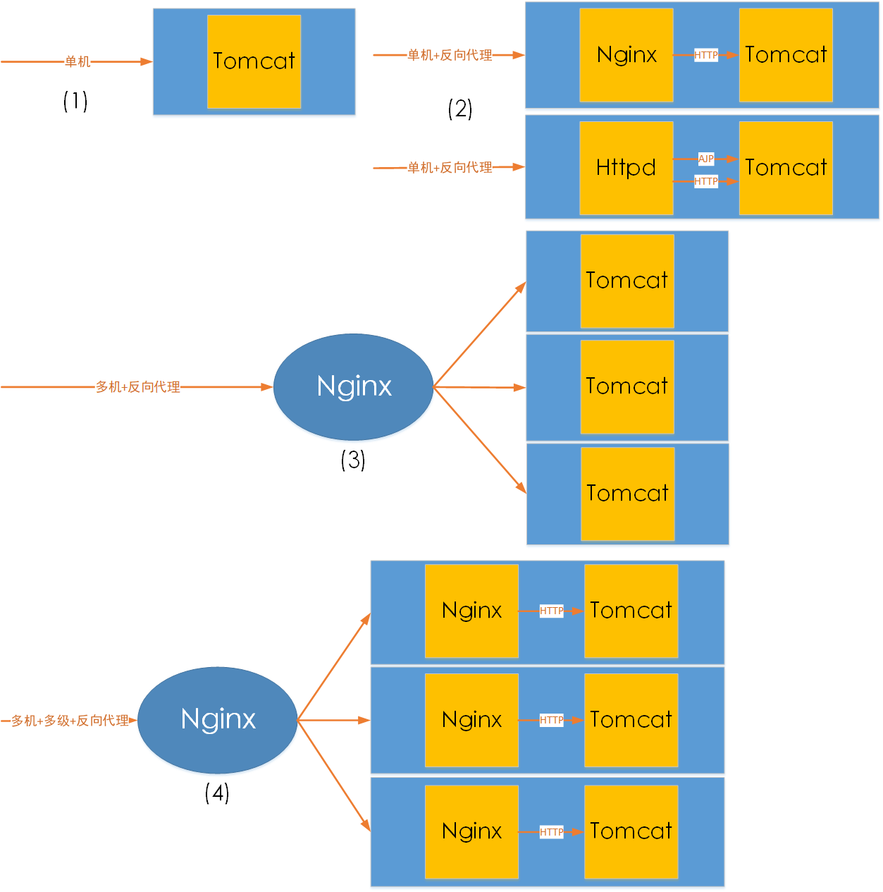
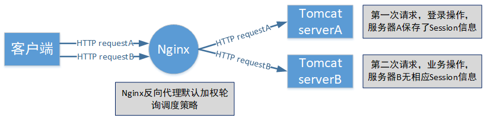
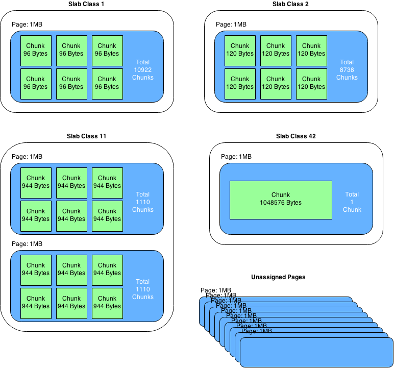

# 一.Tomcat 集群介绍

在实际生产环境中，单台 Tomcat 服务器的负载能力或者说并发能力在四五百左右。大
部分情况下随着业务增长，访问量的增加(并发量不止四五百)，单台 Tomcat 服务器是
无法承受的。这时就需要将多台 Tomcat 服务器组织起来，共同分担负载。

所以在生产环境中，一部分会使用单机部署方式，这样的部署方式在比较小的公司会见
到，大部分会使用多机部署。具体的 Tomcat 部署架构有以下几种：



1. 单台 Tomcat 服务器部署时称为单机部署
   Tomcat 单独运行，直接接受用户的请求
2. 单台 Tomcat 服务器加上 Nginx 或者 Httpd 作为反向代理
   反向代理，单机运行，提供了一个 Nginx 作为反向代理，可以做到静态由 nginx
   提供响应，动态 jsp 代理给 Tomcat，如 LNMT 或者 LAMT 架构

   - LNMT：Linux + Nginx + MySQL + Tomcat
   - LAMT：Linux + Apache（Httpd）+ MySQL + Tomcat

3. 使用 Nginx 反向代理多台 Tomcat 服务器
   前置一台 Nginx，给多台 Tomcat 实例做反向代理和负载均衡调度，Tomcat 上
   部署的纯动态页面更适合
   - LNMT：Linux + Nginx + MySQL + Tomcat
4. 使用 Nginx 反向代理多台 Tomcat 服务器，在每台 Tomcat 服务器又使用 Nginx
   接收请求，如 LNNMT
   - LNNMT：Linux + Nginx + Nginx + MySQL + Tomcat

# 二.负载均衡策略

1. 轮询
   加权轮询是 upstrean 模块默认的负载均衡策略。每个请求会按时间顺序逐一
   分配到不同的后端服务器。默认情况下每台服务器的权重为 1，若服务器硬件
   性能差别比较大，则需要为不同的服务器分配不同的权重。

```ruby
upstream serverpool{
   server localhost:8000;  # server指令指明后端服务器
   server localhost:9000;
   server www.suosuoli.cn weight=1 fail_timeout=5s max_fail=3;
}

server {
    listen 88;
    server_name localhost;
    location / {
        proxy_pass http://serverpool/;
    }
}
```

upstream 模块中的 server 指令参数说明：

| 参数         | 描述                                                                                                                               |
| :----------- | :--------------------------------------------------------------------------------------------------------------------------------- |
| fail_timeout | 与 max_fails 结合使用                                                                                                              |
| max_fails    | 设置在 fail_timeout 参数设置的时间内最大失败次数,如果在这个时间内，所有针对该服务器的请求都失败了,那么认为该服务器会被访为是停机了 |
| fail_time    | 服务器会被认为停机的时间长度,默认为 10s                                                                                            |
| backup       | 标记该服务器为备用服务器。当主服务器停止时，请求会被发送到它这里                                                                   |
| down         | 标记服务器永久停机了                                                                                                               |

2. ip_hash
   指定负载均衡器按照基于客户端 IP 的分配方式,这个方法确保了相同的客户端的
   请求一直发送到相同的服务器,以保证客服端和服务器的 session 会话。这样每
   个访客都固定访问一个后端服务器,可以解决 session 不能跨服务器的问题。

```ruby
upstream serverpool{
   1p_hash;
   server 192.168.192.122:8080 weight=3;
   server 192.168.192.133:8080 weight=1;
}
```

# 三.Tomcat 的 session 共享

当单机的 Tomcat，演化出多机多级部署的时候，一个问题便凸显出来，这就是
Session。而这个问题的由来，是由于 HTTP 协议在设计之初没有想到未来的发展。

HTTP 的无状态、有连接和短连接特性

- 无状态：指的是服务器端无法知道 2 次请求之间的联系，即使是前后 2 次请求
  来自同一个浏览器，也没有任何数据能够判断出是同一个浏览器的请求。后来可
  以通过 cookie、session 机制来判断。
  - 浏览器端第一次通过 HTTP 请求服务器端时，在服务器端使用 session 技术，
    就可以在服务器端产生一个随机值即 SessionID 发给浏览器端，浏览器端收到
    后会保持这个 SessionID 在 Cookie 当中，这个 Cookie 值一般不能持久存
    储，浏览器关闭就消失。浏览器在每一次提交 HTTP 请求的时候会把这个
    SessionID 传给服务器端，服务器端就可以通过比对知道当前是谁访问。
  - Session 通常会保存在服务器端内存中，如果没有持久化，则易丢失
  - Session 会定时过期。过期后浏览器如果再访问，服务端发现没有此 ID，将给
    浏览器端重新发新的 SessionID
  - 更换浏览器也将重新获得新的 SessionID
- 有连接：是因为 HTTP1.x 基于 TCP 协议，是面向连接的，需要 3 次握手、4 次
  挥手断开。
- 短连接：Http 1.1 之前，都是一个请求一个连接，而 Tcp 的连接创建销毁成本高
  ，对服务器有很大的影响。所以，自 Http 1.1 开始，支持 keep-alive，默认也开
  启，一个连接打开后，会保持一段时间（可设置），浏览器再访问该服务器就使用这
  个 Tcp 连接，减轻了服务器压力，提高了效率。

如果应用需要用户进行登录，Nginx 作为反向代理服务器代理后端 Tomcat 接收请求，
那么这个时候，就会出现 Session 相关的问题。



解决这种由于反向代理服务而导致的使得同一个客户端的请求找不到自己对应的
Session 的问题可以使用 Session 共享机制。有以下几种方案：

## 3.1 ip_hash 策略

由一个用户发起的请求，只会被调度到特定的 TomcatA 服务器上进行处理，另一个
用户发起的请求只在 TomcatB 上进行处理。那么这个时候，同一个用户发起的请
求，都会通过 nginx 的 `ip_hash` 策略，将请求转发到其中的一台 Tomcat 上。

在 Nginx 的反向代理中 ip_hash 策略也叫 source ip，即源地址哈希；如果使用
HAProxy 做代理服务器，则可以使用 Cookie 来保持会话。

## 3.2 Session 复制集群

Session 复制的原理是通过 Tomcat 集群的内部多播机制将所有的不同 Session 在
集群的所有 Tomcat 主机上复制，即所有 Tomcat 服务器都存有当前的所有 Session
信息。

缺点

- Tomcat 的同步节点不宜过多，互相即时通信同步 session 需要太多带宽
- 每一台都拥有全部 session，内存占用太多

## 3.3 Session Server

session 共享服务器，共享的 Session 服务器使用 memcached 或者 redis 做存
储，来存储 session 信息，供 Tomcat 服务器查询。

## 3.4 简单的 Nginx 调度和 Session 共享示例

### 3.4.1 示例使用环境

环境规划

| IP              | 主机名 | 服务    | 备注          |
| :-------------- | :----- | :------ | :------------ |
| 192.168.142.151 | t0     | 调度器  | Nginx、HTTPD  |
| 192.168.142.152 | t1     | tomcat1 | JDK8、Tomcat8 |
| 192.168.142.153 | t2     | tomcat2 | JDK8、Tomcat8 |

每台主机使用 hosts 文件解析 ip

```ruby
192.168.142.151 t0.suosuoli.cn t0
192.168.142.152 t1.suosuoli.cn t1
192.168.142.153 t2.suosuoli.cn t2
```

### 3.4.2 Tomcat 配置

先编写测试使用的 jsp:位于 t1 和 t2 节点的`/data/webapps/index.jsp`

```jsp
<%@ page import="java.util.*" %>
<!DOCTYPE html>
<html lang="en">
<head>
    <meta charset="UTF-8">
    <title>lbjsptest</title>
</head>
<body>
<div>On  <%=request.getServerName() %></div>
<div><%=request.getLocalAddr() + ":" + request.getLocalPort() %></div>
<div>SessionID = <span style="color:blue"><%=session.getId() %></span></div>
<%=new Date()%>
</body>
</html
```

t1 虚拟主机配置

```xml
<Engine name="Catalina" defaultHost="t1.suosuoli.cn">
    <Host name="t1.suosuoli.cn" appBase="/data/webapps" autoDeploy="true" />
</Engine>
```

t2 虚拟主机配置

```xml
<Engine name="Catalina" defaultHost="t2.suosuoli.cn">
    <Host name="t2.suosuoli.cn" appBase="/data/webapps" autoDeploy="true" />
</Engine>
```

每台 Tomcat 配置大同小异：

```ruby
# 环境变量配置
vim /etc/profile.d/tomcat.sh
export CATALINA_HOME=/usr/local/tomcat
export PATH=$CATALINA_HOME/bin:$PATH

# 项目路径配置
mkdir -pv /data/webapps/ROOT

# 编写测试jsp文件，内容在上面
vim /data/webapps/index.jsp
scp -r server.xml 192.168.142.153:/usr/local/tomcat

# 启动Tomcat服务
 startup.sh
```

### 3.4.3 Nginx 配置

```ruby
upstream backendpool {
        #ip_hash; # 先禁用观察轮询的sessionid变化，之后开启开session黏性
        server t1.suosuoli.cn:8080;
        server t2.suosuoli.cn:8080;
    }

    server {
        location ~* \.(jsp|do)$ {
            proxy_pass http://backendpool;
        }
    }
```

访问测试`http://t0.suosuoli.cn/index.jsp`，可以看到轮询调度效果。
在 upstream 中使用 ip_hash 指令，使用客户端 IP 地址 Hash。这个 hash
值使用 IP v4 地址的前 24 位或全部的 IP v6 地址。
配置完 reload nginx 服务。测试一下观察效果。关闭 Session 对应的 Tomcat
服务，再重启 tomcat，观察 Session 的变化。

## 3.5 简单的 Httpd 调度

使用`httpd -M`命令可以看到 `proxy_balancer_module`模块，httpd 用它来实现
负载均衡。在 Tomcat 和 Httpd 集成时，可以使用两种协议来实现请求的负载均衡：

| 方式          | 依赖模块                                    |
| :------------ | :------------------------------------------ |
| http 负载均衡 | mod_proxy mod_proxy_http mod_proxy_balancer |
| ajp 负载均衡  | mod_proxy mod_proxy_ajp mod_proxy_balancer  |

### 3.5.1 Httpd 配置说明

```ruby
# 关闭httpd默认主机
~$ cd /etc/httpd/conf
~$ vim httpd.conf
# 注释掉 DocumentRoot "/var/www/html"
~$ cd ../conf.d
~$ vim vhosts.conf  # 编辑虚拟主机
    ...
    # 配置代理到balancer
    ProxyPass [path] !|url [key=value [key=value ...]]
    # Balancer成员
    BalancerMember [balancerurl] url [key=value [key=value ...]]
    # 设置Balancer或参数
    ProxySet url key=value [key=value ...]
    ...
~$ httpd -t
~$ systemctl start httpd
```

`ProxyPass`和`BalancerMember`指令参数说明

| 参数  | 缺省值 | 说明                                                            |
| :---- | :----- | :-------------------------------------------------------------- |
| min   | 0      | 连接池最小容量                                                  |
| max   | 1 ~ n  | 连接池最大容量                                                  |
| retry | 60     | apache 请求发送到后端服务器错误后等待的时间秒数。0 表示立即重试 |

Balancer 参数说明

| 参数          | 缺省值     | 说明                                                                                                                                                     |
| :------------ | :--------- | :------------------------------------------------------------------------------------------------------------------------------------------------------- |
| loadfactor    |   -        | 定义负载均衡后端服务器权重，取值范围 1 - 100                                                                                                             |
| lbmethod      | byrequests | 负载均衡调度方法。 byrequests 基于权重的统计请求个数进行调度； bytrafficz 执行基于权重的流量计数调度； bybusyness 通过考量每个后端服务器当前负载进行调度 |
| maxattempts   | 1          | 放弃请求前实现故障转移的次数，默认为 1，其最大值不应该大于总的节点数                                                                                     |
| nofailover    | Off        | 如果后端服务器没有 Session 副本，可以设置为 On 不允许故障转移。Off 故障可以转移                                                                          |
| stickysession |   -        | 调度器的 sticky session 名字，根据 web 后台编程语言不同，可以设置为 JSESSIONID 或 PHPSESSIONID                                                           |

ProxySet 指令也可以使用上面的参数。如下面的配置示例：

```xml
<Proxy "balancer://hotcluster">
    BalancerMember "http://www2.example.com:8080" loadfactor=1
    BalancerMember "http://www3.example.com:8080" loadfactor=2
    ProxySet lbmethod=bytraffic
</Proxy>
```

```xml
<Proxy "http://backend">
    ProxySet keepalive=On
</Proxy>
```

```xml
ProxySet "balancer://foo" lbmethod=bytraffic timeout=15
ProxySet "ajp://backend:7001" timeout=15
```

**`conf.d/vhosts.conf`内容如下**

```xml
<VirtualHost *:80>
    ProxyRequests     Off
    ProxyVia          On
    ProxyPreserveHost On
    ProxyPass        / balancer://lbtomcats/
    ProxyPassReverse / balancer://lbtomcats/
</VirtualHost>
<Proxy balancer://lbtomcats>
    BalancerMember http://t1.suosuoli.cn:8080 loadfactor=1
    BalancerMember http://t2.suosuoli.cn:8080 loadfactor=2
</Proxy>
```

loadfactor 设置为 1:2，便于观察。观察调度的结果是轮询的。

``使用 session 粘性 - 修改`conf.d/vhosts.conf`\*\*

```xml
Header add Set-Cookie "ROUTEID=.%{BALANCER_WORKER_ROUTE}e; path=/"
env=BALANCER_ROUTE_CHANGED
<VirtualHost *:80>
    ProxyRequests     Off
    ProxyVia          On
    ProxyPreserveHost On
    ProxyPass        / balancer://lbtomcats/
    ProxyPassReverse / balancer://lbtomcats/
</VirtualHost>
<Proxy balancer://lbtomcats>
    BalancerMember http://t1.suosuoli.cn:8080 loadfactor=1 route=Tomcat1
    BalancerMember http://t2.suosuoli.cn:8080 loadfactor=2 route=Tomcat2
    ProxySet stickysession=ROUTEID
</Proxy>
```

观察会发现 Session 不变，一直找的同一个 Tomcat 服务器。

**ajp 调度 - 修改`conf.d/vhosts.conf`**

```xml
<VirtualHost *:80>
    ProxyRequests     Off
    ProxyVia          On
    ProxyPreserveHost On
    ProxyPass        / balancer://lbtomcats/
    ProxyPassReverse / balancer://lbtomcats/
</VirtualHost>
<Proxy balancer://lbtomcats>
    BalancerMember ajp://t1.suosuoli.cn:8009 loadfactor=1 route=Tomcat1
    BalancerMember ajp://t2.suosuoli.cn:8009 loadfactor=2 route=Tomcat2
    #ProxySet stickysession=ROUTEID
</Proxy>
```

`ProxySet stickysession=ROUTEID` 先禁用看看切换效果，开启后看看黏住效果。
开启后，发现 Session 不变了，一直找的同一个 Tomcat 服务器。

虽然，上面的做法实现客户端在一段时间内找同一台 Tomcat，从而避免切换后导致
的 Session 丢失。但是如果 Tomcat 节点挂掉，那么 Session 依旧丢失。

假设有 A、B 两个节点，都把 Session 做了持久化。如果 Tomcat A 服务下线期间
用户切换到了 Tomcat B 上，就获得了 Tomcat B 的 Session，就算持久化
Session 的 Tomcat A 上线了，也没用了。

### 3.5.2 Tomcat 配置说明

在 tomcat 的配置中 Engine 使用 jvmRoute 属性

```xml
t1、t2的tomcat配置中分别增加jvmRoute
<Engine name="Catalina" defaultHost="t1.suosuoli.cn" jvmRoute="Tomcat1">
<Engine name="Catalina" defaultHost="t2.suosuoli.cn" jvmRoute="Tomcat2">
```

这样在生成 session 时的 SessionID，就变成了类似这样
`SessionID = 9C949FA4AFCBE9337F5F0669548BD4DF.Tomcat2`

# 四.Tomcat 集群使用组播复制 session 示例

[配置详细参考](https://tomcat.apache.org/tomcat-8.5-doc/cluster-howto.html)

配置示例：

```xml
<Cluster className="org.apache.catalina.ha.tcp.SimpleTcpCluster"
         channelSendOptions="8">
  <Manager className="org.apache.catalina.ha.session.DeltaManager"
           expireSessionsOnShutdown="false"
           notifyListenersOnReplication="true"/>
  <Channel className="org.apache.catalina.tribes.group.GroupChannel">
    <Membership className="org.apache.catalina.tribes.membership.McastService"
                address="230.100.100.8"
                port="45564"
                frequency="500"
                dropTime="3000"/>
    <Receiver className="org.apache.catalina.tribes.transport.nio.NioReceiver"
              address="auto"
              port="4000"
              autoBind="100"
              selectorTimeout="5000"
              maxThreads="6"/>
    <Sender className="org.apache.catalina.tribes.transport.ReplicationTransmitter">
      <Transport
className="org.apache.catalina.tribes.transport.nio.PooledParallelSender"/>
    </Sender>
    <Interceptor
className="org.apache.catalina.tribes.group.interceptors.TcpFailureDetector"/>
    <Interceptor
className="org.apache.catalina.tribes.group.interceptors.MessageDispatchInterceptor"/>
  </Channel>
  <Valve className="org.apache.catalina.ha.tcp.ReplicationValve"
         filter=""/>
  <Valve className="org.apache.catalina.ha.session.JvmRouteBinderValve"/>
  <Deployer className="org.apache.catalina.ha.deploy.FarmWarDeployer"
            tempDir="/tmp/war-temp/"
            deployDir="/tmp/war-deploy/"
            watchDir="/tmp/war-listen/"
            watchEnabled="false"/>
  <ClusterListener className="org.apache.catalina.ha.session.ClusterSessionListener"/>
</Cluster>
```

以上配置说明

- Cluster 集群配置
- Manager 会话管理器配置
- Channel 信道配置
  - Membership 成员判定。使用什么多播地址、端口多少、间隔时长 ms、超时时
    长(ms)等。同一个多播地址和端口认为同属一个组。使用时修改这个多播地址，
    以防冲突
  - Receiver 接收器，多线程接收多个其他节点的心跳、会话信息。默认会从
    4000 到 4100 依次尝试可用端口。
    - `address="auto"`，auto 可能绑定到 127.0.0.1 上，所以一定要改为可以
      用的 IP
  - Sender 多线程发送器，内部使用了 tcp 连接池。
  - Interceptor 拦截器
- Valve
  - ReplicationValve 检测哪些请求需要检测 Session，Session 数据是否有了
    变化，需要启动复制过程
- ClusterListener
  - ClusterSessionListener 集群 session 侦听器

将`<Cluster className="org.apache.catalina.ha.tcp.SimpleTcpCluster"/>`
添加到`<Engine>`的配置上下文，则所有虚拟主机都可以启用 Session 复制。添加
到`<Host>`配置上下文，则表示该虚拟主机可以启用 Session 复制。最后，在应用
程序内部启用了才可以使用 session 复制功能。

该示例的前提是：

- 时间同步，确保 NTP 或 Chrony 服务正常运行。# systemctl status chronyd
- 关闭防火墙规则。# systemctl stop firewalld

本次把多播复制的配置放到缺省虚拟主机里面， 即 Host 之下。
特别注意修改 Receiver 的 address 属性为一个本机可对外的 IP 地址。

t1 的 server.xml 中，如下

```xml
<Host name="t1.magedu.com" appBase="/data/webapps" autoDeploy="true" >
    <!-- 其他略去 -->
    <Receiver className="org.apache.catalina.tribes.transport.nio.NioReceiver"
              address="192.168.142.152"
              port="4000"
              autoBind="100"
              selectorTimeout="5000"
              maxThreads="6"/>
```

t2 的 server.xml 中，如下

```xml
<Host name="t2.magedu.com" appBase="/data/webapps" autoDeploy="true" >
    <!-- 其他略去 -->
    <Receiver className="org.apache.catalina.tribes.transport.nio.NioReceiver"
              address="192.168.142.153"
              port="4000"
              autoBind="100"
              selectorTimeout="5000"
              maxThreads="6"/>
```

Tomcat 重启后，ss 命令能看到 tomcat 监听在 4000 端口上

有了以上的准备工作后还要配置`web.xml`
在应用中增加 WEB-INF，从全局复制一个 web.xml 过来
`# cp /usr/local/tomcat/conf/web.xml /data/webapps/ROOT/WEB-INF/`
为 web.xml 的`<web-app>`标签增加子标签`<distributable/>`来开启该应用程序
的分布式。
重启全部 Tomcat，通过负载均衡调度到不同节点，返回的 SessionID 不变了。

上面的示例为简单的 Session 复制共享，使用 Tomcat 内置的集群和广播机制来实现，
这种做法只能在小型应用中使用，少数 Tomcat 应用。如果 Tomcat 的服务器数量过
多，比如有 N 台服务器，那么某用户登录一次，则每台 Tomcat 服务器需要向集群中
的另外`N-1`台服务器复制该 Session，那么互相之间大量的复制 Session 将会占用
大量带宽。官方文档支出，超出 4 个 Tomcat 服务器就不适合使用该方案了。

# 五.Tomcat 集群使用 session 服务器共享 session 示例

## 5.1 NoSQL 概念

NoSQL 是对非 SQL、非传统关系型数据库的统称。
NoSQL 一词诞生于 1998 年，2009 年这个词汇被再次提出指非关系型、分布式、
不提供 ACID 的数据库设计模式。

随着互联网时代的到来，数据爆发式增长，数据库技术发展日新月异，要适应新的
业务需求。随着移动互联网、物联网的到来，大数据技术中 NoSQL 也同样重要。

从数据库的排行可以看出 NoSQL 数据库的重要性：[db-engines.com](https://db-engines.com/en/ranking)

NoSQL 数据库分类

| 存储类型                                    | 代表数据库产品   |
| :------------------------------------------ | :--------------- |
| Key-value Store                             | redis、memcached |
| Document Store                              | mongodb、CouchDB |
| Column Store 列存数据库(Column-Oriented DB) | HBase、Cassandra |
| Graph DB                                    | Neo4j            |
| Time Series 时序数据库                      | InfluxDB         |

## 5.2 Memcached

Memcached 只支持能序列化的数据类型，不支持持久化，基于 Key-Value 存储的
内存缓存系统。

### 5.2.1 Memcached 内存分配机制

应用程序运行需要使用内存来存储数据，但对于一个缓存系统来说，申请内存、释放
内存将十分频繁，非常容易导致大量内存碎片，最后导致无连续可用内存可用。

Memcached 采用了 Slab Allocator 机制来分配、管理内存。

`Page`：分配给 Slab 的内存空间，默认为 1MB，分配后就得到一个 Slab。Slab 分配
之后内存按照固定字节大小等分成 chunk。
`Chunk`：用于缓存记录 kv 值的内存空间。Memcached 会根据数据大小选择存到哪一
个 chunk 中，假设 chunk 有 128bytes、64bytes，数据只有 100bytes 存储在
128bytes 的 chunk 中，存在些浪费。
Chunk 最大就是 Page 的大小，即一个 Page 中就一个 Chunk
`Slab Class`：Slab 按照大小分组，就组成不同的 Slab Class



如果有 100bytes 要存，那么 Memcached 会选择上图中 Slab Class 2 存储，因为
它是 120bytes 的 Chunk。
Slab 之间的差异可以使用 `Growth Factor` 参数控制，默认 1.25。

**懒过期`Lazy Expiration`**
memcached 不会监视数据是否过期，而是在取数据时才看是否过期，过期的把数据
有效期限标识为 0，并不清除该数据。以后可以覆盖该位置存储其它数据。

当内存不足时，memcached 会使用 `LRU(Least Recently Used)`机制来查找可用空间，分配给新纪录使用。

### 5.2.2 Memcached 集群

Memcached 集群，称为**基于客户端**的分布式集群。
Memcached 集群内部并不互相通信，一切都需要客户端连接到 Memcached 服务器
后自行组织这些节点，并决定数据存储的节点。

安装 memcached

```ruby
# yum install memcached
# rpm -ql memcached
/etc/sysconfig/memcached
/usr/bin/memcached
/usr/bin/memcached-tool
/usr/lib/systemd/system/memcached.service
/usr/share/doc/memcached-1.4.15
/usr/share/doc/memcached-1.4.15/AUTHORS
/usr/share/doc/memcached-1.4.15/CONTRIBUTORS
/usr/share/doc/memcached-1.4.15/COPYING
/usr/share/doc/memcached-1.4.15/ChangeLog
/usr/share/doc/memcached-1.4.15/NEWS
/usr/share/doc/memcached-1.4.15/README.md
/usr/share/doc/memcached-1.4.15/protocol.txt
/usr/share/doc/memcached-1.4.15/readme.txt
/usr/share/doc/memcached-1.4.15/threads.txt
/usr/share/man/man1/memcached-tool.1.gz
/usr/share/man/man1/memcached.1.gz
# cat /usr/lib/systemd/system/memcached.service
[Service]
Type=simple
EnvironmentFile=-/etc/sysconfig/memcached
ExecStart=/usr/bin/memcached -u $USER -p $PORT -m $CACHESIZE -c $MAXCONN $OPTIONS
# cat /etc/sysconfig/memcached
PORT="11211"
USER="memcached"
MAXCONN="1024"
CACHESIZE="64"
OPTIONS=""

# 前台显示运行
# memcached -u memcached -p 11211 -f 1.25 -vv
# systemctl start memcached
```

修改 memcached 运行参数，可以使用下面的选项修改`/etc/sysconfig/memcached`
文件：

- `-u username` memcached 运行的用户身份，必须普通用户
- `-p` 绑定的端口，默认 11211
- `-m num` 最大内存，单位 MB，默认 64MB
- `-c num` 最大连接数，缺省 1024
- `-d` 守护进程方式运行
- `-f` 增长因子 Growth Factor，默认 1.25
- `-v` 详细信息，-vv 能看到详细信息
- `-M` 内存耗尽，不许 LRU
- `-U` 设置 UDP 监听端口，0 表示禁用 UDP

与 memcached 通信的不同语言的连接器也需要下载，其中 `libmemcached` 提供
了 C 库和命令行工具。

```ruby
# yum list all | grep memcached
memcached.x86_64                        1.4.15-10.el7_3.1              @base
libmemcached.i686                       1.0.16-5.el7                   base
libmemcached.x86_64                     1.0.16-5.el7                   base
libmemcached-devel.i686                 1.0.16-5.el7                   base
libmemcached-devel.x86_64               1.0.16-5.el7                   base
memcached-devel.i686                    1.4.15-10.el7_3.1              base
memcached-devel.x86_64                  1.4.15-10.el7_3.1              base
opensips-memcached.x86_64               1.10.5-4.el7                   epel
php-ZendFramework-Cache-Backend-Libmemcached.noarch
php-pecl-memcached.x86_64               2.2.0-1.el7                    epel
python-memcached.noarch                 1.48-4.el7                     base
uwsgi-router-memcached.x86_64           2.0.17.1-2.el7                 epel
```

### 5.2.3 访问 memcached 的协议

查看`/usr/share/doc/memcached-1.4.15/protocol.txt`可以看到 memcached 支持
的协议，其中 telnet 也支持：

```ruby
# yum install telnet
# telnet locahost 11211
stats
add mykey 1 60 4
test
STORED
get mykey
VALUE mykey 1 4
test
END
set mykey 1 60 5
test1
STORED
get mykey
VALUE mykey 1 5
test1
END
```

`add KEY FLAGS exptime bytes`，该指令表示在 memcached 中增加键 KEY，FLAGS
为标识，过期时间为 exptime 秒，bytes 为存储数据的字节数。

## 5.3 使用 MSM 实现 tomcat 集群的 session 共享服务器

### 5.3.1 MSM

MSM(memcached session manager)提供将 Tomcat 的 session 保持到 memcached
或 redis 的功能的程序，可以实现高可用。目前项目托管在 [Github-MSM](https://github.com/magro/memcached-session-manager)
支持 Tomcat 的 6.x、7.x、8.x、9.x 等版本。

Tomcat 的 Session 管理类 jar 包，Tomcat 版本不同，使用不同的包

- memcached-session-manager-2.3.2.jar
- memcached-session-manager-tc8-2.3.2.jar

Session 数据的序列化、反序列化类

- 官方推荐 `kyro`
- 在 webapp 中 WEB-INF/lib/下

驱动类

- memcached(spymemcached.jar)
- Redis(jedis.jar)

### 5.3.2 MSM 在 Tomcat 的安装

[MSM 安装官方参考](https://github.com/magro/memcached-session-manager/wiki/SetupAndConfiguration)

将 spymemcached.jar、memcached-session-manage、kyro 相关的 jar 文件都放
到 Tomcat 的 lib 目录中去，这个目录是`$CATALINA_HOME/lib/`，一般就是
`/usr/local/tomcat/lib`。

```ruby
asm-5.2.jar
kryo-3.0.3.jar
kryo-serializers-0.45.jar
memcached-session-manager-2.3.2.jar
memcached-session-manager-tc8-2.3.2.jar
minlog-1.3.1.jar
msm-kryo-serializer-2.3.2.jar
objenesis-2.6.jar
reflectasm-1.11.9.jar
spymemcached-2.12.3.jar
```

### 5.3.3 sticky 模式的 session 服务

**原理**

当请求结束时 Tomcat 的 session 会送给 memcached 备份。即 Tomcat session
为主 session，memcached session 为备 session，使用 memcached 相当于备份了
一份 Session。

查询 Session 时 Tomcat 会优先使用自己内存的 Session，Tomcat 通过
jvmRoute 发现不是自己的 Session，便从 memcached 中找到该 Session，更新本机
Session，请求完成后更新 memcached。

**环境**

```ruby
<t1-tomcat服务器1>  <t2-tomcat服务器2>
        .        \ /       .
        .         X        .
        .        / \       .
<m1-tomcat服务器1>  <m2-tomcat服务器2>
```

t1 和 m1 部署在一台主机上，t2 和 m2 部署在同一台。

**配置**

配置放到 `$CATALINA_HOME/conf/context.xml` 中
特别注意，t1 配置中为 `failoverNodes="nm1"`， t2 配置为
`failoverNodes="m2"`

以下是 sticky 的配置

```xml
<Context>
  ...
  <Manager className="de.javakaffee.web.msm.MemcachedBackupSessionManager"
    memcachedNodes="m1:192.168.142.152:11211,m2:192.168.142.153:11211"
    failoverNodes="m1"
    requestUriIgnorePattern=".*\.(ico|png|gif|jpg|css|js)$"

 transcoderFactoryClass="de.javakaffee.web.msm.serializer.kryo.KryoTranscoderFactory"
    />
</Context>
```

关键配置`memcachedNodes="n1:host1.yourdomain.com:11211,n2:host2.yourdomain.com:11211"`

memcached 的节点组:m1、m2 只是别名，可以重新命名。`failoverNodes` 故障
转移节点，m1 是备用节点，m2 是主存储节点。另一台 Tomcat 将 m1 改为 m2，
其主节点是 m1，备用节点是 m2。

如果配置成功，启动 tomcat 后可以在`logs/catalina.out`中看到下面的内容

```ruby
信息 [t1.magedu.com-startStop-1]
de.javakaffee.web.msm.MemcachedSessionService.startInternal --------
-  finished initialization:
- sticky: true
- operation timeout: 1000
- node ids: [m2]
- failover node ids: [m1]
- storage key prefix: null
- locking mode: null (expiration: 5s)
```

配置成功后，网页访问以下，页面中看到了 Session。然后运行下面的 Python 程序，
就可以看到是否存储到了 memcached 中了。

```python
import memcache # pip install python-memcached
mc = memcache.Client(['192.168.142.152:11211', '192.168.142.153:11211'], debug=True)

stats = mc.get_stats()[0]
print(stats)
for k,v in stats[1].items():
    print(k, v)

print('-' * 30)
# 查看全部key
print(mc.get_stats('items')) # stats items 返回 items:5:number 1
print('-' * 30)

for x in mc.get_stats('cachedump 5 0'):# stats cachedump 5 0 # 5和上面的items返回的值有
关；0表示全部
    print(x)
```

t1、t2、m1、m2 依次启动成功，分别使用`http://t1.suosuoli.cn:8080/` 和
`http://t2.suosuoli.cn:8080/` 观察。

启动负载均衡调度器(Nginx)，通过`http://t0.suosuoli.cn`来访问看看效果

```ruby
On tomcats
192.168.142.153:8080
SessionID = 2A19B1EB6D9649C9FED3E7277FDFD470-n2.Tomcat1
Wed Jun 26 16:32:11 CST 2019
On tomcats
192.168.142.152:8080
SessionID = 2A19B1EB6D9649C9FED3E7277FDFD470-n1.Tomcat2
Wed Jun 26 16:32:36 CST 2019
```

可以看到浏览器端被调度到不同 Tomcat 上，但是都获得了同样的 SessionID。

停止 t2、n2 看看效果，恢复看看效果。

### 5.3.4 none-sticky 模式的 session 服务

**原理**
从 msm 1.4.0 之后开始支持 non-sticky 模式。

Tomcat session 为中转 Session，如果 m1 为主 session，m2 为备 session。
产生的新的 Session 会发送给主、备 memcached，并清除本地 Session。

m1 下线，m2 转正。m1 再次上线，m2 依然是主 Session 存储节点。

**memcached 配置**
配置放到 `$CATALINA_HOME/conf/context.xml`中

```xml
<Context>
  ...
  <Manager className="de.javakaffee.web.msm.MemcachedBackupSessionManager"
    memcachedNodes="m1:192.168.142.152:11211,m2:192.168.142.153:11211"
    sticky="false"
    sessionBackupAsync="false"
    lockingMode="uriPattern:/path1|/path2"
    requestUriIgnorePattern=".*\.(ico|png|gif|jpg|css|js)$"

 transcoderFactoryClass="de.javakaffee.web.msm.serializer.kryo.KryoTranscoderFactory"
    />
</Context>
```

**redis 配置**

下载 jedis.jar，放到`$CATALINA_HOME/lib/`，对应本次安装就是
`/usr/local/tomcat/lib`

```ruby
# yum install redis
# vim /etc/redis.conf
bind 0.0.0.0
# systemctl start redis
```

以下配置放到 `$CATALINA_HOME/conf/context.xml` 中

```xml
<Context>
  ...
  <Manager className="de.javakaffee.web.msm.MemcachedBackupSessionManager"
    memcachedNodes="redis://192.168.142.152:6379"
    sticky="false"
    sessionBackupAsync="false"
    lockingMode="uriPattern:/path1|/path2"
    requestUriIgnorePattern=".*\.(ico|png|gif|jpg|css|js)$"

 transcoderFactoryClass="de.javakaffee.web.msm.serializer.kryo.KryoTranscoderFactory"
    />
</Context>
```

**总结**
通过多组实验，使用不同技术实现了 session 持久机制

1. `session 绑定`，基于 IP 或 session cookie 的。其部署简单，尤其基于
   session 黏性的方式，粒度小，对负载均衡影响小。但一旦后端服务器有故障，
   其上的 session 丢失。
2. `session 复制集群`，基于 tomcat 实现多个服务器内共享同步所有 session。
   此方法可以保证任意一台后端服务器故障，其余各服务器上还都存有全部 session，
   对业务无影响。但是它基于多播实现心跳，TCP 单播实现复制，当设备节点过多，
   这种复制机制不是很好的解决方案。且并发连接多的时候，单机上的所有 session
   占据的内存空间非常巨大，甚至耗尽内存。
3. `session 服务器`，将所有的 session 存储到一个共享的内存空间中，使用多个
   冗余节点保存 session，这样做到 session 存储服务器的高可用，且占据业务服
   务器内存较小。是一种比较好的解决 session 持久的解决方案。

以上的方法都有其适用性。生产环境中，应根据实际需要合理选择。

不过以上这些方法都是在内存中实现了 session 的保持，可以使用数据库或者文件
系统，把 session 数据存储起来，持久化。这样服务器重启后，也可以重新恢复
session 数据。不过 session 数据是有时效性的，是否需要这样做，视情况而定。
