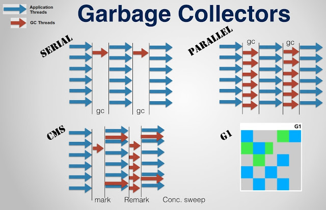

# 一.Tomcat 性能测试

对于系統性能,用户最直观的感受就是系统的加载和操作时间,即用户执行某项操作的耗时。
从更为专业的角度上讲,性能测试可以从以下两个指标量化。

1. 响应时间:执行某个操作的耗时。大多数情况下,我们需要针对同一个操作测试多次,
   以获取操作的平均响应时间。
2. 吞吐量:即在给定的时间内,系统支持的事务数量,计算单位为 TPS.
   I

通常情况下,我们需要借助于一些自动化工具来进行性能测试，因为手动模拟大量用户的
并发访问几乎是不可行的,而且现在市面上也有很多的性能测试工具可以使用,如:
ApacheBench、ApacheJMeter、 WCAT、webpolygraph、LoadRunner。

## 1.1 ApacheBench

ApacheBench(ab)是一款 ApacheServer 基准的测试工具,用户测试 Apache server 的
服务能力 (每秒处理请求数)， 它不仅可以用户 Apache 的测试。还可以用于测试 Tomcat
Nginx、lighthttp、IIS 等服务器。

1. 安装
   `yum instll httpd-tools`
2. 安装后查看版本号
   `ab -V`

3. 测试
   `ab -n 1000 -e 100 -p data.json -T applicat1on/json http://1ocalhost:9000/articles/search.do?cat=Tomcat&topic=test`

```json
{ "Tomcat": "test", "Nginx": "ReverseProxy" }
```

参数说明

| 参数 | 含义描述                                         |
| :--- | :----------------------------------------------- |
| -n   | 在测试会话中所执行的请求个数,默认只执行一-次请求 |
| -c   | 一次产生的请求个数,默认一次一个                  |
| -p   | 包含了需要 posI 的数据文件                       |
| -t   | 测试所进行的最大秒数,默认没有时间限制            |
| -T   | POST 数据所需要使用的 Content-Type 头信息        |

测试结果指标说明

| 指标                                                         | 含义                                                                                                                       |
| :----------------------------------------------------------- | :------------------------------------------------------------------------------------------------------------------------- |
| Server Software                                              | 服务器软件                                                                                                                 |
| Server Hostname                                              | 主机名                                                                                                                     |
| Server Port                                                  | 端口号                                                                                                                     |
| Document Path                                                | 测试的页面                                                                                                                 |
| Document Length                                              | 测试的页面大小                                                                                                             |
| Concurrency Level                                            | 并发数                                                                                                                     |
| Time taken for tests                                         | 整个测试持续的时间                                                                                                         |
| Complete requests                                            | 完成的请求数量                                                                                                             |
| Failed requests                                              | 失败的请求数量,这里的失败是指请求的连接服务器、发送数据、接收数据等环节发生异常,以及无响应后超时的情况。                   |
| write errors                                                 | 输出错误数量                                                                                                               |
| Total transferred                                            | 整个场景中的网络传输量,表示所有请求的响应数据长度总和,包括每个 http 响应数据的头信息和正文数据的长度。                     |
| HTML transferred                                             | 整个场景中的 HTNL 内容传输量，表示所有请求的响应数据中正文数据的总和                                                       |
| Requests per second                                          | 每秒钟平均处理的请求数(相当于 LR 中的每秒事务数)这便是我们重点关注的吞吐率，它等于: Complete requests/Time taken for tests |
| Time per reguest                                             | 每个线程处理请求平均消耗时间(相当于 LR 中的平均事务响应时间)用户平均请求等待时间                                           |
| Transfer rate                                                | 平均每秒网络上的流星                                                                                                       |
| Percentage of the requests served within a certain time (ms) | 指定时间里,执行的请求百分比                                                                                                |

# 二.Tomcat 性能优化

## 2.1 JVM 参数调优

Tomcat 是一款 Java 应用 ,那么 JVM 的配置便与其运行性能密切相关,
而 JVM 优化的重点则集中在内存分配和 c 策略的调整上,因为内存会直接影
响服务的运行效率和吞吐量，JVM 垃圾回收机制则会不同程度地导致程序运行
中断。可以根据应用程序的特点,选择不同的垃圾回收策略,调整 JVM 垃圾回收
策略,可以极大减少垃圾回收次数,提升垃圾回收效率,改善程序运行性能。

1. JVM 内存参数

| 参數                 | 参数作用                                               | 优化建议                 |
| :------------------- | :----------------------------------------------------- | :----------------------- |
| -server              | 启动 server ,以服务端模式运行                          | 服务端模式建议开启       |
| -Xms                 | 最小堆内存                                             | 建议与-Xmx 设置相同      |
| -Xmx                 | 最大堆内存                                             | 建议设置为可用内存的 80% |
| -XX:Metaspacesize    | 元空间初始值                                           | -                        |
| -XX:MaxMetaspaceSize | 元空间最大内存                                         | 默认无限                 |
| -XX:MaxNewSize       | 新生代最大内存                                         | 默认 16M                 |
| -XX:NewRatio         | 年轻代和老年代大小比值,取值为整数，默认为 2            | 不建议修改               |
| -XX:SurvivorRatio    | Eden 区与 Survivor 区大小的比值，取值为整数 ，默认为 8 | 不建议修改               |

2. GC 策略

JVM 垃圾回收性能需要考量以下两个主要的指标:

- 吞吐量:`工作时间(排除 GC 时间)占总时间的百分比`，工作时间并不仅是程序运行
  的时间,还包含内存分配时间。
- 暂停时间:测试时间段内,由垃圾回收导致的`应用程序停止响应次数/时间`。

在 sun 公司推出的 **HotspotJVM** 中，包含以下几种不同类型的垃圾收集器 :

| 垃圾收集器                                  | 含义                                                                                                                                                                                                                            |
| :------------------------------------------ | :------------------------------------------------------------------------------------------------------------------------------------------------------------------------------------------------------------------------------ |
| 串行收集器(Serial Collector)                | 采用单线程执行所有的垃圾回收工作，适用于单核 CPU 服务器 ,无法利用多核硬件的优势                                                                                                                                                 |
| 并行收集器(Parallel Collector)              | 又称为`吞吐量收集器`，以并行的方式执行`年轻代的垃圾回收`，该方式可以显著降低垃圾回收的开销(指多条垃圾收集线程并行工作，但此时用户线程仍然处于等待状态)。适用于多处理器或多线程硬件上运行的数据量较大的应用                      |
| 并发收集器(Concurrent Collector)            | 以并发的方式执行大部分垃圾回收工作,以缩短垃圾回收的暂停时间。适用于那些响应时间优先于吞吐量的应用，因为该收集器虽然最小化了暂停时间(指用户线程与垃圾收集线程同时执行,但不一定是并行的,可能会交替进行)，但是会降低应用程序的性能 |
| CMS 收集器(Concurrent Mark Sweep Collector) | 并发标记清除收集器，适用于那些更愿意缩短垃圾回收暂停时间并且负担的起与垃圾回收共享处理器资源的应用                                                                                                                              |
| G1 收集器(Garbage-First Garbage Collector)  | 适用于大容星内存的多核服务器，可以在满足垃圾回收暂停时间目标的同时 ，以最大可能性实现高吞吐量(JDK1.7 之后)                                                                                                                      |



不同的应用程序，对于垃圾回收会有不同的需求。JVM 会根据运行的平台、服务器资源
配置情况选择合适的垃圾收集器、堆内存大小及运行时编译器。如无法满足需求，参考
以下准则:

A. 程序数据量较小,选择串行收集器。
B. 应用运行在单核处理器上且没有暂停时间要求，可交由 JVM 自行选择或选择串行收集器。
C. 如果考虑应用程序的峰值性能，没有暂停时间要求 ，可以选择并行收集器。
D. 如果应用程序的响应时间比整体吞吐星更重要，可以选择并发收集器。

**查看 Tomcat 的默认垃圾收集器**

1. 更改启动选项`tomcat/bin/catalina.sh`，加入类似配置

   ```ruby
   JAVA_ OPTS=" -Djava.rmi.server.hostname=192.168.192.138 -Dcom.sun.management.jmxremote.port=8999 -Dcom.sun.management.jmxremote.rmi.port=8999 -Dcom.sun.management.jmxremote.so1=false -Dcom.sun.management.jmxremote.authenticate=false"
   ```

2. 使用 JDK 提供的`jconsole`工具，远程查看 tomcat 的概要信息
   使用`ip:port`即`192.168.192.138:8999`连接 Tomcat

3. GC 参数

| 参数                    | 描述                                                                                                                                        |
| :---------------------- | :------------------------------------------------------------------------------------------------------------------------------------------ |
| -Xx:+UseSerialGC        | 启用串行收集器                                                                                                                              |
| -XX:+UseParallelGC      | 启用并行垃圾收集器，配置了该选项，那么-Xx:+UseParallel01dGc 默认启用                                                                        |
| -XX:+UseParallelOldGC   | Ful1GC 采用并行收集,默认禁用。如果设置了-Xx:+UseParallelGC 则自动启用                                                                       |
| -XX:+UseParNewGC        | 年轻代采用并行收集器，如果设置了-XX:+UseConcMarkSweepGC 选项,自动启用                                                                       |
| -XX:ParallelGCThreads   | 年轻代及老年代垃圾回收使用的线程数。默认值依赖于 JVM 使用的 CPU 个数                                                                        |
| -XX:+UseConcMarkSweepGC | 对于老年代,启用 CMs 垃圾收集器。当并行收集器无法满足应用的延迟需求是 ，推荐使用 CMS 或 G1 收集器。启用该选项后，-XX:+UseParNewGC 自动启用。 |
| -XX:+UseG1GC            | 启用 G1 收集器。G1 是服务器类型的收集器， 用于多核、大内存的机器。它在保持高吞吐量的情况下,高概率满足 Gc 暂停时间的目标。                   |

我们也可以在测试的时候,将 JVM 参数调整之后,将 GC 的信息打印出来,便于为我们
进行参数调整提供依据,具体参数如下:

| 选项                                  | 描述                                                   |
| :------------------------------------ | :----------------------------------------------------- |
| -XX:+PrintGC                          | 打印每次 Gc 的信息                                     |
| -XX:+PrintGCApplicationConcurrentTime | 打印最后一次暂停之后所经过的时间，即响应并发执行的时间 |
| -Xx:+PrintGCApplicationStoppedTime    | 打印 GC 时应用暂停时间                                 |
| -XX:+PrintGCDateStamps                | 打印每次 GC 的日期戳                                   |
| -XX:+PrintGCDetails                   | 打印每次 GC 的详细信息                                 |
| -XX:+PrintGCTaskTimeStamps            | 打印每个 GC 工作线程任务的时间戳                       |
| -XX: +PrintGCTimeStamps               | 打印每次 GC 的时间戳                                   |

在 `bin/catalina.sh` 的脚本中，追加如下配置:

```ruby
JAVA_OPTS="-XX:+UseConcMarkSweepGC -XX:+PrintGCDeta1ls"
```

## 2.2 Tomcat 配置调优

调整`tomcat/conf/server.xml`中关于连接器的配置可以提升应用服务器的性能。

| 参数           | 说明                                                                                                                                                                                                                                                                    |
| :------------- | :---------------------------------------------------------------------------------------------------------------------------------------------------------------------------------------------------------------------------------------------------------------------- |
| maxConnections | 最大连接数,当到达该值后,服务器接收但不会处理更多的请求，额外的请求将会阻塞直到连接数低于 maxConnections。可通过 `ulimit -a` 查看服务器限制。对于 CPU 要求更高(计算型)时,建议不要配置过大;对于 CPU 要求不是特别高时，建议配置在 2000 左右。当然这个需要服务 器硬件的支持 |
| maxThreads     | 最大线程数，需要根据服务器的硬件情况，进行一个合理的设置                                                                                                                                                                                                                |
| acceptCount    | 最大排队等待数,当服务器接收的请求数最到达 maxConnections , 此时 Tomcat 会将后面的请求,存放在任务队列中进行排序，acceptCount 指的就是任务队列中排队等待的请求数 。一台 Tomcat 的最 大的请求处理数量,是 maxConnections+acceptCount。                                      |
