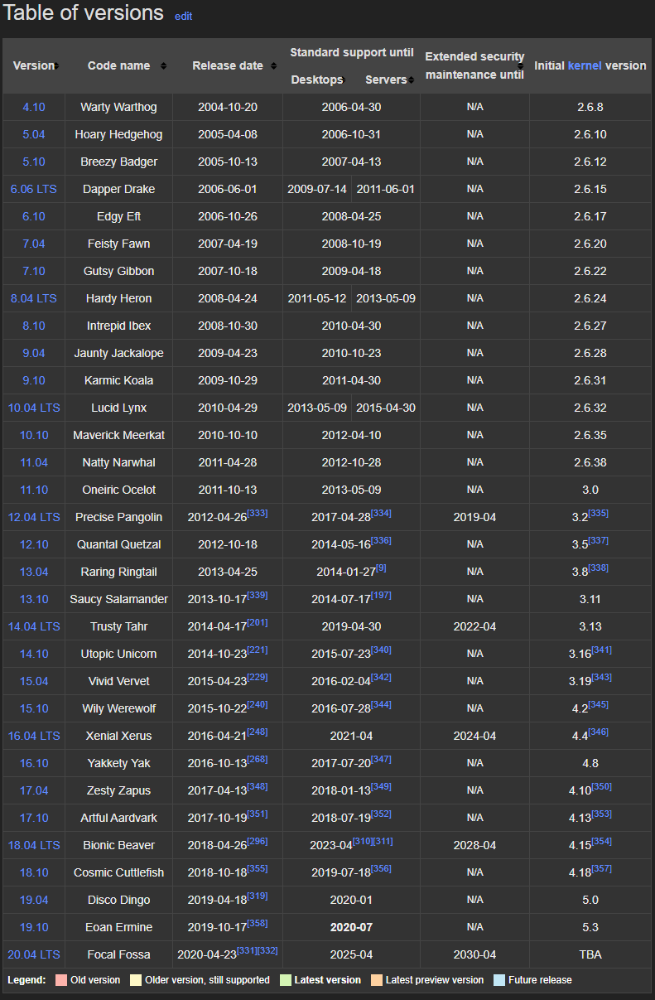
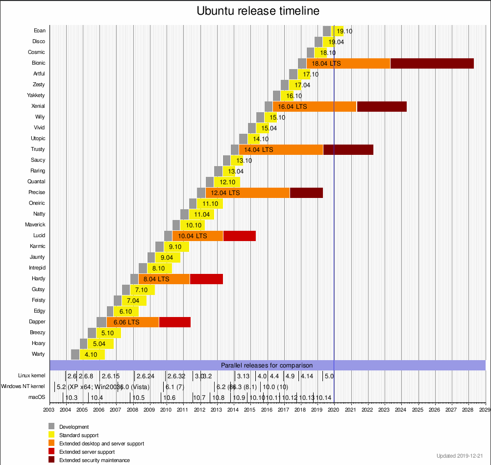

<center><font face="黑体" size=5 color="grey">Ubuntu 使用入门</font></center>

# 一.Debian&Ubuntu

Ubuntu 是基于另一个 Linux 发行版 Debian 发展而来，在介绍 Ubuntu 前有必要
了解了解 Debian 的历史。

## 1.1 Debian

Debian 也被称为 Debian GNU/Linux，是众多 Linux 发行版之一。
主要由`Ian Murdock`在 1993 年 8 月 16 号成立的`Debian Project`
开发，Debian 的名字是由 Ian Murdock 和他的爱妻 Debra 两⼈
的名字组合⽽成。


Debian 是由⼤约⼀千个分布在世界各地的开发者⽆偿地利⽤他们的业余
时间开发的，⽽这些开发者实际上⼤部分都没⻅过⾯，彼此之间的通讯⼤
多是通过电⼦邮件(lists.debian.org 上的邮件列表)和 IRC(irc.debian.
org 上的#debian 频道）来完成的，⽬前 Debian 提供 59000 多个软
件包的维护与更新。

> [Debian 官⽹](https://www.debian.org/)

> [官⽅镜像地址](https://www.debian.org/mirror/list)

> [清华⼤学下载地址](https://mirrors.tuna.tsinghua.edu.cn/debian-cd/10.1.0-live/amd64/isohybrid/)

### 1.1.1 基于 Debian 的 deepin

deepin：基于 debain 的发⾏版，Deepin 原名 Linux Deepin、deepin os、
深度系统、深度操作系统，在 2014 年 4 ⽉改名 Deepin，由武汉深之度科技有
限公司开发，被誉为“最美国产操作系统”，其以桌⾯应⽤为主的开源 GNU/Linux
操作系统，⽀持笔记本、台式机和⼀体机。

深度操作系统（deepin）是中国第⼀个具备国际影响⼒的 Linux 发⾏版本，截⽌⾄
2019 年 7 ⽉ 25 ⽇，深度操作系统⽀持 33 种语⾔，⽤⼾遍布除了南极洲的其它六⼤洲，
深度桌⾯环境（deepinDDE）和⼤量的应⽤软件被移植到了包括 Fedora、Ubuntu、
Arch 等⼗余个国际 Linux 发⾏版和社区，在开源操作系统统计⽹站 DistroWatch 上，
deepin ⻓期位于世界前⼗。

## 1.2 Ubuntu

- Ubuntu(中文音译：友帮拓、优般图、乌班图)，早期是⼀个开源的 GNU/Linux 操作
  系统，其基于 Debian GNU/Linux，⽀持 x86、amd64（即 x64）和 ppc 架构，由全球化
  的专业开发团队（Canonical Ltd）[^1]打造的，其名称来⾃⾮洲南部祖鲁语或豪萨语的
  "ubuntu"⼀词，类似儒家“仁爱”的思想，意思是“⼈性”、“我的存在是因为⼤家的存在”
  ，是⾮洲传统的⼀种价值观， Ubuntu 基于 Debian 发⾏版和 GNOME 桌⾯环境，⽽从 11.04
  版起，Ubuntu 发 ⾏版放弃了 Gnome 桌⾯环境，改为 Unity，与 Debian 的不同在于它每 6
  个⽉会发布⼀个新版本，Ubuntu 的⽬标在于为⼀般⽤⼾提供⼀个最新的、同时⼜相当稳
  定的主要由⾃由软件构建⽽成的操作系统，Ubuntu 具有庞⼤的社区⼒量，⽤⼾可以⽅便
  地从社区获得帮助，Ubuntu 对 GNU/Linux 的普及特别是桌⾯普及作出了巨⼤贡献，由此
  使更多⼈共享开源的成果与精彩。

- Ubuntu 是各种公有云上最受欢迎的操作系统，这是因为 Ubuntu 与各⼤云运营商密切合作，
  针对云服务商的基础架构优化内核和系统，加快安全更新速度，并最⼤限度降低⽤⼾默认
  需要的⽹络或存储成本。

> [中⽂官⽹](https://cn.ubuntu.com/)

> [英⽂官⽹](https://ubuntu.com/download)

### 1.2.1 Ubuntu Distro

- Ubuntu 没有像其它软件⼀样有 1.0 版本，是因为其第⼀个版本是发布于 2004
  年，所以 Ubuntu 的⽣⽇是 2004 年的 10 ⽉ 20 ⽇。
  -Uubuntu 的版本号有个固定的特征，其使⽤⼀个形容词和⼀个动物名称组成，并且
  形容词和名词的⾸字⺟都是⼀致的，Ubuntu 版本的命名规则是根据正式版发布的
  年⽉命名，Ubuntu 16.04 也就意味着 2016 年 4 ⽉发布的 Ubuntu，研发⼈员与
  ⽤⼾可从版本号码就知道正式发布的时间。
- Ubuntu 每两年的 4 ⽉份，都会推出⼀个⻓期⽀持版本（LTS），其⽀持期⻓达五年，
  ⽽⾮ LTS 版本的⽀持期通常只有半年。

- Ubuntu 历史版本一览
  

- 各个版本支持期一览
  

#### 1.2.1.1 Ubuntu 桌面系统

Ubuntu 作为个⼈电脑既快速⼜安全、开源、免费，有数以千计的应⽤程序可供选择。
从⼯作学习、到娱乐游戏，⽆所不能。

#### 1.2.1.2 基于 Ubuntu 的 Ubuntu kylin

Canonical，⼯业和信息化部软件与集成电路促进中⼼（CSIP）以及国防科学技术⼤学
（NUDT）携⼿打造，⽬前，开发团队正在与开源社区合作打造 Ubuntu 的核⼼功能，以
更好地适应中国⽤⼾，除了 Ubuntu 软件中⼼推出的本⼟化版本以外，优麒麟还带最常
⽤的中⽂程序。

#### 1.2.1.3 基于 Ubuntu 的 Elementary OS

Elementary OS 系统是⼀款基于 Ubuntu 精⼼打磨美化的桌⾯ Linux 发⾏版，号称“最
漂亮的 Linux 系统”，它最早是 Ubuntu 的⼀个美化主题项⽬，后来太受欢迎演变成了独
⽴的发⾏版，Elementary OS 由设计师主导开发，⻛格与 macOS 相似，它借鉴了
ChromeOS 的菜单设计，系统核⼼依然是 Ubuntu 并完全兼容所有 Ubuntu 软件包，
elementary OS 从界⾯外观到系统设计都很精美，视觉效果很好！

#### Ubuntu 其它分支

除了标准 Ubuntu 版本之外，Ubuntu 官⽅还有⼏⼤主要分⽀，分别是 Edubuntu、Kubuntu、
Lubuntu、Mythbuntu、Ubuntu MATE，Ubuntu GNOME、Ubuntu Kylin、Ubuntu Studio
和 Xubuntu。

```ruby
Edubuntu是Ubuntu的教育发⾏版，专注于学校(教育)的需求，是由Ubuntu社区和K12-LTSP社区合作开发的，适合
⼉童、学⽣、教师使⽤的基础发⾏版，其内置了⼤量适合教学的应⽤软件和游戏。
Kubuntu是使⽤KDE桌⾯管理器取代GNOME桌⾯管理器作为其默认的桌⾯管理器的版本。Kubuntu的推出，为喜爱KDE
桌⾯环境的使⽤者的安装和使⽤带来了很⼤的便利。
Lubuntu是⼀个后起之秀，以轻量级桌⾯环境LXDE替代Ubuntu默认的Unity。由于LXDE是⼀个轻量级桌⾯环境，所以
Lubuntu所需的计算机资源很少，⼗分适合追求简洁或速度，以及还在使⽤⽼旧硬件的朋友选⽤。

Mythbuntu是⼀个⽤来实现媒体中⼼的Ubuntu发⾏版本，其核⼼组件是MythTV，所以Mythbuntu可以视为Ubuntu和
MythTV的结合体。

Ubuntu GNOME是采⽤GNOME3作为Ubuntu默认桌⾯管理器的发⾏版本。由于Ubuntu的默认桌⾯环境是Unity，为了
满⾜Linux⽤⼾的不同需求和使⽤习惯，Ubuntu GNOME项⽬应运⽽⽣。

Ubuntu Kylin(优麒麟)是⼀个专⻔为中⽂⽤⼾定制的Ubuntu版本，预置了⼤量中国⽤⼾熟悉的应⽤，是开箱即⽤的
Ubuntu官⽅中国定制版本，适合中国⽤⼾使⽤。

Ubuntu Studio则是--个为专业多媒体制作⽽打造的Ubuntu版本，可以编辑和处理⾳频、视频和图形图像等多媒体⽂
件，对于多媒体专业⼈⼠⽽⾔，是⼀个⻥和熊掌兼得的好选择。

Xubuntu采⽤了⼩巧和⾼效的Xfce作为桌⾯环境，界⾯简约，类似于GNOME2，功能全⾯，系统资源消耗较⼩，是追求
速度和低配置计算机⽤⼾的福⾳，同时也为⽼旧计算机提供了发挥余热的机会
```

### 1.2.2 Ubuntu Server

### 1.2.3 Ubuntu and Cloud

### 1.2.4 Ubuntu and Container

### 1.2.5 Ubuntu install dvd

# 二.Ubuntu Server

## 2.1 Ubuntu Server Installation

## 2.2 Ubuntu Server basic conf

## 2.3 Ubuntu package management

# 三.Ubuntu Desktop

## 3.1 installation

## 3.2 Basic conf

## 脚注

[^1]: Canonical 公司是⼀个私营公司，由南⾮的企业家⻢克·沙特尔沃思(Mark Shuttleworth)创建，主要为了促进开源软件项⽬，Canonical 在⻢恩岛登记注册，其雇员分布在世界各地，其主要办事处在伦敦，在蒙特利尔也有办事处，Canonical 公司⽀持并创建了⼏个项⽬，主要都是⾃由/开源软件（FOSS）或是⼀些旨在改善⾃由软件开发者和贡献者的⼯具。http://www.techweb.com.cn/business/2013-08-20/1318187.shtml ；；；；ubuntu 公司⽬前并未实现盈利
