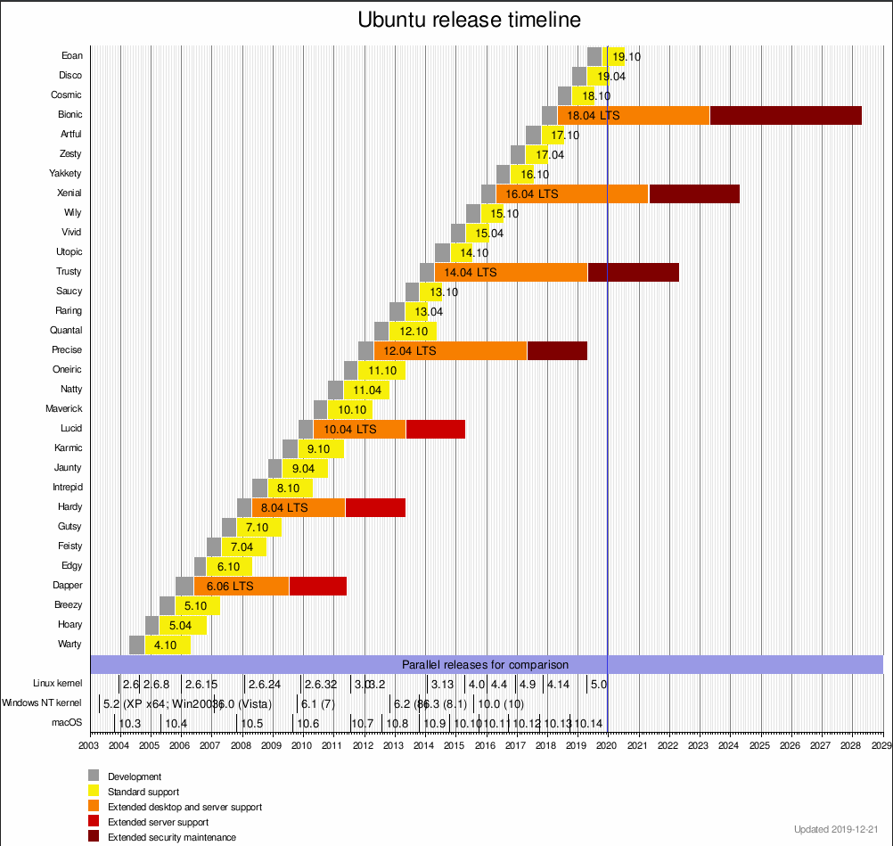
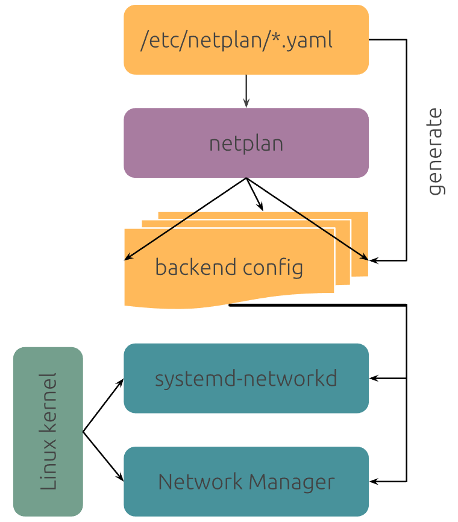
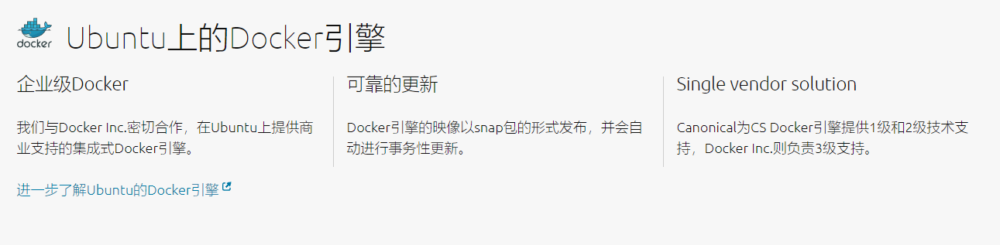

<center><font face="黑体" size=5 color="grey">Ubuntu 介绍和使用</font></center>

# 一.Debian&Ubuntu

Ubuntu 是基于另一个 Linux 发行版 Debian 发展而来，在介绍 Ubuntu 前有必要
了解了解 Debian 的历史。

## 1.1 Debian

Debian 也被称为 Debian GNU/Linux，是众多 Linux 发行版之一。
主要由`Ian Murdock`在 1993 年 8 月 16 号成立的`Debian Project`
开发，Debian 的名字是由 Ian Murdock 和他的爱妻 Debra 两⼈
的名字组合⽽成。


Debian 是由⼤约⼀千个分布在世界各地的开发者⽆偿地利⽤他们的业余
时间开发的，⽽这些开发者实际上⼤部分都没⻅过⾯，彼此之间的通讯⼤
多是通过电⼦邮件(lists.debian.org 上的邮件列表)和 IRC(irc.debian.
org 上的#debian 频道）来完成的，⽬前 Debian 提供 59000 多个软
件包的维护与更新。

> [Debian 官⽹](https://www.debian.org/)

> [官⽅镜像地址](https://www.debian.org/mirror/list)

> [清华⼤学下载地址](https://mirrors.tuna.tsinghua.edu.cn/debian-cd/10.1.0-live/amd64/isohybrid/)

### 1.1.1 基于 Debian 的 deepin

deepin：基于 debain 的发⾏版，Deepin 原名 Linux Deepin、deepin os、
深度系统、深度操作系统，在 2014 年 4 ⽉改名 Deepin，由武汉深之度科技有
限公司开发，被誉为“最美国产操作系统”，其以桌⾯应⽤为主的开源 GNU/Linux
操作系统，⽀持笔记本、台式机和⼀体机。

深度操作系统（deepin）是中国第⼀个具备国际影响⼒的 Linux 发⾏版本，截⽌⾄
2019 年 7 ⽉ 25 ⽇，深度操作系统⽀持 33 种语⾔，⽤⼾遍布除了南极洲的其它六⼤洲，
深度桌⾯环境（deepinDDE）和⼤量的应⽤软件被移植到了包括 Fedora、Ubuntu、
Arch 等⼗余个国际 Linux 发⾏版和社区，在开源操作系统统计⽹站 DistroWatch 上，
deepin ⻓期位于世界前⼗。

## 1.2 Ubuntu

- Ubuntu(中文音译：友帮拓、优般图、乌班图)，早期是⼀个开源的 GNU/Linux 操作
  系统，其基于 Debian GNU/Linux，⽀持 x86、amd64（即 x64）和 ppc 架构，由全球化
  的专业开发团队（Canonical Ltd）[^1]打造的，其名称来⾃⾮洲南部祖鲁语或豪萨语的
  "ubuntu"⼀词，类似儒家“仁爱”的思想，意思是“⼈性”、“我的存在是因为⼤家的存在”
  ，是⾮洲传统的⼀种价值观， Ubuntu 基于 Debian 发⾏版和 GNOME 桌⾯环境，⽽从 11.04
  版起，Ubuntu 发 ⾏版放弃了 Gnome 桌⾯环境，改为 Unity，与 Debian 的不同在于它每 6
  个⽉会发布⼀个新版本，Ubuntu 的⽬标在于为⼀般⽤⼾提供⼀个最新的、同时⼜相当稳
  定的主要由⾃由软件构建⽽成的操作系统，Ubuntu 具有庞⼤的社区⼒量，⽤⼾可以⽅便
  地从社区获得帮助，Ubuntu 对 GNU/Linux 的普及特别是桌⾯普及作出了巨⼤贡献，由此
  使更多⼈共享开源的成果与精彩。

- Ubuntu 是各种公有云上最受欢迎的操作系统，这是因为 Ubuntu 与各⼤云运营商密切合作，
  针对云服务商的基础架构优化内核和系统，加快安全更新速度，并最⼤限度降低⽤⼾默认
  需要的⽹络或存储成本。

> [中⽂官⽹](https://cn.ubuntu.com/)

> [英⽂官⽹](https://ubuntu.com/download)

### 1.2.1 Ubuntu Distro

- Ubuntu 没有像其它软件⼀样有 1.0 版本，是因为其第⼀个版本是发布于 2004
  年，所以 Ubuntu 的⽣⽇是 2004 年的 10 ⽉ 20 ⽇。
  -Uubuntu 的版本号有个固定的特征，其使⽤⼀个形容词和⼀个动物名称组成，并且
  形容词和名词的⾸字⺟都是⼀致的，Ubuntu 版本的命名规则是根据正式版发布的
  年⽉命名，Ubuntu 16.04 也就意味着 2016 年 4 ⽉发布的 Ubuntu，研发⼈员与
  ⽤⼾可从版本号码就知道正式发布的时间。
- Ubuntu 每两年的 4 ⽉份，都会推出⼀个⻓期⽀持版本（LTS），其⽀持期⻓达五年，
  ⽽⾮ LTS 版本的⽀持期通常只有半年。

- Ubuntu 历史版本一览
  

- 各个版本支持期一览
  

#### 1.2.1.1 Ubuntu 桌面系统

Ubuntu 作为个⼈电脑既快速⼜安全、开源、免费，有数以千计的应⽤程序可供选择。
从⼯作学习、到娱乐游戏，⽆所不能。

#### 1.2.1.2 基于 Ubuntu 的 Ubuntu kylin

Canonical，⼯业和信息化部软件与集成电路促进中⼼（CSIP）以及国防科学技术⼤学
（NUDT）携⼿打造，⽬前，开发团队正在与开源社区合作打造 Ubuntu 的核⼼功能，以
更好地适应中国⽤⼾，除了 Ubuntu 软件中⼼推出的本⼟化版本以外，优麒麟还带最常
⽤的中⽂程序。

#### 1.2.1.3 基于 Ubuntu 的 Elementary OS

Elementary OS 系统是⼀款基于 Ubuntu 精⼼打磨美化的桌⾯ Linux 发⾏版，号称“最
漂亮的 Linux 系统”，它最早是 Ubuntu 的⼀个美化主题项⽬，后来太受欢迎演变成了独
⽴的发⾏版，Elementary OS 由设计师主导开发，⻛格与 macOS 相似，它借鉴了
ChromeOS 的菜单设计，系统核⼼依然是 Ubuntu 并完全兼容所有 Ubuntu 软件包，
elementary OS 从界⾯外观到系统设计都很精美，视觉效果很好！

#### Ubuntu 其它分支

除了标准 Ubuntu 版本之外，Ubuntu 官⽅还有⼏⼤主要分⽀，分别是 Edubuntu、Kubuntu、
Lubuntu、Mythbuntu、Ubuntu MATE，Ubuntu GNOME、Ubuntu Kylin、Ubuntu Studio
和 Xubuntu。

```ruby
Edubuntu是Ubuntu的教育发⾏版，专注于学校(教育)的需求，是由Ubuntu社区和K12-LTSP社区合作开发的，适合
⼉童、学⽣、教师使⽤的基础发⾏版，其内置了⼤量适合教学的应⽤软件和游戏。
Kubuntu是使⽤KDE桌⾯管理器取代GNOME桌⾯管理器作为其默认的桌⾯管理器的版本。Kubuntu的推出，为喜爱KDE
桌⾯环境的使⽤者的安装和使⽤带来了很⼤的便利。
Lubuntu是⼀个后起之秀，以轻量级桌⾯环境LXDE替代Ubuntu默认的Unity。由于LXDE是⼀个轻量级桌⾯环境，所以
Lubuntu所需的计算机资源很少，⼗分适合追求简洁或速度，以及还在使⽤⽼旧硬件的朋友选⽤。

Mythbuntu是⼀个⽤来实现媒体中⼼的Ubuntu发⾏版本，其核⼼组件是MythTV，所以Mythbuntu可以视为Ubuntu和
MythTV的结合体。

Ubuntu GNOME是采⽤GNOME3作为Ubuntu默认桌⾯管理器的发⾏版本。由于Ubuntu的默认桌⾯环境是Unity，为了
满⾜Linux⽤⼾的不同需求和使⽤习惯，Ubuntu GNOME项⽬应运⽽⽣。

Ubuntu Kylin(优麒麟)是⼀个专⻔为中⽂⽤⼾定制的Ubuntu版本，预置了⼤量中国⽤⼾熟悉的应⽤，是开箱即⽤的
Ubuntu官⽅中国定制版本，适合中国⽤⼾使⽤。

Ubuntu Studio则是--个为专业多媒体制作⽽打造的Ubuntu版本，可以编辑和处理⾳频、视频和图形图像等多媒体⽂
件，对于多媒体专业⼈⼠⽽⾔，是⼀个⻥和熊掌兼得的好选择。

Xubuntu采⽤了⼩巧和⾼效的Xfce作为桌⾯环境，界⾯简约，类似于GNOME2，功能全⾯，系统资源消耗较⼩，是追求
速度和低配置计算机⽤⼾的福⾳，同时也为⽼旧计算机提供了发挥余热的机会
```

### 1.2.2 Ubuntu Server

#### 1.2.2.1 Ubuntu Server 安装过程

长期支持版 Ubuntu Server 1604 与 Ubuntu Server 1804 的一般安装过程
在虚拟机 VMware workstation 15 pro 的安装过程，如下：

`1`.选择安装语言
`2`.选择安装界面的安装 Ubuntu 选项进行安装
如果需要指定内核参数应该按`F6`，比如参数`net.ifnames=0 biosdevname=0`
表示将系统的网卡命名方式该为传统的`ethX`方式。
`3`.选择安装过程中使用的语言
`4`.选择地区
`5`.选择键盘类型
`6`.键盘自动识别(一般选择 no)
`7`.配置主机名
`8`.创建新的普通用户
`9`.确认新账户名称
`10`.设置用户密码
`11`.确认账户密码
`12`.如果密码弱，则会再次提示使用弱密码
`13`.确认时区是否为自动识别的时区
`14`.手动分区
`15`.选择磁盘
`16`.确认需要使用的磁盘
`17`.分区
`18`.创建新分区
`19`.指定分区大小
`20`.选择分区类型
`21`.确认分区情况并写入磁盘
`22`.确认写入磁盘
`23`.是否设置代理
`24`.是否自动更新
`25`.选择安装组件
`26`.写入 grub 引导
`27`.确认安装完成重启系统
`28`.登录，进行进步设置

#### 1.2.2.2 Ubuntu Server 系统基本配置

##### 1.2.2.2.1 更改主机名

```bash
root@ubuntu-suosuoli:~# cat /etc/hostname
ubuntu-suosuoli
```

##### 1.2.2.2.2 更改网卡名为传统的命名方式-ethX

如果没有在安装系统之前传递内核参数将⽹卡名称更改为 ethX，则可以在安装系统之后
使⽤以下⽅式修改：

```bash
# 修改 /etc/default/grub
root@ubuntu-suosuoli:~# cat /etc/default/grub  | grep -w GRUB_CMDLINE_LINUX
GRUB_CMDLINE_LINUX="net.ifnames=0 biosdevname=0"
# 更新grub
root@ubuntu-suosuoli:~# update-grub
# 重启
root@ubuntu-suosuoli:~# reboot
```

##### 1.2.2.2.3 配置允许 root 远程 ssh 登录

默认情况下，ubuntu 不允许 root ⽤⼾远程 ssh，如果有实际场景需要允许 root ⽤⼾远程
登录，则需要设置 root 密码，并且编辑`/etc/ssh/sshd_config` ⽂件修改如下：

```bash
root@ubuntu-suosuoli:~# vim /etc/ssh/sshd_config
32 #PermitRootLogin prohibit-password # 默认为禁⽌登录
 33 PermitRootLogin yes # 改为允许登录

 57 #PasswordAuthentication yes
 58 PasswordAuthentication yes # 打开密码认证，其实默认就是允许通过密码认证登录

stevenux@ubuntu-suosuoli:~$ sudo su - root # 切换到root⽤⼾环境
stevenux@ubuntu-suosuoli:~# passwd  # 设置密码
Enter new UNIX password:
Retype new UNIX password:
passwd: password updated successfully
stevenux@ubuntu-suosuoli:~# systemctl  restart  sshd # 重启ssh服务并测试root⽤⼾远程ssh连接
```

##### 1.2.2.2.4 Ubuntu 网络管理工具

Ubuntu 从 17.10 开始(17.10 前是使用`ifupdown`工具管理配置)，已放弃在
`/etc/network/interfaces` 的配置方式，⽽是改成`netplan` 管理工具，其配置⽂件
主要在：`/etc/netplan/01-netcfg.yaml`

Ubuntu 17.10 及之前的版本配置静态 IP 的方式

```bash
~# cat /etc/network/interfaces
root@stevenux:~# cat /etc/network/interfaces
# interfaces(5) file used by ifup(8) and ifdown(8)
auto lo
iface lo inet loopback

auto eth0 #⽹卡⾃启动，写⾃⼰要配置IP的实际⽹卡名称
iface eth0 inet static #配置静态IP，写⾃⼰要配置IP的实际⽹卡名称
address 172.18.3.12 #IP地址
netmask 255.255.0.0 #掩码
gateway 172.18.0.1 #⽹关
dns-nameservers 223.6.6.6 #DNS
dns-nameservers 223.5.5.5

#重启⽹络服务
~# /etc/init.d/networking  restart
~# systemctl  restart networking.service
```

Ubuntu 17.10 之后的`netplan`工具工作方式如下：
其使用 yaml 文件来记录配置信息，并生成后端网络管理模块能识别的配置文件。
可以使用下面的命令来根据编写的 yaml 文件生成配置文件
`netplan generate`
使用下面的命令来使配置生效
`netplan apply`

`netplan`的 yaml 文件支持下面的后端网络管理模块
: [Systemd-networkd](http://manpages.ubuntu.com/manpages/bionic/man5/systemd.network.5.html)
: [NetworkManager](https://help.ubuntu.com/community/NetworkManager)

Ubuntu 17.10 及其后面的版本默认使用`Systemd-networkd`为后端网络管理模块

下图为 netplan 的大致架构



在使用不同的 Ubuntu 版本时配置文件也会存在差异

| 安装类型    | 网络管理模块     | yaml 配置文件                            |
| ----------- | ---------------- | ---------------------------------------- |
| Server ISO  | systemd-networkd | /etc/netplan/01-netcfg.yaml              |
| Cloud Image | systemd-networkd | /etc/netplan/50-cloud-init.yaml          |
| Desktop ISO | NetworkManager   | /etc/netplan/01-network-manager-all.yaml |

而且 yaml 文件可以存在下面三个地方

- `/run/netplan/*.yaml`
- `/etc/netplan/*.yaml`
- `/lib/netplan/*.yaml`

##### 1.2.2.2.5 Ubuntu 1804 网络配置

###### 单网卡配置静态 IP

```yaml
~#sudo vim /etc/netplan/01-netcfg.yaml
# This file describes the network interfaces available on your system
# For more information, see netplan(5).
network:
  version: 2
  renderer: networkd
  ethernets:
    eth0:
      dhcp4: no
      dhcp6: no
      addresses: [172.18.3.18/16]
      gateway4: 172.18.0.1
      nameservers:
        addresses: [223.6.6.6]

# sudo  netplan apply

# vim ~/.vimrc # 取消vim ⾃动缩进功能
set paste
```

###### 多网卡配置静态 IP

```yaml
~# sudo vim   /etc/netplan/01-netcfg.yaml
# This file describes the network interfaces available on your system
# For more information, see netplan(5).
network:
  version: 2
  renderer: networkd
  ethernets:
    eth0:
      dhcp4: no
      dhcp6: no
      addresses: [172.18.3.18/16]
      gateway4: 172.18.0.1
      nameservers:
        addresses: [223.6.6.6]
    eth1:
      dhcp4: no
      dhcp6: no
      addresses: [10.20.3.18/16]
      routes:
        - to: 172.20.0.0/16
          via: 10.20.0.1
        - to: 10.20.0.0/16
          via: 10.20.0.1
        - to: 10.2.0.0/16
          via: 10.20.0.1
        - to: 10.8.0.0/16
          via: 10.20.0.1

~# sudo netplan apply
```

###### 单网卡桥接

```yaml
~# sudo cat   /etc/netplan/01-netcfg.yaml
# This file describes the network interfaces available on your system
# For more information, see netplan(5).
network:
  version: 2
  renderer: networkd
  ethernets:
    eth0:
      dhcp4: no
      dhcp6: no

  bridges:
    br0:
     dhcp4: no
     dhcp6: no
     addresses: [172.18.3.18/16]
     gateway4: 172.18.0.1
     nameservers:
       addresses: [223.6.6.6]
     interfaces:
       - eth0

~# sudo netplan apply
```

###### 多网卡桥接

将 br0 和 br1 分别桥接到 eth0 和 eth1

```yaml
~# sudo cat   /etc/netplan/01-netcfg.yaml
# This file describes the network interfaces available on your system
# For more information, see netplan(5).
network:
  version: 2
  renderer: networkd
  ethernets:
    eth0:
      dhcp4: no
      dhcp6: no
    eth1:
      dhcp4: no
      dhcp6: no

  bridges:
    br0:
     dhcp4: no
     dhcp6: no
     addresses: [172.18.3.18/16]
     gateway4: 172.18.0.1
     nameservers:
       addresses: [223.6.6.6]
     interfaces:
       - eth0
    br1:
     dhcp4: no
     dhcp6: no
     addresses: [10.20.3.18/16]
     routes:
       - to: 172.20.0.0/16
         via: 10.20.0.1
       - to: 10.20.0.0/16
         via: 10.20.0.1
       - to: 10.2.0.0/16
         via: 10.20.0.1
       - to: 10.8.0.0/16
         via: 10.20.0.1
     interfaces:
       - eth1
```

###### 双网卡绑定

七种 bond 模式说明：

```bash
第⼀种模式：mod=0，即：(balance-rr) Round-robin policy（平衡抡循环策略）
特点：传输数据包顺序是依次传输（即：第1个包⾛eth0，下⼀个包就⾛eth1….⼀直循环下去，直到最后⼀个传输完
毕），此模式提供负载平衡和容错能⼒。

第⼆种模式：mod=1，即： (active-backup) Active-backup policy（主-备份策略）
特点：只有⼀个设备处于活动状态，当⼀个宕掉另⼀个⻢上由备份转换为主设备。mac地址是外部可⻅得，从外⾯看
来，bond的MAC地址是唯⼀的，以避免switch(交换机)发⽣混乱。此模式只提供了容错能⼒；由此可⻅此算法的优点
是可以提供⾼⽹络连接的可⽤性，但是它的资源利⽤率较低，只有⼀个接⼝处于⼯作状态，在有 N 个⽹络接⼝的情况
下，资源利⽤率为1/N。

第三种模式：mod=2，即：(balance-xor) XOR policy（平衡策略）
特点：基于指定的传输HASH策略传输数据包。缺省的策略是：(源MAC地址 XOR ⽬标MAC地址) % slave数量。其他
的传输策略可以通过xmit_hash_policy选项指定，此模式提供负载平衡和容错能⼒。

第四种模式：mod=3，即：broadcast（⼴播策略）
特点：在每个slave接⼝上传输每个数据包，此模式提供了容错能⼒。

第五种模式：mod=4，即：(802.3ad) IEEE 802.3adDynamic link aggregation（IEEE 802.3ad 动态链接
聚合）
特点：创建⼀个聚合组，它们共享同样的速率和双⼯设定。根据802.3ad规范将多个slave⼯作在同⼀个激活的聚合体
下。
必要条件：
条件1：ethtool⽀持获取每个slave的速率和双⼯设定。
条件2：switch(交换机)⽀持IEEE 802.3ad Dynamic link aggregation。
条件3：⼤多数switch(交换机)需要经过特定配置才能⽀持802.3ad模式。

第六种模式：mod=5，即：(balance-tlb) Adaptive transmit load balancing（适配器传输负载均衡）
特点：不需要任何特别的switch(交换机)⽀持的通道bonding。在每个slave上根据当前的负载（根据速度计算）分
配外出流量。如果正在接受数据的slave出故障了，另⼀个slave接管失败的slave的MAC地址。
该模式的必要条件：
ethtool⽀持获取每个slave的速率

第七种模式：mod=6，即：(balance-alb) Adaptive load balancing（适配器适应性负载均衡）
特点：该模式包含了balance-tlb模式，同时加上针对IPV4流量的接收负载均衡(receive load balance,
rlb)，⽽且不需要任何switch(交换机)的⽀持。
```

ubuntu 18.04 的双⽹卡绑定配置

```yaml
需要提前安装好bridge命令
~# sudo vim  /etc/netplan/01-netcfg.yaml
# This file describes the network interfaces available on your system
# For more information, see netplan(5).
network:
  version: 2
  renderer: networkd
  ethernets:
    eth0:
      dhcp4: no
      dhcp6: no
    eth1:
      dhcp4: no
      dhcp6: no

  bonds:
    bond0:
      interfaces:
        - eth0
        - eth1
      addresses: [172.18.3.18/16]
      gateway4: 172.18.0.1
      nameservers:
        addresses: [223.6.6.6,223.5.5.5]
      parameters:
        mode: active-backup
        mii-monitor-interval: 100

~# sudo netplan apply
```

###### 双网卡绑定加桥接

⽹卡绑定⽤于提供⽹卡接⼝冗余以及⾼可⽤和端⼝聚合功能，桥接⽹卡再给需要桥接设备的服务使⽤

```yaml
~# sudo cat  /etc/netplan/01-netcfg.yaml
# This file describes the network interfaces available on your system
# For more information, see netplan(5).
network:
  version: 2
  renderer: networkd
  ethernets:
    eth0:
      dhcp4: no
      dhcp6: no
    eth1:
      dhcp4: no
      dhcp6: no

  bonds:
    bond0:
      interfaces:
        - eth0
        - eth1
      #addresses: [172.18.3.18/16]
      #gateway4: 172.18.0.1
      #nameservers:
      #  addresses: [223.6.6.6,223.5.5.5]
      parameters:
        mode: active-backup
        mii-monitor-interval: 100

  bridges:
    br0:
    dhcp4: no
     dhcp6: no
     addresses: [172.18.3.18/16]
     gateway4: 172.18.0.1
     nameservers:
       addresses: [223.6.6.6,223.5.5.5]
     interfaces:
       - bond0

~#reboot
```

###### 内外网多网卡绑定

多⽹络情况下实现⽹卡绑定

```yaml
~# sudo cat  /etc/netplan/01-netcfg.yaml
# This file describes the network interfaces available on your system
# For more information, see netplan(5).
network:
  version: 2
  renderer: networkd
  ethernets:
    eth0:
      dhcp4: no
      dhcp6: no
    eth1:
      dhcp4: no
      dhcp6: no
    eth2:
      dhcp4: no
      dhcp6: no
    eth3:
      dhcp4: no
      dhcp6: no

  bonds:
    bond0:
      interfaces:
        - eth0
        - eth1
      addresses: [172.18.3.18/16]
      gateway4: 172.18.0.1
      nameservers:
        addresses: [223.6.6.6,223.5.5.5]
      parameters:
        mode: active-backup
        mii-monitor-interval: 100

    bond1:
      interfaces:
        - eth2
        - eth3
      addresses: [10.20.3.18/16]
       parameters:
        mode: active-backup
        mii-monitor-interval: 100
      routes:
        - to: 172.20.0.0/16
          via: 10.20.0.1
        - to: 10.20.0.0/16
          via: 10.20.0.1
        - to: 10.2.0.0/16
          via: 10.20.0.1
        - to: 10.8.0.0/16
          via: 10.20.0.1
```

###### 内网多网卡绑定加桥接

```yaml
~# sudo cat  /etc/netplan/01-netcfg.yaml
# This file describes the network interfaces available on your system
# For more information, see netplan(5).
network:
  version: 2
  renderer: networkd
  ethernets:
    eth0:
      dhcp4: no
      dhcp6: no
    eth1:
      dhcp4: no
      dhcp6: no
    eth2:
      dhcp4: no
      dhcp6: no
    eth3:
      dhcp4: no
      dhcp6: no

  bonds:
    bond0:
      interfaces:
        - eth0
        - eth1
      parameters:
        mode: active-backup
        mii-monitor-interval: 100

    bond1:
      interfaces:
        - eth2
        - eth3
      parameters:
        mode: active-backup
        mii-monitor-interval: 100

  bridges:
   br0:
     dhcp4: no
     dhcp6: no
     addresses: [172.18.3.18/16]
     gateway4: 172.18.0.1
     nameservers:
       addresses: [223.6.6.6,223.5.5.5]
     interfaces:
       - bond0

    br1:
     dhcp4: no
     dhcp6: no
     interfaces:
       - bond1
     addresses: [10.20.3.18/16]
     routes:
       - to: 172.20.0.0/16
         via: 10.20.0.1
       - to: 10.20.0.0/16
         via: 10.20.0.1
       - to: 10.2.0.0/16
         via: 10.20.0.1
       - to: 10.8.0.0/16
         via: 10.20.0.1
```

### 1.2.3 Ubuntu package management

Ubuntu 使用 `dpkg`包管理工具安装`.deb`包。前端使用`apt`安装和管理软件

#### 1.2.3.1 修改软件源为国内的镜像源

在文件`/etc/apt/sources.list`配置 source 源

```bash
root@ubuntu-suosuoli:~# cat /etc/apt/sources.list
deb http://mirrors.aliyun.com/ubuntu/ bionic main restricted universe multiverse
deb-src http://mirrors.aliyun.com/ubuntu/ bionic main restricted universe multiverse

deb http://mirrors.aliyun.com/ubuntu/ bionic-security main restricted universe multiverse
deb-src http://mirrors.aliyun.com/ubuntu/ bionic-security main restricted universe multiverse

deb http://mirrors.aliyun.com/ubuntu/ bionic-updates main restricted universe multiverse
deb-src http://mirrors.aliyun.com/ubuntu/ bionic-updates main restricted universe multiverse

deb http://mirrors.aliyun.com/ubuntu/ bionic-proposed main restricted universe multiverse
deb-src http://mirrors.aliyun.com/ubuntu/ bionic-proposed main restricted universe multiverse

deb http://mirrors.aliyun.com/ubuntu/ bionic-backports main restricted universe multiverse
deb-src http://mirrors.aliyun.com/ubuntu/ bionic-backports main restricted universe multiverse

deb https://mirrors.tuna.tsinghua.edu.cn/ubuntu/ bionic main restricted universe multiverse
# deb-src https://mirrors.tuna.tsinghua.edu.cn/ubuntu/ bionic main restricted universe multiverse
deb https://mirrors.tuna.tsinghua.edu.cn/ubuntu/ bionic-updates main restricted universe multiverse
# deb-src https://mirrors.tuna.tsinghua.edu.cn/ubuntu/ bionic-updates main restricted universe multiverse
deb https://mirrors.tuna.tsinghua.edu.cn/ubuntu/ bionic-backports main restricted universe multiverse
# deb-src https://mirrors.tuna.tsinghua.edu.cn/ubuntu/ bionic-backports main restricted universe multiverse
deb https://mirrors.tuna.tsinghua.edu.cn/ubuntu/ bionic-security main restricted universe multiverse
# deb-src https://mirrors.tuna.tsinghua.edu.cn/ubuntu/ bionic-security main restricted universe multiverse
```

各大软件源

: [阿⾥云仓库地址](https://opsx.alibaba.com/mirror)
: [中科⼤](http//mirrors.ustc.edu.cn/help/ubuntu.html)
: [清华⼤学](https://mirror.tuna.tsinghua.edu.cn/help/ubuntu/)
: [华为](https://mirrors.huaweicloud.com/)

`apt/apt-get`用法，`apt-get`为老式用法，官方建议以后直接使用`apt`命令

```bash
apt list #apt列出仓库软件包，等于yum list
apt search NAME #搜索安装包
apt show apache2 #查看某个安装包的详细信息
apt install apache2 #在线安装软件包
apt remove apache2 #卸载单个软件包但是保留配置⽂件
apt autoremove apache2 #删除安装包并解决依赖关系
apt update  #更新本地软件包列表索引，修改了apt仓库后必须执⾏
apt purge  apache2 #卸载单个软件包删除配置⽂件
apt upgrade #升级所有已安装且可升级到新版本的软件包
apt full-upgrade #升级整个系统，必要时可以移除旧软件包。
apt  edit-sources  #编辑source源⽂件
apt-cache  madison  nginx #查看仓库中软件包有哪些版本可以安装
apt install  nginx=1.14.0-0ubuntu1.6 #安装软件包的时候指定安装具体的版本
```

#### 1.2.3.2 设置 oracle JDK 环境

```bash
# pwd
/usr/local/src

解压⼆进制⽂件并设置软连接：
# tar xf jdk-8u212-linux-x64.tar.gz
# ln -sv  /usr/local/src/jdk1.8.0_212 /usr/local/jdk

配置环境变量：
# vim /etc/profile
export JAVA_HOME=/usr/local/jdk
export PATH=$JAVA_HOME/bin:$JAVA_HOME/jre/bin:$PATH
export CLASSPATH=.$CLASSPATH:$JAVA_HOME/lib:$JAVA_HOME/jre/lib:$JAVA_HOME/lib/tools.jar

重新导⼊环境变量并验证：
# source  /etc/profile
# java -version
java version "1.8.0_212"
Java(TM) SE Runtime Environment (build 1.8.0_212-b10)
Java HotSpot(TM) 64-Bit Server VM (build 25.212-b10, mixed mode)

# 安装OpenJDK
apt  install openjdk-8-jdk
```

#### 1.2.3.3 安装系统常用命令

```bash
# apt  purge ufw lxd lxd-client lxcfs lxc-common
# apt  install iproute2  ntpdate  tcpdump telnet traceroute nfs-kernel-server nfs-common \
lrzsz tree  openssl libssl-dev libpcre3 libpcre3-dev zlib1g-dev ntpdate tcpdump telnet \
traceroute  gcc openssh-server lrzsz tree  openssl libssl-dev libpcre3 libpcre3-dev \
zlib1g-dev ntpdate tcpdump telnet traceroute iotop unzip zip
```

#### 1.2.3.4 优化系统资源限制参考

```bash
#cat  /etc/security/limits.conf
# root账⼾的资源软限制和硬限制
root                soft    core            unlimited
root                hard    core            unlimited
root                soft    nproc           1000000
root                hard    nproc           1000000
root                soft    nofile          1000000
root                hard    nofile          1000000
root                soft    memlock         32000
root                hard    memlock         32000
root                soft    msgqueue        8192000
root                hard    msgqueue        8192000

# 其他账⼾的资源软限制和硬限制
*                soft    core            unlimited
*                hard    core            unlimited
*                soft    nproc           1000000
*                hard    nproc           1000000
*                soft    nofile          1000000
*                hard    nofile          1000000
*                soft    memlock         32000
*                hard    memlock         32000
*                soft    msgqueue        8192000
*                hard    msgqueue        8192000
```

#### 1.2.3.5 内核参数优化参考

```bash
# Controls source route verification
net.ipv4.conf.default.rp_filter = 1
net.ipv4.ip_nonlocal_bind = 1
net.ipv4.ip_forward = 1

# Do not accept source routing
net.ipv4.conf.default.accept_source_route = 0

# Controls the System Request debugging functionality of the kernel
kernel.sysrq = 0

# Controls whether core dumps will append the PID to the core filename.
# Useful for debugging multi-threaded applications.
kernel.core_uses_pid = 1

# Controls the use of TCP syncookies
net.ipv4.tcp_syncookies = 1

# Disable netfilter on bridges.
net.bridge.bridge-nf-call-ip6tables = 0
net.bridge.bridge-nf-call-iptables = 0
net.bridge.bridge-nf-call-arptables = 0

# Controls the default maxmimum size of a mesage queue
kernel.msgmnb = 65536

# # Controls the maximum size of a message, in bytes
kernel.msgmax = 65536

# Controls the maximum shared segment size, in bytes
kernel.shmmax = 68719476736

# # Controls the maximum number of shared memory segments, in pages
kernel.shmall = 4294967296

# TCP kernel paramater
net.ipv4.tcp_mem = 786432 1048576 1572864
net.ipv4.tcp_rmem = 4096        87380   4194304
net.ipv4.tcp_wmem = 4096        16384   4194304
net.ipv4.tcp_window_scaling = 1
net.ipv4.tcp_sack = 1

# socket buffer
net.core.wmem_default = 8388608
net.core.rmem_default = 8388608
net.core.rmem_max = 16777216
net.core.wmem_max = 16777216
net.core.netdev_max_backlog = 262144
net.core.somaxconn = 20480
net.core.optmem_max = 81920

# TCP conn
net.ipv4.tcp_max_syn_backlog = 262144
net.ipv4.tcp_syn_retries = 3
net.ipv4.tcp_retries1 = 3
net.ipv4.tcp_retries2 = 15

# tcp conn reuse
net.ipv4.tcp_timestamps = 0
net.ipv4.tcp_tw_reuse = 0
net.ipv4.tcp_tw_recycle = 0
net.ipv4.tcp_fin_timeout = 1


net.ipv4.tcp_max_tw_buckets = 20000
net.ipv4.tcp_max_orphans = 3276800
net.ipv4.tcp_synack_retries = 1
net.ipv4.tcp_syncookies = 1

# keepalive conn
net.ipv4.tcp_keepalive_time = 300
net.ipv4.tcp_keepalive_intvl = 30
net.ipv4.tcp_keepalive_probes = 3
net.ipv4.ip_local_port_range = 10001    65000

# swap
vm.overcommit_memory = 0
vm.swappiness = 10

#net.ipv4.conf.eth1.rp_filter = 0
#net.ipv4.conf.lo.arp_ignore = 1
#net.ipv4.conf.lo.arp_announce = 2
#net.ipv4.conf.all.arp_ignore = 1
#net.ipv4.conf.all.arp_announce = 2
```

#### 1.2.3.6 dpkg 包管理器

- rpm：RPM(Red Hat Package Manager)，是基于 Red hat 的 Linux Distribution
  的包管理系统，同时也指 rpm 包本⾝，RPM ⽤于 rpm 包的管理（诸如安装、卸载、
  升级等）
- "dpkg "是"Debian Packager "的简写,为 "Debian"专⻔开发的套件管理系统，⽅便
  软件的安装、更新及移除。所有源⾃“Debian”的“Linux ”发⾏版都使⽤ “dpkg”，
  例如 “Ubuntu”、“Knoppix ”等。

- `rpm` 和 `yum` 的关系类似 `dpkg` 和 `apt` 的关系

- dpkg 常用命令

```bash
dpkg -i gitlab-ce_11.9.8-ce.0_amd64.deb #安装某个软件包
dpkg -r gitlab-ce #删除某个软件包保留配置⽂件
dpkg -r -P gitlab-ce #删除某个软件包不保留配置⽂件
dpkg -I gitlab-ce_11.9.8-ce.0_amd64.deb #查看软件包信息
dpkg -c gitlab-ce_11.9.8-ce.0_amd64.deb  #查看软件包内的⽂件及⽬录内容
dpkg -l #列出本机已经安装的所有软件
```

#### 1.2.3.7 apt 安装 nginx 的示例

```bash
# 查看目前源包括哪些版本的nginx
root@ubuntu-suosuoli:~# apt-cache madison nginx
     nginx | 1.14.0-0ubuntu1.6 | http://mirrors.aliyun.com/ubuntu bionic-security/main amd64 Packages
     nginx | 1.14.0-0ubuntu1.6 | http://mirrors.aliyun.com/ubuntu bionic-security/main i386 Packages
     nginx | 1.14.0-0ubuntu1.6 | http://mirrors.aliyun.com/ubuntu bionic-updates/main amd64 Packages
     nginx | 1.14.0-0ubuntu1.6 | http://mirrors.aliyun.com/ubuntu bionic-updates/main i386 Packages
     nginx | 1.14.0-0ubuntu1.6 | https://mirrors.tuna.tsinghua.edu.cn/ubuntu bionic-updates/main amd64 Packages
     nginx | 1.14.0-0ubuntu1.6 | https://mirrors.tuna.tsinghua.edu.cn/ubuntu bionic-updates/main i386 Packages
     nginx | 1.14.0-0ubuntu1.6 | https://mirrors.tuna.tsinghua.edu.cn/ubuntu bionic-security/main amd64 Packages
     nginx | 1.14.0-0ubuntu1.6 | https://mirrors.tuna.tsinghua.edu.cn/ubuntu bionic-security/main i386 Packages
     nginx | 1.14.0-0ubuntu1 | http://mirrors.aliyun.com/ubuntu bionic/main amd64 Packages
     nginx | 1.14.0-0ubuntu1 | http://mirrors.aliyun.com/ubuntu bionic/main i386 Packages
     nginx | 1.14.0-0ubuntu1 | https://mirrors.tuna.tsinghua.edu.cn/ubuntu bionic/main amd64 Packages
     nginx | 1.14.0-0ubuntu1 | https://mirrors.tuna.tsinghua.edu.cn/ubuntu bionic/main i386 Packages
     nginx | 1.14.0-0ubuntu1 | http://mirrors.aliyun.com/ubuntu bionic/main Sources
     nginx | 1.14.0-0ubuntu1.6 | http://mirrors.aliyun.com/ubuntu bionic-security/main Sources
     nginx | 1.14.0-0ubuntu1.6 | http://mirrors.aliyun.com/ubuntu bionic-updates/main Sources
# 挑选需要的版本安装(第一个和第二个|之间)
root@ubuntu-suosuoli:~# apt install nginx=1.14.0-0ubuntu1.6
# 启动
root@ubuntu-suosuoli:~# systemctl start nginx
```

# 二.Ubuntu application

## 2.1 Ubuntu and Cloud

目前 Ubuntu 被认为是云计算的首选操作系统，Ubuntu 是目前生产环境使用的
大多数 OpenStack 云的首选平台，并且有 Canonical 为全球众多领先公司提供
咨询、培训、支持和完全托管的云服务。
ubuntu 在私有云环境⼤量在 openstack、容器与 kubernetes 环境使⽤。

> [Ubuntu 中国站点](https://cn.ubuntu.com/cloud)

Ubuntu 是各种公有云上最受欢迎的操作系统，这是因为我们与各⼤云运营商密切
合作，针对他们的基础架构优化内核和系统，加快安全更新速度，并最⼤限度降
低⽤⼾默认需要的⽹络或存储成本。

## 2.2 Ubuntu and Container

Ubuntu 是容器的首选平台，从 LXD 到 Kubernetes 再到 Docker。Canonical
与行业领先的公司合作，提供全方位的技术和服务，帮助用户在公有云、私有云和
混合云或裸机云上大规模运行容器。

> [Ubuntu 中国站点](https://cn.ubuntu.com/containers)




# 三.Ubuntu Desktop

## 3.1 installation

Ubuntu 桌面版安装过程为图形界面，比较直观

## 3.2 Basic conf

安装好后的基本配置包括如下

```bash
1、设置软件源及安装常⽤命令：
https://mirrors.aliyun.com/

sudo apt-get install build-essential cmake pkg-config qt4-qmake libqt4-dev desktop-file-utils \
libavformat-dev libavcodec-dev libavutil-dev libswscale-dev libasound2-dev libpulse-dev libjack-jackd2-dev \
libgl1-mesa-dev libglu1-mesa-dev libx11-dev libxfixes-dev libxext-dev libxi-dev libxinerama-dev

2、系统更新及配置中⽂语⾔环境：

3、安装搜狗拼⾳输⼊法
https://pinyin.sogou.com/linux/?r=pinyin

4、安装转码器ffmpeg：
多媒体视频处理⼯具FFmpeg有⾮常强⼤的功能包括视频采集功能、视频格式转换、视频抓图、给视频加⽔印等。
sudo apt-get install ffmpeg

5、安装视频播放器： smplayer https://www.jianshu.com/p/f24252c632d0
sudo apt-get install smplayer

6、办公软件WPS：
https://www.wps.cn/product/wpslinux

7、单机VNC⼯具:
x11vnc server

8、RealVNC v6.6：
⽀持多个⽤⼾同时连接
https://www.realvnc.com/en/connect/download/vnc/linux/

9、⽂本编辑器：
visual studio code

10、markdown⼯具：
https://www.typora.io/#linux
sudo apt-get install typora=0.9.60-1

11、Ubuntu 桌⾯3D特效：
sudo apt-get install compiz-plugins  compizconfig-settings-manager

12、左侧菜单在底栏显⽰：
~$ gsettings set com.canonical.Unity.Launcher launcher-position Bottom

13、VMware workstion桥接⽹卡设置
https://kb.vmware.com/s/article/287?lang=zh_CN
chmod a+rw /dev/vmnet0 #解决⽹卡桥接不通问题

14、远程⼯具:
SecureCRT

15、python开发：
pycharm

16、java开发：
Eclipse
Intellij IDEA
```

## 脚注

[^1]: Canonical 公司是⼀个私营公司，由南⾮的企业家⻢克·沙特尔沃思(Mark Shuttleworth)创建，主要为了促进开源软件项⽬，Canonical 在⻢恩岛登记注册，其雇员分布在世界各地，其主要办事处在伦敦，在蒙特利尔也有办事处，Canonical 公司⽀持并创建了⼏个项⽬，主要都是⾃由/开源软件（FOSS）或是⼀些旨在改善⾃由软件开发者和贡献者的⼯具。http://www.techweb.com.cn/business/2013-08-20/1318187.shtml ；；；；ubuntu 公司⽬前并未实现盈利
