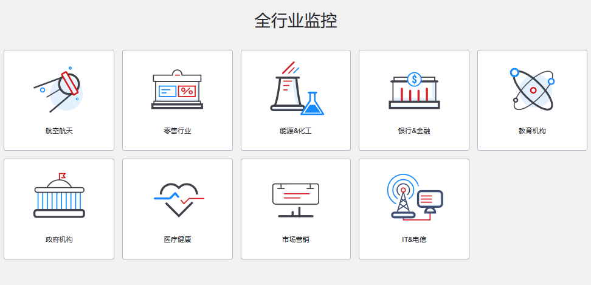

# 一. 什么是监控?

对于传统意义的监控来说，监控系统属于安防系统中应用最多的系统之一，主要是
用来监控异常和不好的事情发生，或者提供事件发生过程的记录和事后分析等功能。
如视频监控系统就是典型的监控系统，视频监控系统就从早期的 CCTV 发展到 DVR
到目前已经发展为基于 IP 网络的视频监控 IPVS。

对于 IT 基础设施的监控来说，则是监控 IT 基础设施的各种状态，以确保 IT 设施
能够不间断的提供服务。在整个 IT 自动化运维体系中，监控是非常重要的一环。监
控可以实现在事前及时预警发现故障，事后提供详实的数据用于追查定位问题。

## 1.1 监控要实现的目标

1. 数据的实时性：要求监控系统对 IT 设施和系统进行不间断的实时监控并返回接近
   实时的监控数据；

2. 直观的实时的反馈各被监控项的值：在进行监控某个硬件、或者某个系统时，必须
   能够实时得到其状态(正常、故障、报警、宕机等)。

3. 保证服务可靠性和安全性：在未增加监控的基础上不能降低系统和服务的可用性和
   安全性，而是提高其可用性和稳定性。

4. 故障自治愈：在监控系统检测到某个故障后应当能够完成基础的补救工作。

5. 远程消息通知能力：监控系统在检测到某些异常是应该能够及时通知运维人员。

## 1.2 监控使用的方法

1. 首先要了解被监控对象的属性：比如获取 Linux 系统的进程属性、磁盘空间如何获取、
   如何得到原始的网络流量数据等。

2. 确定监控项的基准指标：监控的事物的属性比如: CPU 的占用、过去 5 分钟 10 分钟
   15 分钟的平均负载、内存空闲页数等。

3. 触发报警的阈值定义：如 CPU 的负载多高触发报警，空闲内存剩余多少会触发报警等。

4. 故障处理流程：收到了故障报警，我们怎么处理呢？有什么更高效的处理流程吗？

## 1.3 监控的核心-故障

监控系统是结合业务类型围绕故障和问题来构建的，业务或者 IT 设施故障和问题
是监控的核心。在监控系统触发报警后(**发现问题**)，一般会发送邮件或者短信通知相
应的运维人员，此时应当仔细查看报警信息，**定位问题**点。在确定问题位置和问题的
严重级别后，要根据流程来解决该问题，按照问题的优先级别**解决问题**。解决问题后
需要时候复盘，对故障原因及防护措施进行总结，形成相应的文档备份。

# 二. 常见监控方案

生产使用的监控解决方案既有商业解决方案，也有开源解决方案。目前监控领域有很多不
错的开源产品可供选择。选择一款开源的监控系统，是一个比价低成本和高效的方案。常
见的开源监控软件:

- zabbix
- open-falcon
- cacti
- nagios
- smokeping

常见的商业监控软件:

- 监控宝
- 监控易
- 听云

## 2.1 开源监控方案

### 2.1.1 Cacti

Cacti 是基于 LAMP 平台展现的网络流量监测及分析工具，通过 SNMP 技术或
自定义脚本从目标设备/主机获取监控指标信息；其次进行数据存储，调用模板
将数据存到数据库，使用 rrdtool 存储和更新数据，通过 rrdtool 绘制结果
图形；最后进行数据展现，通过 Web 方式将监控结果呈现出来，常用于在数据
中心监控网络设备。

[Cacti-官网](https://www.cacti.net/)

[Cacti-Github 项目地址](https://github.com/Cacti/cacti)

### 2.1.2 Nagios

Nagios 用来监视系统和网络的开源应用软件，利用其众多的插件实现对本机和远
端服务的监控，当被监控对象发生异常时，会及时向管理员告警，提供一批预设好
的监控插件，用户可以之间调用，也可以自定义 Shell 脚本来监控服务，适合各
企业的业务监控，可通过 Web 页面显示对象状态、日志、告警信息，分层告警机
制及自定义监控相对薄弱。

[nagios-官网](https://www.nagios.org/)

### 2.1.3 SmokePing

Smokeping 是一款用于网络性能监测的开源监控软件，主要用于对 IDC 的网络
状况，网络质量，稳定性等做检测，通过 rrdtool 制图方式，图形化地展示网
络的时延情况，进而能够清楚的判断出网络的即时通信情况。

[Smokeping-介绍](https://oss.oetiker.ch/smokeping/)
[Centos 7.2 安装 smokeping 2.6.11](http://blogs.studylinux.net/?p=794)

### 2.1.4 Open-falcon

小米公司开源出来的监控软件 open-falcon(猎鹰)，监控能力和性能较强。

[open-falcon-官网](https://www.open-falcon.org/)
[open-falcon-Github 项目地址](https://github.com/XiaoMi/open-falcon)

### 2.1.5 Zabbix

目前使用较多的开源监控软件，可横向扩展、自定义监控项、支持多种监控方式、可监
控网络与服务等，很多大中小型互联网公司都使用 zabbix 作为监控解决方案。

[Zabbix-官网](https://www.zabbix.com/cn/)

### 2.1.6 Prometheus

针对容器环境进行监控的开源监控软件。

## 2.2 商业监控方案

### 2.2.1 监控宝

[监控宝官网](https://www.jiankongbao.com/)

### 2.2.2 监控易

https://www.jiankongyi.com/

### 2.2.3 听云

[听云官网](https://www.tingyun.com/)

# 三. Zabbix 介绍

## 3.1 Zabbix 简介

Zabbix 是一个企业级分布式开源监控解决方案。

Zabbix 由 Alexei Vladishev 创建，目前由其成立的公司—— Zabbix SIA
积极的持续开发更新维护， 并为用户提供技术支持服务。

Zabbix 软件能够监控众多网络参数和服务器的健康度、完整性。Zabbix 使用
灵活的告警机制，允许用户为几乎任何事件配置基于邮件的告警。这样用户可以
快速响应服务器问题。Zabbix 基于存储的数据提供出色的报表和数据可视化功
能。这些功能使得 Zabbix 成为容量规划的理想选择。Zabbix 支持主动轮询
(polling)和被动捕获(trapping)。Zabbix 所有的报表、统计数据和配置参数
都可以通过基于 Web 的前端页面进行访问。基于 Web 的前端页面确保您可以在
任何地方访问您监控的网络状态和服务器健康状况。适当的配置后，Zabbix 可以
在监控 IT 基础设施方面发挥重要作用。无论是对于有少量服务器的小型组织，
还是拥有大量服务器的大企业而言，同样适用。

Zabbix 是免费的。Zabbix 是根据 GPL 通用公共许可证的第二版编写和发布的。
这意味着产品源代码是免费发布的，可供公共使用。

## 3.2 Zabbix 使用场景

Zabbix 的使用场景非常广泛，包括网络监控、服务器监控、云监控、web 监控等等。

