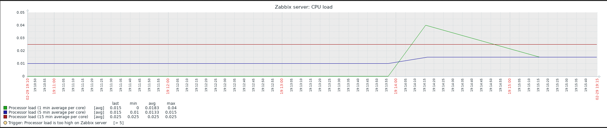

# 一. apt/yum 安装 Zabbix

## 1.1 Zabbix-server 安装配置

### 1.1.1 准备数据库

```bash
[root@mysql-master ~]# mysql -uroot -p
Enter password:
Welcome to the MariaDB monitor.  Commands end with ; or \g.
Your MariaDB connection id is 22090
Server version: 5.5.64-MariaDB MariaDB Server

Copyright (c) 2000, 2018, Oracle, MariaDB Corporation Ab and others.

Type 'help;' or '\h' for help. Type '\c' to clear the current input statement.

# 创建数据库
MariaDB [(none)]> CREATE DATABASE zabbix_server CHARACTER SET UTF8 COLLATE UTF8_BIN;
Query OK, 0 rows affected (0.01 sec)

# 创建用户并授权，该用户为server和web界面用于访问数据库
MariaDB [(none)]> GRANT ALL PRIVILEGES ON zabbix_server.* TO zabbix@'192.168.100.%' IDENTIFIED BY 'stevenux';
Query OK, 0 rows affected (0.00 sec)

MariaDB [(none)]> FLUSH PRIVILEGES;
Query OK, 0 rows affected (0.01 sec)

MariaDB [(none)]>
```

### 1.1.2 导入数据

```bash
root@ubuntu-zabbix-server:~# zcat /usr/share/doc/zabbix-server-mysql/create.sql.gz | mysql -uzabbix -p -h192.168.100.16 zabbix_server
root@ubuntu-zabbix-server:~#
```

### 1.1.3 数据库是否有表生成

```bash
root@ubuntu-zabbix-server:~# mysql -uzabbix -p -h192.168.100.16
Enter password:
Welcome to the MariaDB monitor.  Commands end with ; or \g.
Your MariaDB connection id is 22089
Server version: 5.5.64-MariaDB MariaDB Server

Copyright (c) 2000, 2018, Oracle, MariaDB Corporation Ab and others.

Type 'help;' or '\h' for help. Type '\c' to clear the current input statement.

MariaDB [(none)]> show databases;
+--------------------+
| Database           |
+--------------------+
| information_schema |
| zabbix_server      |
+--------------------+
2 rows in set (0.00 sec)

MariaDB [(none)]> use zabbix_server;
Reading table information for completion of table and column names
You can turn off this feature to get a quicker startup with -A

Database changed
MariaDB [zabbix_server]> show tables;
+----------------------------+
| Tables_in_zabbix_server    |
+----------------------------+
| acknowledges               |
| actions                    |
| alerts                     |
| application_discovery      |
| application_prototype      |
| application_template       |
| applications               |
| auditlog                   |
| auditlog_details           |
| autoreg_host               |
| conditions                 |
......
```

### 1.1.4 编辑 zabbix-server 配置文件

```bash
root@ubuntu-zabbix-server:~# grep "^[a-Z]" /etc/zabbix/zabbix_server.conf
LogFile=/var/log/zabbix/zabbix_server.log
LogFileSize=0
PidFile=/var/run/zabbix/zabbix_server.pid
SocketDir=/var/run/zabbix
DBHost=192.168.100.16  # 数据库所在地址
DBName=zabbix_server   # 数据库名
DBUser=zabbix          # 数据库用户名
DBPassword=stevenux    # 用户密码
DBPort=3306            # 数据库监听端口
SNMPTrapperFile=/var/log/snmptrap/snmptrap.log
Timeout=4
AlertScriptsPath=/usr/lib/zabbix/alertscripts
ExternalScripts=/usr/lib/zabbix/externalscripts
FpingLocation=/usr/bin/fping
Fping6Location=/usr/bin/fping6
LogSlowQueries=3000
```

### 1.1.5 重启

```bash
root@ubuntu-zabbix-server:~# systemctl restart zabbix-server.service
```

## 1.2 web 界面安装过程：

1. 欢迎界面

   

2. 检查预先设置，出现时区错误

   

   解决该报警:

   ```bash
   root@ubuntu-zabbix-server:~# vim /etc/zabbix/apache.conf
   ...
   # php_value date.timezone Europe/Riga
     php_value date.timezone Asia/Shanghai
    ...
    root@ubuntu-zabbix-server:~# systemctl restart zabbix-server zabbix-agent apache2
   root@ubuntu-zabbix-server:~# systemctl enable zabbix-server zabbix-agent apache2
   Synchronizing state of zabbix-server.service with SysV service script with /lib/systemd/systemd-sysv-install.
   Executing: /lib/systemd/systemd-sysv-install enable zabbix-server
   Synchronizing state of zabbix-agent.service with SysV service script with /lib/systemd/systemd-sysv-install.
   Executing: /lib/systemd/systemd-sysv-install enable zabbix-agent
   Synchronizing state of apache2.service with SysV service script with /lib/systemd/systemd-sysv-install.
   Executing: /lib/systemd/systemd-sysv-install enable apache2
   ```

   刷新:
   

3. 连接数据库配置

   

   红框从上到下:数据库所在主机 IP、数据库监听端口、数据库名、该库可访问的用户、密码。

4. Zabbix 主服务所在主机信息

   
   红框从上到下:服务器 IP、Zabbix 监听端口、取个名字

5. 概要信息，最后确认
   

6. OK
   

7. Login
   

8. 主界面
   

# 二. Ubuntu 1804/Centos 7 编译安装 Zabbix

[Zabbix 源码包下载地址](https://jaist.dl.sourceforge.net/project/zabbix/ZABBIX%20Latest%20Stable/)

## 2.1 解决依赖包

### Centos 7

```bash
yum install gcc  libxml2-devel   net-snmp net-snmp-devel   curl  curl-devel
php  php-bcmath  php-mbstring mariadb mariadb-devel
```

### Ubuntu 1804

```bash
~$ apt update
~$ apt-get  install   apache2 apache2-bin apache2-data apache2-utils fontconfig-
config fonts-dejavu-core fping libapache2-mod-php   libapache2-mod-php7.2
libapr1 libaprutil1 libaprutil1-dbd-sqlite3 libaprutil1-ldap libfontconfig1
libgd3 libiksemel3   libjbig0 libjpeg-turbo8 libjpeg8 liblua5.2-0 libodbc1
libopenipmi0 libsensors4 libsnmp-base libsnmp30 libsodium23 libssh2-1  libtiff5
libwebp6 libxpm4 php-bcmath php-common php-gd php-ldap php-mbstring php-mysql
php-xml php7.2-bcmath php7.2-cli  php7.2-common php7.2-gd php7.2-json php7.2-
ldap php7.2-mbstring php7.2-mysql php7.2-opcache php7.2-readline   php7.2-xml
snmpd  ssl-cert ttf-dejavu-core      libmysqlclient-dev  libxml2-dev  libxml2
snmp  libsnmp-dev   libevent-dev  openjdk-8-jdk curl libcurl4-openssl-dev
```

## 2.2 创建用户和组

```bash
[root@zabbix-server1 zabbix-4.0.15]# groupadd -g 2020 zabbix
[root@zabbix-server1 zabbix-4.0.15]# useradd -u 2020 -g 2020 zabbix
[root@zabbix-server1 zabbix-4.0.15]#
[root@zabbix-server1 zabbix-4.0.15]# id zabbix
uid=2020(zabbix) gid=2020(zabbix) groups=2020(zabbix)
[root@zabbix-server1 zabbix-4.0.15]#
```

## 2.3 编译

```bash
[root@zabbix-server1 zabbix-4.0.15]# pwd
/usr/local/src/zabbix-4.0.15
[root@zabbix-server1 zabbix-4.0.15]# ./configure --prefix=/apps/zabbix_server  --enable-server --enable-agent --with-mysql  --with-net-snmp --with-libcurl --with-libxml2  --enable-java
...
configure: error: MySQL library not found  ## 安装mysql-devel包(Ubuntu 安装libmysql-dev)

[root@zabbix-server1 zabbix-4.0.15]# yum install mysql-devel -y
[root@zabbix-server1 zabbix-4.0.15]# ./configure --prefix=/apps/zabbix_server  --enable-server --enable-agent --with-mysql  --with-net-snmp --with-libcurl --with-libxml2  --enable-java
configure: error: Invalid Net-SNMP directory - unable to find net-snmp-config ## 安装net-snmp-devel包
...

[root@zabbix-server1 zabbix-4.0.15]# yum install -y net-snmp-devel
[root@zabbix-server1 zabbix-4.0.15]# ./configure --prefix=/apps/zabbix_server  --enable-server --enable-agent --with-mysql  --with-net-snmp --with-libcurl --with-libxml2  --enable-java
...
checking for javac... no

configure: error: Unable to find "javac" executable in path
...

# 安装java-1.8.0-openjdk-devel
[root@zabbix-server1 zabbix-4.0.15]# yum install java-1.8.0-openjdk-devel
[root@zabbix-server1 zabbix-4.0.15]# ./configure --prefix=/apps/zabbix_server  --enable-server --enable-agent --with-mysql  --with-net-snmp --with-libcurl --with-libxml2  --enable-java

[root@zabbix-server1 zabbix-4.0.15]# make install

[root@zabbix-server1 zabbix-4.0.15]# ll /apps/zabbix_server/
total 0
drwxr-xr-x 2 root root  45 Feb 26 23:20 bin
drwxr-xr-x 4 root root 114 Feb 26 23:20 etc
drwxr-xr-x 3 root root  21 Feb 26 23:20 lib
drwxr-xr-x 3 root root  67 Feb 26 23:20 sbin
drwxr-xr-x 4 root root  31 Feb 26 23:20 share
```

## 2.4 准备数据库

```bash
[root@mysql-master ~]# mysql -uroot -p
Enter password:
Welcome to the MariaDB monitor.  Commands end with ; or \g.
Your MariaDB connection id is 22090
Server version: 5.5.64-MariaDB MariaDB Server

Copyright (c) 2000, 2018, Oracle, MariaDB Corporation Ab and others.

Type 'help;' or '\h' for help. Type '\c' to clear the current input statement.
drwxr-xr-x 4 root root  31 Feb 26 23:20 share
[root@zabbix-server1 zabbix_server]# mkdir logs
[root@zabbix-server1 zabbix_server]# mkdir run

[root@zabbix-server1 apps]# chown zabbix.zabbix zabbix_server -R

[root@zabbix-server1 zabbix_server]# vim etc/zabbix_server.conf

[root@mysql-master ~]# mysql -uroot -p
Enter password:
Welcome to the MariaDB monitor.  Commands end with ; or \g.
Your MariaDB connection id is 22320
Server version: 5.5.64-MariaDB MariaDB Server

Copyright (c) 2000, 2018, Oracle, MariaDB Corporation Ab and others.

Type 'help;' or '\h' for help. Type '\c' to clear the current input statement.

MariaDB [(none)]> CREATE DATABASE zabbix_server_compile CHARACTER SET UTF8 COLLATE UTF8_BIN;
Query OK, 1 row affected (0.00 sec)

MariaDB [(none)]> GRANT ALL PRIVILEGES ON zabbix_server_compile.* TO stevenux@'192.168.100.%' IDENTIFIED BY 'stevenux';
Query OK, 0 rows affected (0.00 sec)

MariaDB [(none)]> FLUSH PRIVILEGES;
Query OK, 0 rows affected (0.00 sec)

MariaDB [(none)]>

```

## 2.5 导入基础数据到数据库

### 2.5.1 在 zabbix-server 上使用 stevenux 账户测试数据库的连通性

```bash
[root@zabbix-server1 ~]# ip addr show eth0 | grep inet
    inet 192.168.100.12/24 brd 192.168.100.255 scope global noprefixroute dynamic eth0
    inet6 fe80::8e8e:95b9:5bde:c297/64 scope link noprefixroute

[root@zabbix-server1 ~]# mysql -ustevenux -pstevenux -h192.168.100.16
Welcome to the MariaDB monitor.  Commands end with ; or \g.
Your MariaDB connection id is 22384
Server version: 5.5.64-MariaDB MariaDB Server

Copyright (c) 2000, 2018, Oracle, MariaDB Corporation Ab and others.

Type 'help;' or '\h' for help. Type '\c' to clear the current input statement.

MariaDB [(none)]>
```

### 2.5.2 导入数据库

```bash
[root@zabbix-server1 ~]# cd /usr/local/src/zabbix-4.0.15/database/mysql/
[root@zabbix-server1 mysql]# pwd
/usr/local/src/zabbix-4.0.15/database/mysql
[root@zabbix-server1 mysql]# ll
total 6072
-rw-r--r-- 1 jack jack 4058287 Nov 25 17:06 data.sql
-rw-r--r-- 1 jack jack 1978341 Nov 25 17:05 images.sql
-rw-r--r-- 1 root root   15428 Feb 26 23:18 Makefile
-rw-r--r-- 1 jack jack     392 Nov 25 17:05 Makefile.am
-rw-r--r-- 1 jack jack   15711 Nov 25 17:05 Makefile.in
-rw-r--r-- 1 jack jack  140265 Nov 25 17:06 schema.sql
```

可以看到，zabbix 源码文件夹下提供了`schema.sql`、`images.sql`和`data.sql`
三个 sql 文件，使用这三个文件将 zabbix server 所需的数据导入到数据库。

```bash
[root@zabbix-server1 mysql]# pwd
/usr/local/src/zabbix-4.0.15/database/mysql
[root@zabbix-server1 mysql]# mysql -ustevenux -pstevenux -h192.168.100.16
Welcome to the MariaDB monitor.  Commands end with ; or \g.
Your MariaDB connection id is 22451
Server version: 5.5.64-MariaDB MariaDB Server

Copyright (c) 2000, 2018, Oracle, MariaDB Corporation Ab and others.

Type 'help;' or '\h' for help. Type '\c' to clear the current input statement.

MariaDB [(none)]> show databases;
+-----------------------+
| Database              |
+-----------------------+
| information_schema    |
| zabbix_server_compile |
+-----------------------+
2 rows in set (0.00 sec)

MariaDB [(none)]> use zabbix_server_compile;
Database changed
MariaDB [zabbix_server_compile]> source schema.sql
Query OK, 0 rows affected (0.01 sec)

Query OK, 0 rows affected (0.00 sec)
Records: 0  Duplicates: 0  Warnings: 0
......

MariaDB [zabbix_server_compile]> source images.sql
Query OK, 1 row affected (0.00 sec)

Query OK, 1 row affected (0.00 sec)

Query OK, 1 row affected (0.00 sec)
......


MariaDB [zabbix_server_compile]> source data.sql
Query OK, 1 row affected (0.00 sec)

Query OK, 0 rows affected (0.00 sec)
......


MariaDB [zabbix_server_compile]> show tables;
+---------------------------------+
| Tables_in_zabbix_server_compile |
+---------------------------------+
| acknowledges                    |
| actions                         |
| alerts                          |
| application_discovery           |
| application_prototype           |
| application_template            |
| applications                    |
......
| users                           |
| users_groups                    |
| usrgrp                          |
| valuemaps                       |
| widget                          |
| widget_field                    |
+---------------------------------+
144 rows in set (0.00 sec)

MariaDB [zabbix_server_compile]> exit
Bye
```

## 2.6 编辑 zabbix-server 配置文件

```bash
[root@zabbix-server1 ~]# vim /apps/zabbix_server/etc/zabbix_server.conf
...
[root@zabbix-server1 ~]# grep "^[a-Z]" /apps/zabbix_server/etc/zabbix_server.conf
LogFile=/apps/zabbix_server/logs/zabbix_server.log
DebugLevel=3
PidFile=/apps/zabbix_server/run/zabbix_server.pid
DBHost=192.168.100.16        # 数据库地址
DBName=zabbix_server_compile # 数据库名
DBUser=stevenux              # 数据库用户名
DBPassword=stevenux          # 用户密码
DBPort=3306
Timeout=4
LogSlowQueries=3000
```

## 2.7 启动 zabbix-server

```bash
[root@zabbix-server1 ~]# /apps/zabbix_server/sbin/zabbix_server -c /apps/zabbix_server/etc/zabbix_server.conf
[root@zabbix-server1 ~]# tail /apps/zabbix_server/logs/zabbix_server.log
 55736:20200229:183610.755 server #25 started [icmp pinger #1]
 55737:20200229:183610.759 server #26 started [alert manager #1]
 55738:20200229:183610.762 server #27 started [alerter #1]
 55739:20200229:183610.773 server #28 started [alerter #2]
 55740:20200229:183610.780 server #29 started [alerter #3]
 55741:20200229:183610.788 server #30 started [preprocessing manager #1]
 55742:20200229:183610.794 server #31 started [preprocessing worker #1]
 55743:20200229:183610.800 server #32 started [preprocessing worker #2]
 55744:20200229:183610.805 server #33 started [preprocessing worker #3]

 [root@zabbix-server1 ~]# ps -ef | grep zabbix
zabbix    55710      1  0 18:36 ?        00:00:00 /apps/zabbix_server/sbin/zabbix_server -c /apps/zabbix_server/etc/zabbix_server.conf
zabbix    55712  55710  0 18:36 ?        00:00:00 /apps/zabbix_server/sbin/zabbix_server: configuration syncer [waiting 60 sec for processes]
zabbix    55713  55710  0 18:36 ?        00:00:00 /apps/zabbix_server/sbin/zabbix_server: housekeeper [startup idle for 30 minutes]
zabbix    55714  55710  0 18:36 ?        00:00:00 /apps/zabbix_server/sbin/zabbix_server: timer #1 [updated 0 hosts, suppressed 0 events in 0.001633 sec, idle 59 sec]
zabbix    55715  55710  0 18:36 ?        00:00:00 /apps/zabbix_server/sbin/zabbix_server: http poller #1 [got 0 values in 0.000668 sec, idle 5 sec]
zabbix    55716  55710  0 18:36 ?        00:00:00 /apps/zabbix_server/sbin/zabbix_server: discoverer #1 [processed 0 rules in 0.001246 sec, idle 60 sec]
zabbix    55717  55710  0 18:36 ?        00:00:00 /apps/zabbix_server/sbin/zabbix_server: history syncer #1 [processed 0 values, 0 triggers in 0.000026 sec, idle 1 sec]
zabbix    55718  55710  0 18:36 ?        00:00:00 /apps/zabbix_server/sbin/zabbix_server: history syncer #2 [processed 0 values, 0 triggers in 0.000009 sec, idle 1 sec]
zabbix    55719  55710  0 18:36 ?        00:00:00 /apps/zabbix_server/sbin/zabbix_server: history syncer #3 [processed 0 values, 0 triggers in 0.000025 sec, idle 1 sec]
zabbix    55720  55710  0 18:36 ?        00:00:00 /apps/zabbix_server/sbin/zabbix_server: history syncer #4 [processed 0 values, 0 triggers in 0.000017 sec, idle 1 sec]
zabbix    55721  55710  0 18:36 ?        00:00:00 /apps/zabbix_server/sbin/zabbix_server: escalator #1 [processed 0 escalations in 0.002303 sec, idle 3 sec]
zabbix    55722  55710  0 18:36 ?        00:00:00 /apps/zabbix_server/sbin/zabbix_server: proxy poller #1 [exchanged data with 0 proxies in 0.000015 sec, idle 5 sec]
zabbix    55723  55710  0 18:36 ?        00:00:00 /apps/zabbix_server/sbin/zabbix_server: self-monitoring [processed data in 0.000021 sec, idle 1 sec]
zabbix    55724  55710  0 18:36 ?        00:00:00 /apps/zabbix_server/sbin/zabbix_server: task manager [processed 0 task(s) in 0.000573 sec, idle 5 sec]
zabbix    55725  55710  0 18:36 ?        00:00:00 /apps/zabbix_server/sbin/zabbix_server: poller #1 [got 0 values in 0.000015 sec, idle 5 sec]
zabbix    55726  55710  0 18:36 ?        00:00:00 /apps/zabbix_server/sbin/zabbix_server: poller #2 [got 0 values in 0.000008 sec, idle 5 sec]
zabbix    55727  55710  0 18:36 ?        00:00:00 /apps/zabbix_server/sbin/zabbix_server: poller #3 [got 0 values in 0.000038 sec, idle 5 sec]
zabbix    55728  55710  0 18:36 ?        00:00:00 /apps/zabbix_server/sbin/zabbix_server: poller #4 [got 0 values in 0.000022 sec, idle 5 sec]
zabbix    55729  55710  0 18:36 ?        00:00:00 /apps/zabbix_server/sbin/zabbix_server: poller #5 [got 0 values in 0.000008 sec, idle 5 sec]
zabbix    55730  55710  0 18:36 ?        00:00:00 /apps/zabbix_server/sbin/zabbix_server: unreachable poller #1 [got 0 values in 0.000135 sec, idle 5 sec]
zabbix    55731  55710  0 18:36 ?        00:00:00 /apps/zabbix_server/sbin/zabbix_server: trapper #1 [processed data in 0.000000 sec, waiting for connection]
zabbix    55732  55710  0 18:36 ?        00:00:00 /apps/zabbix_server/sbin/zabbix_server: trapper #2 [processed data in 0.000000 sec, waiting for connection]
zabbix    55733  55710  0 18:36 ?        00:00:00 /apps/zabbix_server/sbin/zabbix_server: trapper #3 [processed data in 0.000000 sec, waiting for connection]
zabbix    55734  55710  0 18:36 ?        00:00:00 /apps/zabbix_server/sbin/zabbix_server: trapper #4 [processed data in 0.000000 sec, waiting for connection]
zabbix    55735  55710  0 18:36 ?        00:00:00 /apps/zabbix_server/sbin/zabbix_server: trapper #5 [processed data in 0.000000 sec, waiting for connection]
zabbix    55736  55710  0 18:36 ?        00:00:00 /apps/zabbix_server/sbin/zabbix_server: icmp pinger #1 [got 0 values in 0.000020 sec, idle 5 sec]
zabbix    55737  55710  0 18:36 ?        00:00:00 /apps/zabbix_server/sbin/zabbix_server: alert manager #1 [sent 0, failed 0 alerts, idle 5.009936 sec during 5.010041 sec]
zabbix    55738  55710  0 18:36 ?        00:00:00 /apps/zabbix_server/sbin/zabbix_server: alerter #1 started
zabbix    55739  55710  0 18:36 ?        00:00:00 /apps/zabbix_server/sbin/zabbix_server: alerter #2 started
zabbix    55740  55710  0 18:36 ?        00:00:00 /apps/zabbix_server/sbin/zabbix_server: alerter #3 started
zabbix    55741  55710  0 18:36 ?        00:00:00 /apps/zabbix_server/sbin/zabbix_server: preprocessing manager #1 [queued 1, processed 8 values, idle 5.003653 sec during 5.003766 sec]
zabbix    55742  55710  0 18:36 ?        00:00:00 /apps/zabbix_server/sbin/zabbix_server: preprocessing worker #1 started
zabbix    55743  55710  0 18:36 ?        00:00:00 /apps/zabbix_server/sbin/zabbix_server: preprocessing worker #2 started
zabbix    55744  55710  0 18:36 ?        00:00:00 /apps/zabbix_server/sbin/zabbix_server: preprocessing worker #3 started
root      55755  55144  0 18:37 pts/1    00:00:00 grep --color=auto zabbix
```

## 2.8 配置 web 界面

### 2.8.1 拷贝 PHP WEB 前端代码拷贝到 apache 服务目录

```bash
[root@zabbix-server1 ~]# cp -av /usr/local/src/zabbix-4.0.15/frontends/php/* /var/www/html/zabbix/
[root@zabbix-server1 ~]# cd /var/www/html/zabbix/
[root@zabbix-server1 zabbix]# du -sh
40M	.
```

### 2.8.2 访问 web 界面进行配置

#### 2.8.2.1 欢迎界面


#### 2.8.2.2 报错


#### 2.8.2.3 解决报错

```bash
[root@zabbix-server1 zabbix]# yum install -y php-gd php-xml php-mysql

[root@zabbix-server1 zabbix]# vim /etc/php.ini
......
[Date]
; Defines the default timezone used by the date functions
; http://php.net/date.timezone

date.timezone = Asia/Shanghai

post_max_size = 16M

max_execution_time = 300

max_input_time = 300
......

[root@zabbix-server1 zabbix]# systemctl restart httpd
[root@zabbix-server1 zabbix]# systemctl restart php-fpm
```

#### 2.8.2.4 解决报错后


#### 2.8.2.5 配置数据库


#### 2.8.2.6 此处的地址为 Zabbix server 的安装主机 IP


#### 2.8.2.7 最后确认


#### 2.8.2.8 下载生成的配置文件


点击上面的红框，下载后放在下面的红框指定的位置
`/var/www/html/zabbix/conf/zabbix.conf.php`。

```bash
[root@zabbix-server1 conf]# pwd
/var/www/html/zabbix/conf
[root@zabbix-server1 conf]# rz -E
rz waiting to receive.
[root@zabbix-server1 conf]# ll
total 12
-rw-r--r-- 1 jack jack 1036 Nov 25 17:05 maintenance.inc.php
-rw-r--r-- 1 root root  467 Feb 29 19:05 zabbix.conf.php
-rw-r--r-- 1 jack jack  741 Nov 25 17:05 zabbix.conf.php.example
[root@zabbix-server1 conf]# cat zabbix.conf.php
<?php
// Zabbix GUI configuration file.
global $DB;

$DB['TYPE']     = 'MYSQL';
$DB['SERVER']   = '192.168.100.16';
$DB['PORT']     = '3306';
$DB['DATABASE'] = 'zabbix_server_compile';
$DB['USER']     = 'stevenux';
$DB['PASSWORD'] = 'stevenux';

// Schema name. Used for IBM DB2 and PostgreSQL.
$DB['SCHEMA'] = '';

$ZBX_SERVER      = '192.168.100.12';
$ZBX_SERVER_PORT = '10051';
$ZBX_SERVER_NAME = 'CentOS zabbix server';

$IMAGE_FORMAT_DEFAULT = IMAGE_FORMAT_PNG;
```

#### 2.8.2.9 刷新


#### 2.8.2.10 登录


#### 2.8.2.11 主界面


## 2.9 启动 agent 查看监控数据

### 2.9.1 在 zabbix server 主机启动 zabbix agent

```bash
[root@zabbix-server1 ~]# /apps/zabbix_server/sbin/zabbix_agentd

[root@zabbix-server1 ~]# ps -ef | grep zabbix_agentd
zabbix    56275      1  0 19:13 ?        00:00:00 /apps/zabbix_server/sbin/zabbix_agentd
zabbix    56276  56275  0 19:13 ?        00:00:00 /apps/zabbix_server/sbin/zabbix_agentd: collector [idle 1 sec]
zabbix    56277  56275  0 19:13 ?        00:00:00 /apps/zabbix_server/sbin/zabbix_agentd: listener #1 [waiting for connection]
zabbix    56278  56275  0 19:13 ?        00:00:00 /apps/zabbix_server/sbin/zabbix_agentd: listener #2 [waiting for connection]
zabbix    56279  56275  0 19:13 ?        00:00:00 /apps/zabbix_server/sbin/zabbix_agentd: listener #3 [waiting for connection]
zabbix    56280  56275  0 19:13 ?        00:00:00 /apps/zabbix_server/sbin/zabbix_agentd: active checks #1 [idle 1 sec]
root      56301  55144  0 19:14 pts/1    00:00:00 grep --color=auto zabbix_agentd

```

### 2.9.2 查看是否有数据





# 三. 编写 zabbix server 与 agent 的启动文件

编译安装的 zabbix 服务端和 agent 端的启动文件可以从 yum 或 apt 安装
的 zabbix 启动文件中更改参数得来。

```bash
root@ubuntu-zabbix-server:~# ip addr show eth0 | grep inet
    inet 192.168.100.18/24 brd 192.168.100.255 scope global dynamic eth0
    inet6 fe80::20c:29ff:fe8a:f486/64 scope link

root@ubuntu-zabbix-server:~# scp  /lib/systemd/system/zabbix-server.service  192.168.100.12:/usr/lib/systemd/system/
The authenticity of host '192.168.100.12 (192.168.100.12)' can't be established.
ECDSA key fingerprint is SHA256:Th4hwF8/bfgThJ5IrqAGh3GSsasTSmHmPfVNDI6EKss.
Are you sure you want to continue connecting (yes/no)? yes
Warning: Permanently added '192.168.100.12' (ECDSA) to the list of known hosts.
root@192.168.100.12's password:
zabbix-server.service                                                                                                                                                                                                                       100%  496   586.7KB/s   00:00
root@ubuntu-zabbix-server:~# scp  /lib/systemd/system/zabbix-agent.service  192.168.100.12:/usr/lib/systemd/system/
root@192.168.100.12's password:
zabbix-agent.service
```

## 3.1 zabbix server 启动文件

```bash
[root@zabbix-server1 ~]# ip addr show eth0 | grep inet
    inet 192.168.100.12/24 brd 192.168.100.255 scope global noprefixroute dynamic eth0
    inet6 fe80::8e8e:95b9:5bde:c297/64 scope link noprefixroute

[root@zabbix-server1 ~]# vim /usr/lib/systemd/system/zabbix-server.service
[Unit]
Description=Zabbix Server
After=syslog.target
After=network.target
#After=mysql.service
#After=mysqld.service
#After=mariadb.service

[Service]
Environment="CONFFILE=/apps/zabbix_server/etc/zabbix_server.conf"
EnvironmentFile=-/etc/default/zabbix-server
Type=forking
Restart=on-failure
PIDFile=/tmp/zabbix_server.pid
KillMode=control-group
ExecStart=/apps/zabbix_server/sbin/zabbix_server -c $CONFFILE
ExecStop=/bin/kill -SIGTERM $MAINPID
RestartSec=10s
TimeoutSec=infinity

[Install]
WantedBy=multi-user.target


```

## 3.2 重启 zabbix server

```bash
[root@zabbix-server1 ~]# pkill zabbix_server
[root@zabbix-server1 ~]# ps -ef | grep zabbix_server
zabbix    56275      1  0 19:13 ?        00:00:00 /apps/zabbix_server/sbin/zabbix_agentd
zabbix    56276  56275  0 19:13 ?        00:00:00 /apps/zabbix_server/sbin/zabbix_agentd: collector [idle 1 sec]
zabbix    56277  56275  0 19:13 ?        00:00:00 /apps/zabbix_server/sbin/zabbix_agentd: listener #1 [waiting for connection]
zabbix    56278  56275  0 19:13 ?        00:00:00 /apps/zabbix_server/sbin/zabbix_agentd: listener #2 [waiting for connection]
zabbix    56279  56275  0 19:13 ?        00:00:00 /apps/zabbix_server/sbin/zabbix_agentd: listener #3 [waiting for connection]
zabbix    56280  56275  0 19:13 ?        00:00:00 /apps/zabbix_server/sbin/zabbix_agentd: active checks #1 [idle 1 sec]
root      56682  55144  0 19:32 pts/1    00:00:00 grep --color=auto zabbix_server

[root@zabbix-server1 ~]# systemctl daemon-reload
[root@zabbix-server1 ~]# systemctl restart zabbix-server

[root@zabbix-server1 ~]# systemctl status zabbix-server
● zabbix-server.service - Zabbix Server
   Loaded: loaded (/usr/lib/systemd/system/zabbix-server.service; disabled; vendor preset: disabled)
   Active: active (running) since Sat 2020-02-29 21:40:21 CST; 3min 42s ago
  Process: 1524 ExecStart=/apps/zabbix_server/sbin/zabbix_server -c $CONFFILE (code=exited, status=0/SUCCESS)
 Main PID: 1526 (zabbix_server)
   CGroup: /system.slice/zabbix-server.service
           ├─1526 /apps/zabbix_server/sbin/zabbix_server -c /apps/zabbix_server/etc/zabbix_server.conf
           ├─1528 /apps/zabbix_server/sbin/zabbix_server: configuration syncer [synced configuration in 0.016704 sec, idle 60 sec]
           ├─1529 /apps/zabbix_server/sbin/zabbix_server: housekeeper [startup idle for 30 minutes]
......
```

## 3.3 zabbix agent 启动文件

```bash
[root@zabbix-server1 ~]# ip addr show eth0 | grep inet
    inet 192.168.100.12/24 brd 192.168.100.255 scope global noprefixroute dynamic eth0
    inet6 fe80::8e8e:95b9:5bde:c297/64 scope link noprefixroute

[root@zabbix-server1 ~]# vim /usr/lib/systemd/system/zabbix-agent.service
[Unit]
Description=Zabbix Agent
After=syslog.target
After=network.target

[Service]
Environment="CONFFILE=/apps/zabbix_server/etc/zabbix_agentd.conf"
EnvironmentFile=-/etc/default/zabbix-agent
Type=forking
Restart=on-failure
PIDFile=/tmp/zabbix_agentd.pid
KillMode=control-group
ExecStart=/apps/zabbix_server/sbin/zabbix_agentd -c $CONFFILE
ExecStop=/bin/kill -SIGTERM $MAINPID
RestartSec=10s
User=zabbix
Group=zabbix

[Install]
WantedBy=multi-user.target
```

## 3.4 重启 zabbix agent

```bash
[root@zabbix-server1 ~]# pkill zabbix_agentd

[root@zabbix-server1 ~]# systemctl daemon-reload
[root@zabbix-server1 ~]# systemctl restart zabbix-agent.service

[root@zabbix-server1 ~]# systemctl status zabbix-agent.service
● zabbix-agent.service - Zabbix Agent
   Loaded: loaded (/usr/lib/systemd/system/zabbix-agent.service; disabled; vendor preset: disabled)
   Active: active (running) since Sat 2020-02-29 21:46:39 CST; 11s ago
  Process: 1846 ExecStart=/apps/zabbix_server/sbin/zabbix_agentd -c $CONFFILE (code=exited, status=0/SUCCESS)
   CGroup: /system.slice/zabbix-agent.service
           ├─1848 /apps/zabbix_server/sbin/zabbix_agentd -c /apps/zabbix_server/etc/zabbix_agentd.conf
           ├─1849 /apps/zabbix_server/sbin/zabbix_agentd: collector [idle 1 sec]
           ├─1850 /apps/zabbix_server/sbin/zabbix_agentd: listener #1 [waiting for connection]
           ├─1851 /apps/zabbix_server/sbin/zabbix_agentd: listener #2 [waiting for connection]
           ├─1852 /apps/zabbix_server/sbin/zabbix_agentd: listener #3 [waiting for connection]
           └─1853 /apps/zabbix_server/sbin/zabbix_agentd: active checks #1 [idle 1 sec]

Feb 29 21:46:39 zabbix-server1 systemd[1]: Starting Zabbix Agent...
Feb 29 21:46:39 zabbix-server1 systemd[1]: Can\'t open PID file /tmp/zabbix_agentd.pid (yet?) after start: No such file or directory
Feb 29 21:46:39 zabbix-server1 systemd[1]: Started Zabbix Agent.

[root@zabbix-server1 ~]# ps -ef | grep zabbix_agentd
zabbix     1848      1  0 21:46 ?        00:00:00 /apps/zabbix_server/sbin/zabbix_agentd -c /apps/zabbix_server/etc/zabbix_agentd.conf
zabbix     1849   1848  0 21:46 ?        00:00:00 /apps/zabbix_server/sbin/zabbix_agentd: collector [idle 1 sec]
zabbix     1850   1848  0 21:46 ?        00:00:00 /apps/zabbix_server/sbin/zabbix_agentd: listener #1 [waiting for connection]
zabbix     1851   1848  0 21:46 ?        00:00:00 /apps/zabbix_server/sbin/zabbix_agentd: listener #2 [waiting for connection]
zabbix     1852   1848  0 21:46 ?        00:00:00 /apps/zabbix_server/sbin/zabbix_agentd: listener #3 [waiting for connection]
zabbix     1853   1848  0 21:46 ?        00:00:00 /apps/zabbix_server/sbin/zabbix_agentd: active checks #1 [idle 1 sec]
root       1855   1496  0 21:46 pts/0    00:00:00 grep --color=auto zabbix_agentd
```

# 四. Ubuntu 下使用 zabbix web 时汉化方法

## 4.1 在 Ubuntu 安装中文简体语言环境

```bash
root@ubuntu-zabbix-server:~# apt install language-pack-zh*

root@ubuntu-zabbix-server:~# vim /etc/environment

root@ubuntu-zabbix-server:~# cat /etc/environment
PATH="/usr/local/sbin:/usr/local/bin:/usr/sbin:/usr/bin:/sbin:/bin:/usr/games:/usr/local/games"
LANG="zh_CN.UTF-8"  # 新增该项

root@ubuntu-zabbix-server:~# dpkg-reconfigure locales
```


```bash
Generating locales (this might take a while)...
  en_AG.UTF-8... done
  en_AU.UTF-8... done
  en_BW.UTF-8... done
  en_CA.UTF-8... done
  en_DK.UTF-8... done
  en_GB.UTF-8... done
  en_HK.UTF-8... done
  en_IE.UTF-8... done
  en_IL.UTF-8... done
  en_IN.UTF-8... done
  en_NG.UTF-8... done
  en_NZ.UTF-8... done
  en_PH.UTF-8... done
  en_SG.UTF-8... done
  en_US.UTF-8... done
  en_ZA.UTF-8... done
  en_ZM.UTF-8... done
  en_ZW.UTF-8... done
  zh_CN.UTF-8... done
  zh_HK.UTF-8... done
  zh_SG.UTF-8... done
  zh_TW.UTF-8... done
Generation complete.
```

## 4.2 在 web 界面选择语言

重启 apache 并验证 wen 页面


## 4.3 解决部分界面乱码问题

当前系统有些监控项部分显示有乱码，是由于 web 界面显示为中文但是系统没有
相关字体支持导致，因此需要相关字体的支持才能正常显示，如下:


### 4.3.1 上传字体文件

#### 4.3.1.1 在 windows 拷贝字体

在 Windows 上找到控制面板，然后将字体拷贝到 windows 系统其他目录，
等待上传到 zabbix 前端目录。


直接拖到另一个文件夹即可


#### 4.3.1.2 上传字体到 apache 服务的 zabbix 目录

apt 安装时上传到`/var/www/html/zabbix/assets/fonts/`
编译安装时上传到`/usr/share/zabbix/assets/fonts/`
默认使用的字体是"似曾相识.ttf"

```bash
root@ubuntu-zabbix-server:/usr/share/zabbix/assets/fonts# pwd
/usr/share/zabbix/assets/fonts
root@ubuntu-zabbix-server:/usr/share/zabbix/assets/fonts# rz

root@ubuntu-zabbix-server:/usr/share/zabbix/assets/fonts# ll
total 9548
drwxr-xr-x 2 root root    4096 Feb 29 22:14 ./
drwxr-xr-x 5 root root    4096 Feb 26 22:17 ../
lrwxrwxrwx 1 root root      38 Feb 26 22:18 graphfont.ttf -> /etc/alternatives/zabbix-frontend-font
-rw-r--r-- 1 root root 9768704 Oct 19 14:05 STXIHEI.TTF

```

#### 4.3.1.3 修改调用字体的文件

```bash
root@ubuntu-zabbix-server:/usr/share/zabbix/include# pwd
/usr/share/zabbix/include

root@ubuntu-zabbix-server:/usr/share/zabbix/include# vim defines.inc.php
...
69 define('ZBX_FONTPATH',                          realpath('assets/fonts')); // where to search for font (GD > 2.0.18)
  70 #define('ZBX_GRAPH_FONT_NAME',          'graphfont'); // font file name
  71 define('ZBX_GRAPH_FONT_NAME',           'simhei'); // font file name
...
```

### 4.3.1.4 验证

OK


