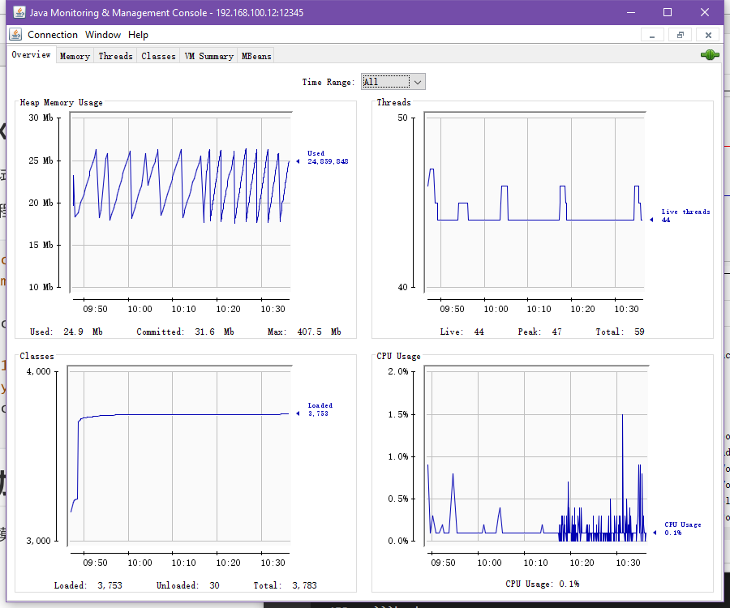
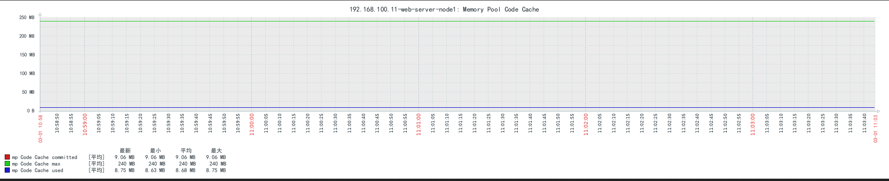
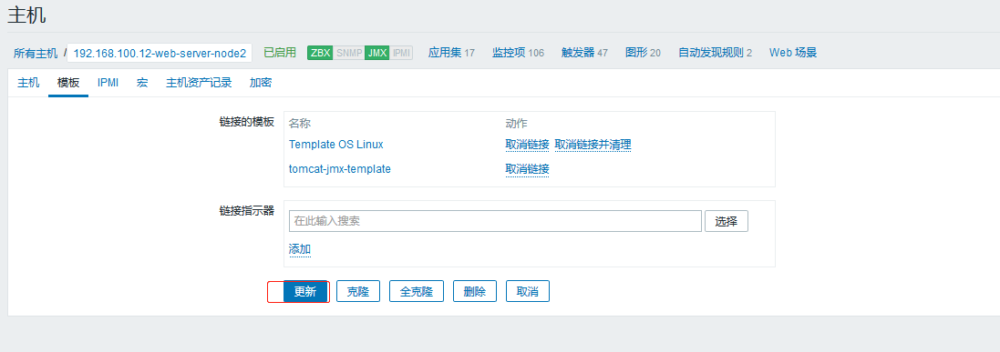
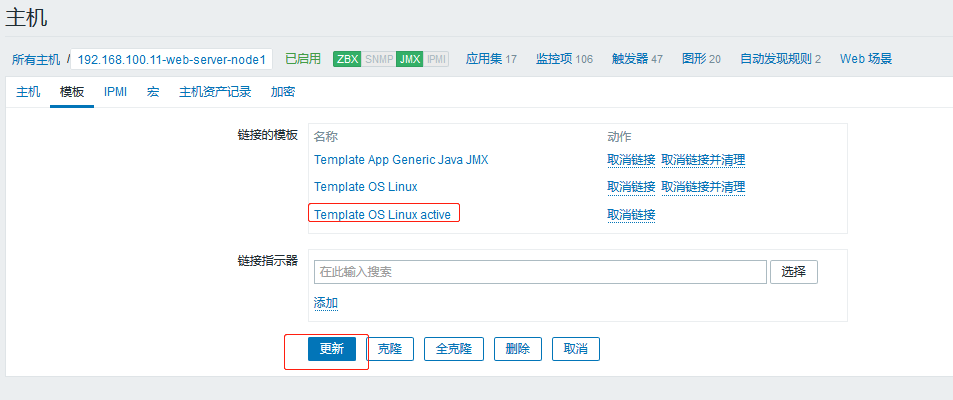
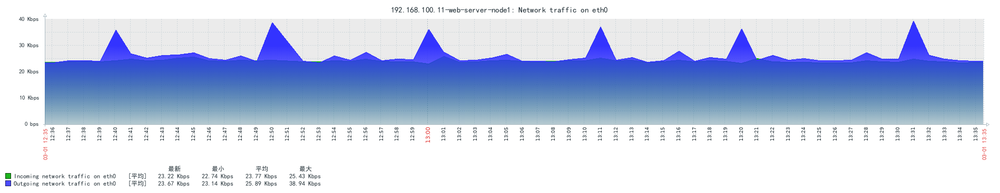

# 一. 使用 Zabbix 监控 Linux 系统

在需要监控的 Linux 系统安装 zabbix agent，之后从 web 界面添加该主机，
然后进行监控。

## 1.1 安装 zabbix agent

### Ubuntu

```bash
# wget https://repo.zabbix.com/zabbix/4.0/ubuntu/pool/main/z/zabbix-
release/zabbix-release_4.0-3+bionic_all.deb
# dpkg -i zabbix-release_4.0-3+bionic_all.deb
# apt update
# apt  install  zabbix-agent
```

### Centos 7

```bash
[root@web-server-node1 ~]# ip addr show eth0 | grep inet
    inet 192.168.100.11/24 brd 192.168.100.255 scope global noprefixroute dynamic eth0
    inet6 fe80::5df7:1d43:291b:1ca4/64 scope link noprefixroute

[root@web-server-node1 ~]# rpm -Uvh https://repo.zabbix.com/zabbix/4.0/rhel/7/x86_64/zabbix-release-4.0-2.el7.noarch.rpm
Retrieving https://repo.zabbix.com/zabbix/4.0/rhel/7/x86_64/zabbix-release-4.0-2.el7.noarch.rpm
warning: /var/tmp/rpm-tmp.e98qiG: Header V4 RSA/SHA512 Signature, key ID a14fe591: NOKEY
Preparing...                          ################################# [100%]
Updating / installing...
   1:zabbix-release-4.0-2.el7         ################################# [100%]
[root@web-server-node1 ~]# yum clean all
Loaded plugins: fastestmirror
Cleaning repos: ALIYUN EPEL7 cdrom zabbix zabbix-non-supported
Cleaning up list of fastest mirrors
Other repos take up 4.0 M of disk space (use --verbose for details)

[root@web-server-node1 ~]# yum list zabbix-agent
...
Available Packages
zabbix-agent.x86_64           4.0.18-1.el7           zabbix
...

[root@web-server-node1 ~]# yum install zabbix-agent
```

## 1.2 配置 zabbix agent

```bash
[root@web-server-node1 ~]# vim /etc/zabbix/zabbix_agentd.conf
...
[root@web-server-node1 ~]# grep "^[a-Z]" /etc/zabbix/zabbix_agentd.conf
PidFile=/var/run/zabbix/zabbix_agentd.pid
LogFile=/var/log/zabbix/zabbix_agentd.log
LogFileSize=0
Server=192.168.100.17  # 对应的zabbix server地址，即需要接受谁的监控
ListenPort=10050       # agent接受指令监听的端口
StartAgents=3          # 默认的启动的实例数(进程数)
ServerActive=127.0.0.1
Hostname=192.168.100.11 # 区分大小写且在zabbix server看来是唯一的值
Include=/etc/zabbix/zabbix_agentd.d/*.conf
```

## 1.3 重启 zabbix agent

```bash
[root@web-server-node1 ~]# systemctl restart zabbix-agent.service
[root@web-server-node1 ~]# systemctl enable zabbix-agent.service
Created symlink from /etc/systemd/system/multi-user.target.wants/zabbix-agent.service to /usr/lib/systemd/system/zabbix-agent.service.
[root@web-server-node1 ~]# systemctl status zabbix-agent.service
● zabbix-agent.service - Zabbix Agent
   Loaded: loaded (/usr/lib/systemd/system/zabbix-agent.service; enabled; vendor preset: disabled)
   Active: active (running) since Sat 2020-02-29 22:48:14 CST; 10s ago
   CGroup: /system.slice/zabbix-agent.service
           ├─11115 /usr/sbin/zabbix_agentd -c /etc/zabbix/zabbix_agentd.conf
           ├─11116 /usr/sbin/zabbix_agentd: collector [idle 1 sec]
           ├─11117 /usr/sbin/zabbix_agentd: listener #1 [waiting for connection]
           ├─11118 /usr/sbin/zabbix_agentd: listener #2 [waiting for connection]
           ├─11119 /usr/sbin/zabbix_agentd: listener #3 [waiting for connection]
           └─11120 /usr/sbin/zabbix_agentd: active checks #1 [idle 1 sec]

Feb 29 22:48:14 web-server-node1 systemd[1]: Starting Zabbix Agent...
Feb 29 22:48:14 web-server-node1 systemd[1]: Can't open PID file /run/zabbix/zabbix_agentd.pid (yet?) after start: No such file or directory
Feb 29 22:48:14 web-server-node1 systemd[1]: Started Zabbix Agent.

```

## 1.4 添加被监控主机

在 zabbix web 管理界面添加上一步安装了 zabbix agent 的 linux 主机


## 1.5 关联模板


### 1.5.1 选择模板


### 1.5.2 确认选择该模板


### 1.5.3 确认添加主机

需要等待几分钟(具体看模板中监控项的数据采集间隔时间)之后，主机的状态才会变成
绿色或者红色，绿色表示 zabbix server 对 zabbix agent 有权限进行数据采集并且
当前通信正常，红色则表示通信异常，通信异常会有多种原因，具体可以看相关日志或者
到时候点击红色方框会有相关报错显示。


### 1.5.4 验证数据

经过一段时间的数据采集后，验证 zabbix server 是否有刚添加完成主机的监控数据和
图形，图形显示如下：

上下文交换和中断处理


# 二. 使用 Zabbix 监控 Tomcat

学习如何通过 java gateway 实现对 tomcat 的指标进行数据采集和图形
展示，如堆栈内存利用率、当前会话连接数、繁忙线程等。


## 2.1 准备 JDK 环境

**web-server-node1**

```bash
[root@web-server-node1 src]# tar -xf jdk-8u241-linux-x64.tar.gz
[root@web-server-node1 src]# ln -sv /usr/local/src/jdk1.8.0_241 /usr/local/jdk
‘/usr/local/jdk’ -> ‘/usr/local/src/jdk1.8.0_241’

[root@web-server-node1 src]# vim /etc/profile
...
export JAVA_HOME=/usr/local/jdk
export TOMCAT_HOME=/apps/tomcat
export PATH=$JAVA_HOME/bin:$JAVA_HOME/jre/bin:$TOMCAT_HOME/bin:$PATH
export CLASSPATH=.$CLASSPATH:$JAVA_HOME/lib:$JAVA_HOME/jre/lib:$JAVA_HOME/lib/tools.jar
...
[root@web-server-node1 src]# . /etc/profile

[root@web-server-node1 src]# java -version
java version "1.8.0_241"
Java(TM) SE Runtime Environment (build 1.8.0_241-b07)
Java HotSpot(TM) 64-Bit Server VM (build 25.241-b07, mixed mode)
```

**web-server-node2**

```bash
[root@web-server-node2 src]# pwd
/usr/local/src
[root@web-server-node2 src]# tar -xf jdk-8u241-linux-x64.tar.gz
[root@web-server-node2 src]# ln -sv /usr/local/src/jdk1.8.0_241 /usr/local/jdk
‘/usr/local/jdk’ -> ‘/usr/local/src/jdk1.8.0_241’
[root@web-server-node2 src]# ll /usr/local/jdk/
total 25988
drwxr-xr-x 2 10143 10143     4096 Dec 11 18:35 bin
-r--r--r-- 1 10143 10143     3244 Dec 11 18:35 COPYRIGHT
drwxr-xr-x 3 10143 10143      132 Dec 11 18:35 include
-rw-r--r-- 1 10143 10143  5217333 Dec 11 15:41 javafx-src.zip
drwxr-xr-x 5 10143 10143      185 Dec 11 18:35 jre
drwxr-xr-x 5 10143 10143      245 Dec 11 18:35 lib
-r--r--r-- 1 10143 10143       44 Dec 11 18:35 LICENSE
drwxr-xr-x 4 10143 10143       47 Dec 11 18:35 man
-r--r--r-- 1 10143 10143      159 Dec 11 18:35 README.html
-rw-r--r-- 1 10143 10143      424 Dec 11 18:35 release
-rw-r--r-- 1 10143 10143 21078837 Dec 11 18:35 src.zip
-rw-r--r-- 1 10143 10143   116400 Dec 11 15:41 THIRDPARTYLICENSEREADME-JAVAFX.txt
-r--r--r-- 1 10143 10143   169788 Dec 11 18:35 THIRDPARTYLICENSEREADME.txt

[root@web-server-node2 src]# vim /etc/profile
...
export JAVA_HOME=/usr/local/jdk
export TOMCAT_HOME=/apps/tomcat
export PATH=$JAVA_HOME/bin:$JAVA_HOME/jre/bin:$TOMCAT_HOME/bin:$PATH
export CLASSPATH=.$CLASSPATH:$JAVA_HOME/lib:$JAVA_HOME/jre/lib:$JAVA_HOME/lib/tools.jar
...
[root@web-server-node2 src]# . /etc/profile

[root@web-server-node2 src]# java -version
java version "1.8.0_241"
Java(TM) SE Runtime Environment (build 1.8.0_241-b07)
Java HotSpot(TM) 64-Bit Server VM (build 25.241-b07, mixed mode)
```

## 2.2 准备 tomcat

### 安装 tomcat

```bash
[root@web-server-node2 src]# tar -xf apache-tomcat-8.5.42.tar.gz
[root@web-server-node2 src]# ln -sv /usr/local/src/apache-tomcat-8.5.42 /usr/local/tomcat
‘/usr/local/tomcat/apache-tomcat-8.5.42’ -> ‘/usr/local/src/apache-tomcat-8.5.42’

```

### 准备 jsp 页面

```bash
[root@web-server-node2 local]# mkdir tomcat/webapps/myapp
[root@web-server-node2 local]# cat tomcat/webapps/myapp/index.jsp
<%@ page language="java" contentType="text/html; charset=UTF-8"
    pageEncoding="UTF-8"%>
<!DOCTYPE html>
<html>
<head>
    <meta charset="utf-8">
    <title>jsp例子</title>
</head>
<body>
<!-- 后面的内容是服务器端动态生成字符串，最后拼接在一起 -->
<%
out.println("hello jsp");
%>
<br>
<%=request.getRequestURL()%>
</body>
</html>
```

### 启动 tomcat

```bash
[root@web-server-node2 local]# /usr/local/tomcat/bin/catalina.sh start
Using CATALINA_BASE:   /usr/local/tomcat
Using CATALINA_HOME:   /usr/local/tomcat
Using CATALINA_TMPDIR: /usr/local/tomcat/temp
Using JRE_HOME:        /usr/local/jdk
Using CLASSPATH:       /usr/local/tomcat/bin/bootstrap.jar:/usr/local/tomcat/bin/tomcat-juli.jar
Tomcat started.

```

## 2.3 访问 tomcat web 页面


## 2.4 部署 JAVA Gateway 服务器

java gateway 是一个独立于 zabbix server 和 zabbix agent 的组件，也就是
java gateway 可以是单独的一台服务器，但是也可以和 zabbix server 或者
zabbix agent 公用一台服务器，前提是端口不要配置冲突了。本次使用一台单独的
服务器，IP 地址为: 192.168.100.21

```bash
[root@java-gateway ~]# rpm -Uvh https://repo.zabbix.com/zabbix/4.0/rhel/7/x86_64/zabbix-release-4.0-2.el7.noarch.rpm
Retrieving https://repo.zabbix.com/zabbix/4.0/rhel/7/x86_64/zabbix-release-4.0-2.el7.noarch.rpm
warning: /var/tmp/rpm-tmp.xEv87i: Header V4 RSA/SHA512 Signature, key ID a14fe591: NOKEY
Preparing...                          ################################# [100%]
Updating / installing...
   1:zabbix-release-4.0-2.el7         ################################# [100%]

[root@java-gateway ~]# yum list zabbix-java-gateway
Loaded plugins: fastestmirror
Loading mirror speeds from cached hostfile
Available Packages
zabbix-java-gateway.x86_64                                             4.0.18-1.el7                                             zabbix

[root@java-gateway ~]#  yum install zabbix-java-gateway -y

[root@java-gateway ~]# vim /etc/zabbix/zabbix_java_gateway.conf
[root@java-gateway ~]# grep "^[a-Z]" /etc/zabbix/zabbix_java_gateway.conf
LISTEN_IP="0.0.0.0"
LISTEN_PORT=10052
PID_FILE="/var/run/zabbix/zabbix_java.pid"
START_POLLERS=20
TIMEOUT=30

[root@java-gateway ~]# systemctl restart  zabbix-java-gateway
[root@java-gateway ~]# systemctl enable  zabbix-java-gateway
Created symlink from /etc/systemd/system/multi-user.target.wants/zabbix-java-gateway.service to /usr/lib/systemd/system/zabbix-java-gateway.service.
```

使用编译部署 java gateway 也可以：

```bash
依赖
# yum install gcc  libxml2-devel   net-snmp net-snmp-devel   curl  curl-devel
php  php-bcmath  php-mbstring  mariadb-devel java-1.8.0-openjdk-devel  -y

编译参数
# ./configure --prefix=/usr/local/zabbix  --enable-java  --with-net-snmp --with-
mysql --with-ssh2
#make install

启动
#/usr/local/zabbix/sbin/zabbix_java/startup.sh  #编译安装的java gateway启动方式
```

## 2.5 配置 zabbix server 调用 java gateway

### 2.5.1 修改 server 配置文件

```bash
root@ubuntu-zabbix-server:~# vim /etc/zabbix/zabbix_server.conf
...
### Option: JavaGateway
#       IP address (or hostname) of Zabbix Java gateway.
#       Only required if Java pollers are started.
#
# Mandatory: no
# Default:
JavaGateway=192.168.100.21

### Option: JavaGatewayPort
#       Port that Zabbix Java gateway listens on.
#
# Mandatory: no
# Range: 1024-32767
# Default:
JavaGatewayPort=10052

### Option: StartJavaPollers
#       Number of pre-forked instances of Java pollers.
#
# Mandatory: no
# Range: 0-1000
# Default:
StartJavaPollers=20
...

root@ubuntu-zabbix-server:~# systemctl restart zabbix-server.service
```

### 2.5.2 查看 java gateway 轮询器进程

```bash
root@ubuntu-zabbix-server:~# ps -ef | grep java
zabbix    49849  49837  0 00:44 ?        00:00:00 /usr/sbin/zabbix_server: java poller #1 [got 0 values in 0.000024 sec, idle 5 sec]
zabbix    49850  49837  0 00:44 ?        00:00:00 /usr/sbin/zabbix_server: java poller #2 [got 0 values in 0.000015 sec, idle 5 sec]
zabbix    49851  49837  0 00:44 ?        00:00:00 /usr/sbin/zabbix_server: java poller #3 [got 0 values in 0.000007 sec, idle 5 sec]
zabbix    49852  49837  0 00:44 ?        00:00:00 /usr/sbin/zabbix_server: java poller #4 [got 0 values in 0.000026 sec, idle 5 sec]
zabbix    49853  49837  0 00:44 ?        00:00:00 /usr/sbin/zabbix_server: java poller #5 [got 0 values in 0.000009 sec, idle 5 sec]
zabbix    49854  49837  0 00:44 ?        00:00:00 /usr/sbin/zabbix_server: java poller #6 [got 0 values in 0.000013 sec, idle 5 sec]
zabbix    49855  49837  0 00:44 ?        00:00:00 /usr/sbin/zabbix_server: java poller #7 [got 0 values in 0.000013 sec, idle 5 sec]
zabbix    49856  49837  0 00:44 ?        00:00:00 /usr/sbin/zabbix_server: java poller #8 [got 0 values in 0.000008 sec, idle 5 sec]
zabbix    49857  49837  0 00:44 ?        00:00:00 /usr/sbin/zabbix_server: java poller #9 [got 0 values in 0.000007 sec, idle 5 sec]
zabbix    49858  49837  0 00:44 ?        00:00:00 /usr/sbin/zabbix_server: java poller #10 [got 0 values in 0.000028 sec, idle 5 sec]
zabbix    49859  49837  0 00:44 ?        00:00:00 /usr/sbin/zabbix_server: java poller #11 [got 0 values in 0.000013 sec, idle 5 sec]
zabbix    49860  49837  0 00:44 ?        00:00:00 /usr/sbin/zabbix_server: java poller #12 [got 0 values in 0.000007 sec, idle 5 sec]
zabbix    49861  49837  0 00:44 ?        00:00:00 /usr/sbin/zabbix_server: java poller #13 [got 0 values in 0.000008 sec, idle 5 sec]
zabbix    49862  49837  0 00:44 ?        00:00:00 /usr/sbin/zabbix_server: java poller #14 [got 0 values in 0.000014 sec, idle 5 sec]
zabbix    49863  49837  0 00:44 ?        00:00:00 /usr/sbin/zabbix_server: java poller #15 [got 0 values in 0.000013 sec, idle 5 sec]
zabbix    49864  49837  0 00:44 ?        00:00:00 /usr/sbin/zabbix_server: java poller #16 [got 0 values in 0.000028 sec, idle 5 sec]
zabbix    49865  49837  0 00:44 ?        00:00:00 /usr/sbin/zabbix_server: java poller #17 [got 0 values in 0.000014 sec, idle 5 sec]
zabbix    49866  49837  0 00:44 ?        00:00:00 /usr/sbin/zabbix_server: java poller #18 [got 0 values in 0.000015 sec, idle 5 sec]
zabbix    49867  49837  0 00:44 ?        00:00:00 /usr/sbin/zabbix_server: java poller #19 [got 0 values in 0.000013 sec, idle 5 sec]
zabbix    49868  49837  0 00:44 ?        00:00:00 /usr/sbin/zabbix_server: java poller #20 [got 0 values in 0.000011 sec, idle 5 sec]
root      49895  45696  0 00:44 pts/0    00:00:00 grep --color=auto java
root@ubuntu-zabbix-server:~# ps -ef | grep java | wc -l
21

```

## 2.6 配置 tomcat 开启 JMX 监控

JMX 在 Java 编程语言中定义了应用程序以及网络管理和监控的体系结构、设计
模式、应用程序接口以及服务，通常使用 JMX 来监控 JAVA 系统的运行状态。

[什么是 JMX？](https://www.jianshu.com/p/8c5133cab858)

所谓 JMX，是 Java Management Extensions(Java 管理扩展)的缩写，是一个
为应用程序植入管理功能的框架。用户可以在任何 Java 应用程序中使用这些代
理和服务实现管理。

### 2.6.1 修改启动参数

```bash
[root@web-server-node2 local]# vim /usr/local/tomcat/bin/catalina.sh
...
# added catalina_opts
CATALINA_OPTS="$CATALINA_OPTS
-Dcom.sun.management.jmxremote                   # 启用远程监控JMX
-Dcom.sun.management.jmxremote.port=12345        # 默认启动的JMX端口号，要和zabbix添加主机时候的端口一致即可
-Dcom.sun.management.jmxremote.authenticate=false # 不使用用户名密码
-Dcom.sun.management.jmxremote.ssl=false          # 不使用ssl认证
-Djava.rmi.server.hostname=192.168.100.12" #tomcat主机自己的IP地址，不要写zabbix服务器的地址
...


[root@web-server-node2 local]#
[root@web-server-node2 local]# /usr/local/tomcat/bin/catalina.sh stop
Using CATALINA_BASE:   /usr/local/tomcat
Using CATALINA_HOME:   /usr/local/tomcat
Using CATALINA_TMPDIR: /usr/local/tomcat/temp
Using JRE_HOME:        /usr/local/jdk
Using CLASSPATH:       /usr/local/tomcat/bin/bootstrap.jar:/usr/local/tomcat/bin/tomcat-juli.jar
[root@web-server-node2 local]# /usr/local/tomcat/bin/catalina.sh start
Using CATALINA_BASE:   /usr/local/tomcat
Using CATALINA_HOME:   /usr/local/tomcat
Using CATALINA_TMPDIR: /usr/local/tomcat/temp
Using JRE_HOME:        /usr/local/jdk
Using CLASSPATH:       /usr/local/tomcat/bin/bootstrap.jar:/usr/local/tomcat/bin/tomcat-juli.jar
Tomcat started.

[root@web-server-node2 local]# lsof -i:8080
COMMAND  PID USER   FD   TYPE DEVICE SIZE/OFF NODE NAME
java    2973 root   50u  IPv6  32854      0t0  TCP *:webcache (LISTEN)
[root@web-server-node2 local]# lsof -i:8009
COMMAND  PID USER   FD   TYPE DEVICE SIZE/OFF NODE NAME
java    2973 root   54u  IPv6  32856      0t0  TCP *:8009 (LISTEN)
[root@web-server-node2 local]# lsof -i:8005
COMMAND  PID USER   FD   TYPE DEVICE SIZE/OFF NODE NAME
java    2973 root   79u  IPv6  32593      0t0  TCP localhost:mxi (LISTEN)
```

### 2.6.2 通过 jconsole 验证 JMX 数据

Windows 版的 jdk 安装完成之后在安装目录的`bin/`目录下找到 jconsole.exe，
比如 `C:\Program Files\Java\jdk1.8.0_241\bin\jconsole.exe`，如下:


允许不安全连接


堆内存使用情况:


伊甸园区内存情况:


Overview



## 2.7 zabbix server 添加 JMX 监控

node1


node2


## 2.8 zabbix server 关联模板


## 2.9 验证当前 JMX 状态及数据

如下，JMX 图标变绿就说明 JMX 监控已经生效:


数据 node1




数据 node2


## 2.10 生产中 JMX 监控模板的使用

生产环境的 JMX 监控模板使用，添加了自定义监控项和阈值的监控模板。

### 2.10.1 选择 XML 格式的监控模板并导入

到导入模板的选项:


浏览要导入的模板:


勾选相应选项后导入:


导入 OK：


### 2.10.2 关联导入的模板到 tomcat 服务器

将上一步骤导入的模板关联至被监控的 tomcat 服务器，然后取消关联并清理之前的
JMX 模板，如下：




### 2.10.3 验证是否有监控数据


## 2.11 使用命令测试 JMX 监控是否有效

```bash
root@ubuntu-zabbix-server:/usr/local/jdk# java -jar cmdline-jmxclient-0.10.3.jar - 192.168.100.11:12345 'Catalina:name="http-nio-8080",type=ThreadPool'  currentThreadCount
03/01/2020 10:34:30 +0800 org.archive.jmx.Client currentThreadCount: 10

root@ubuntu-zabbix-server:/usr/local/jdk# java -jar cmdline-jmxclient-0.10.3.jar - 192.168.100.12:12345 'Catalina:name="http-nio-8080",type=ThreadPool'  currentThreadCount
03/01/2020 10:34:17 +0800 org.archive.jmx.Client currentThreadCount: 10
```

# 三. Zabbix 主动与被动监控方式

## 3.1 被动模式

无论是模式还是被动模式，都是站在 zabbix agent 角度来说的工作模式，比如被
动模式，是说 zabbix agent 被动的接受 zabbix server 周期性发送过来的数据
收集指令，在被动模式之下，zabbix server 会根据主机关联的模板中的监控项和
数据采集间隔时间，周期性的打开随机端口并向 zabbix agent 服务器的 10050 发
起 tcp 连接，然后发送获取监控项数据的指令，即 zabbix server 发送什么指令
那么 zabbix agent 就收集什么数据，zabbix server 什么时候发送 zabbix agent
就什么时候采集，zabbix server 不发送 zabbix agent 就一直不响应，所以
zabbix agent 也不用关心其监控项和数据采集周期间隔时间。

被动模式的优点就是配置简单，安装后即可使用，因此也成为 zabbix 的默认工作模
式，但是被动模式的最大问题就是会加大 zabbix server 的工作量，在数百甚至数
千台服务器的环境下会导致 zabbix server 需要以轮询的方式向每个 zabbix agent
发送数据采集指令，如果 zabbix server 负载很高还会导致不能及时获取到最新数据，
但由于无需其他复杂配置，被设置为了默认的工作方式。

### 3.1.1 查看被动模式端口状态

```bash
[root@web-server-node2 ~]# netstat -tanlp
Active Internet connections (servers and established)
Proto Recv-Q Send-Q Local Address           Foreign Address         State       PID/Program name
tcp        0      0 127.0.0.1:25            0.0.0.0:*               LISTEN      1249/master
tcp        0      0 0.0.0.0:10050           0.0.0.0:*               LISTEN      6606/zabbix_agentd
tcp        0      0 127.0.0.1:9000          0.0.0.0:*               LISTEN      883/php-fpm: master
tcp        0      0 0.0.0.0:3306            0.0.0.0:*               LISTEN      1238/mysqld
tcp        0      0 0.0.0.0:111             0.0.0.0:*               LISTEN      1/systemd
tcp        0      0 0.0.0.0:22              0.0.0.0:*               LISTEN      884/sshd
tcp        0      0 192.168.100.12:10050    192.168.100.18:57695    TIME_WAIT   -   # 本机监听的10050，192.168.100.18为zabbix server，其使用随机端口向本机发起tcp连接
tcp        0      0 192.168.100.12:10050    192.168.100.18:57699    TIME_WAIT   -
tcp        0      0 192.168.100.12:10050    192.168.100.18:57821    TIME_WAIT   -
tcp        0      0 192.168.100.12:10050    192.168.100.18:57677    TIME_WAIT   -
tcp        0      0 192.168.100.12:10050    192.168.100.18:57817    TIME_WAIT   -
tcp        0      0 192.168.100.12:10050    192.168.100.18:57725    TIME_WAIT   -
tcp        0      0 192.168.100.12:10050    192.168.100.18:57553    TIME_WAIT   -
tcp        0     36 192.168.100.12:22       192.168.100.1:52678     ESTABLISHED 4272/sshd: root@pts
tcp        0      0 192.168.100.12:10050    192.168.100.18:57743    TIME_WAIT   -
tcp        0      0 192.168.100.12:10050    192.168.100.18:57571    TIME_WAIT   -
tcp        0      0 192.168.100.12:10050    192.168.100.18:57705    TIME_WAIT   -
tcp        0      0 192.168.100.12:10050    192.168.100.18:57811    TIME_WAIT   -
tcp        0      0 192.168.100.12:10050    192.168.100.18:57729    TIME_WAIT   -
...
```

### 3.1.2 被动模式工作流程


## 3.2 主动模式

主动模式是由 zabbix agent 主动向 zabbix server 的 10051 端口发起 tcp
连接请求，因此主动模式下必须在 zabbix agent 配置文件中指定 zabbix server
的 IP 或者主机名(必须可以被解析为 IP 地址)，在连接到 zabbix server 之前
zabbix agent 是不知道自己要采集那些数据以及间隔多久采集一次数据的，然后在
连接到 zabbix server 以后获取到自己的监控项和数据采集间隔周期时间，然后再
根据监控项采集数据并返回给 zabbix server，在主动模式下不再需要 zabbix serve
向 zabbix agent 发起连接请求，因此主动模式在一定程度上可减轻
zabbix server 打开的本地随机端口和进程数，在一定程度就减轻
zabbix server 的压力。

### 3.2.1 主动模式工作流程


### 3.2.2 配置 zabbix agent 为主动模式

node1

```bash
[root@web-server-node1 ~]# vim /etc/zabbix/zabbix_agentd.conf

[root@web-server-node1 ~]# grep "^[a-Z]" /etc/zabbix/zabbix_agentd.conf
PidFile=/var/run/zabbix/zabbix_agentd.pid
LogFile=/var/log/zabbix/zabbix_agentd.log
LogFileSize=0
Server=192.168.100.18
ListenPort=10050
StartAgents=3
ServerActive=192.168.100.18   # 主动模式，需要连接的zabbix server地址
Hostname=192.168.100.11
Include=/etc/zabbix/zabbix_agentd.d/*.conf

[root@web-server-node1 ~]# systemctl restart zabbix-agent.service
```

node2

```bash
[root@web-server-node2 ~]# vim /etc/zabbix/zabbix_agentd.conf

[root@web-server-node2 ~]# grep "^[a-Z]" /etc/zabbix/zabbix_agentd.conf
PidFile=/var/run/zabbix/zabbix_agentd.pid
LogFile=/var/log/zabbix/zabbix_agentd.log
LogFileSize=0
EnableRemoteCommands=1
Server=192.168.100.18
ListenPort=10050
ListenIP=0.0.0.0
StartAgents=5
ServerActive=192.168.100.18  #    #  ##
Hostname=192.168.100.12
RefreshActiveChecks=60
Include=/etc/zabbix/zabbix_agentd.d/*.conf

[root@web-server-node2 ~]# systemctl restart zabbix-agent.service
```

### 3.2.3 生成主动监控模板


### 3.2.4 关联主动式模板




### 3.2.5 确认主机和 agent 连接状态


### 3.2.5 验证数据


### 3.2.6 查看 zabbix server 端口

```bash
root@ubuntu-zabbix-server:~# ip addr show eth0 | grep inet
    inet 192.168.100.18/24 brd 192.168.100.255 scope global dynamic eth0
    inet6 fe80::20c:29ff:fe8a:f486/64 scope link

root@ubuntu-zabbix-server:~# netstat  -tanlp  | grep 10050
tcp        0      0 192.168.100.18:16081    192.168.100.16:10050    TIME_WAIT   -
tcp        0      0 192.168.100.18:52239    192.168.100.11:10050    TIME_WAIT   -
tcp        0      0 192.168.100.18:52287    192.168.100.11:10050    TIME_WAIT   -
root@ubuntu-zabbix-server:~# netstat  -tanlp  | grep 10050
tcp        0      0 192.168.100.18:45313    192.168.100.12:10050    TIME_WAIT   -
root@ubuntu-zabbix-server:~# netstat  -tanlp  | grep 10050
tcp        0      0 192.168.100.18:45313    192.168.100.12:10050    TIME_WAIT   -
root@ubuntu-zabbix-server:~# netstat  -tanlp  | grep 10050
tcp        0      0 192.168.100.18:45313    192.168.100.12:10050    TIME_WAIT   -

# 192.168.100.11/192.168.100.12分别为node1和node2
```

# 四. 监控数据展示

## node1 eth0 接口的网络流量监控(3H)



## node2 eth0 接口的网络流量监控(3H)


## node1 java 虚拟机的 GC 监控(3H)


## node2 java 虚拟机的 GC 监控(3H)


## node1 java 线程监控(3H)


## node2 java 线程监控(3H)


