# 一. Zabbix Proxy 架构

[Zabbix proxy 分布式监控文档](https://www.zabbix.com/documentation/4.0/zh/manual/distributed_monitoring)

的看风景的的看法就了速度快放假凉快圣诞节饭了示例开始讲方式凉快圣诞节饭水电费

Zabbix 通过 Zabbix proxies 为 IT 基础设施提供有效和可用的分布式监控。代理
(proxies)可用于代替 Zabbix server 本地收集数据，然后将数据报告给服务器。

zabbix 作为一个分布式监控系统(分布式监控解决方案)，支持通过代理(proxy)收集
zabbix agent 的监控数据然后由 zabbix proxy 再把数据发送给 zabbix server，
也就是 zabbix proxy 可以代替 zabbix server 收集监控数据，然后把数据汇报给
zabbix server，所以 zabbix proxy 可以在一定程度上分担了 zabbix server 的数
据收集压力，从而降低了数据的采集时间、也相应的增加了 zabbix server 的监控
能力。另外 zabbix proxy 也区分**主动模式**和**被动模式**，通信方式与 zabbix server
主动模式和被动模式一样，区别是 zabbix proxy 由于没有 zabbix agent 的配置，
所以 zabbix proxy 在主动模式下要周期性的向 zabbix server 申请获取 zabbix agent
的监控项信息，zabbix proxy 在被动模式下也是等待 zabbix server 的连接
并接受 zabbix server 发送的监控项指令，然后再由 zabbix proxy 向 zabbix agent
发起请求获取数据。

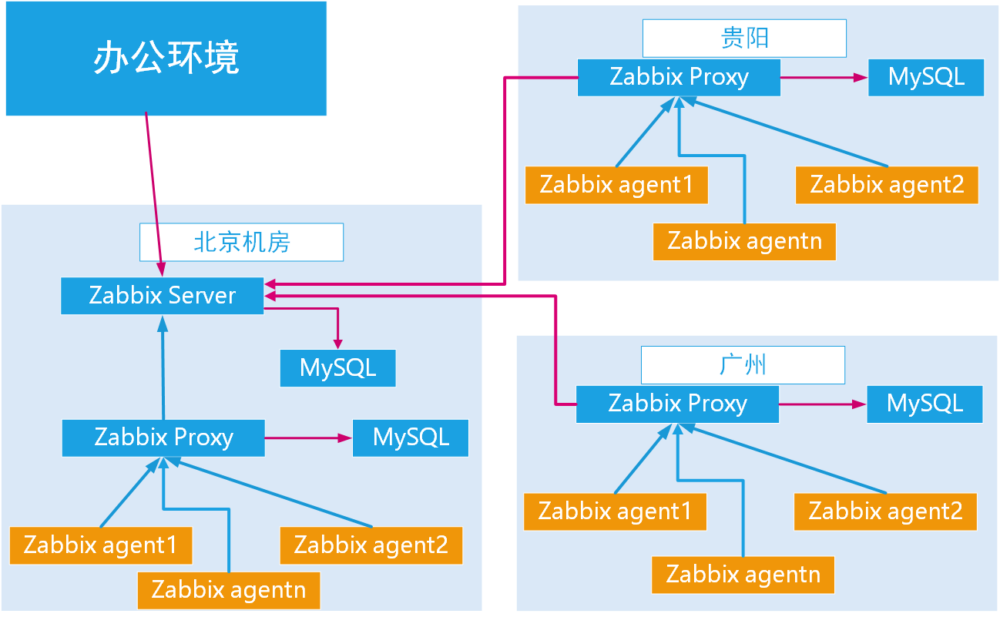

# 二. Zabbix proxy 和 Zabbix server 对比

对比表格:

| 功能\server | zabbxy proxy                 | zabbix server                          |
| :---------- | :--------------------------- | :------------------------------------- |
| 轻量级      | 是                           | 相对重量级                             |
| 图形        | 无                           | 带图形控制界面                         |
| 独立工作    | 是，可以独立采集数据并存储   | 是，即数据采集、存储、分析、展示于一体 |
| 易维护      | 是，配置完成后基本无需管理   | 维护也不难                             |
| 独立数据库  | 保留少量最近数据             | 保留指定时间内的所有数据               |
| 报警通知    | 否，代理服务器不发送邮件通知 | 支持邮件、短信等告警机制               |
| 本地管理    | 不支持                       | 支持                                   |

# 三. Zabbix proxy 部署与使用

## 3.1 zabbix proxy 版本选择

在使用 proxy 做分布式监控时 zabbix proxy 的大版本必须要和 zabbix server
版本一致，否则会导致出现 zabbix server 与 zabbix proxy 不兼容问题，出现
类似以下的错误提示:

```bash
 proxy "zabbix-proxy-active" protocol version x.x differs from server version x.x
```

## 3.2 安装 proxy

[官方安装参考手册](https://www.zabbix.com/documentation/4.0/zh/manual/installation/install)

主机准备：

| IP             | hostname           | 模式 |
| :------------- | :----------------- | :--- |
| 192.168.100.14 | zabbix-proxy-node1 | 被动 |
| 192.168.100.15 | zabbix-proxy-node2 | 主动 |
| 192.168.100.16 | mysql-master       |      |
| 192.168.100.18 | zabbix server      |      |

### 3.2.1 node1 yum 安装

#### CentOS 7

```bash
[root@zabbix-proxy-node1 ~]# yum install gcc libxml2-devel net-snmp net-snmp-devel curl curl-devel php php-bcmath php-mbstring mariadb mariadb-devel java-1.8.0-openjdk-devel -y

[root@zabbix-proxy-node1 ~]# yum install zabbix
[root@zabbix-proxy-node1 ~]# yum install zabbix-proxy-mysql.x86_64

[root@zabbix-proxy-node1 ~]# systemctl status zabbix-proxy.service
● zabbix-proxy.service - Zabbix Proxy
   Loaded: loaded (/usr/lib/systemd/system/zabbix-proxy.service; disabled; vendor preset: disabled)
   Active: inactive (dead)
```

yum 安装时 zabbix proxy 需要的数据库 sql 语句文件位于:

```bash
[root@zabbix-proxy-node1 ~]# ll /usr/share/doc/zabbix-proxy-mysql-4.0.18/schema.sql.gz
-rw-r--r-- 1 root root 13224 Feb 21 23:12 /usr/share/doc/zabbix-proxy-mysql-4.0.18/schema.sql.gz
```

#### Ubuntu 1804

```bash
# wget https://repo.zabbix.com/zabbix/4.0/ubuntu/pool/main/z/zabbix-
release/zabbix-release_4.0-3+bionic_all.deb
# dpkg -i zabbix-release_4.0-3+bionic_all.deb
# apt update

# apt install libmysqld-dev  libmysqlclient-dev  libxml2-dev  libxml2 snmp
libsnmp-dev   libevent-dev  curl  libcurl4-openssl-dev
# apt install zabbix-proxy-mysql
```

### 3.2.2 准备数据库

| host     | node1               | node2                |
| :------- | :------------------ | :------------------- |
| 数据库名 | zabbix_proxy_active | zabbix_proxy_passive |
| 用户     | proxy               | stevenux             |
| 密码     | proxy               | stevenux             |

```bash
[root@mysql-master ~]# mysql -uroot -p
Enter password:
Welcome to the MariaDB monitor.  Commands end with ; or \g.
Your MariaDB connection id is 37580
Server version: 5.5.64-MariaDB MariaDB Server

Copyright (c) 2000, 2018, Oracle, MariaDB Corporation Ab and others.

Type 'help;' or '\h' for help. Type '\c' to clear the current input statement.

MariaDB [(none)]> CREATE DATABASE zabbix_proxy_active CHARACTER SET UTF8 COLLATE UTF8_BIN;
Query OK, 1 row affected (0.00 sec)

MariaDB [(none)]> GRANT ALL PRIVILEGES ON zabbix_proxy_active.* TO proxy@'192.168.100.%' IDENTIFIED BY 'stevenux';
Query OK, 0 rows affected (0.00 sec)

MariaDB [(none)]> CREATE DATABASE zabbix_proxy_passive CHARACTER SET UTF8 COLLATE UTF8_BIN;
Query OK, 1 row affected (0.00 sec)

MariaDB [(none)]> GRANT ALL PRIVILEGES ON zabbix_proxy_passive.* TO proxy@'192.168.100.%' IDENTIFIED BY 'stevenux';
Query OK, 0 rows affected (0.00 sec)

MariaDB [(none)]> FLUSH PRIVELEGES;
ERROR 1064 (42000): You have an error in your SQL syntax; check the manual that corresponds to your MariaDB server version for the right syntax to use near 'PRIVELEGES' at line 1
MariaDB [(none)]> FLUSH PRIVILEGES;
Query OK, 0 rows affected (0.00 sec)

MariaDB [(none)]>

```

### 3.2.3 node2 编译安装

编译安装 zabbix proxy 时直接使用 zabbix 的源码包，通过指定编译参数来
编译 proxy。

```bash
[root@zabbix-proxy-node2 ~]# useradd  zabbix  -s /usr/sbin/nologin
[root@zabbix-proxy-node2 ~]# id zabbix
uid=1023(zabbix) gid=1024(zabbix) groups=1024(zabbix)

[root@zabbix-proxy-node2 zabbix-4.0.15]# pwd
/usr/local/src/zabbix-4.0.15

[root@zabbix-proxy-node2 src]# tar -xf zabbix-4.0.15.tar.gz
[root@zabbix-proxy-node2 src]# cd zabbix-4.0.15/
[root@zabbix-proxy-node2 zabbix-4.0.15]# ./configure --prefix=/apps/zabbix_proxy  --enable-proxy --enable-agent --with-mysql --with-net-snmp --with-libcurl --with-libxml2

[root@zabbix-proxy-node2 zabbix-4.0.15]# make install

[root@zabbix-proxy-node2 zabbix-4.0.15]# ll /apps/zabbix_proxy/
total 0
drwxr-xr-x 2 root root  45 Mar  1 15:34 bin
drwxr-xr-x 4 root root 112 Mar  1 15:34 etc
drwxr-xr-x 3 root root  21 Mar  1 15:34 lib
drwxr-xr-x 2 root root  47 Mar  1 15:34 sbin
drwxr-xr-x 4 root root  31 Mar  1 15:34 share
```

### 3.2.4 将 proxy 所需的导入数据库

测试是否可以连到远程数据库

```bash
[root@zabbix-proxy-node2 zabbix-4.0.15]# mysql -uproxy -pstevenux -h192.168.100.16
Welcome to the MariaDB monitor.  Commands end with ; or \g.
Your MariaDB connection id is 37946
Server version: 5.5.64-MariaDB MariaDB Server

Copyright (c) 2000, 2018, Oracle, MariaDB Corporation Ab and others.

Type 'help;' or '\h' for help. Type '\c' to clear the current input statement.

MariaDB [(none)]> show databases;
+----------------------+
| Database             |
+----------------------+
| information_schema   |
| zabbix_proxy_active  |
| zabbix_proxy_passive |
+----------------------+
3 rows in set (0.01 sec)

MariaDB [(none)]>

```

导入数据

```bash
[root@zabbix-proxy-node2 zabbix-4.0.15]# pwd
/usr/local/src/zabbix-4.0.15
[root@zabbix-proxy-node2 zabbix-4.0.15]# mysql -uproxy -pstevenux -h192.168.100.16 zabbix_proxy_passive < database/mysql/schema.sql
[root@zabbix-proxy-node2 zabbix-4.0.15]# mysql -uproxy -pstevenux -h192.168.100.16 zabbix_proxy_passive
Reading table information for completion of table and column names
You can turn off this feature to get a quicker startup with -A

Welcome to the MariaDB monitor.  Commands end with ; or \g.
Your MariaDB connection id is 37996
Server version: 5.5.64-MariaDB MariaDB Server

Copyright (c) 2000, 2018, Oracle, MariaDB Corporation Ab and others.

Type 'help;' or '\h' for help. Type '\c' to clear the current input statement.

MariaDB [zabbix_proxy_passive]> show tables;
+--------------------------------+
| Tables_in_zabbix_proxy_passive |
+--------------------------------+
| acknowledges                   |
| actions                        |
| alerts                         |
| application_discovery          |
| application_prototype          |
| application_template           |
...
| users                          |
| users_groups                   |
| usrgrp                         |
| valuemaps                      |
| widget                         |
| widget_field                   |
+--------------------------------+
144 rows in set (0.00 sec)
```

### 3.2.5 编写 proxy 的启动文件

```bash
# 从yum安装的地方拷贝一个参考
[root@zabbix-proxy-node1 ~]# ip addr show eth0 | grep inet
    inet 192.168.100.14/24 brd 192.168.100.255 scope global noprefixroute eth0
    inet6 fe80::20c:29ff:feb0:8a39/64 scope link
[root@zabbix-proxy-node1 ~]# scp /usr/lib/systemd/system/zabbix-proxy.service 192.168.100.15:/usr/lib/systemd/system/zabbix-proxy.service

# 编辑启动文件
[root@zabbix-proxy-node2 zabbix-4.0.15]# ip addr show eth0 | grep inet
    inet 192.168.100.15/24 brd 192.168.100.255 scope global noprefixroute eth0
    inet6 fe80::20c:29ff:fec5:3935/64 scope link
[root@zabbix-proxy-node2 zabbix-4.0.15]# vim /usr/lib/systemd/system/zabbix-proxy.service
[Unit]
Description=Zabbix Proxy
After=syslog.target
After=network.target

[Service]
Environment="CONFFILE=/apps/zabbix_proxy/etc/zabbix_proxy.conf"
EnvironmentFile=-/etc/sysconfig/zabbix-proxy
Type=forking
Restart=on-failure
PIDFile=/run/zabbix/zabbix_proxy.pid
KillMode=control-group
ExecStart=/apps/zabbix_proxy/sbin/zabbix_proxy -c $CONFFILE
ExecStop=/bin/kill -SIGTERM $MAINPID
RestartSec=10s
TimeoutSec=0

[Install]
WantedBy=multi-user.target
```

使用 systemd 启动 proxy

```bash
[root@zabbix-proxy-node2 zabbix-4.0.15]# systemctl daemon-reload
[root@zabbix-proxy-node2 zabbix-4.0.15]# systemctl status zabbix-proxy
● zabbix-proxy.service - Zabbix Proxy
   Loaded: loaded (/usr/lib/systemd/system/zabbix-proxy.service; disabled; vendor preset: disabled)
   Active: inactive (dead)
[root@zabbix-proxy-node2 zabbix-4.0.15]# systemctl start zabbix-proxy
[root@zabbix-proxy-node2 zabbix-4.0.15]# systemctl status zabbix-proxy
● zabbix-proxy.service - Zabbix Proxy
   Loaded: loaded (/usr/lib/systemd/system/zabbix-proxy.service; disabled; vendor preset: disabled)
   Active: active (running) since Sun 2020-03-01 15:49:34 CST; 1s ago
  Process: 34261 ExecStart=/apps/zabbix_proxy/sbin/zabbix_proxy -c $CONFFILE (code=exited, status=0/SUCCESS)
   CGroup: /system.slice/zabbix-proxy.service
           └─34263 /apps/zabbix_proxy/sbin/zabbix_proxy -c /apps/zabbix_proxy/etc/zabbix_proxy.conf

Mar 01 15:49:34 zabbix-proxy-node2 systemd[1]: Starting Zabbix Proxy...
Mar 01 15:49:34 zabbix-proxy-node2 systemd[1]: Can't open PID file /run/zabbix/zabbix_proxy.pid (yet?) after start: No such file or directory
Mar 01 15:49:34 zabbix-proxy-node2 systemd[1]: Started Zabbix Proxy.
```

## 3.3 配置被动模式的 proxy

配置并使用被动模式(Passive Proxy Mode)的 zabbix proxy 收集 zabbix agent 监
控数据。

```bash
zabbix server        : 192.168.100.18
zabbix proxy passive : 192.168.100.14
web server           : 192.168.100.17
```

### 3.3.1 修改配置文件

```bash
[root@zabbix-proxy-node2 zabbix-4.0.15]# vim /apps/zabbix_proxy/etc/zabbix_proxy.conf

# 注意，配置文件的选项后接注释会报错，注释从头开始
[root@zabbix-proxy-node2 zabbix-4.0.15]# grep "^[a-Z]" /apps/zabbix_proxy/etc/zabbix_proxy.conf
ProxyMode=1                         # 0为主动，1为被动
Server=192.168.100.18               # zabbix server服务器的地址或主机名
Hostname=suosuoli-zabbix-proxy      # 代理服务器名称，需要与zabbix server添加代理时候的 proxy name是一致的！
ListenPort=10051                    # zabbix proxy监听端口
LogFile=/tmp/zabbix_proxy.log       #
EnableRemoteCommands=1              # 允许zabbix server执行远程命令
DBHost=192.168.100.16               # 数据库服务器地址
DBName=zabbix_proxy_passive         # 使用的数据库名称
DBUser=proxy                        # 连接数据库的用户名称
DBPassword=stevenux                 # 数据库用户密码
DBPort=3306                         # 数据库端口
ProxyLocalBuffer=720                # 已经提交到zabbix server的数据保留时间
ProxyOfflineBuffer=720              # 未提交到zabbix server的时间保留时间
ConfigFrequency=5                   # 一般设置较长，此处5秒是为了看效果
StartPollers=20                     # 启动的数据采集器数量
JavaGateway=192.168.100.21          # java gateway服务器地址,当需要监控java的时候必须配置否则监控不到数据
JavaGatewayPort=10052               # Javagatewa服务端口
StartJavaPollers=20                 # 启动多少个线程采集java数据
CacheSize=1G                        # 保存监控项而占用的最大内存
HistoryCacheSize=512M               # 保存监控历史数据占用的最大内存
HistoryIndexCacheSize=128M          # 历史索引缓存的大小
Timeout=20                          # 监控项超时时间，单位为秒
LogSlowQueries=9000                 # 毫秒，多久的数据库查询会被记录到日志
```

### 3.3.2 重启验证

```bash
[root@zabbix-proxy-node2 zabbix-4.0.15]# systemctl restart zabbix-proxy

[root@zabbix-proxy-node2 zabbix-4.0.15]# tail /tmp/zabbix_proxy.log
 34538:20200301:160100.550 proxy #41 started [poller #12]
 34547:20200301:160100.564 proxy #50 started [unreachable poller #1]
 34546:20200301:160100.572 proxy #49 started [poller #20]
 34545:20200301:160100.583 proxy #48 started [poller #19]
 34550:20200301:160100.594 proxy #53 started [trapper #3]
 34548:20200301:160100.609 proxy #51 started [trapper #1]
 34549:20200301:160100.610 proxy #52 started [trapper #2]
 34551:20200301:160100.617 proxy #54 started [trapper #4]
 34552:20200301:160100.620 proxy #55 started [trapper #5]
 34553:20200301:160100.625 proxy #56 started [icmp pinger #1]
```

### 3.3.3 在 web 界面添加被动 proxy

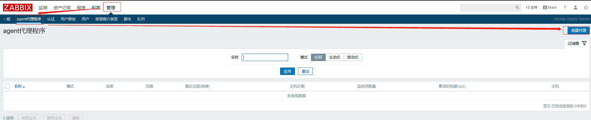

```bash
[root@zabbix-proxy-node2 zabbix-4.0.15]# grep "^[a-Z]" /apps/zabbix_proxy/etc/zabbix_proxy.conf
ProxyMode=1
Server=192.168.100.18
Hostname=suosuoli-zabbix-proxy # 下图中的agent代理程序名填这个
...
```

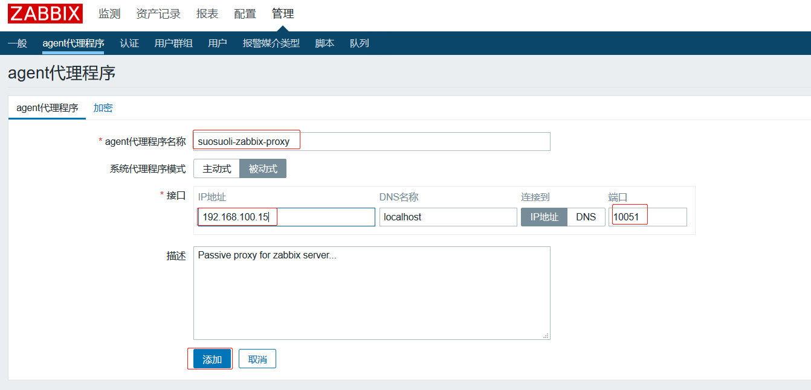

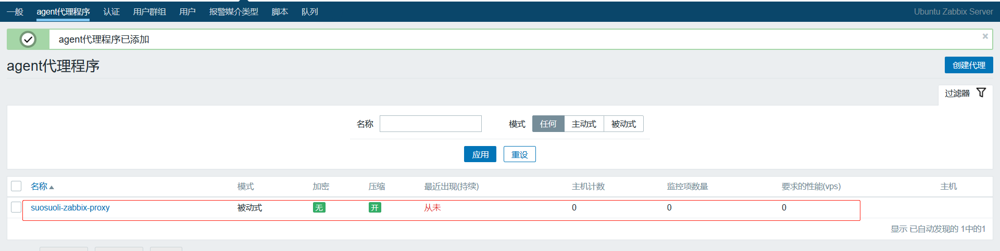

### 3.3.4 配置 zabbix agent

```bash
[root@agent-nobody ~]# vim /apps/zabbix_server/etc/zabbix_agentd.conf

[root@agent-nobody ~]# grep "^[a-Z]" /apps/zabbix_server/etc/zabbix_agentd.conf
LogFile=/tmp/zabbix_agentd.log
Server=192.168.100.18,192.168.100.15
StartAgents=5
ServerActive=127.0.0.1
Hostname=192.168.100.17
Timeout=30

[root@agent-nobody ~]# systemctl restart zabbix-agent.service
```

### 3.3.5 修改 zabbix server 配置文件

修改 zabbix server 向 zabbix 获取监控数据的频率等参数

```bash
root@ubuntu-zabbix-server:~# vim /etc/zabbix/zabbix_server.conf
...
### Option: StartProxyPollers
#       Number of pre-forked instances of pollers for passive proxies.
#
# Mandatory: no
# Range: 0-250
# Default:
StartProxyPollers=20

### Option: ProxyConfigFrequency
#       How often Zabbix Server sends configuration data to a Zabbix Proxy in seconds.
#       This parameter is used only for proxies in the passive mode.
#
# Mandatory: no
# Range: 1-3600*24*7
# Default:
ProxyConfigFrequency=60

### Option: ProxyDataFrequency
#       How often Zabbix Server requests history data from a Zabbix Proxy in seconds.
#       This parameter is used only for proxies in the passive mode.
#
# Mandatory: no
# Range: 1-3600
# Default:
ProxyDataFrequency=60
...

root@ubuntu-zabbix-server:~# systemctl restart zabbix-server.service
```

### 3.3.5 关联被动模板

#### 3.3.5.1 添加主机

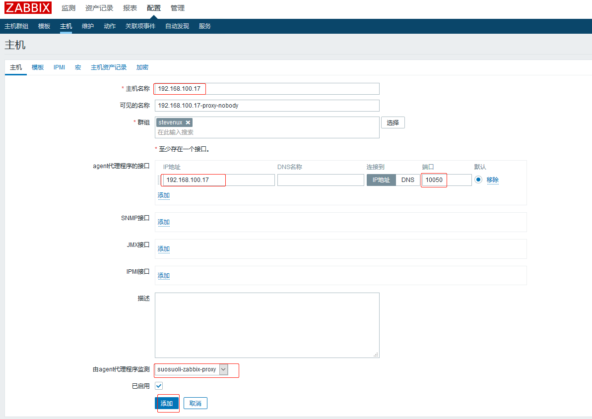

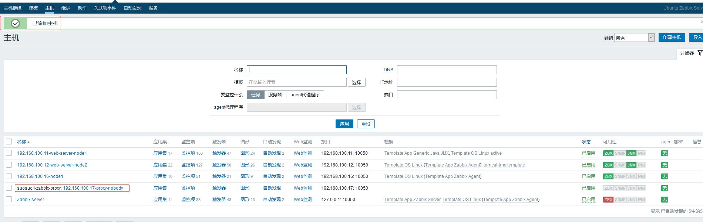

#### 3.3.5.2 关联模板

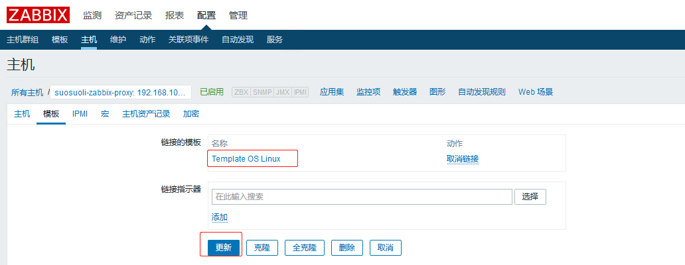

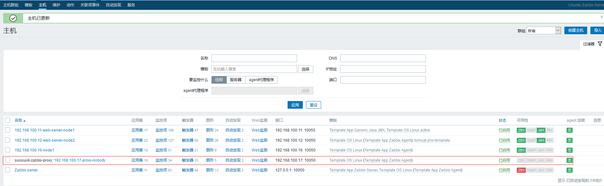

### 3.3.6 验证主机状态

骚等几分钟，就可以看到变绿了:

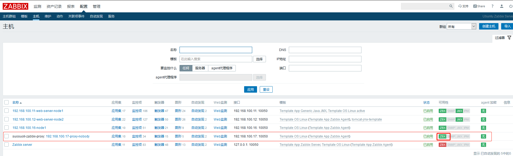

#### 查看 proxy 的连接

```bash
# 192.168.100.17 为zabbix agent
[root@zabbix-proxy-node2 zabbix-4.0.15]# netstat -ntlp | grep 17
tcp        0      0 192.168.100.15:55076    192.168.100.17:10050    TIME_WAIT   -
tcp        0      0 192.168.100.15:55102    192.168.100.17:10050    TIME_WAIT   -
```

#### 查看 java gateway 主机的连接

```bash
# 192.168.100.14 为proxy主动代理
[root@java-gateway ~]# netstat -ntlp | grep -w 14
tcp        0      0 192.168.100.21:45510    192.168.100.14:16379    ESTABLISHED 1784/redis-server 0
tcp        0      0 192.168.100.21:16379    192.168.100.14:39172    ESTABLISHED 1784/redis-server 0
tcp        0      0 192.168.100.13:16379    192.168.100.14:39557    ESTABLISHED 1784/redis-server 0
tcp        0      0 192.168.100.13:16379    192.168.100.14:37007    ESTABLISHED 1784/redis-server 0

# 192.168.100.15 为proxy被动代理
[root@java-gateway ~]# netstat -ntlp | grep -w 15
tcp        0      0 192.168.100.21:16379    192.168.100.15:38181    ESTABLISHED 1784/redis-server 0
tcp        0      0 192.168.100.13:16379    192.168.100.15:38708    ESTABLISHED 1784/redis-server 0
tcp        0      0 192.168.100.21:35719    192.168.100.15:16379    ESTABLISHED 1784/redis-server 0
tcp        0      0 192.168.100.13:16379    192.168.100.15:40860    ESTABLISHED 1784/redis-server 0


# 192.168.100.11 为tomcat web-server-node1
[root@java-gateway ~]# netstat -ntlp | grep -w 11
tcp6       0      0 192.168.100.21:51674    192.168.100.11:40067    ESTABLISHED 23341/java
tcp6       0      0 192.168.100.21:51648    192.168.100.11:40067    TIME_WAIT   -
tcp6       0      0 192.168.100.21:51676    192.168.100.11:40067    ESTABLISHED 23341/java
tcp6       0      0 192.168.100.21:38192    192.168.100.11:12345    ESTABLISHED 23341/java
tcp6       0      0 192.168.100.21:51652    192.168.100.11:40067    TIME_WAIT   -
tcp6       0      0 192.168.100.21:38170    192.168.100.11:12345    TIME_WAIT   -

# 192.168.100.12 为tomcat web-server-node2
[root@java-gateway ~]# netstat -ntlp | grep -w 12
tcp6       0      0 192.168.100.21:34304    192.168.100.12:12345    ESTABLISHED 23341/java
tcp6       0      0 192.168.100.21:53212    192.168.100.12:33006    TIME_WAIT   -
tcp6       0      0 192.168.100.21:53234    192.168.100.12:33006    ESTABLISHED 23341/java
tcp6       0      0 192.168.100.21:53238    192.168.100.12:33006    ESTABLISHED 23341/java
tcp6       0      0 192.168.100.21:34284    192.168.100.12:12345    TIME_WAIT   -
tcp6       0      0 192.168.100.21:53210    192.168.100.12:33006    TIME_WAIT   -
tcp6       0      0 192.168.100.21:34298    192.168.100.12:12345    TIME_WAIT   -
tcp6       0      0 192.168.100.21:34308    192.168.100.12:12345    ESTABLISHED 23341/java
tcp6       0      0 192.168.100.21:34282    192.168.100.12:12345    TIME_WAIT   -
tcp6       0      0 192.168.100.21:34306    192.168.100.12:12345    ESTABLISHED 23341/java
tcp6       0      0 192.168.100.21:53224    192.168.100.12:33006    TIME_WAIT   -
tcp6       0      0 192.168.100.21:53236    192.168.100.12:33006    ESTABLISHED 23341/java
tcp6       0      0 192.168.100.21:53214    192.168.100.12:33006    TIME_WAIT   -
```

### 3.3.7 查看监控数据

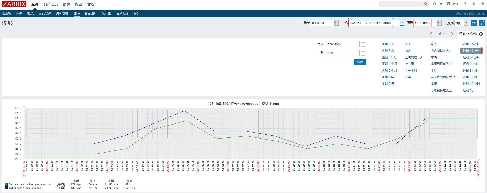

## 3.4 配置主动模式的 proxy

配置并使用主动模式(Active Proxy Mode)的 zabbix proxy 收集 zabbix agent 监控数据

```bash
zabbix server        : 192.168.100.18
zabbix proxy active : 192.168.100.15
web server           : 192.168.100.17
```

### 3.4.1 修改 proxy 配置文件

```bash
[root@zabbix-proxy-node1 ~]# vim /etc/zabbix/zabbix_proxy.conf

[root@zabbix-proxy-node1 ~]# grep "^[a-Z]" /etc/zabbix/zabbix_proxy.conf
ProxyMode=0
Server=192.168.100.18
ServerPort=10051
Hostname=suosuoli-zabbix-proxy-active
ListenPort=10051
LogFile=/var/log/zabbix/zabbix_proxy.log
LogFileSize=0
EnableRemoteCommands=1
PidFile=/var/run/zabbix/zabbix_proxy.pid
SocketDir=/var/run/zabbix
DBHost=192.168.100.16
DBName=zabbix_proxy_active
DBUser=proxy
DBPassword=stevenux
DBPort=3306
ProxyLocalBuffer=720
ProxyOfflineBuffer=720
HeartbeatFrequency=30
ConfigFrequency=10
DataSenderFrequency=5
StartPollers=20
JavaGateway=192.168.100.21
JavaGatewayPort=10052
StartJavaPollers=10
SNMPTrapperFile=/var/log/snmptrap/snmptrap.log
CacheSize=1G
HistoryCacheSize=1G
HistoryIndexCacheSize=128M
Timeout=30
ExternalScripts=/usr/lib/zabbix/externalscripts
LogSlowQueries=3000

```

#### 导入数据到 proxy 的数据库

```bash
[root@zabbix-proxy-node2 zabbix-4.0.15]# mysql -uproxy -pstevenux -h192.168.100.16 zabbix_proxy_active < database/mysql/schema.sql
```

### 3.4.2 重启 proxy

```bash
[root@zabbix-proxy-node1 ~]# systemctl restart zabbix-proxy.service
[root@zabbix-proxy-node1 ~]# systemctl  enable  zabbix-proxy
Created symlink from /etc/systemd/system/multi-user.target.wants/zabbix-proxy.service to /usr/lib/systemd/system/zabbix-proxy.service.
```

### 3.4.3 web 界面添加主动代理

管理-->agent 代理程序-->创建代理：

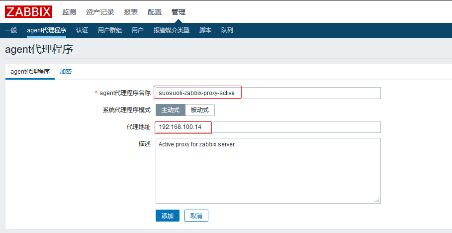

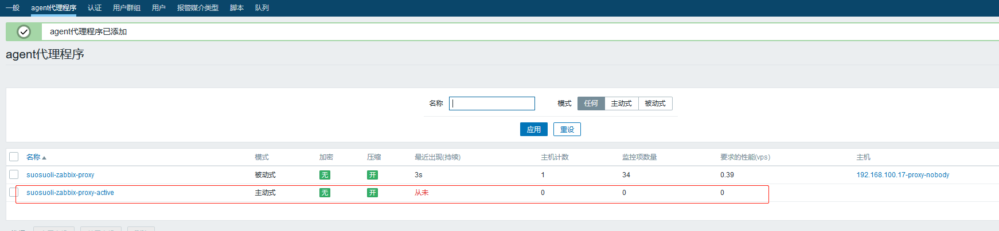

### 3.4.4 配置 agent 使用主动代理

需要修改 zabbix agent 中配置文件 ServerActive 的值为主动模式 zabbix proxy
修改或者新添加一台 zabbix agent，并使用 zabbix 主动模式代理服务器进行监控：

```bash
[root@agent-nobody ~]# vim /apps/zabbix_server/etc/zabbix_agentd.conf

[root@agent-nobody ~]# grep "^[a-Z]" /apps/zabbix_server/etc/zabbix_agentd.conf
LogFile=/tmp/zabbix_agentd.log
EnableRemoteCommands=1
Server=192.168.100.18,192.168.100.15
StartAgents=5
ServerActive=192.168.100.14   # 对应主动代理服务器
Hostname=192.168.100.17
Timeout=30

[root@agent-nobody ~]# systemctl restart zabbix-agent.service
```

### 3.4.5 添加主机

先把被动模式的主机删除，使用该主机配置为主动模式

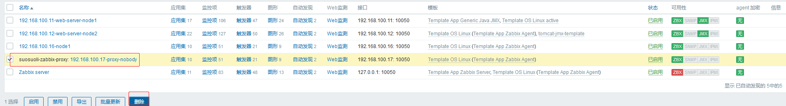

修改配置文件后，添加主机

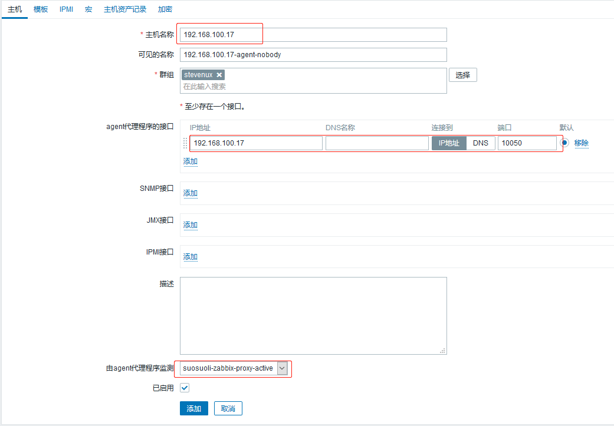

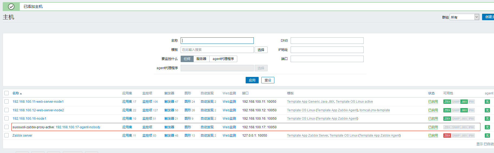

### 3.4.6 关联模板

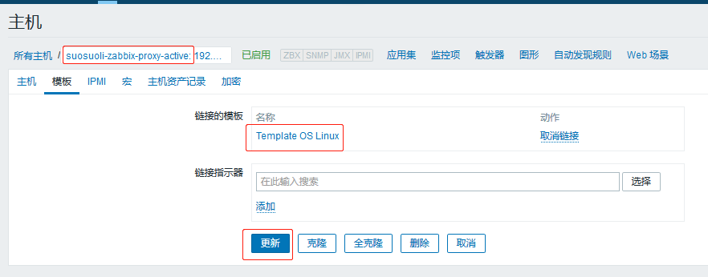

### 3.4.7 web 查看被监控主机状态

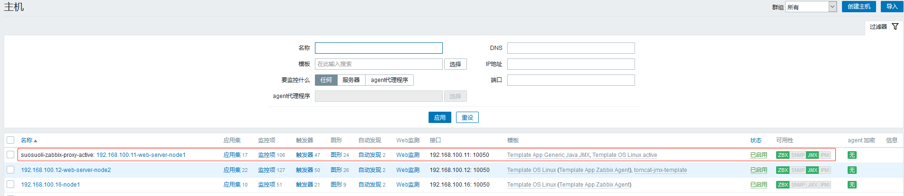

### 3.4.8 验证监控数据

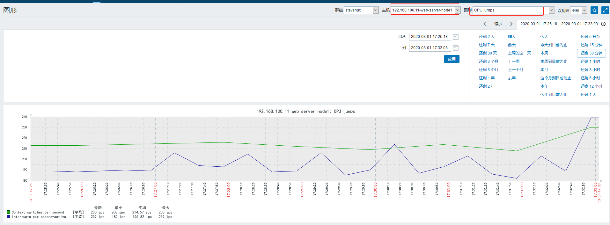

### 3.4.9 通过日志查看交互过程

```bash

```
