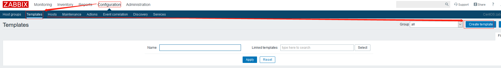
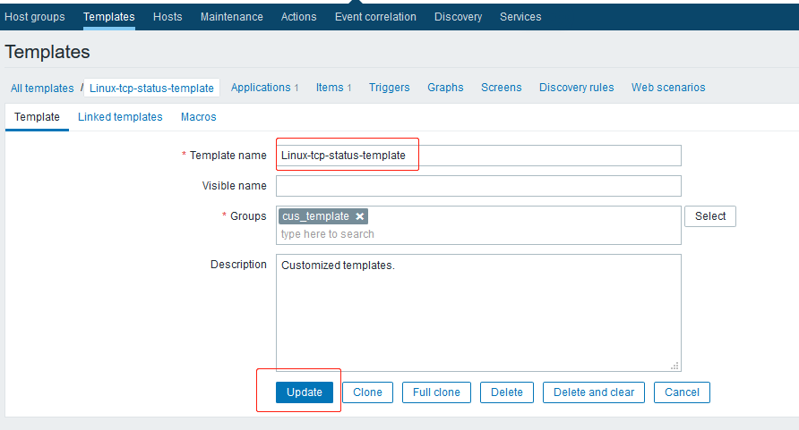
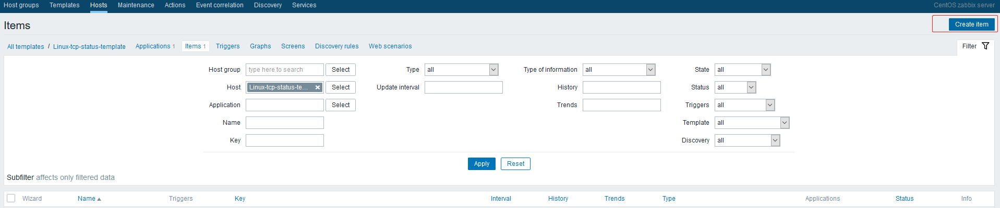
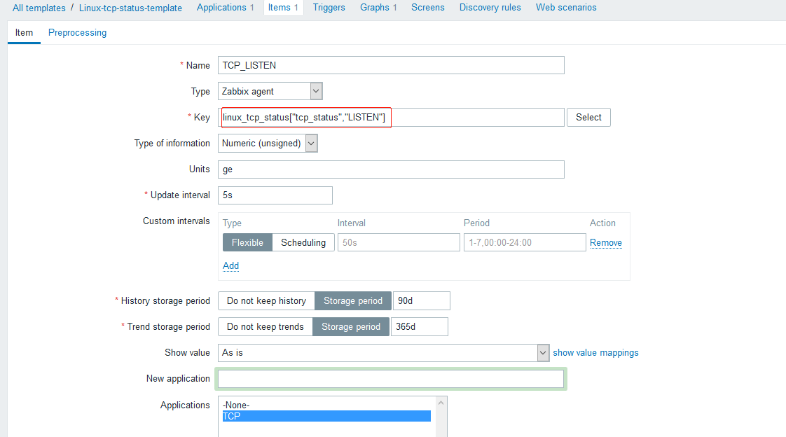
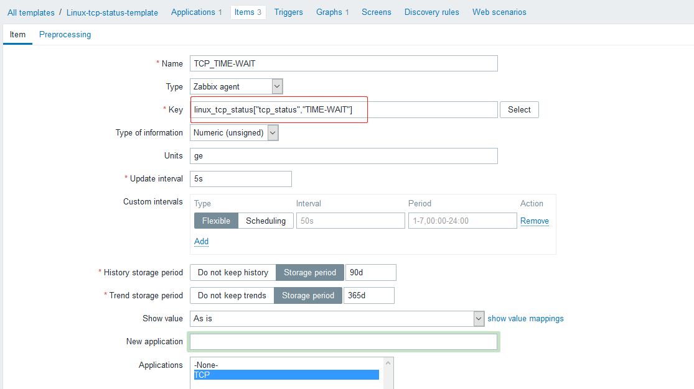
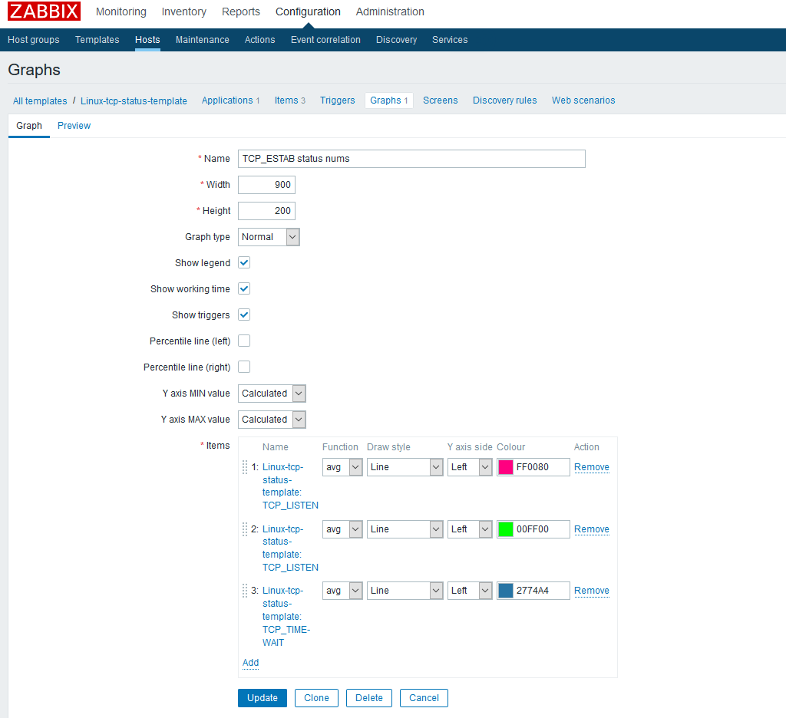
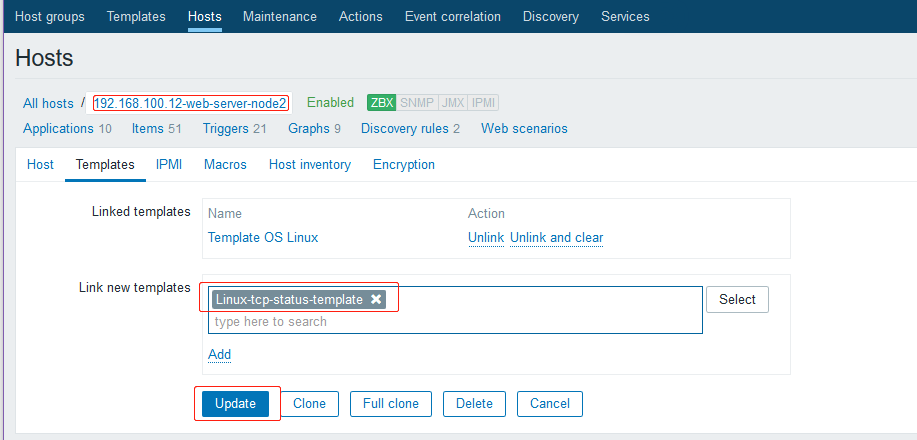
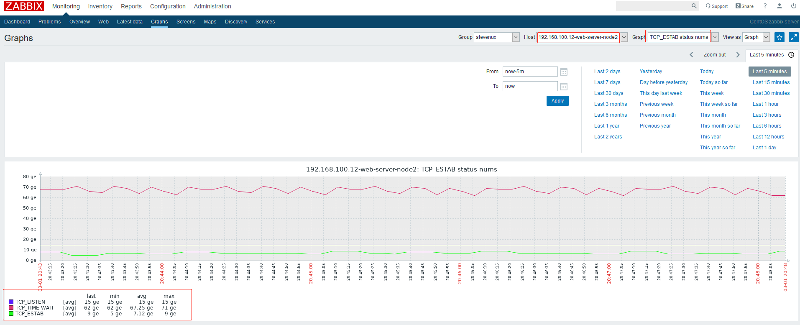

# 一. TCP 连接状态

## 1.1 11 种状态

## 1.2 端口状态转换

## 1.3 TCP 三次握手

## 1.4 TCP 四次挥手

# 二. 监控 TCP 连接状态

## 2.1 编写获取 TCP 状态的脚本

### 编写脚本

```bash
root@ubuntu-zabbix-server:/etc/zabbix/zabbix_agentd.d# vim get_tcp_status.sh
#!/bin/bash
#
# Edited on 2020.03.01 by suosuoli.cn
#
get_status(){
    STAT=$1
    STAT_NU=`ss -ant | \
            awk 'NR!=1{ ++status[$1] }END{ for(stats in status) print stats, status[stats] }' | \
            grep "${STAT}" | \
            awk '{print $2}'`
    if [[ ${STAT_NU} -eq 0 ]]; then
        STAT_NU=0
    fi
    echo ${STAT_NU}
}

main(){
    if [[ $# -eq 0 ]]; then
        echo "Usage: ./`basename $0` tcp_status <ESTAB|LISTEN|...>"
    fi
    case $1 in
        tcp_status)
            get_status $2;
            ;;
    esac
}

main $1 $2
```

### 测试

```bash
root@ubuntu-zabbix-server:/etc/zabbix/zabbix_agentd.d# ./get_tcp_status.sh tcp_status TIME-WAIT
95
root@ubuntu-zabbix-server:/etc/zabbix/zabbix_agentd.d# ./get_tcp_status.sh tcp_status ESTAB
69
root@ubuntu-zabbix-server:/etc/zabbix/zabbix_agentd.d# ./get_tcp_status.sh tcp_status LISTEN
21
root@ubuntu-zabbix-server:/etc/zabbix/zabbix_agentd.d# ./get_tcp_status.sh
Usage: ./get_tcp_status.sh tcp_status <ESTAB|LISTEN|...>
```

## 2.2 在 agent 配置文件添加自定义监控项

zabbix agent 添加自定义监控项并调用脚本获取到监控项数据

````bash
[root@web-server-node2 ~]# ip addr show eth0 | grep inet
    inet 192.168.100.12/24 brd 192.168.100.255 scope global noprefixroute eth0
    inet6 fe80::250:56ff:fe2e:7cd6/64 scope link

[root@web-server-node2 ~]# vim /etc/zabbix/zabbix_agentd.conf
...
### Option: UserParameter
#       User-defined parameter to monitor. There can be several user-defined parameters.
#       Format: UserParameter=<key>,<shell command>
#       See 'zabbix_agentd' directory for examples.
#
# Mandatory: no
# Default:
# 添加监控项和调用的脚本
UserParameter=linux_tcp_status[*],/etc/zabbix/zabbix_agentd.d/get_tcp_status.sh "$1" "$2" ```
...

[root@web-server-node2 ~]# systemctl restart zabbix-agent.service
````

## 2.3 测试自定义监控项

```bash
[root@zabbix-server-compile bin]# ll /apps/zabbix_server/etc/zabbix_agentd.conf.d/get_tcp_status.sh
-rwxr-xr-x 1 root root 524 Mar  1 18:34 /apps/zabbix_server/etc/zabbix_agentd.conf.d/get_tcp_status.sh

[root@zabbix-server-compile bin]# pwd
/apps/zabbix_server/bin
[root@zabbix-server-compile bin]# ./zabbix_get -s 192.168.100.12 -p 10050 -k "linux_tcp_status["tcp_status","LISTEN"]"
15
[root@zabbix-server-compile bin]# ./zabbix_get -s 192.168.100.12 -p 10050 -k "linux_tcp_status["tcp_status","ESTAB"]"
7
```

# 三. 创建模板

## 3.1 在 web 添加自定义监控项

### 创建模板







### 添加自定义监控

添加自定义监控项：






### 创建图形



## 3.2 将自定义模板关联到主机



## 3.3 查看监控数据


