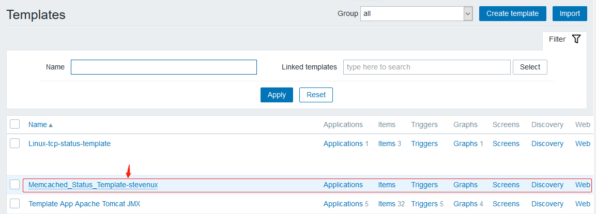
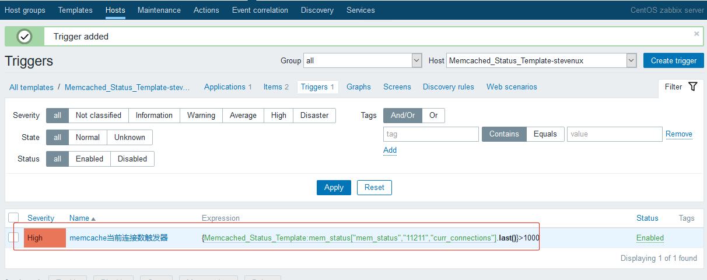

环境：

| zabbix server                 | zabbix agent                    |
| :---------------------------- | :------------------------------ |
| 192.168.100.17:zabbix-server1 | 192.168.100.12:web-server-node2 |

# 一. 安装 memcache 服务

```bash
apt-get install memcached nmap #ubuntu
```

```bash
[root@web-server-node2 ~]# yum install -y memcached nmap

[root@web-server-node2 ~]# vim /etc/sysconfig/memcached
PORT="11211"
USER="memcached"
MAXCONN="1024"
CACHESIZE="64"
OPTIONS=""

[root@web-server-node2 ~]# systemctl restart memcached.service
[root@web-server-node2 ~]# systemctl enable memcached.service
Created symlink from /etc/systemd/system/multi-user.target.wants/memcached.service to /usr/lib/systemd/system/memcached.service.

[root@web-server-node2 ~]# ss -ntl | grep 11211
LISTEN     0      1024         *:11211                    *:*
LISTEN     0      1024      [::]:11211                 [::]:*
[root@web-server-node2 ~]# lsof -i:11211
COMMAND     PID      USER   FD   TYPE DEVICE SIZE/OFF NODE NAME
memcached 16305 memcached   26u  IPv4 525228      0t0  TCP *:memcache (LISTEN)
memcached 16305 memcached   27u  IPv6 525229      0t0  TCP *:memcache (LISTEN)
memcached 16305 memcached   28u  IPv4 525232      0t0  UDP *:memcache
memcached 16305 memcached   29u  IPv6 525233      0t0  UDP *:memcache
```

# 二. 编写监控脚本

写脚本提示:

```bash
[root@web-server-node2 zabbix_agentd.d]# echo -e "stats\nquit" | ncat 127.0.0.1 11211 | grep "STAT"
STAT pid 16305
STAT uptime 1465                 ##########
STAT time 1583149836
STAT version 1.4.15
STAT libevent 2.0.21-stable
STAT pointer_size 64
STAT rusage_user 0.037593        ##########
STAT rusage_system 0.018796      ##########
STAT curr_connections 10         ##########
STAT total_connections 27        ##########
STAT connection_structures 11
STAT reserved_fds 20
STAT cmd_get 0
STAT cmd_set 0
STAT cmd_flush 0
STAT cmd_touch 0
STAT get_hits 0
STAT get_misses 0
STAT delete_misses 0
STAT delete_hits 0
STAT incr_misses 0
STAT incr_hits 0
STAT decr_misses 0
STAT decr_hits 0
STAT cas_misses 0
STAT cas_hits 0
STAT cas_badval 0
STAT touch_hits 0
STAT touch_misses 0
STAT auth_cmds 0
STAT auth_errors 0
STAT bytes_read 189                     ##########
STAT bytes_written 11381                ##########
STAT limit_maxbytes 67108864            ##########
STAT accepting_conns 1                  ##########
STAT listen_disabled_num 0
STAT threads 4                          ##########
STAT conn_yields 0
STAT hash_power_level 16
STAT hash_bytes 524288
STAT hash_is_expanding 0
STAT bytes 0
STAT curr_items 0
STAT total_items 0
STAT expired_unfetched 0
STAT evicted_unfetched 0
STAT evictions 0
STAT reclaimed 0
```

脚本可以这样写，你可以那样写

```bash
[root@web-server-node2 zabbix_agentd.d]# cat get_memcache_status.sh
#!/bin/bash
#
# Edited on 2020.03.02 by suosuoli.cn
#
# ubuntu : apt install nmap  -----> ncat

	# get status
get_memcached_status(){
echo -e "stats\nquit" | ncat 127.0.0.1 "$1" | grep "STAT $2" | awk '{print $3}'
}

main(){
	# prompt usage
    if [[ $# -eq 0 ]]; then
        echo "Usage: `basename $0` get_memcached_status <port> <status>"
    fi

	# install nmap if not installed.
    cat /etc/issue | grep -iq "ubuntu" 2>&1 /dev/null
    if [[ $? -ne 0 ]]; then
        yum install -y nmap &> /dev/null
    else
        apt update &> /dev/null && apt install -y nmap &> /dev/null
    fi

	# get status
    if [[ $1 = "mem_status" ]]; then
        get_memcached_status $2 $3
    fi
}

main $1 $2 $3
```

# 三. 添加和测试自定义监控项

## 3.1 在 agent 的配置文件中添加

在 agent 的配置文件中添加自定义监控，此处将其单独放置于
`/etc/zabbix/zabbix_agentd.d`。

```bash
[root@web-server-node2 zabbix_agentd.d]# pwd
/etc/zabbix/zabbix_agentd.d
[root@web-server-node2 zabbix_agentd.d]# vim customizedParams.conf
###################### Memcached Status Params Start  ##############################
UserParameter=mem_status[*],/etc/zabbix/zabbix_agentd.d/get_memcache_status.sh "$1" "$2" "$3"
```

## 3.2 在 zabbix server 测试

```bash
[root@zabbix-server1 ~]# /apps/zabbix_server/bin/zabbix_get -s 192.168.100.12 -p 10050 -k "mem_status["mem_status","11211","limit_maxbytes"]"
67108864
[root@zabbix-server1 ~]# /apps/zabbix_server/bin/zabbix_get -s 192.168.100.12 -p 10050 -k "mem_status["mem_status","11211","hash_bytes"]"
524288
[root@zabbix-server1 ~]# /apps/zabbix_server/bin/zabbix_get -s 192.168.100.12 -p 10050 -k "mem_status["mem_status","11211","curr_connections"]"
10
[root@zabbix-server1 ~]# /apps/zabbix_server/bin/zabbix_get -s 192.168.100.12 -p 10050 -k "mem_status["mem_status","11211","total_connections"]"
33

```

# 四. 制作监控模板

## 4.1 创建模板

`配置 --> 模板 --> 创建模板`


## 4.2 添加监控项




添加启动时间监控项


添加当前连接数监控项


最终的监控项(界面未汉化)


## 4.3 创建触发器




## 4.4 创建图形


最终的三个图形


# 五. 关联模板并验证

## 5.1 关联模板到 agent 主机


## 5.2 测试数据

### 5.2.1 查看最新数据


### 5.2.2 查看图形


读取的和写入的字节数


memcache 启动的线程和启动时间


memcache 连接数(当前，总共，接受的连接)


