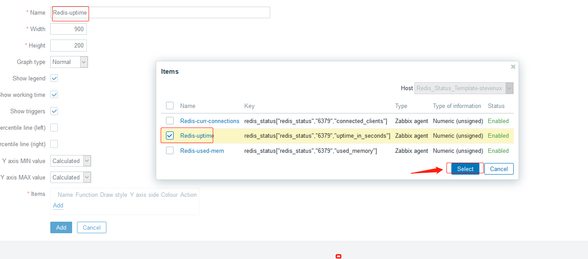

环境:

| zabbix server                 | zabbix agent                    |
| :---------------------------- | :------------------------------ |
| 192.168.100.17:zabbix-server1 | 192.168.100.12:web-server-node2 |

# 一. 安装 redis

```bash
[root@web-server-node2 zabbix_agentd.d]# yum install -y redis

[root@web-server-node2 zabbix_agentd.d]# vim /etc/redis.conf

[root@web-server-node2 zabbix_agentd.d]# grep "^[a-Z]" /etc/redis.conf
bind 0.0.0.0
protected-mode yes
port 6379
tcp-backlog 511
timeout 0
tcp-keepalive 300
daemonize no
supervised no
pidfile /var/run/redis_6379.pid
loglevel notice
logfile /var/log/redis/redis.log
databases 16
save 900 1
save 300 10
save 60 10000
stop-writes-on-bgsave-error yes
rdbcompression yes
rdbchecksum yes
dbfilename dump.rdb
dir /var/lib/redis
slave-serve-stale-data yes
slave-read-only yes
repl-diskless-sync no
repl-diskless-sync-delay 5
repl-disable-tcp-nodelay no
slave-priority 100
appendonly no
appendfilename "appendonly.aof"
appendfsync everysec
no-appendfsync-on-rewrite no
auto-aof-rewrite-percentage 100
auto-aof-rewrite-min-size 64mb
aof-load-truncated yes
lua-time-limit 5000
slowlog-log-slower-than 10000
slowlog-max-len 128
latency-monitor-threshold 0
notify-keyspace-events ""
hash-max-ziplist-entries 512
hash-max-ziplist-value 64
list-max-ziplist-size -2
list-compress-depth 0
set-max-intset-entries 512
zset-max-ziplist-entries 128
zset-max-ziplist-value 64
hll-sparse-max-bytes 3000
activerehashing yes
client-output-buffer-limit normal 0 0 0
client-output-buffer-limit slave 256mb 64mb 60
client-output-buffer-limit pubsub 32mb 8mb 60
hz 10
aof-rewrite-incremental-fsync yes


[root@web-server-node2 zabbix_agentd.d]# systemctl restart redis
[root@web-server-node2 zabbix_agentd.d]# systemctl enable redis
Created symlink from /etc/systemd/system/multi-user.target.wants/redis.service to /usr/lib/systemd/system/redis.service.
[root@web-server-node2 zabbix_agentd.d]# lsof -i:6379
COMMAND     PID  USER   FD   TYPE DEVICE SIZE/OFF NODE NAME
redis-ser 59840 redis    4u  IPv4 600475      0t0  TCP *:6379 (LISTEN)

[root@web-server-node2 zabbix_agentd.d]# redis-cli
127.0.0.1:6379> keys *
(empty list or set)
127.0.0.1:6379> set key1 vaule1
OK
127.0.0.1:6379> keys *
1) "key1"

```

# 二. 编写监控脚本

脚本编写思路：

```bash
# 获取所有信息
[root@web-server-node2 zabbix_agentd.d]# echo -en "INFO \r\n" | ncat 127.0.0.1 6379
$2165
# Server
redis_version:3.2.12
redis_git_sha1:00000000
redis_git_dirty:0
redis_build_id:7897e7d0e13773f
redis_mode:standalone
os:Linux 3.10.0-1062.el7.x86_64 x86_64
arch_bits:64
......

# 获取某条信息
[root@web-server-node2 zabbix_agentd.d]# echo -en "INFO \r\n" | ncat 127.0.0.1 6379 | grep role:
role:master

# 取到该条信息值
[root@web-server-node2 zabbix_agentd.d]# echo -en "INFO \r\n" | ncat 127.0.0.1 6379 | grep role: | awk -F: '{print $2}'
master
```

jiao 本可以这样写：

```bash
[root@web-server-node2 zabbix_agentd.d]# vim get_redis_status.sh
#!/bin/bash
#
# Edited on 2020.03.02 by suosuoli.cn
#


get_redis_status(){
echo -en "INFO \r\n" | ncat 127.0.0.1 $1 | grep -w "$2" | awk -F: '{print $2}'
}

main(){
        # install ncat
    cat /etc/issue | grep -iq "ubuntu"
    [[ $? -ne 0 ]] && yum install nmap-ncat -y &> /dev/null || apt install nmap-ncat -y &> /dev/null

        # prompt usage
    if [[ $# -eq 0 ]]; then
        echo "`basename $0` redis_status <PORT> <STATUS>"
    fi

        # do the f* thing
    if [[ $1 = "redis_status" ]]; then
        get_redis_status $2 $3
    fi
}

main $1 $2 $3

```

# 三. 增加监控项

## 3.1 在 agent 配置文件增加监控项

```bash
[root@web-server-node2 zabbix_agentd.d]# pwd
/etc/zabbix/zabbix_agentd.d
[root@web-server-node2 zabbix_agentd.d]# vim customizedParams.conf
...
###################### Redis Status Params Start  ##############################
#$1 --> redis_status
#$2 --> 6379
#$3 --> uptime_in_seconds|connected_clients|used_memory|used_memory_rss|used_memory_peak|total_connections_received|
#total_commands_processed|total_net_input_bytes|total_net_output_bytes|used_cpu_sys|used_cpu_user|...
UserParameter=redis_status[*],/etc/zabbix/zabbix_agentd.d/get_redis_status.sh "$1" "$2" "$3"

###################### Redis Status Params Stop   ##############################
...

[root@web-server-node2 zabbix_agentd.d]# systemctl restart zabbix-agent.service
```

## 3.2 在 zabbix server 测试获取数据

```bash
[root@zabbix-server1 ~]# /apps/zabbix_server/bin/zabbix_get -s 192.168.100.12 -p 10050 -k "redis_status["redis_status","6379","role"]"
master
[root@zabbix-server1 ~]# /apps/zabbix_server/bin/zabbix_get -s 192.168.100.12 -p 10050 -k "redis_status["redis_status","6379","uptime_in_seconds"]"
2800
[root@zabbix-server1 ~]# /apps/zabbix_server/bin/zabbix_get -s 192.168.100.12 -p 10050 -k "redis_status["redis_status","6379","connected_clients"]"
1
[root@zabbix-server1 ~]# /apps/zabbix_server/bin/zabbix_get -s 192.168.100.12 -p 10050 -k "redis_status["redis_status","6379","used_memory_rss"]"
6029312
[root@zabbix-server1 ~]# /apps/zabbix_server/bin/zabbix_get -s 192.168.100.12 -p 10050 -k "redis_status["redis_status","6379","used_memory"]"
812520

```

# 四. 制作模板

## 4.1 创建模板


## 4.2 创建监控项


## 4.3 创建触发器

### 4.3.1 当前连接数的触发器


### 4.3.2 内存使用触发器

需要将已用内存单位转换，从 G 转换为字节，例如当内存使用达 2G 时就进行触发，则换算方式如下：
`2GB=2*1024(MB)*1024(KB)*1024(B)`


## 4.4 创建图形

### 4.4.1 当前连接数


### 4.4.2 已用内存


### 4.4.3 uptime(play)



# 五. 关联模板测试数据

## 5.1 关联模板到 agent 主机


## 5.2 测试和查看数据

### 5.2.1 最新数据


### 5.2.2 查看看图形形

最终添加的图形


启动时间(没意义)


内存使用


数据流量

