监控 nginx 主要是对 nginx 的活动连接和当前状态等运行状态进行监控

# 一. 部署 nginx

编译安装加编译参数`--with-http_stub_status_module`

```bash
[root@web-server-node2 nginx-1.16.1]# pwd
/usr/local/src/nginx-1.16.1
[root@web-server-node2 nginx-1.16.1]# ll
total 752
drwxr-xr-x 6 jack jack    326 Jan  5 16:11 auto
-rw-r--r-- 1 jack jack 296463 Aug 13  2019 CHANGES
-rw-r--r-- 1 jack jack 452171 Aug 13  2019 CHANGES.ru
drwxr-xr-x 2 jack jack    168 Jan  5 16:11 conf
-rwxr-xr-x 1 jack jack   2502 Aug 13  2019 configure
drwxr-xr-x 4 jack jack     72 Jan  5 16:11 contrib
drwxr-xr-x 2 jack jack     40 Jan  5 16:11 html
-rw-r--r-- 1 jack jack   1397 Aug 13  2019 LICENSE
-rw-r--r-- 1 root root    356 Jan  5 16:19 Makefile
drwxr-xr-x 2 jack jack     21 Jan  5 16:11 man
drwxr-xr-x 4 root root    187 Jan  5 16:19 objs
-rw-r--r-- 1 jack jack     49 Aug 13  2019 README
drwxr-xr-x 9 jack jack     91 Jan  5 16:11 src
[root@web-server-node2 nginx-1.16.1]# pwd
/usr/local/src/nginx-1.16.1
[root@web-server-node2 nginx-1.16.1]# ./configure  --prefix=/apps/nginx --with-http_stub_status_module

[root@web-server-node2 nginx-1.16.1]# make -j4 && make install

[root@web-server-node2 nginx-1.16.1]# ll /apps/nginx/
total 0
drwxr-xr-x 2 root root 333 Mar  2 23:36 conf
drwxr-xr-x 2 root root  40 Mar  2 23:36 html
drwxr-xr-x 2 root root   6 Mar  2 23:36 logs
drwxr-xr-x 2 root root  19 Mar  2 23:36 sbin


[root@web-server-node2 nginx-1.16.1]# vim /apps/nginx/conf/nginx.conf
....
location / {
            root   html;
            index  index.html index.htm;
        }

        location  /nginx_status {
          stub_status;
          allow 172.31.0.0/16;
          allow 127.0.0.1;
        }
...

[root@web-server-node2 nginx-1.16.1]# nginx -t
nginx: the configuration file /apps/nginx/conf/nginx.conf syntax is ok
nginx: configuration file /apps/nginx/conf/nginx.conf test is successful
[root@web-server-node2 nginx-1.16.1]# /apps/nginx/sbin/nginx

[root@web-server-node2 nginx-1.16.1]# curl 127.0.0.1/nginx_status
Active connections: 2
server accepts handled requests
 9 9 33
```

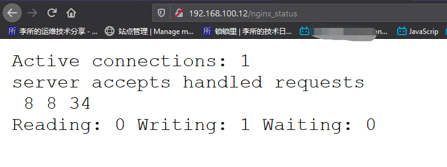

状态解读:

```bash
Active connections：当前处于活动状态的客户端连接数，包括连接等待空闲连接数。
accepts：统计总值，Nginx自启动后已经接受的客户端请求的总数。
handled：统计总值，Nginx自启动后已经处理完成的客户端请求的总数，通常等于
         accepts，除非有因worker_connections限制等被拒绝的连接。
requests：统计总值，Nginx自启动后客户端发来的总的请求数。
Reading：当前状态，正在读取客户端请求报文首部的连接的连接数。
Writing：当前状态，正在向客户端发送响应报文过程中的连接数。
Waiting：当前状态，正在等待客户端发出请求的空闲连接数，开启 keep-alive的情
         况下，这个值等于 active – (reading+writing)
```

# 二. 编写监控脚本

## 2.1 脚本思路

由于每次使用 curl 访问统计时，curl 自身的访问也被统计进 nginx 的
各种状态中，所以不能每次取某个值都使用 curl 访问一次，需要将 curl
的到的信息(`http://127.0.0.1/ngins_status`)保存到某个临时文件，
再取出特定的监控值。

```bash
[root@web-server-node2 ~]# /usr/bin/curl http://192.168.100.12/nginx_status 2> /dev/null
Active connections: 1
server accepts handled requests
 43 43 75
Reading: 0 Writing: 1 Waiting: 0

[root@web-server-node2 ~]# /usr/bin/curl http://192.168.100.12/nginx_status 2> /dev/null | grep -i "active" | awk '{print $3}'

[root@web-server-node2 ~]# /usr/bin/curl http://192.168.100.12/nginx_status 2> /dev/null | grep  "^ [0-9]" | awk '{print $1}'
49
[root@web-server-node2 ~]# /usr/bin/curl http://192.168.100.12/nginx_status 2> /dev/null | grep  "^ [0-9]" | awk '{print $2}'
50
[root@web-server-node2 ~]# /usr/bin/curl http://192.168.100.12/nginx_status 2> /dev/null | grep  "^ [0-9]" | awk '{print $3}'
83
```

## 2.2 编写脚本

```bash
[root@web-server-node2 zabbix_agentd.d]# vim get_nginx_status.sh

#!/bin/bash
#
# Edited on 2020.03.3 by suosuoli.cn
#

if [[ $# -eq 0 ]]; then
    echo "Usage: `basename $0` get_nginx_status.sh STATS"
fi

save_status(){
    /usr/bin/curl http://192.168.100.12/nginx_status 2> /dev/null > /tmp/nginx_status.log
}

get_status(){
case $1 in
    active)
        active_conns=`/usr/bin/cat /tmp/nginx_status.log | grep -i "active" | awk '{print $3}'`;
        echo $active_conns;
;;
    accepts)
        accepts_conns=`/usr/bin/cat /tmp/nginx_status.log | grep  "^ [0-9]" | awk '{print $1}'`;
        echo $accepts_conns;
;;
    handled)
        handled_conns=`/usr/bin/cat /tmp/nginx_status.log | grep  "^ [0-9]" | awk '{print $2}'`;
        echo $handled_conns;
;;
    requests)
        requests_conns=`/usr/bin/cat /tmp/nginx_status.log | grep  "^ [0-9]" | awk '{print $3}'`;
        echo $requests_conns;
;;
    reading)
        reading_conns=`/usr/bin/cat /tmp/nginx_status.log | tail -n1 | awk '{print $2}'`;
        echo $reading_conns;
;;
    writing)
        writing_conns=`/usr/bin/cat /tmp/nginx_status.log | tail -n1 | awk '{print $4}'`;
        echo $writing_conns;
;;
    waiting)
        waiting_conns=`/usr/bin/cat /tmp/nginx_status.log | tail -n1 | awk '{print $6}'`;
        echo $waiting_conns;
esac
}

main(){
    save_status
    get_status $1
}

main $1
```

## 2.3 测试脚本

```bash
[root@web-server-node2 zabbix_agentd.d]# ./get_nginx_status.sh active
1
[root@web-server-node2 zabbix_agentd.d]# ./get_nginx_status.sh requests
130
[root@web-server-node2 zabbix_agentd.d]# ./get_nginx_status.sh requests
131
[root@web-server-node2 zabbix_agentd.d]# ./get_nginx_status.sh requests
132
[root@web-server-node2 zabbix_agentd.d]# ./get_nginx_status.sh accepts
101
[root@web-server-node2 zabbix_agentd.d]# ./get_nginx_status.sh handled
102
[root@web-server-node2 zabbix_agentd.d]# ./get_nginx_status.sh reading
0
[root@web-server-node2 zabbix_agentd.d]# ./get_nginx_status.sh writing
1
[root@web-server-node2 zabbix_agentd.d]# ./get_nginx_status.sh waiting
0
```

# 三. 增加监控项

## 3.1 在 agent 配置文件增加监控项

```bash
[root@web-server-node2 zabbix_agentd.d]# vim customizedParams.conf
...
###################### Nginx Status Params Start   ##############################
#$1 --> active|accepts|handled|requests|reading|writing|waiting
UserParameter=nginx_status[*],/etc/zabbix/zabbix_agentd.d/get_nginx_status.sh "$1"

###################### Nginx Status Params Stop    ##############################
```

## 3.2 在服务器测试获取数据

```bash
[root@zabbix-server1 ~]# ip addr show eth0 | grep inet
    inet 192.168.100.17/24 brd 192.168.100.255 scope global noprefixroute eth0
    inet6 fe80::20c:29ff:feb3:288f/64 scope link

[root@zabbix-server1 ~]# /apps/zabbix_server/bin/zabbix_get  -s 192.168.100.12 -p 10050 -k "nginx_status["active"]"
1
[root@zabbix-server1 ~]# /apps/zabbix_server/bin/zabbix_get  -s 192.168.100.12 -p 10050 -k "nginx_status["requests"]"
138
[root@zabbix-server1 ~]# /apps/zabbix_server/bin/zabbix_get  -s 192.168.100.12 -p 10050 -k "nginx_status["handled"]"
106
[root@zabbix-server1 ~]# /apps/zabbix_server/bin/zabbix_get  -s 192.168.100.12 -p 10050 -k "nginx_status["accepts"]"
106
[root@zabbix-server1 ~]# /apps/zabbix_server/bin/zabbix_get  -s 192.168.100.12 -p 10050 -k "nginx_status["reading"]"
0
[root@zabbix-server1 ~]# /apps/zabbix_server/bin/zabbix_get  -s 192.168.100.12 -p 10050 -k "nginx_status["writing"]"
1
[root@zabbix-server1 ~]# /apps/zabbix_server/bin/zabbix_get  -s 192.168.100.12 -p 10050 -k "nginx_status["waiting"]"
0

```

# 四. 制作模板

## 4.1 创建模板

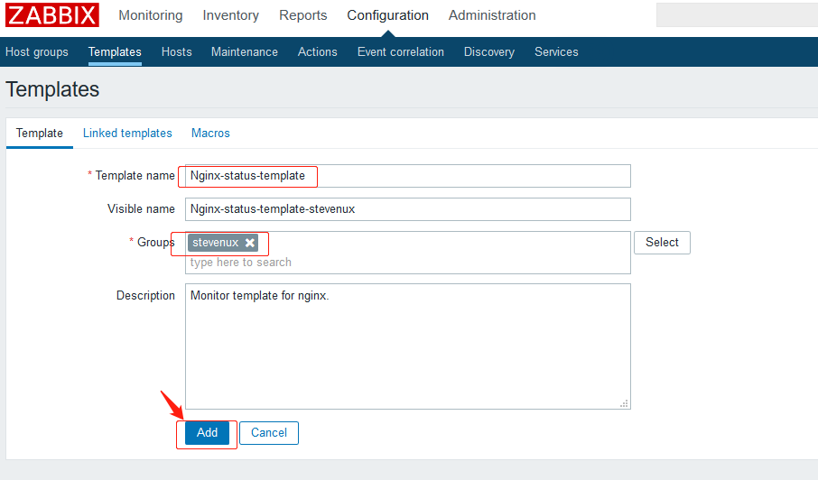

## 4.2 创建监控项

### 4.2.1 active connections

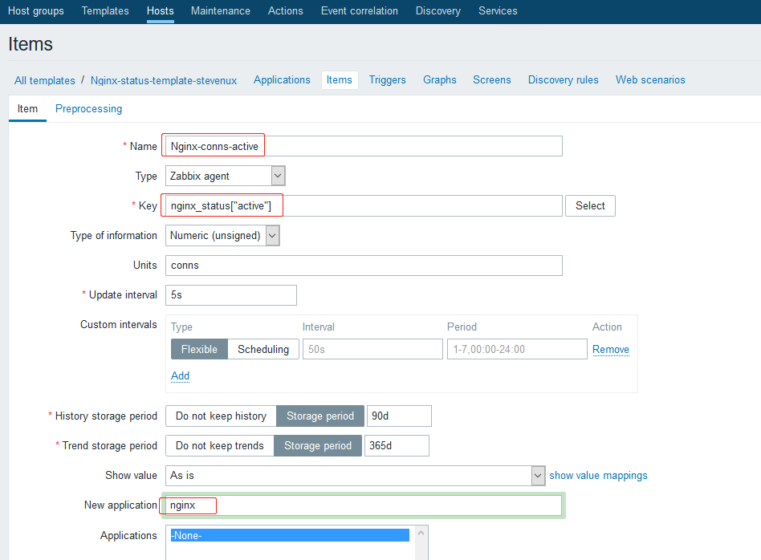

## 4.3 创建触发器

### 4.3.1 active connections

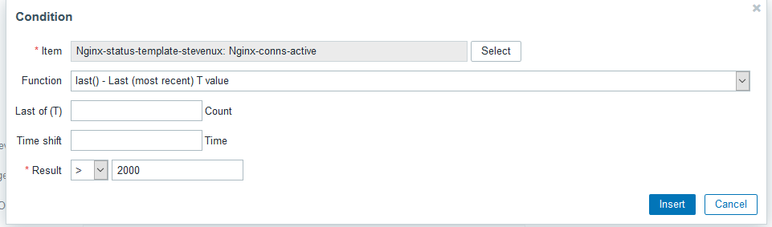
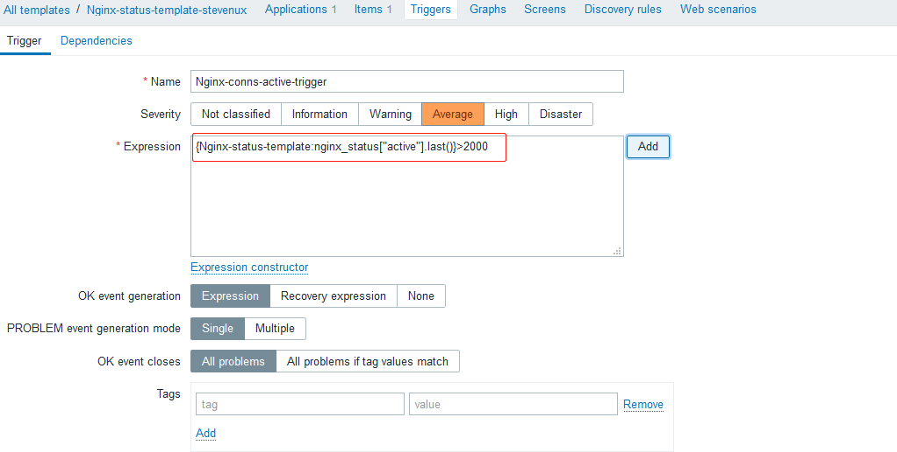

### 4.3.2 accept connections

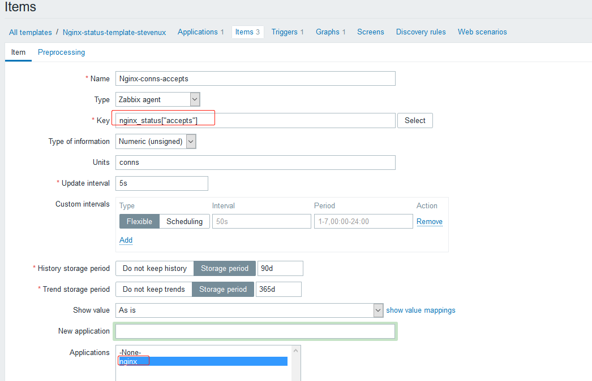

### 4.3.3 handled connections

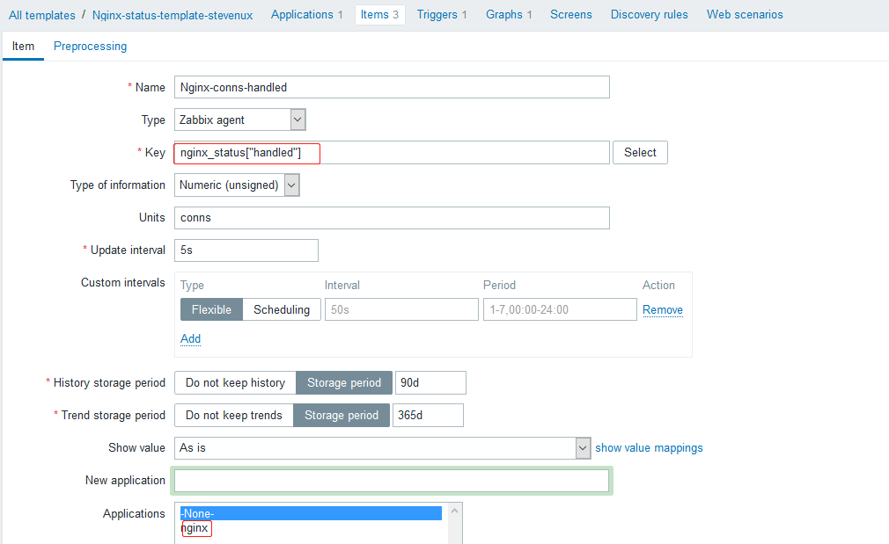

### 4.3.4 requests connections

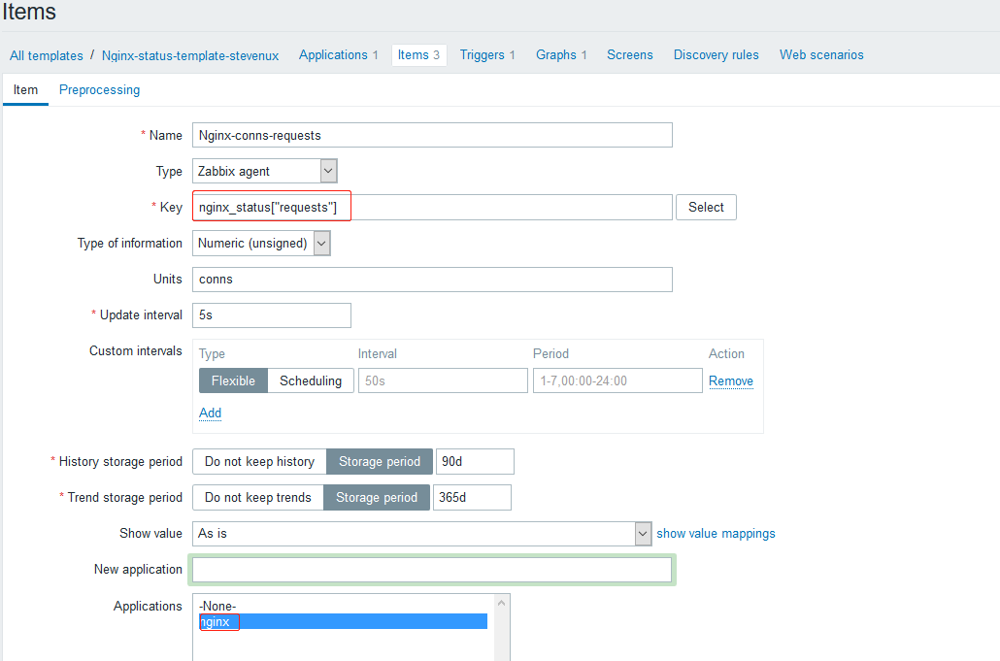

### 4.3.5 reading connections


### 4.3.6 writing connections

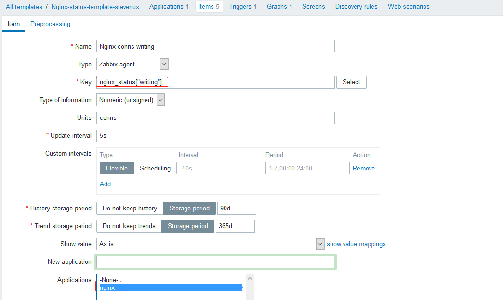

### 4.3.7 waiting connections

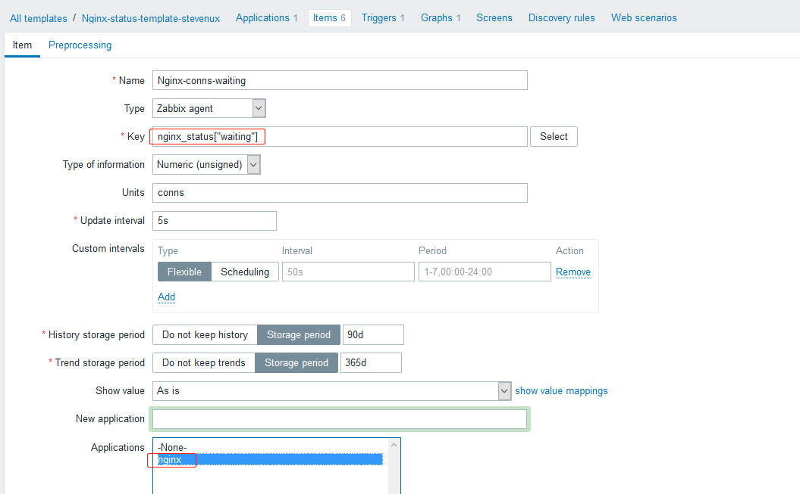

## 4.4 创建图形

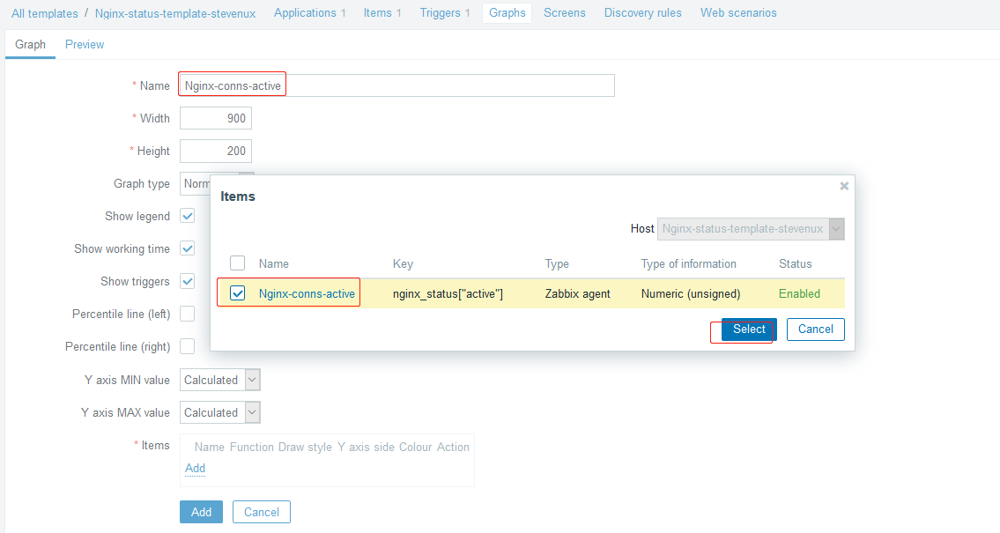

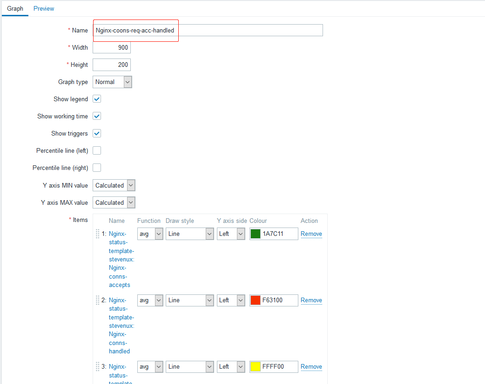

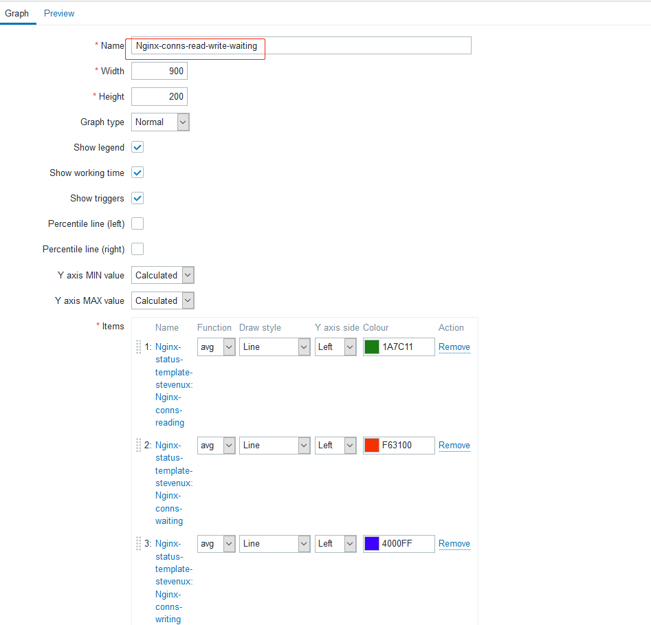

# 五. 关联模板并查看数据

## 5.1 关联模板

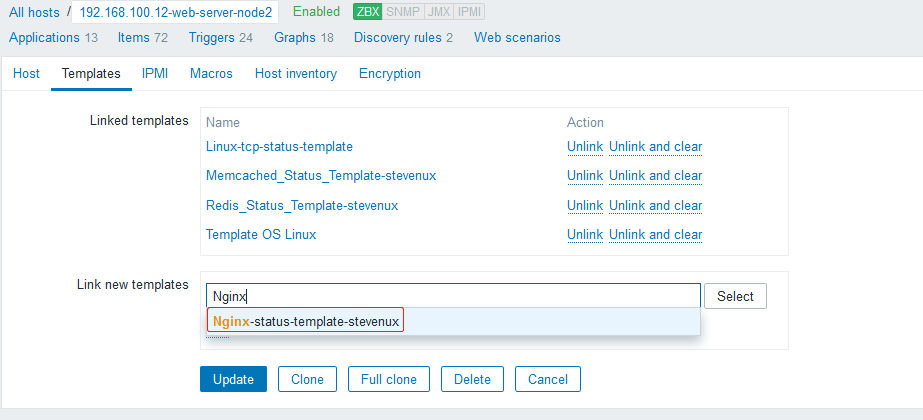

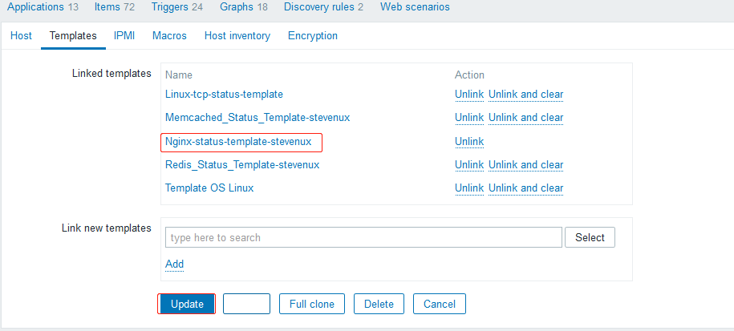

## 5.2 查看数据

### 5.2.1 最新数据

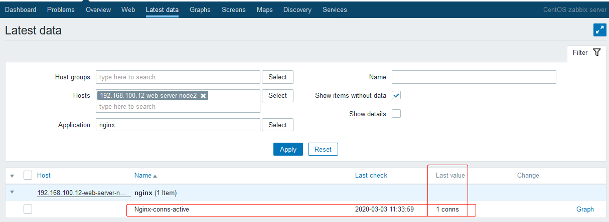

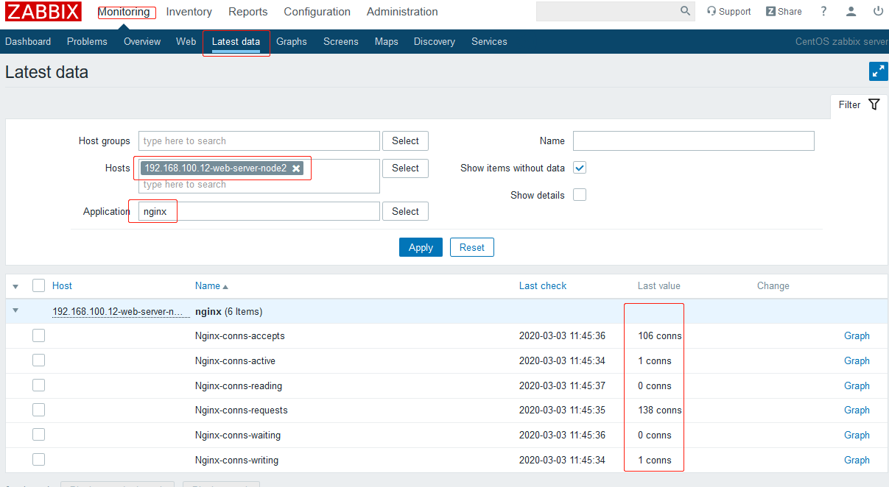

### 5.2.2 查看图形

#### 创建的三个图形

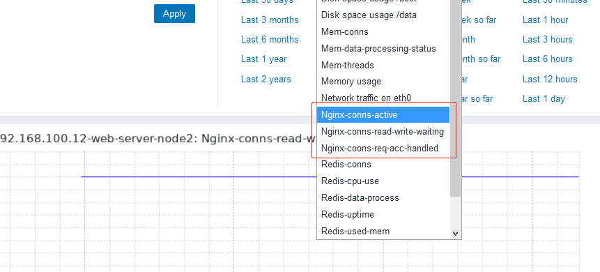

#### 活动连接监控

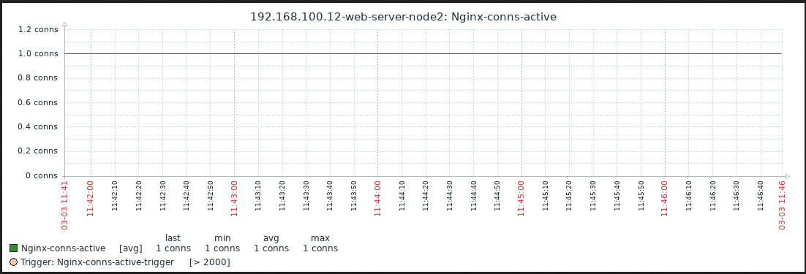

#### 请求、接受和处理的请求监控

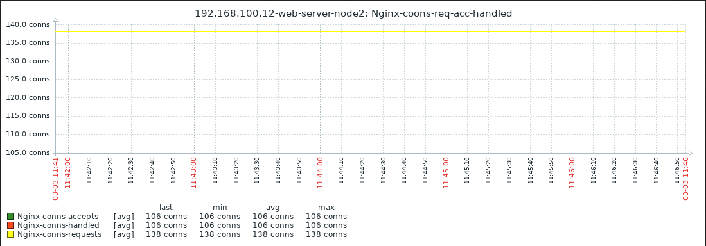

#### 读写和等待的请求监控

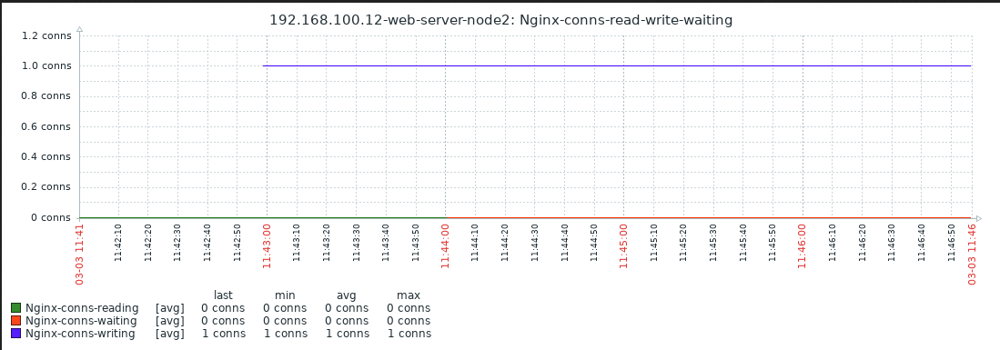
