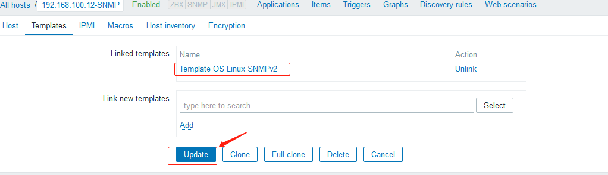

# 一. SNMP 简介

SNMP 是英文"Simple Network Management Protocol"的缩写，中文意思是“简单网络
管理协议"。 SNMP 是一种简单网络管理协议，它属于 TCP/IP 五层协议中的应用层协议，
用于网络管理的协议，SNMP 主要用于网络设备的理。

SNMP 的基本思想：为不同种类的设备、不同厂家生产的设备、不同型号的设备，定义为
一个统一的接口和协议，使得管理员可以是使用统一的外观面对这些需要管理的网络设备
进行管理。通过网络，管理员可以管理位于不同物理空间的设备，从而大大提高网络管理
的效率，简化网络管理员的工作。

SNMP 协议是 TCP/IP 协议簇的一个应用层协议，在 1988 年被制定，并被 Internet 体
系结构委员会（IAB）采纳作为一个短期的网络管理解决方案，由于 SNMP 的简单性，在
Internet 时代得到了蓬勃的发展，1992 年发布了 SNMPv2 版本，以增强 SNMPv1 的安
全性和功能，SNMP 的协议版本目前有 SNMP v1、SNMP v2c 和 SNMP v3 三种版本，其具
体差别如下：

```bash
SNMP v1采用团体名（Community Name）认证，团体名用来定义SNMP NMS和SNMP Agent的
关系，如果SNMP报文携带的团体名没有得到设备的认可，该报文将被丢弃，团体名起到了类
似于密码的作用，用来限制 SNMP NMS对SNMP Agent的访问。

SNMP v2c也采用团体名认证，它在兼容SNMP v1的同时又扩充了SNMP v1的功能，它提供了
更多的操作类型（GetBulk和InformRequest）、支持更多的数据类型（Counter64等）、
提供了更丰富的错误代码且能够更细致地区分错误。

SNMP v3提供了基于用户的安全模型（USM，User-Based Security Model）的认证机制，用
户可以设置认证和加密功能，认证用于验证报文发送方的合法性，避免非法用户的访问，加密
则是对NMS和Agent之间的传输报文进行加密，以免被窃听。通过有无认证和有无加密等功能组
合，可以为SNMP NMS和SNMP Agent之间的通信提供更高的安全性。
```

## 1.1 SNMP 角色

在 SNMP 协议网络中存在两种角色分为 NMS 和 Agent:

```bash
NMS（Network Management Station，网络管理站）是运行SNMP客户端管理程序的工作站，
能够提供非常友好的人机交互界面，方便网络管理员完成绝大多数的网络管理工作。

Agent是驻留在设备上的一个进程，负责接收、处理来自NMS的请求报文。在一些紧急情况下，
如接口状态发生改变等，Agent也会主动通知NMS。

NMS是SNMP网络的管理者，Agent是SNMP网络的被管理者。NMS和Agent之间通过SNMP协议来
交互管理信息。
```

## 1.2 SNMP 数据交互

SNMP 管理进程与代理进程之前为了交互信息，定义了 5 种报文：

```bash
get-request操作：     从代理进程处提取一个或多个参数值。
get-response操作：    返回的一个或多个参数值。这个操作是由代理进程发出的。
trap操作：            代理进程主动发出的报文，通知管理进程有某些事情发生。
get-next-request操作：从代理进程处提取一个或多个参数的下一个参数值。
set-request操作：     设置代理进程的一个或多个参数值。
```


## 1.3 SNMP 组成

一套完整的 SNMP 系统主要包括以下几个方面：

```bash
1. SNMP报文协议
2. 管理信息结构（SMI， Structure ofManagement Information），一套公用的
   结构和表示符号。
3. 管理信息库（MIB，Management Information Base），管理信息库包含所有代理
   进程的所有可被查询和修改的参数。
4. OID（Object Identifiers），一个OID是一个唯一的键值对，用于标识具体某一个
   设备的某个具体信息(对象标识)，如端口信息、设备名称等。
```

## 1.4 SNMP MIB

所谓(MIB)管理信息库，就是所有代理进程包含的、并且能够被管理进程进行查询和
设置的信息的集合。MIB 是基于对象标识树的，对象标识是一个整数序列，中间以"."
分割，这些整数构成一个树型结构，类似于 DNS 或 Unix 的文件系统，MIB 被划分为
若干个组，如 system、 interfaces、 at（地址转换）和 ip 组等。.iso .org .dod
.internet .private .enterprises（1.3.6.1.4.1）这个标识，是给厂家自定义而
预留的，比如华为的为 `1.3.6.1.4.1.2011`，华三的为 `1.3.6.1.4.1.25506`。

SNMP 的管理信息库采用和域名系统 DNS 相似的树型结构，它的根在最上面(iso 上面
无名字)。下图画的是管理信息库的一部分，它又称为对象命名树（objectnamingtree）:


## 1.5 SNMP 实现

在具体实现上，SNMP 为管理员提供了一个网管平台(NMS)，负责网管命令的发出、
数据存储、及数据分析。被监管的设备上运行一个 SNMP 代理(Agent)，代理实
现设备与管理站的 SNMP 通信。


管理站与代理端通过 MIB 进行接口统一，MIB 定义了设备中的被管理对象。管理
站和代理都实现了相应的 MIB 对象，使得双方可以识别对方的数据，实现通信。管
理站向代理申请 MIB 中定义的数据，代理识别后，将管理设备提供的相关状态或参
数等数据转换为 MIB 定义的格式，应答给管理站，完成一次管理操作。

# 二. 基于 CentOS 的 SNMP

安装 SNMP(CentOS 7.x)：

```bash
[root@web-server-node2 zabbix_agentd.d]# yum install -y net-snmp

[root@web-server-node2 zabbix_agentd.d]# vim /etc/snmp/snmpd.conf
...
####
# First, map the community name "public" into a "security name"

#       sec.name  source          community
#
# 设置团体名，改为stevenux
com2sec notConfigUser  default       stevenux

####
# Second, map the security name into a group name:

# 将团体名称notConfigUser 关联至组 notConfigGroup，使用v2c安全模型
#       groupName      securityModel securityName
group   notConfigGroup v1            notConfigUser
group   notConfigGroup v2c           notConfigUser

####
# Third, create a view for us to let the group have rights to:

# Make at least  snmpwalk -v 1 localhost -c public system fast again.

# 创建一个view，并对其授权可访问的OID范围
#       name          incl/excl  subtree             mask(optional)
view    systemview    included   .1.3.6.1.2.1.1
view    systemview    included   .1.3.6.1.2.1.25.1.1

# 自定义授权，否则zabbix server无法获取数据
view    systemview    included   .1.

####
# Finally, grant the group read-only access to the systemview view.

#将组notConfigGroup关联至systemview  从而完成对组的授权
#       group          context sec.model sec.level prefix read       write  notif
access  notConfigGroup ""      any       noauth    exact  systemview none   none
...

# 重启snmpd
[root@web-server-node2 zabbix_agentd.d]# systemctl restart snmpd
```

## 2.1 SNMP OID

`OID:Object Identifier`
测试 OID:使用 snmpwalk 工具测试 OID。snmpwalk 是使用 SNMP 协议的工具，
它使用 SNMP 的 GET 请求查询指定 OID（SNMP 协议中的对象标识）入口的所有
OID 树信息，并显示给用户。通过 snmpwalk 也可以查看支持 SNMP 协议（可网管）
的设备的一些其他信息，比如 cisco 交换机或路由器 IP 地址、内存使用率等，也
可用来协助开发 SNMP 功能。要使用 snmpwalk 需要先安装 `net-snmp-utils` 软件包:

```bash
[root@web-server-node2 zabbix_agentd.d]# yum install net-snmp-utils
[root@web-server-node2 zabbix_agentd.d]# snmpwalk -h
USAGE: snmpwalk [OPTIONS] AGENT [OID]

  Version:  5.7.2
  Web:      http://www.net-snmp.org/
  Email:    net-snmp-coders@lists.sourceforge.net

OPTIONS:
–h：显示帮助
–v：指定snmp的版本, 1或者2c或者3
–c：指定连接设备SNMP密码
–V：显示当前snmpwalk命令行版本
–r：指定重试次数，默认为0次
–t：指定每次请求的等待超时时间，单为秒，默认为3秒
–l：指定安全级别：noAuthNoPriv|authNoPriv|authPriv
–a：验证协议：MD5|SHA。只有-l指定为authNoPriv或authPriv时才需要
–A：验证字符串。只有-l指定为authNoPriv或authPriv时才需要
–x：加密协议：DES。只有-l指定为authPriv时才需要
–X：加密字符串。只有-l指定为authPriv时才需要
```

## 2.2 CentOS 可用的 SNMP OID 值

```bash
CPU 负载：
1 minute Load:  .1.3.6.1.4.1.2021.10.1.3.1
5 minute Load:  .1.3.6.1.4.1.2021.10.1.3.2
15 minute Load: .1.3.6.1.4.1.2021.10.1.3.3

内存使用：
Total Swap Size:      .1.3.6.1.4.1.2021.4.3.0
Available Swap Space: .1.3.6.1.4.1.2021.4.4.0
Total RAM in machine: .1.3.6.1.4.1.2021.4.5.0
Total RAM used:       .1.3.6.1.4.1.2021.4.6.0
Total RAM Free:       .1.3.6.1.4.1.2021.4.11.0
Total RAM Shared:     .1.3.6.1.4.1.2021.4.13.0
Total RAM Buffered:   .1.3.6.1.4.1.2021.4.14.0
Total Cached Memory:  .1.3.6.1.4.1.2021.4.15.0

硬盘使用：
Path where the disk is mounted:       .1.3.6.1.4.1.2021.9.1.2.1
Path of the device for the partition: .1.3.6.1.4.1.2021.9.1.3.1
Total size of the disk/partion (kBytes): .1.3.6.1.4.1.2021.9.1.6.1
Available space on the disk:          .1.3.6.1.4.1.2021.9.1.7.1
Used space on the disk:               .1.3.6.1.4.1.2021.9.1.8.1
Percentage of space used on disk:     .1.3.6.1.4.1.2021.9.1.9.1
Percentage of inodes used on disk:    .1.3.6.1.4.1.2021.9.1.10.1

系统信息：
sysDescr    1.3.6.1.2.1.1.1
sysObjectID 1.3.6.1.2.1.1.2
sysUpTime   1.3.6.1.2.1.1.3
sysContact  1.3.6.1.2.1.1.4
sysName     1.3.6.1.2.1.1.5

CPU 信息：
percentage of user CPU time:    .1.3.6.1.4.1.2021.11.9.0
raw user cpu time:   .1.3.6.1.4.1.2021.11.50.0
percentages of system CPU time: .1.3.6.1.4.1.2021.11.10.0
raw system cpu time: .1.3.6.1.4.1.2021.11.52.0
percentages of idle CPU time:   .1.3.6.1.4.1.2021.11.11.0
raw idle cpu time:   .1.3.6.1.4.1.2021.11.53.0
raw nice cpu time:   .1.3.6.1.4.1.2021.11.51.0
```

## 2.3 测试 SNMP 数据采集

使用 snmpwalk 测试能否通过 SNMP 协议采集数据：

```bash
# CPU 负载 1 minute load
[root@web-server-node2 ~]# snmpwalk -v 2c -c stevenux 192.168.100.12 .1.3.6.1.4.1.2021.10.1.3.1
UCD-SNMP-MIB::laLoad.1 = STRING: 1.63

# CPU 负载 5 minute load
[root@web-server-node2 ~]# snmpwalk -v 2c -c stevenux 192.168.100.12 .1.3.6.1.4.1.2021.10.1.3.2
UCD-SNMP-MIB::laLoad.2 = STRING: 1.46

# CPU 负载 15 minute load
[root@web-server-node2 ~]# snmpwalk -v 2c -c stevenux 192.168.100.12 .1.3.6.1.4.1.2021.10.1.3.3
UCD-SNMP-MIB::laLoad.3 = STRING: 1.28
```

## 2.4 在 zabbix web 添加 SNMP 被监控主机

### 2.4.1 添加主机

```bash
[root@web-server-node2 zabbix_agentd.d]# ip addr show eth0 | grep inet
    inet 192.168.100.12/24 brd 192.168.100.255 scope global noprefixroute eth0
    inet6 fe80::250:56ff:fe2e:7cd6/64 scope link
[root@web-server-node2 zabbix_agentd.d]# lsof -i:161
COMMAND   PID USER   FD   TYPE  DEVICE SIZE/OFF NODE NAME
snmpd   19259 root    6u  IPv4 2219204      0t0  UDP *:snmp
```


### 2.4.2 关联模板




## 2.5 验证主机状态

zabbix server 未安装`fping`


```bash
[root@zabbix-server1 ~]# yum install fping -y
[root@zabbix-server1 ~]# which fping
/usr/sbin/fping

[root@zabbix-server1 ~]# systemctl restart zabbix-server

[root@zabbix-server1 ~]# fping 192.168.100.12
192.168.100.12 is alive
```


## 2.6 查看监控数据


